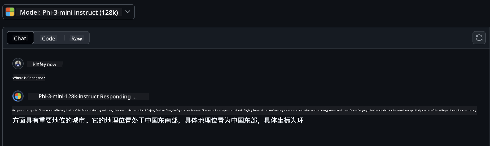
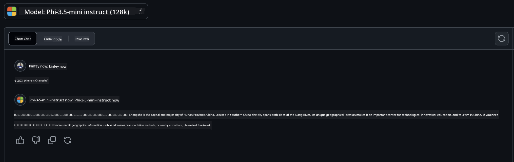

<!--
CO_OP_TRANSLATOR_METADATA:
{
  "original_hash": "124ad36cfe96f74038811b6e2bb93e9d",
  "translation_date": "2025-06-26T01:24:15+00:00",
  "source_file": "19-slm/README.md",
  "language_code": "en"
}
-->

Models is the most direct way. You can quickly access the Phi-3/3.5-Instruct model through GitHub Models. Combined with the Azure AI Inference SDK / OpenAI SDK, you can access the API through code to complete the Phi-3/3.5-Instruct call. You can also test different effects through Playground. - Demo: Comparison of the effects of Phi-3-mini and Phi-3.5-mini in Chinese scenarios   **Azure AI Studio** Or if we want to use the vision and MoE models, you can use Azure AI Studio to complete the call. If you are interested, you can read the Phi-3 Cookbook to learn how to call Phi-3/3.5 Instruct, Vision, MoE through Azure AI Studio [Click this link](https://github.com/microsoft/Phi-3CookBook/blob/main/md/02.QuickStart/AzureAIStudio_QuickStart.md?WT.mc_id=academic-105485-koreyst) **NVIDIA NIM** In addition to the cloud-based Model Catalog solutions provided by Azure and GitHub, you can also use [Nivida NIM](https://developer.nvidia.com/nim?WT.mc_id=academic-105485-koreyst) to complete related calls. You can visit NIVIDA NIM to complete the API calls of the Phi-3/3.5 Family. NVIDIA NIM (NVIDIA Inference Microservices) is a set of accelerated inference microservices designed to help developers deploy AI models efficiently across various environments, including clouds, data centers, and workstations. Here are some key features of NVIDIA NIM: - **Ease of Deployment:** NIM allows for the deployment of AI models with a single command, making it straightforward to integrate into existing workflows. - **Optimized Performance:** It leverages NVIDIA’s pre-optimized inference engines, such as TensorRT and TensorRT-LLM, to ensure low latency and high throughput. - **Scalability:** NIM supports autoscaling on Kubernetes, enabling it to handle varying workloads effectively. - **Security and Control:** Organizations can maintain control over their data and applications by self-hosting NIM microservices on their own managed infrastructure. - **Standard APIs:** NIM provides industry-standard APIs, making it easy to build and integrate AI applications like chatbots, AI assistants, and more. NIM is part of NVIDIA AI Enterprise, which aims to simplify the deployment and operationalization of AI models, ensuring they run efficiently on NVIDIA GPUs. - Demo: Using Nividia NIM to call Phi-3.5-Vision-API [[Click this link](../../../19-slm/python/Phi-3-Vision-Nividia-NIM.ipynb)] ### Inference Phi-3/3.5 in local env Inference in relation to Phi-3, or any language model like GPT-3, refers to the process of generating responses or predictions based on the input it receives. When you provide a prompt or question to Phi-3, it uses its trained neural network to infer the most likely and relevant response by analyzing patterns and relationships in the data it was trained on. **Hugging Face Transformer** Hugging Face Transformers is a powerful library designed for natural language processing (NLP) and other machine learning tasks. Here are some key points about it: 1. **Pretrained Models**: It provides thousands of pretrained models that can be used for various tasks such as text classification, named entity recognition, question answering, summarization, translation, and text generation. 2. **Framework Interoperability**: The library supports multiple deep learning frameworks, including PyTorch, TensorFlow, and JAX. This allows you to train a model in one framework and use it in another. 3. **Multimodal Capabilities**: Besides NLP, Hugging Face Transformers also supports tasks in computer vision (e.g., image classification, object detection) and audio processing (e.g., speech recognition, audio classification). 4. **Ease of Use**: The library offers APIs and tools to easily download and fine-tune models, making it accessible for both beginners and experts. 5. **Community and Resources**: Hugging Face has a vibrant community and extensive documentation, tutorials, and guides to help users get started and make the most of the library. [official documentation](https://huggingface.co/docs/transformers/index?WT.mc_id=academic-105485-koreyst) or their [GitHub repository](https://github.com/huggingface/transformers?WT.mc_id=academic-105485-koreyst). This is the most commonly used method, but it also requires GPU acceleration. After all, scenes such as Vision and MoE require a lot of calculations, which will be very limited in the CPU if they are not quantized. - Demo: Using Transformer to call Phi-3.5-Instuct [Click this link](../../../19-slm/python/phi35-instruct-demo.ipynb) - Demo: Using Transformer to call Phi-3.5-Vision [Click this link](../../../19-slm/python/phi35-vision-demo.ipynb) - Demo: Using Transformer to call Phi-3.5-MoE [Click this link](../../../19-slm/python/phi35_moe_demo.ipynb) **Ollama** [Ollama](https://ollama.com/?WT.mc_id=academic-105485-koreyst) is a platform designed to make it easier to run large language models (LLMs) locally on your machine. It supports various models like Llama 3.1, Phi 3, Mistral, and Gemma 2, among others. The platform simplifies the process by bundling model weights, configuration, and data into a single package, making it more accessible for users to customize and create their own models. Ollama is available for macOS, Linux, and Windows. It’s a great tool if you’re looking to experiment with or deploy LLMs without relying on cloud services. Ollama is the most direct way, you just need to execute the following statement. ```bash

ollama run phi3.5

``` **ONNX Runtime for GenAI** [ONNX Runtime](https://github.com/microsoft/onnxruntime-genai?WT.mc_id=academic-105485-koreyst) is a cross-platform inference and training machine-learning accelerator. ONNX Runtime for Generative AI (GENAI) is a powerful tool that helps you run generative AI models efficiently across various platforms. ## What is ONNX Runtime? ONNX Runtime is an open-source project that enables high-performance inference of machine learning models. It supports models in the Open Neural Network Exchange (ONNX) format, which is a standard for representing machine learning models.ONNX Runtime inference can enable faster customer experiences and lower costs, supporting models from deep learning frameworks such as PyTorch and TensorFlow/Keras as well as classical machine learning libraries such as scikit-learn, LightGBM, XGBoost, etc. ONNX Runtime is compatible with different hardware, drivers, and operating systems, and provides optimal performance by leveraging hardware accelerators where applicable alongside graph optimizations and transforms ## What is Generative AI? Generative AI refers to AI systems that can generate new content, such as text, images, or music, based on the data they have been trained on. Examples include language models like GPT-3 and image generation models like Stable Diffusion. ONNX Runtime for GenAI library provides the generative AI loop for ONNX models, including inference with ONNX Runtime, logits processing, search and sampling, and KV cache management. ## ONNX Runtime for GENAI ONNX Runtime for GENAI extends the capabilities of ONNX Runtime to support generative AI models. Here are some key features: - **Broad Platform Support:** It works on various platforms, including Windows, Linux, macOS, Android, and iOS. - **Model Support:** It supports many popular generative AI models, such as LLaMA, GPT-Neo, BLOOM, and more. - **Performance Optimization:** It includes optimizations for different hardware accelerators like NVIDIA GPUs, AMD GPUs, and more2. - **Ease of Use:** It provides APIs for easy integration into applications, allowing you to generate text, images, and other content with minimal code - Users can call a high level generate() method, or run each iteration of the model in a loop, generating one token at a time, and optionally updating generation parameters inside the loop. - ONNX runtime also has support for greedy/beam search and TopP, TopK sampling to generate token sequences and built-in logits processing like repetition penalties. You can also easily add custom scoring. ## Getting Started To get started with ONNX Runtime for GENAI, you can follow these steps: ### Install ONNX Runtime: ```Python
pip install onnxruntime
``` ### Install the Generative AI Extensions: ```Python
pip install onnxruntime-genai
``` ### Run a Model: Here’s a simple example in Python: ```Python
import onnxruntime_genai as og

model = og.Model('path_to_your_model.onnx')

tokenizer = og.Tokenizer(model)

input_text = "Hello, how are you?"

input_tokens = tokenizer.encode(input_text)

output_tokens = model.generate(input_tokens)

output_text = tokenizer.decode(output_tokens)

print(output_text) 
``` ### Demo: Using ONNX Runtime GenAI to call Phi-3.5-Vision ```python

import onnxruntime_genai as og

model_path = './Your Phi-3.5-vision-instruct ONNX Path'

img_path = './Your Image Path'

model = og.Model(model_path)

processor = model.create_multimodal_processor()

tokenizer_stream = processor.create_stream()

text = "Your Prompt"

prompt = "<|user|>\n"

prompt += "<|image_1|>\n"

prompt += f"{text}<|end|>\n"

prompt += "<|assistant|>\n"

image = og.Images.open(img_path)

inputs = processor(prompt, images=image)

params = og.GeneratorParams(model)

params.set_inputs(inputs)

params.set_search_options(max_length=3072)

generator = og.Generator(model, params)

while not generator.is_done():

    generator.compute_logits()
    
    generator.generate_next_token()

    new_token = generator.get_next_tokens()[0]
    
    code += tokenizer_stream.decode(new_token)
    
    print(tokenizer_stream.decode(new_token), end='', flush=True)

``` **Others** In addition to ONNX Runtime and Ollama reference methods, we can also complete the reference of quantitative models based on the model reference methods provided by different manufacturers. Such as Apple MLX framework with Apple Metal, Qualcomm QNN with NPU, Intel OpenVINO with CPU/GPU, etc. You can also get more content from [Phi-3 Cookbook](https://github.com/microsoft/phi-3cookbook?WT.mc_id=academic-105485-koreyst) ## More We have learned the basics of Phi-3/3.5 Family, but to learn more about SLM we need more knowledge. You can find the answers in the Phi-3 Cookbook. If you want to learn more, please visit the [Phi-3 Cookbook](https://github.com/microsoft/phi-3cookbook?WT.mc_id=academic-105485-koreyst).

Certainly! Here is the translation of the disclaimer:

**Disclaimer**:  
This document has been translated using AI translation service [Co-op Translator](https://github.com/Azure/co-op-translator). While we strive for accuracy, please be aware that automated translations may contain errors or inaccuracies. The original document in its native language should be considered the authoritative source. For critical information, professional human translation is recommended. We are not liable for any misunderstandings or misinterpretations arising from the use of this translation.