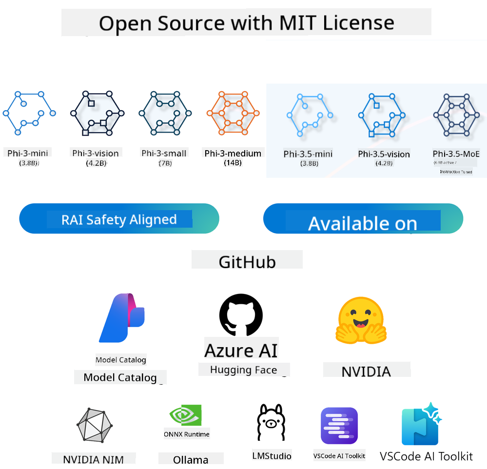
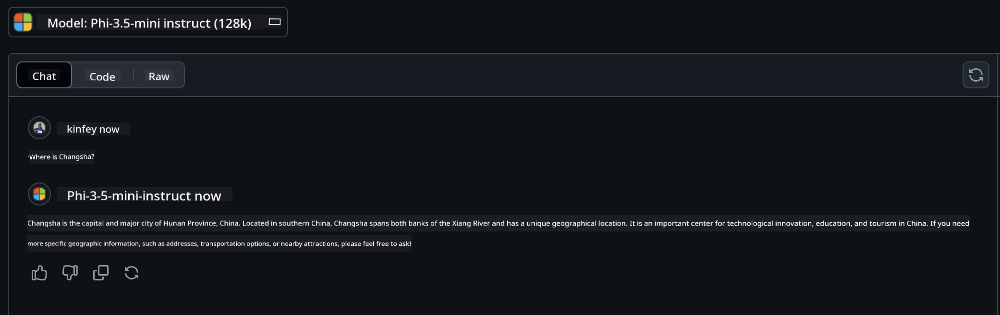

<!--
CO_OP_TRANSLATOR_METADATA:
{
  "original_hash": "124ad36cfe96f74038811b6e2bb93e9d",
  "translation_date": "2025-07-09T18:11:30+00:00",
  "source_file": "19-slm/README.md",
  "language_code": "en"
}
-->
# Introduction to Small Language Models for Generative AI for Beginners  
Generative AI is an exciting area of artificial intelligence focused on building systems that can create new content. This content can include text, images, music, or even entire virtual worlds. One of the most thrilling uses of generative AI is in language models.

## What Are Small Language Models?  

A Small Language Model (SLM) is a scaled-down version of a large language model (LLM), using many of the same architectural principles and techniques but with a much smaller computational footprint.

SLMs are a type of language model designed to generate human-like text. Unlike larger models like GPT-4, SLMs are more compact and efficient, making them ideal for situations where computing resources are limited. Despite their smaller size, they can still handle a variety of tasks. Usually, SLMs are created by compressing or distilling LLMs, aiming to keep much of the original model’s functionality and language skills. This smaller size reduces complexity, making SLMs more efficient in terms of memory and computation. Even with these optimizations, SLMs can perform many natural language processing (NLP) tasks:

- Text Generation: Producing coherent and contextually relevant sentences or paragraphs.  
- Text Completion: Predicting and finishing sentences based on a prompt.  
- Translation: Converting text from one language to another.  
- Summarization: Condensing long texts into shorter, easier-to-understand summaries.  

Though there are some trade-offs in performance or depth of understanding compared to larger models.

## How Do Small Language Models Work?  
SLMs are trained on large amounts of text data. During training, they learn language patterns and structures, enabling them to generate text that is grammatically correct and contextually fitting. The training process includes:

- Data Collection: Gathering large text datasets from various sources.  
- Preprocessing: Cleaning and organizing the data for training.  
- Training: Using machine learning algorithms to teach the model how to understand and generate text.  
- Fine-Tuning: Adjusting the model to improve performance on specific tasks.  

SLMs have been developed to meet the growing need for models that can run in resource-limited environments, like mobile devices or edge computing platforms, where full-scale LLMs are often too demanding. By focusing on efficiency, SLMs strike a balance between performance and accessibility, enabling wider use across different fields.


## Learning Objectives  

In this lesson, we aim to introduce the concept of SLMs and combine it with Microsoft Phi-3 to explore various scenarios in text content, vision, and MoE.

By the end of this lesson, you should be able to answer:

- What is an SLM?  
- How do SLMs differ from LLMs?  
- What is the Microsoft Phi-3/3.5 Family?  
- How to perform inference with Microsoft Phi-3/3.5 Family?  

Ready? Let’s get started.

## The Differences Between Large Language Models (LLMs) and Small Language Models (SLMs)  

Both LLMs and SLMs are based on probabilistic machine learning principles and share similar architectural designs, training methods, data generation, and evaluation techniques. However, several key factors set them apart.

## Applications of Small Language Models  

SLMs are used in many areas, including:

- Chatbots: Offering customer support and engaging users conversationally.  
- Content Creation: Helping writers generate ideas or draft articles.  
- Education: Assisting students with writing or language learning.  
- Accessibility: Building tools for people with disabilities, like text-to-speech systems.  

**Size**  

A major difference between LLMs and SLMs is their scale. LLMs like ChatGPT (GPT-4) can have around 1.76 trillion parameters, while open-source SLMs like Mistral 7B have far fewer—about 7 billion parameters. This difference stems from variations in model architecture and training. For example, ChatGPT uses a self-attention mechanism within an encoder-decoder framework, whereas Mistral 7B employs sliding window attention in a decoder-only model, allowing more efficient training. These architectural differences greatly affect model complexity and performance.

**Comprehension**  

SLMs are usually optimized for specific domains, making them highly specialized but sometimes limited in broad contextual understanding across many knowledge areas. LLMs, on the other hand, aim to mimic human-like intelligence more comprehensively. Trained on vast and diverse datasets, LLMs perform well across many domains, offering greater versatility and adaptability. Therefore, LLMs are better suited for a wider range of tasks, including natural language processing and programming.

**Computing**  

Training and running LLMs require significant computational resources, often involving large GPU clusters. For instance, training a model like ChatGPT from scratch can need thousands of GPUs over long periods. SLMs, with fewer parameters, are more accessible computationally. Models like Mistral 7B can be trained and run on local machines with moderate GPU power, though training still takes several hours on multiple GPUs.

**Bias**  

Bias is a known challenge in LLMs, mainly due to the nature of their training data. These models often use raw, publicly available internet data, which may underrepresent or misrepresent certain groups, contain labeling errors, or reflect linguistic biases from dialects, regions, and grammar rules. The complexity of LLM architectures can also unintentionally amplify bias, which might go unnoticed without careful fine-tuning. SLMs, trained on more focused, domain-specific datasets, tend to be less prone to such biases, though they are not completely immune.

**Inference**  

SLMs’ smaller size gives them a big advantage in inference speed, allowing them to generate outputs efficiently on local hardware without needing extensive parallel processing. LLMs, due to their size and complexity, often require substantial parallel computing resources to achieve reasonable inference times. When many users access LLMs simultaneously, response times can slow down, especially at scale.

In summary, while LLMs and SLMs share a machine learning foundation, they differ significantly in model size, resource needs, contextual understanding, bias susceptibility, and inference speed. These differences determine their suitability for various use cases: LLMs offer versatility but are resource-heavy, while SLMs provide domain-specific efficiency with lower computational demands.

***Note: In this chapter, we will introduce SLMs using Microsoft Phi-3 / 3.5 as an example.***

## Introducing the Phi-3 / Phi-3.5 Family  

The Phi-3 / 3.5 Family mainly targets text, vision, and Agent (MoE) application scenarios:

### Phi-3 / 3.5 Instruct  

Primarily for text generation, chat completion, and content information extraction.

**Phi-3-mini**  

The 3.8B parameter language model is available on Microsoft Azure AI Studio, Hugging Face, and Ollama. Phi-3 models significantly outperform language models of similar or larger sizes on key benchmarks (see benchmark scores below; higher is better). Phi-3-mini outperforms models twice its size, while Phi-3-small and Phi-3-medium outperform larger models, including GPT-3.5.

**Phi-3-small & medium**  

With just 7B parameters, Phi-3-small beats GPT-3.5T on various language, reasoning, coding, and math benchmarks.

Phi-3-medium, with 14B parameters, continues this trend and outperforms Gemini 1.0 Pro.

**Phi-3.5-mini**  

Think of this as an upgrade to Phi-3-mini. While the parameter count remains the same, it improves multilingual support (supporting 20+ languages: Arabic, Chinese, Czech, Danish, Dutch, English, Finnish, French, German, Hebrew, Hungarian, Italian, Japanese, Korean, Norwegian, Polish, Portuguese, Russian, Spanish, Swedish, Thai, Turkish, Ukrainian) and adds stronger support for long context.

Phi-3.5-mini with 3.8B parameters outperforms language models of the same size and matches models twice its size.

### Phi-3 / 3.5 Vision  

You can think of the Phi-3/3.5 Instruct model as Phi’s ability to understand language, and Vision as giving Phi “eyes” to understand the world.

**Phi-3-Vision**  

With only 4.2B parameters, Phi-3-Vision continues the trend and outperforms larger models like Claude-3 Haiku and Gemini 1.0 Pro V on general visual reasoning, OCR, and table and diagram comprehension tasks.

**Phi-3.5-Vision**  

Phi-3.5-Vision is an upgrade to Phi-3-Vision, adding support for multiple images. Think of it as an improvement in vision: not only can it see pictures, but also videos.

Phi-3.5-Vision outperforms larger models such as Claude-3.5 Sonnet and Gemini 1.5 Flash on OCR, table, and chart understanding tasks, and matches them on general visual knowledge reasoning. It supports multi-frame input, meaning it can reason over multiple images at once.

### Phi-3.5-MoE  

***Mixture of Experts (MoE)*** allows models to be pretrained with much less compute, enabling dramatic scaling of model or dataset size with the same compute budget as a dense model. Specifically, a MoE model can reach the same quality as its dense counterpart much faster during pretraining.

Phi-3.5-MoE consists of 16 expert modules, each with 3.8B parameters. Phi-3.5-MoE, with only 6.6B active parameters, achieves reasoning, language understanding, and math capabilities comparable to much larger models.

We can use the Phi-3/3.5 Family models in different scenarios. Unlike LLMs, you can deploy Phi-3/3.5-mini or Phi-3/3.5-Vision on edge devices.

## How to Use Phi-3/3.5 Family Models  

We aim to use Phi-3/3.5 in various scenarios. Next, we will explore using Phi-3/3.5 based on different use cases.



### Inference Differences: Cloud API  

**GitHub Models**  

GitHub Models is the most direct way. You can quickly access the Phi-3/3.5-Instruct model through GitHub Models. Combined with the Azure AI Inference SDK or OpenAI SDK, you can call the API via code to use Phi-3/3.5-Instruct. You can also test different results through Playground.

- Demo: Comparison of Phi-3-mini and Phi-3.5-mini performance in Chinese scenarios




**Azure AI Studio**  

If you want to use vision and MoE models, you can use Azure AI Studio to make calls. If interested, you can read the Phi-3 Cookbook to learn how to call Phi-3/3.5 Instruct, Vision, and MoE through Azure AI Studio [Click this link](https://github.com/microsoft/Phi-3CookBook/blob/main/md/02.QuickStart/AzureAIStudio_QuickStart.md?WT.mc_id=academic-105485-koreyst)

**NVIDIA NIM**  

Besides cloud-based Model Catalog solutions from Azure and GitHub, you can also use [NVIDIA NIM](https://developer.nvidia.com/nim?WT.mc_id=academic-105485-koreyst) to make related calls. NVIDIA NIM (NVIDIA Inference Microservices) is a set of accelerated inference microservices designed to help developers deploy AI models efficiently across various environments, including clouds, data centers, and workstations.

Key features of NVIDIA NIM include:

- **Ease of Deployment:** NIM allows AI models to be deployed with a single command, making integration into existing workflows simple.  
- **Optimized Performance:** It uses NVIDIA’s pre-optimized inference engines, like TensorRT and TensorRT-LLM, to ensure low latency and high throughput.  
- **Scalability:** NIM supports autoscaling on Kubernetes, enabling it to handle varying workloads effectively.
- **Security and Control:** Organizations can keep full control over their data and applications by self-hosting NIM microservices on their own managed infrastructure.  
- **Standard APIs:** NIM offers industry-standard APIs, making it easy to build and integrate AI applications like chatbots, AI assistants, and more.

NIM is part of NVIDIA AI Enterprise, which aims to simplify the deployment and operation of AI models, ensuring they run efficiently on NVIDIA GPUs.

- Demo: Using Nvidia NIM to call Phi-3.5-Vision-API  [[Click this link](../../../19-slm/python/Phi-3-Vision-Nividia-NIM.ipynb)]


### Inference Phi-3/3.5 in local environment  
Inference related to Phi-3, or any language model like GPT-3, refers to the process of generating responses or predictions based on the input it receives. When you provide a prompt or question to Phi-3, it uses its trained neural network to infer the most likely and relevant response by analyzing patterns and relationships in the data it was trained on.

**Hugging Face Transformer**  
Hugging Face Transformers is a powerful library designed for natural language processing (NLP) and other machine learning tasks. Here are some key points about it:

1. **Pretrained Models:** It offers thousands of pretrained models for various tasks such as text classification, named entity recognition, question answering, summarization, translation, and text generation.

2. **Framework Interoperability:** The library supports multiple deep learning frameworks, including PyTorch, TensorFlow, and JAX. This allows you to train a model in one framework and use it in another.

3. **Multimodal Capabilities:** Beyond NLP, Hugging Face Transformers also supports tasks in computer vision (e.g., image classification, object detection) and audio processing (e.g., speech recognition, audio classification).

4. **Ease of Use:** The library provides APIs and tools to easily download and fine-tune models, making it accessible for both beginners and experts.

5. **Community and Resources:** Hugging Face has a vibrant community along with extensive documentation, tutorials, and guides to help users get started and make the most of the library.  
[official documentation](https://huggingface.co/docs/transformers/index?WT.mc_id=academic-105485-koreyst) or their [GitHub repository](https://github.com/huggingface/transformers?WT.mc_id=academic-105485-koreyst).

This is the most commonly used method, but it also requires GPU acceleration. After all, scenarios like Vision and MoE involve heavy computations, which are very limited on CPU unless quantized.


- Demo: Using Transformer to call Phi-3.5-Instruct [Click this link](../../../19-slm/python/phi35-instruct-demo.ipynb)

- Demo: Using Transformer to call Phi-3.5-Vision [Click this link](../../../19-slm/python/phi35-vision-demo.ipynb)

- Demo: Using Transformer to call Phi-3.5-MoE [Click this link](../../../19-slm/python/phi35_moe_demo.ipynb)

**Ollama**  
[Ollama](https://ollama.com/?WT.mc_id=academic-105485-koreyst) is a platform designed to make it easier to run large language models (LLMs) locally on your machine. It supports various models like Llama 3.1, Phi 3, Mistral, and Gemma 2, among others. The platform simplifies the process by bundling model weights, configuration, and data into a single package, making it more accessible for users to customize and create their own models. Ollama is available for macOS, Linux, and Windows. It’s a great tool if you want to experiment with or deploy LLMs without relying on cloud services. Ollama is the most straightforward method—you just need to run the following command.


```bash

ollama run phi3.5

```


**ONNX Runtime for GenAI**

[ONNX Runtime](https://github.com/microsoft/onnxruntime-genai?WT.mc_id=academic-105485-koreyst) is a cross-platform inference and training machine learning accelerator. ONNX Runtime for Generative AI (GENAI) is a powerful tool that helps you run generative AI models efficiently across various platforms.

## What is ONNX Runtime?  
ONNX Runtime is an open-source project that enables high-performance inference of machine learning models. It supports models in the Open Neural Network Exchange (ONNX) format, which is a standard for representing machine learning models. ONNX Runtime inference can deliver faster customer experiences and reduce costs, supporting models from deep learning frameworks such as PyTorch and TensorFlow/Keras as well as classical machine learning libraries like scikit-learn, LightGBM, XGBoost, and more. ONNX Runtime is compatible with different hardware, drivers, and operating systems, providing optimal performance by leveraging hardware accelerators where available, alongside graph optimizations and transformations.

## What is Generative AI?  
Generative AI refers to AI systems that can create new content, such as text, images, or music, based on the data they were trained on. Examples include language models like GPT-3 and image generation models like Stable Diffusion. The ONNX Runtime for GenAI library provides the generative AI workflow for ONNX models, including inference with ONNX Runtime, logits processing, search and sampling, and KV cache management.

## ONNX Runtime for GENAI  
ONNX Runtime for GENAI extends ONNX Runtime’s capabilities to support generative AI models. Key features include:

- **Broad Platform Support:** Works on various platforms including Windows, Linux, macOS, Android, and iOS.  
- **Model Support:** Supports many popular generative AI models such as LLaMA, GPT-Neo, BLOOM, and more.  
- **Performance Optimization:** Includes optimizations for different hardware accelerators like NVIDIA GPUs, AMD GPUs, and others.  
- **Ease of Use:** Provides APIs for easy integration into applications, allowing you to generate text, images, and other content with minimal code.  
- Users can call a high-level generate() method or run each iteration of the model in a loop, generating one token at a time, and optionally update generation parameters within the loop.  
- ONNX Runtime also supports greedy/beam search and TopP, TopK sampling to generate token sequences, along with built-in logits processing like repetition penalties. You can also easily add custom scoring.

## Getting Started  
To get started with ONNX Runtime for GENAI, follow these steps:

### Install ONNX Runtime:  
```Python
pip install onnxruntime
```  
### Install the Generative AI Extensions:  
```Python
pip install onnxruntime-genai
```

### Run a Model: Here’s a simple example in Python:  
```Python
import onnxruntime_genai as og

model = og.Model('path_to_your_model.onnx')

tokenizer = og.Tokenizer(model)

input_text = "Hello, how are you?"

input_tokens = tokenizer.encode(input_text)

output_tokens = model.generate(input_tokens)

output_text = tokenizer.decode(output_tokens)

print(output_text) 
```  
### Demo: Using ONNX Runtime GenAI to call Phi-3.5-Vision  


```python

import onnxruntime_genai as og

model_path = './Your Phi-3.5-vision-instruct ONNX Path'

img_path = './Your Image Path'

model = og.Model(model_path)

processor = model.create_multimodal_processor()

tokenizer_stream = processor.create_stream()

text = "Your Prompt"

prompt = "<|user|>\n"

prompt += "<|image_1|>\n"

prompt += f"{text}<|end|>\n"

prompt += "<|assistant|>\n"

image = og.Images.open(img_path)

inputs = processor(prompt, images=image)

params = og.GeneratorParams(model)

params.set_inputs(inputs)

params.set_search_options(max_length=3072)

generator = og.Generator(model, params)

while not generator.is_done():

    generator.compute_logits()
    
    generator.generate_next_token()

    new_token = generator.get_next_tokens()[0]
    
    code += tokenizer_stream.decode(new_token)
    
    print(tokenizer_stream.decode(new_token), end='', flush=True)

```


**Others**

Besides ONNX Runtime and Ollama reference methods, you can also complete references for quantized models based on model reference methods provided by different manufacturers. Examples include Apple MLX framework with Apple Metal, Qualcomm QNN with NPU, Intel OpenVINO with CPU/GPU, and more. You can find additional resources in the [Phi-3 Cookbook](https://github.com/microsoft/phi-3cookbook?WT.mc_id=academic-105485-koreyst).


## More

We have covered the basics of the Phi-3/3.5 family, but to learn more about SLM, further knowledge is needed. You can find answers in the Phi-3 Cookbook. For more information, please visit the [Phi-3 Cookbook](https://github.com/microsoft/phi-3cookbook?WT.mc_id=academic-105485-koreyst).

**Disclaimer**:  
This document has been translated using the AI translation service [Co-op Translator](https://github.com/Azure/co-op-translator). While we strive for accuracy, please be aware that automated translations may contain errors or inaccuracies. The original document in its native language should be considered the authoritative source. For critical information, professional human translation is recommended. We are not liable for any misunderstandings or misinterpretations arising from the use of this translation.