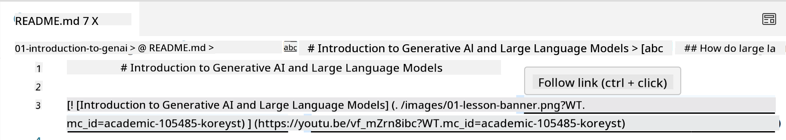
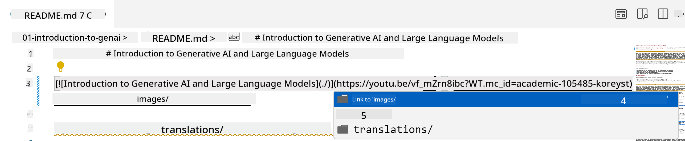
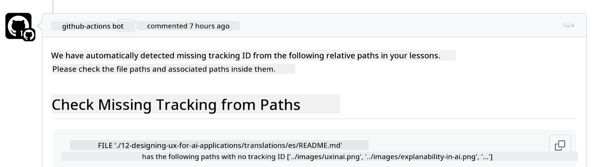
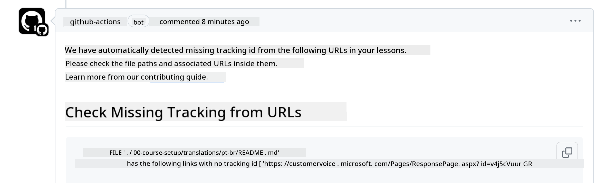
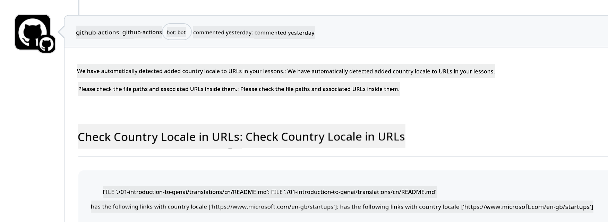

<!--
CO_OP_TRANSLATOR_METADATA:
{
  "original_hash": "57c41f2af71001a2cff9d8eb797cb843",
  "translation_date": "2025-06-25T06:58:00+00:00",
  "source_file": "CONTRIBUTING.md",
  "language_code": "en"
}
-->
# Contributing

This project welcomes contributions and suggestions. Most contributions require you to agree to a Contributor License Agreement (CLA) declaring that you have the right to, and actually do, grant us the rights to use your contribution. For details, visit <https://cla.microsoft.com>.

> Important: when translating text in this repo, please ensure that you do not use machine translation. We will verify translations via the community, so please only volunteer for translations in languages where you are proficient.

When you submit a pull request, a CLA-bot will automatically determine whether you need to provide a CLA and decorate the PR appropriately (e.g., label, comment). Simply follow the instructions provided by the bot. You will only need to do this once across all repositories using our CLA.

## Code of Conduct

This project has adopted the [Microsoft Open Source Code of Conduct](https://opensource.microsoft.com/codeofconduct/?WT.mc_id=academic-105485-koreyst). For more information read the [Code of Conduct FAQ](https://opensource.microsoft.com/codeofconduct/faq/?WT.mc_id=academic-105485-koreyst) or contact [opencode@microsoft.com](mailto:opencode@microsoft.com) with any additional questions or comments.

## Question or Problem?

Please do not open GitHub issues for general support questions as the GitHub list should be used for feature requests and bug reports. This way we can more easily track actual issues or bugs from the code and keep the general discussion separate from the actual code.

## Typos, Issues, Bugs and contributions

Whenever you are submitting any changes to the Generative AI for Beginners repository, please follow these recommendations.

* Always fork the repository to your own account before making your modifications
* Do not combine multiple changes to one pull request. For example, submit any bug fix and documentation updates using separate PRs
* If your pull request shows merge conflicts, make sure to update your local main to be a mirror of what's in the main repository before making your modifications
* If you are submitting a translation, please create one PR for all the translated files as we don't accept partial translations for the content
* If you are submitting a typo or documentation fix, you can combine modifications to a single PR where suitable

## General Guidance for writing

- Ensure that all your URLs are wrapped in square brackets followed by a parenthesis with no extra spaces around them or inside them ``.
- Ensure that any relative link (i.e. links to other files and folders in the repository) starts with a `./` referring to a file or a folder located in the current working directory or a `../` referring to a file or a folder located in a parent working directory.
- Ensure that any relative link (i.e. links to other files and folders in the repository) has a tracking ID (i.e. `?` or `&` then `wt.mc_id=` or `WT.mc_id=`) at the end of it.
- Ensure that any URL from the following domains _github.com, microsoft.com, visualstudio.com, aka.ms, and azure.com_ has a tracking ID (i.e. `?` or `&` then `wt.mc_id=` or `WT.mc_id=`) at the end of it.
- Ensure that your links don't have country specific locale in them (i.e. `/en-us/` or `/en/`).
- Ensure that all images are stored in the `./images` folder.
- Ensure that the images have descriptive names using English characters, numbers, and dashes in the name of your image.

## GitHub Workflows

When you submit a pull request, four different workflows will be triggered to validate the previous rules. Simply follow the instructions listed here to pass the workflow checks.

- [Check Broken Relative Paths](../..)
- [Check Paths Have Tracking](../..)
- [Check URLs Have Tracking](../..)
- [Check URLs Don't Have Locale](../..)

### Check Broken Relative Paths

This workflow ensures that any relative path in your files is working. This repository is deployed to GitHub pages so you need to be very careful when you type the links that glue everything together to not direct anyone to the wrong place.

To make sure that your links are working properly simply use VS code to check that.

For example, when you hover over any link in your files you will be prompted to follow the link by pressing on **ctrl + click**

If you click on a link and it's not working locally then, surely it will trigger the workflow and won't work on GitHub.

To fix this issue, try to type the link with the help of VS code.

When you type `./` or `../` VS code will prompt you to choose from the available options according to what you typed.

Follow the path by clicking on the desired file or folder and you will be sure that your path is not broken.

Once you add the correct relative path, save, and push your changes the workflow will be triggered again to verify your changes. If you pass the check then you are good to go.

### Check Paths Have Tracking

This workflow ensures that any relative path has tracking in it. This repository is deployed to GitHub pages so we need to track the movement between the different files and folders.

To make sure your relative paths have tracking in them simply check for the following text `?wt.mc_id=` at the end of the path. If it's appended to your relative paths then you will pass this check.

If not, you may get the following error.

To fix this issue, try to open the file path that the workflow highlighted and add the tracking ID to the end of the relative paths.

Once you add the tracking ID, save, and push your changes the workflow will be triggered again to verify your changes. If you pass the check then you are good to go.

### Check URLs Have Tracking

This workflow ensures that any web URL has tracking in it. This repository is available to everyone so you need to make sure to track the access to know from where the traffic is coming.

To make sure your URLs have tracking in them simply check for the following text `?wt.mc_id=` at the end of the URL. If it's appended to your URLs then you will pass this check.

If not, you may get the following error.

To fix this issue, try to open the file path that the workflow highlighted and add the tracking ID to the end of the URLs.

Once you add the tracking ID, save, and push your changes the workflow will be triggered again to verify your changes. If you pass the check then you are good to go.

### Check URLs Don't Have Locale

This workflow ensures that any web URL doesn't have country specific locale in it. This repository is available to everyone around the world so you need to make sure not to include your country's locale in URLs.

To make sure your URLs don't have country locale in them simply check for the following text `/en-us/` or `/en/` or any other language locale anywhere in the URL. If it's not present in your URLs then you will pass this check.

If not, you may get the following error.

To fix this issue, try to open the file path that the workflow highlighted and remove the country locale from the URLs.

Once you remove the country locale, save, and push your changes the workflow will be triggered again to verify your changes. If you pass the check then you are good to go.

Congratulations! We will get back to you as soon as possible with feedback about your contribution.

Sure, here's the translation of the text to English:

**Disclaimer**:  
This document has been translated using AI translation service [Co-op Translator](https://github.com/Azure/co-op-translator). While we strive for accuracy, please be aware that automated translations may contain errors or inaccuracies. The original document in its native language should be considered the authoritative source. For critical information, professional human translation is recommended. We are not liable for any misunderstandings or misinterpretations arising from the use of this translation.