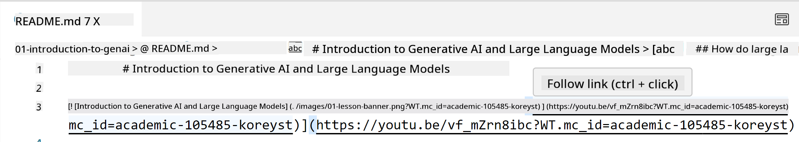
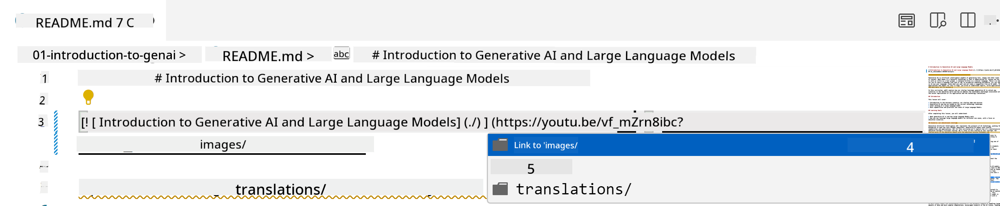
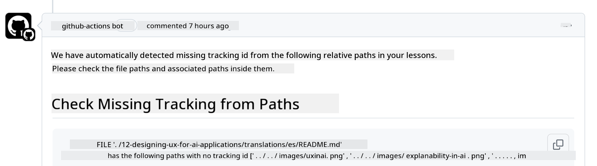
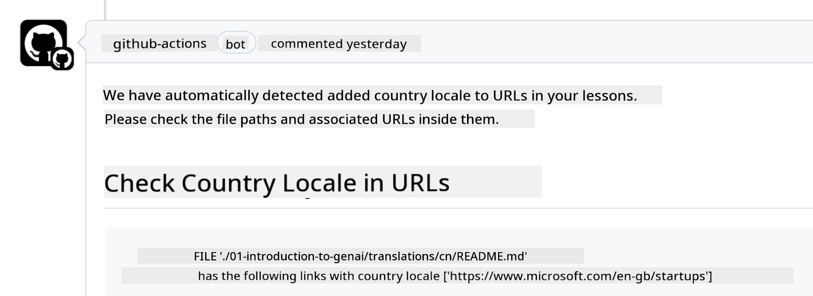

<!--
CO_OP_TRANSLATOR_METADATA:
{
  "original_hash": "57c41f2af71001a2cff9d8eb797cb843",
  "translation_date": "2025-07-09T05:47:07+00:00",
  "source_file": "CONTRIBUTING.md",
  "language_code": "en"
}
-->
# Contributing

This project welcomes contributions and suggestions. Most contributions require you to agree to a Contributor License Agreement (CLA) confirming that you have the right to, and actually do, grant us the rights to use your contribution. For details, visit <https://cla.microsoft.com>.

> Important: when translating text in this repo, please make sure not to use machine translation. We will verify translations through the community, so please only volunteer for translations in languages you are proficient in.

When you submit a pull request, a CLA-bot will automatically check whether you need to provide a CLA and will label or comment on the PR accordingly. Just follow the instructions from the bot. You only need to do this once across all repositories using our CLA.

## Code of Conduct

This project has adopted the [Microsoft Open Source Code of Conduct](https://opensource.microsoft.com/codeofconduct/?WT.mc_id=academic-105485-koreyst).  
For more information, read the [Code of Conduct FAQ](https://opensource.microsoft.com/codeofconduct/faq/?WT.mc_id=academic-105485-koreyst) or contact [opencode@microsoft.com](mailto:opencode@microsoft.com) with any questions or comments.

## Question or Problem?

Please do not open GitHub issues for general support questions, as the GitHub issues list should be used for feature requests and bug reports. This helps us track actual issues or bugs in the code more easily and keeps general discussions separate from code-related topics.

## Typos, Issues, Bugs and contributions

When submitting any changes to the Generative AI for Beginners repository, please follow these recommendations:

* Always fork the repository to your own account before making changes  
* Do not combine multiple changes in one pull request. For example, submit bug fixes and documentation updates as separate PRs  
* If your pull request shows merge conflicts, update your local main branch to match the main repository before making changes  
* If you are submitting a translation, please create one PR for all translated files, as partial translations are not accepted  
* If you are submitting a typo or documentation fix, you can combine related changes into a single PR where appropriate

## General Guidance for writing

- Make sure all your URLs are enclosed in square brackets followed immediately by parentheses with no extra spaces inside or around them ``.  
- Ensure any relative link (links to other files or folders in the repo) starts with `./` for files or folders in the current directory, or `../` for those in a parent directory.  
- Make sure any relative link includes a tracking ID (i.e., `?` or `&` followed by `wt.mc_id=` or `WT.mc_id=`) at the end.  
- Ensure URLs from the following domains _github.com, microsoft.com, visualstudio.com, aka.ms, and azure.com_ include a tracking ID at the end.  
- Avoid including country-specific locale codes in your links (e.g., `/en-us/` or `/en/`).  
- Store all images in the `./images` folder.  
- Use descriptive image names with English letters, numbers, and dashes.

## GitHub Workflows

When you submit a pull request, four workflows will run to validate the rules above.  
Just follow the instructions here to pass the workflow checks.

- [Check Broken Relative Paths](../..)  
- [Check Paths Have Tracking](../..)  
- [Check URLs Have Tracking](../..)  
- [Check URLs Don't Have Locale](../..)

### Check Broken Relative Paths

This workflow verifies that all relative paths in your files work correctly.  
Since this repo is deployed to GitHub Pages, you need to be careful when typing links to avoid directing users to the wrong place.

To check your links, simply use VS Code.  
For example, when you hover over a link, you can press **ctrl + click** to follow it.

If a link doesn’t work locally, it will likely fail the workflow check on GitHub as well.

To fix this, type the link with VS Code’s help.  
When you type `./` or `../`, VS Code will suggest available options based on what you typed.

Click on the desired file or folder to ensure your path is correct.

After updating the relative path, save and push your changes. The workflow will run again to verify your fix.  
If you pass, you’re good to go.

### Check Paths Have Tracking

This workflow checks that all relative paths include tracking information.  
Since this repo is deployed to GitHub Pages, we need to track navigation between files and folders.

To pass, make sure your relative paths end with `?wt.mc_id=` or similar tracking text.  
If missing, you may see an error like this:

To fix it, open the file the workflow flagged and add the tracking ID to the end of the relative paths.

Save and push your changes. The workflow will run again to verify.  
If you pass, you’re good to go.

### Check URLs Have Tracking

This workflow ensures all web URLs include tracking information.  
Since this repo is public, tracking helps us understand where traffic comes from.

To pass, make sure URLs end with `?wt.mc_id=` or similar tracking text.  
If missing, you may see an error like this:

To fix it, open the flagged file and add the tracking ID to the URLs.

Save and push your changes. The workflow will run again to verify.  
If you pass, you’re good to go.

### Check URLs Don't Have Locale

This workflow checks that URLs do not include country-specific locale codes.  
Since this repo is global, URLs should not contain locale segments like `/en-us/` or `/en/`.

To pass, make sure your URLs do not include any language or country locale anywhere.  
If present, you may see an error like this:

To fix it, open the flagged file and remove the locale from the URLs.

Save and push your changes. The workflow will run again to verify.  
If you pass, you’re good to go.

Congratulations! We will get back to you as soon as possible with feedback on your contribution.

**Disclaimer**:  
This document has been translated using the AI translation service [Co-op Translator](https://github.com/Azure/co-op-translator). While we strive for accuracy, please be aware that automated translations may contain errors or inaccuracies. The original document in its native language should be considered the authoritative source. For critical information, professional human translation is recommended. We are not liable for any misunderstandings or misinterpretations arising from the use of this translation.