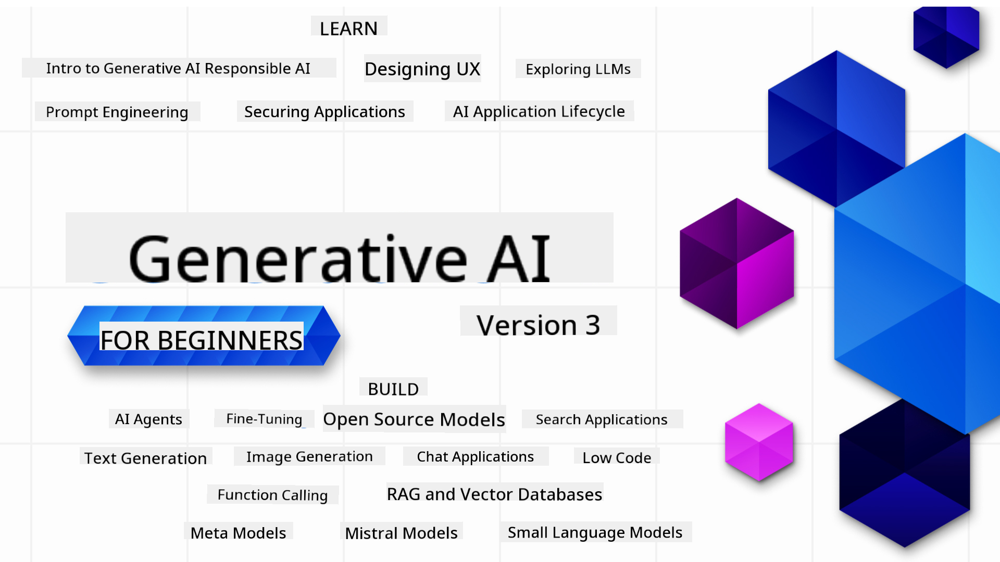

<!--
CO_OP_TRANSLATOR_METADATA:
{
  "original_hash": "ca2afa136ed9aca0634f39f51239746e",
  "translation_date": "2025-08-27T08:05:00+00:00",
  "source_file": "README.md",
  "language_code": "en"
}
-->

### 21 Lessons to Teach You Everything You Need to Know to Start Building Generative AI Applications

  
  
  
  
  

  
  
  

### 🌐 Multi-Language Support

#### Supported via GitHub Action (Automated & Always Up-to-Date)

[French](../fr/README.md) | [Spanish](../es/README.md) | [German](../de/README.md) | [Russian](../ru/README.md) | [Arabic](../ar/README.md) | [Persian (Farsi)](../fa/README.md) | [Urdu](../ur/README.md) | [Chinese (Simplified)](../zh/README.md) | [Chinese (Traditional, Macau)](../mo/README.md) | [Chinese (Traditional, Hong Kong)](../hk/README.md) | [Chinese (Traditional, Taiwan)](../tw/README.md) | [Japanese](../ja/README.md) | [Korean](../ko/README.md) | [Hindi](../hi/README.md) | [Bengali](../bn/README.md) | [Marathi](../mr/README.md) | [Nepali](../ne/README.md) | [Punjabi (Gurmukhi)](../pa/README.md) | [Portuguese (Portugal)](../pt/README.md) | [Portuguese (Brazil)](../br/README.md) | [Italian](../it/README.md) | [Lithuanian](../lt/README.md) | [Polish](../pl/README.md) | [Turkish](../tr/README.md) | [Greek](../el/README.md) | [Thai](../th/README.md) | [Swedish](../sv/README.md) | [Danish](../da/README.md) | [Norwegian](../no/README.md) | [Finnish](../fi/README.md) | [Dutch](../nl/README.md) | [Hebrew](../he/README.md) | [Vietnamese](../vi/README.md) | [Indonesian](../id/README.md) | [Malay](../ms/README.md) | [Tagalog (Filipino)](../tl/README.md) | [Swahili](../sw/README.md) | [Hungarian](../hu/README.md) | [Czech](../cs/README.md) | [Slovak](../sk/README.md) | [Romanian](../ro/README.md) | [Bulgarian](../bg/README.md) | [Serbian (Cyrillic)](../sr/README.md) | [Croatian](../hr/README.md) | [Slovenian](../sl/README.md) | [Ukrainian](../uk/README.md) | [Burmese (Myanmar)](../my/README.md)

# Generative AI for Beginners (Version 3) - A Course

Learn the fundamentals of building Generative AI applications with our 21-lesson comprehensive course by Microsoft Cloud Advocates.

## 🌱 Getting Started

This course has 21 lessons. Each lesson covers its own topic, so you can start wherever you like!

Lessons are categorized as either "Learn" lessons, which explain a Generative AI concept, or "Build" lessons, which include both a concept explanation and code examples in **Python** and **TypeScript** when possible.

For .NET developers, check out [Generative AI for Beginners (.NET Edition)](https://github.com/microsoft/Generative-AI-for-beginners-dotnet?WT.mc_id=academic-105485-koreyst)!

Each lesson also includes a "Keep Learning" section with additional resources to deepen your understanding.

## What You Need
### To run the code in this course, you can use either: 
 - [Azure OpenAI Service](https://aka.ms/genai-beginners/azure-open-ai?WT.mc_id=academic-105485-koreyst) - **Lessons:** "aoai-assignment"  
 - [GitHub Marketplace Model Catalog](https://aka.ms/genai-beginners/gh-models?WT.mc_id=academic-105485-koreyst) - **Lessons:** "githubmodels"  
 - [OpenAI API](https://aka.ms/genai-beginners/open-ai?WT.mc_id=academic-105485-koreyst) - **Lessons:** "oai-assignment"  

- Basic knowledge of Python or TypeScript is helpful.  
  \*For absolute beginners, check out these [Python](https://aka.ms/genai-beginners/python?WT.mc_id=academic-105485-koreyst) and [TypeScript](https://aka.ms/genai-beginners/typescript?WT.mc_id=academic-105485-koreyst) courses.  
- A GitHub account to [fork this entire repo](https://aka.ms/genai-beginners/github?WT.mc_id=academic-105485-koreyst) to your own GitHub account.  

We have created a **[Course Setup](./00-course-setup/README.md?WT.mc_id=academic-105485-koreyst)** lesson to help you set up your development environment.

Don't forget to [star (🌟) this repo](https://docs.github.com/en/get-started/exploring-projects-on-github/saving-repositories-with-stars?WT.mc_id=academic-105485-koreyst) to easily find it later.

## 🧠 Ready to Deploy?

If you're looking for more advanced code samples, check out our [collection of Generative AI Code Samples](https://aka.ms/genai-beg-code?WT.mc_id=academic-105485-koreyst) in both **Python** and **TypeScript**.

## 🗣️ Meet Other Learners, Get Support

Join our [official Azure AI Foundry Discord server](https://aka.ms/genai-discord?WT.mc_id=academic-105485-koreyst) to connect with other learners taking this course and get support.

Ask questions or share product feedback in our [Azure AI Foundry Developer Forum](https://aka.ms/azureaifoundry/forum) on GitHub.

## 🚀 Building a Startup?

Visit [Microsoft for Startups](https://www.microsoft.com/startups) to learn how to get started with Azure credits today.

## 🙏 Want to help?

Have suggestions or found spelling or code errors? [Raise an issue](https://github.com/microsoft/generative-ai-for-beginners/issues?WT.mc_id=academic-105485-koreyst) or [Create a pull request](https://github.com/microsoft/generative-ai-for-beginners/pulls?WT.mc_id=academic-105485-koreyst).

## 📂 Each lesson includes:

- A short video introduction to the topic  
- A written lesson located in the README  
- Python and TypeScript code samples supporting Azure OpenAI and OpenAI API  
- Links to extra resources to continue your learning  

## 🗃️ Lessons

| #   | **Lesson Link**                                                                                                                              | **Description**                                                                                 | **Video**                                                                   | **Extra Learning**                                                             |
| --- | -------------------------------------------------------------------------------------------------------------------------------------------- | ----------------------------------------------------------------------------------------------- | --------------------------------------------------------------------------- | ------------------------------------------------------------------------------ |
| 00  | [Course Setup](./00-course-setup/README.md?WT.mc_id=academic-105485-koreyst)                                                                 | **Learn:** How to set up your development environment                                           | Video Coming Soon                                                           | [Learn More](https://aka.ms/genai-collection?WT.mc_id=academic-105485-koreyst) |
| 01  | [Introduction to Generative AI and LLMs](./01-introduction-to-genai/README.md?WT.mc_id=academic-105485-koreyst)                              | **Learn:** Understanding what Generative AI is and how Large Language Models (LLMs) work.       | [Video](https://aka.ms/gen-ai-lesson-1-gh?WT.mc_id=academic-105485-koreyst) | [Learn More](https://aka.ms/genai-collection?WT.mc_id=academic-105485-koreyst) |
| 02  | [Exploring and comparing different LLMs](./02-exploring-and-comparing-different-llms/README.md?WT.mc_id=academic-105485-koreyst)             | **Learn:** How to select the right model for your use case                                      | [Video](https://aka.ms/gen-ai-lesson2-gh?WT.mc_id=academic-105485-koreyst)  | [Learn More](https://aka.ms/genai-collection?WT.mc_id=academic-105485-koreyst) |
| 03  | [Using Generative AI Responsibly](./03-using-generative-ai-responsibly/README.md?WT.mc_id=academic-105485-koreyst)                           | **Learn:** How to build Generative AI applications responsibly                                  | [Video](https://aka.ms/gen-ai-lesson3-gh?WT.mc_id=academic-105485-koreyst)  | [Learn More](https://aka.ms/genai-collection?WT.mc_id=academic-105485-koreyst) |
| 04  | [Understanding Prompt Engineering Fundamentals](./04-prompt-engineering-fundamentals/README.md?WT.mc_id=academic-105485-koreyst)             | **Learn:** Hands-on prompt engineering best practices                                           | [Video](https://aka.ms/gen-ai-lesson4-gh?WT.mc_id=academic-105485-koreyst)  | [Learn More](https://aka.ms/genai-collection?WT.mc_id=academic-105485-koreyst) |
| 05  | [Creating Advanced Prompts](./05-advanced-prompts/README.md?WT.mc_id=academic-105485-koreyst)                                                | **Learn:** How to apply prompt engineering techniques that improve the outcome of your prompts. | [Video](https://aka.ms/gen-ai-lesson5-gh?WT.mc_id=academic-105485-koreyst)  | [Learn More](https://aka.ms/genai-collection?WT.mc_id=academic-105485-koreyst) |  
| 06  | [Building Text Generation Applications](./06-text-generation-apps/README.md?WT.mc_id=academic-105485-koreyst)                                | **Build:** A text generation app using Azure OpenAI / OpenAI API                                | [Video](https://aka.ms/gen-ai-lesson6-gh?WT.mc_id=academic-105485-koreyst)  | [Learn More](https://aka.ms/genai-collection?WT.mc_id=academic-105485-koreyst) |
| 07  | [Building Chat Applications](./07-building-chat-applications/README.md?WT.mc_id=academic-105485-koreyst)                                     | **Build:** Techniques for efficiently building and integrating chat applications.               | [Video](https://aka.ms/gen-ai-lessons7-gh?WT.mc_id=academic-105485-koreyst) | [Learn More](https://aka.ms/genai-collection?WT.mc_id=academic-105485-koreyst) |
| 08  | [Building Search Apps Vector Databases](./08-building-search-applications/README.md?WT.mc_id=academic-105485-koreyst)                        | **Build:** A search application that uses Embeddings to search for data.                        | [Video](https://aka.ms/gen-ai-lesson8-gh?WT.mc_id=academic-105485-koreyst)  | [Learn More](https://aka.ms/genai-collection?WT.mc_id=academic-105485-koreyst) |
| 09  | [Building Image Generation Applications](./09-building-image-applications/README.md?WT.mc_id=academic-105485-koreyst)                        | **Build:** An image generation application                                                       | [Video](https://aka.ms/gen-ai-lesson9-gh?WT.mc_id=academic-105485-koreyst)  | [Learn More](https://aka.ms/genai-collection?WT.mc_id=academic-105485-koreyst) |
| 10  | [Building Low Code AI Applications](./10-building-low-code-ai-applications/README.md?WT.mc_id=academic-105485-koreyst)                       | **Build:** A Generative AI application using Low Code tools                                     | [Video](https://aka.ms/gen-ai-lesson10-gh?WT.mc_id=academic-105485-koreyst) | [Learn More](https://aka.ms/genai-collection?WT.mc_id=academic-105485-koreyst) |
| 11  | [Integrating External Applications with Function Calling](./11-integrating-with-function-calling/README.md?WT.mc_id=academic-105485-koreyst) | **Build:** What is function calling and its use cases for applications                          | [Video](https://aka.ms/gen-ai-lesson11-gh?WT.mc_id=academic-105485-koreyst) | [Learn More](https://aka.ms/genai-collection?WT.mc_id=academic-105485-koreyst) |
| 12  | [Designing UX for AI Applications](./12-designing-ux-for-ai-applications/README.md?WT.mc_id=academic-105485-koreyst)                         | **Learn:** How to apply UX design principles when developing Generative AI Applications         | [Video](https://aka.ms/gen-ai-lesson12-gh?WT.mc_id=academic-105485-koreyst) | [Learn More](https://aka.ms/genai-collection?WT.mc_id=academic-105485-koreyst) |
| 13  | [Securing Your Generative AI Applications](./13-securing-ai-applications/README.md?WT.mc_id=academic-105485-koreyst)                         | **Learn:** The threats and risks to AI systems and methods to secure these systems.             | [Video](https://aka.ms/gen-ai-lesson13-gh?WT.mc_id=academic-105485-koreyst) | [Learn More](https://aka.ms/genai-collection?WT.mc_id=academic-105485-koreyst) |
| 14  | [The Generative AI Application Lifecycle](./14-the-generative-ai-application-lifecycle/README.md?WT.mc_id=academic-105485-koreyst)           | **Learn:** The tools and metrics to manage the LLM Lifecycle and LLMOps                         | [Video](https://aka.ms/gen-ai-lesson14-gh?WT.mc_id=academic-105485-koreyst) | [Learn More](https://aka.ms/genai-collection?WT.mc_id=academic-105485-koreyst) |
| 15  | [Retrieval Augmented Generation (RAG) and Vector Databases](./15-rag-and-vector-databases/README.md?WT.mc_id=academic-105485-koreyst)        | **Build:** An application using a RAG Framework to retrieve embeddings from a Vector Databases  | [Video](https://aka.ms/gen-ai-lesson15-gh?WT.mc_id=academic-105485-koreyst) | [Learn More](https://aka.ms/genai-collection?WT.mc_id=academic-105485-koreyst) |
| 16  | [Open Source Models and Hugging Face](./16-open-source-models/README.md?WT.mc_id=academic-105485-koreyst)                                    | **Build:** An application using open source models available on Hugging Face                    | [Video](https://aka.ms/gen-ai-lesson16-gh?WT.mc_id=academic-105485-koreyst) | [Learn More](https://aka.ms/genai-collection?WT.mc_id=academic-105485-koreyst) |
| 17  | [AI Agents](./17-ai-agents/README.md?WT.mc_id=academic-105485-koreyst)                                                                       | **Build:** An application using an AI Agent Framework                                           | [Video](https://aka.ms/gen-ai-lesson17-gh?WT.mc_id=academic-105485-koreyst) | [Learn More](https://aka.ms/genai-collection?WT.mc_id=academic-105485-koreyst) |
| 18  | [Fine-Tuning LLMs](./18-fine-tuning/README.md?WT.mc_id=academic-105485-koreyst)                                                              | **Learn:** The what, why and how of fine-tuning LLMs                                            | [Video](https://aka.ms/gen-ai-lesson18-gh?WT.mc_id=academic-105485-koreyst) | [Learn More](https://aka.ms/genai-collection?WT.mc_id=academic-105485-koreyst) |
| 19  | [Building with SLMs](./19-slm/README.md?WT.mc_id=academic-105485-koreyst)                                                              | **Learn:** The benefits of building with Small Language Models                                            | Video Coming Soon | [Learn More](https://aka.ms/genai-collection?WT.mc_id=academic-105485-koreyst) |
| 20  | [Building with Mistral Models](./20-mistral/README.md?WT.mc_id=academic-105485-koreyst)                                                              | **Learn:** The features and differences of the Mistral Family Models                                           | Video Coming Soon | [Learn More](https://aka.ms/genai-collection?WT.mc_id=academic-105485-koreyst) |
| 21  | [Building with Meta Models](./21-meta/README.md?WT.mc_id=academic-105485-koreyst)                                                              | **Learn:** The features and differences of the Meta Family Models                                           | Video Coming Soon | [Learn More](https://aka.ms/genai-collection?WT.mc_id=academic-105485-koreyst) |

### 🌟 Special thanks

Special thanks to [**John Aziz**](https://www.linkedin.com/in/john0isaac/) for creating all of the GitHub Actions and workflows

[**Bernhard Merkle**](https://www.linkedin.com/in/bernhard-merkle-738b73/) for making key contributions to each lesson to improve the learner and code experience. 

## 🎒 Other Courses

Our team produces other courses! Check out:

- [**NEW** Model Context Protocol for Beginners](https://github.com/microsoft/mcp-for-beginners)
- [AI Agents for Beginners](https://github.com/microsoft/ai-agents-for-beginners)
- [Generative AI for Beginners using .NET](https://github.com/microsoft/Generative-AI-for-beginners-dotnet)
- [Generative AI for Beginners using JavaScript](https://aka.ms/genai-js-course)
- [Generative AI for Beginners using Java](https://aka.ms/genaijava)
- [ML for Beginners](https://aka.ms/ml-beginners)
- [Data Science for Beginners](https://aka.ms/datascience-beginners)
- [AI for Beginners](https://aka.ms/ai-beginners)
- [Cybersecurity for Beginners](https://github.com/microsoft/Security-101)
- [Web Dev for Beginners](https://aka.ms/webdev-beginners)
- [IoT for Beginners](https://aka.ms/iot-beginners)
- [XR Development for Beginners](https://github.com/microsoft/xr-development-for-beginners)
- [Mastering GitHub Copilot for AI Paired Programming](https://aka.ms/GitHubCopilotAI)
- [Mastering GitHub Copilot for C#/.NET Developers](https://github.com/microsoft/mastering-github-copilot-for-dotnet-csharp-developers)
- [Choose Your Own Copilot Adventure](https://github.com/microsoft/CopilotAdventures)

---

**Disclaimer**:  
This document has been translated using the AI translation service [Co-op Translator](https://github.com/Azure/co-op-translator). While we strive for accuracy, please note that automated translations may contain errors or inaccuracies. The original document in its native language should be regarded as the authoritative source. For critical information, professional human translation is recommended. We are not responsible for any misunderstandings or misinterpretations resulting from the use of this translation.