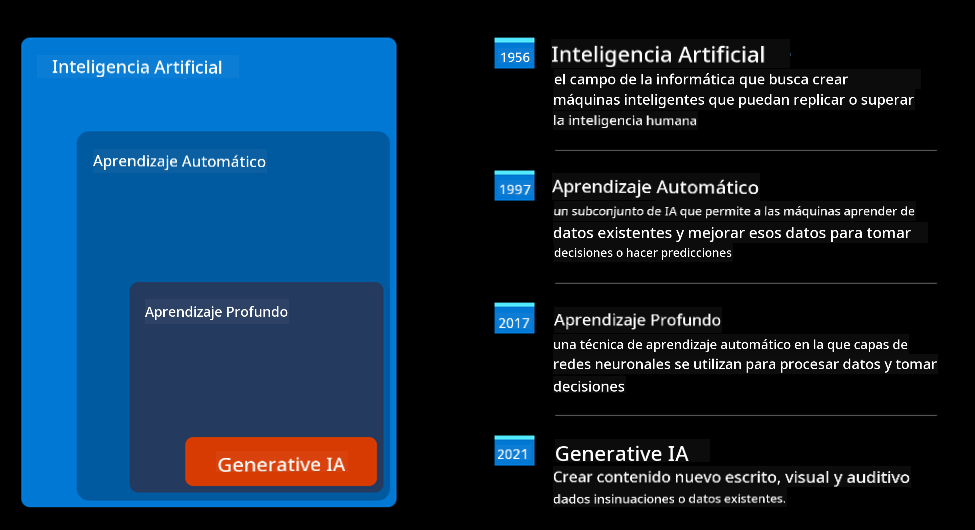
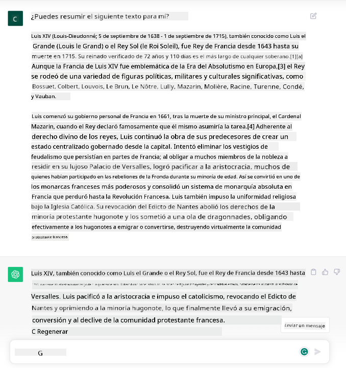
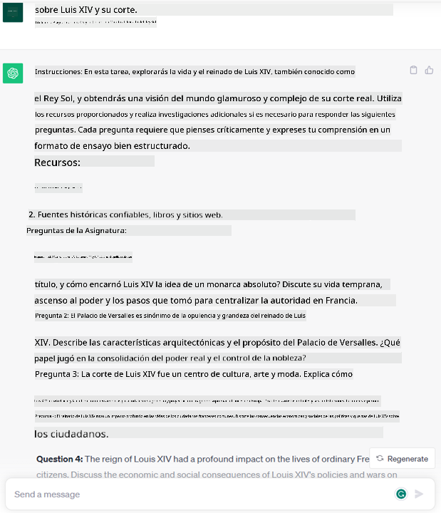
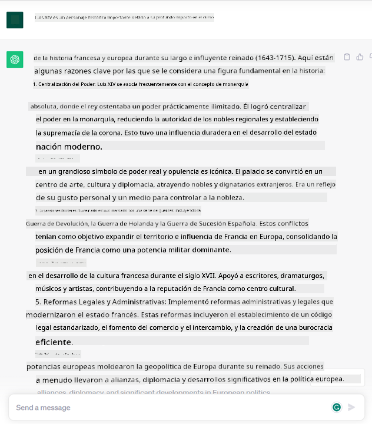

<!--
CO_OP_TRANSLATOR_METADATA:
{
  "original_hash": "f53ba0fa49164f9323043f1c6b11f2b1",
  "translation_date": "2025-05-19T09:07:06+00:00",
  "source_file": "01-introduction-to-genai/README.md",
  "language_code": "es"
}
-->
# Introducción a la IA Generativa y Modelos de Lenguaje Grandes

_(Haz clic en la imagen de arriba para ver el video de esta lección)_

La IA generativa es inteligencia artificial capaz de generar texto, imágenes y otros tipos de contenido. Lo que la hace una tecnología fantástica es que democratiza la IA, cualquiera puede usarla con tan solo un mensaje de texto, una oración escrita en un lenguaje natural. No necesitas aprender un lenguaje como Java o SQL para lograr algo valioso, todo lo que necesitas es usar tu lenguaje, expresar lo que deseas y recibirás una sugerencia de un modelo de IA. Las aplicaciones e impacto de esto son enormes, puedes escribir o entender informes, redactar aplicaciones y mucho más, todo en segundos.

En este plan de estudios, exploraremos cómo nuestra startup aprovecha la IA generativa para desbloquear nuevos escenarios en el mundo educativo y cómo abordamos los inevitables desafíos asociados con las implicaciones sociales de su aplicación y las limitaciones tecnológicas.

## Introducción

Esta lección cubrirá:

- Introducción al escenario de negocio: nuestra idea y misión de startup.
- IA generativa y cómo llegamos al panorama tecnológico actual.
- Funcionamiento interno de un modelo de lenguaje grande.
- Principales capacidades y casos de uso prácticos de los Modelos de Lenguaje Grandes.

## Objetivos de aprendizaje

Después de completar esta lección, comprenderás:

- Qué es la IA generativa y cómo funcionan los Modelos de Lenguaje Grandes.
- Cómo puedes aprovechar los modelos de lenguaje grandes para diferentes casos de uso, con un enfoque en escenarios educativos.

## Escenario: nuestra startup educativa

La Inteligencia Artificial (IA) Generativa representa la cúspide de la tecnología IA, empujando los límites de lo que alguna vez se pensó imposible. Los modelos de IA generativa tienen varias capacidades y aplicaciones, pero para este plan de estudios exploraremos cómo está revolucionando la educación a través de una startup ficticia. Nos referiremos a esta startup como _nuestra startup_. Nuestra startup trabaja en el ámbito educativo con la ambiciosa declaración de misión de

> _mejorar la accesibilidad en el aprendizaje, a nivel mundial, asegurando un acceso equitativo a la educación y proporcionando experiencias de aprendizaje personalizadas a cada estudiante, según sus necesidades_.

El equipo de nuestra startup es consciente de que no podremos lograr este objetivo sin aprovechar una de las herramientas más poderosas de los tiempos modernos: los Modelos de Lenguaje Grandes (LLMs).

Se espera que la IA generativa revolucione la forma en que aprendemos y enseñamos hoy, con estudiantes que tienen a su disposición profesores virtuales las 24 horas del día que proporcionan grandes cantidades de información y ejemplos, y profesores que pueden aprovechar herramientas innovadoras para evaluar a sus estudiantes y dar retroalimentación.

Para comenzar, definamos algunos conceptos básicos y terminología que utilizaremos a lo largo del plan de estudios.

## ¿Cómo obtuvimos la IA Generativa?

A pesar del extraordinario _hype_ creado últimamente por el anuncio de modelos de IA generativa, esta tecnología lleva décadas desarrollándose, con los primeros esfuerzos de investigación que se remontan a los años 60. Ahora estamos en un punto en el que la IA tiene capacidades cognitivas humanas, como la conversación, como lo demuestra, por ejemplo, [OpenAI ChatGPT](https://openai.com/chatgpt) o [Bing Chat](https://www.microsoft.com/edge/features/bing-chat?WT.mc_id=academic-105485-koreyst), que también utiliza un modelo GPT para las conversaciones de búsqueda web de Bing.

Retrocediendo un poco, los primeros prototipos de IA consistían en chatbots mecanografiados, que dependían de una base de conocimiento extraída de un grupo de expertos y representada en una computadora. Las respuestas en la base de conocimiento se activaban por palabras clave que aparecían en el texto de entrada. Sin embargo, pronto quedó claro que tal enfoque, utilizando chatbots mecanografiados, no escalaba bien.

### Un enfoque estadístico para la IA: Aprendizaje Automático

Un punto de inflexión llegó durante los años 90, con la aplicación de un enfoque estadístico al análisis de texto. Esto condujo al desarrollo de nuevos algoritmos, conocidos como aprendizaje automático, capaces de aprender patrones a partir de datos sin ser programados explícitamente. Este enfoque permite a las máquinas simular la comprensión del lenguaje humano: un modelo estadístico se entrena con emparejamientos de texto y etiquetas, permitiendo que el modelo clasifique texto de entrada desconocido con una etiqueta predefinida que representa la intención del mensaje.

### Redes neuronales y asistentes virtuales modernos

En años recientes, la evolución tecnológica del hardware, capaz de manejar mayores cantidades de datos y cálculos más complejos, fomentó la investigación en IA, conduciendo al desarrollo de algoritmos avanzados de aprendizaje automático conocidos como redes neuronales o algoritmos de aprendizaje profundo.

Las redes neuronales (y en particular las Redes Neuronales Recurrentes – RNNs) mejoraron significativamente el procesamiento del lenguaje natural, permitiendo la representación del significado del texto de una manera más significativa, valorando el contexto de una palabra en una oración.

Esta es la tecnología que impulsó a los asistentes virtuales nacidos en la primera década del nuevo siglo, muy competentes en interpretar el lenguaje humano, identificar una necesidad y realizar una acción para satisfacerla, como responder con un guion predefinido o consumir un servicio de terceros.

### Hoy en día, IA Generativa

Así es como llegamos a la IA Generativa hoy en día, que puede considerarse un subconjunto del aprendizaje profundo.

Después de décadas de investigación en el campo de la IA, una nueva arquitectura de modelo, llamada _Transformer_, superó los límites de las RNNs, siendo capaz de recibir secuencias de texto mucho más largas como entrada. Los Transformers se basan en el mecanismo de atención, permitiendo que el modelo asigne diferentes pesos a las entradas que recibe, 'prestando más atención' donde se concentra la información más relevante, independientemente de su orden en la secuencia de texto.

La mayoría de los modelos de IA generativa recientes, también conocidos como Modelos de Lenguaje Grandes (LLMs), ya que trabajan con entradas y salidas textuales, están de hecho basados en esta arquitectura. Lo interesante de estos modelos, entrenados con una gran cantidad de datos no etiquetados de diversas fuentes como libros, artículos y sitios web, es que pueden adaptarse a una amplia variedad de tareas y generar texto gramaticalmente correcto con una apariencia de creatividad. Así que, no solo mejoraron increíblemente la capacidad de una máquina para 'entender' un texto de entrada, sino que habilitaron su capacidad para generar una respuesta original en lenguaje humano.

## ¿Cómo funcionan los modelos de lenguaje grandes?

En el próximo capítulo vamos a explorar diferentes tipos de modelos de IA Generativa, pero por ahora echemos un vistazo a cómo funcionan los modelos de lenguaje grandes, con un enfoque en los modelos GPT (Generative Pre-trained Transformer) de OpenAI.

- **Tokenizador, texto a números**: Los Modelos de Lenguaje Grandes reciben un texto como entrada y generan un texto como salida. Sin embargo, siendo modelos estadísticos, funcionan mucho mejor con números que con secuencias de texto. Es por eso que cada entrada al modelo es procesada por un tokenizador, antes de ser utilizada por el modelo principal. Un token es un fragmento de texto, que consta de un número variable de caracteres, por lo que la tarea principal del tokenizador es dividir la entrada en un arreglo de tokens. Luego, cada token se asigna a un índice de token, que es la codificación entera del fragmento de texto original.

- **Predicción de tokens de salida**: Dado n tokens como entrada (con un máximo n que varía de un modelo a otro), el modelo es capaz de predecir un token como salida. Este token se incorpora a la entrada de la siguiente iteración, en un patrón de ventana expansiva, permitiendo una mejor experiencia de usuario al obtener una (o varias) oraciones como respuesta. Esto explica por qué, si alguna vez has jugado con ChatGPT, podrías haber notado que a veces parece que se detiene en medio de una oración.

- **Proceso de selección, distribución de probabilidad**: El token de salida es elegido por el modelo de acuerdo con su probabilidad de ocurrir después de la secuencia de texto actual. Esto se debe a que el modelo predice una distribución de probabilidad sobre todos los posibles 'siguientes tokens', calculada en base a su entrenamiento. Sin embargo, no siempre se elige el token con la mayor probabilidad de la distribución resultante. Se añade un grado de aleatoriedad a esta elección, de manera que el modelo actúa de forma no determinista: no obtenemos la misma salida exacta para la misma entrada. Este grado de aleatoriedad se añade para simular el proceso de pensamiento creativo y se puede ajustar utilizando un parámetro del modelo llamado temperatura.

## ¿Cómo puede nuestra startup aprovechar los Modelos de Lenguaje Grandes?

Ahora que tenemos una mejor comprensión del funcionamiento interno de un modelo de lenguaje grande, veamos algunos ejemplos prácticos de las tareas más comunes que pueden realizar bastante bien, con un ojo en nuestro escenario de negocio. Dijimos que la capacidad principal de un Modelo de Lenguaje Grande es _generar un texto desde cero, partiendo de una entrada textual, escrita en lenguaje natural_.

Pero, ¿qué tipo de entrada y salida textual? La entrada de un modelo de lenguaje grande se conoce como prompt, mientras que la salida se conoce como completion, término que se refiere al mecanismo del modelo de generar el siguiente token para completar la entrada actual. Vamos a profundizar en lo que es un prompt y cómo diseñarlo de manera que se obtenga el máximo provecho de nuestro modelo. Pero por ahora, digamos que un prompt puede incluir:

- Una **instrucción** especificando el tipo de salida que esperamos del modelo. Esta instrucción a veces puede incluir algunos ejemplos o algunos datos adicionales.

  1. Resumen de un artículo, libro, reseñas de productos y más, junto con la extracción de ideas de datos no estructurados.
    
    
  
  2. Ideación creativa y diseño de un artículo, ensayo, tarea o más.
      
     

- Una **pregunta**, formulada en forma de conversación con un agente.
  
  

- Un fragmento de **texto para completar**, que implícitamente es una solicitud de asistencia para escribir.
  
  

- Un fragmento de **código** junto con la solicitud de explicarlo y documentarlo, o un comentario pidiendo generar un fragmento de código que realice una tarea específica.
  
  

Los ejemplos anteriores son bastante simples y no pretenden ser una demostración exhaustiva de las capacidades de los Modelos de Lenguaje Grandes. Están destinados a mostrar el potencial de usar IA generativa, en particular pero no limitado a contextos educativos.

Además, la salida de un modelo de IA generativa no es perfecta y a veces la creatividad del modelo puede jugar en su contra, resultando en una salida que es una combinación de palabras que el usuario humano puede interpretar como una mistificación de la realidad, o puede ser ofensiva. La IA generativa no es inteligente, al menos en la definición más completa de inteligencia, que incluye razonamiento crítico y creativo o inteligencia emocional; no es determinista y no es confiable, ya que las fabricaciones, como referencias erróneas, contenido y declaraciones, pueden combinarse con información correcta y presentarse de manera persuasiva y segura. En las siguientes lecciones, abordaremos todas estas limitaciones y veremos qué podemos hacer para mitigarlas.

## Tarea

Tu tarea es leer más sobre [IA generativa](https://en.wikipedia.org/wiki/Generative_artificial_intelligence?WT.mc_id=academic-105485-koreyst) e intentar identificar un área donde agregarías IA generativa hoy en día que no la tenga. ¿Cómo sería el impacto diferente de hacerlo a la "antigua usanza", puedes hacer algo que no podías antes o eres más rápido? Escribe un resumen de 300 palabras sobre cómo sería tu startup de IA soñada e incluye encabezados como "Problema", "Cómo usaría la IA", "Impacto" y opcionalmente un plan de negocios.

Si realizaste esta tarea, podrías estar listo para postularte al incubador de Microsoft, [Microsoft for Startups Founders Hub](https://www.microsoft.com/startups?WT.mc_id=academic-105485-koreyst) ofrecemos créditos tanto para Azure, OpenAI, mentoría y mucho más, ¡échale un vistazo!

## Comprobación de conocimientos

¿Qué es cierto sobre los modelos de lenguaje grandes?

1. Obtienes la misma respuesta exacta cada vez.
1. Hace las cosas perfectamente, excelente para sumar números, producir código funcional, etc.
1. La respuesta puede variar a pesar de usar el mismo prompt. También es excelente para darte un primer borrador de algo, ya sea texto o código. Pero necesitas mejorar los resultados.

A: 3, un LLM es no determinista, la respuesta varía, sin embargo, puedes controlar su variación a través de un ajuste de temperatura. Tampoco deberías esperar que haga las cosas perfectamente, está aquí para hacer el trabajo pesado por ti, lo que a menudo significa que obtienes un buen primer intento de algo que necesitas mejorar gradualmente.

## ¡Buen trabajo! Continúa el viaje

Después de completar esta lección, revisa nuestra [colección de aprendizaje de IA Generativa](https://aka.ms/genai-collection?WT.mc_id=academic-105485-koreyst) para seguir aumentando tu conocimiento sobre IA Generativa.

Dirígete a la Lección 2 donde veremos cómo [explorar y comparar diferentes tipos de LLM](../02-exploring-and-comparing-different-llms/README.md?WT.mc_id=academic-105485-koreyst)!

**Descargo de responsabilidad**:  
Este documento ha sido traducido utilizando el servicio de traducción automática [Co-op Translator](https://github.com/Azure/co-op-translator). Aunque nos esforzamos por lograr precisión, tenga en cuenta que las traducciones automáticas pueden contener errores o imprecisiones. El documento original en su idioma nativo debe considerarse la fuente autorizada. Para información crítica, se recomienda una traducción humana profesional. No somos responsables de ningún malentendido o interpretación errónea que surja del uso de esta traducción.