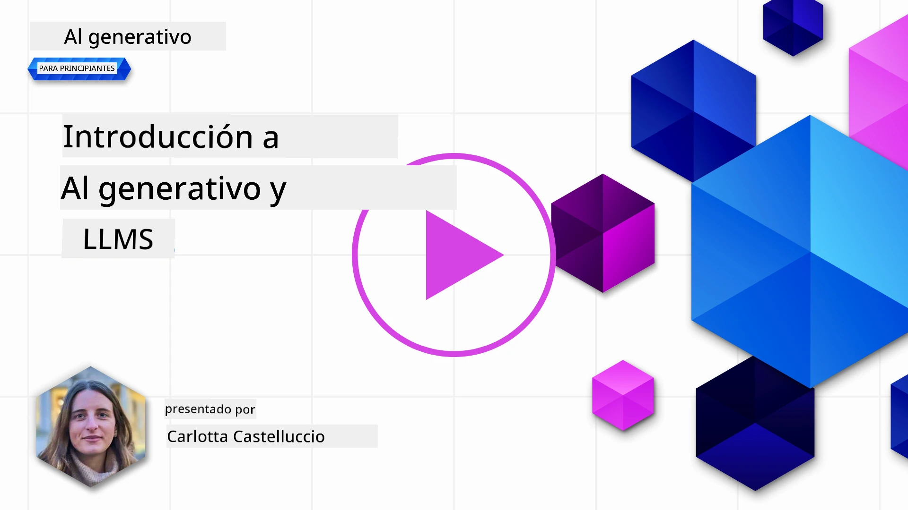
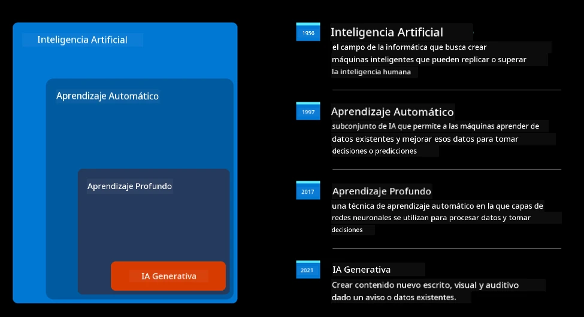
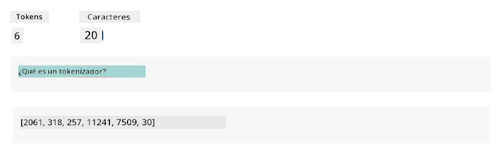
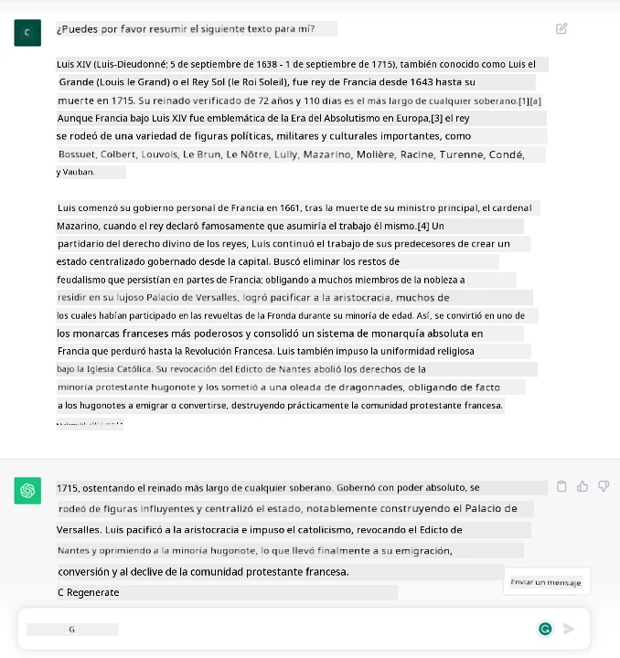
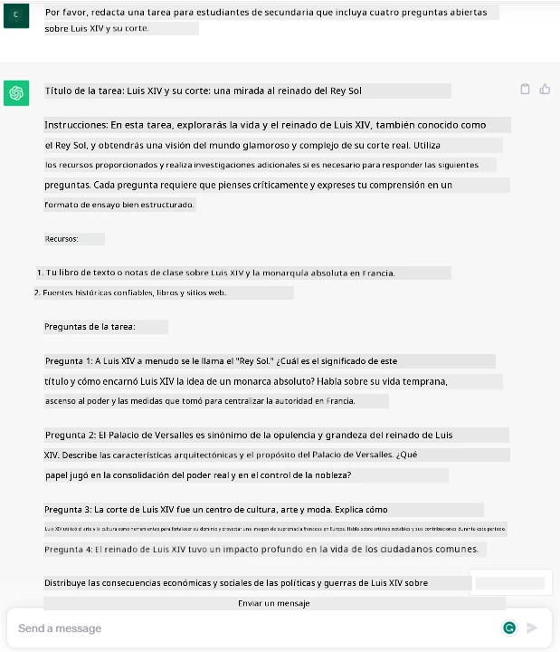
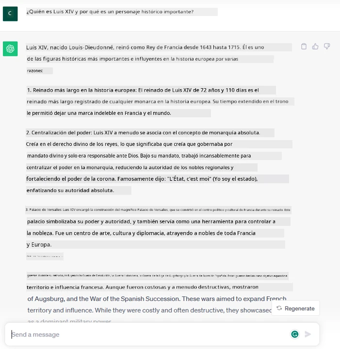
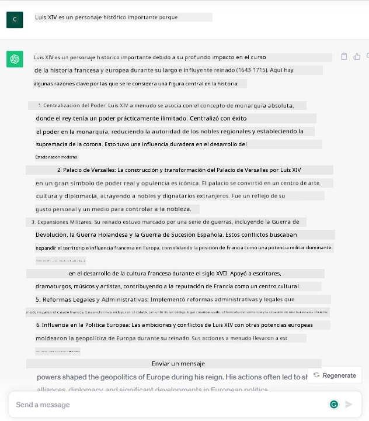
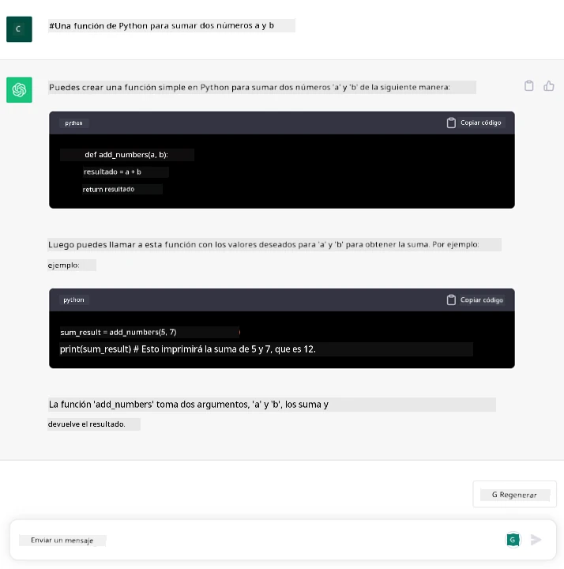

# Introducción a la IA Generativa y a los Grandes Modelos de Lenguaje

_(Haz clic en la imagen de arriba para ver el video de esta lección)_

La IA generativa es la inteligencia artificial capaz de generar texto, imágenes y otros tipos de contenido. Lo que la hace una tecnología fantástica es que democratiza la IA, cualquiera puede usarla con tan solo un texto de entrada, una frase escrita en un lenguaje natural. No necesitas aprender un lenguaje como Java o SQL para lograr algo valioso, todo lo que necesitas es usar tu propio idioma, decir lo que quieres y aparece una sugerencia de un modelo de IA. Las aplicaciones y el impacto de esto son enormes, escribes o entiendes informes, desarrollas aplicaciones y mucho más, todo en segundos.

En este plan de estudios, exploraremos cómo nuestra startup aprovecha la IA generativa para desbloquear nuevos escenarios en el mundo de la educación y cómo abordamos los desafíos inevitables asociados con las implicaciones sociales de su aplicación y las limitaciones tecnológicas.

## Introducción

Esta lección cubrirá:

- Introducción al escenario de negocio: la idea y misión de nuestra startup.
- La IA generativa y cómo llegamos al panorama tecnológico actual.
- Funcionamiento interno de un gran modelo de lenguaje.
- Capacidades principales y casos de uso prácticos de los Grandes Modelos de Lenguaje.

## Objetivos de aprendizaje

Al completar esta lección, comprenderás:

- Qué es la IA generativa y cómo funcionan los Grandes Modelos de Lenguaje.
- Cómo puedes aprovechar los grandes modelos de lenguaje para diferentes casos de uso, con enfoque en escenarios educativos.

## Escenario: nuestra startup educativa

La Inteligencia Artificial (IA) Generativa representa la cúspide de la tecnología de IA, empujando los límites de lo que una vez se pensó imposible. Los modelos de IA generativa tienen varias capacidades y aplicaciones, pero para este plan de estudios exploraremos cómo está revolucionando la educación a través de una startup ficticia. Nos referiremos a esta startup como _nuestra startup_. Nuestra startup trabaja en el ámbito educativo con la ambiciosa declaración de misión de

> _mejorar la accesibilidad en el aprendizaje, a escala global, asegurando el acceso equitativo a la educación y ofreciendo experiencias de aprendizaje personalizadas a cada estudiante, según sus necesidades_.

Nuestro equipo de startup es consciente de que no podremos lograr este objetivo sin aprovechar una de las herramientas más poderosas de los tiempos modernos: los Grandes Modelos de Lenguaje (LLMs).

Se espera que la IA generativa revolucione la forma en que aprendemos y enseñamos hoy, con estudiantes disponiendo de profesores virtuales las 24 horas del día que proporcionan grandes cantidades de información y ejemplos, y profesores capaces de aprovechar herramientas innovadoras para evaluar a sus estudiantes y dar retroalimentación.

Para comenzar, definamos algunos conceptos básicos y terminología que usaremos a lo largo del plan de estudios.

## ¿Cómo llegamos a la IA Generativa?

A pesar del extraordinario _hype_ creado últimamente por el anuncio de modelos de IA generativa, esta tecnología tiene décadas de desarrollo, con los primeros esfuerzos de investigación que se remontan a los años 60. Ahora estamos en un punto en que la IA tiene capacidades cognitivas humanas, como la conversación demostrada por ejemplo por [OpenAI ChatGPT](https://openai.com/chatgpt) o [Microsoft Copilot](https://copilot.microsoft.com/?WT.mc_id=academic-105485-koreyst), que también usa un modelo GPT para su experiencia conversacional de búsqueda web.

Retrocediendo un poco, los primeros prototipos de IA consistían en chatbots mecanografiados, que se basaban en una base de conocimiento extraída de un grupo de expertos y representada en una computadora. Las respuestas en la base de conocimiento se activaban mediante palabras clave que aparecían en el texto de entrada.
Sin embargo, pronto quedó claro que tal enfoque, usando chatbots mecanografiados, no escalaba bien.

### Un enfoque estadístico para la IA: Aprendizaje Automático

Un punto de inflexión llegó durante los años 90, con la aplicación de un enfoque estadístico al análisis de texto. Esto llevó al desarrollo de nuevos algoritmos – conocidos como aprendizaje automático – capaces de aprender patrones a partir de datos sin ser explícitamente programados. Este enfoque permite que las máquinas simulen la comprensión humana del lenguaje: un modelo estadístico se entrena con emparejamientos de texto y etiquetas, permitiendo al modelo clasificar texto desconocido con una etiqueta predefinida que representa la intención del mensaje.

### Redes neuronales y asistentes virtuales modernos

En años recientes, la evolución tecnológica del hardware, capaz de manejar mayores cantidades de datos y cálculos más complejos, fomentó la investigación en IA, conduciendo al desarrollo de algoritmos avanzados de aprendizaje automático conocidos como redes neuronales o algoritmos de aprendizaje profundo.

Las redes neuronales (y en particular las Redes Neuronales Recurrentes – RNNs) mejoraron significativamente el procesamiento del lenguaje natural, permitiendo la representación del significado del texto de una manera más significativa, valorando el contexto de una palabra en una oración.

Esta es la tecnología que impulsó a los asistentes virtuales nacidos en la primera década del nuevo siglo, muy competentes en interpretar el lenguaje humano, identificar una necesidad y realizar una acción para satisfacerla – como responder con un guion predefinido o consumir un servicio de terceros.

### Hoy en día, IA Generativa

Así es como llegamos a la IA Generativa actual, que puede verse como un subconjunto del aprendizaje profundo.

Después de décadas de investigación en el campo de la IA, una nueva arquitectura de modelo – llamada _Transformer_ – superó los límites de las RNN, siendo capaz de procesar secuencias de texto mucho más largas como entrada. Los Transformers se basan en el mecanismo de atención, permitiendo al modelo dar diferentes pesos a las entradas que recibe, ‘prestando más atención’ donde la información más relevante está concentrada, sin importar su orden en la secuencia de texto.

La mayoría de los modelos generativos recientes – también conocidos como Grandes Modelos de Lenguaje (LLMs), ya que trabajan con entradas y salidas textuales – están basados en esta arquitectura. Lo interesante de estos modelos – entrenados con una enorme cantidad de datos no etiquetados de fuentes diversas como libros, artículos y sitios web – es que pueden adaptarse a una gran variedad de tareas y generar texto gramaticalmente correcto con cierto semblante de creatividad. Por lo tanto, no solo mejoraron increíblemente la capacidad de una máquina para ‘entender’ un texto de entrada, sino que habilitaron su capacidad de generar una respuesta original en lenguaje humano.

## ¿Cómo funcionan los grandes modelos de lenguaje?

En el próximo capítulo exploraremos diferentes tipos de modelos de IA generativa, pero por ahora veamos cómo funcionan los grandes modelos de lenguaje, con enfoque en los modelos OpenAI GPT (Generative Pre-trained Transformer).

- **Tokenizador, texto a números**: Los Grandes Modelos de Lenguaje reciben un texto como entrada y generan un texto como salida. Sin embargo, como son modelos estadísticos, funcionan mucho mejor con números que con secuencias de texto. Por eso cada entrada al modelo es procesada por un tokenizador, antes de ser usada por el modelo central. Un token es un fragmento de texto – que consta de un número variable de caracteres, por lo que la tarea principal del tokenizador es dividir la entrada en una matriz de tokens. Luego, cada token se asigna a un índice de token, que es la codificación entera del fragmento original de texto.

- **Predicción de tokens de salida**: Dado n tokens como entrada (con un máximo n que varía según el modelo), el modelo puede predecir un token como salida. Este token se incorpora luego a la entrada de la próxima iteración, en un patrón de ventana expansiva, permitiendo una mejor experiencia para el usuario al obtener una (o múltiples) oraciones como respuesta. Esto explica por qué, si alguna vez jugaste con ChatGPT, puede parecer que a veces se detiene a mitad de una oración.

- **Proceso de selección, distribución de probabilidad**: El token de salida es elegido por el modelo de acuerdo con su probabilidad de ocurrir después de la secuencia de texto actual. Esto es porque el modelo predice una distribución de probabilidad sobre todos los posibles ‘siguientes tokens’, calculada con base en su entrenamiento. Sin embargo, no siempre se elige el token con la probabilidad más alta de la distribución resultante. Se añade un grado de aleatoriedad a esta elección, de manera que el modelo actúa de forma no determinista - no obtenemos la misma salida exacta para la misma entrada. Este grado de aleatoriedad se añade para simular el proceso de pensamiento creativo y puede ajustarse mediante un parámetro del modelo llamado temperatura.

## ¿Cómo puede nuestra startup aprovechar los Grandes Modelos de Lenguaje?

Ahora que tenemos un mejor entendimiento del funcionamiento interno de un gran modelo de lenguaje, veamos algunos ejemplos prácticos de las tareas más comunes que pueden realizar bastante bien, con un ojo a nuestro escenario de negocio.
Dijimos que la capacidad principal de un Gran Modelo de Lenguaje es _generar un texto desde cero, comenzando con una entrada textual, escrita en lenguaje natural_.

¿Pero qué tipo de entrada y salida textual?
La entrada de un gran modelo de lenguaje se conoce como prompt, mientras que la salida se conoce como completion, término que se refiere al mecanismo del modelo para generar el siguiente token que completa la entrada actual. Vamos a profundizar en qué es un prompt y cómo diseñarlo para obtener el máximo provecho de nuestro modelo. Pero por ahora, digamos que un prompt puede incluir:

- Una **instrucción** especificando el tipo de salida que esperamos del modelo. Esta instrucción a veces puede incluir algunos ejemplos o datos adicionales.

  1. Resumen de un artículo, libro, reseñas de productos y más, junto con extracción de insights de datos no estructurados.
    
    
  
  2. Ideación creativa y diseño de un artículo, un ensayo, una tarea o más.
      
     

- Una **pregunta**, realizada en forma de conversación con un agente.
  
  

- Un fragmento de **texto para completar**, que implícitamente es una solicitud de asistencia de escritura.
  
  

- Un fragmento de **código** junto con la solicitud de explicarlo y documentarlo, o un comentario pidiendo generar un fragmento de código para realizar una tarea específica.
  
  

Los ejemplos anteriores son bastante simples y no pretenden ser una demostración exhaustiva de las capacidades de los Grandes Modelos de Lenguaje. Están pensados para mostrar el potencial del uso de la IA generativa, en particular pero no exclusivamente en contextos educativos.

Además, la salida de un modelo de IA generativa no es perfecta y a veces la creatividad del modelo puede jugar en su contra, resultando en una salida que es una combinación de palabras que el usuario humano puede interpretar como una mistificación de la realidad, o puede ser ofensiva. La IA generativa no es inteligente - al menos no en la definición más amplia de inteligencia, que incluye razonamiento crítico y creativo o inteligencia emocional; no es determinista, y no es confiable, ya que fabricaciones, como referencias erróneas, contenido y afirmaciones, pueden combinarse con información correcta y presentarse de manera persuasiva y segura. En las siguientes lecciones, abordaremos todas estas limitaciones y veremos qué podemos hacer para mitigarlas.

## Tarea

Tu tarea es investigar más sobre [la IA generativa](https://en.wikipedia.org/wiki/Generative_artificial_intelligence?WT.mc_id=academic-105485-koreyst) e intentar identificar una área donde agregarías IA generativa hoy que aún no la tenga. ¿Cómo sería el impacto diferente al hacerlo de la "manera antigua"? ¿Puedes hacer algo que no podías antes, o eres más rápido? Escribe un resumen de 300 palabras sobre cómo sería tu startup de IA soñada e incluye encabezados como "Problema", "Cómo usaría IA", "Impacto" y opcionalmente un plan de negocios.

Si haces esta tarea, podrías incluso estar listo para aplicar al incubador de Microsoft, el [Microsoft for Startups Founders Hub](https://www.microsoft.com/startups?WT.mc_id=academic-105485-koreyst), donde ofrecemos créditos para Azure, OpenAI, mentoría y mucho más, ¡échale un vistazo!

## Verificación de conocimientos

¿Qué es cierto acerca de los grandes modelos de lenguaje?

1. Obtienes la misma respuesta exacta cada vez.
1. Hace las cosas perfectamente, excelente sumando números, produciendo código funcional, etc.
1. La respuesta puede variar a pesar de usar el mismo prompt. También es genial para darte un primer borrador de algo, ya sea texto o código. Pero necesitas mejorar los resultados.

A: 3, un LLM es no determinista, la respuesta varía, sin embargo, puedes controlar su variación mediante un ajuste de temperatura. Tampoco debes esperar que haga las cosas perfectamente, está aquí para hacer el trabajo pesado por ti lo que a menudo significa que obtienes un buen primer intento que necesitas mejorar gradualmente.

## ¡Buen trabajo! Continúa el viaje

Después de completar esta lección, revisa nuestra [colección de Aprendizaje sobre IA Generativa](https://aka.ms/genai-collection?WT.mc_id=academic-105485-koreyst) para seguir elevando tu conocimiento en IA Generativa.

Dirígete a la Lección 2 donde veremos cómo [explorar y comparar diferentes tipos de LLM](../02-exploring-and-comparing-different-llms/README.md?WT.mc_id=academic-105485-koreyst)!

---

<!-- CO-OP TRANSLATOR DISCLAIMER START -->
**Descargo de responsabilidad**:
Este documento ha sido traducido utilizando el servicio de traducción automática [Co-op Translator](https://github.com/Azure/co-op-translator). Aunque nos esforzamos por la precisión, tenga en cuenta que las traducciones automatizadas pueden contener errores o inexactitudes. El documento original en su idioma nativo debe considerarse la fuente autorizada. Para información crítica, se recomienda una traducción profesional humana. No somos responsables de cualquier malentendido o interpretación errónea que surja del uso de esta traducción.
<!-- CO-OP TRANSLATOR DISCLAIMER END -->