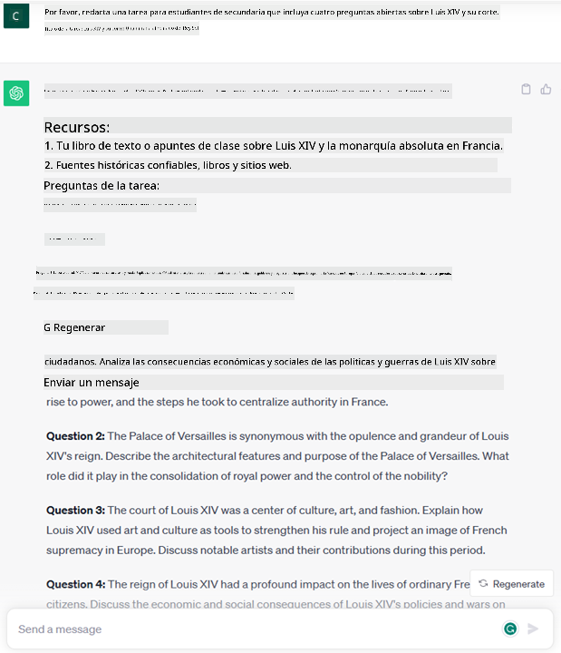
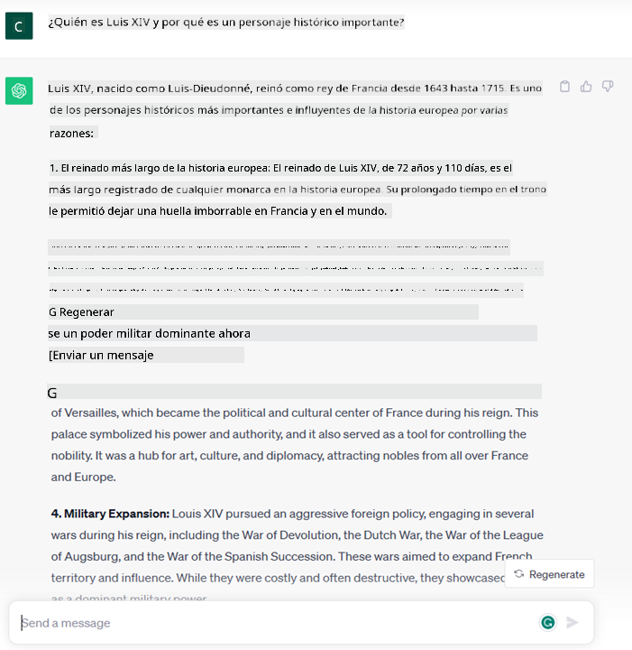
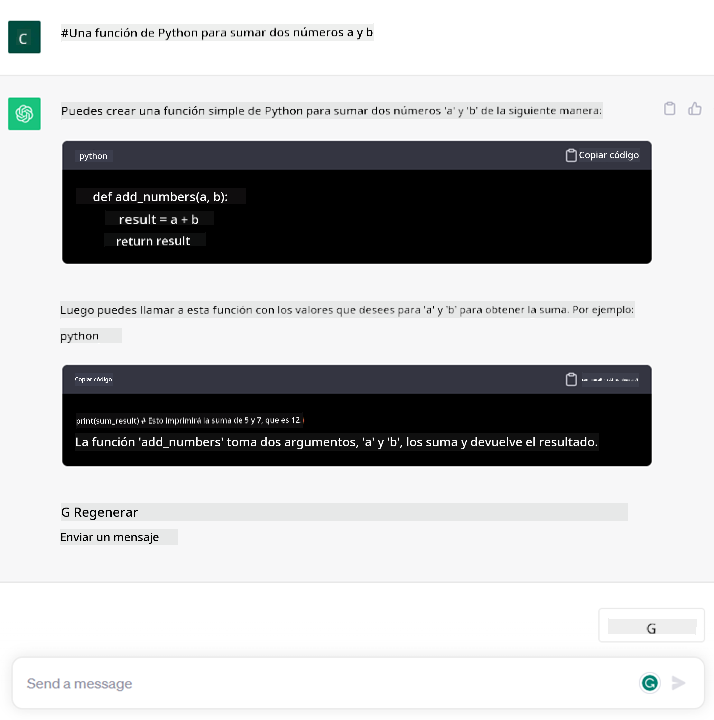

<!--
CO_OP_TRANSLATOR_METADATA:
{
  "original_hash": "f53ba0fa49164f9323043f1c6b11f2b1",
  "translation_date": "2025-07-09T07:40:49+00:00",
  "source_file": "01-introduction-to-genai/README.md",
  "language_code": "es"
}
-->
# Introducción a la IA Generativa y los Grandes Modelos de Lenguaje

_(Haz clic en la imagen de arriba para ver el video de esta lección)_

La IA generativa es una inteligencia artificial capaz de generar texto, imágenes y otros tipos de contenido. Lo que la hace una tecnología fantástica es que democratiza la IA, cualquiera puede usarla con tan solo un texto de entrada, una frase escrita en lenguaje natural. No necesitas aprender un lenguaje como Java o SQL para lograr algo valioso, solo tienes que usar tu idioma, expresar lo que quieres y obtendrás una sugerencia de un modelo de IA. Las aplicaciones e impacto de esto son enormes: puedes redactar o entender informes, escribir aplicaciones y mucho más, todo en segundos.

En este plan de estudios, exploraremos cómo nuestra startup aprovecha la IA generativa para desbloquear nuevos escenarios en el mundo educativo y cómo abordamos los desafíos inevitables relacionados con las implicaciones sociales de su aplicación y las limitaciones tecnológicas.

## Introducción

Esta lección cubrirá:

- Introducción al escenario de negocio: la idea y misión de nuestra startup.
- IA generativa y cómo llegamos al panorama tecnológico actual.
- Funcionamiento interno de un gran modelo de lenguaje.
- Capacidades principales y casos prácticos de uso de los Grandes Modelos de Lenguaje.

## Objetivos de aprendizaje

Al completar esta lección, comprenderás:

- Qué es la IA generativa y cómo funcionan los Grandes Modelos de Lenguaje.
- Cómo puedes aprovechar los grandes modelos de lenguaje para diferentes casos de uso, con un enfoque en escenarios educativos.

## Escenario: nuestra startup educativa

La Inteligencia Artificial Generativa (IA) representa la cúspide de la tecnología IA, ampliando los límites de lo que antes se consideraba imposible. Los modelos de IA generativa tienen varias capacidades y aplicaciones, pero en este plan de estudios exploraremos cómo está revolucionando la educación a través de una startup ficticia. Nos referiremos a esta startup como _nuestra startup_. Nuestra startup trabaja en el ámbito educativo con la ambiciosa misión de

> _mejorar la accesibilidad en el aprendizaje, a escala global, asegurando un acceso equitativo a la educación y proporcionando experiencias de aprendizaje personalizadas para cada estudiante, según sus necesidades_.

El equipo de nuestra startup sabe que no podrá alcanzar este objetivo sin aprovechar una de las herramientas más poderosas de los tiempos modernos: los Grandes Modelos de Lenguaje (LLMs).

Se espera que la IA generativa revolucione la forma en que aprendemos y enseñamos hoy, con estudiantes que disponen de profesores virtuales las 24 horas del día que proporcionan gran cantidad de información y ejemplos, y profesores que pueden usar herramientas innovadoras para evaluar a sus estudiantes y ofrecer retroalimentación.

Para comenzar, definamos algunos conceptos básicos y terminología que usaremos a lo largo del plan de estudios.

## ¿Cómo llegamos a la IA Generativa?

A pesar del extraordinario _hype_ generado últimamente por el anuncio de modelos de IA generativa, esta tecnología lleva décadas en desarrollo, con los primeros esfuerzos de investigación que datan de los años 60. Ahora estamos en un punto en el que la IA tiene capacidades cognitivas humanas, como la conversación, como lo demuestran por ejemplo [OpenAI ChatGPT](https://openai.com/chatgpt) o [Bing Chat](https://www.microsoft.com/edge/features/bing-chat?WT.mc_id=academic-105485-koreyst), que también usa un modelo GPT para las conversaciones de búsqueda web en Bing.

Retrocediendo un poco, los primeros prototipos de IA consistían en chatbots mecanografiados, que se basaban en una base de conocimiento extraída de un grupo de expertos y representada en una computadora. Las respuestas en la base de conocimiento se activaban por palabras clave que aparecían en el texto de entrada. Sin embargo, pronto quedó claro que este enfoque, usando chatbots mecanografiados, no escalaba bien.

### Un enfoque estadístico para la IA: Aprendizaje Automático

Un punto de inflexión llegó durante los años 90, con la aplicación de un enfoque estadístico al análisis de texto. Esto llevó al desarrollo de nuevos algoritmos – conocidos como aprendizaje automático – capaces de aprender patrones a partir de datos sin ser programados explícitamente. Este enfoque permite que las máquinas simulen la comprensión del lenguaje humano: un modelo estadístico se entrena con pares texto-etiqueta, permitiendo que el modelo clasifique textos desconocidos con una etiqueta predefinida que representa la intención del mensaje.

### Redes neuronales y asistentes virtuales modernos

En años recientes, la evolución tecnológica del hardware, capaz de manejar mayores cantidades de datos y cálculos más complejos, impulsó la investigación en IA, llevando al desarrollo de algoritmos avanzados de aprendizaje automático conocidos como redes neuronales o aprendizaje profundo.

Las redes neuronales (y en particular las Redes Neuronales Recurrentes – RNNs) mejoraron significativamente el procesamiento del lenguaje natural, permitiendo representar el significado del texto de una manera más significativa, valorando el contexto de una palabra en una oración.

Esta es la tecnología que impulsó a los asistentes virtuales nacidos en la primera década del nuevo siglo, muy competentes en interpretar el lenguaje humano, identificar una necesidad y realizar una acción para satisfacerla – como responder con un guion predefinido o consumir un servicio de terceros.

### Hoy en día, IA Generativa

Así es como llegamos a la IA Generativa actual, que puede verse como un subconjunto del aprendizaje profundo.

Después de décadas de investigación en el campo de la IA, una nueva arquitectura de modelo – llamada _Transformer_ – superó los límites de las RNNs, siendo capaz de procesar secuencias de texto mucho más largas como entrada. Los Transformers se basan en el mecanismo de atención, que permite al modelo asignar diferentes pesos a las entradas que recibe, ‘prestando más atención’ donde se concentra la información más relevante, sin importar su orden en la secuencia de texto.

La mayoría de los modelos recientes de IA generativa – también conocidos como Grandes Modelos de Lenguaje (LLMs), ya que trabajan con entradas y salidas textuales – están basados en esta arquitectura. Lo interesante de estos modelos – entrenados con una enorme cantidad de datos no etiquetados de fuentes diversas como libros, artículos y sitios web – es que pueden adaptarse a una gran variedad de tareas y generar texto gramaticalmente correcto con un atisbo de creatividad. Así, no solo mejoraron increíblemente la capacidad de una máquina para ‘entender’ un texto de entrada, sino que también habilitaron su capacidad para generar una respuesta original en lenguaje humano.

## ¿Cómo funcionan los grandes modelos de lenguaje?

En el próximo capítulo exploraremos diferentes tipos de modelos de IA generativa, pero por ahora veamos cómo funcionan los grandes modelos de lenguaje, con un enfoque en los modelos OpenAI GPT (Generative Pre-trained Transformer).

- **Tokenizador, de texto a números**: Los Grandes Modelos de Lenguaje reciben un texto como entrada y generan un texto como salida. Sin embargo, siendo modelos estadísticos, funcionan mucho mejor con números que con secuencias de texto. Por eso, cada entrada al modelo es procesada por un tokenizador antes de ser usada por el modelo principal. Un token es un fragmento de texto – que puede tener un número variable de caracteres, por lo que la tarea principal del tokenizador es dividir la entrada en un arreglo de tokens. Luego, cada token se mapea con un índice de token, que es la codificación entera del fragmento de texto original.

- **Predicción de tokens de salida**: Dado n tokens como entrada (con un máximo n que varía según el modelo), el modelo es capaz de predecir un token como salida. Este token se incorpora luego a la entrada de la siguiente iteración, en un patrón de ventana expansiva, permitiendo una mejor experiencia de usuario al obtener una (o varias) oraciones como respuesta. Esto explica por qué, si alguna vez usaste ChatGPT, puede que hayas notado que a veces parece detenerse a mitad de una oración.

- **Proceso de selección, distribución de probabilidad**: El token de salida es elegido por el modelo según su probabilidad de ocurrir después de la secuencia de texto actual. Esto se debe a que el modelo predice una distribución de probabilidad sobre todos los posibles ‘siguientes tokens’, calculada en base a su entrenamiento. Sin embargo, no siempre se elige el token con la probabilidad más alta de la distribución resultante. Se añade un grado de aleatoriedad a esta elección, de modo que el modelo actúa de forma no determinista – no obtenemos la misma salida exacta para la misma entrada. Este grado de aleatoriedad se añade para simular el proceso de pensamiento creativo y puede ajustarse mediante un parámetro del modelo llamado temperatura.

## ¿Cómo puede nuestra startup aprovechar los Grandes Modelos de Lenguaje?

Ahora que entendemos mejor el funcionamiento interno de un gran modelo de lenguaje, veamos algunos ejemplos prácticos de las tareas más comunes que pueden realizar bastante bien, con un enfoque en nuestro escenario de negocio. Dijimos que la capacidad principal de un Gran Modelo de Lenguaje es _generar un texto desde cero, partiendo de una entrada textual escrita en lenguaje natural_.

¿Pero qué tipo de entrada y salida textual?
La entrada de un gran modelo de lenguaje se conoce como prompt, mientras que la salida se llama completion, término que se refiere al mecanismo del modelo para generar el siguiente token que complete la entrada actual. Profundizaremos en qué es un prompt y cómo diseñarlo para sacar el máximo provecho del modelo. Pero por ahora, digamos que un prompt puede incluir:

- Una **instrucción** que especifica el tipo de salida que esperamos del modelo. Esta instrucción a veces puede incluir algunos ejemplos o datos adicionales.

  1. Resumen de un artículo, libro, reseñas de productos y más, junto con la extracción de ideas de datos no estructurados.
    
    
  
  2. Ideación creativa y diseño de un artículo, ensayo, tarea o más.
      
     

- Una **pregunta**, formulada en forma de conversación con un agente.
  
  

- Un fragmento de **texto para completar**, que implícitamente es una solicitud de ayuda para escribir.
  
  

- Un fragmento de **código** junto con la solicitud de explicarlo y documentarlo, o un comentario pidiendo generar un código que realice una tarea específica.
  
  

Los ejemplos anteriores son bastante simples y no pretenden ser una demostración exhaustiva de las capacidades de los Grandes Modelos de Lenguaje. Están pensados para mostrar el potencial del uso de la IA generativa, en particular pero no limitado a contextos educativos.

Además, la salida de un modelo de IA generativa no es perfecta y a veces la creatividad del modelo puede jugar en su contra, resultando en una salida que es una combinación de palabras que el usuario humano puede interpretar como una distorsión de la realidad, o incluso puede ser ofensiva. La IA generativa no es inteligente – al menos no en la definición más amplia de inteligencia, que incluye razonamiento crítico y creativo o inteligencia emocional; no es determinista, y no es confiable, ya que fabricaciones, como referencias erróneas, contenido y afirmaciones, pueden combinarse con información correcta y presentarse de manera persuasiva y segura. En las siguientes lecciones, abordaremos todas estas limitaciones y veremos qué podemos hacer para mitigarlas.

## Tarea

Tu tarea es investigar más sobre [IA generativa](https://en.wikipedia.org/wiki/Generative_artificial_intelligence?WT.mc_id=academic-105485-koreyst) e intentar identificar un área donde agregarías IA generativa hoy que aún no la tenga. ¿Cómo sería diferente el impacto respecto a hacerlo de la “manera antigua”? ¿Puedes hacer algo que antes no podías o eres más rápido? Escribe un resumen de 300 palabras sobre cómo sería tu startup de IA ideal e incluye encabezados como "Problema", "Cómo usaría la IA", "Impacto" y opcionalmente un plan de negocio.

Si haces esta tarea, ¡incluso podrías estar listo para postularte al incubador de Microsoft, [Microsoft for Startups Founders Hub](https://www.microsoft.com/startups?WT.mc_id=academic-105485-koreyst)! Ofrecemos créditos para Azure, OpenAI, mentoría y mucho más, ¡échale un vistazo!

## Verificación de conocimientos

¿Qué es cierto sobre los grandes modelos de lenguaje?

1. Obtienes la misma respuesta exacta cada vez.  
1. Hace las cosas perfectamente, es excelente sumando números, generando código funcional, etc.  
1. La respuesta puede variar aunque uses el mismo prompt. También es muy bueno para darte un primer borrador de algo, ya sea texto o código. Pero necesitas mejorar los resultados.

Respuesta: 3, un LLM es no determinista, la respuesta varía, sin embargo, puedes controlar su variabilidad mediante un ajuste llamado temperatura. Tampoco debes esperar que haga las cosas perfectamente, está aquí para hacer el trabajo pesado por ti, lo que a menudo significa que obtienes un buen primer intento que necesitas mejorar gradualmente.

## ¡Buen trabajo! Continúa el camino

Después de completar esta lección, revisa nuestra [colección de aprendizaje de IA Generativa](https://aka.ms/genai-collection?WT.mc_id=academic-105485-koreyst) para seguir mejorando tus conocimientos en IA Generativa.
Dirígete a la Lección 2 donde veremos cómo [explorar y comparar diferentes tipos de LLM](../02-exploring-and-comparing-different-llms/README.md?WT.mc_id=academic-105485-koreyst).

**Aviso legal**:  
Este documento ha sido traducido utilizando el servicio de traducción automática [Co-op Translator](https://github.com/Azure/co-op-translator). Aunque nos esforzamos por la precisión, tenga en cuenta que las traducciones automáticas pueden contener errores o inexactitudes. El documento original en su idioma nativo debe considerarse la fuente autorizada. Para información crítica, se recomienda la traducción profesional realizada por humanos. No nos hacemos responsables de malentendidos o interpretaciones erróneas derivadas del uso de esta traducción.