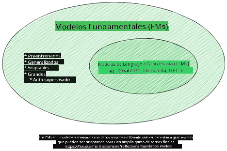
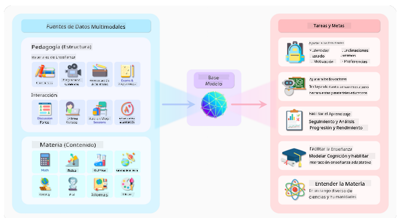
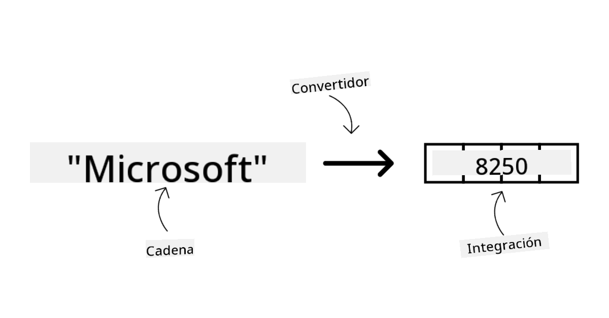
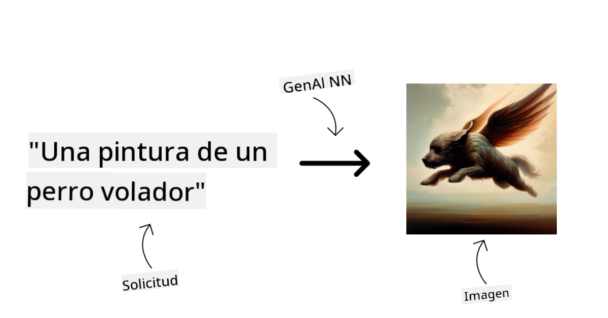
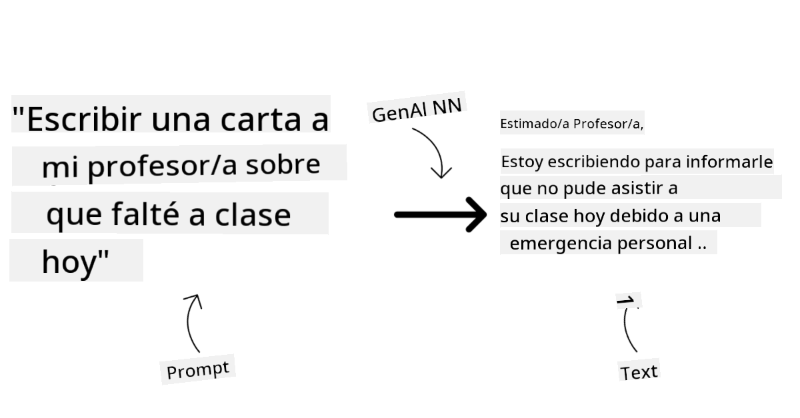
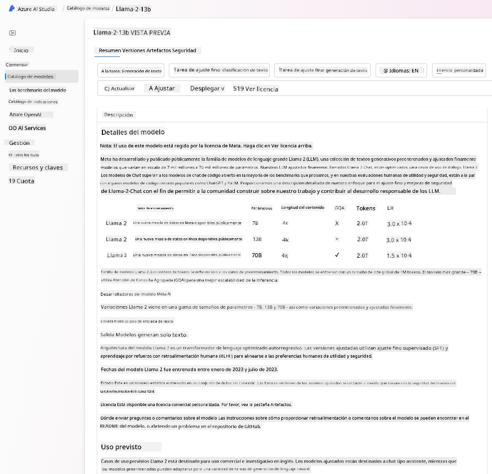
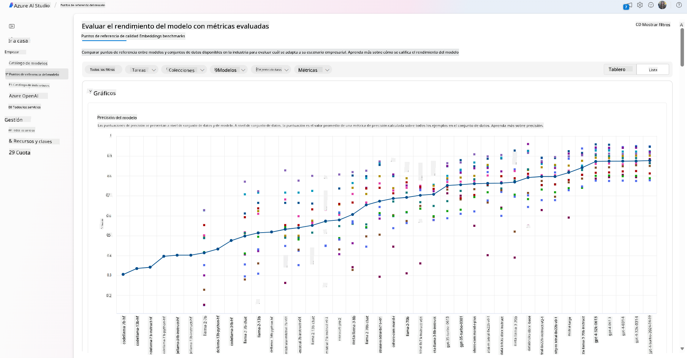
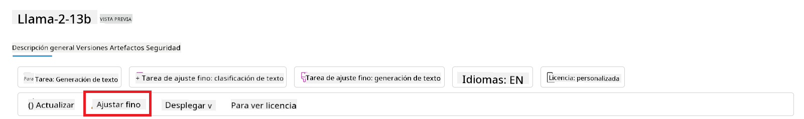
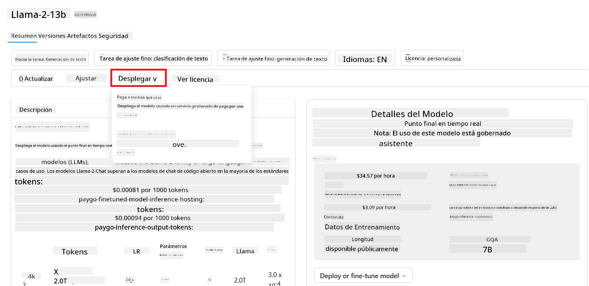

<!--
CO_OP_TRANSLATOR_METADATA:
{
  "original_hash": "e2f686f2eb794941761252ac5e8e090b",
  "translation_date": "2025-05-19T09:14:11+00:00",
  "source_file": "02-exploring-and-comparing-different-llms/README.md",
  "language_code": "es"
}
-->
# Explorando y comparando diferentes LLMs

> _Haz clic en la imagen de arriba para ver el video de esta lección_

En la lección anterior, vimos cómo la IA generativa está cambiando el panorama tecnológico, cómo funcionan los Modelos de Lenguaje de Gran Escala (LLMs) y cómo un negocio, como nuestra startup, puede aplicarlos a sus casos de uso y crecer. En este capítulo, buscamos comparar y contrastar diferentes tipos de modelos de lenguaje de gran escala (LLMs) para entender sus pros y contras.

El siguiente paso en el viaje de nuestra startup es explorar el panorama actual de los LLMs y entender cuáles son adecuados para nuestro caso de uso.

## Introducción

Esta lección cubrirá:

- Diferentes tipos de LLMs en el panorama actual.
- Probar, iterar y comparar diferentes modelos para tu caso de uso en Azure.
- Cómo desplegar un LLM.

## Objetivos de aprendizaje

Después de completar esta lección, podrás:

- Seleccionar el modelo adecuado para tu caso de uso.
- Entender cómo probar, iterar y mejorar el rendimiento de tu modelo.
- Saber cómo las empresas despliegan modelos.

## Entender diferentes tipos de LLMs

Los LLMs pueden tener múltiples categorizaciones basadas en su arquitectura, datos de entrenamiento y caso de uso. Entender estas diferencias ayudará a nuestra startup a seleccionar el modelo adecuado para el escenario y a entender cómo probar, iterar y mejorar el rendimiento.

Existen muchos tipos diferentes de modelos LLM, tu elección de modelo depende de para qué planeas usarlos, tus datos, cuánto estás dispuesto a pagar y más.

Dependiendo de si planeas usar los modelos para generación de texto, audio, video, imágenes, etc., podrías optar por un tipo diferente de modelo.

- **Reconocimiento de audio y voz**. Para este propósito, los modelos tipo Whisper son una gran elección, ya que son de propósito general y están orientados al reconocimiento de voz. Están entrenados en audio diverso y pueden realizar reconocimiento de voz multilingüe. Aprende más sobre [modelos tipo Whisper aquí](https://platform.openai.com/docs/models/whisper?WT.mc_id=academic-105485-koreyst).

- **Generación de imágenes**. Para la generación de imágenes, DALL-E y Midjourney son dos opciones muy conocidas. DALL-E es ofrecido por Azure OpenAI. [Lee más sobre DALL-E aquí](https://platform.openai.com/docs/models/dall-e?WT.mc_id=academic-105485-koreyst) y también en el Capítulo 9 de este currículo.

- **Generación de texto**. La mayoría de los modelos están entrenados en generación de texto y tienes una gran variedad de opciones desde GPT-3.5 hasta GPT-4. Tienen diferentes costos, siendo GPT-4 el más caro. Vale la pena echar un vistazo al [Azure OpenAI playground](https://oai.azure.com/portal/playground?WT.mc_id=academic-105485-koreyst) para evaluar qué modelos se ajustan mejor a tus necesidades en términos de capacidad y costo.

- **Multimodalidad**. Si buscas manejar múltiples tipos de datos en entrada y salida, podrías querer mirar modelos como [gpt-4 turbo con visión o gpt-4o](https://learn.microsoft.com/azure/ai-services/openai/concepts/models#gpt-4-and-gpt-4-turbo-models?WT.mc_id=academic-105485-koreyst) - las últimas versiones de los modelos de OpenAI - que son capaces de combinar el procesamiento del lenguaje natural con la comprensión visual, permitiendo interacciones a través de interfaces multimodales.

Seleccionar un modelo significa que obtienes algunas capacidades básicas, que sin embargo podrían no ser suficientes. A menudo tienes datos específicos de la empresa que de alguna manera necesitas comunicar al LLM. Hay algunas opciones diferentes sobre cómo abordar eso, más sobre eso en las secciones siguientes.

### Modelos Fundamentales versus LLMs

El término Modelo Fundamental fue [acuñado por investigadores de Stanford](https://arxiv.org/abs/2108.07258?WT.mc_id=academic-105485-koreyst) y se define como un modelo de IA que sigue algunos criterios, tales como:

- **Son entrenados usando aprendizaje no supervisado o auto-supervisado**, lo que significa que están entrenados en datos multimodales no etiquetados y no requieren anotación o etiquetado humano de datos para su proceso de entrenamiento.
- **Son modelos muy grandes**, basados en redes neuronales muy profundas entrenadas en miles de millones de parámetros.
- **Normalmente están destinados a servir como una 'base' para otros modelos**, lo que significa que pueden usarse como punto de partida para que otros modelos se construyan sobre ellos, lo cual se puede hacer mediante ajuste fino.

Fuente de la imagen: [Guía Esencial de Modelos Fundamentales y Modelos de Lenguaje de Gran Escala | por Babar M Bhatti | Medium](https://thebabar.medium.com/essential-guide-to-foundation-models-and-large-language-models-27dab58f7404)

Para aclarar aún más esta distinción, tomemos ChatGPT como ejemplo. Para construir la primera versión de ChatGPT, un modelo llamado GPT-3.5 sirvió como el modelo fundamental. Esto significa que OpenAI usó algunos datos específicos de chat para crear una versión ajustada de GPT-3.5 que estaba especializada en desempeñarse bien en escenarios conversacionales, como chatbots.

Fuente de la imagen: [2108.07258.pdf (arxiv.org)](https://arxiv.org/pdf/2108.07258.pdf?WT.mc_id=academic-105485-koreyst)

### Modelos de Código Abierto versus Propietarios

Otra forma de categorizar los LLMs es si son de código abierto o propietarios.

Los modelos de código abierto son modelos que están disponibles para el público y pueden ser usados por cualquiera. A menudo son puestos a disposición por la empresa que los creó o por la comunidad de investigación. Estos modelos pueden ser inspeccionados, modificados y personalizados para los diversos casos de uso en LLMs. Sin embargo, no siempre están optimizados para uso en producción y pueden no ser tan eficientes como los modelos propietarios. Además, la financiación para los modelos de código abierto puede ser limitada y pueden no mantenerse a largo plazo o no actualizarse con la última investigación. Ejemplos de modelos de código abierto populares incluyen [Alpaca](https://crfm.stanford.edu/2023/03/13/alpaca.html?WT.mc_id=academic-105485-koreyst), [Bloom](https://huggingface.co/bigscience/bloom) y [LLaMA](https://llama.meta.com).

Los modelos propietarios son modelos que son propiedad de una empresa y no están disponibles para el público. Estos modelos a menudo están optimizados para uso en producción. Sin embargo, no se permite que sean inspeccionados, modificados o personalizados para diferentes casos de uso. Además, no siempre están disponibles de forma gratuita y pueden requerir una suscripción o pago para usarlos. También, los usuarios no tienen control sobre los datos que se utilizan para entrenar el modelo, lo que significa que deben confiar en el propietario del modelo para garantizar el compromiso con la privacidad de los datos y el uso responsable de la IA. Ejemplos de modelos propietarios populares incluyen [modelos de OpenAI](https://platform.openai.com/docs/models/overview?WT.mc_id=academic-105485-koreyst), [Google Bard](https://sapling.ai/llm/bard?WT.mc_id=academic-105485-koreyst) o [Claude 2](https://www.anthropic.com/index/claude-2?WT.mc_id=academic-105485-koreyst).

### Embedding versus Generación de Imágenes versus Generación de Texto y Código

Los LLMs también pueden categorizarse por el tipo de salida que generan.

Las incrustaciones son un conjunto de modelos que pueden convertir texto en una forma numérica, llamada incrustación, que es una representación numérica del texto de entrada. Las incrustaciones facilitan a las máquinas entender las relaciones entre palabras o frases y pueden ser consumidas como entradas por otros modelos, como modelos de clasificación o modelos de agrupamiento que tienen mejor rendimiento en datos numéricos. Los modelos de incrustación a menudo se usan para el aprendizaje por transferencia, donde un modelo se construye para una tarea sustituta para la cual hay abundancia de datos, y luego los pesos del modelo (incrustaciones) se reutilizan para otras tareas posteriores. Un ejemplo de esta categoría es [incrustaciones de OpenAI](https://platform.openai.com/docs/models/embeddings?WT.mc_id=academic-105485-koreyst).

Los modelos de generación de imágenes son modelos que generan imágenes. Estos modelos a menudo se usan para edición de imágenes, síntesis de imágenes y traducción de imágenes. Los modelos de generación de imágenes a menudo se entrenan en grandes conjuntos de datos de imágenes, como [LAION-5B](https://laion.ai/blog/laion-5b/?WT.mc_id=academic-105485-koreyst), y pueden usarse para generar nuevas imágenes o para editar imágenes existentes con técnicas de inpainting, super-resolución y colorización. Ejemplos incluyen [DALL-E-3](https://openai.com/dall-e-3?WT.mc_id=academic-105485-koreyst) y [modelos de Stable Diffusion](https://github.com/Stability-AI/StableDiffusion?WT.mc_id=academic-105485-koreyst).

Los modelos de generación de texto y código son modelos que generan texto o código. Estos modelos a menudo se usan para resumir texto, traducir y responder preguntas. Los modelos de generación de texto a menudo se entrenan en grandes conjuntos de datos de texto, como [BookCorpus](https://www.cv-foundation.org/openaccess/content_iccv_2015/html/Zhu_Aligning_Books_and_ICCV_2015_paper.html?WT.mc_id=academic-105485-koreyst), y pueden usarse para generar nuevo texto o para responder preguntas. Los modelos de generación de código, como [CodeParrot](https://huggingface.co/codeparrot?WT.mc_id=academic-105485-koreyst), a menudo se entrenan en grandes conjuntos de datos de código, como GitHub, y pueden usarse para generar nuevo código o para corregir errores en código existente.

### Encoder-Decoder versus Solo Decoder

Para hablar sobre los diferentes tipos de arquitecturas de LLMs, usemos una analogía.

Imagina que tu gerente te dio la tarea de escribir un cuestionario para los estudiantes. Tienes dos colegas; uno se encarga de crear el contenido y el otro de revisarlo.

El creador de contenido es como un modelo Solo Decoder, pueden mirar el tema y ver lo que ya escribiste y luego pueden escribir un curso basado en eso. Son muy buenos escribiendo contenido atractivo e informativo, pero no son muy buenos entendiendo el tema y los objetivos de aprendizaje. Algunos ejemplos de modelos Decoder son los modelos de la familia GPT, como GPT-3.

El revisor es como un modelo Solo Encoder, miran el curso escrito y las respuestas, notando la relación entre ellos y entendiendo el contexto, pero no son buenos generando contenido. Un ejemplo de modelo Solo Encoder sería BERT.

Imagina que también podemos tener a alguien que pueda crear y revisar el cuestionario, este es un modelo Encoder-Decoder. Algunos ejemplos serían BART y T5.

### Servicio versus Modelo

Ahora, hablemos sobre la diferencia entre un servicio y un modelo. Un servicio es un producto que ofrece un Proveedor de Servicios en la Nube y a menudo es una combinación de modelos, datos y otros componentes. Un modelo es el componente central de un servicio y a menudo es un modelo fundamental, como un LLM.

Los servicios a menudo están optimizados para uso en producción y a menudo son más fáciles de usar que los modelos, a través de una interfaz gráfica de usuario. Sin embargo, los servicios no siempre están disponibles de forma gratuita y pueden requerir una suscripción o pago para usarlos, a cambio de aprovechar el equipo y los recursos del propietario del servicio, optimizando los gastos y escalando fácilmente. Un ejemplo de un servicio es [Azure OpenAI Service](https://learn.microsoft.com/azure/ai-services/openai/overview?WT.mc_id=academic-105485-koreyst), que ofrece un plan de tarifas de pago por uso, lo que significa que los usuarios son cobrados proporcionalmente a cuánto usan el servicio. Además, Azure OpenAI Service ofrece seguridad de grado empresarial y un marco de IA responsable además de las capacidades de los modelos.

Los modelos son solo la Red Neuronal, con los parámetros, pesos y otros. Permiten a las empresas ejecutarse localmente, sin embargo, necesitarían comprar equipo, construir una estructura para escalar y comprar una licencia o usar un modelo de código abierto. Un modelo como LLaMA está disponible para ser usado, requiriendo poder computacional para ejecutar el modelo.

## Cómo probar e iterar con diferentes modelos para entender el rendimiento en Azure

Una vez que nuestro equipo ha explorado el panorama actual de LLMs e identificado algunos buenos candidatos para sus escenarios, el siguiente paso es probarlos en sus datos y en su carga de trabajo. Este es un proceso iterativo, realizado mediante experimentos y medidas. La mayoría de los modelos que mencionamos en párrafos anteriores (modelos de OpenAI, modelos de código abierto como Llama2 y transformadores de Hugging Face) están disponibles en el [Catálogo de Modelos](https://learn.microsoft.com/azure/ai-studio/how-to/model-catalog-overview?WT.mc_id=academic-105485-koreyst) en [Azure AI Studio](https://ai.azure.com/?WT.mc_id=academic-105485-koreyst).

[Azure AI Studio](https://learn.microsoft.com/azure/ai-studio/what-is-ai-studio?WT.mc_id=academic-105485-koreyst) es una Plataforma en la Nube diseñada para desarrolladores para construir aplicaciones de IA generativa y gestionar todo el ciclo de vida del desarrollo, desde la experimentación hasta la evaluación, combinando todos los servicios de Azure AI en un único centro con una interfaz gráfica de usuario práctica. El Catálogo de Modelos en Azure AI Studio permite al usuario:

- Encontrar el Modelo Fundamental de interés en el catálogo, ya sea propietario o de código abierto, filtrando por tarea, licencia o nombre. Para mejorar la búsqueda, los modelos están organizados en colecciones, como la colección Azure OpenAI, la colección Hugging Face y más.

- Revisar la tarjeta del modelo, incluyendo una descripción detallada del uso previsto y los datos de entrenamiento, ejemplos de código y resultados de evaluación en la biblioteca de evaluaciones internas.

- Compara los puntos de referencia entre modelos y conjuntos de datos disponibles en la industria para evaluar cuál se ajusta al escenario empresarial, a través del panel de [Puntos de Referencia del Modelo](https://learn.microsoft.com/azure/ai-studio/how-to/model-benchmarks?WT.mc_id=academic-105485-koreyst).

- Ajusta el modelo con datos de entrenamiento personalizados para mejorar el rendimiento del modelo en una carga de trabajo específica, aprovechando las capacidades de experimentación y seguimiento de Azure AI Studio.

- Despliega el modelo preentrenado original o la versión ajustada para una inferencia remota en tiempo real - cómputo gestionado - o un punto final de API sin servidor - [pago por uso](https://learn.microsoft.com/azure/ai-studio/how-to/model-catalog-overview#model-deployment-managed-compute-and-serverless-api-pay-as-you-go?WT.mc_id=academic-105485-koreyst) - para permitir que las aplicaciones lo consuman.

> [!NOTE]
> No todos los modelos en el catálogo están actualmente disponibles para ajuste y/o despliegue de pago por uso. Consulta la tarjeta del modelo para obtener detalles sobre las capacidades y limitaciones del modelo.

## Mejorando los resultados de LLM

Hemos explorado con nuestro equipo de startup diferentes tipos de LLMs y una plataforma en la nube (Azure Machine Learning) que nos permite comparar diferentes modelos, evaluarlos con datos de prueba, mejorar el rendimiento y desplegarlos en puntos finales de inferencia.

Pero, ¿cuándo deberían considerar ajustar un modelo en lugar de usar uno preentrenado? ¿Existen otros enfoques para mejorar el rendimiento del modelo en cargas de trabajo específicas?

Hay varios enfoques que una empresa puede utilizar para obtener los resultados que necesita de un LLM. Puedes seleccionar diferentes tipos de modelos con diferentes grados de entrenamiento al desplegar un LLM en producción, con diferentes niveles de complejidad, costo y calidad. Aquí hay algunos enfoques diferentes:

- **Ingeniería de prompts con contexto**. La idea es proporcionar suficiente contexto cuando haces un prompt para asegurar que obtienes las respuestas que necesitas.

- **Generación Aumentada por Recuperación, RAG**. Tus datos podrían existir en una base de datos o punto final web, por ejemplo, para asegurar que estos datos, o un subconjunto de ellos, se incluyan en el momento del prompt, puedes recuperar los datos relevantes y hacer que formen parte del prompt del usuario.

- **Modelo ajustado**. Aquí, entrenaste el modelo más a fondo con tus propios datos, lo que llevó a que el modelo sea más exacto y responda mejor a tus necesidades, pero podría ser costoso.

Fuente de la imagen: [Cuatro maneras en que las empresas despliegan LLMs | Blog de Fiddler AI](https://www.fiddler.ai/blog/four-ways-that-enterprises-deploy-llms?WT.mc_id=academic-105485-koreyst)

### Ingeniería de Prompts con Contexto

Los LLMs preentrenados funcionan muy bien en tareas de lenguaje natural generalizadas, incluso al llamarlos con un prompt corto, como una oración para completar o una pregunta: el llamado aprendizaje "zero-shot".

Sin embargo, cuanto más pueda el usuario enmarcar su consulta, con una solicitud detallada y ejemplos - el Contexto - más precisa y cercana a las expectativas del usuario será la respuesta. En este caso, hablamos de aprendizaje "one-shot" si el prompt incluye solo un ejemplo y "few-shot learning" si incluye múltiples ejemplos. La ingeniería de prompts con contexto es el enfoque más rentable para comenzar.

### Generación Aumentada por Recuperación (RAG)

Los LLMs tienen la limitación de que solo pueden usar los datos que se han utilizado durante su entrenamiento para generar una respuesta. Esto significa que no saben nada sobre los hechos que ocurrieron después de su proceso de entrenamiento, y no pueden acceder a información no pública (como datos de la empresa). Esto se puede superar a través de RAG, una técnica que aumenta el prompt con datos externos en forma de fragmentos de documentos, considerando los límites de longitud del prompt. Esto es compatible con herramientas de bases de datos vectoriales (como [Azure Vector Search](https://learn.microsoft.com/azure/search/vector-search-overview?WT.mc_id=academic-105485-koreyst)) que recuperan los fragmentos útiles de fuentes de datos predefinidas variadas y los agregan al Contexto del prompt.

Esta técnica es muy útil cuando una empresa no tiene suficientes datos, tiempo o recursos para ajustar un LLM, pero aún desea mejorar el rendimiento en una carga de trabajo específica y reducir los riesgos de fabricaciones, es decir, mistificación de la realidad o contenido dañino.

### Modelo Ajustado

El ajuste es un proceso que aprovecha el aprendizaje por transferencia para 'adaptar' el modelo a una tarea descendente o para resolver un problema específico. A diferencia del aprendizaje "few-shot" y RAG, resulta en un nuevo modelo generado, con pesos y sesgos actualizados. Requiere un conjunto de ejemplos de entrenamiento que consisten en una sola entrada (el prompt) y su salida asociada (la finalización). Este sería el enfoque preferido si:

- **Usar modelos ajustados**. Una empresa quisiera usar modelos ajustados menos capaces (como modelos de incrustación) en lugar de modelos de alto rendimiento, resultando en una solución más rentable y rápida.

- **Considerar la latencia**. La latencia es importante para un caso de uso específico, por lo que no es posible usar prompts muy largos o el número de ejemplos que deberían aprenderse del modelo no encaja con el límite de longitud del prompt.

- **Mantenerse actualizado**. Una empresa tiene muchos datos de alta calidad y etiquetas de verdad de base y los recursos necesarios para mantener estos datos actualizados a lo largo del tiempo.

### Modelo Entrenado

Entrenar un LLM desde cero es sin duda el enfoque más difícil y complejo de adoptar, requiriendo enormes cantidades de datos, recursos calificados y la potencia computacional adecuada. Esta opción solo debería considerarse en un escenario donde una empresa tenga un caso de uso específico de dominio y una gran cantidad de datos centrados en el dominio.

## Comprobación de Conocimientos

¿Qué podría ser un buen enfoque para mejorar los resultados de finalización de LLM?

1. Ingeniería de prompts con contexto
1. RAG
1. Modelo ajustado

A:3, si tienes el tiempo y los recursos y datos de alta calidad, el ajuste es la mejor opción para mantenerse actualizado. Sin embargo, si estás buscando mejorar las cosas y te falta tiempo, vale la pena considerar primero RAG.

## 🚀 Desafío

Lee más sobre cómo puedes [usar RAG](https://learn.microsoft.com/azure/search/retrieval-augmented-generation-overview?WT.mc_id=academic-105485-koreyst) para tu negocio.

## Gran Trabajo, Continúa Tu Aprendizaje

Después de completar esta lección, consulta nuestra [colección de Aprendizaje de IA Generativa](https://aka.ms/genai-collection?WT.mc_id=academic-105485-koreyst) para continuar mejorando tu conocimiento de IA Generativa.

Dirígete a la Lección 3 donde veremos cómo [construir con IA Generativa de manera Responsable](../03-using-generative-ai-responsibly/README.md?WT.mc_id=academic-105485-koreyst)!

**Descargo de responsabilidad**:  
Este documento ha sido traducido utilizando el servicio de traducción automática [Co-op Translator](https://github.com/Azure/co-op-translator). Aunque nos esforzamos por lograr precisión, tenga en cuenta que las traducciones automáticas pueden contener errores o inexactitudes. El documento original en su idioma nativo debe considerarse como la fuente autorizada. Para información crítica, se recomienda la traducción profesional humana. No nos hacemos responsables de ningún malentendido o interpretación errónea que surja del uso de esta traducción.