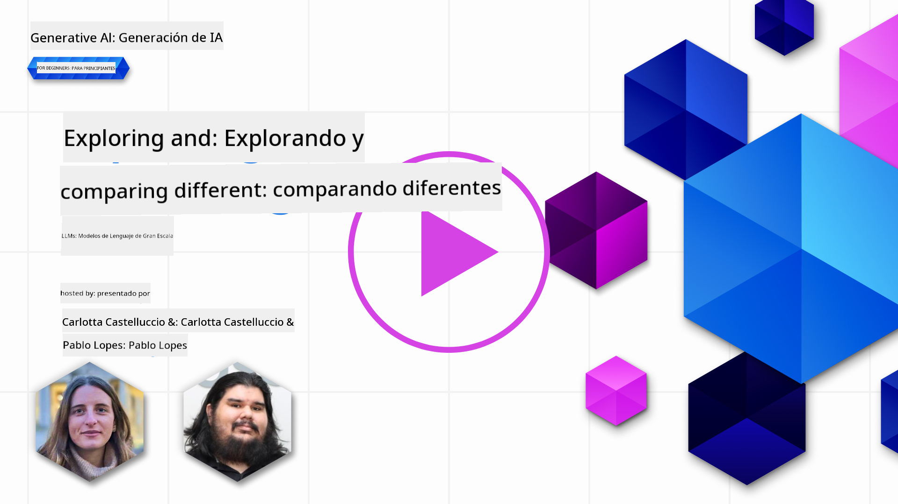
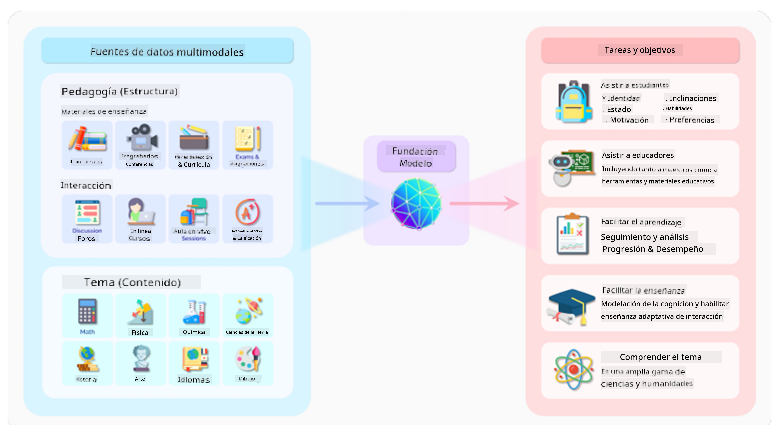
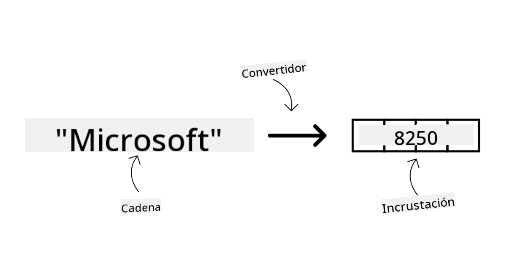
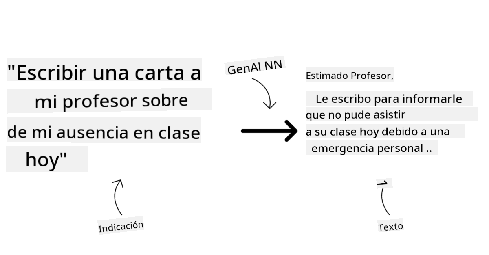
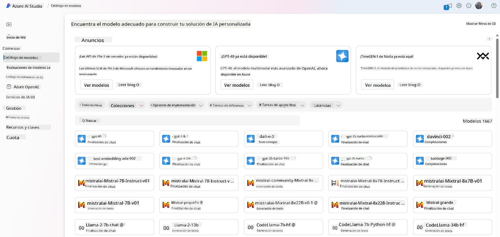
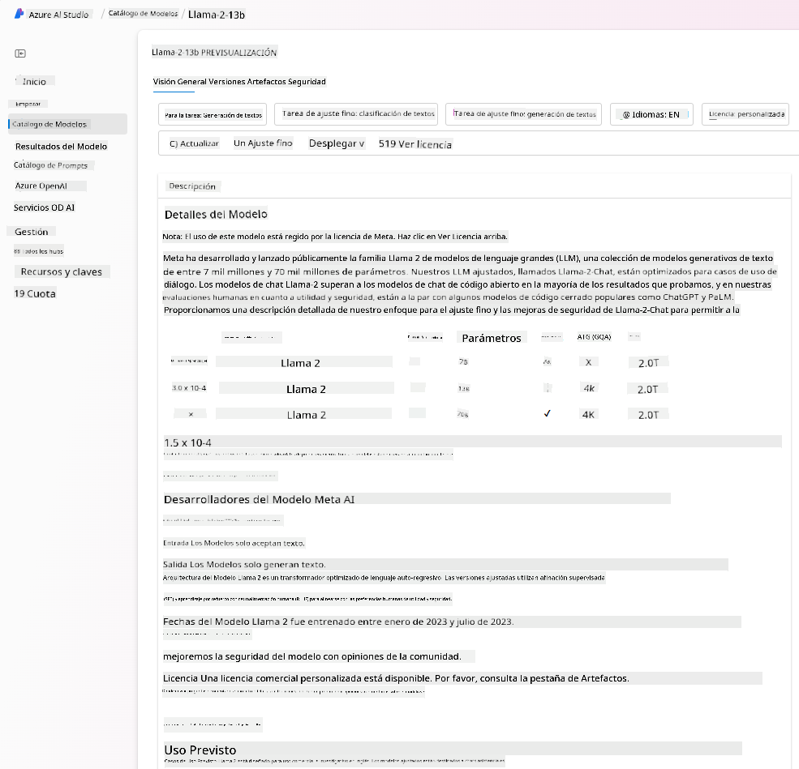
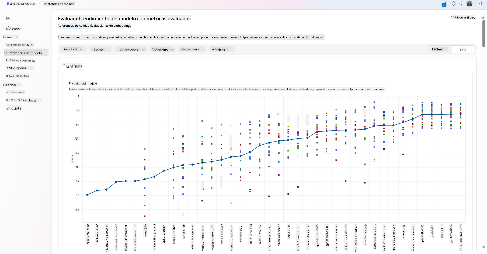
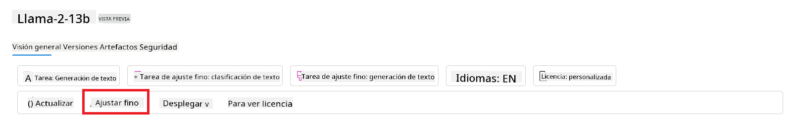
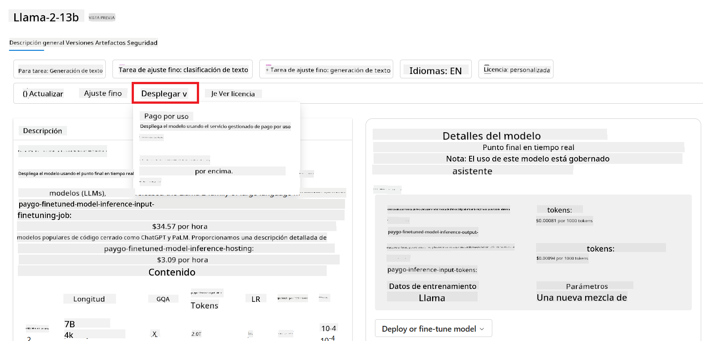
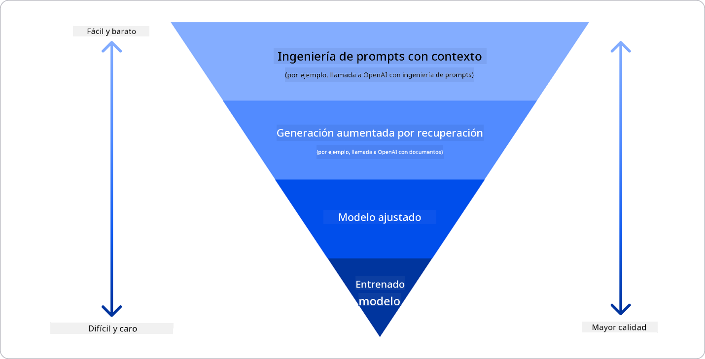

<!--
CO_OP_TRANSLATOR_METADATA:
{
  "original_hash": "e2f686f2eb794941761252ac5e8e090b",
  "translation_date": "2025-07-09T08:08:08+00:00",
  "source_file": "02-exploring-and-comparing-different-llms/README.md",
  "language_code": "es"
}
-->
# Explorando y comparando diferentes LLMs

> _Haz clic en la imagen de arriba para ver el video de esta lección_

Con la lección anterior, vimos cómo la IA Generativa está cambiando el panorama tecnológico, cómo funcionan los Modelos de Lenguaje Grande (LLMs) y cómo un negocio, como nuestra startup, puede aplicarlos a sus casos de uso y crecer. En este capítulo, vamos a comparar y contrastar diferentes tipos de modelos de lenguaje grande (LLMs) para entender sus ventajas y desventajas.

El siguiente paso en el camino de nuestra startup es explorar el panorama actual de los LLMs y entender cuáles son adecuados para nuestro caso de uso.

## Introducción

Esta lección cubrirá:

- Diferentes tipos de LLMs en el panorama actual.
- Cómo probar, iterar y comparar diferentes modelos para tu caso de uso en Azure.
- Cómo desplegar un LLM.

## Objetivos de aprendizaje

Después de completar esta lección, podrás:

- Seleccionar el modelo adecuado para tu caso de uso.
- Entender cómo probar, iterar y mejorar el rendimiento de tu modelo.
- Saber cómo las empresas despliegan modelos.

## Entender los diferentes tipos de LLMs

Los LLMs pueden clasificarse de varias formas según su arquitectura, datos de entrenamiento y caso de uso. Comprender estas diferencias ayudará a nuestra startup a elegir el modelo correcto para el escenario y a entender cómo probar, iterar y mejorar el rendimiento.

Existen muchos tipos diferentes de modelos LLM; la elección depende de para qué los quieras usar, tus datos, cuánto estás dispuesto a pagar y más.

Dependiendo de si quieres usar los modelos para texto, audio, video, generación de imágenes, etc., podrías optar por un tipo diferente de modelo.

- **Reconocimiento de audio y voz**. Para este propósito, los modelos tipo Whisper son una excelente opción, ya que son de propósito general y están orientados al reconocimiento de voz. Están entrenados con audio diverso y pueden realizar reconocimiento de voz multilingüe. Aprende más sobre [modelos tipo Whisper aquí](https://platform.openai.com/docs/models/whisper?WT.mc_id=academic-105485-koreyst).

- **Generación de imágenes**. Para generación de imágenes, DALL-E y Midjourney son dos opciones muy conocidas. DALL-E es ofrecido por Azure OpenAI. [Lee más sobre DALL-E aquí](https://platform.openai.com/docs/models/dall-e?WT.mc_id=academic-105485-koreyst) y también en el Capítulo 9 de este currículo.

- **Generación de texto**. La mayoría de los modelos están entrenados para generación de texto y tienes una gran variedad de opciones desde GPT-3.5 hasta GPT-4. Tienen diferentes costos, siendo GPT-4 el más caro. Vale la pena explorar el [playground de Azure OpenAI](https://oai.azure.com/portal/playground?WT.mc_id=academic-105485-koreyst) para evaluar qué modelos se ajustan mejor a tus necesidades en términos de capacidad y costo.

- **Multimodalidad**. Si buscas manejar múltiples tipos de datos en entrada y salida, podrías interesarte en modelos como [gpt-4 turbo con visión o gpt-4o](https://learn.microsoft.com/azure/ai-services/openai/concepts/models#gpt-4-and-gpt-4-turbo-models?WT.mc_id=academic-105485-koreyst), las últimas versiones de los modelos de OpenAI, que combinan procesamiento de lenguaje natural con comprensión visual, permitiendo interacciones a través de interfaces multimodales.

Seleccionar un modelo significa obtener ciertas capacidades básicas, que a veces no son suficientes. A menudo tienes datos específicos de la empresa que necesitas comunicar al LLM. Hay varias formas de abordar esto, que veremos en las próximas secciones.

### Modelos Foundation versus LLMs

El término Foundation Model fue [acuñado por investigadores de Stanford](https://arxiv.org/abs/2108.07258?WT.mc_id=academic-105485-koreyst) y se define como un modelo de IA que cumple ciertos criterios, tales como:

- **Se entrenan usando aprendizaje no supervisado o auto-supervisado**, es decir, se entrenan con datos multimodales sin etiquetar y no requieren anotación humana para su entrenamiento.
- **Son modelos muy grandes**, basados en redes neuronales profundas entrenadas con miles de millones de parámetros.
- **Normalmente están destinados a servir como ‘fundamento’ para otros modelos**, lo que significa que pueden usarse como punto de partida para construir otros modelos encima, mediante fine-tuning.

Fuente de la imagen: [Essential Guide to Foundation Models and Large Language Models | por Babar M Bhatti | Medium](https://thebabar.medium.com/essential-guide-to-foundation-models-and-large-language-models-27dab58f7404)

Para aclarar esta distinción, tomemos ChatGPT como ejemplo. Para construir la primera versión de ChatGPT, se usó un modelo llamado GPT-3.5 como foundation model. Esto significa que OpenAI utilizó datos específicos de chat para crear una versión ajustada de GPT-3.5 especializada en desempeñarse bien en escenarios conversacionales, como chatbots.

Fuente de la imagen: [2108.07258.pdf (arxiv.org)](https://arxiv.org/pdf/2108.07258.pdf?WT.mc_id=academic-105485-koreyst)

### Modelos Open Source versus Propietarios

Otra forma de categorizar los LLMs es si son open source o propietarios.

Los modelos open source son aquellos que están disponibles al público y pueden ser usados por cualquiera. A menudo son liberados por la empresa que los creó o por la comunidad investigadora. Estos modelos pueden ser inspeccionados, modificados y personalizados para distintos casos de uso. Sin embargo, no siempre están optimizados para producción y pueden no ser tan eficientes como los modelos propietarios. Además, la financiación para modelos open source puede ser limitada, y puede que no se mantengan a largo plazo ni se actualicen con la investigación más reciente. Ejemplos populares de modelos open source incluyen [Alpaca](https://crfm.stanford.edu/2023/03/13/alpaca.html?WT.mc_id=academic-105485-koreyst), [Bloom](https://huggingface.co/bigscience/bloom) y [LLaMA](https://llama.meta.com).

Los modelos propietarios son propiedad de una empresa y no están disponibles al público. Estos modelos suelen estar optimizados para uso en producción. Sin embargo, no se permite inspeccionarlos, modificarlos ni personalizarlos para diferentes casos de uso. Además, no siempre son gratuitos y pueden requerir suscripción o pago para usarlos. Los usuarios tampoco tienen control sobre los datos usados para entrenar el modelo, por lo que deben confiar en que el propietario del modelo garantice la privacidad de los datos y el uso responsable de la IA. Ejemplos populares de modelos propietarios incluyen [modelos de OpenAI](https://platform.openai.com/docs/models/overview?WT.mc_id=academic-105485-koreyst), [Google Bard](https://sapling.ai/llm/bard?WT.mc_id=academic-105485-koreyst) o [Claude 2](https://www.anthropic.com/index/claude-2?WT.mc_id=academic-105485-koreyst).

### Embedding versus generación de imágenes versus generación de texto y código

Los LLMs también pueden clasificarse según el tipo de salida que generan.

Los embeddings son un conjunto de modelos que convierten texto en una forma numérica llamada embedding, que es una representación numérica del texto de entrada. Los embeddings facilitan que las máquinas entiendan las relaciones entre palabras o frases y pueden usarse como entradas para otros modelos, como modelos de clasificación o de clustering que funcionan mejor con datos numéricos. Los modelos de embedding se usan a menudo para transfer learning, donde se construye un modelo para una tarea sustituta con abundancia de datos, y luego se reutilizan los pesos (embeddings) para otras tareas posteriores. Un ejemplo de esta categoría son los [OpenAI embeddings](https://platform.openai.com/docs/models/embeddings?WT.mc_id=academic-105485-koreyst).

Los modelos de generación de imágenes son aquellos que generan imágenes. Se usan para edición, síntesis y traducción de imágenes. Estos modelos suelen entrenarse con grandes conjuntos de datos de imágenes, como [LAION-5B](https://laion.ai/blog/laion-5b/?WT.mc_id=academic-105485-koreyst), y pueden generar imágenes nuevas o editar imágenes existentes con técnicas como inpainting, superresolución y colorización. Ejemplos incluyen [DALL-E-3](https://openai.com/dall-e-3?WT.mc_id=academic-105485-koreyst) y [modelos Stable Diffusion](https://github.com/Stability-AI/StableDiffusion?WT.mc_id=academic-105485-koreyst).

Los modelos de generación de texto y código son aquellos que generan texto o código. Se usan para resumen de texto, traducción y respuesta a preguntas. Los modelos de generación de texto suelen entrenarse con grandes conjuntos de datos de texto, como [BookCorpus](https://www.cv-foundation.org/openaccess/content_iccv_2015/html/Zhu_Aligning_Books_and_ICCV_2015_paper.html?WT.mc_id=academic-105485-koreyst), y pueden generar texto nuevo o responder preguntas. Los modelos de generación de código, como [CodeParrot](https://huggingface.co/codeparrot?WT.mc_id=academic-105485-koreyst), se entrenan con grandes conjuntos de datos de código, como GitHub, y pueden generar código nuevo o corregir errores en código existente.

### Encoder-Decoder versus solo Decoder

Para hablar de los diferentes tipos de arquitecturas de LLMs, usemos una analogía.

Imagina que tu jefe te asigna la tarea de escribir un cuestionario para los estudiantes. Tienes dos colegas; uno se encarga de crear el contenido y el otro de revisarlo.

El creador de contenido es como un modelo solo Decoder, puede ver el tema y lo que ya escribiste, y luego escribir un curso basado en eso. Son muy buenos escribiendo contenido atractivo e informativo, pero no son tan buenos entendiendo el tema y los objetivos de aprendizaje. Algunos ejemplos de modelos Decoder son los de la familia GPT, como GPT-3.

El revisor es como un modelo solo Encoder, revisa el curso escrito y las respuestas, notando la relación entre ellos y entendiendo el contexto, pero no es bueno generando contenido. Un ejemplo de modelo solo Encoder sería BERT.

Imagina que pudiéramos tener a alguien que pueda crear y revisar el cuestionario, este sería un modelo Encoder-Decoder. Algunos ejemplos serían BART y T5.

### Servicio versus Modelo

Ahora, hablemos de la diferencia entre un servicio y un modelo. Un servicio es un producto ofrecido por un proveedor de servicios en la nube, y suele ser una combinación de modelos, datos y otros componentes. Un modelo es el componente central de un servicio, y suele ser un foundation model, como un LLM.

Los servicios suelen estar optimizados para uso en producción y son más fáciles de usar que los modelos, a través de una interfaz gráfica. Sin embargo, los servicios no siempre son gratuitos y pueden requerir suscripción o pago, a cambio de aprovechar el equipo y recursos del propietario del servicio, optimizando gastos y facilitando la escalabilidad. Un ejemplo de servicio es [Azure OpenAI Service](https://learn.microsoft.com/azure/ai-services/openai/overview?WT.mc_id=academic-105485-koreyst), que ofrece un plan de pago por uso, es decir, los usuarios pagan proporcionalmente a cuánto usan el servicio. Además, Azure OpenAI Service ofrece seguridad de nivel empresarial y un marco de IA responsable sobre las capacidades de los modelos.

Los modelos son solo la red neuronal, con parámetros, pesos y demás. Permiten que las empresas los ejecuten localmente, pero necesitarían comprar equipo, construir una infraestructura para escalar y comprar una licencia o usar un modelo open source. Un modelo como LLaMA está disponible para usarse, requiriendo potencia computacional para ejecutarlo.

## Cómo probar e iterar con diferentes modelos para entender el rendimiento en Azure

Una vez que nuestro equipo ha explorado el panorama actual de LLMs e identificado algunos buenos candidatos para sus escenarios, el siguiente paso es probarlos con sus datos y carga de trabajo. Este es un proceso iterativo, realizado mediante experimentos y mediciones.
La mayoría de los modelos que mencionamos en los párrafos anteriores (modelos de OpenAI, modelos de código abierto como Llama2 y transformers de Hugging Face) están disponibles en el [Catálogo de Modelos](https://learn.microsoft.com/azure/ai-studio/how-to/model-catalog-overview?WT.mc_id=academic-105485-koreyst) en [Azure AI Studio](https://ai.azure.com/?WT.mc_id=academic-105485-koreyst).

[Azure AI Studio](https://learn.microsoft.com/azure/ai-studio/what-is-ai-studio?WT.mc_id=academic-105485-koreyst) es una plataforma en la nube diseñada para que los desarrolladores construyan aplicaciones de IA generativa y gestionen todo el ciclo de vida del desarrollo, desde la experimentación hasta la evaluación, combinando todos los servicios de Azure AI en un solo centro con una interfaz gráfica fácil de usar. El Catálogo de Modelos en Azure AI Studio permite al usuario:

- Encontrar el Modelo Base de interés en el catálogo, ya sea propietario o de código abierto, filtrando por tarea, licencia o nombre. Para mejorar la búsqueda, los modelos están organizados en colecciones, como la colección Azure OpenAI, la colección Hugging Face y más.

- Revisar la ficha del modelo, que incluye una descripción detallada del uso previsto y los datos de entrenamiento, ejemplos de código y resultados de evaluación en la biblioteca interna de evaluaciones.

- Comparar benchmarks entre modelos y conjuntos de datos disponibles en la industria para evaluar cuál se ajusta mejor al escenario de negocio, a través del panel de [Model Benchmarks](https://learn.microsoft.com/azure/ai-studio/how-to/model-benchmarks?WT.mc_id=academic-105485-koreyst).

- Ajustar finamente el modelo con datos de entrenamiento personalizados para mejorar su rendimiento en una carga de trabajo específica, aprovechando las capacidades de experimentación y seguimiento de Azure AI Studio.

- Desplegar el modelo preentrenado original o la versión ajustada finamente en un endpoint remoto de inferencia en tiempo real — ya sea en cómputo gestionado o en una API serverless — con un modelo de [pago por uso](https://learn.microsoft.com/azure/ai-studio/how-to/model-catalog-overview#model-deployment-managed-compute-and-serverless-api-pay-as-you-go?WT.mc_id=academic-105485-koreyst) para que las aplicaciones puedan consumirlo.

> [!NOTE]
> No todos los modelos en el catálogo están disponibles actualmente para ajuste fino y/o despliegue con pago por uso. Consulta la ficha del modelo para detalles sobre sus capacidades y limitaciones.

## Mejorando los resultados de LLM

Hemos explorado con nuestro equipo startup diferentes tipos de LLM y una plataforma en la nube (Azure Machine Learning) que nos permite comparar distintos modelos, evaluarlos con datos de prueba, mejorar su rendimiento y desplegarlos en endpoints de inferencia.

Pero, ¿cuándo deberían considerar ajustar finamente un modelo en lugar de usar uno preentrenado? ¿Existen otras formas de mejorar el rendimiento del modelo en cargas de trabajo específicas?

Hay varias estrategias que una empresa puede usar para obtener los resultados que necesita de un LLM. Puedes seleccionar diferentes tipos de modelos con distintos grados de entrenamiento al desplegar un LLM en producción, con diferentes niveles de complejidad, costo y calidad. Aquí algunas opciones:

- **Ingeniería de prompts con contexto**. La idea es proporcionar suficiente contexto al prompt para asegurar que obtienes las respuestas que necesitas.

- **Retrieval Augmented Generation, RAG**. Tus datos podrían estar en una base de datos o en un endpoint web, por ejemplo. Para asegurar que estos datos, o un subconjunto de ellos, se incluyan al momento de hacer el prompt, puedes recuperar la información relevante y hacer que forme parte del prompt del usuario.

- **Modelo ajustado finamente**. Aquí, entrenas el modelo más a fondo con tus propios datos, lo que hace que el modelo sea más preciso y responda mejor a tus necesidades, aunque puede ser costoso.

Fuente de la imagen: [Four Ways that Enterprises Deploy LLMs | Fiddler AI Blog](https://www.fiddler.ai/blog/four-ways-that-enterprises-deploy-llms?WT.mc_id=academic-105485-koreyst)

### Ingeniería de prompts con contexto

Los LLM preentrenados funcionan muy bien en tareas generales de lenguaje natural, incluso con un prompt corto, como una frase para completar o una pregunta — el llamado aprendizaje “zero-shot”.

Sin embargo, cuanto más pueda el usuario enmarcar su consulta, con una petición detallada y ejemplos — el Contexto — más precisa y cercana a las expectativas del usuario será la respuesta. En este caso, hablamos de aprendizaje “one-shot” si el prompt incluye un solo ejemplo, y “few-shot” si incluye varios ejemplos. La ingeniería de prompts con contexto es la forma más rentable para comenzar.

### Retrieval Augmented Generation (RAG)

Los LLM tienen la limitación de que solo pueden usar los datos con los que fueron entrenados para generar una respuesta. Esto significa que no saben nada sobre hechos ocurridos después de su entrenamiento, ni pueden acceder a información no pública (como datos de la empresa).
Esto se puede superar con RAG, una técnica que amplía el prompt con datos externos en forma de fragmentos de documentos, considerando los límites de longitud del prompt. Esto es posible gracias a herramientas de bases de datos vectoriales (como [Azure Vector Search](https://learn.microsoft.com/azure/search/vector-search-overview?WT.mc_id=academic-105485-koreyst)) que recuperan los fragmentos útiles de diversas fuentes de datos predefinidas y los añaden al Contexto del prompt.

Esta técnica es muy útil cuando una empresa no tiene suficientes datos, tiempo o recursos para ajustar finamente un LLM, pero aún así quiere mejorar el rendimiento en una carga de trabajo específica y reducir riesgos de invenciones, es decir, distorsiones de la realidad o contenido dañino.

### Modelo ajustado finamente

El ajuste fino es un proceso que aprovecha el aprendizaje por transferencia para ‘adaptar’ el modelo a una tarea específica o para resolver un problema concreto. A diferencia del aprendizaje few-shot y RAG, genera un nuevo modelo con pesos y sesgos actualizados. Requiere un conjunto de ejemplos de entrenamiento que consisten en una entrada única (el prompt) y su salida asociada (la respuesta).
Esta sería la opción preferida si:

- **Usar modelos ajustados finamente**. Una empresa quiere usar modelos ajustados menos potentes (como modelos de embeddings) en lugar de modelos de alto rendimiento, logrando una solución más económica y rápida.

- **Considerar la latencia**. La latencia es importante para un caso de uso específico, por lo que no es posible usar prompts muy largos o la cantidad de ejemplos que el modelo debería aprender no encaja con el límite de longitud del prompt.

- **Mantenerse actualizado**. Una empresa dispone de muchos datos de alta calidad y etiquetas de verdad de terreno, y los recursos necesarios para mantener estos datos actualizados a lo largo del tiempo.

### Modelo entrenado

Entrenar un LLM desde cero es sin duda el enfoque más difícil y complejo, que requiere enormes cantidades de datos, recursos especializados y potencia computacional adecuada. Esta opción solo debería considerarse en un escenario donde una empresa tenga un caso de uso específico de dominio y una gran cantidad de datos centrados en ese dominio.

## Verificación de conocimientos

¿Cuál podría ser un buen enfoque para mejorar los resultados de completado de un LLM?

1. Ingeniería de prompts con contexto  
1. RAG  
1. Modelo ajustado finamente

R:3, si tienes tiempo, recursos y datos de alta calidad, el ajuste fino es la mejor opción para mantenerse actualizado. Sin embargo, si buscas mejorar las cosas y te falta tiempo, vale la pena considerar primero RAG.

## 🚀 Desafío

Lee más sobre cómo puedes [usar RAG](https://learn.microsoft.com/azure/search/retrieval-augmented-generation-overview?WT.mc_id=academic-105485-koreyst) para tu negocio.

## Excelente trabajo, continúa aprendiendo

Después de completar esta lección, visita nuestra [colección de aprendizaje de IA generativa](https://aka.ms/genai-collection?WT.mc_id=academic-105485-koreyst) para seguir mejorando tus conocimientos en IA generativa.

¡Dirígete a la Lección 3 donde veremos cómo [construir con IA generativa de forma responsable](../03-using-generative-ai-responsibly/README.md?WT.mc_id=academic-105485-koreyst)!

**Aviso legal**:  
Este documento ha sido traducido utilizando el servicio de traducción automática [Co-op Translator](https://github.com/Azure/co-op-translator). Aunque nos esforzamos por la precisión, tenga en cuenta que las traducciones automáticas pueden contener errores o inexactitudes. El documento original en su idioma nativo debe considerarse la fuente autorizada. Para información crítica, se recomienda una traducción profesional realizada por humanos. No nos hacemos responsables de malentendidos o interpretaciones erróneas derivadas del uso de esta traducción.