# Explorando y comparando diferentes LLMs

[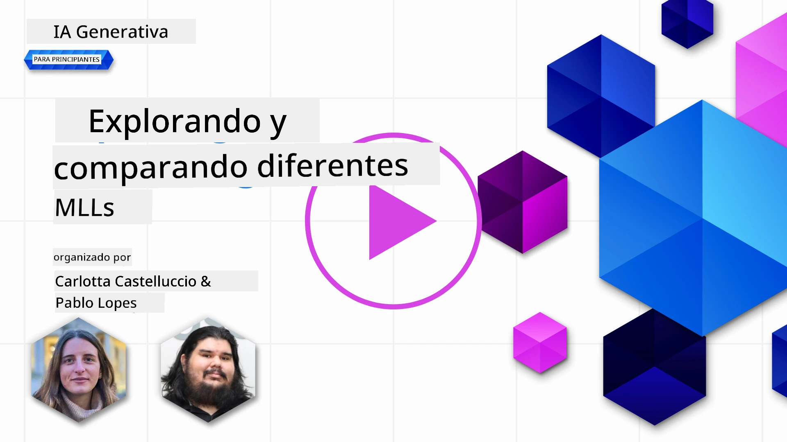](https://youtu.be/KIRUeDKscfI?si=8BHX1zvwzQBn-PlK)

> _Haz clic en la imagen de arriba para ver el video de esta lección_

Con la lección anterior, hemos visto cómo la IA Generativa está cambiando el panorama tecnológico, cómo funcionan los Modelos de Lenguaje a Gran Escala (LLMs) y cómo un negocio, como nuestra startup, puede aplicarlos a sus casos de uso y crecer. En este capítulo, buscamos comparar y contrastar diferentes tipos de modelos de lenguaje a gran escala (LLMs) para entender sus ventajas y desventajas.

El siguiente paso en el viaje de nuestra startup es explorar el panorama actual de los LLMs y entender cuáles son adecuados para nuestro caso de uso.

## Introducción

Esta lección cubrirá:

- Diferentes tipos de LLMs en el panorama actual.
- Pruebas, iteración y comparación de diferentes modelos para tu caso de uso en Azure.
- Cómo desplegar un LLM.

## Objetivos de aprendizaje

Después de completar esta lección, podrás:

- Seleccionar el modelo adecuado para tu caso de uso.
- Entender cómo probar, iterar y mejorar el rendimiento de tu modelo.
- Saber cómo las empresas despliegan modelos.

## Entender diferentes tipos de LLMs

Los LLMs pueden tener múltiples categorizaciones basadas en su arquitectura, datos de entrenamiento y caso de uso. Entender estas diferencias ayudará a nuestra startup a seleccionar el modelo adecuado para el escenario y a comprender cómo probar, iterar y mejorar el rendimiento.

Hay muchos tipos diferentes de modelos LLM; tu elección de modelo depende de para qué planeas usarlos, tus datos, cuánto estás dispuesto a pagar y más.

Dependiendo de si planeas usar los modelos para texto, audio, video, generación de imágenes, etc., podrías optar por un tipo diferente de modelo.

- **Reconocimiento de audio y voz**. Los modelos estilo Whisper siguen siendo útiles para reconocimiento de voz de propósito general, pero las opciones de producción ahora también incluyen modelos de voz a texto más nuevos como `gpt-4o-transcribe`, `gpt-4o-mini-transcribe` y variantes de diarización. Evalúa la cobertura de idiomas, diarización, soporte en tiempo real, latencia y costo para tu escenario. Aprende más en la [documentación de voz a texto de OpenAI](https://platform.openai.com/docs/guides/speech-to-text?WT.mc_id=academic-105485-koreyst).

- **Generación de imágenes**. DALL-E y Midjourney son opciones bien conocidas para generación de imágenes, pero las APIs actuales de OpenAI se centran en modelos GPT para imágenes como `gpt-image-2`, mientras que familias de modelos como Stable Diffusion, Imagen, Flux y otras también son opciones comunes. Compara adherencia al prompt, soporte de edición, control de estilo, requisitos de seguridad y licencias. Aprende más en la [guía de generación de imágenes de OpenAI](https://platform.openai.com/docs/guides/images?WT.mc_id=academic-105485-koreyst) y el Capítulo 9 de este plan de estudios.

- **Generación de texto**. Los modelos de texto ahora abarcan modelos fronterizos, modelos de razonamiento, modelos más pequeños de baja latencia y modelos de peso abierto. Ejemplos actuales incluyen modelos OpenAI GPT-5.x, modelos Anthropic Claude 4.x, modelos Google Gemini 3.x, modelos Meta Llama 4 y modelos Mistral. No elijas solo por fecha de lanzamiento o precio; compara calidad de tarea, latencia, ventana de contexto, uso de herramientas, comportamiento seguro, disponibilidad regional y costo total. El [catálogo de modelos de Microsoft Foundry](https://ai.azure.com/catalog?WT.mc_id=academic-105485-koreyst) es un buen lugar para comparar modelos disponibles en Azure.

- **Multimodalidad**. Muchos modelos actuales pueden procesar más que solo texto. Algunos aceptan entradas de imagen, audio o video; otros pueden llamar a herramientas; y modelos especializados pueden generar imágenes, audio o video. Por ejemplo, los modelos actuales de OpenAI soportan entrada de texto e imagen, los modelos Gemini pueden soportar texto, código, imagen, audio y video según la variante, y Llama 4 Scout y Maverick son modelos nativos multimodales de peso abierto. Siempre revisa la tarjeta del modelo para modalidades de entrada y salida antes de construir un flujo de trabajo en torno a él.

Seleccionar un modelo significa obtener algunas capacidades básicas, que pueden no ser suficientes. A menudo tienes datos específicos de la empresa que de alguna manera debes comunicar al LLM. Hay varias opciones diferentes para abordar esto, que se explican en las próximas secciones.

### Modelos base versus LLMs

El término Modelo Base fue [acuñado por investigadores de Stanford](https://arxiv.org/abs/2108.07258?WT.mc_id=academic-105485-koreyst) y se define como un modelo de IA que sigue algunos criterios, tales como:

- **Se entrenan usando aprendizaje no supervisado o auto-supervisado**, lo que significa que se entrenan con datos multimodales sin etiquetar, y no requieren anotación o etiquetado humano para su proceso de entrenamiento.
- **Son modelos muy grandes**, basados en redes neuronales muy profundas entrenadas en miles de millones de parámetros.
- **Normalmente están destinados a servir como ‘base’ para otros modelos**, lo que significa que pueden usarse como punto de partida para construir otros modelos encima, lo que puede hacerse mediante afinamiento (fine-tuning).

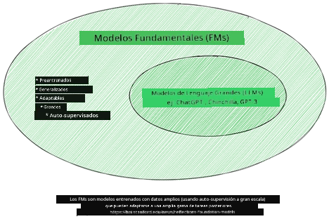

Fuente de la imagen: [Guía esencial sobre modelos base y modelos de lenguaje a gran escala | por Babar M Bhatti | Medium
](https://thebabar.medium.com/essential-guide-to-foundation-models-and-large-language-models-27dab58f7404)

Para aclarar aún más esta distinción, tomemos ChatGPT como ejemplo histórico. Las primeras versiones de ChatGPT usaron GPT-3.5 como modelo base. Luego OpenAI utilizó datos específicos de chat y técnicas de alineación para crear una versión ajustada que funcionaba mejor en escenarios conversacionales, como chatbots. Los servicios modernos de IA suelen enrutarse entre varias variantes de modelos, por lo que el nombre del servicio y el nombre del modelo subyacente no siempre son lo mismo.

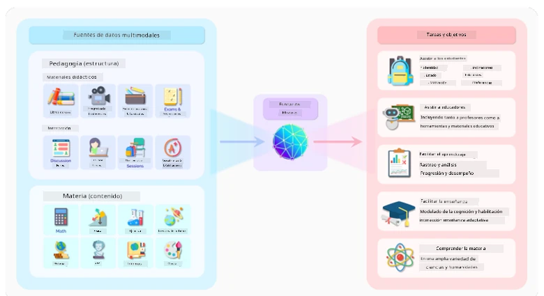

Fuente de la imagen: [2108.07258.pdf (arxiv.org)](https://arxiv.org/pdf/2108.07258.pdf?WT.mc_id=academic-105485-koreyst)

### Modelos Open-Weight/Open-Source versus Modelos Propietarios

Otra forma de categorizar los LLMs es si son open-weight (peso abierto), open-source (código abierto) o propietarios.

Los modelos open-source y open-weight ponen artefactos del modelo disponibles para inspección, descarga o personalización, pero sus licencias difieren. Algunos son completamente de código abierto, mientras que otros son modelos open-weight con restricciones de uso. Pueden ser útiles cuando una empresa necesita más control sobre el despliegue, la localización de datos, costo o personalización. Sin embargo, los equipos aún deben revisar los términos de licencia, costos de servicio, mantenimiento, actualizaciones de seguridad y calidad de evaluación antes de usarlos en producción. Ejemplos incluyen [Meta Llama 4](https://ai.meta.com/blog/llama-4-multimodal-intelligence/?WT.mc_id=academic-105485-koreyst), algunos [modelos de Mistral](https://docs.mistral.ai/models/overview?WT.mc_id=academic-105485-koreyst) y muchos modelos hospedados en [Hugging Face](https://huggingface.co/models?WT.mc_id=academic-105485-koreyst).

Los modelos propietarios son propiedad y están hospedados por un proveedor. Estos modelos a menudo están optimizados para uso en producción gestionada y pueden ofrecer soporte sólido, sistemas de seguridad, integración de herramientas y escala. Sin embargo, los clientes usualmente no pueden inspeccionar ni modificar los pesos del modelo, y deben revisar los términos del proveedor sobre privacidad, retención, cumplimiento y uso aceptable. Ejemplos incluyen [modelos de OpenAI](https://platform.openai.com/docs/models?WT.mc_id=academic-105485-koreyst), [Google Gemini](https://deepmind.google/models/gemini/pro/?WT.mc_id=academic-105485-koreyst) y [Anthropic Claude](https://platform.claude.com/docs/en/about-claude/models/overview?WT.mc_id=academic-105485-koreyst).

### Embedding versus Generación de imágenes versus Generación de texto y código

Los LLMs también pueden categorizarse según el resultado que generan.

Los embeddings son un conjunto de modelos que pueden convertir texto en una forma numérica, llamada embedding, que es una representación numérica del texto de entrada. Los embeddings facilitan que las máquinas entiendan las relaciones entre palabras o frases y pueden ser consumidos como entradas por otros modelos, como modelos de clasificación o de agrupamiento que tienen mejor rendimiento con datos numéricos. Los modelos de embedding se usan a menudo para aprendizaje por transferencia, donde se construye un modelo para una tarea sustituta con abundancia de datos, y luego los pesos del modelo (embeddings) se reutilizan para otras tareas posteriores. Un ejemplo de esta categoría son los [embeddings de OpenAI](https://platform.openai.com/docs/models/embeddings?WT.mc_id=academic-105485-koreyst).

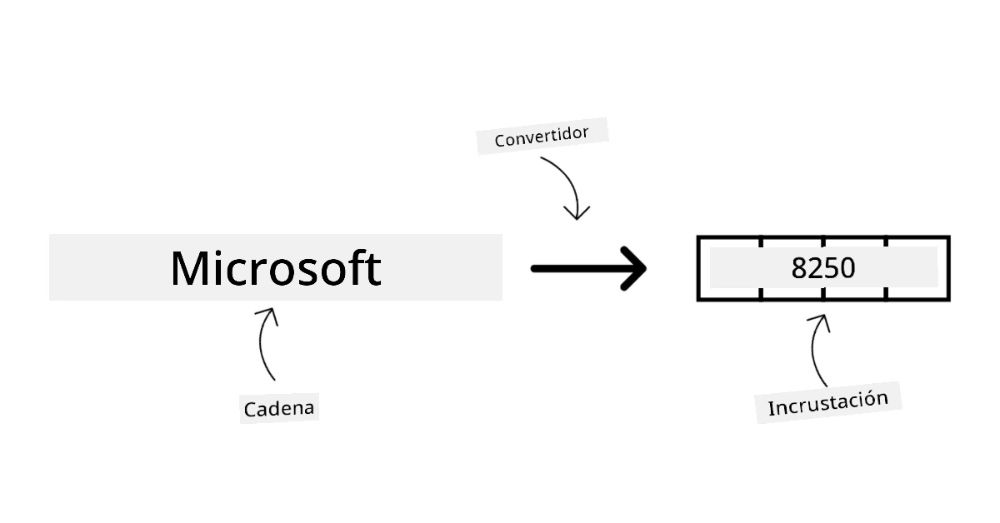

Los modelos de generación de imágenes son modelos que generan imágenes. Estos modelos se usan a menudo para edición de imágenes, síntesis e interpretación de imágenes. Los modelos de generación de imágenes se entrenan a menudo en grandes conjuntos de datos de imágenes, como [LAION-5B](https://laion.ai/blog/laion-5b/?WT.mc_id=academic-105485-koreyst), y pueden usarse para generar nuevas imágenes o para editar imágenes existentes con técnicas de pintura interna (inpainting), superresolución y colorización. Ejemplos incluyen [modelos GPT Image](https://platform.openai.com/docs/guides/images?WT.mc_id=academic-105485-koreyst), [modelos de Stable Diffusion](https://github.com/Stability-AI/StableDiffusion?WT.mc_id=academic-105485-koreyst) y modelos Imagen.

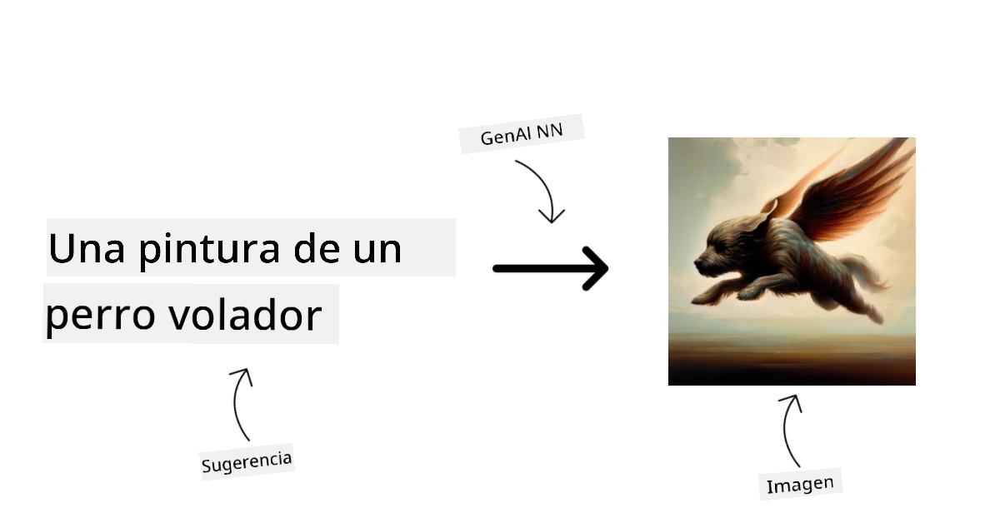

Los modelos de generación de texto y código son modelos que generan texto o código. Estos modelos se usan comúnmente para resumen de texto, traducción y respuesta a preguntas. Los modelos de generación de texto se entrenan a menudo en grandes conjuntos de datos de texto, como [BookCorpus](https://www.cv-foundation.org/openaccess/content_iccv_2015/html/Zhu_Aligning_Books_and_ICCV_2015_paper.html?WT.mc_id=academic-105485-koreyst), y pueden usarse para generar texto nuevo o para responder preguntas. Los modelos de generación de código, como [CodeParrot](https://huggingface.co/codeparrot?WT.mc_id=academic-105485-koreyst), se entrenan a menudo en grandes conjuntos de datos de código, como GitHub, y pueden usarse para generar nuevo código o para corregir errores en código existente.

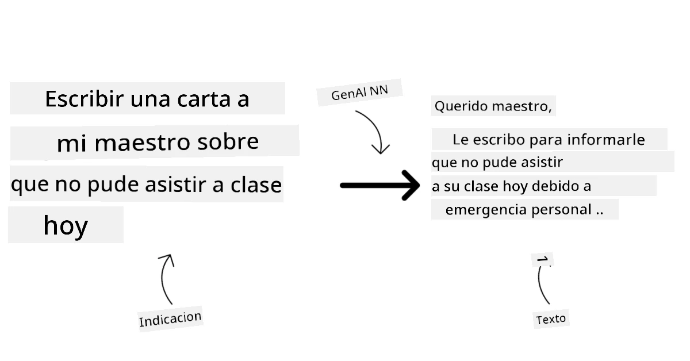

### Codificador-Decodificador versus solo Decodificador

Para hablar de los diferentes tipos de arquitecturas de LLMs, usemos una analogía.

Imagina que tu gerente te asignó la tarea de escribir un cuestionario para los estudiantes. Tienes dos colegas; uno supervisa la creación del contenido y el otro supervisa la revisión.

El creador de contenido es como un modelo solo decodificador: pueden ver el tema, ver lo que ya escribiste y luego continuar generando contenido basado en ese contexto. Son muy buenos escribiendo contenido atractivo e informativo, pero no siempre son la mejor elección cuando la tarea es solo clasificar, recuperar o codificar información. Ejemplos de familias de modelos solo decodificador incluyen modelos GPT y Llama.

El revisor es como un modelo solo codificador, él examina el curso escrito y las respuestas, notando la relación entre ellos y entendiendo el contexto, pero no es bueno generando contenido. Un ejemplo de modelo solo codificador sería BERT.

Imagina que también podemos tener a alguien que pueda crear y revisar el cuestionario, este es un modelo Codificador-Decodificador. Algunos ejemplos serían BART y T5.

### Servicio versus Modelo

Ahora, hablemos de la diferencia entre un servicio y un modelo. Un servicio es un producto ofrecido por un Proveedor de Servicios en la Nube, y a menudo es una combinación de modelos, datos y otros componentes. Un modelo es el componente central de un servicio, y a menudo es un modelo base, como un LLM.

Los servicios suelen estar optimizados para uso en producción y son a menudo más fáciles de usar que los modelos, mediante una interfaz gráfica de usuario. Sin embargo, los servicios no siempre están disponibles gratis y pueden requerir una suscripción o pago para usarlos, a cambio de aprovechar el equipo y recursos del propietario del servicio, optimizar gastos y escalar fácilmente. Un ejemplo de servicio es [Azure OpenAI Service](https://learn.microsoft.com/azure/ai-foundry/openai/overview?WT.mc_id=academic-105485-koreyst), que ofrece un plan tarifario de pago por uso, lo que significa que los usuarios pagan proporcionalmente a cuánto usan el servicio. Azure OpenAI Service también ofrece seguridad de nivel empresarial y un marco de IA responsable encima de las capacidades de los modelos.

Los modelos son los artefactos de la red neuronal: parámetros, pesos, arquitectura, tokenizador y configuraciones de soporte. Ejecutar un modelo localmente o en un entorno privado requiere hardware adecuado, infraestructura de servicio, monitoreo y una licencia compatible open-source/open-weight o una licencia comercial. Los modelos open-weight como Llama 4 o los modelos Mistral pueden autoalbergarse, pero aún requieren potencia computacional y experiencia operativa.

## Cómo probar e iterar con diferentes modelos para entender el rendimiento en Azure

Una vez que nuestro equipo ha explorado el panorama actual de los LLM y ha identificado algunos buenos candidatos para sus escenarios, el siguiente paso es probarlos con sus datos y con su carga de trabajo. Este es un proceso iterativo, realizado mediante experimentos y mediciones.
La mayoría de los modelos que mencionamos en los párrafos anteriores (modelos de OpenAI, modelos de peso abierto como Llama 4 y Mistral, y modelos de Hugging Face) están disponibles en [Microsoft Foundry Models](https://learn.microsoft.com/azure/foundry/concepts/foundry-models-overview?WT.mc_id=academic-105485-koreyst).

[Microsoft Foundry](https://learn.microsoft.com/azure/foundry/what-is-foundry?WT.mc_id=academic-105485-koreyst), anteriormente Azure AI Studio/Azure AI Foundry, es una plataforma unificada de Azure para construir aplicaciones y agentes de IA. Ayuda a los desarrolladores a gestionar el ciclo de vida desde la experimentación y evaluación hasta el despliegue, monitoreo y gobernanza. El catálogo de modelos en Microsoft Foundry permite al usuario:

- Encontrar el modelo base de interés en el catálogo, incluyendo modelos vendidos por Azure y modelos de socios y proveedores de la comunidad. Los usuarios pueden filtrar por tarea, proveedor, licencia, opción de despliegue o nombre.

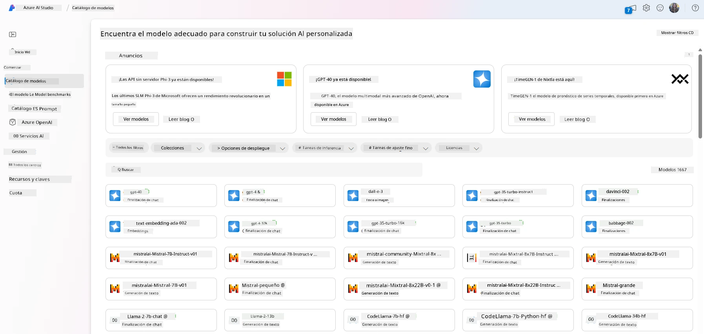

- Revisar la tarjeta del modelo, incluyendo una descripción detallada del uso previsto y los datos de entrenamiento, ejemplos de código y resultados de evaluación en la biblioteca interna de evaluaciones.

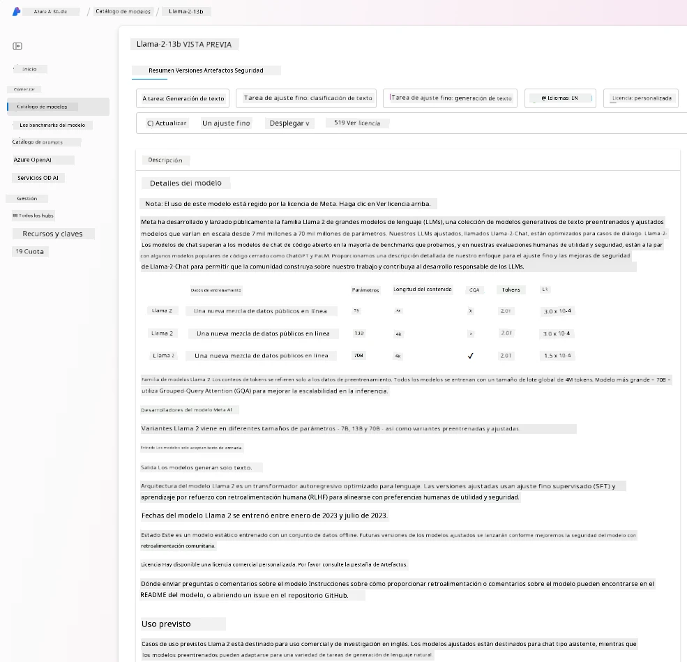

- Comparar resultados de referencia entre modelos y conjuntos de datos disponibles en la industria para evaluar cuál cumple con el escenario de negocio, a través del panel de [Model Benchmarks](https://learn.microsoft.com/azure/ai-foundry/concepts/model-benchmarks?WT.mc_id=academic-105485-koreyst).

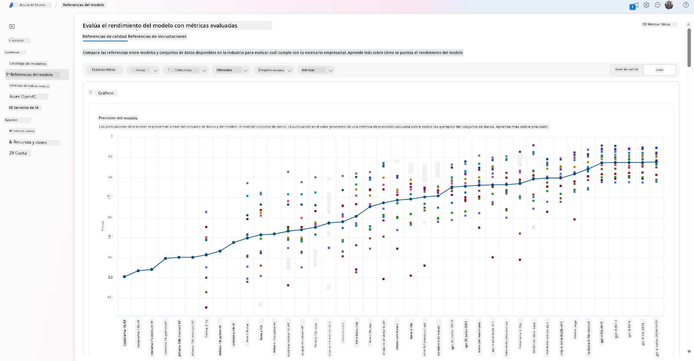

- Ajustar modelos compatibles con datos de entrenamiento personalizados para mejorar el rendimiento del modelo en una carga de trabajo específica, aprovechando las capacidades de experimentación y seguimiento de Microsoft Foundry.

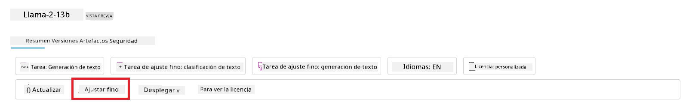

- Desplegar el modelo preentrenado original o la versión ajustada a un endpoint remoto de inferencia en tiempo real, utilizando opciones de cómputo gestionado o despliegue sin servidor, para permitir que las aplicaciones lo consuman.

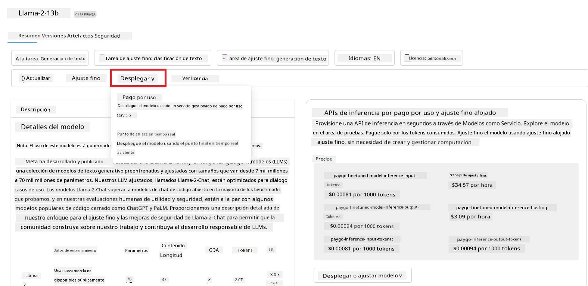

> [!NOTE]
> No todos los modelos en el catálogo están actualmente disponibles para ajuste fino y/o despliegue de pago por uso. Verifique la tarjeta del modelo para detalles sobre las capacidades y limitaciones del modelo.

## Mejorando resultados de LLM

Hemos explorado con nuestro equipo startup diferentes tipos de LLM y una plataforma en la nube (Microsoft Foundry) que nos permite comparar diferentes modelos, evaluarlos con datos de prueba, mejorar el rendimiento y desplegarlos en endpoints de inferencia.

Pero, ¿cuándo deberían considerar ajustar un modelo en lugar de usar uno preentrenado? ¿Existen otros enfoques para mejorar el rendimiento del modelo en cargas de trabajo específicas?

Hay varias formas en que un negocio puede obtener los resultados que necesita de un LLM. Puede seleccionar diferentes tipos de modelos con distintos grados de entrenamiento al desplegar un LLM en producción, con diferentes niveles de complejidad, costo y calidad. Aquí algunos enfoques diferentes:

- **Ingeniería de prompts con contexto**. La idea es proporcionar suficiente contexto cuando haces un prompt para asegurar que obtienes las respuestas que necesitas.

- **Generación aumentada por recuperación, RAG**. Tus datos podrían estar en una base de datos o endpoint web, por ejemplo, para asegurar que estos datos, o un subconjunto de ellos, están incluidos al momento del prompt, puedes obtener los datos relevantes y hacer que formen parte del prompt del usuario.

- **Modelo ajustado**. Aquí, entrenaste más el modelo con tus propios datos, lo que llevó a que el modelo sea más exacto y sensible a tus necesidades, aunque puede ser costoso.

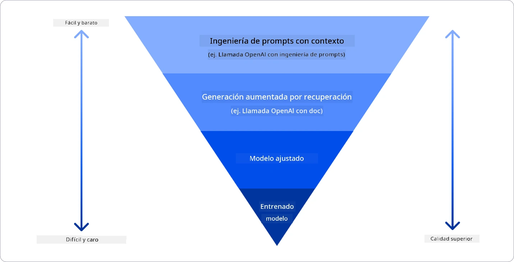

Fuente de la imagen: [Four Ways that Enterprises Deploy LLMs | Fiddler AI Blog](https://www.fiddler.ai/blog/four-ways-that-enterprises-deploy-llms?WT.mc_id=academic-105485-koreyst)

### Ingeniería de prompts con contexto

Los LLM preentrenados funcionan muy bien en tareas de lenguaje natural generalizadas, incluso llamándolos con un prompt corto, como una frase para completar o una pregunta, el llamado aprendizaje “zero-shot”.

Sin embargo, cuanto más pueda el usuario enmarcar su consulta, con una solicitud detallada y ejemplos — el Contexto — más precisa y cercana a las expectativas del usuario será la respuesta. En este caso, hablamos de aprendizaje “one-shot” si el prompt incluye solo un ejemplo y de “few-shot learning” si incluye varios ejemplos.
La ingeniería de prompts con contexto es el enfoque más rentable para comenzar.

### Generación aumentada por recuperación (RAG)

Los LLM tienen la limitación de que solo pueden usar los datos con los que fueron entrenados para generar una respuesta. Esto significa que no saben nada sobre hechos ocurridos después de su proceso de entrenamiento, y no pueden acceder a información no pública (como datos de la empresa).
Esto puede superarse mediante RAG, una técnica que aumenta el prompt con datos externos en forma de fragmentos de documentos, considerando los límites en la longitud del prompt. Esto es soportado por herramientas de bases de datos vectoriales (como [Azure Vector Search](https://learn.microsoft.com/azure/search/vector-search-overview?WT.mc_id=academic-105485-koreyst)) que recuperan los fragmentos útiles de diversas fuentes de datos predefinidas y los añaden al Contexto del prompt.

Esta técnica es muy útil cuando un negocio no tiene suficientes datos, tiempo o recursos para ajustar un LLM, pero aún desea mejorar el rendimiento en una carga de trabajo específica y reducir el riesgo de respuestas alucinadas, obsoletas o no soportadas.

### Modelo ajustado

El ajuste fino es un proceso que aprovecha el aprendizaje por transferencia para ‘adaptar’ el modelo a una tarea descendente o para resolver un problema específico. A diferencia del few-shot learning y RAG, da como resultado un nuevo modelo generado, con pesos y sesgos actualizados. Requiere un conjunto de ejemplos de entrenamiento que consiste en una sola entrada (el prompt) y su salida asociada (la finalización).
Esta sería la opción preferida si:

- **Usas modelos más pequeños específicos para la tarea**. Un negocio preferiría ajustar un modelo más pequeño para una tarea concreta en lugar de solicitar repetidamente un modelo grande de frontera, logrando así una solución más económica y rápida.

- **Considera la latencia**. La latencia es importante para un caso de uso específico, por lo que no es posible usar prompts muy largos o el número de ejemplos que deben aprenderse no se ajusta al límite de longitud del prompt.

- **Adaptar comportamiento estable**. Un negocio tiene muchos ejemplos de alta calidad y quiere que el modelo siga consistentemente un patrón de tarea, formato de salida, tono o estilo específico de dominio. Si el problema principal son hechos recientes o conocimiento privado que cambia frecuentemente, usa RAG en lugar de confiar solo en el ajuste fino.

### Modelo entrenado

Entrenar un LLM desde cero es sin duda el enfoque más difícil y complejo de adoptar, requiriendo grandes cantidades de datos, recursos capacitados y poder computacional adecuado. Esta opción debería considerarse solo en un escenario donde un negocio tenga un caso de uso específico de dominio y una gran cantidad de datos centrados en ese dominio.

## Verificación de conocimiento

¿Cuál podría ser un buen enfoque para mejorar los resultados de completación en un LLM?

1. Ingeniería de prompts con contexto
1. RAG
1. Modelo ajustado

A: Los tres pueden ayudar. Comienza con ingeniería de prompts y contexto para mejoras rápidas, y usa RAG cuando el modelo necesita hechos actuales o datos privados de negocio. Elige ajuste fino cuando tengas suficientes ejemplos de alta calidad y necesites que el modelo siga consistentemente una tarea, formato, tono o patrón de dominio.

## 🚀 Desafío

Lee más sobre cómo puedes [usar RAG](https://learn.microsoft.com/azure/search/retrieval-augmented-generation-overview?WT.mc_id=academic-105485-koreyst) para tu negocio.

## Buen trabajo, continúa tu aprendizaje

Después de completar esta lección, consulta nuestra [colección de aprendizaje de IA Generativa](https://aka.ms/genai-collection?WT.mc_id=academic-105485-koreyst) para seguir ampliando tus conocimientos sobre IA Generativa.

Dirígete a la Lección 3 donde veremos cómo [construir con IA Generativa de manera responsable](../03-using-generative-ai-responsibly/README.md?WT.mc_id=academic-105485-koreyst)!

---

<!-- CO-OP TRANSLATOR DISCLAIMER START -->
**Descargo de responsabilidad**:
Este documento ha sido traducido utilizando el servicio de traducción automática [Co-op Translator](https://github.com/Azure/co-op-translator). Aunque nos esforzamos por la precisión, tenga en cuenta que las traducciones automatizadas pueden contener errores o inexactitudes. El documento original en su idioma nativo debe considerarse la fuente autorizada. Para información crítica, se recomienda una traducción profesional humana. No somos responsables de cualquier malentendido o interpretación errónea que surja del uso de esta traducción.
<!-- CO-OP TRANSLATOR DISCLAIMER END -->