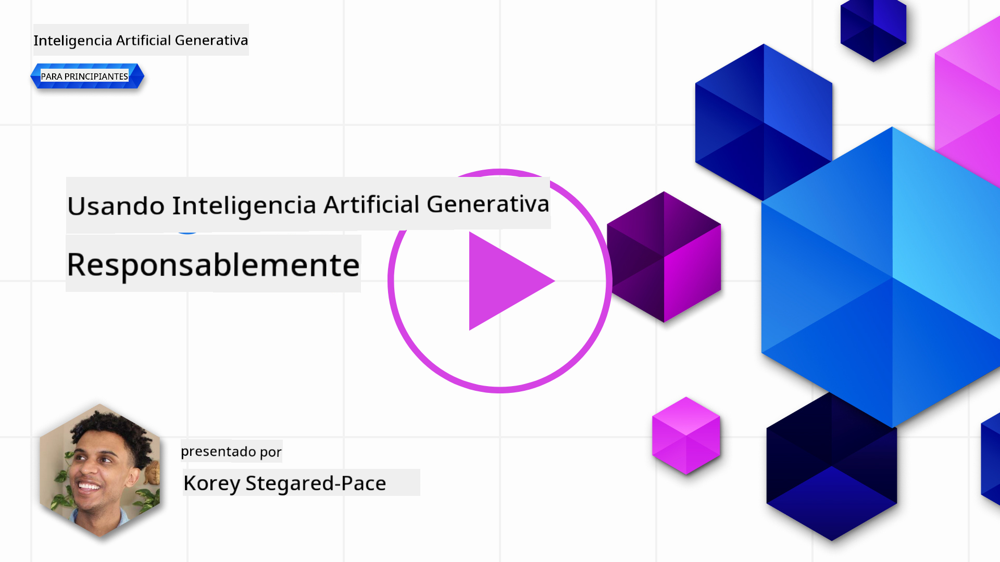

<!--
CO_OP_TRANSLATOR_METADATA:
{
  "original_hash": "13084c6321a2092841b9a081b29497ba",
  "translation_date": "2025-05-19T09:24:55+00:00",
  "source_file": "03-using-generative-ai-responsibly/README.md",
  "language_code": "es"
}
-->
# Uso Responsable de la IA Generativa

> _Haz clic en la imagen de arriba para ver el video de esta lección_

Es fácil sentirse fascinado por la IA y la IA generativa en particular, pero es necesario considerar cómo usarla de manera responsable. Debes tener en cuenta aspectos como garantizar que el resultado sea justo, no perjudicial y más. Este capítulo tiene como objetivo proporcionarte el contexto mencionado, qué considerar y cómo tomar medidas activas para mejorar tu uso de la IA.

## Introducción

Esta lección cubrirá:

- Por qué deberías priorizar la IA Responsable al construir aplicaciones de IA Generativa.
- Principios fundamentales de la IA Responsable y cómo se relacionan con la IA Generativa.
- Cómo poner estos principios de IA Responsable en práctica a través de estrategia y herramientas.

## Objetivos de Aprendizaje

Después de completar esta lección sabrás:

- La importancia de la IA Responsable al construir aplicaciones de IA Generativa.
- Cuándo pensar y aplicar los principios fundamentales de la IA Responsable al construir aplicaciones de IA Generativa.
- Qué herramientas y estrategias están disponibles para ti para poner en práctica el concepto de IA Responsable.

## Principios de IA Responsable

La emoción por la IA Generativa nunca ha sido mayor. Esta emoción ha atraído a muchos nuevos desarrolladores, atención y financiamiento a este espacio. Aunque esto es muy positivo para cualquiera que busque construir productos y empresas usando IA Generativa, también es importante proceder de manera responsable.

A lo largo de este curso, nos enfocamos en construir nuestra startup y nuestro producto educativo de IA. Usaremos los principios de IA Responsable: Equidad, Inclusividad, Fiabilidad/Seguridad, Seguridad y Privacidad, Transparencia y Responsabilidad. Con estos principios, exploraremos cómo se relacionan con nuestro uso de la IA Generativa en nuestros productos.

## Por Qué Deberías Priorizar la IA Responsable

Al construir un producto, adoptar un enfoque centrado en el ser humano, manteniendo el mejor interés de tu usuario en mente, conduce a los mejores resultados.

La singularidad de la IA Generativa es su poder para crear respuestas útiles, información, orientación y contenido para los usuarios. Esto se puede hacer sin muchos pasos manuales, lo que puede llevar a resultados muy impresionantes. Sin una planificación y estrategias adecuadas, también puede, lamentablemente, llevar a algunos resultados perjudiciales para tus usuarios, tu producto y la sociedad en general.

Veamos algunos (pero no todos) de estos resultados potencialmente perjudiciales:

### Alucinaciones

Las alucinaciones son un término utilizado para describir cuando un LLM produce contenido que es completamente absurdo o algo que sabemos que es incorrecto basado en otras fuentes de información.

Tomemos, por ejemplo, que construimos una característica para nuestra startup que permite a los estudiantes hacer preguntas históricas a un modelo. Un estudiante hace la pregunta `Who was the sole survivor of Titanic?`

El modelo produce una respuesta como la siguiente:

> _(Fuente: [Flying bisons](https://flyingbisons.com?WT.mc_id=academic-105485-koreyst))_

Esta es una respuesta muy confiada y completa. Desafortunadamente, es incorrecta. Incluso con una mínima cantidad de investigación, uno descubriría que hubo más de un sobreviviente del desastre del Titanic. Para un estudiante que recién comienza a investigar este tema, esta respuesta puede ser lo suficientemente persuasiva como para no ser cuestionada y tratada como un hecho. Las consecuencias de esto pueden llevar a que el sistema de IA sea poco fiable y afectar negativamente la reputación de nuestra startup.

Con cada iteración de cualquier LLM dado, hemos visto mejoras en el rendimiento en torno a minimizar las alucinaciones. Incluso con esta mejora, nosotros, como constructores de aplicaciones y usuarios, todavía necesitamos estar conscientes de estas limitaciones.

### Contenido Dañino

Cubierto en la sección anterior cuando un LLM produce respuestas incorrectas o absurdas. Otro riesgo del que necesitamos estar conscientes es cuando un modelo responde con contenido dañino.

El contenido dañino puede definirse como:

- Proporcionar instrucciones o fomentar el autodaño o daño a ciertos grupos.
- Contenido odioso o degradante.
- Guiar la planificación de cualquier tipo de ataque o actos violentos.
- Proporcionar instrucciones sobre cómo encontrar contenido ilegal o cometer actos ilegales.
- Mostrar contenido sexualmente explícito.

Para nuestra startup, queremos asegurarnos de tener las herramientas y estrategias adecuadas para prevenir que este tipo de contenido sea visto por los estudiantes.

### Falta de Equidad

La equidad se define como "asegurar que un sistema de IA esté libre de sesgos y discriminación y que trate a todos de manera justa e igualitaria". En el mundo de la IA Generativa, queremos asegurarnos de que las visiones del mundo excluyentes de grupos marginados no sean reforzadas por la salida del modelo.

Estos tipos de salidas no solo son destructivos para construir experiencias de producto positivas para nuestros usuarios, sino que también causan un daño social adicional. Como constructores de aplicaciones, siempre debemos tener en cuenta una base de usuarios amplia y diversa al construir soluciones con IA Generativa.

## Cómo Usar la IA Generativa de Manera Responsable

Ahora que hemos identificado la importancia de la IA Generativa Responsable, veamos 4 pasos que podemos tomar para construir nuestras soluciones de IA de manera responsable:

### Medir Daños Potenciales

En las pruebas de software, probamos las acciones esperadas de un usuario en una aplicación. De manera similar, probar un conjunto diverso de indicaciones que los usuarios probablemente van a usar es una buena manera de medir el daño potencial.

Dado que nuestra startup está construyendo un producto educativo, sería bueno preparar una lista de indicaciones relacionadas con la educación. Esto podría ser para cubrir un cierto tema, hechos históricos y preguntas sobre la vida estudiantil.

### Mitigar Daños Potenciales

Ahora es el momento de encontrar formas en las que podamos prevenir o limitar el daño potencial causado por el modelo y sus respuestas. Podemos ver esto en 4 capas diferentes:

- **Modelo**. Elegir el modelo adecuado para el caso de uso adecuado. Modelos más grandes y complejos como GPT-4 pueden causar más riesgo de contenido dañino cuando se aplican a casos de uso más pequeños y específicos. Usar tus datos de entrenamiento para ajustar también reduce el riesgo de contenido dañino.

- **Sistema de Seguridad**. Un sistema de seguridad es un conjunto de herramientas y configuraciones en la plataforma que sirve al modelo que ayuda a mitigar el daño. Un ejemplo de esto es el sistema de filtrado de contenido en el servicio Azure OpenAI. Los sistemas también deben detectar ataques de jailbreak y actividad no deseada como solicitudes de bots.

- **Metaprompt**. Los metaprompts y el anclaje son formas en las que podemos dirigir o limitar el modelo basado en ciertos comportamientos e información. Esto podría ser usar entradas del sistema para definir ciertos límites del modelo. Además, proporcionar salidas que sean más relevantes para el alcance o dominio del sistema.

También puede ser usar técnicas como la Generación Aumentada por Recuperación (RAG) para que el modelo solo extraiga información de una selección de fuentes confiables. Hay una lección más adelante en este curso para [construir aplicaciones de búsqueda](../08-building-search-applications/README.md?WT.mc_id=academic-105485-koreyst)

- **Experiencia del Usuario**. La capa final es donde el usuario interactúa directamente con el modelo a través de la interfaz de nuestra aplicación de alguna manera. De esta manera podemos diseñar la UI/UX para limitar al usuario en los tipos de entradas que pueden enviar al modelo, así como el texto o imágenes mostradas al usuario. Al implementar la aplicación de IA, también debemos ser transparentes sobre lo que nuestra aplicación de IA Generativa puede y no puede hacer.

Tenemos una lección completa dedicada a [Diseñar UX para Aplicaciones de IA](../12-designing-ux-for-ai-applications/README.md?WT.mc_id=academic-105485-koreyst)

- **Evaluar el modelo**. Trabajar con LLMs puede ser desafiante porque no siempre tenemos control sobre los datos con los que se entrenó el modelo. Independientemente, siempre debemos evaluar el rendimiento y las salidas del modelo. Todavía es importante medir la precisión del modelo, la similitud, la fundamentación y la relevancia de la salida. Esto ayuda a proporcionar transparencia y confianza a las partes interesadas y usuarios.

### Operar una Solución de IA Generativa Responsable

Construir una práctica operativa alrededor de tus aplicaciones de IA es la etapa final. Esto incluye asociarse con otras partes de nuestra startup como Legal y Seguridad para asegurarnos de que cumplimos con todas las políticas regulatorias. Antes de lanzar, también queremos construir planes alrededor de la entrega, manejo de incidentes y retroceso para prevenir cualquier daño a nuestros usuarios de crecer.

## Herramientas

Aunque el trabajo de desarrollar soluciones de IA Responsable puede parecer mucho, es un trabajo que vale la pena el esfuerzo. A medida que el área de la IA Generativa crece, más herramientas para ayudar a los desarrolladores a integrar eficientemente la responsabilidad en sus flujos de trabajo madurarán. Por ejemplo, la [Seguridad de Contenido de Azure AI](https://learn.microsoft.com/azure/ai-services/content-safety/overview?WT.mc_id=academic-105485-koreyst) puede ayudar a detectar contenido e imágenes dañinas a través de una solicitud de API.

## Verificación de Conocimiento

¿Qué son algunas cosas de las que necesitas preocuparte para asegurar un uso responsable de la IA?

1. Que la respuesta sea correcta.
2. Uso dañino, que la IA no se use para propósitos criminales.
3. Asegurar que la IA esté libre de sesgos y discriminación.

A: 2 y 3 son correctas. La IA Responsable te ayuda a considerar cómo mitigar efectos dañinos y sesgos y más.

## 🚀 Desafío

Lee sobre [Seguridad de Contenido de Azure AI](https://learn.microsoft.com/azure/ai-services/content-safety/overview?WT.mc_id=academic-105485-koreyst) y ve qué puedes adoptar para tu uso.

## Gran Trabajo, Continúa Tu Aprendizaje

Después de completar esta lección, consulta nuestra [colección de aprendizaje de IA Generativa](https://aka.ms/genai-collection?WT.mc_id=academic-105485-koreyst) para seguir aumentando tus conocimientos de IA Generativa.

Dirígete a la Lección 4 donde veremos [Fundamentos de la Ingeniería de Prompts](../04-prompt-engineering-fundamentals/README.md?WT.mc_id=academic-105485-koreyst)!

**Descargo de responsabilidad**:  
Este documento ha sido traducido utilizando el servicio de traducción de IA [Co-op Translator](https://github.com/Azure/co-op-translator). Aunque nos esforzamos por lograr precisión, tenga en cuenta que las traducciones automáticas pueden contener errores o imprecisiones. El documento original en su idioma nativo debe considerarse la fuente autorizada. Para información crítica, se recomienda la traducción humana profesional. No somos responsables de ningún malentendido o interpretación errónea que surja del uso de esta traducción.