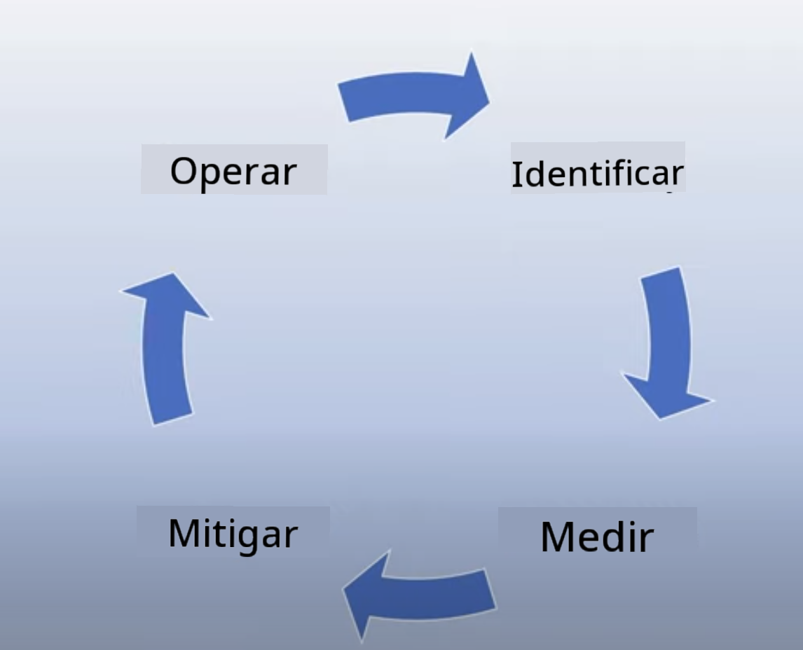
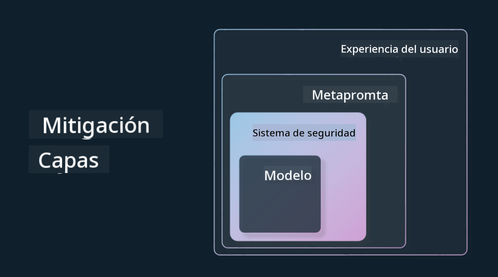

<!--
CO_OP_TRANSLATOR_METADATA:
{
  "original_hash": "7f8f4c11f8c1cb6e1794442dead414ea",
  "translation_date": "2025-07-09T08:46:23+00:00",
  "source_file": "03-using-generative-ai-responsibly/README.md",
  "language_code": "es"
}
-->
# Uso Responsable de la IA Generativa

> _Haz clic en la imagen de arriba para ver el video de esta lección_

Es fácil sentirse fascinado por la IA y, en particular, por la IA generativa, pero es necesario considerar cómo usarla de manera responsable. Debes tener en cuenta aspectos como garantizar que los resultados sean justos, no dañinos y más. Este capítulo tiene como objetivo brindarte el contexto mencionado, qué considerar y cómo tomar medidas activas para mejorar el uso de la IA.

## Introducción

Esta lección cubrirá:

- Por qué debes priorizar la IA Responsable al construir aplicaciones de IA Generativa.
- Principios fundamentales de la IA Responsable y cómo se relacionan con la IA Generativa.
- Cómo poner en práctica estos principios de IA Responsable mediante estrategias y herramientas.

## Objetivos de Aprendizaje

Después de completar esta lección sabrás:

- La importancia de la IA Responsable al construir aplicaciones de IA Generativa.
- Cuándo pensar y aplicar los principios fundamentales de la IA Responsable al construir aplicaciones de IA Generativa.
- Qué herramientas y estrategias tienes disponibles para poner en práctica el concepto de IA Responsable.

## Principios de IA Responsable

El entusiasmo por la IA Generativa nunca ha sido tan alto. Este entusiasmo ha atraído a muchos desarrolladores nuevos, atención y financiamiento a este campo. Aunque esto es muy positivo para quienes buscan crear productos y empresas usando IA Generativa, también es importante que avancemos de manera responsable.

A lo largo de este curso, nos enfocamos en construir nuestra startup y nuestro producto educativo de IA. Usaremos los principios de IA Responsable: Equidad, Inclusión, Confiabilidad/Seguridad, Seguridad y Privacidad, Transparencia y Responsabilidad. Con estos principios, exploraremos cómo se relacionan con nuestro uso de la IA Generativa en nuestros productos.

## Por qué Debes Priorizar la IA Responsable

Al construir un producto, adoptar un enfoque centrado en las personas, manteniendo en mente el mejor interés de tus usuarios, conduce a los mejores resultados.

La singularidad de la IA Generativa es su capacidad para crear respuestas útiles, información, orientación y contenido para los usuarios. Esto se puede hacer sin muchos pasos manuales, lo que puede generar resultados muy impresionantes. Sin una planificación y estrategias adecuadas, desafortunadamente también puede conducir a resultados dañinos para tus usuarios, tu producto y la sociedad en general.

Veamos algunos (pero no todos) de estos posibles resultados dañinos:

### Alucinaciones

Las alucinaciones son un término que se usa para describir cuando un LLM produce contenido que es completamente absurdo o algo que sabemos que es incorrecto según otras fuentes de información.

Por ejemplo, supongamos que construimos una función para nuestra startup que permite a los estudiantes hacer preguntas históricas a un modelo. Un estudiante pregunta: `¿Quién fue el único sobreviviente del Titanic?`

El modelo produce una respuesta como la siguiente:

> _(Fuente: [Flying bisons](https://flyingbisons.com?WT.mc_id=academic-105485-koreyst))_

Esta es una respuesta muy segura y detallada. Desafortunadamente, es incorrecta. Incluso con una mínima investigación, se descubriría que hubo más de un sobreviviente del desastre del Titanic. Para un estudiante que recién comienza a investigar este tema, esta respuesta puede ser lo suficientemente persuasiva como para no ser cuestionada y ser tomada como un hecho. Las consecuencias pueden hacer que el sistema de IA sea poco confiable y afectar negativamente la reputación de nuestra startup.

Con cada iteración de cualquier LLM, hemos visto mejoras en el rendimiento para minimizar las alucinaciones. Aun con esta mejora, como desarrolladores de aplicaciones y usuarios, debemos seguir siendo conscientes de estas limitaciones.

### Contenido Dañino

En la sección anterior cubrimos cuando un LLM produce respuestas incorrectas o sin sentido. Otro riesgo que debemos tener en cuenta es cuando un modelo responde con contenido dañino.

El contenido dañino se puede definir como:

- Proporcionar instrucciones o fomentar el autodaño o daño a ciertos grupos.
- Contenido odioso o denigrante.
- Guiar la planificación de cualquier tipo de ataque o acto violento.
- Proporcionar instrucciones sobre cómo encontrar contenido ilegal o cometer actos ilegales.
- Mostrar contenido sexual explícito.

Para nuestra startup, queremos asegurarnos de tener las herramientas y estrategias adecuadas para evitar que este tipo de contenido sea visto por los estudiantes.

### Falta de Equidad

La equidad se define como “asegurar que un sistema de IA esté libre de sesgos y discriminación y que trate a todos de manera justa e igualitaria.” En el mundo de la IA Generativa, queremos asegurarnos de que las visiones excluyentes de grupos marginados no se refuercen en la salida del modelo.

Este tipo de resultados no solo son destructivos para construir experiencias positivas de producto para nuestros usuarios, sino que también causan un daño social mayor. Como desarrolladores de aplicaciones, siempre debemos tener en mente una base de usuarios amplia y diversa al construir soluciones con IA Generativa.

## Cómo Usar la IA Generativa de Forma Responsable

Ahora que hemos identificado la importancia de la IA Generativa Responsable, veamos 4 pasos que podemos seguir para construir nuestras soluciones de IA de manera responsable:

### Medir los Daños Potenciales

En las pruebas de software, evaluamos las acciones esperadas de un usuario en una aplicación. De manera similar, probar un conjunto diverso de prompts que los usuarios probablemente usarán es una buena forma de medir posibles daños.

Dado que nuestra startup está construyendo un producto educativo, sería bueno preparar una lista de prompts relacionados con la educación. Esto podría cubrir ciertos temas, hechos históricos y preguntas sobre la vida estudiantil.

### Mitigar los Daños Potenciales

Es momento de encontrar formas para prevenir o limitar el daño potencial causado por el modelo y sus respuestas. Podemos verlo en 4 capas diferentes:

- **Modelo**. Elegir el modelo adecuado para el caso de uso correcto. Modelos más grandes y complejos como GPT-4 pueden implicar un mayor riesgo de contenido dañino cuando se aplican a casos de uso más pequeños y específicos. Usar tus datos de entrenamiento para ajustar el modelo también reduce el riesgo de contenido dañino.

- **Sistema de Seguridad**. Un sistema de seguridad es un conjunto de herramientas y configuraciones en la plataforma que sirve al modelo y ayuda a mitigar daños. Un ejemplo es el sistema de filtrado de contenido en el servicio Azure OpenAI. Los sistemas también deben detectar ataques de jailbreak y actividades no deseadas como solicitudes de bots.

- **Metaprompt**. Los metaprompts y el grounding son formas de dirigir o limitar el modelo basándonos en ciertos comportamientos e información. Esto puede ser usar entradas del sistema para definir ciertos límites del modelo. Además, proporcionar salidas que sean más relevantes al alcance o dominio del sistema.

También puede incluir técnicas como Retrieval Augmented Generation (RAG) para que el modelo solo extraiga información de una selección de fuentes confiables. Hay una lección más adelante en este curso sobre [construcción de aplicaciones de búsqueda](../08-building-search-applications/README.md?WT.mc_id=academic-105485-koreyst).

- **Experiencia de Usuario**. La capa final es donde el usuario interactúa directamente con el modelo a través de la interfaz de nuestra aplicación. De esta forma podemos diseñar la UI/UX para limitar los tipos de entradas que el usuario puede enviar al modelo, así como el texto o imágenes que se muestran. Al desplegar la aplicación de IA, también debemos ser transparentes sobre lo que nuestra aplicación de IA Generativa puede y no puede hacer.

Tenemos una lección completa dedicada a [Diseñar UX para Aplicaciones de IA](../12-designing-ux-for-ai-applications/README.md?WT.mc_id=academic-105485-koreyst).

- **Evaluar el modelo**. Trabajar con LLMs puede ser un desafío porque no siempre tenemos control sobre los datos con los que se entrenó el modelo. Sin embargo, siempre debemos evaluar el rendimiento y las salidas del modelo. Es importante medir la precisión, similitud, fundamentación y relevancia de la salida. Esto ayuda a proporcionar transparencia y confianza a las partes interesadas y usuarios.

### Operar una Solución de IA Generativa Responsable

Construir una práctica operativa alrededor de tus aplicaciones de IA es la etapa final. Esto incluye colaborar con otras áreas de nuestra startup como Legal y Seguridad para asegurar el cumplimiento de todas las políticas regulatorias. Antes de lanzar, también queremos crear planes para la entrega, manejo de incidentes y reversión para evitar que cualquier daño a nuestros usuarios se agrave.

## Herramientas

Aunque el trabajo de desarrollar soluciones de IA Responsable puede parecer mucho, es un esfuerzo que vale la pena. A medida que el área de IA Generativa crece, más herramientas para ayudar a los desarrolladores a integrar la responsabilidad eficientemente en sus flujos de trabajo madurarán. Por ejemplo, [Azure AI Content Safety](https://learn.microsoft.com/azure/ai-services/content-safety/overview?WT.mc_id=academic-105485-koreyst) puede ayudar a detectar contenido e imágenes dañinas mediante una solicitud API.

## Verificación de Conocimientos

¿Qué cosas debes tener en cuenta para asegurar un uso responsable de la IA?

1. Que la respuesta sea correcta.  
1. Uso dañino, que la IA no se use para fines criminales.  
1. Asegurar que la IA esté libre de sesgos y discriminación.

R: 2 y 3 son correctas. La IA Responsable te ayuda a considerar cómo mitigar efectos dañinos, sesgos y más.

## 🚀 Desafío

Lee sobre [Azure AI Content Safety](https://learn.microsoft.com/azure/ai-services/content-safety/overview?WT.mc_id=academic-105485-koreyst) y ve qué puedes adoptar para tu uso.

## Excelente trabajo, continúa aprendiendo

Después de completar esta lección, revisa nuestra [colección de aprendizaje de IA Generativa](https://aka.ms/genai-collection?WT.mc_id=academic-105485-koreyst) para seguir mejorando tus conocimientos en IA Generativa.

¡Dirígete a la Lección 4 donde veremos los [Fundamentos de la Ingeniería de Prompts](../04-prompt-engineering-fundamentals/README.md?WT.mc_id=academic-105485-koreyst)!

**Aviso legal**:  
Este documento ha sido traducido utilizando el servicio de traducción automática [Co-op Translator](https://github.com/Azure/co-op-translator). Aunque nos esforzamos por la precisión, tenga en cuenta que las traducciones automáticas pueden contener errores o inexactitudes. El documento original en su idioma nativo debe considerarse la fuente autorizada. Para información crítica, se recomienda la traducción profesional realizada por humanos. No nos hacemos responsables de malentendidos o interpretaciones erróneas derivadas del uso de esta traducción.