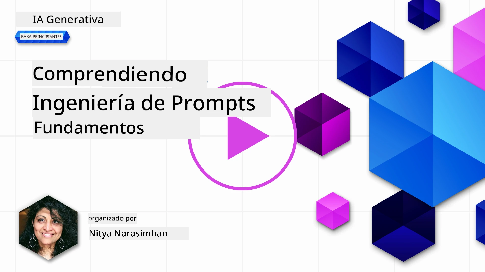
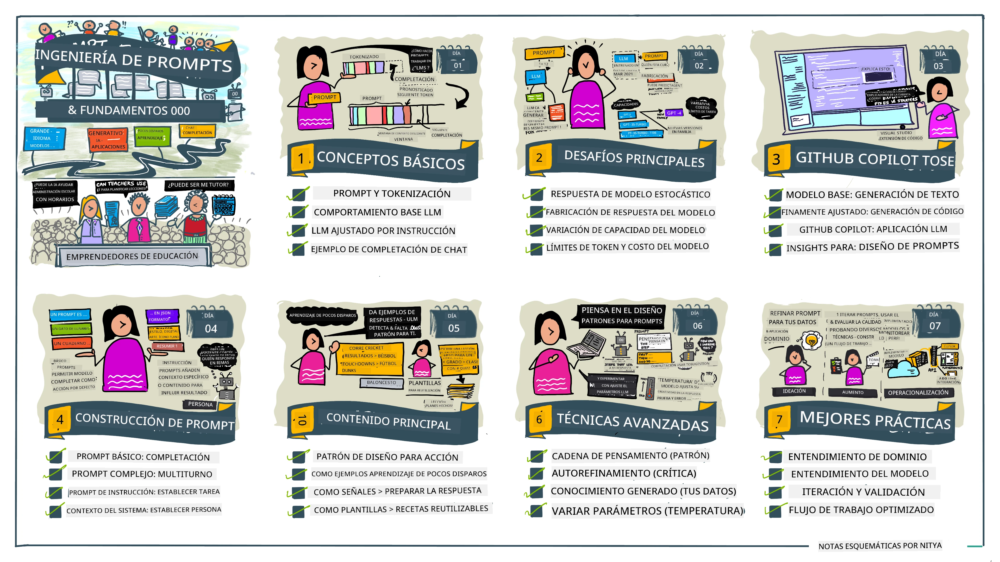
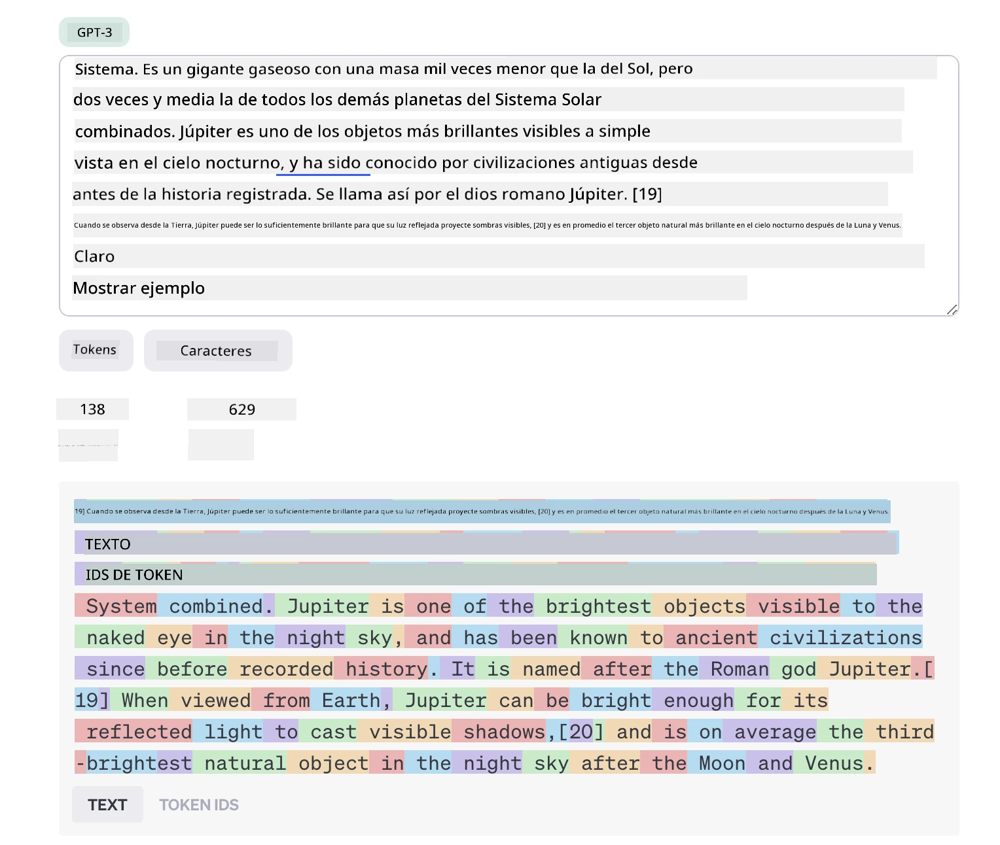
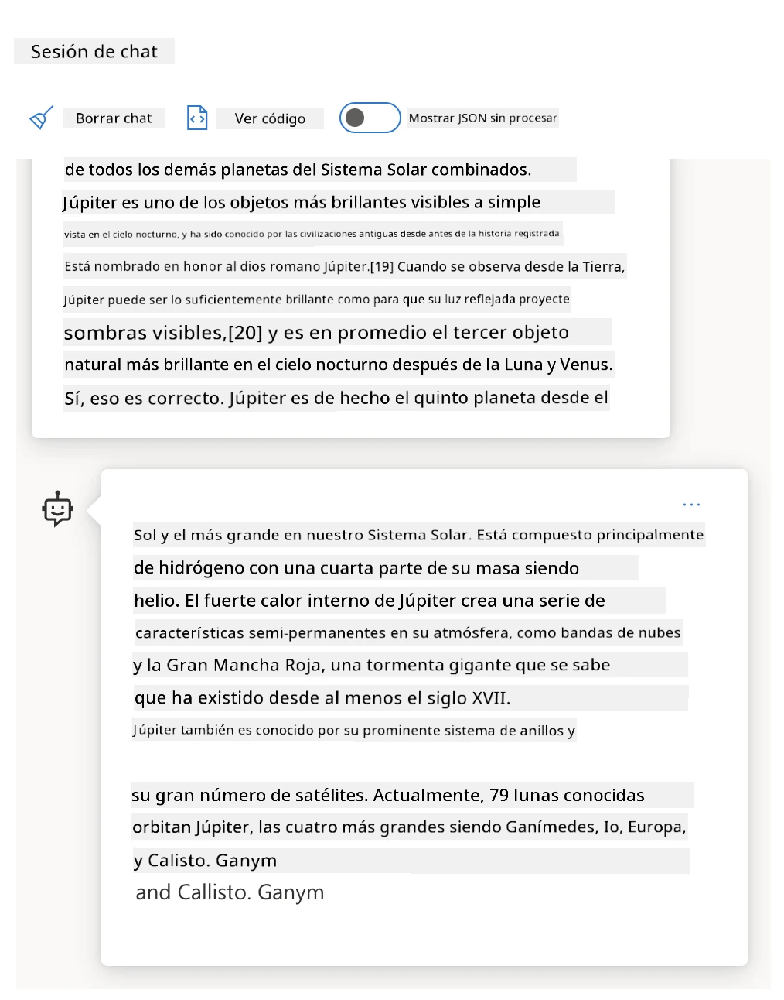
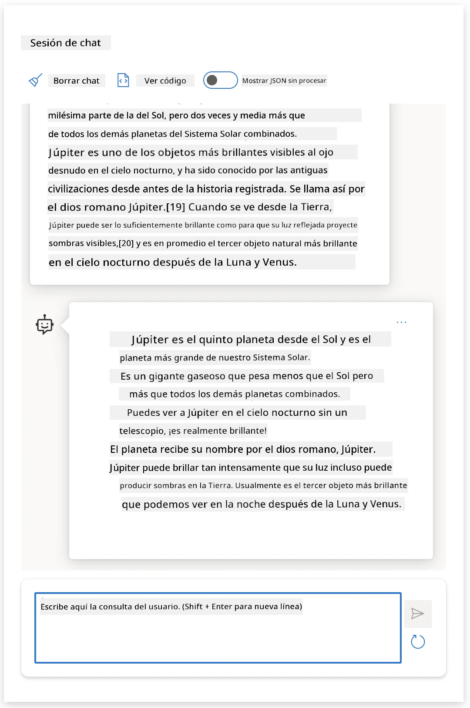
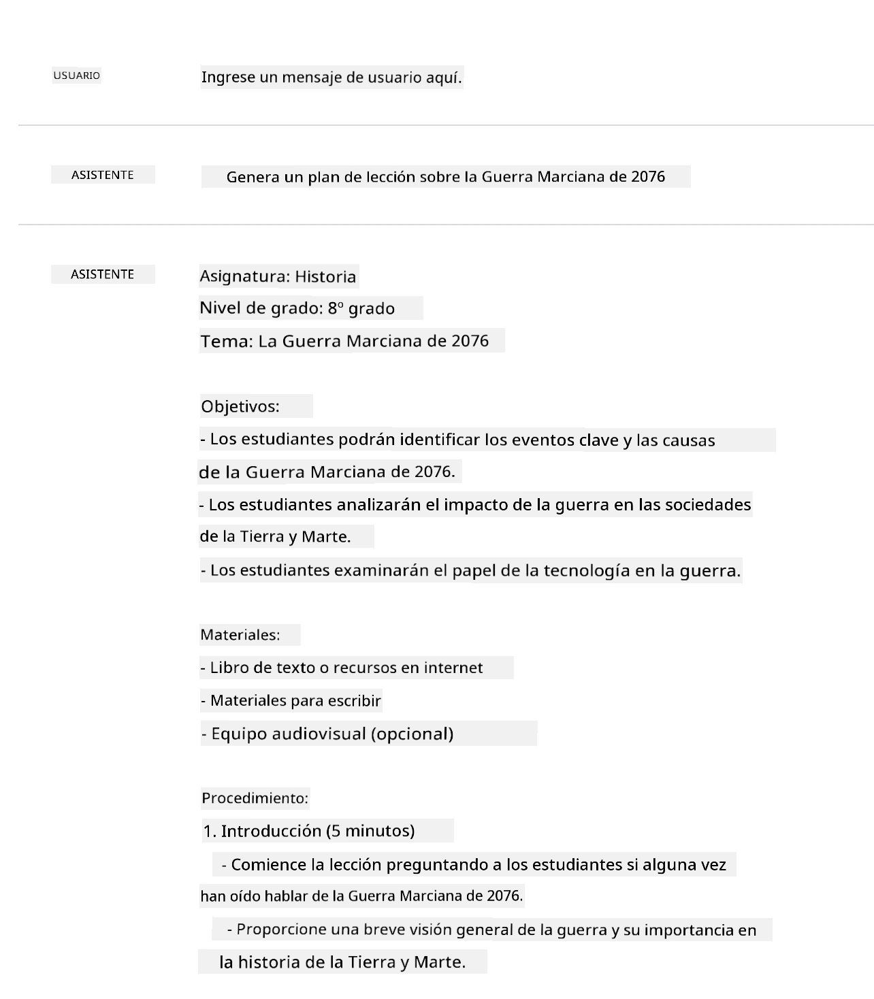
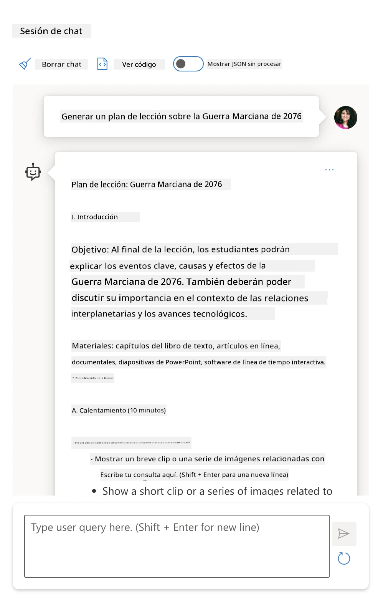
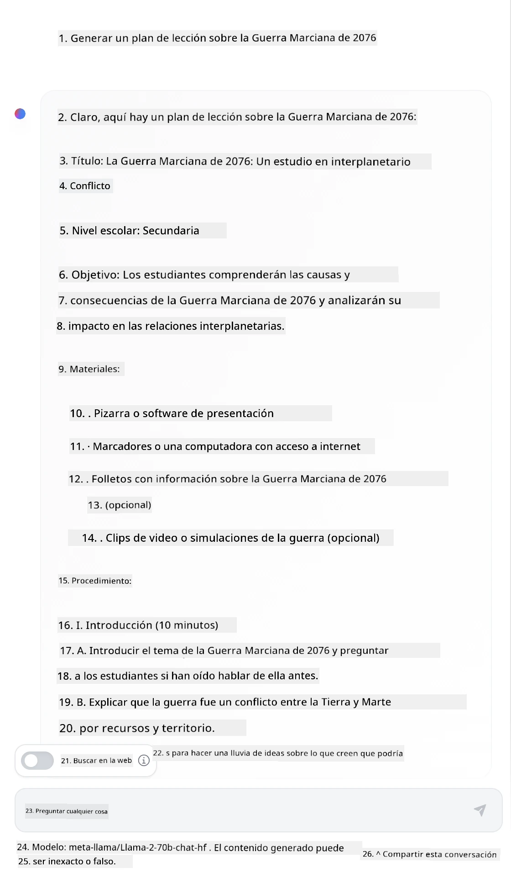

# Fundamentos de la Ingeniería de Prompts

[](https://youtu.be/GElCu2kUlRs?si=qrXsBvXnCW12epb8)

## Introducción
Este módulo cubre conceptos esenciales y técnicas para crear prompts efectivos en modelos generativos de IA. La forma en que escribes tu prompt para un LLM también importa. Un prompt cuidadosamente elaborado puede lograr una mejor calidad de respuesta. Pero, ¿qué significan exactamente términos como _prompt_ e _ingeniería de prompts_? ¿Y cómo mejoro el _input_ del prompt que envío al LLM? Estas son las preguntas que intentaremos responder en este capítulo y el siguiente.

La _IA generativa_ es capaz de crear contenido nuevo (por ejemplo, texto, imágenes, audio, código, etc.) en respuesta a las solicitudes de los usuarios. Lo logra usando _Modelos de Lenguaje a Gran Escala_ como la serie GPT de OpenAI ("Generative Pre-trained Transformer") que están entrenados para usar lenguaje natural y código.

Ahora los usuarios pueden interactuar con estos modelos usando paradigmas familiares como el chat, sin necesidad de experiencia técnica ni capacitación. Los modelos son _basados en prompts_: los usuarios envían un texto (prompt) y obtienen la respuesta de la IA (completado). Luego pueden "chatear con la IA" de forma iterativa, en conversaciones de varios turnos, refinando su prompt hasta que la respuesta cumpla sus expectativas.

Los "prompts" ahora se vuelven la principal _interfaz de programación_ para las aplicaciones de IA generativa, indicando a los modelos qué hacer e influyendo en la calidad de las respuestas devueltas. La "Ingeniería de Prompts" es un campo en rápido crecimiento que se centra en el _diseño y optimización_ de prompts para entregar respuestas consistentes y de calidad a gran escala.

## Objetivos de Aprendizaje

En esta lección, aprenderemos qué es la Ingeniería de Prompts, por qué es importante y cómo podemos crear prompts más efectivos para un modelo y objetivo de aplicación determinados. Entenderemos conceptos clave y mejores prácticas para la ingeniería de prompts, y conoceremos un entorno interactivo de Jupyter Notebooks ("sandbox") donde podemos ver estos conceptos aplicados a ejemplos reales.

Al final de esta lección podremos:

1. Explicar qué es la ingeniería de prompts y por qué es importante.
2. Describir los componentes de un prompt y cómo se usan.
3. Aprender mejores prácticas y técnicas para la ingeniería de prompts.
4. Aplicar técnicas aprendidas a ejemplos reales, usando un endpoint de OpenAI.

## Términos Clave

Ingeniería de Prompts: La práctica de diseñar y refinar entradas para guiar a los modelos de IA hacia la producción de salidas deseadas.  
Tokenización: El proceso de convertir texto en unidades más pequeñas, llamadas tokens, que un modelo puede entender y procesar.  
LLMs Ajustados por Instrucción: Modelos de Lenguaje a Gran Escala (LLMs) que han sido afinados con instrucciones específicas para mejorar la precisión y relevancia de sus respuestas.

## Sandbox de Aprendizaje

Actualmente, la ingeniería de prompts es más un arte que una ciencia. La mejor forma de mejorar nuestra intuición es _practicar más_ y adoptar un enfoque de prueba y error que combine experiencia en el dominio de aplicación con técnicas recomendadas y optimizaciones específicas para el modelo.

El Jupyter Notebook que acompaña esta lección provee un entorno _sandbox_ donde puedes probar lo que aprendes, ya sea sobre la marcha o como parte del desafío de código al final. Para ejecutar los ejercicios, necesitarás:

1. **Una clave API de Azure OpenAI**: el endpoint del servicio para un LLM desplegado.  
2. **Un entorno de ejecución Python**: donde se pueda ejecutar el Notebook.  
3. **Variables de entorno locales**: _completa los pasos del [SETUP](./../00-course-setup/02-setup-local.md?WT.mc_id=academic-105485-koreyst) ahora para estar listo_.

El notebook incluye ejercicios _iniciales_, pero se te anima a añadir tus propias secciones de _Markdown_ (descripción) y _Código_ (peticiones de prompt) para probar más ejemplos o ideas y así desarrollar tu intuición para el diseño de prompts.

## Guía Ilustrada

¿Quieres tener una visión general de lo que cubre esta lección antes de profundizar? Consulta esta guía ilustrada, que te dará una percepción de los temas principales y los puntos clave para reflexionar en cada uno. La hoja de ruta de la lección te lleva desde comprender los conceptos y desafíos básicos hasta abordarlos con técnicas y mejores prácticas relevantes de ingeniería de prompts. Nota que la sección "Técnicas Avanzadas" en esta guía se refiere a contenido cubierto en el _siguiente_ capítulo de este currículo.



## Nuestra Startup

Ahora, hablemos de cómo _este tema_ se relaciona con nuestra misión en la startup de [llevar la innovación en IA a la educación](https://educationblog.microsoft.com/2023/06/collaborating-to-bring-ai-innovation-to-education?WT.mc_id=academic-105485-koreyst). Queremos construir aplicaciones impulsadas por IA de _aprendizaje personalizado_, así que pensemos en cómo distintos usuarios de nuestra aplicación podrían "diseñar" prompts:

- **Administradores** podrían pedirle a la IA que _analice datos del currículo para identificar brechas en la cobertura_. La IA puede resumir resultados o visualizarlos con código.
- **Educadores** podrían pedirle a la IA que _genere un plan de lección para un público y tema objetivo_. La IA puede construir el plan personalizado en un formato especificado.
- **Estudiantes** podrían pedirle a la IA que _los tutorice en una materia difícil_. La IA ahora puede guiar a los estudiantes con lecciones, pistas y ejemplos adaptados a su nivel.

Eso es solo la punta del iceberg. Consulta [Prompts For Education](https://github.com/microsoft/prompts-for-edu/tree/main?WT.mc_id=academic-105485-koreyst) - una biblioteca open-source de prompts curada por expertos en educación - para tener una idea más amplia de las posibilidades. _¡Prueba ejecutar algunos de esos prompts en el sandbox o usando el OpenAI Playground para ver qué pasa!_

<!--
LESSON TEMPLATE:
This unit should cover core concept #1.
Reinforce the concept with examples and references.

CONCEPT #1:
Prompt Engineering.
Define it and explain why it is needed.
-->

## ¿Qué es la Ingeniería de Prompts?

Comenzamos esta lección definiendo la **Ingeniería de Prompts** como el proceso de _diseñar y optimizar_ entradas de texto (prompts) para entregar respuestas (completados) consistentes y de calidad para un objetivo y modelo dados. Podemos pensar en esto como un proceso de dos pasos:

- _diseñar_ el prompt inicial para un modelo y objetivo específicos  
- _refinar_ el prompt iterativamente para mejorar la calidad de la respuesta

Este es necesariamente un proceso de prueba y error que requiere intuición y esfuerzo del usuario para obtener resultados óptimos. ¿Por qué es importante? Para responder a esa pregunta, primero necesitamos entender tres conceptos:

- _Tokenización_ = cómo el modelo "ve" el prompt  
- _LLMs base_ = cómo el modelo base "procesa" un prompt  
- _LLMs ajustados por instrucción_ = cómo el modelo puede ahora entender "tareas"

### Tokenización

Un LLM ve los prompts como una _secuencia de tokens_, donde diferentes modelos (o versiones de un modelo) pueden tokenizar el mismo prompt de manera diferente. Dado que los LLMs se entrenan con tokens (y no con texto en bruto), la forma en que se tokenizan los prompts tiene un impacto directo en la calidad de la respuesta generada.

Para tener una intuición de cómo funciona la tokenización, prueba herramientas como el [OpenAI Tokenizer](https://platform.openai.com/tokenizer?WT.mc_id=academic-105485-koreyst) que se muestra a continuación. Copia tu prompt y observa cómo se convierte en tokens, prestando atención a cómo se manejan los espacios en blanco y los signos de puntuación. Ten en cuenta que este ejemplo muestra un LLM más antiguo (GPT-3), por lo que probar con un modelo más nuevo podría producir un resultado diferente.



### Concepto: Modelos Base

Una vez tokenizado un prompt, la función principal del ["LLM Base"](https://blog.gopenai.com/an-introduction-to-base-and-instruction-tuned-large-language-models-8de102c785a6?WT.mc_id=academic-105485-koreyst) (o modelo base) es predecir el siguiente token en esa secuencia. Dado que los LLMs se entrenan con grandes conjuntos de datos textuales, tienen una buena comprensión de las relaciones estadísticas entre tokens y pueden hacer esa predicción con cierta confianza. Nótese que no "entienden" el _significado_ de las palabras en el prompt o el token; solo ven un patrón que pueden "completar" con su siguiente predicción. Pueden continuar prediciendo la secuencia hasta que sea terminada por intervención del usuario o alguna condición preestablecida.

¿Quieres ver cómo funcionan las completaciones basadas en prompts? Introduce el prompt anterior en el Azure OpenAI Studio [_Chat Playground_](https://oai.azure.com/playground?WT.mc_id=academic-105485-koreyst) con la configuración predeterminada. El sistema está configurado para tratar los prompts como solicitudes de información, así que deberías ver un completado que satisfaga este contexto.

Pero, ¿qué pasa si el usuario quiere ver algo específico que cumpla ciertos criterios u objetivo de tarea? Aquí es donde entran los LLMs _ajustados por instrucciones_.



### Concepto: LLMs Ajustados por Instrucción

Un [LLM Ajustado por Instrucción](https://blog.gopenai.com/an-introduction-to-base-and-instruction-tuned-large-language-models-8de102c785a6?WT.mc_id=academic-105485-koreyst) parte del modelo base y lo afina con ejemplos o pares de entrada/salida (por ejemplo, "mensajes" de varios turnos) que pueden contener instrucciones claras, y la IA intenta seguir esa instrucción en la respuesta.

Esto utiliza técnicas como el Aprendizaje por Refuerzo con Retroalimentación Humana (RLHF) que pueden entrenar al modelo para _seguir instrucciones_ y _aprender de la retroalimentación_, de modo que produzca respuestas mejor adaptadas a aplicaciones prácticas y más relevantes para los objetivos del usuario.

Probémoslo: revisa el prompt anterior, pero ahora cambia el _mensaje del sistema_ para proporcionar la siguiente instrucción como contexto:

> _Resume el contenido que se te proporciona para un estudiante de segundo grado. Mantén el resultado en un párrafo con 3-5 puntos clave._

¿Ves cómo el resultado ahora está ajustado para reflejar el objetivo y formato deseados? Un educador puede usar directamente esta respuesta en sus diapositivas para esa clase.



## ¿Por qué necesitamos la Ingeniería de Prompts?

Ahora que sabemos cómo los LLMs procesan los prompts, hablemos de _por qué_ necesitamos la ingeniería de prompts. La respuesta radica en el hecho de que los LLMs actuales presentan varios desafíos que hacen que obtener _completados fiables y consistentes_ sea más difícil sin poner esfuerzo en la construcción y optimización del prompt. Por ejemplo:

1. **Las respuestas del modelo son estocásticas.** El _mismo prompt_ probablemente produzca respuestas diferentes en distintos modelos o versiones de modelos. E incluso puede producir resultados distintos con el _mismo modelo_ en diferentes momentos. _Las técnicas de ingeniería de prompts pueden ayudarnos a minimizar estas variaciones proporcionando mejores guías_.

1. **Los modelos pueden fabricar respuestas.** Los modelos están preentrenados con conjuntos de datos _grandes pero finitos_, lo que significa que carecen de conocimiento sobre conceptos fuera de ese alcance de entrenamiento. Como resultado, pueden producir completados inexactos, imaginarios o directamente contradictorios a hechos conocidos. _Las técnicas de ingeniería de prompts ayudan a los usuarios a identificar y mitigar tales fabricaciones, por ejemplo, pidiendo a la IA citas o razonamientos_.

1. **Las capacidades del modelo variarán.** Los modelos más nuevos o generaciones posteriores tendrán capacidades más amplias pero también traerán peculiaridades y compromisos únicos en costo y complejidad. _La ingeniería de prompts puede ayudarnos a desarrollar mejores prácticas y flujos de trabajo que abstraigan diferencias y se adapten a requerimientos específicos del modelo de manera escalable y fluida_.

Veamos esto en acción en el Playground de OpenAI o Azure OpenAI:

- Usa el mismo prompt con diferentes despliegues de LLM (por ejemplo, OpenAI, Azure OpenAI, Hugging Face): ¿viste las variaciones?  
- Usa el mismo prompt repetidamente con el _mismo_ despliegue de LLM (por ejemplo, playground de Azure OpenAI): ¿en qué difirieron estas variaciones?

### Ejemplo de Fabricaciones

En este curso usamos el término **"fabricación"** para referirnos al fenómeno donde los LLMs a veces generan información incorrecta desde el punto de vista factual debido a sus limitaciones en el entrenamiento u otras restricciones. Puede que también hayas oído hablar de esto como _"alucinaciones"_ en artículos populares o papers de investigación. Sin embargo, recomendamos enfáticamente usar _"fabricación"_ para no antropomorfizar accidentalmente el comportamiento, atribuyendo una característica humana a un resultado impulsado por máquina. Esto también refuerza las [directrices de IA Responsable](https://www.microsoft.com/ai/responsible-ai?WT.mc_id=academic-105485-koreyst) desde una perspectiva terminológica, eliminando términos que pueden considerarse ofensivos o no inclusivos en algunos contextos.

¿Quieres tener una idea de cómo funcionan las fabricaciones? Piensa en un prompt que instruye a la IA a generar contenido sobre un tema inexistente (para asegurarte de que no se encuentra en el conjunto de entrenamiento). Por ejemplo: intenté este prompt:

> **Prompt:** genera un plan de lección sobre la Guerra Marciana de 2076.
Una búsqueda en la web me mostró que existían relatos ficticios (por ejemplo, series de televisión o libros) sobre guerras marcianas, pero ninguno en 2076. El sentido común también nos dice que 2076 está _en el futuro_ y, por lo tanto, no puede estar asociado a un evento real.

Entonces, ¿qué ocurre cuando ejecutamos este prompt con diferentes proveedores de LLM?

> **Respuesta 1**: OpenAI Playground (GPT-35)



> **Respuesta 2**: Azure OpenAI Playground (GPT-35)



> **Respuesta 3**: : Hugging Face Chat Playground (LLama-2)



Como se esperaba, cada modelo (o versión del modelo) produce respuestas ligeramente diferentes gracias al comportamiento estocástico y a las variaciones en la capacidad del modelo. Por ejemplo, un modelo apunta a una audiencia de 8º grado mientras que el otro asume un estudiante de secundaria. Pero los tres modelos generaron respuestas que podrían convencer a un usuario no informado de que el evento fue real.

Técnicas de ingeniería de prompts como el _metaprompting_ y la _configuración de temperatura_ pueden reducir las fabricaciones del modelo hasta cierto punto. Nuevas _arquitecturas_ de ingeniería de prompts también incorporan nuevas herramientas y técnicas de manera fluida en el flujo del prompt para mitigar o reducir algunos de estos efectos.

## Estudio de caso: GitHub Copilot

Cerremos esta sección teniendo una idea de cómo se emplea la ingeniería de prompts en soluciones del mundo real al analizar un Estudio de caso: [GitHub Copilot](https://github.com/features/copilot?WT.mc_id=academic-105485-koreyst).

GitHub Copilot es tu "programador asistente con IA" — convierte prompts de texto en completaciones de código y está integrado en tu entorno de desarrollo (por ejemplo, Visual Studio Code) para brindar una experiencia de usuario fluida. Como se documenta en la serie de blogs a continuación, la versión más temprana se basó en el modelo OpenAI Codex — con ingenieros que rápidamente se dieron cuenta de la necesidad de ajustar finamente el modelo y desarrollar mejores técnicas de ingeniería de prompts para mejorar la calidad del código. En julio, [presentaron un modelo IA mejorado que va más allá de Codex](https://github.blog/2023-07-28-smarter-more-efficient-coding-github-copilot-goes-beyond-codex-with-improved-ai-model/?WT.mc_id=academic-105485-koreyst) para ofrecer sugerencias aún más rápidas.

Lee las publicaciones en orden para seguir su trayecto de aprendizaje.

- **Mayo 2023** | [GitHub Copilot está mejorando en entender tu código](https://github.blog/2023-05-17-how-github-copilot-is-getting-better-at-understanding-your-code/?WT.mc_id=academic-105485-koreyst)
- **Mayo 2023** | [Dentro de GitHub: Trabajando con los LLM detrás de GitHub Copilot](https://github.blog/2023-05-17-inside-github-working-with-the-llms-behind-github-copilot/?WT.mc_id=academic-105485-koreyst)
- **Junio 2023** | [Cómo escribir mejores prompts para GitHub Copilot](https://github.blog/2023-06-20-how-to-write-better-prompts-for-github-copilot/?WT.mc_id=academic-105485-koreyst)
- **Julio 2023** | [.. GitHub Copilot va más allá de Codex con modelo IA mejorado](https://github.blog/2023-07-28-smarter-more-efficient-coding-github-copilot-goes-beyond-codex-with-improved-ai-model/?WT.mc_id=academic-105485-koreyst)
- **Julio 2023** | [Guía para desarrolladores sobre ingeniería de prompts y LLMs](https://github.blog/2023-07-17-prompt-engineering-guide-generative-ai-llms/?WT.mc_id=academic-105485-koreyst)
- **Septiembre 2023** | [Cómo construir una aplicación empresarial con LLM: lecciones de GitHub Copilot](https://github.blog/2023-09-06-how-to-build-an-enterprise-llm-application-lessons-from-github-copilot/?WT.mc_id=academic-105485-koreyst)

También puedes explorar su [blog de Ingeniería](https://github.blog/category/engineering/?WT.mc_id=academic-105485-koreyst) para más publicaciones como [esta](https://github.blog/2023-09-27-how-i-used-github-copilot-chat-to-build-a-reactjs-gallery-prototype/?WT.mc_id=academic-105485-koreyst) que muestra cómo estos modelos y técnicas se _aplican_ para impulsar aplicaciones reales.

---

<!--
LESSON TEMPLATE:
Este módulo debería cubrir el concepto central #2.
Refuerza el concepto con ejemplos y referencias.

CONCEPTO #2:
Diseño de Prompts.
Ilustrado con ejemplos.
-->

## Construcción de Prompts

Hemos visto por qué la ingeniería de prompts es importante — ahora entendamos cómo se _construyen_ los prompts para poder evaluar distintas técnicas para un diseño de prompts más efectivo.

### Prompt Básico

Empecemos con el prompt básico: una entrada de texto enviada al modelo sin otro contexto. Aquí un ejemplo — cuando enviamos las primeras palabras del himno nacional estadounidense a la API de [Completion de OpenAI](https://platform.openai.com/docs/api-reference/completions?WT.mc_id=academic-105485-koreyst) este completa inmediatamente la respuesta con las siguientes líneas, ilustrando el comportamiento básico de predicción.

| Prompt (Entrada)     | Completion (Salida)                                                                                                                        |
| :----------------- | :----------------------------------------------------------------------------------------------------------------------------------------- |
| Oh say can you see | Parece que estás empezando la letra de "The Star-Spangled Banner", el himno nacional de los Estados Unidos. La letra completa es ... |

### Prompt Complejo

Ahora añadamos contexto e instrucciones a ese prompt básico. La [Chat Completion API](https://learn.microsoft.com/azure/ai-services/openai/how-to/chatgpt?WT.mc_id=academic-105485-koreyst) nos permite construir un prompt complejo como una colección de _mensajes_ con:

- Pares de entrada/salida que reflejan la entrada del _usuario_ y la respuesta del _asistente_.
- Mensaje del sistema que establece el contexto para el comportamiento o personalidad del asistente.

La solicitud queda ahora en la forma siguiente, donde la _tokenización_ captura efectivamente información relevante del contexto y la conversación. Cambiar el contexto del sistema puede ser tan impactante para la calidad de las completaciones como la entrada del usuario.

```python
response = openai.chat.completions.create(
    model="gpt-3.5-turbo",
    messages=[
        {"role": "system", "content": "You are a helpful assistant."},
        {"role": "user", "content": "Who won the world series in 2020?"},
        {"role": "assistant", "content": "The Los Angeles Dodgers won the World Series in 2020."},
        {"role": "user", "content": "Where was it played?"}
    ]
)
```

### Prompt de Instrucción

En los ejemplos anteriores, el prompt del usuario era una consulta de texto simple que se puede interpretar como una solicitud de información. Con los prompts de _instrucción_, podemos usar ese texto para especificar una tarea con más detalle, proporcionando mejor guía a la IA. Aquí un ejemplo:

| Prompt (Entrada)                                                                                                                                                                                                                         | Completion (Salida)                                                                                                | Tipo de Instrucción |
| :------------------------------------------------------------------------------------------------------------------------------------------------------------------------------------------------------------------------------------- | :---------------------------------------------------------------------------------------------------------------- | :------------------- |
| Escribe una descripción de la Guerra Civil                                                                                                                                                                                             | _devuelve un párrafo simple_                                                                                        | Simple               |
| Escribe una descripción de la Guerra Civil. Proporciona fechas y eventos clave y describe su importancia                                                                                                                                 | _devuelve un párrafo seguido de una lista de fechas clave con descripciones_                                       | Compleja             |
| Escribe una descripción de la Guerra Civil en 1 párrafo. Proporciona 3 puntos con fechas clave y su importancia. Proporciona 3 puntos más con figuras históricas clave y sus contribuciones. Devuelve la salida como un archivo JSON   | _devuelve detalles más extensos en un cuadro de texto, formateado como JSON que puedes copiar-pegar y validar_      | Compleja. Formateada.|

## Contenido Primario

En los ejemplos anteriores, el prompt aún era bastante abierto, dejando que el LLM decidiera qué parte de su dataset preentrenado era relevante. Con el patrón de diseño de _contenido primario_, el texto de entrada se divide en dos partes:

- una instrucción (acción)
- contenido relevante (que influye en la acción)

Aquí un ejemplo donde la instrucción es "resume esto en 2 oraciones".

| Prompt (Entrada)                                                                                                                                                                                                                                                                                                                                                                                                                                                                                                                                                                                                                                                                                       | Completion (Salida)                                                                                                                                                                                                                                                                            |
| :--------------------------------------------------------------------------------------------------------------------------------------------------------------------------------------------------------------------------------------------------------------------------------------------------------------------------------------------------------------------------------------------------------------------------------------------------------------------------------------------------------------------------------------------------------------------------------------------------------------------------------------------------------------------------------------------------- | :--------------------------------------------------------------------------------------------------------------------------------------------------------------------------------------------------------------------------------------------------------------------------------------------- |
| Júpiter es el quinto planeta desde el Sol y el mayor del Sistema Solar. Es un gigante gaseoso con una masa mil veces menor que la del Sol, pero dos veces y media la de todos los demás planetas del Sistema Solar juntos. Júpiter es uno de los objetos más brillantes visibles a simple vista en el cielo nocturno, y ha sido conocido por civilizaciones antiguas desde antes de la historia registrada. Lleva el nombre del dios romano Júpiter.[19] Cuando se observa desde la Tierra, Júpiter puede ser lo suficientemente brillante como para que su luz reflejada proyecte sombras visibles,[20] y es en promedio el tercer objeto natural más brillante en el cielo nocturno después de la Luna y Venus. <br/> **Resume esto en 2 oraciones cortas** | Júpiter, el quinto planeta desde el Sol, es el mayor del Sistema Solar y es conocido por ser uno de los objetos más brillantes en el cielo nocturno. Llamado así por el dios romano Júpiter, es un gigante gaseoso cuya masa es dos veces y media la de todos los demás planetas del Sistema Solar juntos. |

El segmento de contenido primario puede usarse de varias formas para impulsar instrucciones más efectivas:

- **Ejemplos** — en lugar de decirle al modelo qué hacer con una instrucción explícita, darle ejemplos de lo que debe hacer y permitir que infiera el patrón.
- **Señales** — seguir la instrucción con una "señal" que prepara la completación, guiando al modelo hacia respuestas más relevantes.
- **Plantillas** — son 'recetas' repetibles para prompts con marcadores de posición (variables) que pueden personalizarse con datos para casos de uso específicos.

Exploremos estas opciones en la práctica.

### Uso de Ejemplos

Esta es una aproximación en la que usas el contenido primario para "alimentar al modelo" con ejemplos del resultado deseado para una instrucción dada, y permitir que infiera el patrón para la salida deseada. Según la cantidad de ejemplos proporcionados, podemos tener prompting de cero disparos (zero-shot), un disparo (one-shot), pocos disparos (few-shot), etc.

El prompt ahora consta de tres componentes:

- Una descripción de la tarea
- Algunos ejemplos del resultado deseado
- El inicio de un nuevo ejemplo (que se vuelve una descripción implícita de la tarea)

| Tipo de Aprendizaje | Prompt (Entrada)                                                                                                                               | Completion (Salida)         |
| :------------------ | :--------------------------------------------------------------------------------------------------------------------------------------------- | :-------------------------- |
| Zero-shot           | "The Sun is Shining". Traduce al español                                                                                                       | "El Sol está brillando".    |
| One-shot            | "The Sun is Shining" => ""El Sol está brillando". <br> "It's a Cold and Windy Day" =>                                                          | "Es un día frío y ventoso". |
| Few-shot            | The player ran the bases => Baseball <br/> The player hit an ace => Tennis <br/> The player hit a six => Cricket <br/> The player made a slam-dunk => | Baloncesto                 |
|                     |                                                                                                                                                 |                             |

Observa cómo tuvimos que dar una instrucción explícita ("Traduce al español") en el prompting zero-shot, pero se infiere en el ejemplo one-shot. El ejemplo few-shot muestra cómo agregar más ejemplos permite que los modelos hagan inferencias más precisas sin instrucciones adicionales.

### Señales en el Prompt

Otra técnica para usar contenido primario es proporcionar _señales_ en lugar de ejemplos. En este caso, damos al modelo un empujón en la dirección correcta al _empezar_ con un fragmento que refleja el formato de respuesta deseado. Luego el modelo "toma la señal" para continuar en esa línea.

| Número de Señales | Prompt (Entrada)                                                                                                                                                                                                                                                                                                                                                                                                                                               | Completion (Salida)                                                                                                                                                                                                                                                                                       |
| :---------------- | :------------------------------------------------------------------------------------------------------------------------------------------------------------------------------------------------------------------------------------------------------------------------------------------------------------------------------------------------------------------------------------------------------------------------------------------------------------- | :-------------------------------------------------------------------------------------------------------------------------------------------------------------------------------------------------------------------------------------------------------------------------------------------------------- |
| 0                  | Júpiter es el quinto planeta desde el Sol y el mayor del Sistema Solar. Es un gigante gaseoso con una masa mil veces menor que la del Sol, pero dos veces y media la de todos los demás planetas del Sistema Solar juntos. Júpiter es uno de los objetos más brillantes visibles a simple vista en el cielo nocturno, y ha sido conocido por civilizaciones antiguas desde antes de la historia registrada. <br/>**Resume esto**                                       | Júpiter es el planeta más grande de nuestro Sistema Solar y el quinto desde el Sol. Es un gigante gaseoso con una masa 1/1000 de la del Sol, pero es más pesado que todos los demás planetas combinados. Las civilizaciones antiguas han conocido a Júpiter durante mucho tiempo y es fácilmente visible en el cielo nocturno. |
| 1              | Júpiter es el quinto planeta desde el Sol y el más grande del Sistema Solar. Es un gigante gaseoso con una masa de una milésima parte de la del Sol, pero dos veces y media la de todos los demás planetas del Sistema Solar combinados. Júpiter es uno de los objetos más brillantes visibles a simple vista en el cielo nocturno y ha sido conocido por las civilizaciones antiguas desde antes de la historia registrada. <br/>**Resumir Esto** <br/> Lo que aprendimos es que Júpiter | es el quinto planeta desde el Sol y el más grande del Sistema Solar. Es un gigante gaseoso con una masa de una milésima parte de la del Sol, pero dos veces y media la de todos los demás planetas combinados. Es fácilmente visible a simple vista y ha sido conocido desde tiempos antiguos.                        |
| 2              | Júpiter es el quinto planeta desde el Sol y el más grande del Sistema Solar. Es un gigante gaseoso con una masa de una milésima parte de la del Sol, pero dos veces y media la de todos los demás planetas del Sistema Solar combinados. Júpiter es uno de los objetos más brillantes visibles a simple vista en el cielo nocturno y ha sido conocido por las civilizaciones antiguas desde antes de la historia registrada. <br/>**Resumir Esto** <br/> Top 3 Datos que Aprendimos:         | 1. Júpiter es el quinto planeta desde el Sol y el más grande del Sistema Solar. <br/> 2. Es un gigante gaseoso con una masa de una milésima parte de la del Sol...<br/> 3. Júpiter ha sido visible a simple vista desde tiempos antiguos ...                                                                       |
|                |                                                                                                                                                                                                                                                                                                                                                                                                                                                              |                                                                                                                                                                                                                                                                                                           |

### Plantillas de Prompt

Una plantilla de prompt es una _receta predefinida para un prompt_ que puede almacenarse y reutilizarse según sea necesario, para generar experiencias de usuario más consistentes a escala. En su forma más simple, es simplemente una colección de ejemplos de prompts como [este de OpenAI](https://platform.openai.com/examples?WT.mc_id=academic-105485-koreyst) que proporciona tanto los componentes interactivos del prompt (mensajes de usuario y sistema) como el formato de solicitud impulsado por API, para facilitar la reutilización.

En su forma más compleja como [este ejemplo de LangChain](https://python.langchain.com/docs/concepts/prompt_templates/?WT.mc_id=academic-105485-koreyst) contiene _marcadores de posición_ que pueden reemplazarse con datos de diversas fuentes (entrada del usuario, contexto del sistema, fuentes de datos externas, etc.) para generar un prompt dinámicamente. Esto nos permite crear una biblioteca de prompts reutilizables que pueden usarse para generar experiencias de usuario **programáticamente** y de manera coherente a escala.

Finalmente, el verdadero valor de las plantillas radica en la capacidad de crear y publicar _bibliotecas de prompts_ para dominios de aplicación verticales, donde la plantilla del prompt está ahora _optimizadas_ para reflejar contexto o ejemplos específicos de la aplicación, haciendo que las respuestas sean más relevantes y precisas para el público objetivo. El repositorio [Prompts For Edu](https://github.com/microsoft/prompts-for-edu?WT.mc_id=academic-105485-koreyst) es un gran ejemplo de este enfoque, que selecciona una biblioteca de prompts para el dominio educativo con énfasis en objetivos clave como planificación de lecciones, diseño curricular, tutoría de estudiantes, etc.

## Contenido de Apoyo

Si pensamos en la construcción de un prompt como tener una instrucción (tarea) y un objetivo (contenido principal), entonces el _contenido secundario_ es como contexto adicional que proporcionamos para **influir en la salida de alguna manera**. Podrían ser parámetros de ajuste, instrucciones de formato, taxonomías de temas, etc. que pueden ayudar al modelo a _adaptar_ su respuesta para adecuarse a los objetivos o expectativas del usuario deseados.

Por ejemplo: dado un catálogo de cursos con metadatos extensos (nombre, descripción, nivel, etiquetas de metadatos, instructor, etc.) sobre todos los cursos disponibles en el plan de estudios:

- podemos definir una instrucción para "resumir el catálogo de cursos para otoño 2023"
- podemos usar el contenido principal para proporcionar algunos ejemplos del resultado deseado
- podemos usar el contenido secundario para identificar las 5 "etiquetas" de mayor interés.

Ahora, el modelo puede proporcionar un resumen en el formato mostrado por los ejemplos, pero si un resultado tiene múltiples etiquetas, puede priorizar las 5 etiquetas identificadas en el contenido secundario.

---

<!--
PLANTILLA DE LECCIÓN:
Esta unidad debe cubrir el concepto central #1.
Refuerce el concepto con ejemplos y referencias.

CONCEPTO #3:
Técnicas de Ingeniería de Prompts.
¿Cuáles son algunas técnicas básicas para la ingeniería de prompts?
Ilústralo con algunos ejercicios.
-->

## Mejores Prácticas para Prompts

Ahora que sabemos cómo se pueden _construir_ los prompts, podemos empezar a pensar en cómo _diseñarlos_ para reflejar las mejores prácticas. Podemos verlo en dos partes: tener la _mentalidad_ correcta y aplicar las _técnicas_ adecuadas.

### Mentalidad de Ingeniería de Prompts

La Ingeniería de Prompts es un proceso de prueba y error, así que tenga en cuenta tres factores amplios:

1. **Importa el Entendimiento del Dominio.** La precisión y relevancia de la respuesta dependen del _dominio_ en el que opera esa aplicación o usuario. Aplique su intuición y experiencia en el dominio para **personalizar las técnicas** aún más. Por ejemplo, defina _personalidades específicas del dominio_ en sus prompts del sistema, o use _plantillas específicas del dominio_ en sus prompts de usuario. Proporcione contenido secundario que refleje contextos específicos del dominio, o use _señales y ejemplos específicos del dominio_ para guiar al modelo hacia patrones de uso conocidos.

2. **Importa el Entendimiento del Modelo.** Sabemos que los modelos son estocásticos por naturaleza. Pero las implementaciones del modelo también pueden variar en cuanto al conjunto de datos de entrenamiento que utilizan (conocimiento preentrenado), las capacidades que ofrecen (por ejemplo, vía API o SDK) y el tipo de contenido para el que están optimizados (p. ej., código vs imágenes vs texto). Entienda las fortalezas y limitaciones del modelo que está usando, y use ese conocimiento para _priorizar tareas_ o construir _plantillas personalizadas_ que estén optimizadas para las capacidades del modelo.

3. **Importa la Iteración y Validación.** Los modelos están evolucionando rápidamente, al igual que las técnicas para la ingeniería de prompts. Como experto en el dominio, puede tener otro contexto o criterios específicos para _su_ aplicación que quizás no apliquen a la comunidad más amplia. Use herramientas y técnicas de ingeniería de prompts para "arrancar" la construcción inicial del prompt, luego itere y valide los resultados usando su propia intuición y experiencia en el dominio. Registre sus observaciones y cree una **base de conocimiento** (p. ej., bibliotecas de prompts) que pueda usarse como línea base para otros, permitiendo iteraciones más rápidas en el futuro.

## Mejores Prácticas Comunes

Ahora veamos las mejores prácticas comunes recomendadas por los practicantes de [OpenAI](https://help.openai.com/en/articles/6654000-best-practices-for-prompt-engineering-with-openai-api?WT.mc_id=academic-105485-koreyst) y [Azure OpenAI](https://learn.microsoft.com/azure/ai-services/openai/concepts/prompt-engineering#best-practices?WT.mc_id=academic-105485-koreyst).

| Qué                               | Por qué                                                                                                                                                                                                                                             |
| :-------------------------------- | :-------------------------------------------------------------------------------------------------------------------------------------------------------------------------------------------------------------------------------------------------- |
| Evaluar los modelos más recientes | Las nuevas generaciones de modelos probablemente tienen características y calidad mejoradas, pero también pueden generar costos más altos. Evalúelos por impacto, luego tome decisiones de migración.                                               |
| Separar instrucciones y contexto  | Verifique si su modelo/proveedor define _delimitadores_ para distinguir instrucciones, contenido primario y secundario más claramente. Esto puede ayudar a los modelos a asignar pesos con mayor precisión a los tokens.                            |
| Ser específico y claro            | Brinde más detalles sobre el contexto, resultado, duración, formato, estilo deseados. Esto mejorará tanto la calidad como la consistencia de las respuestas. Capture recetas en plantillas reutilizables.                                            |
| Ser descriptivo, usar ejemplos    | Los modelos pueden responder mejor a un enfoque de "mostrar y contar". Comience con un enfoque `zero-shot` donde da una instrucción (pero sin ejemplos) y luego pruebe `few-shot` como refinamiento, proporcionando algunos ejemplos del resultado deseado. Use analogías. |
| Usar señales para iniciar respuestas | Impúlselo hacia un resultado deseado dándole algunas palabras o frases iniciales que pueda usar como punto de partida para la respuesta.                                                                                                         |
| Repetir para reforzar             | A veces debe repetir las instrucciones al modelo. Dé instrucciones antes y después del contenido principal, use una instrucción y una señal, etc. Itere y valide para ver qué funciona.                                                            |
| El orden importa                  | El orden en que presenta la información al modelo puede afectar la salida, incluso en los ejemplos de aprendizaje, debido al sesgo de recencia. Pruebe diferentes opciones para ver cuál funciona mejor.                                              |
| Dar una “salida” al modelo        | Proporcione al modelo una respuesta alternativa de respaldo que pueda ofrecer si no puede completar la tarea por alguna razón. Esto puede reducir las posibilidades de respuestas falsas o inventadas.                                              |
|                                  |                                                                                                                                                                                                                                                     |

Como con cualquier mejor práctica, recuerde que _su experiencia puede variar_ según el modelo, la tarea y el dominio. Úselas como punto de partida y realice iteraciones para encontrar lo que mejor le funcione. Reevalúe constantemente su proceso de ingeniería de prompts a medida que aparecen nuevos modelos y herramientas, enfocándose en la escalabilidad del proceso y la calidad de las respuestas.

<!--
PLANTILLA DE LECCIÓN:
Esta unidad debe proporcionar un desafío de código si es aplicable

DESAFÍO:
Enlace a un Jupyter Notebook con solo comentarios de código en las instrucciones (las secciones de código están vacías).

SOLUCIÓN:
Enlace a una copia de ese Notebook con los prompts completados y ejecutados, mostrando cómo podría ser un ejemplo.
-->

## Tarea

¡Felicidades! ¡Llegaste al final de la lección! Es momento de poner a prueba algunos de esos conceptos y técnicas con ejemplos reales.

Para nuestra tarea, usaremos un Jupyter Notebook con ejercicios que puede completar de forma interactiva. También puede extender el Notebook con sus propias celdas de Markdown y código para explorar ideas y técnicas por su cuenta.

### Para comenzar, haga un fork del repo, luego

- (Recomendado) Inicie GitHub Codespaces
- (Alternativamente) Clone el repo en su dispositivo local y úselo con Docker Desktop
- (Alternativamente) Abra el Notebook con su entorno de ejecución preferido.

### Después, configure sus variables de entorno

- Copie el archivo `.env.copy` en la raíz del repo a `.env` y complete los valores de `AZURE_OPENAI_API_KEY`, `AZURE_OPENAI_ENDPOINT` y `AZURE_OPENAI_DEPLOYMENT`. Regrese a la sección [Learning Sandbox](../../../04-prompt-engineering-fundamentals) para aprender cómo hacerlo.

### Luego, abra el Jupyter Notebook

- Seleccione el kernel de ejecución. Si usa la opción 1 o 2, simplemente seleccione el kernel predeterminado Python 3.10.x proporcionado por el contenedor de desarrollo.

Ya está listo para ejecutar los ejercicios. Note que aquí no hay respuestas _correctas o incorrectas_ — solo explorar opciones por prueba y error y construir intuición sobre lo que funciona para un modelo y dominio de aplicación específicos.

_Por esa razón no hay segmentos de Solución de Código en esta lección. En cambio, el Notebook tendrá celdas Markdown tituladas "Mi Solución:" que muestran un ejemplo de salida para referencia._

 <!--
PLANTILLA DE LECCIÓN:
Envolver la sección con un resumen y recursos para aprendizaje autodirigido.
-->

## Comprobación de conocimientos

¿Cuál de los siguientes es un buen prompt que sigue algunas prácticas razonables?

1. Muéstrame una imagen de un coche rojo
2. Muéstrame una imagen de un coche rojo de marca Volvo y modelo XC90 estacionado junto a un acantilado con el sol poniéndose
3. Muéstrame una imagen de un coche rojo de marca Volvo y modelo XC90

R: 2, es el mejor prompt porque proporciona detalles sobre el "qué" e incluye especificaciones (no cualquier coche sino una marca y modelo específicos) y también describe el entorno general. La 3 es la siguiente mejor porque también contiene mucha descripción.

## 🚀 Desafío

Intente aprovechar la técnica de "señal" con el prompt: Complete la oración "Muéstrame una imagen de un coche rojo de marca Volvo y ". ¿Con qué responde y cómo lo mejoraría?

## ¡Gran trabajo! Continúe su aprendizaje

¿Quiere aprender más sobre diferentes conceptos de Ingeniería de Prompts? Vaya a la [página de aprendizaje continuo](https://aka.ms/genai-collection?WT.mc_id=academic-105485-koreyst) para encontrar otros grandes recursos sobre este tema.

¡Avance a la Lección 5 donde veremos [técnicas avanzadas de prompting](../05-advanced-prompts/README.md?WT.mc_id=academic-105485-koreyst)!

---

<!-- CO-OP TRANSLATOR DISCLAIMER START -->
**Aviso legal**:
Este documento ha sido traducido utilizando el servicio de traducción automática [Co-op Translator](https://github.com/Azure/co-op-translator). Aunque nos esforzamos por la precisión, tenga en cuenta que las traducciones automáticas pueden contener errores o inexactitudes. El documento original en su idioma nativo debe considerarse la fuente autorizada. Para información crítica, se recomienda la traducción profesional humana. No nos responsabilizamos por malentendidos o interpretaciones erróneas derivadas del uso de esta traducción.
<!-- CO-OP TRANSLATOR DISCLAIMER END -->