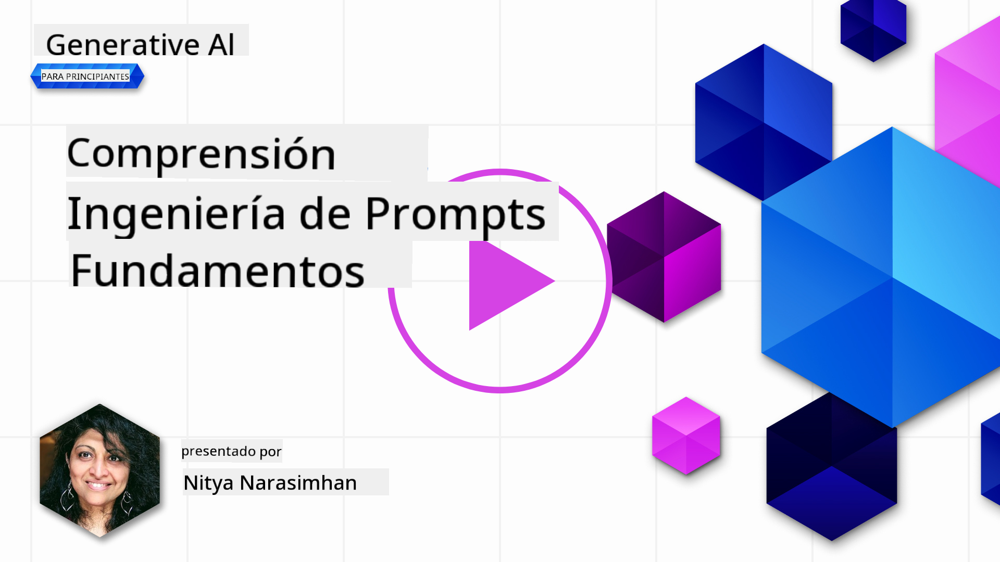
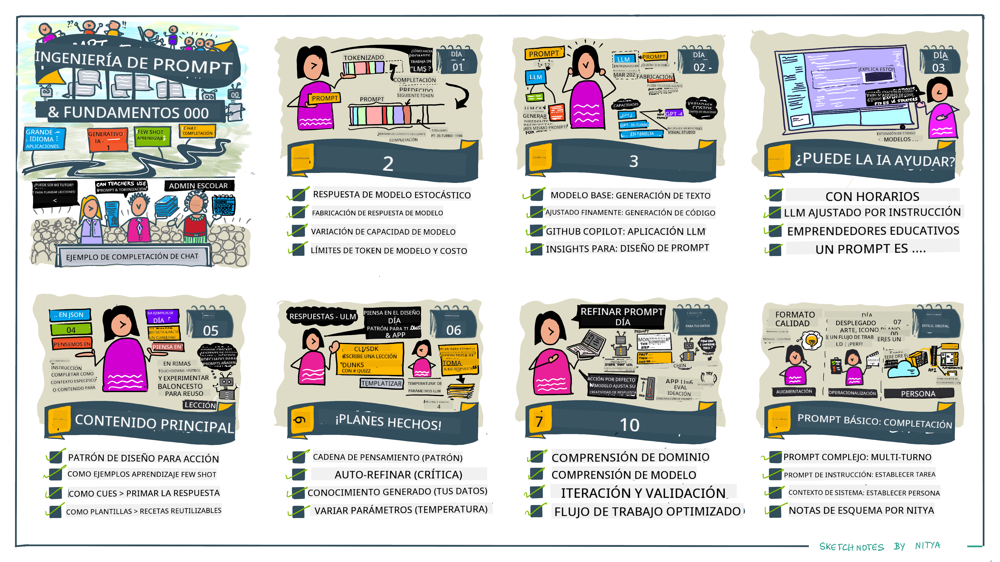

<!--
CO_OP_TRANSLATOR_METADATA:
{
  "original_hash": "dcbaaae026cb50fee071e690685b5843",
  "translation_date": "2025-08-26T13:38:28+00:00",
  "source_file": "04-prompt-engineering-fundamentals/README.md",
  "language_code": "es"
}
-->
# Fundamentos de la Ingeniería de Prompts

[](https://aka.ms/gen-ai-lesson4-gh?WT.mc_id=academic-105485-koreyst)

## Introducción
Este módulo cubre conceptos y técnicas esenciales para crear prompts efectivos en modelos generativos de IA. La forma en que escribes tu prompt para un LLM también importa. Un prompt cuidadosamente elaborado puede lograr una mejor calidad en la respuesta. Pero, ¿qué significan exactamente términos como _prompt_ e _ingeniería de prompts_? ¿Y cómo puedo mejorar el _input_ del prompt que envío al LLM? Estas son las preguntas que intentaremos responder en este capítulo y el siguiente.

La _IA generativa_ es capaz de crear contenido nuevo (por ejemplo, texto, imágenes, audio, código, etc.) en respuesta a solicitudes de los usuarios. Lo logra usando _Modelos de Lenguaje Grandes_ como la serie GPT ("Generative Pre-trained Transformer") de OpenAI, que están entrenados para usar lenguaje natural y código.

Ahora los usuarios pueden interactuar con estos modelos usando paradigmas familiares como el chat, sin necesidad de experiencia técnica ni formación previa. Los modelos son _basados en prompts_: los usuarios envían una entrada de texto (prompt) y reciben la respuesta de la IA (completion). Luego pueden "conversar con la IA" de manera iterativa, en conversaciones de varios turnos, refinando su prompt hasta que la respuesta cumpla con sus expectativas.

Los "prompts" se convierten ahora en la principal _interfaz de programación_ para aplicaciones de IA generativa, indicando a los modelos qué hacer e influyendo en la calidad de las respuestas que devuelven. La "Ingeniería de Prompts" es un campo de estudio en rápido crecimiento que se enfoca en el _diseño y optimización_ de prompts para ofrecer respuestas consistentes y de calidad a escala.

## Objetivos de Aprendizaje

En esta lección, aprenderemos qué es la Ingeniería de Prompts, por qué es importante y cómo podemos crear prompts más efectivos para un modelo y objetivo de aplicación determinado. Comprenderemos conceptos clave y buenas prácticas para la ingeniería de prompts, y conoceremos un entorno interactivo de "sandbox" en Jupyter Notebooks donde veremos estos conceptos aplicados a ejemplos reales.

Al final de esta lección seremos capaces de:

1. Explicar qué es la ingeniería de prompts y por qué es importante.
2. Describir los componentes de un prompt y cómo se utilizan.
3. Aprender buenas prácticas y técnicas para la ingeniería de prompts.
4. Aplicar las técnicas aprendidas a ejemplos reales, usando un endpoint de OpenAI.

## Términos Clave

Ingeniería de Prompts: La práctica de diseñar y perfeccionar entradas para guiar a los modelos de IA hacia la producción de resultados deseados.
Tokenización: El proceso de convertir texto en unidades más pequeñas, llamadas tokens, que un modelo puede entender y procesar.
LLMs Ajustados por Instrucción: Modelos de Lenguaje Grandes (LLMs) que han sido ajustados con instrucciones específicas para mejorar la precisión y relevancia de sus respuestas.

## Sandbox de Aprendizaje

La ingeniería de prompts es actualmente más arte que ciencia. La mejor manera de mejorar nuestra intuición es _practicar más_ y adoptar un enfoque de prueba y error que combine experiencia en el dominio de aplicación con técnicas recomendadas y optimizaciones específicas del modelo.

El Jupyter Notebook que acompaña esta lección proporciona un entorno _sandbox_ donde puedes probar lo que aprendes, ya sea mientras avanzas o como parte del reto de código al final. Para ejecutar los ejercicios, necesitarás:

1. **Una clave de API de Azure OpenAI**: el endpoint del servicio para un LLM desplegado.
2. **Un entorno de ejecución de Python**: donde se pueda ejecutar el Notebook.
3. **Variables de entorno locales**: _completa ahora los pasos de [SETUP](./../00-course-setup/02-setup-local.md?WT.mc_id=academic-105485-koreyst) para prepararte_.

El notebook incluye ejercicios _iniciales_, pero se recomienda que agregues tus propias secciones de _Markdown_ (descripción) y _Código_ (solicitudes de prompt) para probar más ejemplos o ideas, y así desarrollar tu intuición para el diseño de prompts.

## Guía Ilustrada

¿Quieres tener una visión general de lo que cubre esta lección antes de empezar? Consulta esta guía ilustrada, que te da una idea de los temas principales y los puntos clave que debes considerar en cada uno. La hoja de ruta de la lección te lleva desde la comprensión de los conceptos y desafíos principales hasta cómo abordarlos con técnicas y buenas prácticas relevantes de ingeniería de prompts. Ten en cuenta que la sección de "Técnicas Avanzadas" en esta guía se refiere a contenido que se cubre en el _próximo_ capítulo de este curso.



## Nuestra Startup

Ahora, hablemos de cómo _este tema_ se relaciona con nuestra misión de startup de [llevar innovación en IA a la educación](https://educationblog.microsoft.com/2023/06/collaborating-to-bring-ai-innovation-to-education?WT.mc_id=academic-105485-koreyst). Queremos construir aplicaciones de aprendizaje _personalizado_ impulsadas por IA, así que pensemos en cómo diferentes usuarios de nuestra aplicación podrían "diseñar" prompts:

- **Administradores** podrían pedir a la IA que _analice datos curriculares para identificar brechas en la cobertura_. La IA puede resumir los resultados o visualizarlos con código.
- **Educadores** podrían pedir a la IA que _genere un plan de lección para una audiencia y tema específicos_. La IA puede crear el plan personalizado en el formato indicado.
- **Estudiantes** podrían pedir a la IA que _les ayude con una materia difícil_. La IA puede guiar a los estudiantes con lecciones, pistas y ejemplos adaptados a su nivel.

Eso es solo la punta del iceberg. Consulta [Prompts For Education](https://github.com/microsoft/prompts-for-edu/tree/main?WT.mc_id=academic-105485-koreyst), una biblioteca de prompts de código abierto curada por expertos en educación, para tener una idea más amplia de las posibilidades. _¡Prueba algunos de esos prompts en el sandbox o usando el OpenAI Playground para ver qué sucede!_

<!--
PLANTILLA DE LECCIÓN:
Esta unidad debe cubrir el concepto clave #1.
Refuerza el concepto con ejemplos y referencias.

CONCEPTO #1:
Ingeniería de Prompts.
Defínelo y explica por qué es necesario.
-->

## ¿Qué es la Ingeniería de Prompts?

Comenzamos esta lección definiendo la **Ingeniería de Prompts** como el proceso de _diseñar y optimizar_ entradas de texto (prompts) para obtener respuestas consistentes y de calidad (completions) para un objetivo de aplicación y modelo determinado. Podemos pensar en esto como un proceso de dos pasos:

- _diseñar_ el prompt inicial para un modelo y objetivo específico
- _refinar_ el prompt de manera iterativa para mejorar la calidad de la respuesta

Este proceso requiere necesariamente prueba y error, así como intuición y esfuerzo del usuario para obtener resultados óptimos. ¿Por qué es importante? Para responder a esa pregunta, primero debemos entender tres conceptos:

- _Tokenización_: cómo el modelo "ve" el prompt
- _LLMs base_: cómo el modelo fundamental "procesa" un prompt
- _LLMs ajustados por instrucción_: cómo el modelo ahora puede ver "tareas"

### Tokenización

Un LLM ve los prompts como una _secuencia de tokens_, donde diferentes modelos (o versiones de un modelo) pueden tokenizar el mismo prompt de distintas maneras. Como los LLMs se entrenan con tokens (y no con texto crudo), la forma en que los prompts se tokenizan impacta directamente en la calidad de la respuesta generada.

Para entender cómo funciona la tokenización, prueba herramientas como el [OpenAI Tokenizer](https://platform.openai.com/tokenizer?WT.mc_id=academic-105485-koreyst) que se muestra abajo. Copia tu prompt y observa cómo se convierte en tokens, prestando atención a cómo se manejan los espacios y signos de puntuación. Ten en cuenta que este ejemplo muestra un LLM antiguo (GPT-3), así que probarlo con un modelo más nuevo puede dar un resultado diferente.


### Concepto: Modelos Fundamentales

Una vez que el prompt está tokenizado, la función principal del ["LLM Base"](https://blog.gopenai.com/an-introduction-to-base-and-instruction-tuned-large-language-models-8de102c785a6?WT.mc_id=academic-105485-koreyst) (o modelo fundamental) es predecir el siguiente token en esa secuencia. Como los LLMs se entrenan con enormes conjuntos de datos de texto, tienen una buena idea de las relaciones estadísticas entre tokens y pueden hacer esa predicción con cierta confianza. Ten en cuenta que no entienden el _significado_ de las palabras en el prompt o token; solo ven un patrón que pueden "completar" con su siguiente predicción. Pueden seguir prediciendo la secuencia hasta que el usuario intervenga o se cumpla alguna condición preestablecida.

¿Quieres ver cómo funciona la completion basada en prompts? Ingresa el prompt anterior en el [_Chat Playground_](https://oai.azure.com/playground?WT.mc_id=academic-105485-koreyst) de Azure OpenAI Studio con la configuración predeterminada. El sistema está configurado para tratar los prompts como solicitudes de información, así que deberías ver una completion que se ajusta a ese contexto.

¿Pero qué pasa si el usuario quiere ver algo específico que cumpla ciertos criterios u objetivos de tarea? Aquí es donde entran los LLMs _ajustados por instrucción_.


### Concepto: LLMs Ajustados por Instrucción

Un [LLM Ajustado por Instrucción](https://blog.gopenai.com/an-introduction-to-base-and-instruction-tuned-large-language-models-8de102c785a6?WT.mc_id=academic-105485-koreyst) parte del modelo fundamental y lo ajusta con ejemplos o pares de entrada/salida (por ejemplo, "mensajes" de varios turnos) que pueden contener instrucciones claras, y la respuesta de la IA intenta seguir esa instrucción.

Esto utiliza técnicas como el Aprendizaje por Refuerzo con Retroalimentación Humana (RLHF), que pueden entrenar al modelo para _seguir instrucciones_ y _aprender de la retroalimentación_, de modo que produzca respuestas más adecuadas para aplicaciones prácticas y más relevantes para los objetivos del usuario.

Probémoslo: vuelve al prompt anterior, pero ahora cambia el _mensaje del sistema_ para proporcionar la siguiente instrucción como contexto:

> _Resume el contenido que se te proporcione para un estudiante de segundo grado. Mantén el resultado en un párrafo con 3-5 viñetas._

¿Ves cómo el resultado ahora está ajustado para reflejar el objetivo y formato deseados? Un educador puede usar directamente esta respuesta en sus diapositivas para esa clase.


## ¿Por qué necesitamos la Ingeniería de Prompts?

Ahora que sabemos cómo los LLMs procesan los prompts, hablemos de _por qué_ necesitamos la ingeniería de prompts. La respuesta está en que los LLMs actuales presentan varios desafíos que hacen que lograr _completions confiables y consistentes_ sea más difícil si no se pone esfuerzo en la construcción y optimización del prompt. Por ejemplo:

1. **Las respuestas del modelo son estocásticas.** El _mismo prompt_ probablemente producirá respuestas diferentes con distintos modelos o versiones de modelo. Incluso puede dar resultados distintos con el _mismo modelo_ en diferentes momentos. _Las técnicas de ingeniería de prompts pueden ayudarnos a minimizar estas variaciones proporcionando mejores límites_.

1. **Los modelos pueden inventar respuestas.** Los modelos están pre-entrenados con conjuntos de datos _grandes pero finitos_, lo que significa que no tienen conocimiento sobre conceptos fuera de ese alcance. Como resultado, pueden generar completions que son inexactas, imaginarias o directamente contradictorias con hechos conocidos. _Las técnicas de ingeniería de prompts ayudan a los usuarios a identificar y mitigar estas invenciones, por ejemplo, pidiendo a la IA citas o razonamientos_.

1. **Las capacidades de los modelos varían.** Los modelos más nuevos o generaciones de modelos tendrán capacidades más avanzadas, pero también traerán peculiaridades y compensaciones en costo y complejidad. _La ingeniería de prompts puede ayudarnos a desarrollar buenas prácticas y flujos de trabajo que abstraigan las diferencias y se adapten a requisitos específicos de cada modelo de manera escalable y fluida_.

Veamos esto en acción en el OpenAI o Azure OpenAI Playground:

- Usa el mismo prompt con diferentes despliegues de LLM (por ejemplo, OpenAI, Azure OpenAI, Hugging Face): ¿viste las variaciones?
- Usa el mismo prompt varias veces con el _mismo_ despliegue de LLM (por ejemplo, Azure OpenAI playground): ¿cómo variaron los resultados?

### Ejemplo de Fabricaciones

En este curso, usamos el término **"fabricación"** para referirnos al fenómeno en el que los LLMs a veces generan información incorrecta debido a limitaciones en su entrenamiento u otras restricciones. Quizás también hayas escuchado esto como _"alucinaciones"_ en artículos populares o investigaciones. Sin embargo, recomendamos usar _"fabricación"_ como término para no atribuir accidentalmente un rasgo humano a un resultado generado por una máquina. Esto también refuerza las [guías de IA Responsable](https://www.microsoft.com/ai/responsible-ai?WT.mc_id=academic-105485-koreyst) desde una perspectiva de terminología, eliminando términos que pueden considerarse ofensivos o poco inclusivos en algunos contextos.

¿Quieres ver cómo funcionan las fabricaciones? Piensa en un prompt que instruya a la IA a generar contenido sobre un tema inexistente (para asegurarte de que no esté en el conjunto de entrenamiento). Por ejemplo, probé este prompt:
# Plan de lección: La Guerra Marciana de 2076

## Objetivos de aprendizaje

- Comprender las causas y consecuencias de la Guerra Marciana de 2076.
- Analizar los principales eventos y figuras involucradas en el conflicto.
- Evaluar el impacto de la guerra en la sociedad marciana y terrestre.
- Desarrollar habilidades de pensamiento crítico a través de debates y actividades escritas.

## Introducción

La Guerra Marciana de 2076 fue un conflicto decisivo entre las colonias humanas en Marte y las fuerzas terrestres. Este evento cambió el curso de la historia interplanetaria y tuvo profundas repercusiones políticas, sociales y tecnológicas.

## Actividades

### 1. Discusión inicial

- Pregunta a los estudiantes: ¿Por qué crees que surgió un conflicto entre Marte y la Tierra?
- Haz una lluvia de ideas sobre posibles causas, como recursos, independencia y diferencias culturales.

### 2. Línea de tiempo de la guerra

- Divide a los estudiantes en grupos y asigna a cada uno una fase de la guerra (inicio, desarrollo, desenlace).
- Cada grupo debe investigar y presentar los eventos clave de su fase.

### 3. Análisis de personajes

- Elige figuras importantes como la comandante Li Wei o el diplomático Samuel Ortiz.
- Los estudiantes investigan sus roles y motivaciones, y presentan sus hallazgos al resto de la clase.

### 4. Debate

- Organiza un debate sobre si la independencia marciana era justificable.
- Asigna a los estudiantes diferentes perspectivas (marcianos, terrestres, observadores neutrales).

### 5. Reflexión escrita

- Pide a los estudiantes que escriban un ensayo breve sobre cómo la guerra afectó la relación entre Marte y la Tierra.

## Recursos

- Artículos históricos sobre la Guerra Marciana de 2076.
- Documentales y entrevistas con sobrevivientes y expertos.
- Mapas interactivos de los territorios marcianos y terrestres.

## Evaluación

- Participación en discusiones y debates.
- Presentaciones grupales sobre la línea de tiempo y personajes.
- Ensayo reflexivo individual.

## Comentarios adicionales

- Adapta las actividades según el nivel de los estudiantes.
- Fomenta el respeto por diferentes puntos de vista durante los debates.
- Utiliza recursos multimedia para enriquecer la experiencia de aprendizaje.
Una búsqueda en la web me mostró que existen relatos ficticios (por ejemplo, series de televisión o libros) sobre guerras marcianas, pero ninguno en 2076. El sentido común también nos dice que 2076 está _en el futuro_ y, por lo tanto, no puede asociarse a un evento real.

¿Entonces qué ocurre cuando probamos este prompt con diferentes proveedores de LLM?

> **Respuesta 1**: OpenAI Playground (GPT-35)


> **Respuesta 2**: Azure OpenAI Playground (GPT-35)


> **Respuesta 3**: : Hugging Face Chat Playground (LLama-2)


Como era de esperarse, cada modelo (o versión de modelo) genera respuestas ligeramente diferentes gracias al comportamiento estocástico y las variaciones en sus capacidades. Por ejemplo, un modelo apunta a una audiencia de octavo grado mientras que otro asume un estudiante de secundaria. Pero los tres modelos generaron respuestas que podrían convencer a un usuario desinformado de que el evento fue real.

Técnicas de ingeniería de prompts como _metaprompting_ y la _configuración de temperatura_ pueden reducir las invenciones del modelo hasta cierto punto. Nuevas _arquitecturas_ de ingeniería de prompts también incorporan herramientas y técnicas novedosas en el flujo del prompt, para mitigar o reducir algunos de estos efectos.

## Caso de estudio: GitHub Copilot

Cerremos esta sección viendo cómo se usa la ingeniería de prompts en soluciones reales, con un caso de estudio: [GitHub Copilot](https://github.com/features/copilot?WT.mc_id=academic-105485-koreyst).

GitHub Copilot es tu "programador asistente por IA": convierte prompts de texto en sugerencias de código y se integra en tu entorno de desarrollo (por ejemplo, Visual Studio Code) para una experiencia fluida. Como se documenta en la serie de blogs a continuación, la primera versión se basaba en el modelo OpenAI Codex, y los ingenieros rápidamente notaron la necesidad de ajustar el modelo y desarrollar mejores técnicas de ingeniería de prompts para mejorar la calidad del código. En julio, [presentaron un modelo de IA mejorado que va más allá de Codex](https://github.blog/2023-07-28-smarter-more-efficient-coding-github-copilot-goes-beyond-codex-with-improved-ai-model/?WT.mc_id=academic-105485-koreyst) para sugerencias aún más rápidas.

Lee las publicaciones en orden para seguir su proceso de aprendizaje.

- **Mayo 2023** | [GitHub Copilot está mejorando en la comprensión de tu código](https://github.blog/2023-05-17-how-github-copilot-is-getting-better-at-understanding-your-code/?WT.mc_id=academic-105485-koreyst)
- **Mayo 2023** | [Dentro de GitHub: Trabajando con los LLM detrás de GitHub Copilot](https://github.blog/2023-05-17-inside-github-working-with-the-llms-behind-github-copilot/?WT.mc_id=academic-105485-koreyst).
- **Jun 2023** | [Cómo escribir mejores prompts para GitHub Copilot](https://github.blog/2023-06-20-how-to-write-better-prompts-for-github-copilot/?WT.mc_id=academic-105485-koreyst).
- **Jul 2023** | [.. GitHub Copilot va más allá de Codex con un modelo de IA mejorado](https://github.blog/2023-07-28-smarter-more-efficient-coding-github-copilot-goes-beyond-codex-with-improved-ai-model/?WT.mc_id=academic-105485-koreyst)
- **Jul 2023** | [Guía para desarrolladores sobre ingeniería de prompts y LLMs](https://github.blog/2023-07-17-prompt-engineering-guide-generative-ai-llms/?WT.mc_id=academic-105485-koreyst)
- **Sep 2023** | [Cómo crear una app empresarial con LLM: Lecciones de GitHub Copilot](https://github.blog/2023-09-06-how-to-build-an-enterprise-llm-application-lessons-from-github-copilot/?WT.mc_id=academic-105485-koreyst)

También puedes explorar su [blog de ingeniería](https://github.blog/category/engineering/?WT.mc_id=academic-105485-koreyst) para más publicaciones como [esta](https://github.blog/2023-09-27-how-i-used-github-copilot-chat-to-build-a-reactjs-gallery-prototype/?WT.mc_id=academic-105485-koreyst) que muestra cómo estos modelos y técnicas se _aplican_ para impulsar aplicaciones reales.

---

<!--
PLANTILLA DE LECCIÓN:
Esta unidad debe cubrir el concepto clave #2.
Refuerza el concepto con ejemplos y referencias.

CONCEPTO #2:
Diseño de prompts.
Ilustrado con ejemplos.
-->

## Construcción de prompts

Ya vimos por qué la ingeniería de prompts es importante; ahora vamos a entender cómo se _construyen_ los prompts para poder evaluar diferentes técnicas y lograr un diseño más efectivo.

### Prompt básico

Comencemos con el prompt básico: una entrada de texto enviada al modelo sin ningún contexto adicional. Por ejemplo, cuando enviamos las primeras palabras del himno nacional de EE. UU. a la [API de Completion de OpenAI](https://platform.openai.com/docs/api-reference/completions?WT.mc_id=academic-105485-koreyst), el modelo _completa_ la respuesta con las siguientes líneas, mostrando el comportamiento básico de predicción.

| Prompt (Entrada)     | Completion (Salida)                                                                                                                        |
| :------------------- | :----------------------------------------------------------------------------------------------------------------------------------------- |
| Oh say can you see   | Parece que estás comenzando la letra de "The Star-Spangled Banner", el himno nacional de Estados Unidos. La letra completa es ...          |

### Prompt complejo

Ahora agreguemos contexto e instrucciones a ese prompt básico. La [API de Chat Completion](https://learn.microsoft.com/azure/ai-services/openai/how-to/chatgpt?WT.mc_id=academic-105485-koreyst) nos permite construir un prompt complejo como una colección de _mensajes_ con:

- Pares de entrada/salida que reflejan la entrada del _usuario_ y la respuesta del _asistente_.
- Un mensaje de sistema que establece el contexto para el comportamiento o personalidad del asistente.

La solicitud ahora tiene la forma que se muestra abajo, donde la _tokenización_ captura la información relevante del contexto y la conversación. Cambiar el contexto del sistema puede impactar tanto en la calidad de las respuestas como las entradas del usuario.

```python
response = openai.chat.completions.create(
    model="gpt-3.5-turbo",
    messages=[
        {"role": "system", "content": "You are a helpful assistant."},
        {"role": "user", "content": "Who won the world series in 2020?"},
        {"role": "assistant", "content": "The Los Angeles Dodgers won the World Series in 2020."},
        {"role": "user", "content": "Where was it played?"}
    ]
)
```

### Prompt de instrucción

En los ejemplos anteriores, el prompt del usuario era una consulta de texto simple que puede interpretarse como una solicitud de información. Con los prompts de _instrucción_, podemos usar ese texto para especificar una tarea con más detalle, dando mejor orientación a la IA. Aquí tienes un ejemplo:

| Prompt (Entrada)                                                                                                                                                                                                                         | Completion (Salida)                                                                                                        | Tipo de instrucción |
| :--------------------------------------------------------------------------------------------------------------------------------------------------------------------------------------------------------------------------------------- | :------------------------------------------------------------------------------------------------------------------------- | :------------------ |
| Escribe una descripción de la Guerra Civil                                                                                                                                                                                               | _devuelve un párrafo sencillo_                                                                                             | Simple              |
| Escribe una descripción de la Guerra Civil. Proporciona fechas y eventos clave y describe su importancia                                                                                                                                | _devuelve un párrafo seguido de una lista de fechas clave con descripciones_                                               | Compleja            |
| Escribe una descripción de la Guerra Civil en 1 párrafo. Proporciona 3 viñetas con fechas clave y su importancia. Proporciona 3 viñetas más con figuras históricas y sus contribuciones. Devuelve la salida como un archivo JSON           | _devuelve detalles más extensos en un cuadro de texto, formateado como JSON que puedes copiar y validar según sea necesario_ | Compleja. Formateada|

## Contenido principal

En los ejemplos anteriores, el prompt seguía siendo bastante abierto, permitiendo que el LLM decidiera qué parte de su conjunto de datos preentrenado era relevante. Con el patrón de diseño de _contenido principal_, el texto de entrada se divide en dos partes:

- una instrucción (acción)
- contenido relevante (que influye en la acción)

Aquí tienes un ejemplo donde la instrucción es "resume esto en 2 oraciones".

| Prompt (Entrada)                                                                                                                                                                                                                                                                                                                                                                                                                                                                                                                                                                                                                                                                                      | Completion (Salida)                                                                                                                                                                                                                                                                             |
| :------------------------------------------------------------------------------------------------------------------------------------------------------------------------------------------------------------------------------------------------------------------------------------------------------------------------------------------------------------------------------------------------------------------------------------------------------------------------------------------------------------------------------------------------------------------------------------------------------------------------------------------------------------------------------------------------------ | :---------------------------------------------------------------------------------------------------------------------------------------------------------------------------------------------------------------------------------------------------------------------------------------------- |
| Júpiter es el quinto planeta desde el Sol y el más grande del Sistema Solar. Es un gigante gaseoso con una masa equivalente a una milésima parte del Sol, pero dos veces y media la de todos los demás planetas juntos. Júpiter es uno de los objetos más brillantes que se pueden ver a simple vista en el cielo nocturno, y ha sido conocido por civilizaciones antiguas desde antes de la historia registrada. Su nombre proviene del dios romano Júpiter.[19] Visto desde la Tierra, Júpiter puede ser tan brillante que su luz reflejada proyecta sombras visibles,[20] y en promedio es el tercer objeto natural más brillante en el cielo nocturno después de la Luna y Venus. <br/> **Resume esto en 2 oraciones cortas** | Júpiter, el quinto planeta desde el Sol, es el más grande del Sistema Solar y es conocido por ser uno de los objetos más brillantes en el cielo nocturno. Nombrado en honor al dios romano Júpiter, es un gigante gaseoso cuya masa es dos veces y media la de todos los demás planetas juntos. |

El segmento de contenido principal se puede usar de varias formas para lograr instrucciones más efectivas:

- **Ejemplos**: en vez de decirle al modelo qué hacer con una instrucción explícita, dale ejemplos de lo que debe hacer y deja que infiera el patrón.
- **Cues (señales)**: sigue la instrucción con una "señal" que prepara la respuesta, guiando al modelo hacia respuestas más relevantes.
- **Plantillas**: son 'recetas' repetibles para prompts con espacios reservados (variables) que se pueden personalizar con datos para casos de uso específicos.

Veamos cómo funcionan en la práctica.

### Uso de ejemplos

Este enfoque consiste en usar el contenido principal para "alimentar al modelo" con ejemplos del resultado deseado para una instrucción dada, y dejar que infiera el patrón para la salida esperada. Según la cantidad de ejemplos, podemos tener prompting zero-shot, one-shot, few-shot, etc.

El prompt ahora tiene tres componentes:

- Una descripción de la tarea
- Algunos ejemplos del resultado deseado
- El inicio de un nuevo ejemplo (que se convierte en una descripción de tarea implícita)

| Tipo de aprendizaje | Prompt (Entrada)                                                                                                                                        | Completion (Salida)         |
| :------------------ | :------------------------------------------------------------------------------------------------------------------------------------------------------ | :-------------------------- |
| Zero-shot           | "The Sun is Shining". Translate to Spanish                                                                                                              | "El Sol está brillando".    |
| One-shot            | "The Sun is Shining" => ""El Sol está brillando". <br> "It's a Cold and Windy Day" =>                                                                   | "Es un día frío y ventoso". |
| Few-shot            | The player ran the bases => Baseball <br/> The player hit an ace => Tennis <br/> The player hit a six => Cricket <br/> The player made a slam-dunk =>   | Basketball                  |
|                     |                                                                                                                                                         |                             |

Observa cómo tuvimos que dar una instrucción explícita ("Translate to Spanish") en el prompting zero-shot, pero se infiere en el ejemplo one-shot. El ejemplo few-shot muestra cómo al agregar más ejemplos, los modelos pueden hacer inferencias más precisas sin instrucciones adicionales.

### Señales en el prompt (Prompt Cues)

Otra técnica para usar el contenido principal es dar _señales_ en vez de ejemplos. En este caso, le damos al modelo un empujón en la dirección correcta _comenzando_ con un fragmento que refleja el formato de respuesta deseado. El modelo entonces "toma la señal" y continúa en ese estilo.

| Número de señales | Prompt (Entrada)                                                                                                                                                                                                                                                                                                                                                                                                                                               | Completion (Salida)                                                                                                                                                                                                                                                                                       |
| :---------------- | :-------------------------------------------------------------------------------------------------------------------------------------------------------------------------------------------------------------------------------------------------------------------------------------------------------------------------------------------------------------------------------------------------------------------------------------------------------------- | :-------------------------------------------------------------------------------------------------------------------------------------------------------------------------------------------------------------------------------------------------------------------------------------------------------- |
| 0                 | Júpiter es el quinto planeta desde el Sol y el más grande del Sistema Solar. Es un gigante gaseoso con una masa equivalente a una milésima parte del Sol, pero dos veces y media la de todos los demás planetas juntos. Júpiter es uno de los objetos más brillantes que se pueden ver a simple vista en el cielo nocturno, y ha sido conocido por civilizaciones antiguas desde antes de la historia registrada.

**Resumir esto**                                       | Júpiter es el planeta más grande de nuestro Sistema Solar y el quinto desde el Sol. Es un gigante gaseoso con una masa equivalente a 1/1000 de la del Sol, pero es más pesado que todos los demás planetas juntos. Las civilizaciones antiguas han conocido Júpiter desde hace mucho tiempo, y es fácilmente visible en el cielo nocturno. |
| 1              | Júpiter es el quinto planeta desde el Sol y el más grande del Sistema Solar. Es un gigante gaseoso con una masa equivalente a una milésima parte de la del Sol, pero dos veces y media la de todos los demás planetas del Sistema Solar juntos. Júpiter es uno de los objetos más brillantes que se pueden ver a simple vista en el cielo nocturno, y ha sido conocido por las civilizaciones antiguas desde antes de la historia registrada. <br/>**Resumir esto** <br/> Lo que aprendimos es que Júpiter | es el quinto planeta desde el Sol y el más grande del Sistema Solar. Es un gigante gaseoso con una masa equivalente a una milésima parte de la del Sol, pero dos veces y media la de todos los demás planetas juntos. Es fácilmente visible a simple vista y se conoce desde la antigüedad.                        |
| 2              | Júpiter es el quinto planeta desde el Sol y el más grande del Sistema Solar. Es un gigante gaseoso con una masa equivalente a una milésima parte de la del Sol, pero dos veces y media la de todos los demás planetas del Sistema Solar juntos. Júpiter es uno de los objetos más brillantes que se pueden ver a simple vista en el cielo nocturno, y ha sido conocido por las civilizaciones antiguas desde antes de la historia registrada. <br/>**Resumir esto** <br/> Las 3 principales cosas que aprendimos:         | 1. Júpiter es el quinto planeta desde el Sol y el más grande del Sistema Solar. <br/> 2. Es un gigante gaseoso con una masa equivalente a una milésima parte de la del Sol...<br/> 3. Júpiter ha sido visible a simple vista desde la antigüedad ...                                                                       |
|                |                                                                                                                                                                                                                                                                                                                                                                                                                                                              |                                                                                                                                                                                                                                                                                                           |

### Plantillas de prompts

Una plantilla de prompt es una _receta predefinida para un prompt_ que se puede guardar y reutilizar según sea necesario, para lograr experiencias de usuario más consistentes a gran escala. En su forma más simple, es simplemente una colección de ejemplos de prompts como [este de OpenAI](https://platform.openai.com/examples?WT.mc_id=academic-105485-koreyst) que proporciona tanto los componentes interactivos del prompt (mensajes de usuario y sistema) como el formato de solicitud para la API, facilitando la reutilización.

En su forma más compleja, como [este ejemplo de LangChain](https://python.langchain.com/docs/concepts/prompt_templates/?WT.mc_id=academic-105485-koreyst), contiene _espacios reservados_ que pueden ser reemplazados con datos de diversas fuentes (entrada del usuario, contexto del sistema, fuentes de datos externas, etc.) para generar un prompt de manera dinámica. Esto nos permite crear una biblioteca de prompts reutilizables que pueden usarse para ofrecer experiencias de usuario consistentes **de forma programática** a gran escala.

Finalmente, el verdadero valor de las plantillas está en la capacidad de crear y publicar _bibliotecas de prompts_ para dominios de aplicación verticales, donde la plantilla de prompt ahora está _optimizada_ para reflejar el contexto o ejemplos específicos de la aplicación, haciendo que las respuestas sean más relevantes y precisas para el público objetivo. El repositorio [Prompts For Edu](https://github.com/microsoft/prompts-for-edu?WT.mc_id=academic-105485-koreyst) es un gran ejemplo de este enfoque, ya que recopila una biblioteca de prompts para el ámbito educativo con énfasis en objetivos clave como la planificación de clases, el diseño curricular, la tutoría de estudiantes, etc.

## Contenido de apoyo

Si pensamos en la construcción de prompts como tener una instrucción (tarea) y un objetivo (contenido principal), entonces el _contenido secundario_ es como contexto adicional que proporcionamos para **influir en la salida de alguna manera**. Puede ser parámetros de ajuste, instrucciones de formato, taxonomías de temas, etc., que ayudan al modelo a _adaptar_ su respuesta para que se ajuste a los objetivos o expectativas del usuario.

Por ejemplo: Dado un catálogo de cursos con metadatos extensos (nombre, descripción, nivel, etiquetas de metadatos, instructor, etc.) sobre todos los cursos disponibles en el currículo:

- podemos definir una instrucción para "resumir el catálogo de cursos para otoño 2023"
- podemos usar el contenido principal para dar algunos ejemplos del resultado deseado
- podemos usar el contenido secundario para identificar las 5 principales "etiquetas" de interés.

Ahora, el modelo puede proporcionar un resumen en el formato mostrado por los ejemplos, pero si un resultado tiene varias etiquetas, puede priorizar las 5 identificadas en el contenido secundario.

---

<!--
PLANTILLA DE LECCIÓN:
Esta unidad debe cubrir el concepto clave #1.
Refuerza el concepto con ejemplos y referencias.

CONCEPTO #3:
Técnicas de ingeniería de prompts.
¿Cuáles son algunas técnicas básicas para la ingeniería de prompts?
Ilústralo con algunos ejercicios.
-->

## Mejores prácticas para crear prompts

Ahora que sabemos cómo se pueden _construir_ los prompts, podemos empezar a pensar en cómo _diseñarlos_ para reflejar las mejores prácticas. Podemos pensar en esto en dos partes: tener la _mentalidad_ adecuada y aplicar las _técnicas_ correctas.

### Mentalidad para la ingeniería de prompts

La ingeniería de prompts es un proceso de prueba y error, así que ten en cuenta tres factores generales:

1. **Entender el dominio es importante.** La precisión y relevancia de la respuesta depende del _dominio_ en el que opera la aplicación o el usuario. Aplica tu intuición y experiencia en el dominio para **personalizar las técnicas** aún más. Por ejemplo, define _personalidades específicas del dominio_ en tus prompts de sistema, o usa _plantillas específicas del dominio_ en tus prompts de usuario. Proporciona contenido secundario que refleje contextos propios del dominio, o utiliza _pistas y ejemplos específicos del dominio_ para guiar al modelo hacia patrones de uso familiares.

2. **Entender el modelo es importante.** Sabemos que los modelos son estocásticos por naturaleza. Pero las implementaciones de los modelos también pueden variar en cuanto al conjunto de datos de entrenamiento que usan (conocimiento preentrenado), las capacidades que ofrecen (por ejemplo, vía API o SDK) y el tipo de contenido para el que están optimizados (por ejemplo, código, imágenes o texto). Comprende las fortalezas y limitaciones del modelo que estás usando, y utiliza ese conocimiento para _priorizar tareas_ o construir _plantillas personalizadas_ optimizadas para las capacidades del modelo.

3. **Iterar y validar es importante.** Los modelos evolucionan rápidamente, y también las técnicas para la ingeniería de prompts. Como experto en el dominio, puedes tener otro contexto o criterios para _tu_ aplicación específica, que quizás no apliquen a la comunidad en general. Usa herramientas y técnicas de ingeniería de prompts para "dar el primer paso" en la construcción de prompts, luego itera y valida los resultados usando tu propia intuición y experiencia. Registra tus ideas y crea una **base de conocimiento** (por ejemplo, bibliotecas de prompts) que otros puedan usar como nuevo punto de partida para iteraciones más rápidas en el futuro.

## Mejores prácticas

Ahora veamos algunas prácticas recomendadas por [OpenAI](https://help.openai.com/en/articles/6654000-best-practices-for-prompt-engineering-with-openai-api?WT.mc_id=academic-105485-koreyst) y por profesionales de [Azure OpenAI](https://learn.microsoft.com/azure/ai-services/openai/concepts/prompt-engineering#best-practices?WT.mc_id=academic-105485-koreyst).

| Qué                              | Por qué                                                                                                                                                                                                                                               |
| :-------------------------------- | :------------------------------------------------------------------------------------------------------------------------------------------------------------------------------------------------------------------------------------------------ |
| Evalúa los modelos más recientes.       | Las nuevas generaciones de modelos probablemente tengan mejores características y calidad, pero también pueden tener costos más altos. Evalúalos para ver su impacto y luego decide si migrar.                                                                                |
| Separa instrucciones y contexto   | Verifica si tu modelo/proveedor define _delimitadores_ para distinguir instrucciones, contenido principal y secundario de forma más clara. Esto puede ayudar a los modelos a asignar pesos más precisos a los tokens.                                                         |
| Sé específico y claro             | Da más detalles sobre el contexto deseado, el resultado, la longitud, el formato, el estilo, etc. Esto mejorará tanto la calidad como la consistencia de las respuestas. Captura recetas en plantillas reutilizables.                                                          |
| Sé descriptivo, usa ejemplos      | Los modelos pueden responder mejor a un enfoque de "mostrar y contar". Comienza con un enfoque `zero-shot` donde das una instrucción (pero sin ejemplos) y luego prueba `few-shot` como refinamiento, proporcionando algunos ejemplos del resultado deseado. Usa analogías. |
| Usa pistas para iniciar respuestas | Guía al modelo hacia el resultado deseado dándole algunas palabras o frases iniciales que pueda usar como punto de partida para la respuesta.                                                                                                               |
| Repite instrucciones                       | A veces puede ser necesario repetir la instrucción al modelo. Da instrucciones antes y después del contenido principal, usa una instrucción y una pista, etc. Itera y valida para ver qué funciona mejor.                                                         |
| El orden importa                     | El orden en que presentas la información al modelo puede afectar la salida, incluso en los ejemplos de aprendizaje, debido al sesgo de recencia. Prueba diferentes opciones para ver cuál funciona mejor.                                                               |
| Da al modelo una “salida”           | Proporciona al modelo una respuesta de _respaldo_ que pueda dar si no puede completar la tarea por alguna razón. Esto puede reducir la probabilidad de que el modelo genere respuestas falsas o inventadas.                                                         |
|                                   |                                                                                                                                                                                                                                                   |

Como con cualquier buena práctica, recuerda que _puede variar según el modelo, la tarea y el dominio_. Úsalas como punto de partida y prueba para encontrar lo que mejor se adapte a ti. Revisa constantemente tu proceso de ingeniería de prompts a medida que surgen nuevos modelos y herramientas, enfocándote en la escalabilidad del proceso y la calidad de las respuestas.

<!--
PLANTILLA DE LECCIÓN:
Esta unidad debe incluir un reto de código si aplica

RETO:
Enlaza a un Jupyter Notebook con solo los comentarios en las instrucciones (las secciones de código están vacías).

SOLUCIÓN:
Enlaza a una copia de ese Notebook con los prompts llenados y ejecutados, mostrando un ejemplo de resultado.
-->

## Ejercicio

¡Felicidades! ¡Llegaste al final de la lección! Es momento de poner a prueba algunos de estos conceptos y técnicas con ejemplos reales.

Para el ejercicio, usaremos un Jupyter Notebook con actividades que puedes completar de forma interactiva. También puedes ampliar el Notebook con tus propias celdas de Markdown y código para explorar ideas y técnicas por tu cuenta.

### Para comenzar, haz un fork al repositorio, luego

- (Recomendado) Lanza GitHub Codespaces
- (Alternativamente) Clona el repositorio en tu dispositivo local y úsalo con Docker Desktop
- (Alternativamente) Abre el Notebook con tu entorno de ejecución favorito.

### Después, configura tus variables de entorno

- Copia el archivo `.env.copy` en la raíz del repositorio a `.env` y completa los valores de `AZURE_OPENAI_API_KEY`, `AZURE_OPENAI_ENDPOINT` y `AZURE_OPENAI_DEPLOYMENT`. Vuelve a la [sección Learning Sandbox](../../../04-prompt-engineering-fundamentals/04-prompt-engineering-fundamentals) para aprender cómo hacerlo.

### Luego, abre el Jupyter Notebook

- Selecciona el kernel de ejecución. Si usas las opciones 1 o 2, simplemente selecciona el kernel Python 3.10.x por defecto que ofrece el contenedor de desarrollo.

Ya estás listo para ejecutar los ejercicios. Ten en cuenta que aquí no hay _respuestas correctas o incorrectas_, solo se trata de explorar opciones por prueba y error y construir intuición sobre lo que funciona para un modelo y dominio de aplicación determinado.

_Por eso no hay segmentos de Solución de Código en esta lección. En su lugar, el Notebook tendrá celdas de Markdown tituladas "Mi solución:" que muestran un ejemplo de resultado para referencia._

 <!--
PLANTILLA DE LECCIÓN:
Cierra la sección con un resumen y recursos para autoaprendizaje.
-->

## Comprobación de conocimientos

¿Cuál de los siguientes es un buen prompt siguiendo algunas prácticas recomendadas?

1. Muéstrame una imagen de un auto rojo
2. Muéstrame una imagen de un auto rojo de la marca Volvo y modelo XC90 estacionado junto a un acantilado con el sol poniéndose
3. Muéstrame una imagen de un auto rojo de la marca Volvo y modelo XC90

A: 2, es el mejor prompt porque da detalles sobre "qué" y es específico (no cualquier auto, sino una marca y modelo concretos) y además describe el entorno general. El 3 es el siguiente mejor, ya que también contiene mucha descripción.

## 🚀 Reto

Intenta usar la técnica de "pista" con el prompt: Completa la frase "Muéstrame una imagen de un auto rojo de la marca Volvo y ". ¿Con qué responde el modelo y cómo lo mejorarías?

## ¡Buen trabajo! Continúa aprendiendo

¿Quieres aprender más sobre diferentes conceptos de ingeniería de prompts? Ve a la [página de aprendizaje continuo](https://aka.ms/genai-collection?WT.mc_id=academic-105485-koreyst) para encontrar otros recursos útiles sobre este tema.

¡Dirígete a la Lección 5 donde veremos [técnicas avanzadas de prompts](../05-advanced-prompts/README.md?WT.mc_id=academic-105485-koreyst)!

---

**Descargo de responsabilidad**:  
Este documento ha sido traducido utilizando el servicio de traducción automática [Co-op Translator](https://github.com/Azure/co-op-translator). Aunque nos esforzamos por lograr precisión, tenga en cuenta que las traducciones automáticas pueden contener errores o inexactitudes. El documento original en su idioma nativo debe considerarse la fuente autorizada. Para información crítica, se recomienda la traducción profesional realizada por humanos. No nos hacemos responsables de cualquier malentendido o interpretación incorrecta que surja del uso de esta traducción.