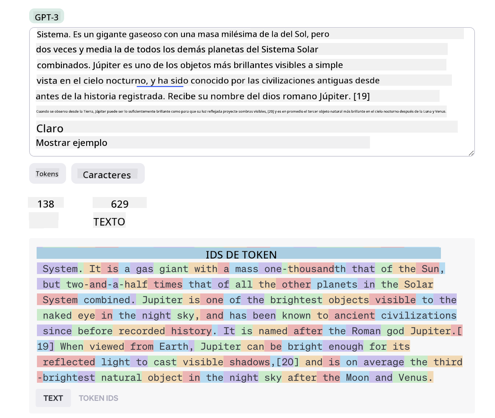
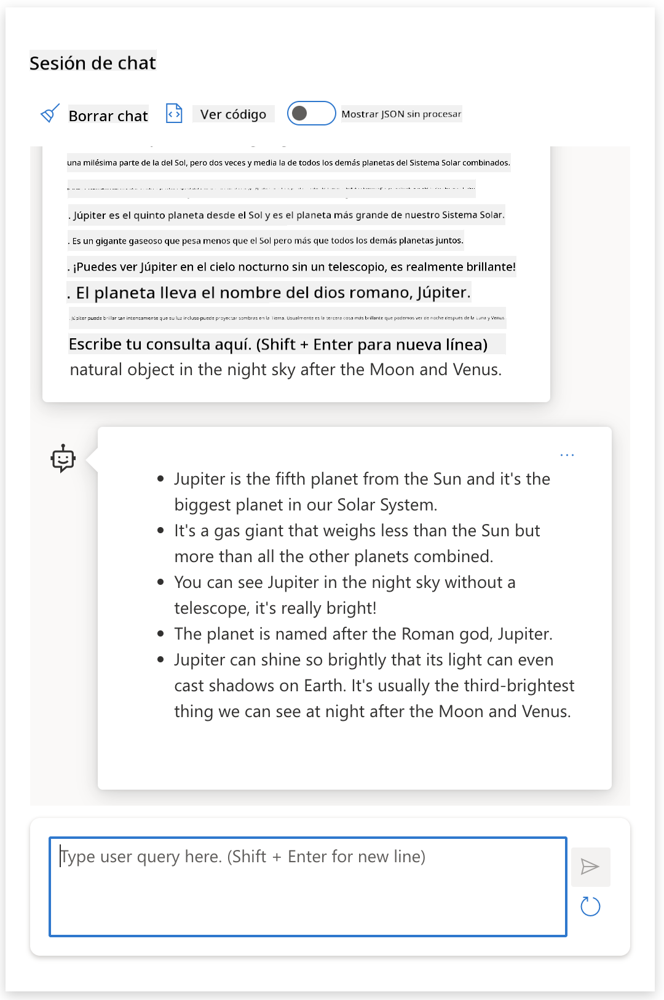

<!--
CO_OP_TRANSLATOR_METADATA:
{
  "original_hash": "a45c318dc6ebc2604f35b8b829f93af2",
  "translation_date": "2025-07-09T09:13:07+00:00",
  "source_file": "04-prompt-engineering-fundamentals/README.md",
  "language_code": "es"
}
-->
# Fundamentos de la Ingeniería de Prompts

[](https://aka.ms/gen-ai-lesson4-gh?WT.mc_id=academic-105485-koreyst)

## Introducción
Este módulo cubre conceptos y técnicas esenciales para crear prompts efectivos en modelos generativos de IA. La forma en que redactas tu prompt para un LLM también importa. Un prompt cuidadosamente elaborado puede lograr una mejor calidad de respuesta. Pero, ¿qué significan exactamente términos como _prompt_ e _ingeniería de prompts_? ¿Y cómo puedo mejorar el _input_ del prompt que envío al LLM? Estas son las preguntas que intentaremos responder en este capítulo y el siguiente.

La _IA generativa_ es capaz de crear contenido nuevo (por ejemplo, texto, imágenes, audio, código, etc.) en respuesta a solicitudes de los usuarios. Lo logra usando _Modelos de Lenguaje a Gran Escala_ como la serie GPT de OpenAI ("Generative Pre-trained Transformer") que están entrenados para usar lenguaje natural y código.

Los usuarios ahora pueden interactuar con estos modelos usando paradigmas familiares como el chat, sin necesidad de conocimientos técnicos o entrenamiento. Los modelos son _basados en prompts_: los usuarios envían un texto (prompt) y reciben la respuesta de la IA (completado). Luego pueden "chatear con la IA" de forma iterativa, en conversaciones de varios turnos, refinando su prompt hasta que la respuesta cumpla con sus expectativas.

Los "prompts" se convierten ahora en la principal _interfaz de programación_ para aplicaciones de IA generativa, indicando a los modelos qué hacer e influyendo en la calidad de las respuestas devueltas. La "Ingeniería de Prompts" es un campo de estudio en rápido crecimiento que se enfoca en el _diseño y optimización_ de prompts para ofrecer respuestas consistentes y de calidad a gran escala.

## Objetivos de Aprendizaje

En esta lección, aprenderemos qué es la Ingeniería de Prompts, por qué es importante y cómo podemos crear prompts más efectivos para un modelo y objetivo de aplicación dados. Entenderemos conceptos clave y mejores prácticas para la ingeniería de prompts, y conoceremos un entorno interactivo de Jupyter Notebooks "sandbox" donde podremos ver estos conceptos aplicados a ejemplos reales.

Al final de esta lección seremos capaces de:

1. Explicar qué es la ingeniería de prompts y por qué es importante.
2. Describir los componentes de un prompt y cómo se usan.
3. Aprender mejores prácticas y técnicas para la ingeniería de prompts.
4. Aplicar las técnicas aprendidas a ejemplos reales, usando un endpoint de OpenAI.

## Términos Clave

Ingeniería de Prompts: La práctica de diseñar y refinar entradas para guiar a los modelos de IA hacia la producción de salidas deseadas.  
Tokenización: El proceso de convertir texto en unidades más pequeñas, llamadas tokens, que un modelo puede entender y procesar.  
LLMs Ajustados por Instrucciones: Modelos de Lenguaje a Gran Escala (LLMs) que han sido afinados con instrucciones específicas para mejorar la precisión y relevancia de sus respuestas.

## Entorno de Práctica

La ingeniería de prompts es actualmente más un arte que una ciencia. La mejor manera de mejorar nuestra intuición es _practicar más_ y adoptar un enfoque de prueba y error que combine experiencia en el dominio de aplicación con técnicas recomendadas y optimizaciones específicas del modelo.

El Jupyter Notebook que acompaña esta lección proporciona un entorno _sandbox_ donde puedes probar lo que aprendes, ya sea sobre la marcha o como parte del desafío de código al final. Para ejecutar los ejercicios, necesitarás:

1. **Una clave API de Azure OpenAI** - el endpoint del servicio para un LLM desplegado.  
2. **Un entorno de ejecución Python** - donde se pueda ejecutar el Notebook.  
3. **Variables de entorno locales** - _completa los pasos de [SETUP](./../00-course-setup/SETUP.md?WT.mc_id=academic-105485-koreyst) ahora para estar listo_.

El notebook incluye ejercicios _iniciales_, pero se te anima a añadir tus propias secciones de _Markdown_ (descripción) y _Código_ (solicitudes de prompt) para probar más ejemplos o ideas y desarrollar tu intuición para el diseño de prompts.

## Guía Ilustrada

¿Quieres tener una visión general de lo que cubre esta lección antes de profundizar? Consulta esta guía ilustrada, que te da una idea de los temas principales y los puntos clave para reflexionar en cada uno. La hoja de ruta de la lección te lleva desde entender los conceptos y desafíos centrales hasta abordarlos con técnicas relevantes de ingeniería de prompts y mejores prácticas. Ten en cuenta que la sección "Técnicas Avanzadas" en esta guía se refiere al contenido cubierto en el _siguiente_ capítulo de este currículo.


## Nuestra Startup

Ahora, hablemos de cómo _este tema_ se relaciona con la misión de nuestra startup de [llevar la innovación en IA a la educación](https://educationblog.microsoft.com/2023/06/collaborating-to-bring-ai-innovation-to-education?WT.mc_id=academic-105485-koreyst). Queremos construir aplicaciones de IA para un _aprendizaje personalizado_, así que pensemos en cómo diferentes usuarios de nuestra aplicación podrían "diseñar" prompts:

- **Administradores** podrían pedir a la IA que _analice datos curriculares para identificar brechas en la cobertura_. La IA puede resumir resultados o visualizarlos con código.  
- **Educadores** podrían pedir a la IA que _genere un plan de lección para un público y tema específicos_. La IA puede construir el plan personalizado en un formato especificado.  
- **Estudiantes** podrían pedir a la IA que _los tutorice en una materia difícil_. La IA puede guiar a los estudiantes con lecciones, pistas y ejemplos adaptados a su nivel.

Eso es solo la punta del iceberg. Consulta [Prompts For Education](https://github.com/microsoft/prompts-for-edu/tree/main?WT.mc_id=academic-105485-koreyst) — una biblioteca de prompts de código abierto curada por expertos en educación — para tener una idea más amplia de las posibilidades. _¡Prueba ejecutar algunos de esos prompts en el sandbox o usando el OpenAI Playground para ver qué sucede!_

<!--
PLANTILLA DE LA LECCIÓN:
Esta unidad debe cubrir el concepto central #1.
Refuerza el concepto con ejemplos y referencias.

CONCEPTO #1:
Ingeniería de Prompts.
Defínelo y explica por qué es necesario.
-->

## ¿Qué es la Ingeniería de Prompts?

Comenzamos esta lección definiendo la **Ingeniería de Prompts** como el proceso de _diseñar y optimizar_ entradas de texto (prompts) para entregar respuestas consistentes y de calidad (completados) para un objetivo de aplicación y modelo dados. Podemos pensar en esto como un proceso de 2 pasos:

- _diseñar_ el prompt inicial para un modelo y objetivo dados  
- _refinar_ el prompt de forma iterativa para mejorar la calidad de la respuesta

Este es necesariamente un proceso de prueba y error que requiere intuición y esfuerzo del usuario para obtener resultados óptimos. Entonces, ¿por qué es importante? Para responder a esa pregunta, primero necesitamos entender tres conceptos:

- _Tokenización_ = cómo el modelo "ve" el prompt  
- _LLMs Base_ = cómo el modelo base "procesa" un prompt  
- _LLMs Ajustados por Instrucciones_ = cómo el modelo ahora puede "entender tareas"

### Tokenización

Un LLM ve los prompts como una _secuencia de tokens_ donde diferentes modelos (o versiones de un modelo) pueden tokenizar el mismo prompt de distintas maneras. Dado que los LLMs se entrenan con tokens (y no con texto en bruto), la forma en que se tokenizan los prompts tiene un impacto directo en la calidad de la respuesta generada.

Para tener una intuición de cómo funciona la tokenización, prueba herramientas como el [OpenAI Tokenizer](https://platform.openai.com/tokenizer?WT.mc_id=academic-105485-koreyst) que se muestra a continuación. Copia tu prompt y observa cómo se convierte en tokens, prestando atención a cómo se manejan los espacios en blanco y los signos de puntuación. Ten en cuenta que este ejemplo muestra un LLM más antiguo (GPT-3), por lo que probarlo con un modelo más nuevo puede producir un resultado diferente.



### Concepto: Modelos Base

Una vez que un prompt está tokenizado, la función principal del ["LLM Base"](https://blog.gopenai.com/an-introduction-to-base-and-instruction-tuned-large-language-models-8de102c785a6?WT.mc_id=academic-105485-koreyst) (o modelo base) es predecir el siguiente token en esa secuencia. Dado que los LLMs se entrenan con enormes conjuntos de datos de texto, tienen un buen sentido de las relaciones estadísticas entre tokens y pueden hacer esa predicción con cierta confianza. Ten en cuenta que no entienden el _significado_ de las palabras en el prompt o token; solo ven un patrón que pueden "completar" con su siguiente predicción. Pueden continuar prediciendo la secuencia hasta que el usuario intervenga o se cumpla alguna condición preestablecida.

¿Quieres ver cómo funciona el completado basado en prompts? Ingresa el prompt anterior en el [_Chat Playground_](https://oai.azure.com/playground?WT.mc_id=academic-105485-koreyst) de Azure OpenAI con la configuración predeterminada. El sistema está configurado para tratar los prompts como solicitudes de información, por lo que deberías ver un completado que satisfaga este contexto.

Pero, ¿qué pasa si el usuario quiere ver algo específico que cumpla ciertos criterios u objetivos de tarea? Aquí es donde entran en juego los LLMs _ajustados por instrucciones_.


### Concepto: LLMs Ajustados por Instrucciones

Un [LLM Ajustado por Instrucciones](https://blog.gopenai.com/an-introduction-to-base-and-instruction-tuned-large-language-models-8de102c785a6?WT.mc_id=academic-105485-koreyst) parte del modelo base y lo afina con ejemplos o pares entrada/salida (por ejemplo, "mensajes" de varios turnos) que pueden contener instrucciones claras, y la respuesta de la IA intenta seguir esa instrucción.

Esto utiliza técnicas como el Aprendizaje por Refuerzo con Retroalimentación Humana (RLHF) que pueden entrenar al modelo para _seguir instrucciones_ y _aprender de la retroalimentación_, de modo que produzca respuestas mejor adaptadas a aplicaciones prácticas y más relevantes para los objetivos del usuario.

Probémoslo: vuelve al prompt anterior, pero ahora cambia el _mensaje del sistema_ para proporcionar la siguiente instrucción como contexto:

> _Resume el contenido que se te proporciona para un estudiante de segundo grado. Mantén el resultado en un párrafo con 3-5 puntos clave._

¿Ves cómo el resultado ahora está ajustado para reflejar el objetivo y formato deseados? Un educador puede usar directamente esta respuesta en sus diapositivas para esa clase.



## ¿Por qué necesitamos la Ingeniería de Prompts?

Ahora que sabemos cómo los LLMs procesan los prompts, hablemos de _por qué_ necesitamos la ingeniería de prompts. La respuesta radica en que los LLMs actuales presentan varios desafíos que hacen que sea más difícil lograr _completados confiables y consistentes_ sin dedicar esfuerzo a la construcción y optimización del prompt. Por ejemplo:

1. **Las respuestas del modelo son estocásticas.** El _mismo prompt_ probablemente producirá respuestas diferentes con distintos modelos o versiones del modelo. E incluso puede producir resultados distintos con el _mismo modelo_ en diferentes momentos. _Las técnicas de ingeniería de prompts pueden ayudarnos a minimizar estas variaciones proporcionando mejores límites_.

1. **Los modelos pueden inventar respuestas.** Los modelos están preentrenados con conjuntos de datos _grandes pero finitos_, lo que significa que carecen de conocimiento sobre conceptos fuera de ese alcance de entrenamiento. Como resultado, pueden generar completados inexactos, imaginarios o directamente contradictorios con hechos conocidos. _Las técnicas de ingeniería de prompts ayudan a los usuarios a identificar y mitigar estas invenciones, por ejemplo, pidiendo a la IA citas o razonamientos_.

1. **Las capacidades de los modelos varían.** Los modelos más nuevos o generaciones de modelos tendrán capacidades más ricas, pero también traerán peculiaridades y compensaciones únicas en costo y complejidad. _La ingeniería de prompts puede ayudarnos a desarrollar mejores prácticas y flujos de trabajo que abstraigan las diferencias y se adapten a los requisitos específicos del modelo de manera escalable y fluida_.

Veamos esto en acción en el Playground de OpenAI o Azure OpenAI:

- Usa el mismo prompt con diferentes despliegues de LLM (por ejemplo, OpenAI, Azure OpenAI, Hugging Face) — ¿viste las variaciones?  
- Usa el mismo prompt repetidamente con el _mismo_ despliegue de LLM (por ejemplo, Azure OpenAI playground) — ¿cómo difirieron estas variaciones?

### Ejemplo de Invenciones

En este curso, usamos el término **"invención"** para referirnos al fenómeno donde los LLMs a veces generan información factualmente incorrecta debido a limitaciones en su entrenamiento u otras restricciones. También puedes haber escuchado este fenómeno referido como _"alucinaciones"_ en artículos populares o trabajos de investigación. Sin embargo, recomendamos enfáticamente usar _"invención"_ como término para no antropomorfizar accidentalmente el comportamiento atribuyéndole un rasgo humano a un resultado generado por máquina. Esto también refuerza las [directrices de IA Responsable](https://www.microsoft.com/ai/responsible-ai?WT.mc_id=academic-105485-koreyst) desde una perspectiva terminológica, eliminando términos que pueden considerarse ofensivos o no inclusivos en algunos contextos.

¿Quieres tener una idea de cómo funcionan las invenciones? Piensa en un prompt que instruya a la IA a generar contenido sobre un tema inexistente (para asegurarte de que no esté en el conjunto de datos de entrenamiento). Por ejemplo, probé este prompt:
# Plan de lección: La Guerra Marciana de 2076

## Objetivos de aprendizaje
- Comprender las causas principales de la Guerra Marciana de 2076.
- Analizar los eventos clave y las estrategias utilizadas durante el conflicto.
- Evaluar las consecuencias políticas, sociales y tecnológicas de la guerra.
- Fomentar el pensamiento crítico sobre la interacción entre humanos y colonias espaciales.

## Materiales necesarios
- Línea de tiempo interactiva de la Guerra Marciana de 2076.
- Mapas de las colonias marcianas y bases terrestres.
- Documentos y testimonios de la época.
- Videos y simulaciones de batallas importantes.

## Duración
2 horas

## Estructura de la lección

### Introducción (15 minutos)
- Presentar un resumen general del contexto histórico y político previo a la guerra.
- Explicar brevemente la importancia de Marte como colonia humana en el siglo XXI.

### Desarrollo (1 hora 20 minutos)
- **Causas del conflicto**  
  Discutir las tensiones económicas, políticas y sociales que llevaron a la guerra.
  
- **Eventos clave**  
  Analizar las principales batallas y movimientos estratégicos, incluyendo la Batalla de Valles Marineris y la ofensiva terrestre en Olympus Mons.
  
- **Tecnología y armamento**  
  Explorar las innovaciones tecnológicas utilizadas durante la guerra, como los drones autónomos y los escudos de plasma.
  
- **Impacto y consecuencias**  
  Debatir las repercusiones a largo plazo en la política interplanetaria y en la sociedad marciana.

### Actividad práctica (20 minutos)
- Dividir a los estudiantes en grupos para que diseñen una estrategia de paz basada en lo aprendido.
- Presentar y discutir las propuestas de cada grupo.

### Cierre (5 minutos)
- Resumen de los puntos clave.
- Preguntas y respuestas para aclarar dudas.

## Evaluación
- Participación en la discusión y actividad grupal.
- Breve ensayo sobre las lecciones aprendidas de la Guerra Marciana de 2076.

## Recursos adicionales
- Enlaces a archivos históricos y bases de datos sobre la guerra.
- Documentales recomendados y artículos científicos recientes.
Una búsqueda en la web me mostró que existen relatos ficticios (por ejemplo, series de televisión o libros) sobre guerras en Marte, pero ninguno en 2076. El sentido común también nos dice que 2076 está _en el futuro_ y, por lo tanto, no puede estar asociado a un evento real.

Entonces, ¿qué sucede cuando ejecutamos este prompt con diferentes proveedores de LLM?

> **Respuesta 1**: OpenAI Playground (GPT-35)


> **Respuesta 2**: Azure OpenAI Playground (GPT-35)


> **Respuesta 3**: : Hugging Face Chat Playground (LLama-2)


Como era de esperar, cada modelo (o versión del modelo) produce respuestas ligeramente diferentes gracias al comportamiento estocástico y a las variaciones en la capacidad del modelo. Por ejemplo, un modelo se dirige a una audiencia de octavo grado mientras que otro asume un estudiante de secundaria. Pero los tres modelos generaron respuestas que podrían convencer a un usuario no informado de que el evento fue real.

Técnicas de ingeniería de prompts como el _metaprompting_ y la _configuración de temperatura_ pueden reducir en cierta medida las fabricaciones del modelo. Nuevas _arquitecturas_ de ingeniería de prompts también incorporan herramientas y técnicas nuevas de forma fluida en el flujo del prompt, para mitigar o reducir algunos de estos efectos.

## Estudio de Caso: GitHub Copilot

Cerremos esta sección con una idea de cómo se usa la ingeniería de prompts en soluciones del mundo real, viendo un Estudio de Caso: [GitHub Copilot](https://github.com/features/copilot?WT.mc_id=academic-105485-koreyst).

GitHub Copilot es tu "Programador en Pareja con IA": convierte prompts de texto en completaciones de código y está integrado en tu entorno de desarrollo (por ejemplo, Visual Studio Code) para una experiencia de usuario fluida. Como se documenta en la serie de blogs a continuación, la versión más temprana se basó en el modelo OpenAI Codex, con ingenieros que rápidamente se dieron cuenta de la necesidad de afinar el modelo y desarrollar mejores técnicas de ingeniería de prompts para mejorar la calidad del código. En julio, [presentaron un modelo de IA mejorado que va más allá de Codex](https://github.blog/2023-07-28-smarter-more-efficient-coding-github-copilot-goes-beyond-codex-with-improved-ai-model/?WT.mc_id=academic-105485-koreyst) para sugerencias aún más rápidas.

Lee las publicaciones en orden para seguir su proceso de aprendizaje.

- **Mayo 2023** | [GitHub Copilot está mejorando en la comprensión de tu código](https://github.blog/2023-05-17-how-github-copilot-is-getting-better-at-understanding-your-code/?WT.mc_id=academic-105485-koreyst)
- **Mayo 2023** | [Dentro de GitHub: Trabajando con los LLM detrás de GitHub Copilot](https://github.blog/2023-05-17-inside-github-working-with-the-llms-behind-github-copilot/?WT.mc_id=academic-105485-koreyst)
- **Junio 2023** | [Cómo escribir mejores prompts para GitHub Copilot](https://github.blog/2023-06-20-how-to-write-better-prompts-for-github-copilot/?WT.mc_id=academic-105485-koreyst)
- **Julio 2023** | [.. GitHub Copilot va más allá de Codex con un modelo de IA mejorado](https://github.blog/2023-07-28-smarter-more-efficient-coding-github-copilot-goes-beyond-codex-with-improved-ai-model/?WT.mc_id=academic-105485-koreyst)
- **Julio 2023** | [Guía para desarrolladores sobre ingeniería de prompts y LLMs](https://github.blog/2023-07-17-prompt-engineering-guide-generative-ai-llms/?WT.mc_id=academic-105485-koreyst)
- **Septiembre 2023** | [Cómo construir una aplicación empresarial con LLM: Lecciones de GitHub Copilot](https://github.blog/2023-09-06-how-to-build-an-enterprise-llm-application-lessons-from-github-copilot/?WT.mc_id=academic-105485-koreyst)

También puedes explorar su [blog de Ingeniería](https://github.blog/category/engineering/?WT.mc_id=academic-105485-koreyst) para más publicaciones como [esta](https://github.blog/2023-09-27-how-i-used-github-copilot-chat-to-build-a-reactjs-gallery-prototype/?WT.mc_id=academic-105485-koreyst) que muestra cómo estos modelos y técnicas se _aplican_ para impulsar aplicaciones del mundo real.

---

<!--
PLANTILLA DE LECCIÓN:
Esta unidad debe cubrir el concepto central #2.
Reforzar el concepto con ejemplos y referencias.

CONCEPTO #2:
Diseño de Prompts.
Ilustrado con ejemplos.
-->

## Construcción de Prompts

Hemos visto por qué la ingeniería de prompts es importante; ahora entendamos cómo se _construyen_ los prompts para poder evaluar diferentes técnicas que permitan un diseño de prompts más efectivo.

### Prompt Básico

Comencemos con el prompt básico: una entrada de texto enviada al modelo sin otro contexto. Aquí hay un ejemplo: cuando enviamos las primeras palabras del himno nacional de EE. UU. a la OpenAI [Completion API](https://platform.openai.com/docs/api-reference/completions?WT.mc_id=academic-105485-koreyst), esta _completa_ instantáneamente la respuesta con las siguientes líneas, ilustrando el comportamiento básico de predicción.

| Prompt (Entrada)     | Completion (Salida)                                                                                                                        |
| :----------------- | :----------------------------------------------------------------------------------------------------------------------------------------- |
| Oh say can you see | Parece que estás comenzando la letra de "The Star-Spangled Banner", el himno nacional de Estados Unidos. La letra completa es ... |

### Prompt Complejo

Ahora añadamos contexto e instrucciones a ese prompt básico. La [Chat Completion API](https://learn.microsoft.com/azure/ai-services/openai/how-to/chatgpt?WT.mc_id=academic-105485-koreyst) nos permite construir un prompt complejo como una colección de _mensajes_ con:

- Pares de entrada/salida que reflejan la entrada del _usuario_ y la respuesta del _asistente_.
- Mensaje del sistema que establece el contexto para el comportamiento o personalidad del asistente.

La solicitud ahora tiene la forma que se muestra a continuación, donde la _tokenización_ captura efectivamente la información relevante del contexto y la conversación. Cambiar el contexto del sistema puede ser tan impactante en la calidad de las completaciones como las entradas del usuario proporcionadas.

```python
response = openai.chat.completions.create(
    model="gpt-3.5-turbo",
    messages=[
        {"role": "system", "content": "You are a helpful assistant."},
        {"role": "user", "content": "Who won the world series in 2020?"},
        {"role": "assistant", "content": "The Los Angeles Dodgers won the World Series in 2020."},
        {"role": "user", "content": "Where was it played?"}
    ]
)
```

### Prompt de Instrucción

En los ejemplos anteriores, el prompt del usuario era una consulta de texto simple que puede interpretarse como una solicitud de información. Con los prompts de _instrucción_, podemos usar ese texto para especificar una tarea con más detalle, proporcionando una mejor guía a la IA. Aquí un ejemplo:

| Prompt (Entrada)                                                                                                                                                                                                                         | Completion (Salida)                                                                                                        | Tipo de Instrucción |
| :------------------------------------------------------------------------------------------------------------------------------------------------------------------------------------------------------------------------------------- | :------------------------------------------------------------------------------------------------------------------------- | :------------------ |
| Write a description of the Civil War                                                                                                                                                                                                   | _devuelve un párrafo simple_                                                                                              | Simple              |
| Write a description of the Civil War. Provide key dates and events and describe their significance                                                                                                                                     | _devuelve un párrafo seguido de una lista de fechas clave con descripciones_                                              | Complejo            |
| Write a description of the Civil War in 1 paragraph. Provide 3 bullet points with key dates and their significance. Provide 3 more bullet points with key historical figures and their contributions. Return the output as a JSON file | _devuelve detalles más extensos en un cuadro de texto, formateado como JSON que puedes copiar y pegar en un archivo y validar según sea necesario_ | Complejo. Formateado.|

## Contenido Primario

En los ejemplos anteriores, el prompt seguía siendo bastante abierto, permitiendo que el LLM decidiera qué parte de su conjunto de datos preentrenado era relevante. Con el patrón de diseño de _contenido primario_, el texto de entrada se divide en dos partes:

- una instrucción (acción)
- contenido relevante (que influye en la acción)

Aquí un ejemplo donde la instrucción es "resume esto en 2 oraciones".

| Prompt (Entrada)                                                                                                                                                                                                                                                                                                                                                                                                                                                                                                                                                                                                                                                                                      | Completion (Salida)                                                                                                                                                                                                                                                                             |
| :-------------------------------------------------------------------------------------------------------------------------------------------------------------------------------------------------------------------------------------------------------------------------------------------------------------------------------------------------------------------------------------------------------------------------------------------------------------------------------------------------------------------------------------------------------------------------------------------------------------------------------------------------------------------------------------------------- | :---------------------------------------------------------------------------------------------------------------------------------------------------------------------------------------------------------------------------------------------------------------------------------------------- |
| Jupiter is the fifth planet from the Sun and the largest in the Solar System. It is a gas giant with a mass one-thousandth that of the Sun, but two-and-a-half times that of all the other planets in the Solar System combined. Jupiter is one of the brightest objects visible to the naked eye in the night sky, and has been known to ancient civilizations since before recorded history. It is named after the Roman god Jupiter.[19] When viewed from Earth, Jupiter can be bright enough for its reflected light to cast visible shadows,[20] and is on average the third-brightest natural object in the night sky after the Moon and Venus. <br/> **Summarize this in 2 short sentences** | Júpiter, el quinto planeta desde el Sol, es el más grande del Sistema Solar y es conocido por ser uno de los objetos más brillantes en el cielo nocturno. Nombrado en honor al dios romano Júpiter, es un gigante gaseoso cuya masa es dos veces y media la de todos los demás planetas del Sistema Solar juntos. |

El segmento de contenido primario puede usarse de varias maneras para impulsar instrucciones más efectivas:

- **Ejemplos** - en lugar de decirle al modelo qué hacer con una instrucción explícita, dale ejemplos de qué hacer y deja que infiera el patrón.
- **Señales** - sigue la instrucción con una "señal" que prepare la completación, guiando al modelo hacia respuestas más relevantes.
- **Plantillas** - son 'recetas' repetibles para prompts con marcadores de posición (variables) que pueden personalizarse con datos para casos de uso específicos.

Exploremos estas opciones en acción.

### Uso de Ejemplos

Este es un enfoque donde usas el contenido primario para "alimentar al modelo" con algunos ejemplos del resultado deseado para una instrucción dada, y dejar que infiera el patrón para el resultado esperado. Según la cantidad de ejemplos proporcionados, podemos tener prompting zero-shot, one-shot, few-shot, etc.

El prompt ahora consta de tres componentes:

- Una descripción de la tarea
- Algunos ejemplos del resultado deseado
- El inicio de un nuevo ejemplo (que se convierte en una descripción implícita de la tarea)

| Tipo de Aprendizaje | Prompt (Entrada)                                                                                                                                        | Completion (Salida)         |
| :------------------ | :---------------------------------------------------------------------------------------------------------------------------------------------------- | :-------------------------- |
| Zero-shot           | "The Sun is Shining". Translate to Spanish                                                                                                            | "El Sol está brillando".    |
| One-shot            | "The Sun is Shining" => ""El Sol está brillando". <br> "It's a Cold and Windy Day" =>                                                                 | "Es un día frío y ventoso". |
| Few-shot            | The player ran the bases => Baseball <br/> The player hit an ace => Tennis <br/> The player hit a six => Cricket <br/> The player made a slam-dunk => | Basketball                  |
|                     |                                                                                                                                                       |                             |

Fíjate cómo tuvimos que proporcionar una instrucción explícita ("Translate to Spanish") en el prompting zero-shot, pero esta se infiere en el ejemplo one-shot. El ejemplo few-shot muestra cómo agregar más ejemplos permite a los modelos hacer inferencias más precisas sin instrucciones adicionales.

### Señales en el Prompt

Otra técnica para usar contenido primario es proporcionar _señales_ en lugar de ejemplos. En este caso, le damos al modelo un empujón en la dirección correcta _comenzando_ con un fragmento que refleja el formato de respuesta deseado. El modelo entonces "toma la señal" para continuar en esa línea.

| Número de Señales | Prompt (Entrada)                                                                                                                                                                                                                                                                                                                                                                                                                                               | Completion (Salida)                                                                                                                                                                                                                                                                                       |
| :---------------- | :----------------------------------------------------------------------------------------------------------------------------------------------------------------------------------------------------------------------------------------------------------------------------------------------------------------------------------------------------------------------------------------------------------------------------------------------------------- | :-------------------------------------------------------------------------------------------------------------------------------------------------------------------------------------------------------------------------------------------------------------------------------------------------------- |
| 0                 | Jupiter is the fifth planet from the Sun and the largest in the Solar System. It is a gas giant with a mass one-thousandth that of the Sun, but two-and-a-half times that of all the other planets in the Solar System combined. Jupiter is one of the brightest objects visible to the naked eye in the night sky, and has been known to ancient civilizations since before recorded history.

**Resumir Esto**                                       | Júpiter es el planeta más grande de nuestro Sistema Solar y el quinto desde el Sol. Es un gigante gaseoso con una masa equivalente a 1/1000 de la del Sol, pero es más pesado que todos los demás planetas juntos. Las civilizaciones antiguas han conocido Júpiter desde hace mucho tiempo, y es fácilmente visible en el cielo nocturno. |
| 1              | Júpiter es el quinto planeta desde el Sol y el más grande del Sistema Solar. Es un gigante gaseoso con una masa equivalente a una milésima parte de la del Sol, pero dos veces y media la de todos los demás planetas del Sistema Solar juntos. Júpiter es uno de los objetos más brillantes visibles a simple vista en el cielo nocturno, y ha sido conocido por civilizaciones antiguas desde antes de la historia registrada. <br/>**Resumir Esto** <br/> Lo que aprendimos es que Júpiter | es el quinto planeta desde el Sol y el más grande del Sistema Solar. Es un gigante gaseoso con una masa equivalente a una milésima parte de la del Sol, pero dos veces y media la de todos los demás planetas juntos. Es fácilmente visible a simple vista y se conoce desde tiempos antiguos.                        |
| 2              | Júpiter es el quinto planeta desde el Sol y el más grande del Sistema Solar. Es un gigante gaseoso con una masa equivalente a una milésima parte de la del Sol, pero dos veces y media la de todos los demás planetas del Sistema Solar juntos. Júpiter es uno de los objetos más brillantes visibles a simple vista en el cielo nocturno, y ha sido conocido por civilizaciones antiguas desde antes de la historia registrada. <br/>**Resumir Esto** <br/> Las 3 principales cosas que aprendimos:         | 1. Júpiter es el quinto planeta desde el Sol y el más grande del Sistema Solar. <br/> 2. Es un gigante gaseoso con una masa equivalente a una milésima parte de la del Sol...<br/> 3. Júpiter ha sido visible a simple vista desde tiempos antiguos ...                                                                       |
|                |                                                                                                                                                                                                                                                                                                                                                                                                                                                              |                                                                                                                                                                                                                                                                                                           |

### Plantillas de Prompt

Una plantilla de prompt es una _receta predefinida para un prompt_ que puede almacenarse y reutilizarse según sea necesario, para ofrecer experiencias de usuario más consistentes a gran escala. En su forma más simple, es simplemente una colección de ejemplos de prompt como [este de OpenAI](https://platform.openai.com/examples?WT.mc_id=academic-105485-koreyst) que proporciona tanto los componentes interactivos del prompt (mensajes de usuario y sistema) como el formato de solicitud impulsado por API, para facilitar su reutilización.

En su forma más compleja, como [este ejemplo de LangChain](https://python.langchain.com/docs/concepts/prompt_templates/?WT.mc_id=academic-105485-koreyst), contiene _marcadores de posición_ que pueden reemplazarse con datos de diversas fuentes (entrada del usuario, contexto del sistema, fuentes externas, etc.) para generar un prompt de forma dinámica. Esto nos permite crear una biblioteca de prompts reutilizables que pueden usarse para ofrecer experiencias de usuario consistentes **de forma programática** a gran escala.

Finalmente, el verdadero valor de las plantillas radica en la capacidad de crear y publicar _bibliotecas de prompts_ para dominios de aplicación verticales, donde la plantilla de prompt está _optimizadas_ para reflejar contextos o ejemplos específicos de la aplicación que hacen que las respuestas sean más relevantes y precisas para el público objetivo. El repositorio [Prompts For Edu](https://github.com/microsoft/prompts-for-edu?WT.mc_id=academic-105485-koreyst) es un gran ejemplo de este enfoque, reuniendo una biblioteca de prompts para el ámbito educativo con énfasis en objetivos clave como planificación de lecciones, diseño curricular, tutoría estudiantil, etc.

## Contenido de Apoyo

Si pensamos en la construcción de un prompt como tener una instrucción (tarea) y un objetivo (contenido principal), entonces el _contenido secundario_ es como un contexto adicional que proporcionamos para **influir en la salida de alguna manera**. Puede ser parámetros de ajuste, instrucciones de formato, taxonomías de temas, etc., que ayudan al modelo a _adaptar_ su respuesta para ajustarse a los objetivos o expectativas del usuario.

Por ejemplo: Dado un catálogo de cursos con metadatos extensos (nombre, descripción, nivel, etiquetas, instructor, etc.) de todos los cursos disponibles en el plan de estudios:

- podemos definir una instrucción para "resumir el catálogo de cursos para otoño 2023"
- podemos usar el contenido principal para proporcionar algunos ejemplos del resultado deseado
- podemos usar el contenido secundario para identificar las 5 etiquetas principales de interés.

Ahora, el modelo puede proporcionar un resumen en el formato mostrado por los ejemplos, pero si un resultado tiene múltiples etiquetas, puede priorizar las 5 etiquetas identificadas en el contenido secundario.

---

<!--
PLANTILLA DE LECCIÓN:
Esta unidad debe cubrir el concepto principal #1.
Refuerza el concepto con ejemplos y referencias.

CONCEPTO #3:
Técnicas de Ingeniería de Prompts.
¿Cuáles son algunas técnicas básicas para la ingeniería de prompts?
Ilústralo con algunos ejercicios.
-->

## Buenas Prácticas para Prompts

Ahora que sabemos cómo se pueden _construir_ los prompts, podemos empezar a pensar en cómo _diseñarlos_ para reflejar las mejores prácticas. Podemos verlo en dos partes: tener la _mentalidad_ adecuada y aplicar las _técnicas_ correctas.

### Mentalidad para Ingeniería de Prompts

La ingeniería de prompts es un proceso de prueba y error, así que ten en cuenta tres factores generales:

1. **Importa el Conocimiento del Dominio.** La precisión y relevancia de la respuesta dependen del _dominio_ en el que opera la aplicación o el usuario. Aplica tu intuición y experiencia en el dominio para **personalizar las técnicas**. Por ejemplo, define _personalidades específicas del dominio_ en tus prompts de sistema, o usa _plantillas específicas del dominio_ en los prompts de usuario. Proporciona contenido secundario que refleje contextos específicos del dominio, o usa _señales y ejemplos específicos del dominio_ para guiar al modelo hacia patrones de uso familiares.

2. **Importa el Conocimiento del Modelo.** Sabemos que los modelos son estocásticos por naturaleza. Pero las implementaciones del modelo también pueden variar según el conjunto de datos de entrenamiento que usan (conocimiento preentrenado), las capacidades que ofrecen (por ejemplo, vía API o SDK) y el tipo de contenido para el que están optimizados (por ejemplo, código vs imágenes vs texto). Entiende las fortalezas y limitaciones del modelo que usas, y usa ese conocimiento para _priorizar tareas_ o construir _plantillas personalizadas_ optimizadas para las capacidades del modelo.

3. **Importa la Iteración y Validación.** Los modelos evolucionan rápidamente, al igual que las técnicas para ingeniería de prompts. Como experto en el dominio, puedes tener otro contexto o criterios para _tu_ aplicación específica, que no se aplican a la comunidad en general. Usa herramientas y técnicas de ingeniería de prompts para "arrancar" la construcción del prompt, luego itera y valida los resultados usando tu propia intuición y experiencia. Registra tus hallazgos y crea una **base de conocimiento** (por ejemplo, bibliotecas de prompts) que otros puedan usar como referencia para acelerar futuras iteraciones.

## Buenas Prácticas

Veamos ahora algunas buenas prácticas comunes recomendadas por los profesionales de [OpenAI](https://help.openai.com/en/articles/6654000-best-practices-for-prompt-engineering-with-openai-api?WT.mc_id=academic-105485-koreyst) y [Azure OpenAI](https://learn.microsoft.com/azure/ai-services/openai/concepts/prompt-engineering#best-practices?WT.mc_id=academic-105485-koreyst).

| Qué                              | Por qué                                                                                                                                                                                                                                               |
| :-------------------------------- | :------------------------------------------------------------------------------------------------------------------------------------------------------------------------------------------------------------------------------------------------ |
| Evalúa los modelos más recientes.       | Las nuevas generaciones de modelos probablemente tienen mejores características y calidad, pero también pueden implicar costos más altos. Evalúalos para medir su impacto y luego decide si migrar.                                                                                |
| Separa instrucciones y contexto   | Verifica si tu modelo/proveedor define _delimitadores_ para distinguir claramente instrucciones, contenido principal y secundario. Esto ayuda a que los modelos asignen pesos más precisos a los tokens.                                                         |
| Sé específico y claro             | Proporciona más detalles sobre el contexto deseado, resultado, longitud, formato, estilo, etc. Esto mejora tanto la calidad como la consistencia de las respuestas. Captura las recetas en plantillas reutilizables.                                                          |
| Sé descriptivo, usa ejemplos      | Los modelos pueden responder mejor con un enfoque de "mostrar y contar". Comienza con un enfoque `zero-shot` donde das una instrucción (pero sin ejemplos) y luego prueba `few-shot` como refinamiento, proporcionando algunos ejemplos del resultado deseado. Usa analogías. |
| Usa señales para iniciar respuestas | Impúlsalo hacia un resultado deseado dándole algunas palabras o frases iniciales que pueda usar como punto de partida para la respuesta.                                                                                                               |
| Repite cuando sea necesario       | A veces es necesario repetir instrucciones al modelo. Da instrucciones antes y después del contenido principal, usa una instrucción y una señal, etc. Itera y valida para ver qué funciona mejor.                                                         |
| El orden importa                  | El orden en que presentas la información al modelo puede afectar la salida, incluso en los ejemplos de aprendizaje, debido al sesgo de recencia. Prueba diferentes opciones para ver cuál funciona mejor.                                                               |
| Dale una “salida” al modelo       | Proporciona al modelo una respuesta de _respaldo_ que pueda usar si no puede completar la tarea por alguna razón. Esto reduce la probabilidad de que genere respuestas falsas o inventadas.                                                         |
|                                   |                                                                                                                                                                                                                                                   |

Como con cualquier buena práctica, recuerda que _tu experiencia puede variar_ según el modelo, la tarea y el dominio. Usa estas recomendaciones como punto de partida y ajusta para encontrar lo que mejor funciona para ti. Reevalúa constantemente tu proceso de ingeniería de prompts a medida que surgen nuevos modelos y herramientas, enfocándote en la escalabilidad del proceso y la calidad de las respuestas.

<!--
PLANTILLA DE LECCIÓN:
Esta unidad debe incluir un desafío de código si aplica

DESAFÍO:
Enlace a un Jupyter Notebook con solo los comentarios de código en las instrucciones (las secciones de código están vacías).

SOLUCIÓN:
Enlace a una copia de ese Notebook con los prompts completados y ejecutados, mostrando un ejemplo de salida.
-->

## Tarea

¡Felicidades! ¡Has llegado al final de la lección! Es hora de poner a prueba algunos de esos conceptos y técnicas con ejemplos reales.

Para nuestra tarea, usaremos un Jupyter Notebook con ejercicios que puedes completar de forma interactiva. También puedes ampliar el Notebook con tus propias celdas de Markdown y Código para explorar ideas y técnicas por tu cuenta.

### Para comenzar, haz un fork del repositorio, luego

- (Recomendado) Inicia GitHub Codespaces
- (Alternativamente) Clona el repositorio en tu dispositivo local y úsalo con Docker Desktop
- (Alternativamente) Abre el Notebook con tu entorno de ejecución preferido.

### Luego, configura tus variables de entorno

- Copia el archivo `.env.copy` en la raíz del repositorio a `.env` y completa los valores de `AZURE_OPENAI_API_KEY`, `AZURE_OPENAI_ENDPOINT` y `AZURE_OPENAI_DEPLOYMENT`. Regresa a la [sección Learning Sandbox](../../../04-prompt-engineering-fundamentals/04-prompt-engineering-fundamentals) para aprender cómo hacerlo.

### Después, abre el Jupyter Notebook

- Selecciona el kernel de ejecución. Si usas las opciones 1 o 2, simplemente selecciona el kernel Python 3.10.x predeterminado que proporciona el contenedor de desarrollo.

Ya estás listo para ejecutar los ejercicios. Ten en cuenta que aquí no hay respuestas _correctas o incorrectas_, solo explorar opciones mediante prueba y error y desarrollar intuición sobre qué funciona para un modelo y dominio de aplicación dados.

_Por esta razón no hay segmentos de Solución de Código en esta lección. En su lugar, el Notebook tendrá celdas Markdown tituladas "Mi Solución:" que muestran un ejemplo de salida para referencia._

 <!--
PLANTILLA DE LECCIÓN:
Cierra la sección con un resumen y recursos para aprendizaje autodirigido.
-->

## Verificación de conocimientos

¿Cuál de los siguientes es un buen prompt siguiendo algunas buenas prácticas razonables?

1. Muéstrame una imagen de un coche rojo  
2. Muéstrame una imagen de un coche rojo de marca Volvo y modelo XC90 estacionado junto a un acantilado con el sol poniéndose  
3. Muéstrame una imagen de un coche rojo de marca Volvo y modelo XC90

Respuesta: 2, es el mejor prompt porque proporciona detalles sobre el "qué" y entra en especificaciones (no cualquier coche, sino una marca y modelo específicos) y también describe el entorno general. El 3 es el siguiente mejor porque también contiene mucha descripción.

## 🚀 Desafío

Intenta aprovechar la técnica de "señal" con el prompt: Completa la frase "Muéstrame una imagen de un coche rojo de marca Volvo y ". ¿Qué responde y cómo lo mejorarías?

## ¡Buen trabajo! Continúa aprendiendo

¿Quieres aprender más sobre diferentes conceptos de Ingeniería de Prompts? Visita la [página de aprendizaje continuo](https://aka.ms/genai-collection?WT.mc_id=academic-105485-koreyst) para encontrar otros excelentes recursos sobre este tema.

Dirígete a la Lección 5 donde veremos [técnicas avanzadas de prompting](../05-advanced-prompts/README.md?WT.mc_id=academic-105485-koreyst).

**Aviso legal**:  
Este documento ha sido traducido utilizando el servicio de traducción automática [Co-op Translator](https://github.com/Azure/co-op-translator). Aunque nos esforzamos por la precisión, tenga en cuenta que las traducciones automáticas pueden contener errores o inexactitudes. El documento original en su idioma nativo debe considerarse la fuente autorizada. Para información crítica, se recomienda la traducción profesional realizada por humanos. No nos hacemos responsables de malentendidos o interpretaciones erróneas derivadas del uso de esta traducción.