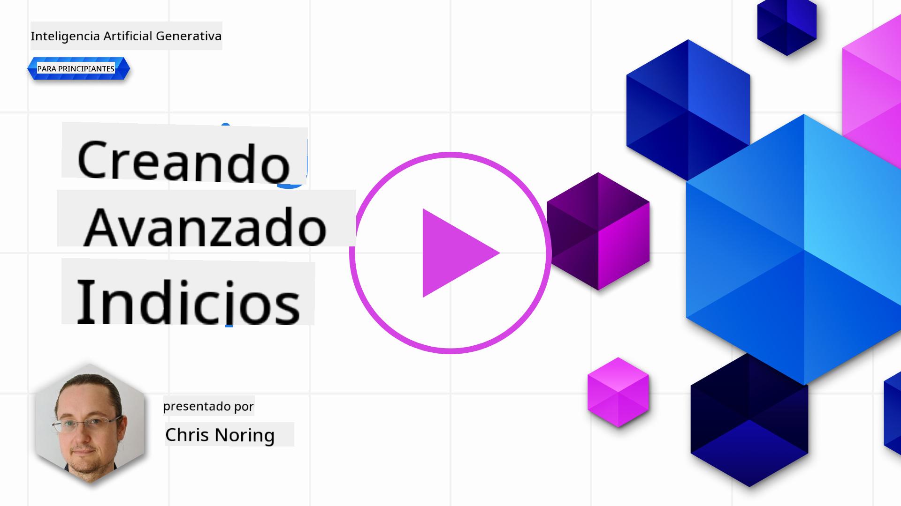

<!--
CO_OP_TRANSLATOR_METADATA:
{
  "original_hash": "b2651fb16bcfbc62b8e518751ed90fdb",
  "translation_date": "2025-10-17T22:44:50+00:00",
  "source_file": "05-advanced-prompts/README.md",
  "language_code": "es"
}
-->
# Creando prompts avanzados

[](https://youtu.be/BAjzkaCdRok?si=NmUIyRf7-cDgbjtt)

Repasemos algunos aprendizajes del capítulo anterior:

> La _ingeniería de prompts_ es el proceso mediante el cual **guiamos al modelo hacia respuestas más relevantes** proporcionando instrucciones o contexto más útiles.

También hay dos pasos para escribir prompts: construir el prompt, proporcionando un contexto relevante, y la _optimización_, que consiste en mejorar gradualmente el prompt.

En este punto, tenemos una comprensión básica de cómo escribir prompts, pero necesitamos profundizar más. En este capítulo, pasarás de probar varios prompts a entender por qué un prompt es mejor que otro. Aprenderás cómo construir prompts siguiendo algunas técnicas básicas que se pueden aplicar a cualquier LLM.

## Introducción

En este capítulo, cubriremos los siguientes temas:

- Ampliar tu conocimiento sobre ingeniería de prompts aplicando diferentes técnicas a tus prompts.
- Configurar tus prompts para variar el resultado.

## Objetivos de aprendizaje

Después de completar esta lección, podrás:

- Aplicar técnicas de ingeniería de prompts que mejoren el resultado de tus prompts.
- Realizar prompts que sean variados o deterministas.

## Ingeniería de prompts

La ingeniería de prompts es el proceso de crear prompts que produzcan el resultado deseado. Hay más en la ingeniería de prompts que simplemente escribir un texto. La ingeniería de prompts no es una disciplina de ingeniería, es más bien un conjunto de técnicas que puedes aplicar para obtener el resultado deseado.

### Un ejemplo de un prompt

Tomemos un prompt básico como este:

> Genera 10 preguntas sobre geografía.

En este prompt, en realidad estás aplicando un conjunto de diferentes técnicas de prompts.

Desglosémoslo.

- **Contexto**, especificas que debe ser sobre "geografía".
- **Limitar el resultado**, quieres no más de 10 preguntas.

### Limitaciones de los prompts simples

Es posible que obtengas o no el resultado deseado. Se generarán tus preguntas, pero la geografía es un tema amplio y es posible que no obtengas lo que deseas debido a las siguientes razones:

- **Tema amplio**, no sabes si será sobre países, capitales, ríos, etc.
- **Formato**, ¿qué pasa si querías que las preguntas tuvieran un formato específico?

Como puedes ver, hay mucho que considerar al crear prompts.

Hasta ahora, hemos visto un ejemplo de prompt simple, pero la IA generativa es capaz de mucho más para ayudar a las personas en una variedad de roles e industrias. Exploremos algunas técnicas básicas a continuación.

### Técnicas para crear prompts

Primero, necesitamos entender que la creación de prompts es una propiedad _emergente_ de un LLM, lo que significa que no es una característica incorporada en el modelo, sino algo que descubrimos al usar el modelo.

Hay algunas técnicas básicas que podemos usar para crear prompts en un LLM. Vamos a explorarlas.

- **Prompt sin ejemplos (Zero-shot prompting)**, esta es la forma más básica de crear prompts. Es un único prompt que solicita una respuesta del LLM basada únicamente en sus datos de entrenamiento.
- **Prompt con pocos ejemplos (Few-shot prompting)**, este tipo de prompt guía al LLM proporcionando uno o más ejemplos en los que puede basarse para generar su respuesta.
- **Cadena de pensamiento (Chain-of-thought)**, este tipo de prompt indica al LLM cómo descomponer un problema en pasos.
- **Conocimiento generado**, para mejorar la respuesta de un prompt, puedes proporcionar hechos o conocimientos generados adicionalmente a tu prompt.
- **De menos a más (Least to most)**, al igual que la cadena de pensamiento, esta técnica consiste en descomponer un problema en una serie de pasos y luego pedir que se realicen en orden.
- **Auto-refinamiento (Self-refine)**, esta técnica consiste en criticar la salida del LLM y luego pedirle que la mejore.
- **Prompt mayéutico (Maieutic prompting)**. Aquí lo que quieres es asegurarte de que la respuesta del LLM sea correcta y le pides que explique varias partes de la respuesta. Esta es una forma de auto-refinamiento.

### Prompt sin ejemplos (Zero-shot prompting)

Este estilo de prompt es muy simple, consiste en un único prompt. Esta técnica es probablemente la que estás utilizando mientras comienzas a aprender sobre los LLM. Aquí hay un ejemplo:

- Prompt: "¿Qué es el álgebra?"
- Respuesta: "El álgebra es una rama de las matemáticas que estudia los símbolos matemáticos y las reglas para manipular estos símbolos."

### Prompt con pocos ejemplos (Few-shot prompting)

Este estilo de prompt ayuda al modelo proporcionando algunos ejemplos junto con la solicitud. Consiste en un único prompt con datos adicionales específicos de la tarea. Aquí hay un ejemplo:

- Prompt: "Escribe un poema al estilo de Shakespeare. Aquí hay algunos ejemplos de sonetos de Shakespeare:
  Soneto 18: '¿Compararte con un día de verano? Eres más hermoso y más templado...'
  Soneto 116: 'No permitas que el matrimonio de mentes verdaderas admita impedimentos. El amor no es amor que cambia cuando encuentra cambio...'
  Soneto 132: 'Tus ojos amo, y ellos, como compadeciéndome, sabiendo que tu corazón me atormenta con desdén,...'
  Ahora, escribe un soneto sobre la belleza de la luna."
- Respuesta: "Sobre el cielo, la luna suavemente brilla, En luz plateada que lanza su gentil gracia,..."

Los ejemplos proporcionan al LLM el contexto, formato o estilo del resultado deseado. Ayudan al modelo a entender la tarea específica y generar respuestas más precisas y relevantes.

### Cadena de pensamiento (Chain-of-thought)

La cadena de pensamiento es una técnica muy interesante ya que se trata de llevar al LLM a través de una serie de pasos. La idea es instruir al LLM de tal manera que entienda cómo hacer algo. Considera el siguiente ejemplo, con y sin cadena de pensamiento:

    - Prompt: "Alice tiene 5 manzanas, tira 3 manzanas, da 2 a Bob y Bob le devuelve una, ¿cuántas manzanas tiene Alice?"
    - Respuesta: 5

El LLM responde con 5, lo cual es incorrecto. La respuesta correcta es 1 manzana, dado el cálculo (5 -3 -2 + 1 = 1).

Entonces, ¿cómo podemos enseñar al LLM a hacer esto correctamente?

Intentemos la cadena de pensamiento. Aplicar la cadena de pensamiento significa:

1. Dar al LLM un ejemplo similar.
1. Mostrar el cálculo y cómo calcularlo correctamente.
1. Proporcionar el prompt original.

Así es como se hace:

- Prompt: "Lisa tiene 7 manzanas, tira 1 manzana, da 4 manzanas a Bart y Bart le devuelve una:
  7 -1 = 6
  6 -4 = 2
  2 +1 = 3  
  Alice tiene 5 manzanas, tira 3 manzanas, da 2 a Bob y Bob le devuelve una, ¿cuántas manzanas tiene Alice?"
  Respuesta: 1

Nota cómo escribimos prompts sustancialmente más largos con otro ejemplo, un cálculo y luego el prompt original, y llegamos a la respuesta correcta: 1.

Como puedes ver, la cadena de pensamiento es una técnica muy poderosa.

### Conocimiento generado

Muchas veces, cuando quieres construir un prompt, quieres hacerlo utilizando los datos de tu propia empresa. Quieres que parte del prompt provenga de la empresa y la otra parte sea el prompt que te interesa.

Como ejemplo, así es como podría verse tu prompt si estás en el negocio de seguros:

```text
{{company}}: {{company_name}}
{{products}}:
{{products_list}}
Please suggest an insurance given the following budget and requirements:
Budget: {{budget}}
Requirements: {{requirements}}
```

Arriba, puedes ver cómo se construye el prompt utilizando una plantilla. En la plantilla hay una serie de variables, denotadas por `{{variable}}`, que serán reemplazadas con valores reales de una API de la empresa.

Aquí hay un ejemplo de cómo podría verse el prompt una vez que las variables han sido reemplazadas por contenido de tu empresa:

```text
Insurance company: ACME Insurance
Insurance products (cost per month):
- Car, cheap, 500 USD
- Car, expensive, 1100 USD
- Home, cheap, 600 USD
- Home, expensive, 1200 USD
- Life, cheap, 100 USD

Please suggest an insurance given the following budget and requirements:
Budget: $1000
Requirements: Car, Home, and Life insurance
```

Ejecutar este prompt a través de un LLM producirá una respuesta como esta:

```output
Given the budget and requirements, we suggest the following insurance package from ACME Insurance:
- Car, cheap, 500 USD
- Home, cheap, 600 USD
- Life, cheap, 100 USD
Total cost: $1,200 USD
```

Como puedes ver, también sugiere el seguro de vida, lo cual no debería. Este resultado es una indicación de que necesitamos optimizar el prompt cambiándolo para que sea más claro sobre lo que puede permitir. Después de algunos _ensayos y errores_, llegamos al siguiente prompt:

```text
Insurance company: ACME Insurance
Insurance products (cost per month):
- type: Car, cheap, cost: 500 USD
- type: Car, expensive, cost: 1100 USD
- type: Home, cheap, cost: 600 USD
- type: Home, expensive, cost: 1200 USD
- type: Life, cheap, cost: 100 USD

Please suggest an insurance given the following budget and requirements:
Budget: $1000 restrict choice to types: Car, Home
```

Nota cómo agregar _tipo_ y _costo_ y también usar la palabra clave _restringir_ ayuda al LLM a entender lo que queremos.

Ahora obtenemos la siguiente respuesta:

```output
Given the budget and requirements, we suggest the Car, Cheap insurance product which costs 500 USD per month.
```

El objetivo de este ejemplo era mostrar que, aunque estamos utilizando una técnica básica como el _conocimiento generado_, aún necesitamos optimizar el prompt en la mayoría de los casos para obtener el resultado deseado.

### De menos a más (Least-to-most)

La idea del prompting de menos a más es descomponer un problema más grande en subproblemas. De esa manera, ayudas a guiar al LLM sobre cómo "resolver" el problema más grande. Un buen ejemplo podría ser en ciencia de datos, donde puedes pedirle al LLM que divida un problema de esta manera:

> Prompt: ¿Cómo realizar ciencia de datos en 5 pasos?

Con tu asistente de IA respondiendo con:

1. Recopilar datos
1. Limpiar datos
1. Analizar datos
1. Graficar datos
1. Presentar datos

### Auto-refinamiento, criticar los resultados

Con las IAs generativas y los LLMs, no puedes confiar ciegamente en el resultado. Necesitas verificarlo. Después de todo, el LLM solo te presenta lo que es más probable que diga a continuación, no lo que es correcto. Por lo tanto, una buena idea es pedirle al LLM que se critique a sí mismo, lo que nos lleva a la técnica de auto-refinamiento.

Cómo funciona es que sigues los siguientes pasos:

1. Prompt inicial pidiendo al LLM que resuelva un problema.
1. El LLM responde.
1. Criticas la respuesta y pides a la IA que la mejore.
1. El LLM responde nuevamente, esta vez considerando la crítica y sugiriendo soluciones que se le ocurrieron.

Puedes repetir este proceso tantas veces como desees.

Aquí hay un ejemplo usando esta técnica:

> Prompt: "Crea una API web en Python con rutas para productos y clientes"

Respuesta de la IA:

```python
import flask
app = Flask(__name__)

@app.route('/products')
def products():
    return 'Products'

@app.route('/customers')
def customers():
    return 'Customers'
```

> Prompt: sugiere 3 mejoras para el código anterior

Respuesta de la IA:

```text
Sure, here are three suggestions to improve the code:

Import the correct module: The first line should import Flask instead of flask. The correct import statement should be from flask import Flask.

Add a main function: Add a if __name__ == '__main__': block to the end of the file to run the application when the file is executed.

Use f-strings: Use f-strings to format the return statements in the route functions. For example, return 'Products' can be changed to return f'This is the {request.path} page'.
```

```python
from flask import Flask, request

app = Flask(__name__)

@app.route('/products')
def products():
    return f'This is the {request.path} page'

@app.route('/customers')
def customers():
    return f'This is the {request.path} page'

if __name__ == '__main__':
    app.run()
```

Como puedes ver, la respuesta de la IA anterior mejora el primer código sugerido gracias a la crítica de la primera respuesta.

### Prompt mayéutico

El prompting mayéutico es una técnica similar al auto-refinamiento, pero se trata más de pedirle al LLM que se explique a sí mismo. El objetivo es reducir las inconsistencias en la salida del LLM para asegurarse de que llegue a la respuesta correcta. El flujo de trabajo a seguir es:

1. Pedir al LLM que responda una pregunta.
1. Para cada parte de la respuesta, pedir al LLM que la explique más a fondo.
1. Si hay inconsistencias, descartar las partes que son inconsistentes.

Repite los pasos 2 y 3 hasta que hayas revisado todas las partes y estés satisfecho con la respuesta.

Aquí hay un ejemplo de prompt:

> Prompt: ¿Cómo puedo crear un plan de crisis para mitigar una pandemia en 5 pasos?
> Respuesta del LLM:

```text
1. Identify the risks
1. Identify the stakeholders
1. Identify the resources
1. Identify the actions
1. Identify the communication channels
```

Ha identificado 5 pasos, pero ¿podemos determinar si esto es correcto? Pidamos al LLM que explique cada paso:

> Prompt: Explica el primer paso con más detalle, ¿cuáles son los riesgos en detalle de una pandemia?

```text
The risks are the following:

- Loss of life
- Loss of business
- Loss of reputation
- Loss of customers
- Loss of employees
```

En este punto, queremos asegurarnos de que el LLM sea correcto, así que le pedimos que explique el primer riesgo con más detalle y esperamos que sea consistente con la respuesta anterior:

> Prompt: En una pandemia, ¿cuál es el mayor riesgo y por qué?

```text
The biggest risk is loss of life because it's the most important thing to protect.
```

> ¿Cuáles son los dos mayores riesgos en una pandemia?

```text
The two biggest risks are loss of life and loss of business.
```

En este punto, el LLM es consistente y menciona "vida" y "negocios" como los dos principales riesgos. Ahora podemos continuar con el siguiente paso y sentirnos bastante seguros. Sin embargo, no debemos confiar ciegamente en el LLM, siempre debemos verificar el resultado.

## Variar tu resultado

Los LLMs son por naturaleza no deterministas, lo que significa que obtendrás diferentes resultados cada vez que ejecutes el mismo prompt. Prueba el siguiente prompt, por ejemplo:

> "Genera código para una API web en Python"

```python
# Import necessary modules
import flask
from flask import request, jsonify

# Create a Flask app
app = flask.Flask(__name__)

# Create a route for the API
@app.route('/api', methods=['GET'])
def api():
    # Get the data from the request
    data = request.args

    # Process the data
    result = process_data(data)

    # Return the result as JSON
    return jsonify(result)

# Function to process the data
def process_data(data):
    # Do something with the data
    result = data + 1

    # Return the result
    return result

# Run the app
if __name__ == '__main__':
    app.run()

```

Ejecutar el mismo prompt nuevamente genera una respuesta ligeramente diferente:

```python
#import necessary packages
import flask
from flask import request, jsonify

#create the Flask application
app = flask.Flask(__name__)
app.config["DEBUG"] = True

#create a list of books
books = [
    {'id': 0,
     'title': 'A Fire Upon the Deep',
     'author': 'Vernor Vinge',
     'first_sentence': 'The coldsleep itself was dreamless.',
     'year_published': '1992'},
    {'id': 1,
     'title': 'The Ones Who Walk Away From Omelas',
     'author': 'Ursula K. Le Guin',
     'first_sentence': 'With a clamor of bells that set the swallows soaring, the Festival of Summer came to the city Omelas, bright-towered by the sea.',
     'published': '1973'},
    {'id': 2,
     'title': 'Dhalgren',
     'author': 'Samuel R. Delany',
     'first_sentence': 'to wound the autumnal city.',
     'published': '1975'}
]

#create an endpoint for the API
@app.route('/', methods=['GET'])
def home():
    return '''<h1>Books API</h1>
<p>A prototype API for retrieving books.</p>'''

#create an endpoint to return all books
@app.route('/api/v1/resources/books/all', methods=['GET'])
def api_all():
    return jsonify(books)

#create an endpoint to return a single book
@app.route('/api/v1/resources/books', methods=['GET'])
def api_id():
    #check if an ID was provided as part of the URL
    #if ID is provided, assign it to a variable
    #if no ID is provided, display an error
    if 'id' in request.args:
        id = int(request.args['id'])
    else:
        return "Error: No id field provided. Please specify an id."

    #create an empty list for our results
    results = []

    #loop through the data and match results that fit the requested ID
    #IDs are unique, but other fields might return many results
    for book in books:
        if book['id'] == id:
            results.append(book)

    #use the jsonify function from Flask to convert our list of
    #Python dictionaries to the JSON format
    return jsonify(results)

app.run()
```

> Entonces, ¿es un problema el resultado variado?

Depende de lo que estés tratando de hacer. Si deseas una respuesta específica, entonces es un problema. Si estás de acuerdo con un resultado variado como "Genera cualquier 3 preguntas sobre geografía", entonces no es un problema.

### Usar la temperatura para variar tu resultado

Bien, entonces hemos decidido que queremos limitar el resultado para que sea más predecible, es decir, más determinista. ¿Cómo hacemos eso?

La temperatura es un valor entre 0 y 1, donde 0 es el más determinista y 1 es el más variado. El valor predeterminado es 0.7. Veamos qué sucede con dos ejecuciones del mismo prompt con la temperatura configurada en 0.1:

> "Genera código para una API web en Python"

```python
#import necessary libraries
import flask
from flask import request, jsonify

#create an instance of the Flask class
app = flask.Flask(__name__)

#create an endpoint for the API
@app.route('/api/v1/endpoint', methods=['GET'])
def api_endpoint():
    #get the request data
    data = request.get_json()

    #process the data
    result = process_data(data)

    #return the result
    return jsonify(result)

#function to process the data
def process_data(data):
    #process the data
    result = {'result': 'success'}

    #return the result
    return result

#run the Flask app
if __name__ == '__main__':
    app.run()

```

Ejecutar el prompt nuevamente nos da este resultado:

```python
#import necessary libraries
import flask
from flask import request, jsonify

#create a Flask app
app = flask.Flask(__name__)

#create a route for the API
@app.route('/api', methods=['GET'])
def api_call():
    #get the data from the request
    data = request.get_json()

    #process the data
    result = process_data(data)

    #return the result
    return jsonify(result)

#define the process_data function
def process_data(data):
    #do something with the data
    result = data + 1

    #return the result
    return result

#run the app
if __name__ == '__main__':
    app.run()

```

Solo hay una pequeña diferencia entre estos dos resultados. Hagamos lo contrario esta vez, configuremos la temperatura en 0.9:

```python
# Import necessary libraries
import flask
from flask import request, jsonify

# Create a Flask app
app = flask.Flask(__name__)

# Create a route for the API
@app.route('/api', methods=['GET'])
def api_call():
    # Get the data from the request
    data = request.args

    # Process the data
    result = process_data(data)

    # Return the result
    return jsonify(result)

# Function to process the data
def process_data(data):
    # Do something with the data
    result = data + 1

    # Return the result
    return result

# Run the app
if __name__ == '__main__':
    app.run()

```

y el segundo intento con un valor de temperatura de 0.9:

```python
import flask
from flask import request, jsonify

# create the Flask app
app = flask.Flask(__name__)
app.config['DEBUG'] = True

# create some test data
books = [
    {'id': 0, 'title': 'A Fire Upon The Deep', 'author': 'Vernor Vinge', 'first_sentence': 'The coldsleep itself was dreamless.', 'year_published': '1992'},
    {'id': 1, 'title': 'The Ones Who Walk Away From Omelas', 'author': 'Ursula K. Le Guin', 'first_sentence': 'With a clamor of bells that set the swallows soaring, the Festival of Summer came to the city Omelas, bright-towered by the sea.', 'published': '1973'},
    {'id': 2, 'title': 'Dhalgren', 'author': 'Samuel R. Delany', 'first_sentence': 'to wound the autumnal city.', 'published': '1975'}
]

# create an endpoint
@app.route('/', methods=['GET'])
def home():
    return '''<h1>Welcome to our book API!</h1>'''

@app.route('/api/v1/resources/books

```

Como puedes ver, los resultados no podrían ser más variados.

> Nota que hay más parámetros que puedes cambiar para variar el resultado, como top-k, top-p, penalización por repetición, penalización por longitud y penalización por diversidad, pero estos están fuera del alcance de este curso.

## Buenas prácticas

Existen muchas prácticas que puedes aplicar para intentar obtener lo que deseas. Encontrarás tu propio estilo a medida que uses más y más el prompting.

Además de las técnicas que hemos cubierto, hay algunas buenas prácticas a considerar al realizar un prompting a un LLM.

Aquí tienes algunas buenas prácticas a tener en cuenta:

- **Especifica el contexto**. El contexto importa, mientras más detalles puedas especificar como el dominio, tema, etc., mejor.
- Limita el resultado. Si deseas un número específico de elementos o una longitud específica, especifícalo.
- **Especifica qué y cómo**. Recuerda mencionar tanto lo que quieres como cómo lo quieres, por ejemplo: "Crea una API web en Python con rutas para productos y clientes, divídela en 3 archivos".
- **Usa plantillas**. A menudo, querrás enriquecer tus prompts con datos de tu empresa. Usa plantillas para hacerlo. Las plantillas pueden tener variables que reemplaces con datos reales.
- **Escribe correctamente**. Los LLMs podrían proporcionarte una respuesta correcta, pero si escribes correctamente, obtendrás una mejor respuesta.

## Tarea

Aquí tienes un código en Python que muestra cómo construir una API simple usando Flask:

```python
from flask import Flask, request

app = Flask(__name__)

@app.route('/')
def hello():
    name = request.args.get('name', 'World')
    return f'Hello, {name}!'

if __name__ == '__main__':
    app.run()
```

Usa un asistente de IA como GitHub Copilot o ChatGPT y aplica la técnica de "auto-refinamiento" para mejorar el código.

## Solución

Por favor, intenta resolver la tarea añadiendo prompts adecuados al código.

> [!TIP]
> Formula un prompt para pedir que se mejore, es una buena idea limitar cuántas mejoras. También puedes pedir que se mejore de una manera específica, por ejemplo, arquitectura, rendimiento, seguridad, etc.

[Solución](../../../05-advanced-prompts/python/aoai-solution.py)

## Verificación de conocimiento

¿Por qué usaría el prompting de cadena de pensamiento? Muéstrame 1 respuesta correcta y 2 respuestas incorrectas.

1. Para enseñar al LLM cómo resolver un problema.
1. B, Para enseñar al LLM a encontrar errores en el código.
1. C, Para instruir al LLM a proponer diferentes soluciones.

A: 1, porque la cadena de pensamiento trata de mostrar al LLM cómo resolver un problema proporcionándole una serie de pasos, problemas similares y cómo fueron resueltos.

## 🚀 Desafío

Acabas de usar la técnica de auto-refinamiento en la tarea. Toma cualquier programa que hayas creado y considera qué mejoras te gustaría aplicarle. Ahora usa la técnica de auto-refinamiento para aplicar los cambios propuestos. ¿Qué te pareció el resultado, mejor o peor?

## ¡Gran trabajo! Continúa tu aprendizaje

Después de completar esta lección, revisa nuestra [colección de aprendizaje de IA generativa](https://aka.ms/genai-collection?WT.mc_id=academic-105485-koreyst) para seguir ampliando tus conocimientos sobre IA generativa.

Dirígete a la Lección 6 donde aplicaremos nuestro conocimiento de Ingeniería de Prompts [construyendo aplicaciones de generación de texto](../06-text-generation-apps/README.md?WT.mc_id=academic-105485-koreyst)

---

**Descargo de responsabilidad**:  
Este documento ha sido traducido utilizando el servicio de traducción automática [Co-op Translator](https://github.com/Azure/co-op-translator). Aunque nos esforzamos por lograr precisión, tenga en cuenta que las traducciones automáticas pueden contener errores o imprecisiones. El documento original en su idioma nativo debe considerarse la fuente autorizada. Para información crítica, se recomienda una traducción profesional realizada por humanos. No nos hacemos responsables de malentendidos o interpretaciones erróneas que surjan del uso de esta traducción.