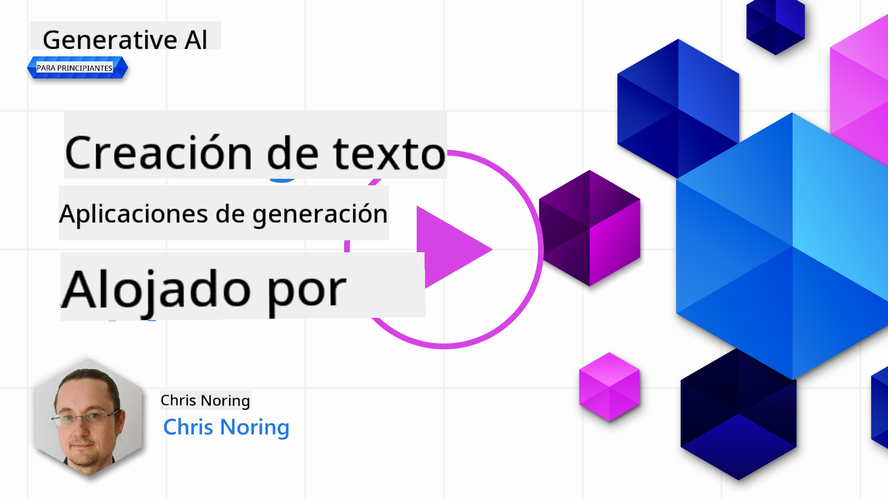

<!--
CO_OP_TRANSLATOR_METADATA:
{
  "original_hash": "ce8224073b86b728ed52b19bed7932fd",
  "translation_date": "2025-07-09T11:43:37+00:00",
  "source_file": "06-text-generation-apps/README.md",
  "language_code": "es"
}
-->
# Construcción de Aplicaciones de Generación de Texto

[](https://aka.ms/gen-ai-lesson6-gh?WT.mc_id=academic-105485-koreyst)

> _(Haz clic en la imagen de arriba para ver el video de esta lección)_

Hasta ahora, en este currículo has visto que existen conceptos clave como los prompts e incluso toda una disciplina llamada "ingeniería de prompts". Muchas herramientas con las que puedes interactuar, como ChatGPT, Office 365, Microsoft Power Platform y más, te apoyan usando prompts para lograr algo.

Para que puedas añadir esa experiencia a una aplicación, necesitas entender conceptos como prompts, completions y elegir una biblioteca con la que trabajar. Eso es exactamente lo que aprenderás en este capítulo.

## Introducción

En este capítulo, vas a:

- Aprender sobre la biblioteca openai y sus conceptos principales.
- Construir una aplicación de generación de texto usando openai.
- Entender cómo usar conceptos como prompt, temperature y tokens para crear una aplicación de generación de texto.

## Objetivos de aprendizaje

Al final de esta lección, serás capaz de:

- Explicar qué es una aplicación de generación de texto.
- Construir una aplicación de generación de texto usando openai.
- Configurar tu aplicación para usar más o menos tokens y también cambiar la temperatura, para obtener resultados variados.

## 쯈ué es una aplicación de generación de texto?

Normalmente, cuando construyes una aplicación, tiene algún tipo de interfaz como la siguiente:

- Basada en comandos. Las aplicaciones de consola son típicas donde escribes un comando y se ejecuta una tarea. Por ejemplo, `git` es una aplicación basada en comandos.
- Interfaz de usuario (UI). Algunas aplicaciones tienen interfaces gráficas (GUIs) donde haces clic en botones, ingresas texto, seleccionas opciones y más.

### Las aplicaciones de consola y UI son limitadas

Compáralo con una aplicación basada en comandos donde escribes un comando:

- **Es limitada**. No puedes escribir cualquier comando, solo los que la aplicación soporta.
- **Específica de idioma**. Algunas aplicaciones soportan muchos idiomas, pero por defecto la aplicación está construida para un idioma específico, aunque puedas añadir soporte para más idiomas.

### Beneficios de las aplicaciones de generación de texto

Entonces, 쯘n qué se diferencia una aplicación de generación de texto?

En una aplicación de generación de texto, tienes más flexibilidad, no estás limitado a un conjunto de comandos o a un idioma específico de entrada. En cambio, puedes usar lenguaje natural para interactuar con la aplicación. Otro beneficio es que, porque ya estás interactuando con una fuente de datos que ha sido entrenada con un vasto corpus de información, mientras que una aplicación tradicional podría estar limitada a lo que hay en una base de datos.

### 쯈ué puedo construir con una aplicación de generación de texto?

Hay muchas cosas que puedes construir. Por ejemplo:

- **Un chatbot**. Un chatbot que responda preguntas sobre temas, como tu empresa y sus productos, podría ser una buena opción.
- **Asistente**. Los LLM son excelentes para cosas como resumir texto, obtener insights de texto, producir texto como currículums y más.
- **Asistente de código**. Dependiendo del modelo de lenguaje que uses, puedes construir un asistente de código que te ayude a escribir código. Por ejemplo, puedes usar un producto como GitHub Copilot así como ChatGPT para ayudarte a programar.

## 쮺칩mo puedo empezar?

Bueno, necesitas encontrar una forma de integrarte con un LLM, lo que usualmente implica dos enfoques:

- Usar una API. Aquí construyes solicitudes web con tu prompt y recibes texto generado de vuelta.
- Usar una biblioteca. Las bibliotecas ayudan a encapsular las llamadas a la API y hacerlas más fáciles de usar.

## Bibliotecas/SDKs

Hay algunas bibliotecas bien conocidas para trabajar con LLMs como:

- **openai**, esta biblioteca facilita la conexión con tu modelo y el envío de prompts.

Luego hay bibliotecas que operan a un nivel más alto como:

- **Langchain**. Langchain es muy conocido y soporta Python.
- **Semantic Kernel**. Semantic Kernel es una biblioteca de Microsoft que soporta los lenguajes C#, Python y Java.

## Primera aplicación usando openai

Veamos cómo podemos construir nuestra primera aplicación, qué bibliotecas necesitamos, cuánto se requiere y demás.

### Instalar openai

Hay muchas bibliotecas para interactuar con OpenAI o Azure OpenAI. Es posible usar varios lenguajes de programación como C#, Python, JavaScript, Java y más. Hemos elegido usar la biblioteca `openai` de Python, así que usaremos `pip` para instalarla.

```bash
pip install openai
```

### Crear un recurso

Necesitas realizar los siguientes pasos:

- Crear una cuenta en Azure [https://azure.microsoft.com/free/](https://azure.microsoft.com/free/?WT.mc_id=academic-105485-koreyst).
- Obtener acceso a Azure OpenAI. Ve a [https://learn.microsoft.com/azure/ai-services/openai/overview#how-do-i-get-access-to-azure-openai](https://learn.microsoft.com/azure/ai-services/openai/overview#how-do-i-get-access-to-azure-openai?WT.mc_id=academic-105485-koreyst) y solicita acceso.

  > [!NOTE]
  > Al momento de escribir, necesitas solicitar acceso a Azure OpenAI.

- Instalar Python <https://www.python.org/>
- Haber creado un recurso de Azure OpenAI Service. Consulta esta guía para saber cómo [crear un recurso](https://learn.microsoft.com/azure/ai-services/openai/how-to/create-resource?pivots=web-portal?WT.mc_id=academic-105485-koreyst).

### Localizar la clave API y el endpoint

En este punto, necesitas indicarle a tu biblioteca `openai` qué clave API usar. Para encontrar tu clave API, ve a la sección "Keys and Endpoint" de tu recurso Azure OpenAI y copia el valor de "Key 1".


Ahora que tienes esta información copiada, vamos a indicarle a las bibliotecas que la usen.

> [!NOTE]
> Vale la pena separar tu clave API del código. Puedes hacerlo usando variables de entorno.
>
> - Establece la variable de entorno `OPENAI_API_KEY` con tu clave API.
>   `export OPENAI_API_KEY='sk-...'`

### Configuración para Azure

Si usas Azure OpenAI, así es como configuras la configuración:

```python
openai.api_type = 'azure'
openai.api_key = os.environ["OPENAI_API_KEY"]
openai.api_version = '2023-05-15'
openai.api_base = os.getenv("API_BASE")
```

Arriba estamos configurando lo siguiente:

- `api_type` a `azure`. Esto indica a la biblioteca que use Azure OpenAI y no OpenAI.
- `api_key`, esta es tu clave API encontrada en el Portal de Azure.
- `api_version`, esta es la versión de la API que quieres usar. Al momento de escribir, la versión más reciente es `2023-05-15`.
- `api_base`, este es el endpoint de la API. Lo puedes encontrar en el Portal de Azure junto a tu clave API.

> [!NOTE] > `os.getenv` es una función que lee variables de entorno. Puedes usarla para leer variables como `OPENAI_API_KEY` y `API_BASE`. Establece estas variables en tu terminal o usando una biblioteca como `dotenv`.

## Generar texto

La forma de generar texto es usando la clase `Completion`. Aquí tienes un ejemplo:

```python
prompt = "Complete the following: Once upon a time there was a"

completion = openai.Completion.create(model="davinci-002", prompt=prompt)
print(completion.choices[0].text)
```

En el código anterior, creamos un objeto completion y le pasamos el modelo que queremos usar y el prompt. Luego imprimimos el texto generado.

### Completions de chat

Hasta ahora, has visto cómo hemos usado `Completion` para generar texto. Pero hay otra clase llamada `ChatCompletion` que es más adecuada para chatbots. Aquí tienes un ejemplo de cómo usarla:

```python
import openai

openai.api_key = "sk-..."

completion = openai.ChatCompletion.create(model="gpt-3.5-turbo", messages=[{"role": "user", "content": "Hello world"}])
print(completion.choices[0].message.content)
```

Más sobre esta funcionalidad en un capítulo próximo.

## Ejercicio - tu primera aplicación de generación de texto

Ahora que aprendimos cómo configurar y usar openai, es momento de construir tu primera aplicación de generación de texto. Para construir tu aplicación, sigue estos pasos:

1. Crea un entorno virtual e instala openai:

   ```bash
   python -m venv venv
   source venv/bin/activate
   pip install openai
   ```

   > [!NOTE]
   > Si usas Windows, escribe `venv\Scripts\activate` en lugar de `source venv/bin/activate`.

   > [!NOTE]
   > Localiza tu clave Azure OpenAI yendo a [https://portal.azure.com/](https://portal.azure.com/?WT.mc_id=academic-105485-koreyst), busca `Open AI`, selecciona el `Open AI resource` y luego `Keys and Endpoint` y copia el valor de `Key 1`.

1. Crea un archivo _app.py_ y pon el siguiente código:

   ```python
   import openai

   openai.api_key = "<replace this value with your open ai key or Azure OpenAI key>"

   openai.api_type = 'azure'
   openai.api_version = '2023-05-15'
   openai.api_base = "<endpoint found in Azure Portal where your API key is>"
   deployment_name = "<deployment name>"

   # add your completion code
   prompt = "Complete the following: Once upon a time there was a"
   messages = [{"role": "user", "content": prompt}]

   # make completion
   completion = openai.chat.completions.create(model=deployment_name, messages=messages)

   # print response
   print(completion.choices[0].message.content)
   ```

   > [!NOTE]
   > Si usas Azure OpenAI, necesitas establecer `api_type` a `azure` y asignar `api_key` a tu clave Azure OpenAI.

   Deberías ver una salida similar a la siguiente:

   ```output
    very unhappy _____.

   Once upon a time there was a very unhappy mermaid.
   ```

## Diferentes tipos de prompts, para diferentes cosas

Ahora que has visto cómo generar texto usando un prompt, incluso tienes un programa funcionando que puedes modificar para generar diferentes tipos de texto.

Los prompts pueden usarse para todo tipo de tareas. Por ejemplo:

- **Generar un tipo de texto**. Por ejemplo, puedes generar un poema, preguntas para un quiz, etc.
- **Buscar información**. Puedes usar prompts para buscar información como en el siguiente ejemplo: '쯈ué significa CORS en desarrollo web?'.
- **Generar código**. Puedes usar prompts para generar código, por ejemplo, desarrollar una expresión regular para validar correos o incluso generar un programa completo, como una aplicación web.

## Un caso de uso más práctico: un generador de recetas

Imagina que tienes ingredientes en casa y quieres cocinar algo. Para eso, necesitas una receta. Una forma de encontrar recetas es usar un motor de búsqueda o podrías usar un LLM para hacerlo.

Podrías escribir un prompt así:

> "Muéstrame 5 recetas para un plato con los siguientes ingredientes: pollo, papas y zanahorias. Por receta, lista todos los ingredientes usados"

Dado el prompt anterior, podrías obtener una respuesta similar a:

```output
1. Roasted Chicken and Vegetables:
Ingredients:
- 4 chicken thighs
- 2 potatoes, cut into cubes
- 2 carrots, cut into cubes
- 2 tablespoons olive oil
- 2 cloves garlic, minced
- 1 teaspoon dried thyme
- 1 teaspoon dried oregano
- Salt and pepper, to taste

2. Chicken and Potato Stew:
Ingredients:
- 2 tablespoons olive oil
- 1 onion, diced
- 2 cloves garlic, minced
- 2 chicken breasts, cut into cubes
- 2 potatoes, cut into cubes
- 2 carrots, cut into cubes
- 1 teaspoon dried oregano
- 1 teaspoon dried thyme
- 1 cup chicken broth
- Salt and pepper, to taste

3. Chicken and Potato Bake:
Ingredients:
- 2 tablespoons olive oil
- 2 chicken breasts, cut into cubes
- 2 potatoes, cut into cubes
- 2 carrots, cut into cubes
- 1 onion, diced
- 2 cloves garlic, minced
- 1 teaspoon dried oregano
- 1 teaspoon dried thyme
- 1 cup chicken broth
- Salt and pepper, to taste

4. Chicken and Potato Soup:
Ingredients:
- 2 tablespoons olive oil
- 1 onion, diced
- 2 cloves garlic, minced
- 2 chicken breasts, cut into cubes
- 2 potatoes, cut into cubes
- 2 carrots, cut into cubes
- 1 teaspoon dried oregano
- 1 teaspoon dried thyme
- 4 cups chicken broth
- Salt and pepper, to taste

5. Chicken and Potato Hash:
Ingredients:
- 2 tablespoons olive oil
- 2 chicken breasts, cut into cubes
- 2 potatoes, cut into cubes
- 2 carrots, cut into cubes
- 1 onion, diced
- 2 cloves garlic, minced
- 1 teaspoon dried oregano
```

Este resultado es genial, sé qué cocinar. En este punto, algunas mejoras útiles podrían ser:

- Filtrar ingredientes que no me gustan o a los que soy alérgico.
- Producir una lista de compras, en caso de que no tenga todos los ingredientes en casa.

Para los casos anteriores, añadamos un prompt adicional:

> "Por favor, elimina las recetas con ajo ya que soy alérgico y reemplázalo con otro ingrediente. Además, por favor produce una lista de compras para las recetas, considerando que ya tengo pollo, papas y zanahorias en casa."

Ahora tienes un nuevo resultado, a saber:

```output
1. Roasted Chicken and Vegetables:
Ingredients:
- 4 chicken thighs
- 2 potatoes, cut into cubes
- 2 carrots, cut into cubes
- 2 tablespoons olive oil
- 1 teaspoon dried thyme
- 1 teaspoon dried oregano
- Salt and pepper, to taste

2. Chicken and Potato Stew:
Ingredients:
- 2 tablespoons olive oil
- 1 onion, diced
- 2 chicken breasts, cut into cubes
- 2 potatoes, cut into cubes
- 2 carrots, cut into cubes
- 1 teaspoon dried oregano
- 1 teaspoon dried thyme
- 1 cup chicken broth
- Salt and pepper, to taste

3. Chicken and Potato Bake:
Ingredients:
- 2 tablespoons olive oil
- 2 chicken breasts, cut into cubes
- 2 potatoes, cut into cubes
- 2 carrots, cut into cubes
- 1 onion, diced
- 1 teaspoon dried oregano
- 1 teaspoon dried thyme
- 1 cup chicken broth
- Salt and pepper, to taste

4. Chicken and Potato Soup:
Ingredients:
- 2 tablespoons olive oil
- 1 onion, diced
- 2 chicken breasts, cut into cubes
- 2 potatoes, cut into cubes
- 2 carrots, cut into cubes
- 1 teaspoon dried oregano
- 1 teaspoon dried thyme
- 4 cups chicken broth
- Salt and pepper, to taste

5. Chicken and Potato Hash:
Ingredients:
- 2 tablespoons olive oil
- 2 chicken breasts, cut into cubes
- 2 potatoes, cut into cubes
- 2 carrots, cut into cubes
- 1 onion, diced
- 1 teaspoon dried oregano

Shopping List:
- Olive oil
- Onion
- Thyme
- Oregano
- Salt
- Pepper
```

Esas son tus cinco recetas, sin ajo mencionado y también tienes una lista de compras considerando lo que ya tienes en casa.

## Ejercicio - construye un generador de recetas

Ahora que hemos planteado un escenario, escribamos código para coincidir con el escenario demostrado. Para hacerlo, sigue estos pasos:

1. Usa el archivo _app.py_ existente como punto de partida
1. Localiza la variable `prompt` y cambia su código a lo siguiente:

   ```python
   prompt = "Show me 5 recipes for a dish with the following ingredients: chicken, potatoes, and carrots. Per recipe, list all the ingredients used"
   ```

   Si ahora ejecutas el código, deberías ver una salida similar a:

   ```output
   -Chicken Stew with Potatoes and Carrots: 3 tablespoons oil, 1 onion, chopped, 2 cloves garlic, minced, 1 carrot, peeled and chopped, 1 potato, peeled and chopped, 1 bay leaf, 1 thyme sprig, 1/2 teaspoon salt, 1/4 teaspoon black pepper, 1 1/2 cups chicken broth, 1/2 cup dry white wine, 2 tablespoons chopped fresh parsley, 2 tablespoons unsalted butter, 1 1/2 pounds boneless, skinless chicken thighs, cut into 1-inch pieces
   -Oven-Roasted Chicken with Potatoes and Carrots: 3 tablespoons extra-virgin olive oil, 1 tablespoon Dijon mustard, 1 tablespoon chopped fresh rosemary, 1 tablespoon chopped fresh thyme, 4 cloves garlic, minced, 1 1/2 pounds small red potatoes, quartered, 1 1/2 pounds carrots, quartered lengthwise, 1/2 teaspoon salt, 1/4 teaspoon black pepper, 1 (4-pound) whole chicken
   -Chicken, Potato, and Carrot Casserole: cooking spray, 1 large onion, chopped, 2 cloves garlic, minced, 1 carrot, peeled and shredded, 1 potato, peeled and shredded, 1/2 teaspoon dried thyme leaves, 1/4 teaspoon salt, 1/4 teaspoon black pepper, 2 cups fat-free, low-sodium chicken broth, 1 cup frozen peas, 1/4 cup all-purpose flour, 1 cup 2% reduced-fat milk, 1/4 cup grated Parmesan cheese

   -One Pot Chicken and Potato Dinner: 2 tablespoons olive oil, 1 pound boneless, skinless chicken thighs, cut into 1-inch pieces, 1 large onion, chopped, 3 cloves garlic, minced, 1 carrot, peeled and chopped, 1 potato, peeled and chopped, 1 bay leaf, 1 thyme sprig, 1/2 teaspoon salt, 1/4 teaspoon black pepper, 2 cups chicken broth, 1/2 cup dry white wine

   -Chicken, Potato, and Carrot Curry: 1 tablespoon vegetable oil, 1 large onion, chopped, 2 cloves garlic, minced, 1 carrot, peeled and chopped, 1 potato, peeled and chopped, 1 teaspoon ground coriander, 1 teaspoon ground cumin, 1/2 teaspoon ground turmeric, 1/2 teaspoon ground ginger, 1/4 teaspoon cayenne pepper, 2 cups chicken broth, 1/2 cup dry white wine, 1 (15-ounce) can chickpeas, drained and rinsed, 1/2 cup raisins, 1/2 cup chopped fresh cilantro
   ```

   > NOTE, tu LLM es no determinista, por lo que podrías obtener resultados diferentes cada vez que ejecutes el programa.

   Genial, veamos cómo podemos mejorar las cosas. Para mejorar, queremos asegurarnos de que el código sea flexible, para que los ingredientes y el número de recetas puedan cambiarse y mejorarse.

1. Cambiemos el código de la siguiente manera:

   ```python
   no_recipes = input("No of recipes (for example, 5): ")

   ingredients = input("List of ingredients (for example, chicken, potatoes, and carrots): ")

   # interpolate the number of recipes into the prompt an ingredients
   prompt = f"Show me {no_recipes} recipes for a dish with the following ingredients: {ingredients}. Per recipe, list all the ingredients used"
   ```

   Tomando el código para una prueba, podría verse así:

   ```output
   No of recipes (for example, 5): 3
   List of ingredients (for example, chicken, potatoes, and carrots): milk,strawberries

   -Strawberry milk shake: milk, strawberries, sugar, vanilla extract, ice cubes
   -Strawberry shortcake: milk, flour, baking powder, sugar, salt, unsalted butter, strawberries, whipped cream
   -Strawberry milk: milk, strawberries, sugar, vanilla extract
   ```

### Mejorar añadiendo filtro y lista de compras

Ahora tenemos una aplicación funcional capaz de producir recetas y es flexible ya que depende de entradas del usuario, tanto en el número de recetas como en los ingredientes usados.

Para mejorarla aún más, queremos añadir lo siguiente:

- **Filtrar ingredientes**. Queremos poder filtrar ingredientes que no nos gustan o a los que somos alérgicos. Para lograr este cambio, podemos editar nuestro prompt existente y añadir una condición de filtro al final, así:

  ```python
  filter = input("Filter (for example, vegetarian, vegan, or gluten-free): ")

  prompt = f"Show me {no_recipes} recipes for a dish with the following ingredients: {ingredients}. Per recipe, list all the ingredients used, no {filter}"
  ```

  Arriba, añadimos `{filter}` al final del prompt y también capturamos el valor del filtro del usuario.

  Un ejemplo de entrada al ejecutar el programa ahora podría ser así:

  ```output
  No of recipes (for example, 5): 3
  List of ingredients (for example, chicken, potatoes, and carrots): onion,milk
  Filter (for example, vegetarian, vegan, or gluten-free): no milk

  1. French Onion Soup

  Ingredients:

  -1 large onion, sliced
  -3 cups beef broth
  -1 cup milk
  -6 slices french bread
  -1/4 cup shredded Parmesan cheese
  -1 tablespoon butter
  -1 teaspoon dried thyme
  -1/4 teaspoon salt
  -1/4 teaspoon black pepper

  Instructions:

  1. In a large pot, sauté onions in butter until golden brown.
  2. Add beef broth, milk, thyme, salt, and pepper. Bring to a boil.
  3. Reduce heat and simmer for 10 minutes.
  4. Place french bread slices on soup bowls.
  5. Ladle soup over bread.
  6. Sprinkle with Parmesan cheese.

  2. Onion and Potato Soup

  Ingredients:

  -1 large onion, chopped
  -2 cups potatoes, diced
  -3 cups vegetable broth
  -1 cup milk
  -1/4 teaspoon black pepper

  Instructions:

  1. In a large pot, sauté onions in butter until golden brown.
  2. Add potatoes, vegetable broth, milk, and pepper. Bring to a boil.
  3. Reduce heat and simmer for 10 minutes.
  4. Serve hot.

  3. Creamy Onion Soup

  Ingredients:

  -1 large onion, chopped
  -3 cups vegetable broth
  -1 cup milk
  -1/4 teaspoon black pepper
  -1/4 cup all-purpose flour
  -1/2 cup shredded Parmesan cheese

  Instructions:

  1. In a large pot, sauté onions in butter until golden brown.
  2. Add vegetable broth, milk, and pepper. Bring to a boil.
  3. Reduce heat and simmer for 10 minutes.
  4. In a small bowl, whisk together flour and Parmesan cheese until smooth.
  5. Add to soup and simmer for an additional 5 minutes, or until soup has thickened.
  ```

  Como puedes ver, cualquier receta con leche ha sido filtrada. Pero, si eres intolerante a la lactosa, podrías querer filtrar también recetas con queso, así que es necesario ser claro.

- **Producir una lista de compras**. Queremos producir una lista de compras, considerando lo que ya tenemos en casa.

  Para esta funcionalidad, podríamos intentar resolver todo en un solo prompt o dividirlo en dos prompts. Probemos el segundo enfoque. Aquí sugerimos añadir un prompt adicional, pero para que funcione, necesitamos añadir el resultado del primer prompt como contexto al segundo prompt.

  Localiza la parte del código que imprime el resultado del primer prompt y añade el siguiente código debajo:

  ```python
  old_prompt_result = completion.choices[0].message.content
  prompt = "Produce a shopping list for the generated recipes and please don't include ingredients that I already have."

  new_prompt = f"{old_prompt_result} {prompt}"
  messages = [{"role": "user", "content": new_prompt}]
  completion = openai.Completion.create(engine=deployment_name, messages=messages, max_tokens=1200)

  # print response
  print("Shopping list:")
  print(completion.choices[0].message.content)
  ```

  Ten en cuenta lo siguiente:

  1. Estamos construyendo un nuevo prompt añadiendo el resultado del primer prompt al nuevo prompt:

     ```python
     new_prompt = f"{old_prompt_result} {prompt}"
     ```
  1. Hacemos una nueva solicitud, pero también considerando el número de tokens que pedimos en el primer prompt, así que esta vez decimos que `max_tokens` es 1200.

     ```python
     completion = openai.Completion.create(engine=deployment_name, prompt=new_prompt, max_tokens=1200)
     ```

     Probando este código, ahora obtenemos la siguiente salida:

     ```output
     No of recipes (for example, 5): 2
     List of ingredients (for example, chicken, potatoes, and carrots): apple,flour
     Filter (for example, vegetarian, vegan, or gluten-free): sugar


     -Apple and flour pancakes: 1 cup flour, 1/2 tsp baking powder, 1/2 tsp baking soda, 1/4 tsp salt, 1 tbsp sugar, 1 egg, 1 cup buttermilk or sour milk, 1/4 cup melted butter, 1 Granny Smith apple, peeled and grated
     -Apple fritters: 1-1/2 cups flour, 1 tsp baking powder, 1/4 tsp salt, 1/4 tsp baking soda, 1/4 tsp nutmeg, 1/4 tsp cinnamon, 1/4 tsp allspice, 1/4 cup sugar, 1/4 cup vegetable shortening, 1/4 cup milk, 1 egg, 2 cups shredded, peeled apples
     Shopping list:
     -Flour, baking powder, baking soda, salt, sugar, egg, buttermilk, butter, apple, nutmeg, cinnamon, allspice
     ```

## Mejora tu configuración

Lo que tenemos hasta ahora es un código que funciona, pero hay algunos ajustes que deberíamos hacer para mejorar aún más. Algunas cosas que deberíamos hacer son:

- **Separar los secretos del código**, como la clave API. Los secretos no deben estar en el código y deben almacenarse en un lugar seguro. Para separar los secretos del código, podemos usar variables de entorno y librerías como `python-dotenv` para cargarlas desde un archivo. Así es como se vería eso en el código:

  1. Crea un archivo `.env` con el siguiente contenido:

     ```bash
     OPENAI_API_KEY=sk-...
     ```

     
> Nota, para Azure, necesitas configurar las siguientes variables de entorno:

     ```bash
     OPENAI_API_TYPE=azure
     OPENAI_API_VERSION=2023-05-15
     OPENAI_API_BASE=<replace>
     ```

     En el código, cargarías las variables de entorno así:

     ```python
     from dotenv import load_dotenv

     load_dotenv()

     openai.api_key = os.environ["OPENAI_API_KEY"]
     ```

- **Una palabra sobre la longitud de los tokens**. Debemos considerar cuántos tokens necesitamos para generar el texto que queremos. Los tokens cuestan dinero, así que cuando sea posible, debemos tratar de ser económicos con la cantidad de tokens que usamos. Por ejemplo, 쯣odemos formular el prompt para usar menos tokens?

  Para cambiar la cantidad de tokens usados, puedes usar el parámetro `max_tokens`. Por ejemplo, si quieres usar 100 tokens, harías:

  ```python
  completion = client.chat.completions.create(model=deployment, messages=messages, max_tokens=100)
  ```

- **Experimentar con la temperatura**. La temperatura es algo que no hemos mencionado hasta ahora, pero es un contexto importante para cómo funciona nuestro programa. Cuanto mayor sea el valor de temperatura, más aleatoria será la salida. Por el contrario, cuanto menor sea el valor de temperatura, más predecible será la salida. Considera si quieres variación en tu salida o no.

  Para modificar la temperatura, puedes usar el parámetro `temperature`. Por ejemplo, si quieres usar una temperatura de 0.5, harías:

  ```python
  completion = client.chat.completions.create(model=deployment, messages=messages, temperature=0.5)
  ```

  > Nota, mientras más cerca de 1.0, más variada será la salida.

## Tarea

Para esta tarea, puedes elegir qué construir.

Aquí tienes algunas sugerencias:

- Ajusta la app generadora de recetas para mejorarla aún más. Juega con los valores de temperatura y los prompts para ver qué puedes crear.
- Construye un "compañero de estudio". Esta app debería poder responder preguntas sobre un tema, por ejemplo Python, podrías tener prompts como "쯈ué es cierto tema en Python?", o un prompt que diga, muéstrame código para cierto tema, etc.
- Bot de historia, haz que la historia cobre vida, indica al bot que interprete a un personaje histórico y hazle preguntas sobre su vida y época.

## Solución

### Compañero de estudio

A continuación tienes un prompt inicial, mira cómo puedes usarlo y ajustarlo a tu gusto.

```text
- "You're an expert on the Python language

    Suggest a beginner lesson for Python in the following format:

    Format:
    - concepts:
    - brief explanation of the lesson:
    - exercise in code with solutions"
```

### Bot de historia

Aquí tienes algunos prompts que podrías usar:

```text
- "You are Abe Lincoln, tell me about yourself in 3 sentences, and respond using grammar and words like Abe would have used"
- "You are Abe Lincoln, respond using grammar and words like Abe would have used:

   Tell me about your greatest accomplishments, in 300 words"
```

## Verificación de conocimientos

쯈ué hace el concepto de temperatura?

1. Controla qué tan aleatoria es la salida.
1. Controla qué tan grande es la respuesta.
1. Controla cuántos tokens se usan.

## 🚀 Desafío

Al trabajar en la tarea, intenta variar la temperatura, prueba configurarla en 0, 0.5 y 1. Recuerda que 0 es la menos variada y 1 la más. 쯈ué valor funciona mejor para tu app?

## ¡Buen trabajo! Continúa aprendiendo

Después de completar esta lección, revisa nuestra [colección de aprendizaje de Generative AI](https://aka.ms/genai-collection?WT.mc_id=academic-105485-koreyst) para seguir mejorando tus conocimientos en Generative AI.

¡Dirígete a la Lección 7 donde veremos cómo [construir aplicaciones de chat](../07-building-chat-applications/README.md?WT.mc_id=academic-105485-koreyst)!

**Aviso legal**:  
Este documento ha sido traducido utilizando el servicio de traducción automática [Co-op Translator](https://github.com/Azure/co-op-translator). Aunque nos esforzamos por la precisión, tenga en cuenta que las traducciones automáticas pueden contener errores o inexactitudes. El documento original en su idioma nativo debe considerarse la fuente autorizada. Para información crítica, se recomienda la traducción profesional realizada por humanos. No nos hacemos responsables de malentendidos o interpretaciones erróneas derivadas del uso de esta traducción.