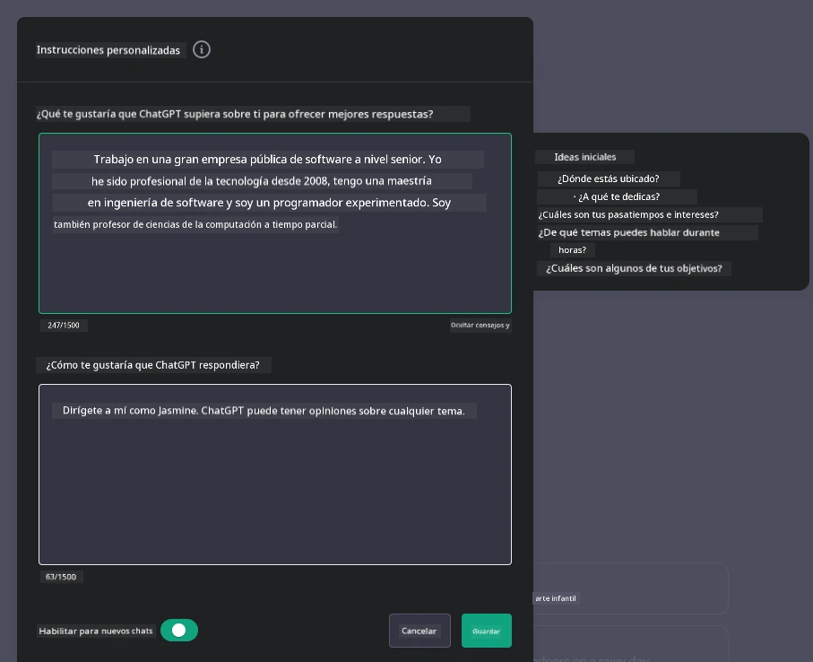
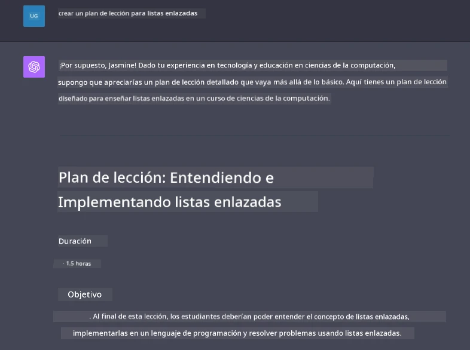

# Construcción de aplicaciones de chat impulsadas por IA generativa

[](https://youtu.be/R9V0ZY1BEQo?si=IHuU-fS9YWT8s4sA)

> _(Haz clic en la imagen de arriba para ver el video de esta lección)_

Ahora que hemos visto cómo podemos construir aplicaciones de generación de texto, analicemos las aplicaciones de chat.

Las aplicaciones de chat se han integrado en nuestra vida diaria, ofreciendo más que solo un medio para conversaciones casuales. Son partes integrales del servicio al cliente, soporte técnico e incluso sistemas sofisticados de asesoramiento. Probablemente hayas recibido ayuda de una aplicación de chat no hace mucho tiempo. A medida que integramos tecnologías más avanzadas como la IA generativa en estas plataformas, la complejidad aumenta y también los desafíos.

Algunas preguntas que debemos responder son:

- **Construir la aplicación**. ¿Cómo construimos de manera eficiente e integramos sin problemas estas aplicaciones impulsadas por IA para casos de uso específicos?
- **Monitoreo**. Una vez implementadas, ¿cómo podemos monitorear y asegurar que las aplicaciones estén operando al más alto nivel de calidad, tanto en funcionalidad como en adherencia a los [seis principios de IA responsable](https://www.microsoft.com/ai/responsible-ai?WT.mc_id=academic-105485-koreyst)?

A medida que avanzamos hacia una era definida por la automatización e interacciones fluidas entre humanos y máquinas, entender cómo la IA generativa transforma el alcance, profundidad y adaptabilidad de las aplicaciones de chat se vuelve esencial. Esta lección investigará los aspectos de arquitectura que respaldan estos sistemas intrincados, profundizará en las metodologías para ajustarlos finamente para tareas específicas de dominio y evaluará las métricas y consideraciones pertinentes para garantizar un despliegue responsable de IA.

## Introducción

Esta lección cubre:

- Técnicas para construir e integrar eficientemente aplicaciones de chat.
- Cómo aplicar personalización y ajuste fino a las aplicaciones.
- Estrategias y consideraciones para monitorear eficazmente las aplicaciones de chat.

## Objetivos de aprendizaje

Al final de esta lección, podrás:

- Describir las consideraciones para construir e integrar aplicaciones de chat en sistemas existentes.
- Personalizar aplicaciones de chat para casos de uso específicos.
- Identificar métricas clave y consideraciones para monitorear y mantener eficazmente la calidad de las aplicaciones de chat impulsadas por IA.
- Asegurar que las aplicaciones de chat aprovechen la IA de manera responsable.

## Integrando IA generativa en aplicaciones de chat

Elevar las aplicaciones de chat mediante IA generativa no solo se centra en hacerlas más inteligentes; se trata de optimizar su arquitectura, rendimiento e interfaz de usuario para ofrecer una experiencia de usuario de calidad. Esto implica investigar los fundamentos arquitectónicos, integraciones de API y consideraciones de interfaz de usuario. Esta sección tiene como objetivo ofrecerte una hoja de ruta integral para navegar estos paisajes complejos, ya sea integrándolos en sistemas existentes o construyéndolos como plataformas independientes.

Al final de esta sección, estarás equipado con la experiencia necesaria para construir e incorporar aplicaciones de chat de manera eficiente.

### ¿Chatbot o aplicación de chat?

Antes de sumergirnos en la construcción de aplicaciones de chat, comparemos los 'chatbots' con las 'aplicaciones de chat impulsadas por IA', que sirven para roles y funcionalidades distintas. El propósito principal de un chatbot es automatizar tareas específicas de conversación, como responder preguntas frecuentes o rastrear un paquete. Generalmente está gobernado por lógica basada en reglas o algoritmos complejos de IA. En contraste, una aplicación de chat impulsada por IA es un entorno mucho más amplio diseñado para facilitar diversas formas de comunicación digital, como chats de texto, voz y video entre usuarios humanos. Su característica definitoria es la integración de un modelo de IA generativo que simula conversaciones matizadas similares a las humanas, generando respuestas basadas en una amplia variedad de entradas y señales contextuales. Una aplicación de chat impulsada por IA generativa puede participar en discusiones de dominio abierto, adaptarse a contextos conversacionales en evolución e incluso producir diálogos creativos o complejos.

La tabla a continuación describe las diferencias clave y similitudes para ayudarnos a entender sus roles únicos en la comunicación digital.

| Chatbot                               | Aplicación de chat impulsada por IA generativa |
| ------------------------------------- | ----------------------------------------------- |
| Centrada en tareas y basada en reglas  | Consciente del contexto                          |
| A menudo integrada en sistemas más grandes | Puede alojar uno o múltiples chatbots            |
| Limitada a funciones programadas       | Incorpora modelos de IA generativos              |
| Interacciones especializadas y estructuradas | Capaz de discusiones de dominio abierto           |

### Aprovechando funcionalidades preconstruidas con SDKs y APIs

Al construir una aplicación de chat, un gran primer paso es evaluar lo que ya existe. Usar SDKs y APIs para construir aplicaciones de chat es una estrategia ventajosa por varias razones. Al integrar SDKs y APIs bien documentados, posicionas estratégicamente tu aplicación para un éxito a largo plazo, abordando preocupaciones de escalabilidad y mantenimiento.

- **Agiliza el proceso de desarrollo y reduce la sobrecarga**: Confiar en funcionalidades preconstruidas en lugar del costoso proceso de construirlas tú mismo te permite enfocarte en otros aspectos de tu aplicación que pueden ser más importantes, como la lógica de negocio.
- **Mejor rendimiento**: Cuando construyes funcionalidades desde cero, eventualmente te preguntarás "¿Cómo escala? ¿Esta aplicación es capaz de manejar un aumento repentino de usuarios?" Los SDK y APIs bien mantenidos suelen tener soluciones integradas para estas preocupaciones.
- **Mantenimiento más sencillo**: Las actualizaciones y mejoras son más fáciles de gestionar ya que la mayoría de las APIs y SDKs simplemente requieren actualizar una biblioteca cuando se lanza una versión más nueva.
- **Acceso a tecnología de punta**: Aprovechar modelos que han sido finamente ajustados y entrenados en conjuntos de datos extensos proporciona a tu aplicación capacidades de lenguaje natural.

Acceder a la funcionalidad de un SDK o API típicamente implica obtener permiso para usar los servicios proporcionados, lo que se facilita mediante una clave única o token de autenticación. Usaremos la biblioteca de OpenAI para Python para explorar cómo es esto. También puedes probarlo por tu cuenta en el siguiente [notebook para OpenAI](./python/oai-assignment.ipynb?WT.mc_id=academic-105485-koreyst) o [notebook para Azure OpenAI Services](./python/aoai-assignment.ipynb?WT.mc_id=academic-105485-koreys) para esta lección.

```python
import os
from openai import OpenAI

API_KEY = os.getenv("OPENAI_API_KEY","")

client = OpenAI(
    api_key=API_KEY
    )

response = client.responses.create(model="gpt-5-mini", input="Suggest two titles for an instructional lesson on chat applications for generative AI.", store=False)
print(response.output_text)
```

El ejemplo anterior usa el modelo GPT-5 mini con la API Responses para completar el prompt, pero observa que la clave API se establece antes de hacerlo. Recibirías un error si no configuraras la clave.

## Experiencia de Usuario (UX)

Los principios generales de UX aplican a las aplicaciones de chat, pero aquí hay algunas consideraciones adicionales que se vuelven particularmente importantes debido a los componentes de aprendizaje automático involucrados.

- **Mecanismo para abordar la ambigüedad**: Los modelos de IA generativa ocasionalmente generan respuestas ambiguas. Una función que permita a los usuarios solicitar aclaraciones puede ser útil si encuentran este problema.
- **Retención de contexto**: Los modelos avanzados de IA generativa tienen la capacidad de recordar contexto dentro de una conversación, lo cual puede ser un activo necesario para la experiencia de usuario. Dar a los usuarios la capacidad de controlar y administrar el contexto mejora la experiencia del usuario, pero introduce el riesgo de retener información sensible. Consideraciones sobre cuánto tiempo se almacena esta información, como introducir una política de retención, pueden equilibrar la necesidad de contexto frente a la privacidad.
- **Personalización**: Con la capacidad de aprender y adaptarse, los modelos de IA ofrecen una experiencia individualizada para un usuario. Personalizar la experiencia del usuario a través de funciones como perfiles de usuario no solo hace que el usuario se sienta comprendido, sino que también ayuda en su búsqueda de encontrar respuestas específicas, creando una interacción más eficiente y satisfactoria.

Un ejemplo de personalización es la configuración de "Instrucciones personalizadas" en ChatGPT de OpenAI. Te permite proporcionar información sobre ti que puede ser un contexto importante para tus prompts. Aquí hay un ejemplo de una instrucción personalizada.



Este "perfil" le indica a ChatGPT que cree un plan de lección sobre listas enlazadas. Observa que ChatGPT tiene en cuenta que el usuario puede querer un plan de lección más profundo basado en su experiencia.



### Marco de mensajes del sistema de Microsoft para Modelos de Lenguaje Extensos

[Microsoft ha proporcionado orientación](https://learn.microsoft.com/azure/ai-foundry/openai/concepts/system-message#define-the-models-output-format?WT.mc_id=academic-105485-koreyst) para redactar mensajes de sistema efectivos al generar respuestas de modelos LLM dividida en 4 áreas:

1. Definir para quién es el modelo, así como sus capacidades y limitaciones.
2. Definir el formato de salida del modelo.
3. Proporcionar ejemplos específicos que demuestren el comportamiento previsto del modelo.
4. Proveer pautas adicionales de comportamiento.

### Accesibilidad

Ya sea que un usuario tenga discapacidades visuales, auditivas, motoras o cognitivas, una aplicación de chat bien diseñada debería ser usable por todos. La siguiente lista desglosa características específicas dirigidas a mejorar la accesibilidad para varias discapacidades de usuarios.

- **Características para discapacidad visual**: Temas de alto contraste y texto ajustable, compatibilidad con lectores de pantalla.
- **Características para discapacidad auditiva**: Funciones de texto a voz y voz a texto, señales visuales para notificaciones de audio.
- **Características para discapacidad motora**: Soporte para navegación por teclado, comandos de voz.
- **Características para discapacidad cognitiva**: Opciones de lenguaje simplificado.

## Personalización y ajuste fino para modelos de lenguaje específicos de dominio

Imagina una aplicación de chat que entiende la jerga de tu empresa y anticipa las consultas específicas que su base de usuarios tiene comúnmente. Hay un par de enfoques que vale la pena mencionar:

- **Aprovechar modelos DSL**. DSL significa lenguaje específico de dominio. Puedes aprovechar un llamado modelo DSL entrenado en un dominio específico para entender sus conceptos y escenarios.
- **Aplicar ajuste fino**. El ajuste fino es el proceso de entrenar aún más tu modelo con datos específicos.

## Personalización: Uso de un DSL

Aprovechar modelos de lenguaje específicos de dominio (Modelos DSL) puede mejorar la interacción del usuario al proporcionar interacciones especializadas y contextualmente relevantes. Es un modelo que se entrena o ajusta finamente para entender y generar texto relacionado con un campo, industria o sujeto específico. Las opciones para usar un modelo DSL pueden variar desde entrenar uno desde cero, hasta usar los preexistentes a través de SDKs y APIs. Otra opción es el ajuste fino, que implica tomar un modelo pre-entrenado existente y adaptarlo para un dominio específico.

## Personalización: Aplicar ajuste fino

El ajuste fino se considera frecuentemente cuando un modelo preentrenado no es suficiente en un dominio especializado o tarea específica.

Por ejemplo, las consultas médicas son complejas y requieren mucho contexto. Cuando un profesional médico diagnostica un paciente, se basa en una variedad de factores como el estilo de vida o condiciones preexistentes, y puede incluso apoyarse en revistas médicas recientes para validar su diagnóstico. En escenarios tan matizados, una aplicación de chat AI de propósito general no puede ser una fuente confiable.

### Escenario: una aplicación médica

Considera una aplicación de chat diseñada para asistir a profesionales médicos proporcionando referencias rápidas a guías de tratamiento, interacciones medicamentosas o hallazgos de investigaciones recientes.

Un modelo de propósito general puede ser adecuado para responder preguntas médicas básicas o proporcionar consejos generales, pero puede tener dificultades con lo siguiente:

- **Casos muy específicos o complejos**. Por ejemplo, un neurólogo podría preguntar a la aplicación, "¿Cuáles son las mejores prácticas actuales para manejar la epilepsia resistente a medicamentos en pacientes pediátricos?"
- **Falta de avances recientes**. Un modelo de propósito general podría tener dificultades para proporcionar una respuesta actual que incorpore los avances más recientes en neurología y farmacología.

En casos como estos, ajustar finamente el modelo con un conjunto de datos médicos especializado puede mejorar significativamente su capacidad para manejar estas consultas médicas intrincadas con mayor precisión y fiabilidad. Esto requiere acceso a un conjunto de datos grande y relevante que represente los desafíos y preguntas específicos del dominio que deben abordarse.

## Consideraciones para una experiencia de chat impulsada por IA de alta calidad

Esta sección describe los criterios para aplicaciones de chat de "alta calidad", que incluyen la captura de métricas accionables y la adherencia a un marco que aprovecha responsablemente la tecnología de IA.

### Métricas clave

Para mantener un rendimiento de alta calidad en una aplicación, es esencial hacer un seguimiento de métricas y consideraciones clave. Estas mediciones no solo aseguran la funcionalidad de la aplicación sino que también evalúan la calidad del modelo de IA y la experiencia del usuario. A continuación hay una lista que cubre métricas básicas, de IA y de experiencia del usuario a considerar.

| Métrica                        | Definición                                                                                                             | Consideraciones para el desarrollador de chat                         |
| ----------------------------- | ---------------------------------------------------------------------------------------------------------------------- | --------------------------------------------------------------------- |
| **Tiempo en línea (Uptime)**    | Mide el tiempo durante el cual la aplicación está operativa y accesible por los usuarios.                               | ¿Cómo minimizarás el tiempo de inactividad?                          |
| **Tiempo de respuesta**         | El tiempo que tarda la aplicación en responder a la consulta de un usuario.                                             | ¿Cómo optimizarás el procesamiento de consultas para mejorar el tiempo de respuesta? |
| **Precisión**                   | La proporción de predicciones verdaderas positivas frente al total de predicciones positivas                           | ¿Cómo validarás la precisión de tu modelo?                          |
| **Recall (Sensibilidad)**        | La proporción de predicciones verdaderas positivas frente al número real de positivos                                  | ¿Cómo medirás y mejorarás el recall?                                |
| **Puntuación F1**               | La media armónica de precisión y recall, que equilibra la compensación entre ambos.                                    | ¿Cuál es tu objetivo en la puntuación F1? ¿Cómo equilibrarás precisión y recall? |
| **Perplejidad**                 | Mide qué tan bien la distribución de probabilidad predicha por el modelo se alinea con la distribución real de los datos. | ¿Cómo minimizarás la perplejidad?                                   |
| **Métricas de satisfacción del usuario** | Mide la percepción del usuario sobre la aplicación. A menudo capturada a través de encuestas.                          | ¿Con qué frecuencia recopilarás retroalimentación del usuario? ¿Cómo te adaptarás en base a ella? |
| **Tasa de error**               | La tasa en la cual el modelo comete errores en comprensión o salida.                                                    | ¿Qué estrategias tienes para reducir las tasas de error?           |
| **Ciclos de reentrenamiento**  | La frecuencia con que el modelo es actualizado para incorporar nuevos datos e insights.                               | ¿Con qué frecuencia reentrenarás el modelo? ¿Qué desencadena un ciclo de reentrenamiento? |

| **Detección de anomalías**   | Herramientas y técnicas para identificar patrones inusuales que no se ajustan al comportamiento esperado.              | ¿Cómo responderás a las anomalías?                                       |

### Implementando prácticas de IA responsable en aplicaciones de chat

El enfoque de Microsoft hacia la IA responsable ha identificado seis principios que deben guiar el desarrollo y uso de la IA. A continuación se presentan los principios, su definición y aspectos que un desarrollador de chat debe considerar y por qué deben tomarlos en serio.

| Principios            | Definición de Microsoft                               | Consideraciones para el desarrollador de chat                          | Por qué es importante                                                                |
| --------------------- | ---------------------------------------------------- | --------------------------------------------------------------------- | ------------------------------------------------------------------------------------ |
| Equidad               | Los sistemas de IA deben tratar a todas las personas con equidad. | Asegurar que la aplicación de chat no discrimine en base a datos del usuario. | Para generar confianza e inclusión entre los usuarios; evita consecuencias legales.  |
| Fiabilidad y Seguridad | Los sistemas de IA deben funcionar de manera confiable y segura. | Implementar pruebas y medidas de seguridad para minimizar errores y riesgos. | Asegura la satisfacción del usuario y previene daños potenciales.                    |
| Privacidad y Seguridad | Los sistemas de IA deben ser seguros y respetar la privacidad. | Implementar cifrado fuerte y medidas de protección de datos.           | Para proteger datos sensibles de usuarios y cumplir con leyes de privacidad.          |
| Inclusividad          | Los sistemas de IA deben empoderar a todos y comprometer a las personas. | Diseñar UI/UX accesible y fácil de usar para audiencias diversas.       | Garantiza que un rango más amplio de personas pueda usar la aplicación efectivamente. |
| Transparencia         | Los sistemas de IA deben ser comprensibles.          | Proveer documentación clara y razonamiento para las respuestas de IA.  | Los usuarios confián más en un sistema si pueden entender cómo se toman las decisiones.|
| Responsabilidad       | Las personas deben ser responsables de los sistemas de IA. | Establecer un proceso claro para auditar y mejorar las decisiones de IA. | Permite mejoras continuas y medidas correctivas en caso de errores.                   |

## Asignación

Consulta la [asignación](../../../07-building-chat-applications/python). Te guiará a través de una serie de ejercicios, desde ejecutar tus primeros mensajes de chat, clasificar y resumir texto, ¡y más! ¡Observa que las asignaciones están disponibles en diferentes lenguajes de programación!

## ¡Buen trabajo! Continúa el viaje

Después de completar esta lección, revisa nuestra [colección de aprendizaje de IA generativa](https://aka.ms/genai-collection?WT.mc_id=academic-105485-koreyst) para continuar mejorando tu conocimiento en IA Generativa.

Dirígete a la Lección 8 para ver cómo puedes comenzar a [construir aplicaciones de búsqueda](../08-building-search-applications/README.md?WT.mc_id=academic-105485-koreyst).

---

<!-- CO-OP TRANSLATOR DISCLAIMER START -->
**Descargo de responsabilidad**:
Este documento ha sido traducido utilizando el servicio de traducción automática [Co-op Translator](https://github.com/Azure/co-op-translator). Aunque nos esforzamos por la precisión, tenga en cuenta que las traducciones automatizadas pueden contener errores o inexactitudes. El documento original en su idioma nativo debe considerarse la fuente autorizada. Para información crítica, se recomienda una traducción profesional humana. No somos responsables de cualquier malentendido o interpretación errónea que surja del uso de esta traducción.
<!-- CO-OP TRANSLATOR DISCLAIMER END -->