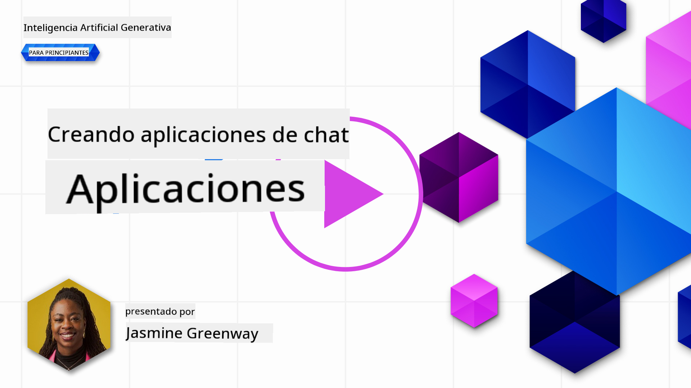
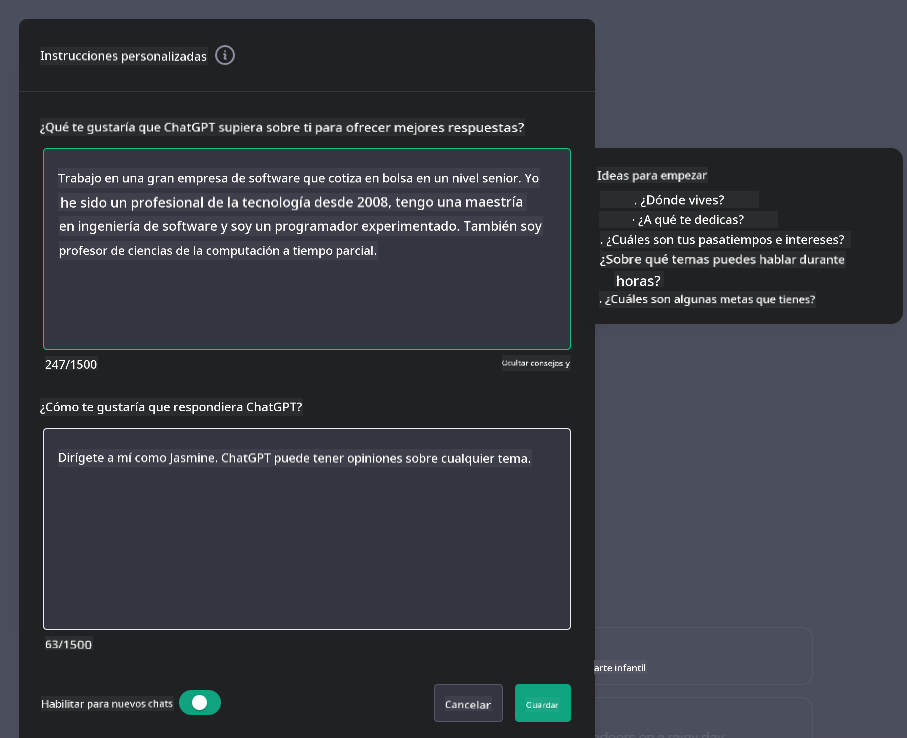

<!--
CO_OP_TRANSLATOR_METADATA:
{
  "original_hash": "ea4bbe640847aafbbba14dae4625e9af",
  "translation_date": "2025-07-09T12:14:33+00:00",
  "source_file": "07-building-chat-applications/README.md",
  "language_code": "es"
}
-->
# Construcción de Aplicaciones de Chat Impulsadas por IA Generativa

[](https://aka.ms/gen-ai-lessons7-gh?WT.mc_id=academic-105485-koreyst)

> _(Haz clic en la imagen de arriba para ver el video de esta lección)_

Ahora que hemos visto cómo construir aplicaciones de generación de texto, veamos las aplicaciones de chat.

Las aplicaciones de chat se han integrado en nuestra vida diaria, ofreciendo más que un medio para conversaciones casuales. Son partes fundamentales del servicio al cliente, soporte técnico e incluso sistemas de asesoría sofisticados. Probablemente hayas recibido ayuda de una aplicación de chat no hace mucho. A medida que integramos tecnologías más avanzadas como la IA generativa en estas plataformas, la complejidad y los desafíos aumentan.

Algunas preguntas que necesitamos responder son:

- **Construcción de la aplicación**. ¿Cómo construir e integrar eficientemente estas aplicaciones impulsadas por IA para casos de uso específicos?
- **Monitoreo**. Una vez desplegadas, ¿cómo podemos supervisar y asegurar que las aplicaciones funcionen con la máxima calidad, tanto en funcionalidad como en el cumplimiento de los [seis principios de IA responsable](https://www.microsoft.com/ai/responsible-ai?WT.mc_id=academic-105485-koreyst)?

A medida que avanzamos hacia una era definida por la automatización y las interacciones fluidas entre humanos y máquinas, entender cómo la IA generativa transforma el alcance, la profundidad y la adaptabilidad de las aplicaciones de chat se vuelve esencial. Esta lección investigará los aspectos arquitectónicos que soportan estos sistemas complejos, profundizará en las metodologías para ajustarlos a tareas específicas de dominio y evaluará las métricas y consideraciones pertinentes para garantizar un despliegue responsable de la IA.

## Introducción

Esta lección cubre:

- Técnicas para construir e integrar aplicaciones de chat de manera eficiente.
- Cómo aplicar personalización y ajuste fino a las aplicaciones.
- Estrategias y consideraciones para monitorear eficazmente las aplicaciones de chat.

## Objetivos de Aprendizaje

Al finalizar esta lección, podrás:

- Describir consideraciones para construir e integrar aplicaciones de chat en sistemas existentes.
- Personalizar aplicaciones de chat para casos de uso específicos.
- Identificar métricas clave y consideraciones para monitorear y mantener la calidad de aplicaciones de chat impulsadas por IA.
- Asegurar que las aplicaciones de chat utilicen la IA de manera responsable.

## Integrando IA Generativa en Aplicaciones de Chat

Elevar las aplicaciones de chat mediante IA generativa no solo se trata de hacerlas más inteligentes; es optimizar su arquitectura, rendimiento e interfaz de usuario para ofrecer una experiencia de calidad. Esto implica investigar las bases arquitectónicas, integraciones API y consideraciones de interfaz. Esta sección busca ofrecerte una hoja de ruta completa para navegar estos complejos escenarios, ya sea integrándolos en sistemas existentes o construyéndolos como plataformas independientes.

Al finalizar esta sección, contarás con la experiencia necesaria para construir e incorporar aplicaciones de chat de manera eficiente.

### ¿Chatbot o aplicación de chat?

Antes de sumergirnos en la construcción de aplicaciones de chat, comparemos 'chatbots' con 'aplicaciones de chat impulsadas por IA', que cumplen roles y funcionalidades distintas. El propósito principal de un chatbot es automatizar tareas conversacionales específicas, como responder preguntas frecuentes o rastrear un paquete. Normalmente se rige por lógica basada en reglas o algoritmos complejos de IA. En contraste, una aplicación de chat impulsada por IA es un entorno mucho más amplio diseñado para facilitar diversas formas de comunicación digital, como chats de texto, voz y video entre usuarios humanos. Su característica definitoria es la integración de un modelo de IA generativa que simula conversaciones matizadas y humanas, generando respuestas basadas en una amplia variedad de entradas y señales contextuales. Una aplicación de chat impulsada por IA generativa puede participar en discusiones de dominio abierto, adaptarse a contextos conversacionales cambiantes e incluso producir diálogos creativos o complejos.

La siguiente tabla destaca las diferencias y similitudes clave para ayudarnos a entender sus roles únicos en la comunicación digital.

| Chatbot                               | Aplicación de Chat Impulsada por IA Generativa |
| ------------------------------------- | ---------------------------------------------- |
| Enfocado en tareas y basado en reglas | Consciente del contexto                         |
| A menudo integrado en sistemas mayores | Puede alojar uno o varios chatbots              |
| Limitado a funciones programadas       | Incorpora modelos de IA generativa              |
| Interacciones especializadas y estructuradas | Capaz de discusiones de dominio abierto          |

### Aprovechando funcionalidades preconstruidas con SDKs y APIs

Al construir una aplicación de chat, un buen primer paso es evaluar qué hay disponible. Usar SDKs y APIs para construir aplicaciones de chat es una estrategia ventajosa por varias razones. Al integrar SDKs y APIs bien documentados, posicionas estratégicamente tu aplicación para el éxito a largo plazo, abordando preocupaciones de escalabilidad y mantenimiento.

- **Agiliza el proceso de desarrollo y reduce la carga**: Confiar en funcionalidades preconstruidas en lugar de construirlas desde cero te permite enfocarte en otros aspectos de tu aplicación que consideres más importantes, como la lógica de negocio.
- **Mejor rendimiento**: Al construir funcionalidades desde cero, eventualmente te preguntarás "¿Cómo escala? ¿Esta aplicación puede manejar un aumento repentino de usuarios?" Los SDKs y APIs bien mantenidos suelen tener soluciones integradas para estas preocupaciones.
- **Mantenimiento más sencillo**: Las actualizaciones y mejoras son más fáciles de gestionar, ya que la mayoría de APIs y SDKs solo requieren actualizar una biblioteca cuando se lanza una versión nueva.
- **Acceso a tecnología de punta**: Aprovechar modelos que han sido ajustados y entrenados con grandes conjuntos de datos proporciona a tu aplicación capacidades avanzadas de lenguaje natural.

Acceder a la funcionalidad de un SDK o API generalmente implica obtener permiso para usar los servicios proporcionados, a menudo mediante una clave única o token de autenticación. Usaremos la Biblioteca Python de OpenAI para explorar cómo es esto. También puedes probarlo por tu cuenta en el siguiente [notebook para OpenAI](python/oai-assignment.ipynb) o [notebook para Azure OpenAI Services](python/aoai-assignment.ipynb) para esta lección.

```python
import os
from openai import OpenAI

API_KEY = os.getenv("OPENAI_API_KEY","")

client = OpenAI(
    api_key=API_KEY
    )

chat_completion = client.chat.completions.create(model="gpt-3.5-turbo", messages=[{"role": "user", "content": "Suggest two titles for an instructional lesson on chat applications for generative AI."}])
```

El ejemplo anterior usa el modelo GPT-3.5 Turbo para completar el prompt, pero observa que la clave API se establece antes de hacerlo. Recibirías un error si no configuraras la clave.

## Experiencia de Usuario (UX)

Los principios generales de UX aplican a las aplicaciones de chat, pero aquí hay algunas consideraciones adicionales que se vuelven especialmente importantes debido a los componentes de aprendizaje automático involucrados.

- **Mecanismo para abordar la ambigüedad**: Los modelos de IA generativa ocasionalmente generan respuestas ambiguas. Una función que permita a los usuarios pedir aclaraciones puede ser útil si se encuentran con este problema.
- **Retención de contexto**: Los modelos avanzados de IA generativa tienen la capacidad de recordar el contexto dentro de una conversación, lo cual puede ser un recurso necesario para la experiencia del usuario. Dar a los usuarios la capacidad de controlar y gestionar el contexto mejora la experiencia, pero introduce el riesgo de retener información sensible. Consideraciones sobre cuánto tiempo se almacena esta información, como implementar una política de retención, pueden equilibrar la necesidad de contexto con la privacidad.
- **Personalización**: Con la capacidad de aprender y adaptarse, los modelos de IA ofrecen una experiencia individualizada para el usuario. Personalizar la experiencia mediante funciones como perfiles de usuario no solo hace que el usuario se sienta comprendido, sino que también ayuda en la búsqueda de respuestas específicas, creando una interacción más eficiente y satisfactoria.

Un ejemplo de personalización es la configuración de "Instrucciones personalizadas" en ChatGPT de OpenAI. Permite proporcionar información sobre ti que puede ser un contexto importante para tus prompts. Aquí tienes un ejemplo de una instrucción personalizada.



Este "perfil" indica a ChatGPT que cree un plan de lección sobre listas enlazadas. Observa que ChatGPT toma en cuenta que el usuario puede querer un plan de lección más profundo basado en su experiencia.


### Marco de Mensajes del Sistema de Microsoft para Modelos de Lenguaje Extensos

[Microsoft ha proporcionado orientación](https://learn.microsoft.com/azure/ai-services/openai/concepts/system-message#define-the-models-output-format?WT.mc_id=academic-105485-koreyst) para redactar mensajes de sistema efectivos al generar respuestas de LLMs, dividida en 4 áreas:

1. Definir para quién es el modelo, así como sus capacidades y limitaciones.
2. Definir el formato de salida del modelo.
3. Proporcionar ejemplos específicos que demuestren el comportamiento esperado del modelo.
4. Proporcionar reglas adicionales de comportamiento.

### Accesibilidad

Ya sea que un usuario tenga discapacidades visuales, auditivas, motoras o cognitivas, una aplicación de chat bien diseñada debe ser usable por todos. La siguiente lista desglosa características específicas destinadas a mejorar la accesibilidad para diversas discapacidades.

- **Características para discapacidad visual**: Temas de alto contraste y texto redimensionable, compatibilidad con lectores de pantalla.
- **Características para discapacidad auditiva**: Funciones de texto a voz y voz a texto, señales visuales para notificaciones de audio.
- **Características para discapacidad motora**: Soporte para navegación por teclado, comandos de voz.
- **Características para discapacidad cognitiva**: Opciones de lenguaje simplificado.

## Personalización y Ajuste Fino para Modelos de Lenguaje Específicos de Dominio

Imagina una aplicación de chat que entiende la jerga de tu empresa y anticipa las consultas específicas que su base de usuarios suele tener. Hay un par de enfoques que vale la pena mencionar:

- **Aprovechar modelos DSL**. DSL significa lenguaje específico de dominio. Puedes usar un modelo DSL entrenado en un dominio específico para entender sus conceptos y escenarios.
- **Aplicar ajuste fino**. El ajuste fino es el proceso de entrenar adicionalmente tu modelo con datos específicos.

## Personalización: Usando un DSL

Aprovechar modelos de lenguaje específicos de dominio (modelos DSL) puede mejorar el compromiso del usuario al proporcionar interacciones especializadas y contextualmente relevantes. Es un modelo entrenado o ajustado para entender y generar texto relacionado con un campo, industria o tema específico. Las opciones para usar un modelo DSL pueden variar desde entrenar uno desde cero hasta usar modelos preexistentes a través de SDKs y APIs. Otra opción es el ajuste fino, que implica tomar un modelo preentrenado existente y adaptarlo para un dominio específico.

## Personalización: Aplicar ajuste fino

El ajuste fino se considera a menudo cuando un modelo preentrenado no es suficiente en un dominio especializado o tarea específica.

Por ejemplo, las consultas médicas son complejas y requieren mucho contexto. Cuando un profesional médico diagnostica a un paciente, se basa en una variedad de factores como estilo de vida o condiciones preexistentes, e incluso puede apoyarse en revistas médicas recientes para validar su diagnóstico. En escenarios tan matizados, una aplicación de chat de IA de propósito general no puede ser una fuente confiable.

### Escenario: una aplicación médica

Considera una aplicación de chat diseñada para asistir a profesionales médicos proporcionando referencias rápidas a guías de tratamiento, interacciones de medicamentos o hallazgos de investigaciones recientes.

Un modelo de propósito general podría ser adecuado para responder preguntas médicas básicas o dar consejos generales, pero podría tener dificultades con lo siguiente:

- **Casos altamente específicos o complejos**. Por ejemplo, un neurólogo podría preguntar a la aplicación: "¿Cuáles son las mejores prácticas actuales para manejar la epilepsia resistente a medicamentos en pacientes pediátricos?"
- **Falta de avances recientes**. Un modelo de propósito general podría tener problemas para proporcionar una respuesta actual que incorpore los avances más recientes en neurología y farmacología.

En casos como estos, ajustar finamente el modelo con un conjunto de datos médicos especializado puede mejorar significativamente su capacidad para manejar estas consultas médicas complejas de manera más precisa y confiable. Esto requiere acceso a un conjunto de datos grande y relevante que represente los desafíos y preguntas específicas del dominio.

## Consideraciones para una Experiencia de Chat Impulsada por IA de Alta Calidad

Esta sección describe los criterios para aplicaciones de chat "de alta calidad", que incluyen la captura de métricas accionables y la adhesión a un marco que aproveche la tecnología de IA de manera responsable.

### Métricas Clave

Para mantener un rendimiento de alta calidad en una aplicación, es esencial monitorear métricas y consideraciones clave. Estas mediciones no solo aseguran la funcionalidad de la aplicación, sino que también evalúan la calidad del modelo de IA y la experiencia del usuario. A continuación, una lista que cubre métricas básicas, de IA y de experiencia de usuario a considerar.

| Métrica                       | Definición                                                                                                             | Consideraciones para el Desarrollador de Chat                         |
| ----------------------------- | ---------------------------------------------------------------------------------------------------------------------- | -------------------------------------------------------------------- |
| **Tiempo de actividad (Uptime)** | Mide el tiempo durante el cual la aplicación está operativa y accesible para los usuarios.                             | ¿Cómo minimizarás el tiempo de inactividad?                          |
| **Tiempo de respuesta**        | Tiempo que tarda la aplicación en responder a la consulta de un usuario.                                               | ¿Cómo optimizarás el procesamiento de consultas para mejorar tiempos? |
| **Precisión**                  | Proporción de predicciones verdaderas positivas respecto al total de predicciones positivas.                          | ¿Cómo validarás la precisión de tu modelo?                          |
| **Recall (Sensibilidad)**      | Proporción de predicciones verdaderas positivas respecto al número real de positivos.                                 | ¿Cómo medirás y mejorarás el recall?                                |
| **Puntaje F1**                 | Media armónica entre precisión y recall, que equilibra el compromiso entre ambos.                                      | ¿Cuál es tu objetivo de Puntaje F1? ¿Cómo equilibrarás precisión y recall? |
| **Perplejidad**                | Mide qué tan bien la distribución de probabilidad predicha por el modelo se alinea con la distribución real de los datos. | ¿Cómo minimizarás la perplejidad?                                   |
| **Métricas de satisfacción del usuario** | Mide la percepción del usuario sobre la aplicación. A menudo se captura mediante encuestas.                        | ¿Con qué frecuencia recopilarás retroalimentación? ¿Cómo te adaptarás a ella? |
| **Tasa de error**              | Tasa a la que el modelo comete errores en la comprensión o salida.                                                    | ¿Qué estrategias tienes para reducir la tasa de errores?            |
| **Ciclos de reentrenamiento** | Frecuencia con la que el modelo se actualiza para incorporar nuevos datos e insights.                                 | ¿Con qué frecuencia reentrenarás el modelo? ¿Qué desencadena un ciclo de reentrenamiento? |
| **Detección de Anomalías**  | Herramientas y técnicas para identificar patrones inusuales que no se ajustan al comportamiento esperado.                  | ¿Cómo responderás a las anomalías?                                         |

### Implementación de Prácticas de IA Responsable en Aplicaciones de Chat

El enfoque de Microsoft hacia la IA Responsable ha identificado seis principios que deben guiar el desarrollo y uso de la IA. A continuación, se presentan los principios, su definición y aspectos que un desarrollador de chat debe considerar, así como la razón por la que deben tomarlos en serio.

| Principios             | Definición de Microsoft                              | Consideraciones para el Desarrollador de Chat                          | Por qué es Importante                                                                |
| ---------------------- | --------------------------------------------------- | --------------------------------------------------------------------- | ------------------------------------------------------------------------------------ |
| Equidad                | Los sistemas de IA deben tratar a todas las personas de manera justa. | Asegurarse de que la aplicación de chat no discrimine según los datos del usuario. | Para generar confianza e inclusión entre los usuarios; evita problemas legales.      |
| Confiabilidad y Seguridad | Los sistemas de IA deben funcionar de manera confiable y segura. | Implementar pruebas y mecanismos de seguridad para minimizar errores y riesgos. | Garantiza la satisfacción del usuario y previene posibles daños.                     |
| Privacidad y Seguridad  | Los sistemas de IA deben ser seguros y respetar la privacidad. | Implementar cifrado fuerte y medidas de protección de datos.          | Para proteger datos sensibles de los usuarios y cumplir con las leyes de privacidad. |
| Inclusión               | Los sistemas de IA deben empoderar a todos y fomentar la participación. | Diseñar una interfaz UI/UX accesible y fácil de usar para audiencias diversas. | Asegura que un mayor número de personas pueda usar la aplicación de manera efectiva. |
| Transparencia           | Los sistemas de IA deben ser comprensibles.         | Proporcionar documentación clara y explicar el razonamiento de las respuestas de la IA. | Los usuarios confían más en un sistema si entienden cómo se toman las decisiones.    |
| Responsabilidad         | Las personas deben ser responsables de los sistemas de IA. | Establecer un proceso claro para auditar y mejorar las decisiones de la IA. | Permite mejoras continuas y medidas correctivas en caso de errores.                  |

## Tarea

Consulta la [tarea](../../../07-building-chat-applications/python) que te guiará a través de una serie de ejercicios, desde ejecutar tus primeros prompts de chat, hasta clasificar y resumir texto, y más. ¡Ten en cuenta que las tareas están disponibles en diferentes lenguajes de programación!

## ¡Buen trabajo! Continúa el camino

Después de completar esta lección, visita nuestra [colección de aprendizaje de IA Generativa](https://aka.ms/genai-collection?WT.mc_id=academic-105485-koreyst) para seguir mejorando tus conocimientos en IA Generativa.

¡Dirígete a la Lección 8 para ver cómo puedes empezar a [construir aplicaciones de búsqueda](../08-building-search-applications/README.md?WT.mc_id=academic-105485-koreyst)!

**Aviso legal**:  
Este documento ha sido traducido utilizando el servicio de traducción automática [Co-op Translator](https://github.com/Azure/co-op-translator). Aunque nos esforzamos por la precisión, tenga en cuenta que las traducciones automáticas pueden contener errores o inexactitudes. El documento original en su idioma nativo debe considerarse la fuente autorizada. Para información crítica, se recomienda la traducción profesional realizada por humanos. No nos hacemos responsables de malentendidos o interpretaciones erróneas derivadas del uso de esta traducción.