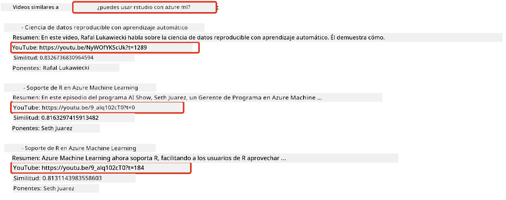
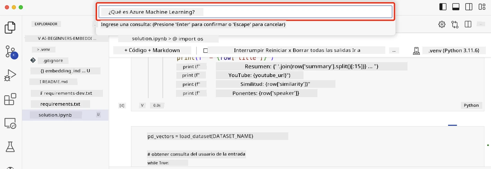

# Construyendo Aplicaciones de Búsqueda

[](https://youtu.be/W0-nzXjOjr0?si=GcsqiTTvd7RKbo7V)

> > _Haz clic en la imagen de arriba para ver el video de esta lección_

Hay más en los LLM que chatbots y generación de texto. También es posible construir aplicaciones de búsqueda usando Embeddings. Los Embeddings son representaciones numéricas de datos también conocidos como vectores, y pueden usarse para búsqueda semántica de datos.

En esta lección, vas a construir una aplicación de búsqueda para nuestra startup educativa. Nuestra startup es una organización sin fines de lucro que proporciona educación gratuita a estudiantes en países en desarrollo. Nuestra startup tiene una gran cantidad de videos en YouTube que los estudiantes pueden usar para aprender sobre IA. Nuestra startup quiere construir una aplicación de búsqueda que permita a los estudiantes buscar un video de YouTube escribiendo una pregunta.

Por ejemplo, un estudiante podría escribir '¿Qué son los Jupyter Notebooks?' o '¿Qué es Azure ML?' y la aplicación de búsqueda devolverá una lista de videos de YouTube que son relevantes para la pregunta, y mejor aún, la aplicación de búsqueda devolverá un enlace al lugar en el video donde se encuentra la respuesta a la pregunta.

## Introducción

En esta lección, cubriremos:

- Búsqueda semántica vs por palabras clave.
- Qué son los Embeddings de Texto.
- Creación de un Índice de Embeddings de Texto.
- Búsqueda en un Índice de Embeddings de Texto.

## Objetivos de Aprendizaje

Al completar esta lección, podrás:

- Diferenciar entre búsqueda semántica y búsqueda por palabras clave.
- Explicar qué son los Embeddings de Texto.
- Crear una aplicación que use Embeddings para buscar datos.

## ¿Por qué construir una aplicación de búsqueda?

Crear una aplicación de búsqueda te ayudará a entender cómo usar Embeddings para buscar datos. También aprenderás a construir una aplicación de búsqueda que pueda ser usada por estudiantes para encontrar información rápidamente.

La lección incluye un Índice de Embeddings de las transcripciones de YouTube del canal [AI Show](https://www.youtube.com/playlist?list=PLlrxD0HtieHi0mwteKBOfEeOYf0LJU4O1) de Microsoft. AI Show es un canal de YouTube que te enseña sobre IA y aprendizaje automático. El Índice de Embeddings contiene los Embeddings de cada una de las transcripciones de YouTube hasta octubre de 2023. Usarás el Índice de Embeddings para construir una aplicación de búsqueda para nuestra startup. La aplicación de búsqueda devuelve un enlace al lugar en el video donde se encuentra la respuesta a la pregunta. Esta es una excelente manera para que los estudiantes encuentren la información que necesitan rápidamente.

El siguiente es un ejemplo de una consulta semántica para la pregunta '¿se puede usar rstudio con azure ml?'. Revisa la URL de YouTube, verás que la URL contiene una marca de tiempo que te lleva al lugar en el video donde se encuentra la respuesta a la pregunta.



## ¿Qué es la búsqueda semántica?

Ahora te estarás preguntando, ¿qué es la búsqueda semántica? La búsqueda semántica es una técnica de búsqueda que usa la semántica, o el significado, de las palabras en una consulta para devolver resultados relevantes.

Aquí tienes un ejemplo de búsqueda semántica. Supongamos que buscas comprar un coche, tal vez busques 'mi coche soñado', la búsqueda semántica entiende que no estás `soñando` con un coche, sino que buscas comprar tu coche `ideal`. La búsqueda semántica entiende tu intención y devuelve resultados relevantes. La alternativa es la `búsqueda por palabra clave` que literalmente buscaría sueños sobre coches y a menudo devuelve resultados irrelevantes.

## ¿Qué son los Embeddings de Texto?

[Los embeddings de texto](https://en.wikipedia.org/wiki/Word_embedding?WT.mc_id=academic-105485-koreyst) son una técnica de representación de texto usada en [procesamiento de lenguaje natural](https://en.wikipedia.org/wiki/Natural_language_processing?WT.mc_id=academic-105485-koreyst). Los embeddings de texto son representaciones numéricas semánticas del texto. Los embeddings se usan para representar datos de una manera que sea fácil de entender para una máquina. Existen muchos modelos para construir embeddings de texto, en esta lección nos centraremos en generar embeddings usando el modelo OpenAI Embedding.

Aquí hay un ejemplo, imagina que el siguiente texto está en una transcripción de uno de los episodios del canal AI Show en YouTube:

```text
Today we are going to learn about Azure Machine Learning.
```

Pasaríamos el texto a la API de OpenAI Embedding y esta devolvería el siguiente embedding consistente en 1536 números, también llamado vector. Cada número en el vector representa un aspecto diferente del texto. Para abreviar, aquí están los primeros 10 números en el vector.

```python
[-0.006655829958617687, 0.0026128944009542465, 0.008792596869170666, -0.02446001023054123, -0.008540431968867779, 0.022071078419685364, -0.010703742504119873, 0.003311325330287218, -0.011632772162556648, -0.02187200076878071, ...]
```

## ¿Cómo se crea el índice de Embeddings?

El índice de Embeddings para esta lección se creó con una serie de scripts en Python. Encontrarás los scripts junto con las instrucciones en el [README](./scripts/README.md?WT.mc_id=academic-105485-koreyst) en la carpeta 'scripts' para esta lección. No necesitas ejecutar estos scripts para completar esta lección ya que el Índice de Embeddings te es proporcionado.

Los scripts realizan las siguientes operaciones:

1. Se descarga la transcripción de cada video de YouTube en la lista de reproducción [AI Show](https://www.youtube.com/playlist?list=PLlrxD0HtieHi0mwteKBOfEeOYf0LJU4O1).
2. Usando las [Funciones de OpenAI](https://learn.microsoft.com/azure/ai-foundry/openai/how-to/function-calling?WT.mc_id=academic-105485-koreyst), se intenta extraer el nombre del hablante de los primeros 3 minutos de la transcripción de YouTube. El nombre del hablante para cada video se almacena en el Índice de Embeddings llamado `embedding_index_3m.json`.
3. Luego, el texto de la transcripción se divide en segmentos de texto de **3 minutos**. El segmento incluye unas 20 palabras superpuestas del siguiente segmento para asegurar que el Embedding del segmento no se corte y para proporcionar mejor contexto de búsqueda.
4. Cada segmento de texto se pasa luego a la API de Chat de OpenAI para resumir el texto en 60 palabras. El resumen también se almacena en el Índice de Embeddings `embedding_index_3m.json`.
5. Finalmente, el texto del segmento se pasa a la API de Embeddings de OpenAI. La API de Embeddings devuelve un vector de 1536 números que representan el significado semántico del segmento. El segmento junto con el vector de Embeddings de OpenAI se almacenan en un Índice de Embeddings `embedding_index_3m.json`.

### Bases de datos vectoriales

Para simplificar la lección, el Índice de Embeddings se almacena en un archivo JSON llamado `embedding_index_3m.json` y se carga en un DataFrame de Pandas. Sin embargo, en producción, el Índice de Embeddings se almacenaría en una base de datos vectorial como [Azure Cognitive Search](https://learn.microsoft.com/training/modules/improve-search-results-vector-search?WT.mc_id=academic-105485-koreyst), [Redis](https://cookbook.openai.com/examples/vector_databases/redis/readme?WT.mc_id=academic-105485-koreyst), [Pinecone](https://cookbook.openai.com/examples/vector_databases/pinecone/readme?WT.mc_id=academic-105485-koreyst), [Weaviate](https://cookbook.openai.com/examples/vector_databases/weaviate/readme?WT.mc_id=academic-105485-koreyst), por nombrar solo algunas.

## Entendiendo la similitud coseno

Hemos aprendido sobre embeddings de texto, el siguiente paso es aprender cómo usarlos para buscar datos y en particular encontrar los embeddings más similares a una consulta dada usando similitud coseno.

### ¿Qué es la similitud coseno?

La similitud coseno es una medida de similitud entre dos vectores, también se le denomina `búsqueda del vecino más cercano`. Para realizar una búsqueda por similitud coseno necesitas _vectorizar_ el texto de la _consulta_ usando la API de Embeddings de OpenAI. Luego calcular la _similitud coseno_ entre el vector de la consulta y cada vector en el Índice de Embeddings. Recuerda, el Índice de Embeddings tiene un vector para cada segmento de texto de la transcripción de YouTube. Finalmente, ordena los resultados por similitud coseno, y los segmentos de texto con la similitud coseno más alta son los más similares a la consulta.

Desde una perspectiva matemática, la similitud coseno mide el coseno del ángulo entre dos vectores proyectados en un espacio multidimensional. Esta medición es beneficiosa, porque si dos documentos están lejos en distancia Euclidiana por tamaño, aún podrían tener un ángulo más pequeño entre ellos y por lo tanto una similitud coseno más alta. Para más información sobre ecuaciones de similitud coseno, consulta [Similitud coseno](https://en.wikipedia.org/wiki/Cosine_similarity?WT.mc_id=academic-105485-koreyst).

## Construyendo tu primera aplicación de búsqueda

A continuación, vamos a aprender cómo construir una aplicación de búsqueda usando Embeddings. La aplicación de búsqueda permitirá a los estudiantes buscar un video escribiendo una pregunta. La aplicación de búsqueda devolverá una lista de videos que son relevantes para la pregunta. La aplicación de búsqueda también devolverá un enlace al lugar en el video donde se encuentra la respuesta a la pregunta.

Esta solución se construyó y probó en Windows 11, macOS y Ubuntu 22.04 usando Python 3.10 o posterior. Puedes descargar Python desde [python.org](https://www.python.org/downloads/?WT.mc_id=academic-105485-koreyst).

## Tarea - construir una aplicación de búsqueda para habilitar a los estudiantes

Presentamos nuestra startup al inicio de esta lección. Ahora es momento de permitir que los estudiantes construyan una aplicación de búsqueda para sus evaluaciones.

En esta tarea, crearás los Servicios Azure OpenAI que se usarán para construir la aplicación de búsqueda. Crearás los siguientes Servicios Azure OpenAI. Necesitarás una suscripción a Azure para completar esta tarea.

### Iniciar la Azure Cloud Shell

1. Inicia sesión en el [portal de Azure](https://portal.azure.com/?WT.mc_id=academic-105485-koreyst).
2. Selecciona el ícono de Cloud Shell en la esquina superior derecha del portal de Azure.
3. Selecciona **Bash** para el tipo de entorno.

#### Crear un grupo de recursos

> Para estas instrucciones, usamos el grupo de recursos llamado "semantic-video-search" en East US.
> Puedes cambiar el nombre del grupo de recursos, pero al cambiar la ubicación de los recursos,
> revisa la [tabla de disponibilidad de modelos](https://aka.ms/oai/models?WT.mc_id=academic-105485-koreyst).

```shell
az group create --name semantic-video-search --location eastus
```

#### Crear un recurso Azure OpenAI Service

Desde la Azure Cloud Shell, ejecuta el siguiente comando para crear un recurso Azure OpenAI Service.

```shell
az cognitiveservices account create --name semantic-video-openai --resource-group semantic-video-search \
    --location eastus --kind OpenAI --sku s0
```

#### Obtener el endpoint y las claves para su uso en esta aplicación

Desde la Azure Cloud Shell, ejecuta los siguientes comandos para obtener el endpoint y las claves para el recurso Azure OpenAI Service.

```shell
az cognitiveservices account show --name semantic-video-openai \
   --resource-group  semantic-video-search | jq -r .properties.endpoint
az cognitiveservices account keys list --name semantic-video-openai \
   --resource-group semantic-video-search | jq -r .key1
```

#### Desplegar el modelo OpenAI Embedding

Desde la Azure Cloud Shell, ejecuta el siguiente comando para desplegar el modelo OpenAI Embedding.

```shell
az cognitiveservices account deployment create \
    --name semantic-video-openai \
    --resource-group  semantic-video-search \
    --deployment-name text-embedding-ada-002 \
    --model-name text-embedding-ada-002 \
    --model-version "2"  \
    --model-format OpenAI \
    --sku-capacity 100 --sku-name "Standard"
```

## Solución

Abre el [notebook de la solución](./python/aoai-solution.ipynb?WT.mc_id=academic-105485-koreyst) en GitHub Codespaces y sigue las instrucciones en el Jupyter Notebook.

Cuando ejecutes el notebook, se te pedirá que ingreses una consulta. La caja de entrada se verá así:



## ¡Excelente trabajo! Continúa tu aprendizaje

Después de completar esta lección, consulta nuestra [colección de aprendizaje de IA Generativa](https://aka.ms/genai-collection?WT.mc_id=academic-105485-koreyst) para seguir mejorando tu conocimiento en IA Generativa.

Dirígete a la Lección 9 donde veremos cómo [construir aplicaciones de generación de imágenes](../09-building-image-applications/README.md?WT.mc_id=academic-105485-koreyst)!

---

<!-- CO-OP TRANSLATOR DISCLAIMER START -->
**Descargo de responsabilidad**:
Este documento ha sido traducido utilizando el servicio de traducción automática [Co-op Translator](https://github.com/Azure/co-op-translator). Aunque nos esforzamos por la precisión, tenga en cuenta que las traducciones automatizadas pueden contener errores o inexactitudes. El documento original en su idioma nativo debe considerarse la fuente autorizada. Para información crítica, se recomienda una traducción profesional humana. No somos responsables de cualquier malentendido o interpretación errónea que surja del uso de esta traducción.
<!-- CO-OP TRANSLATOR DISCLAIMER END -->