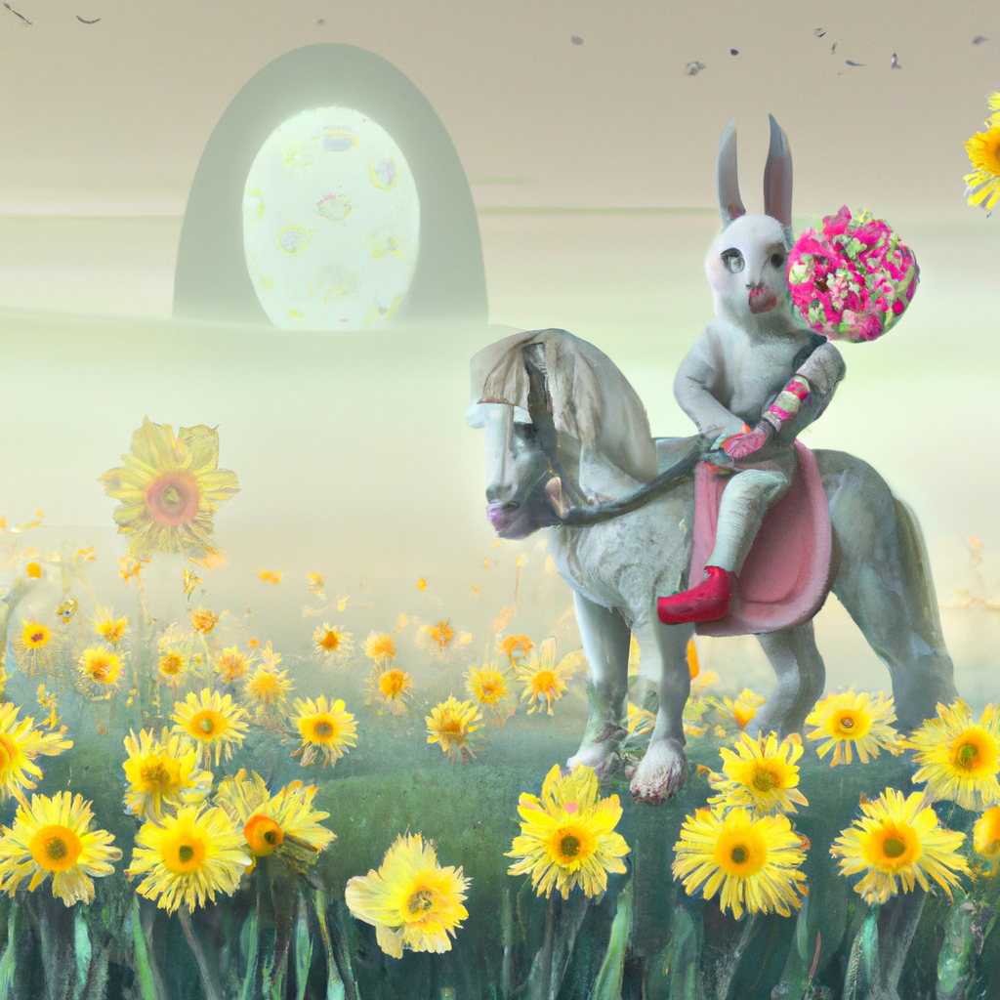

<!--
CO_OP_TRANSLATOR_METADATA:
{
  "original_hash": "ef74ad58fc01f7ad80788f79505f9816",
  "translation_date": "2025-08-26T13:40:32+00:00",
  "source_file": "09-building-image-applications/README.md",
  "language_code": "es"
}
-->
# Creando Aplicaciones de Generación de Imágenes

[](https://aka.ms/gen-ai-lesson9-gh?WT.mc_id=academic-105485-koreyst)

Los LLMs no solo sirven para generar texto. También es posible crear imágenes a partir de descripciones en texto. Contar con imágenes como modalidad puede ser muy útil en áreas como tecnología médica, arquitectura, turismo, desarrollo de videojuegos y más. En este capítulo, veremos los dos modelos de generación de imágenes más populares: DALL-E y Midjourney.

## Introducción

En esta lección, cubriremos:

- Generación de imágenes y por qué es útil.
- DALL-E y Midjourney, qué son y cómo funcionan.
- Cómo construir una aplicación de generación de imágenes.

## Objetivos de Aprendizaje

Al finalizar esta lección, podrás:

- Construir una aplicación de generación de imágenes.
- Definir límites para tu aplicación usando metaprompts.
- Trabajar con DALL-E y Midjourney.

## ¿Por qué crear una aplicación de generación de imágenes?

Las aplicaciones de generación de imágenes son una excelente forma de explorar las capacidades de la IA Generativa. Se pueden usar, por ejemplo, para:

- **Edición y síntesis de imágenes**. Puedes generar imágenes para distintos casos de uso, como edición y síntesis de imágenes.

- **Aplicación en diversas industrias**. También pueden usarse para generar imágenes en sectores como tecnología médica, turismo, desarrollo de videojuegos y más.

## Escenario: Edu4All

Como parte de esta lección, continuaremos trabajando con nuestra startup, Edu4All. Los estudiantes crearán imágenes para sus evaluaciones; qué imágenes crear dependerá de ellos, pero podrían ser ilustraciones para su propio cuento de hadas, crear un nuevo personaje para su historia o ayudarles a visualizar sus ideas y conceptos.

Por ejemplo, esto es lo que los estudiantes de Edu4All podrían generar si están trabajando en clase sobre monumentos:


usando un prompt como

> "Perro junto a la Torre Eiffel al amanecer"

## ¿Qué son DALL-E y Midjourney?

[DALL-E](https://openai.com/dall-e-2?WT.mc_id=academic-105485-koreyst) y [Midjourney](https://www.midjourney.com/?WT.mc_id=academic-105485-koreyst) son dos de los modelos de generación de imágenes más populares; permiten usar prompts para crear imágenes.

### DALL-E

Comencemos con DALL-E, que es un modelo de IA Generativa que genera imágenes a partir de descripciones en texto.

> [DALL-E es una combinación de dos modelos, CLIP y atención difusa](https://towardsdatascience.com/openais-dall-e-and-clip-101-a-brief-introduction-3a4367280d4e?WT.mc_id=academic-105485-koreyst).

- **CLIP** es un modelo que genera embeddings, que son representaciones numéricas de datos, a partir de imágenes y texto.

- **Atención difusa** es un modelo que genera imágenes a partir de embeddings. DALL-E se entrena con un conjunto de datos de imágenes y texto y puede usarse para crear imágenes a partir de descripciones en texto. Por ejemplo, DALL-E puede generar imágenes de un gato con sombrero o un perro con cresta.

### Midjourney

Midjourney funciona de manera similar a DALL-E: genera imágenes a partir de prompts en texto. Midjourney también puede usarse para crear imágenes con prompts como “un gato con sombrero” o “un perro con cresta”.


_Crédito de la imagen: Wikipedia, imagen generada por Midjourney_

## ¿Cómo funcionan DALL-E y Midjourney?

Primero, [DALL-E](https://arxiv.org/pdf/2102.12092.pdf?WT.mc_id=academic-105485-koreyst). DALL-E es un modelo de IA Generativa basado en la arquitectura transformer con un _transformer autorregresivo_.

Un _transformer autorregresivo_ define cómo un modelo genera imágenes a partir de descripciones en texto: genera un píxel a la vez y luego usa los píxeles generados para crear el siguiente. Pasa por varias capas en una red neuronal hasta que la imagen está completa.

Con este proceso, DALL-E controla atributos, objetos, características y más en la imagen que genera. Sin embargo, DALL-E 2 y 3 ofrecen aún más control sobre la imagen generada.

## Construyendo tu primera aplicación de generación de imágenes

Entonces, ¿qué se necesita para crear una aplicación de generación de imágenes? Necesitas las siguientes librerías:

- **python-dotenv**, se recomienda mucho usar esta librería para mantener tus secretos en un archivo _.env_ separado del código.
- **openai**, esta librería te permite interactuar con la API de OpenAI.
- **pillow**, para trabajar con imágenes en Python.
- **requests**, para ayudarte a hacer solicitudes HTTP.

## Crear y desplegar un modelo de Azure OpenAI

Si aún no lo has hecho, sigue las instrucciones en la página de [Microsoft Learn](https://learn.microsoft.com/azure/ai-foundry/openai/how-to/create-resource?pivots=web-portal)
para crear un recurso y modelo de Azure OpenAI. Selecciona DALL-E 3 como modelo.

## Crear la aplicación

1. Crea un archivo _.env_ con el siguiente contenido:

   ```text
   AZURE_OPENAI_ENDPOINT=<your endpoint>
   AZURE_OPENAI_API_KEY=<your key>
   AZURE_OPENAI_DEPLOYMENT="dall-e-3"
   ```

   Puedes encontrar esta información en el Portal de Azure OpenAI Foundry para tu recurso, en la sección "Deployments".

1. Reúne las librerías anteriores en un archivo llamado _requirements.txt_ así:

   ```text
   python-dotenv
   openai
   pillow
   requests
   ```

1. Luego, crea un entorno virtual e instala las librerías:

   ```bash
   python3 -m venv venv
   source venv/bin/activate
   pip install -r requirements.txt
   ```

   Para Windows, usa los siguientes comandos para crear y activar tu entorno virtual:

   ```bash
   python3 -m venv venv
   venv\Scripts\activate.bat
   ```

1. Agrega el siguiente código en un archivo llamado _app.py_:

    ```python
    import openai
    import os
    import requests
    from PIL import Image
    import dotenv
    from openai import OpenAI, AzureOpenAI
    
    # import dotenv
    dotenv.load_dotenv()
    
    # configure Azure OpenAI service client 
    client = AzureOpenAI(
      azure_endpoint = os.environ["AZURE_OPENAI_ENDPOINT"],
      api_key=os.environ['AZURE_OPENAI_API_KEY'],
      api_version = "2024-02-01"
      )
    try:
        # Create an image by using the image generation API
        generation_response = client.images.generate(
                                prompt='Bunny on horse, holding a lollipop, on a foggy meadow where it grows daffodils',
                                size='1024x1024', n=1,
                                model=os.environ['AZURE_OPENAI_DEPLOYMENT']
                              )

        # Set the directory for the stored image
        image_dir = os.path.join(os.curdir, 'images')

        # If the directory doesn't exist, create it
        if not os.path.isdir(image_dir):
            os.mkdir(image_dir)

        # Initialize the image path (note the filetype should be png)
        image_path = os.path.join(image_dir, 'generated-image.png')

        # Retrieve the generated image
        image_url = generation_response.data[0].url  # extract image URL from response
        generated_image = requests.get(image_url).content  # download the image
        with open(image_path, "wb") as image_file:
            image_file.write(generated_image)

        # Display the image in the default image viewer
        image = Image.open(image_path)
        image.show()

    # catch exceptions
    except openai.InvalidRequestError as err:
        print(err)
   ```

Vamos a explicar este código:

- Primero, importamos las librerías necesarias, incluyendo la librería de OpenAI, dotenv, requests y Pillow.

  ```python
  import openai
  import os
  import requests
  from PIL import Image
  import dotenv
  ```

- Luego, cargamos las variables de entorno desde el archivo _.env_.

  ```python
  # import dotenv
  dotenv.load_dotenv()
  ```

- Después, configuramos el cliente del servicio Azure OpenAI

  ```python
  # Get endpoint and key from environment variables
  client = AzureOpenAI(
      azure_endpoint = os.environ["AZURE_OPENAI_ENDPOINT"],
      api_key=os.environ['AZURE_OPENAI_API_KEY'],
      api_version = "2024-02-01"
      )
  ```

- A continuación, generamos la imagen:

  ```python
  # Create an image by using the image generation API
  generation_response = client.images.generate(
                        prompt='Bunny on horse, holding a lollipop, on a foggy meadow where it grows daffodils',
                        size='1024x1024', n=1,
                        model=os.environ['AZURE_OPENAI_DEPLOYMENT']
                      )
  ```

  El código anterior responde con un objeto JSON que contiene la URL de la imagen generada. Podemos usar la URL para descargar la imagen y guardarla en un archivo.

- Por último, abrimos la imagen y usamos el visor de imágenes estándar para mostrarla:

  ```python
  image = Image.open(image_path)
  image.show()
  ```

### Más detalles sobre la generación de la imagen

Veamos el código que genera la imagen con más detalle:

    ```python
      generation_response = client.images.generate(
                                prompt='Bunny on horse, holding a lollipop, on a foggy meadow where it grows daffodils',
                                size='1024x1024', n=1,
                                model=os.environ['AZURE_OPENAI_DEPLOYMENT']
                            )
    ```

- **prompt** es el texto que se usa para generar la imagen. En este caso, usamos el prompt "Conejo sobre un caballo, sosteniendo una paleta, en un prado con niebla donde crecen narcisos".
- **size** es el tamaño de la imagen generada. En este caso, generamos una imagen de 1024x1024 píxeles.
- **n** es la cantidad de imágenes generadas. En este caso, generamos dos imágenes.
- **temperature** es un parámetro que controla el grado de aleatoriedad en la salida de un modelo de IA Generativa. El valor de temperature va de 0 a 1, donde 0 significa que la salida es determinista y 1 que es aleatoria. El valor por defecto es 0.7.

Hay más cosas que puedes hacer con imágenes, que veremos en la siguiente sección.

## Capacidades adicionales de la generación de imágenes

Ya viste cómo pudimos generar una imagen con unas pocas líneas en Python. Sin embargo, hay más cosas que puedes hacer con imágenes.

También puedes hacer lo siguiente:

- **Realizar ediciones**. Proporcionando una imagen existente, una máscara y un prompt, puedes modificar una imagen. Por ejemplo, puedes agregar algo a una parte de la imagen. Imagina nuestra imagen del conejo: puedes ponerle un sombrero al conejo. Para hacerlo, proporcionas la imagen, una máscara (que identifica la zona a cambiar) y un prompt de texto que indique qué se debe hacer.
> Nota: esto no está soportado en DALL-E 3.

Aquí tienes un ejemplo usando GPT Image:

    ```python
    response = client.images.edit(
        model="gpt-image-1",
        image=open("sunlit_lounge.png", "rb"),
        mask=open("mask.png", "rb"),
        prompt="A sunlit indoor lounge area with a pool containing a flamingo"
    )
    image_url = response.data[0].url
    ```

  La imagen base solo tendría la sala con piscina, pero la imagen final tendría un flamenco:

<div style="display: flex; justify-content: space-between; align-items: center; margin: 20px 0;">
  
  
  
</div>

- **Crear variaciones**. La idea es tomar una imagen existente y pedir que se creen variaciones. Para crear una variación, proporcionas una imagen y un prompt de texto, y el código sería así:

  ```python
  response = openai.Image.create_variation(
    image=open("bunny-lollipop.png", "rb"),
    n=1,
    size="1024x1024"
  )
  image_url = response['data'][0]['url']
  ```

  > Nota: esto solo está soportado en OpenAI

## Temperature

Temperature es un parámetro que controla el grado de aleatoriedad en la salida de un modelo de IA Generativa. El valor de temperature va de 0 a 1, donde 0 significa que la salida es determinista y 1 que es aleatoria. El valor por defecto es 0.7.

Veamos un ejemplo de cómo funciona temperature, ejecutando este prompt dos veces:

> Prompt: "Conejo sobre un caballo, sosteniendo una paleta, en un prado con niebla donde crecen narcisos"


Ahora ejecutemos el mismo prompt para ver que no obtendremos la misma imagen dos veces:


Como puedes ver, las imágenes son similares, pero no iguales. Probemos cambiando el valor de temperature a 0.1 y veamos qué sucede:

```python
 generation_response = client.images.create(
        prompt='Bunny on horse, holding a lollipop, on a foggy meadow where it grows daffodils',    # Enter your prompt text here
        size='1024x1024',
        n=2
    )
```

### Cambiando el temperature

Intentemos hacer la respuesta más determinista. Observamos en las dos imágenes generadas que en la primera hay un conejo y en la segunda un caballo, así que las imágenes varían bastante.

Por eso, cambiemos nuestro código y pongamos el temperature en 0, así:

```python
generation_response = client.images.create(
        prompt='Bunny on horse, holding a lollipop, on a foggy meadow where it grows daffodils',    # Enter your prompt text here
        size='1024x1024',
        n=2,
        temperature=0
    )
```

Ahora, al ejecutar este código, obtienes estas dos imágenes:

- 
- 

Aquí puedes ver claramente cómo las imágenes se parecen mucho más entre sí.

## Cómo definir límites para tu aplicación con metaprompts

Con nuestra demo, ya podemos generar imágenes para nuestros clientes. Sin embargo, necesitamos establecer ciertos límites para nuestra aplicación.

Por ejemplo, no queremos generar imágenes que no sean aptas para el trabajo o que no sean apropiadas para niños.

Esto lo podemos lograr con _metaprompts_. Los metaprompts son textos que se usan para controlar la salida de un modelo de IA Generativa. Por ejemplo, podemos usar metaprompts para asegurarnos de que las imágenes generadas sean aptas para el trabajo o adecuadas para niños.

### ¿Cómo funciona?

Ahora, ¿cómo funcionan los metaprompts?

Los metaprompts son textos que se usan para controlar la salida de un modelo de IA Generativa. Se colocan antes del prompt principal y se usan para controlar la salida del modelo, integrándose en las aplicaciones para controlar el resultado. Se encapsula el prompt de entrada y el metaprompt en un solo texto.

Un ejemplo de metaprompt sería el siguiente:

```text
You are an assistant designer that creates images for children.

The image needs to be safe for work and appropriate for children.

The image needs to be in color.

The image needs to be in landscape orientation.

The image needs to be in a 16:9 aspect ratio.

Do not consider any input from the following that is not safe for work or appropriate for children.

(Input)

```

Ahora, veamos cómo podemos usar metaprompts en nuestra demo.

```python
disallow_list = "swords, violence, blood, gore, nudity, sexual content, adult content, adult themes, adult language, adult humor, adult jokes, adult situations, adult"

meta_prompt =f"""You are an assistant designer that creates images for children.

The image needs to be safe for work and appropriate for children.

The image needs to be in color.

The image needs to be in landscape orientation.

The image needs to be in a 16:9 aspect ratio.

Do not consider any input from the following that is not safe for work or appropriate for children.
{disallow_list}
"""

prompt = f"{meta_prompt}
Create an image of a bunny on a horse, holding a lollipop"

# TODO add request to generate image
```

En el prompt anterior, puedes ver cómo todas las imágenes creadas consideran el metaprompt.

## Ejercicio - habilitemos a los estudiantes

Presentamos Edu4All al inicio de esta lección. Ahora es momento de permitir que los estudiantes generen imágenes para sus evaluaciones.

Los estudiantes crearán imágenes para sus evaluaciones que incluyan monumentos; qué monumentos elegirán depende de ellos. Se les pide que usen su creatividad para situar estos monumentos en diferentes contextos.

## Solución

Aquí tienes una posible solución:

```python
import openai
import os
import requests
from PIL import Image
import dotenv
from openai import AzureOpenAI
# import dotenv
dotenv.load_dotenv()

# Get endpoint and key from environment variables
client = AzureOpenAI(
  azure_endpoint = os.environ["AZURE_OPENAI_ENDPOINT"],
  api_key=os.environ['AZURE_OPENAI_API_KEY'],
  api_version = "2024-02-01"
  )


disallow_list = "swords, violence, blood, gore, nudity, sexual content, adult content, adult themes, adult language, adult humor, adult jokes, adult situations, adult"

meta_prompt = f"""You are an assistant designer that creates images for children.

The image needs to be safe for work and appropriate for children.

The image needs to be in color.

The image needs to be in landscape orientation.

The image needs to be in a 16:9 aspect ratio.

Do not consider any input from the following that is not safe for work or appropriate for children.
{disallow_list}
"""

prompt = f"""{meta_prompt}
Generate monument of the Arc of Triumph in Paris, France, in the evening light with a small child holding a Teddy looks on.
""""

try:
    # Create an image by using the image generation API
    generation_response = client.images.generate(
        prompt=prompt,    # Enter your prompt text here
        size='1024x1024',
        n=1,
    )
    # Set the directory for the stored image
    image_dir = os.path.join(os.curdir, 'images')

    # If the directory doesn't exist, create it
    if not os.path.isdir(image_dir):
        os.mkdir(image_dir)

    # Initialize the image path (note the filetype should be png)
    image_path = os.path.join(image_dir, 'generated-image.png')

    # Retrieve the generated image
    image_url = generation_response.data[0].url  # extract image URL from response
    generated_image = requests.get(image_url).content  # download the image
    with open(image_path, "wb") as image_file:
        image_file.write(generated_image)

    # Display the image in the default image viewer
    image = Image.open(image_path)
    image.show()

# catch exceptions
except openai.BadRequestError as err:
    print(err)
```

## ¡Buen trabajo! Continúa aprendiendo
Después de terminar esta lección, visita nuestra [colección de aprendizaje sobre IA generativa](https://aka.ms/genai-collection?WT.mc_id=academic-105485-koreyst) para seguir mejorando tus conocimientos sobre IA generativa.

Dirígete a la Lección 10 donde veremos cómo [crear aplicaciones de IA con poco código](../10-building-low-code-ai-applications/README.md?WT.mc_id=academic-105485-koreyst)

---

**Descargo de responsabilidad**:  
Este documento ha sido traducido utilizando el servicio de traducción por IA [Co-op Translator](https://github.com/Azure/co-op-translator). Si bien nos esforzamos por lograr precisión, tenga en cuenta que las traducciones automáticas pueden contener errores o inexactitudes. El documento original en su idioma nativo debe considerarse la fuente autorizada. Para información crítica, se recomienda la traducción profesional humana. No nos hacemos responsables de cualquier malentendido o interpretación incorrecta que surja del uso de esta traducción.