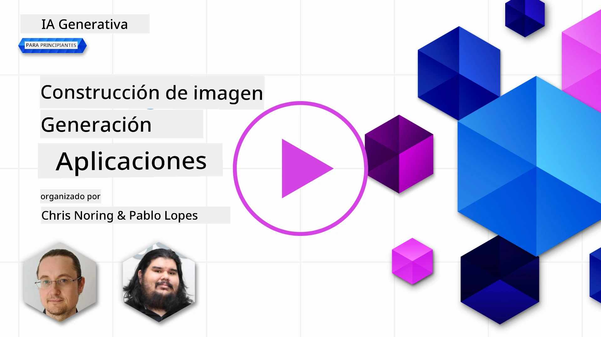

# Construyendo aplicaciones de generación de imágenes

[](https://aka.ms/gen-ai-lesson9-gh?WT.mc_id=academic-105485-koreyst)

Hay más en los LLM que la generación de texto. También puedes generar imágenes a partir de descripciones de texto. Las imágenes como modalidad son útiles en MedTech, arquitectura, turismo, desarrollo de juegos, marketing y más. En esta lección revisamos los modelos actuales de **GPT Image** y construimos una aplicación de generación de imágenes.

## Introducción

La generación de imágenes te permite convertir un comando en lenguaje natural en una imagen. En esta lección trabajamos con la familia de modelos **`gpt-image`** de OpenAI, la generación actual de modelos de imagen disponible en **[Microsoft Foundry](https://ai.azure.com?WT.mc_id=academic-105485-koreyst)** y la plataforma OpenAI. Estos modelos reemplazan a los antiguos modelos DALL·E (DALL·E 2/3 son legado).

A lo largo de la lección usamos una startup ficticia, **Edu4All**, que construye herramientas de aprendizaje. El equipo quiere generar ilustraciones para tareas y materiales de estudio.

## Objetivos de aprendizaje

Al final de esta lección podrás:

- Explicar qué es la generación de imágenes y dónde es útil.
- Entender la familia de modelos `gpt-image` y cómo difiere de los modelos heredados DALL·E.
- Construir una aplicación de generación de imágenes en Python (y TypeScript / .NET).
- Editar imágenes y aplicar medidas de seguridad con metaprompts.

## ¿Qué es la generación de imágenes?

Los modelos de generación de imágenes crean imágenes a partir de un comando de texto. Los modelos modernos como `gpt-image` se basan en técnicas de transformadores + difusión: el modelo aprende la relación entre texto e imágenes durante el entrenamiento y luego, dado un comando, iterativamente "limpia el ruido" aleatorio para formar una imagen que coincide con la descripción.

Dos familias bien conocidas de modelos de imagen son:

- **`gpt-image` (OpenAI)** - la generación actual, usada en esta lección. Soporta generación de texto a imagen y edición de imágenes (pintura con máscara).
- **Midjourney** - un modelo popular de terceros con su propio servicio y flujo de trabajo basado en Discord.

> Los modelos de imagen más antiguos de OpenAI - **DALL·E 2** y **DALL·E 3** - son legado. DALL·E 3 ya no está disponible para nuevas implementaciones, y características como `create_variation` solo existían en DALL·E 2. Usa los modelos `gpt-image` para aplicaciones nuevas.

### ¿Qué modelo `gpt-image` debería usar?

En Microsoft Foundry los siguientes están **Generalmente Disponibles**:

| Modelo | Notas |
| --- | --- |
| **`gpt-image-2`** | El modelo de imagen más reciente y capaz - recomendado por defecto. |
| `gpt-image-1.5` | Generalmente disponible; buena calidad a menor costo. |
| `gpt-image-1-mini` | Generalmente disponible; el más rápido / menor costo. |
| `gpt-image-1` | Solo vista previa. |

Siempre verifica la actual [lista de modelos de imagen de Foundry](https://learn.microsoft.com/azure/ai-foundry/openai/concepts/models?WT.mc_id=academic-105485-koreyst) para disponibilidad y regiones.

> **Importante:** los modelos `gpt-image` devuelven la imagen generada en **base64** (`b64_json`), no en una URL. Tu código decodifica la cadena base64 a bytes y la guarda; no hay URL de imagen para descargar.

## Configuración

Puedes ejecutar los ejemplos contra **Azure OpenAI en Microsoft Foundry** (los ejemplos `aoai-*`) o la **plataforma OpenAI** (los ejemplos `oai-*`).

### 1. Crear y desplegar un modelo

Sigue la guía de [crear un recurso](https://learn.microsoft.com/azure/ai-foundry/openai/how-to/create-resource?pivots=web-portal&WT.mc_id=academic-105485-koreyst) para crear un recurso de Microsoft Foundry, luego despliega un modelo de imagen - se recomienda **`gpt-image-2`**.

### 2. Configura tu `.env`

```text
AZURE_OPENAI_ENDPOINT=<your endpoint>
AZURE_OPENAI_API_KEY=<your key>
AZURE_OPENAI_DEPLOYMENT="gpt-image-2"
```

Encuentra estos valores en la página de **Despliegues** de tu recurso en el [portal Foundry](https://ai.azure.com?WT.mc_id=academic-105485-koreyst).

### 3. Instala las librerías

Crea un `requirements.txt`:

```text
python-dotenv
openai
pillow
```

Luego crea y activa un entorno virtual e instala:

```bash
python3 -m venv venv
source venv/bin/activate        # Windows: venv\Scripts\activate
pip install -r requirements.txt
```

## Construye la aplicación

Crea `app.py` con el siguiente código. Genera una imagen y la guarda como PNG.

```python
import os
import base64
from openai import AzureOpenAI
from PIL import Image
import dotenv

dotenv.load_dotenv()

# Apunte el cliente a su recurso de Azure OpenAI (Microsoft Foundry).
# Los modelos de imagen necesitan una versión reciente de la API - consulte la documentación de Foundry para conocer la que requiere su modelo.
client = AzureOpenAI(
    api_key=os.environ["AZURE_OPENAI_API_KEY"],
    api_version="2025-04-01-preview",
    azure_endpoint=os.environ["AZURE_OPENAI_ENDPOINT"],
)

deployment = os.environ["AZURE_OPENAI_DEPLOYMENT"]  # p.ej. "gpt-image-2"

result = client.images.generate(
    model=deployment,
    prompt='Bunny on a horse, holding a lollipop, on a foggy meadow where it grows daffodils',
    size="1024x1024",   # también 1536x1024 (horizontal), 1024x1536 (vertical) o "auto"
    n=1,
)

# los modelos gpt-image devuelven base64 (b64_json), no una URL - decodifíquelo a bytes.
image_bytes = base64.b64decode(result.data[0].b64_json)

os.makedirs("images", exist_ok=True)
image_path = os.path.join("images", "generated-image.png")
with open(image_path, "wb") as f:
    f.write(image_bytes)

Image.open(image_path).show()
```

Ejecútalo con `python app.py`. Obtendrás un PNG guardado en `images/`.

> Cada llamada a `images.generate` produce una imagen diferente para el mismo comando – los modelos de imagen no tienen un parámetro `temperature` (ese es un control de generación de texto). Para obtener variedad, simplemente llama a la API de nuevo; para reducir variedad, haz tu comando más específico.

## Editando imágenes

Los modelos `gpt-image` pueden **editar** una imagen existente: proporciona la imagen, una **máscara** opcional (que marca el área a cambiar) y un comando que describe el cambio. Como en la generación, las ediciones se devuelven en base64.

```python
result = client.images.edit(
    model=deployment,
    image=open("sunlit_lounge.png", "rb"),
    mask=open("mask.png", "rb"),
    prompt="A sunlit indoor lounge area with a pool containing a flamingo",
)
image_bytes = base64.b64decode(result.data[0].b64_json)
with open("images/edited-image.png", "wb") as f:
    f.write(image_bytes)
```

<div style="display: flex; justify-content: space-between; align-items: center; margin: 20px 0;">
  
  
  
</div>

## Estableciendo límites con metaprompts

Cuando puedas generar imágenes, necesitas medidas para que tu app no produzca contenido inseguro o fuera de la marca. Un **metaprompt** es un texto que antepones al comando del usuario para limitar la salida del modelo.

```python
disallow_list = "swords, violence, blood, gore, nudity, sexual content, adult content, adult themes, adult language"

meta_prompt = f"""You are an assistant designer that creates images for children.

The image needs to be safe for work and appropriate for children.
The image needs to be in color, in landscape orientation, and in a 16:9 aspect ratio.

Do not consider any input that is not safe for work or appropriate for children, including:
{disallow_list}
"""

prompt = f"{meta_prompt}\nCreate an image of a bunny on a horse, holding a lollipop"
# pasar `prompt` a client.images.generate(...)
```

Cada imagen ahora se genera dentro de los límites establecidos por el metaprompt. Combina esto con los filtros de contenido integrados en Microsoft Foundry para una defensa en profundidad.

## Tarea - habilitemos a los estudiantes

Los estudiantes de Edu4All necesitan imágenes para sus evaluaciones. Construye una app que genere imágenes de **monumentos** (qué monumentos eliges es decisión tuya) colocados en diferentes contextos creativos, por ejemplo, un lugar famoso al atardecer con un niño observando.

Pruébalo tú mismo y luego compara con las soluciones de referencia:

- Python (Azure): [aoai-solution.py](../../../09-building-image-applications/python/aoai-solution.py)
- Python (Azure) app de generación completa: [aoai-app.py](../../../09-building-image-applications/python/aoai-app.py)
- Python (OpenAI): [oai-app.py](../../../09-building-image-applications/python/oai-app.py)
- TypeScript (Azure): [typescript/image-generation-app](../../../09-building-image-applications/typescript/image-generation-app)
- .NET (Azure): [dotnet/notebook-azure-openai.dib](../../../09-building-image-applications/dotnet/notebook-azure-openai.dib)

También trabaja con los notebooks en [python/](../../../09-building-image-applications/python) (`aoai-assignment.ipynb` para Azure, `oai-assignment.ipynb` para OpenAI).

## ¡Buen trabajo! Continúa aprendiendo

Después de completar esta lección, revisa nuestra [colección de aprendizaje de IA generativa](https://aka.ms/genai-collection?WT.mc_id=academic-105485-koreyst) para seguir mejorando tus conocimientos en IA generativa.

Dirígete a la lección 10 para seguir aprendiendo.

---

<!-- CO-OP TRANSLATOR DISCLAIMER START -->
**Descargo de responsabilidad**:
Este documento ha sido traducido utilizando el servicio de traducción automática [Co-op Translator](https://github.com/Azure/co-op-translator). Aunque nos esforzamos por la precisión, tenga en cuenta que las traducciones automatizadas pueden contener errores o inexactitudes. El documento original en su idioma nativo debe considerarse la fuente autorizada. Para información crítica, se recomienda una traducción profesional humana. No somos responsables de cualquier malentendido o interpretación errónea que surja del uso de esta traducción.
<!-- CO-OP TRANSLATOR DISCLAIMER END -->