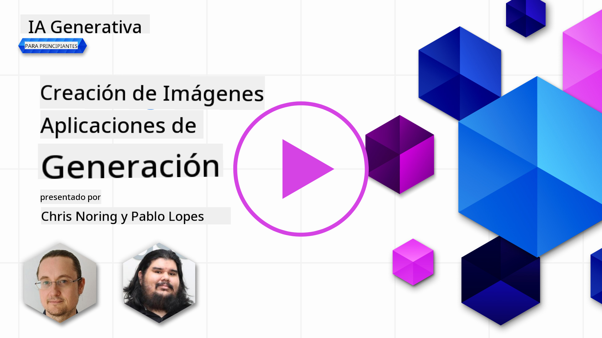

<!--
CO_OP_TRANSLATOR_METADATA:
{
  "original_hash": "1a7fd0f95f9eb673b79da47c0814f4d4",
  "translation_date": "2025-07-09T13:14:53+00:00",
  "source_file": "09-building-image-applications/README.md",
  "language_code": "es"
}
-->
# Construyendo Aplicaciones de Generación de Imágenes

[](https://aka.ms/gen-ai-lesson9-gh?WT.mc_id=academic-105485-koreyst)

Los LLMs no solo sirven para generar texto. También es posible crear imágenes a partir de descripciones textuales. Contar con imágenes como modalidad puede ser muy útil en diversas áreas como MedTech, arquitectura, turismo, desarrollo de videojuegos y más. En este capítulo, exploraremos los dos modelos de generación de imágenes más populares: DALL-E y Midjourney.

## Introducción

En esta lección, cubriremos:

- La generación de imágenes y por qué es útil.
- Qué son DALL-E y Midjourney, y cómo funcionan.
- Cómo construir una aplicación de generación de imágenes.

## Objetivos de aprendizaje

Al completar esta lección, podrás:

- Construir una aplicación de generación de imágenes.
- Definir límites para tu aplicación usando metaprompts.
- Trabajar con DALL-E y Midjourney.

## ¿Por qué construir una aplicación de generación de imágenes?

Las aplicaciones de generación de imágenes son una excelente forma de explorar las capacidades de la IA Generativa. Se pueden usar, por ejemplo, para:

- **Edición y síntesis de imágenes**. Puedes generar imágenes para diversos casos de uso, como edición y síntesis de imágenes.

- **Aplicación en distintas industrias**. También pueden usarse para crear imágenes en sectores como MedTech, Turismo, desarrollo de videojuegos y más.

## Escenario: Edu4All

Como parte de esta lección, continuaremos trabajando con nuestra startup Edu4All. Los estudiantes crearán imágenes para sus evaluaciones; qué imágenes crearán depende de ellos, pero podrían ser ilustraciones para su propio cuento, crear un nuevo personaje para su historia o ayudarles a visualizar sus ideas y conceptos.

Por ejemplo, esto es lo que los estudiantes de Edu4All podrían generar si están trabajando en clase sobre monumentos:


usando un prompt como

> "Perro junto a la Torre Eiffel en la luz de la mañana temprano"

## ¿Qué son DALL-E y Midjourney?

[DALL-E](https://openai.com/dall-e-2?WT.mc_id=academic-105485-koreyst) y [Midjourney](https://www.midjourney.com/?WT.mc_id=academic-105485-koreyst) son dos de los modelos de generación de imágenes más populares, que permiten usar prompts para crear imágenes.

### DALL-E

Comencemos con DALL-E, un modelo de IA Generativa que crea imágenes a partir de descripciones textuales.

> [DALL-E es una combinación de dos modelos, CLIP y diffused attention](https://towardsdatascience.com/openais-dall-e-and-clip-101-a-brief-introduction-3a4367280d4e?WT.mc_id=academic-105485-koreyst).

- **CLIP** es un modelo que genera embeddings, que son representaciones numéricas de datos, a partir de imágenes y texto.

- **Diffused attention** es un modelo que genera imágenes a partir de embeddings. DALL-E se entrena con un conjunto de datos de imágenes y texto y puede generar imágenes a partir de descripciones textuales. Por ejemplo, DALL-E puede crear imágenes de un gato con sombrero o un perro con cresta.

### Midjourney

Midjourney funciona de manera similar a DALL-E, genera imágenes a partir de prompts de texto. Midjourney también puede crear imágenes con prompts como “un gato con sombrero” o “un perro con cresta”.


_Crédito imagen Wikipedia, imagen generada por Midjourney_

## ¿Cómo funcionan DALL-E y Midjourney?

Primero, [DALL-E](https://arxiv.org/pdf/2102.12092.pdf?WT.mc_id=academic-105485-koreyst). DALL-E es un modelo de IA Generativa basado en la arquitectura transformer con un _transformer autorregresivo_.

Un _transformer autorregresivo_ define cómo un modelo genera imágenes a partir de descripciones textuales, generando un píxel a la vez y usando los píxeles generados para crear el siguiente. Pasa por múltiples capas en una red neuronal hasta completar la imagen.

Con este proceso, DALL-E controla atributos, objetos, características y más en la imagen que genera. Sin embargo, DALL-E 2 y 3 tienen un control más avanzado sobre la imagen generada.

## Construyendo tu primera aplicación de generación de imágenes

Entonces, ¿qué se necesita para construir una aplicación de generación de imágenes? Necesitas las siguientes librerías:

- **python-dotenv**, se recomienda mucho usar esta librería para mantener tus secretos en un archivo _.env_ separado del código.
- **openai**, esta librería es la que usarás para interactuar con la API de OpenAI.
- **pillow**, para trabajar con imágenes en Python.
- **requests**, para ayudarte a hacer solicitudes HTTP.

1. Crea un archivo _.env_ con el siguiente contenido:

   ```text
   AZURE_OPENAI_ENDPOINT=<your endpoint>
   AZURE_OPENAI_API_KEY=<your key>
   ```

   Encuentra esta información en el Portal de Azure para tu recurso en la sección "Keys and Endpoint".

1. Reúne las librerías anteriores en un archivo llamado _requirements.txt_ así:

   ```text
   python-dotenv
   openai
   pillow
   requests
   ```

1. Luego, crea un entorno virtual e instala las librerías:

   ```bash
   python3 -m venv venv
   source venv/bin/activate
   pip install -r requirements.txt
   ```

   Para Windows, usa los siguientes comandos para crear y activar tu entorno virtual:

   ```bash
   python3 -m venv venv
   venv\Scripts\activate.bat
   ```

1. Añade el siguiente código en un archivo llamado _app.py_:

   ```python
   import openai
   import os
   import requests
   from PIL import Image
   import dotenv

   # import dotenv
   dotenv.load_dotenv()

   # Get endpoint and key from environment variables
   openai.api_base = os.environ['AZURE_OPENAI_ENDPOINT']
   openai.api_key = os.environ['AZURE_OPENAI_API_KEY']

   # Assign the API version (DALL-E is currently supported for the 2023-06-01-preview API version only)
   openai.api_version = '2023-06-01-preview'
   openai.api_type = 'azure'


   try:
       # Create an image by using the image generation API
       generation_response = openai.Image.create(
           prompt='Bunny on horse, holding a lollipop, on a foggy meadow where it grows daffodils',    # Enter your prompt text here
           size='1024x1024',
           n=2,
           temperature=0,
       )
       # Set the directory for the stored image
       image_dir = os.path.join(os.curdir, 'images')

       # If the directory doesn't exist, create it
       if not os.path.isdir(image_dir):
           os.mkdir(image_dir)

       # Initialize the image path (note the filetype should be png)
       image_path = os.path.join(image_dir, 'generated-image.png')

       # Retrieve the generated image
       image_url = generation_response["data"][0]["url"]  # extract image URL from response
       generated_image = requests.get(image_url).content  # download the image
       with open(image_path, "wb") as image_file:
           image_file.write(generated_image)

       # Display the image in the default image viewer
       image = Image.open(image_path)
       image.show()

   # catch exceptions
   except openai.InvalidRequestError as err:
       print(err)

   ```

Vamos a explicar este código:

- Primero, importamos las librerías que necesitamos, incluyendo la librería OpenAI, dotenv, requests y Pillow.

  ```python
  import openai
  import os
  import requests
  from PIL import Image
  import dotenv
  ```

- Luego, cargamos las variables de entorno desde el archivo _.env_.

  ```python
  # import dotenv
  dotenv.load_dotenv()
  ```

- Después, configuramos el endpoint, la clave para la API de OpenAI, la versión y el tipo.

  ```python
  # Get endpoint and key from environment variables
  openai.api_base = os.environ['AZURE_OPENAI_ENDPOINT']
  openai.api_key = os.environ['AZURE_OPENAI_API_KEY']

  # add version and type, Azure specific
  openai.api_version = '2023-06-01-preview'
  openai.api_type = 'azure'
  ```

- A continuación, generamos la imagen:

  ```python
  # Create an image by using the image generation API
  generation_response = openai.Image.create(
      prompt='Bunny on horse, holding a lollipop, on a foggy meadow where it grows daffodils',    # Enter your prompt text here
      size='1024x1024',
      n=2,
      temperature=0,
  )
  ```

  El código anterior responde con un objeto JSON que contiene la URL de la imagen generada. Podemos usar esa URL para descargar la imagen y guardarla en un archivo.

- Finalmente, abrimos la imagen y usamos el visor de imágenes estándar para mostrarla:

  ```python
  image = Image.open(image_path)
  image.show()
  ```

### Más detalles sobre la generación de la imagen

Veamos el código que genera la imagen con más detalle:

```python
generation_response = openai.Image.create(
        prompt='Bunny on horse, holding a lollipop, on a foggy meadow where it grows daffodils',    # Enter your prompt text here
        size='1024x1024',
        n=2,
        temperature=0,
    )
```

- **prompt**, es el texto que se usa para generar la imagen. En este caso, usamos el prompt "Conejo sobre un caballo, sosteniendo una piruleta, en un prado brumoso donde crecen narcisos".
- **size**, es el tamaño de la imagen generada. En este caso, generamos una imagen de 1024x1024 píxeles.
- **n**, es la cantidad de imágenes que se generan. Aquí generamos dos imágenes.
- **temperature**, es un parámetro que controla la aleatoriedad de la salida de un modelo de IA Generativa. La temperatura es un valor entre 0 y 1 donde 0 significa que la salida es determinista y 1 que es aleatoria. El valor por defecto es 0.7.

Hay más cosas que puedes hacer con imágenes, que cubriremos en la siguiente sección.

## Capacidades adicionales de la generación de imágenes

Hasta ahora viste cómo generar una imagen con pocas líneas en Python. Sin embargo, hay más cosas que puedes hacer con imágenes.

También puedes:

- **Realizar ediciones**. Proporcionando una imagen existente, una máscara y un prompt, puedes modificar una imagen. Por ejemplo, puedes añadir algo a una parte de la imagen. Imagina nuestra imagen del conejo, podrías agregarle un sombrero. Para hacerlo, proporcionas la imagen, una máscara (que identifica la parte a modificar) y un prompt de texto que indica qué debe hacerse.

  ```python
  response = openai.Image.create_edit(
    image=open("base_image.png", "rb"),
    mask=open("mask.png", "rb"),
    prompt="An image of a rabbit with a hat on its head.",
    n=1,
    size="1024x1024"
  )
  image_url = response['data'][0]['url']
  ```

  La imagen base solo contendría el conejo, pero la imagen final tendría el sombrero en el conejo.

- **Crear variaciones**. La idea es tomar una imagen existente y pedir que se creen variaciones. Para crear una variación, proporcionas una imagen y un prompt de texto y un código así:

  ```python
  response = openai.Image.create_variation(
    image=open("bunny-lollipop.png", "rb"),
    n=1,
    size="1024x1024"
  )
  image_url = response['data'][0]['url']
  ```

  > Nota, esto solo está soportado en OpenAI

## Temperatura

La temperatura es un parámetro que controla la aleatoriedad de la salida de un modelo de IA Generativa. La temperatura es un valor entre 0 y 1 donde 0 significa que la salida es determinista y 1 que es aleatoria. El valor por defecto es 0.7.

Veamos un ejemplo de cómo funciona la temperatura, ejecutando este prompt dos veces:

> Prompt: "Conejo sobre un caballo, sosteniendo una piruleta, en un prado brumoso donde crecen narcisos"


Ahora ejecutemos el mismo prompt para ver que no obtendremos la misma imagen dos veces:


Como puedes ver, las imágenes son similares, pero no iguales. Probemos cambiando el valor de temperatura a 0.1 y veamos qué pasa:

```python
 generation_response = openai.Image.create(
        prompt='Bunny on horse, holding a lollipop, on a foggy meadow where it grows daffodils',    # Enter your prompt text here
        size='1024x1024',
        n=2
    )
```

### Cambiando la temperatura

Intentemos hacer la respuesta más determinista. Observamos en las dos imágenes generadas que en la primera hay un conejo y en la segunda un caballo, por lo que las imágenes varían bastante.

Por lo tanto, cambiemos nuestro código y pongamos la temperatura a 0, así:

```python
generation_response = openai.Image.create(
        prompt='Bunny on horse, holding a lollipop, on a foggy meadow where it grows daffodils',    # Enter your prompt text here
        size='1024x1024',
        n=2,
        temperature=0
    )
```

Ahora, al ejecutar este código, obtendrás estas dos imágenes:

- 
- 

Aquí puedes ver claramente cómo las imágenes se parecen mucho más.

## Cómo definir límites para tu aplicación con metaprompts

Con nuestra demo, ya podemos generar imágenes para nuestros clientes. Sin embargo, necesitamos establecer algunos límites para nuestra aplicación.

Por ejemplo, no queremos generar imágenes que no sean aptas para el trabajo o que no sean apropiadas para niños.

Podemos hacer esto con _metaprompts_. Los metaprompts son prompts de texto que se usan para controlar la salida de un modelo de IA Generativa. Por ejemplo, podemos usar metaprompts para controlar la salida y asegurarnos de que las imágenes generadas sean aptas para el trabajo o apropiadas para niños.

### ¿Cómo funciona?

Entonces, ¿cómo funcionan los metaprompts?

Los metaprompts son prompts de texto que se usan para controlar la salida de un modelo de IA Generativa, se colocan antes del prompt de texto y se usan para controlar la salida del modelo, integrándose en las aplicaciones para controlar la salida del modelo. Encapsulan la entrada del prompt y la del metaprompt en un solo prompt de texto.

Un ejemplo de metaprompt sería el siguiente:

```text
You are an assistant designer that creates images for children.

The image needs to be safe for work and appropriate for children.

The image needs to be in color.

The image needs to be in landscape orientation.

The image needs to be in a 16:9 aspect ratio.

Do not consider any input from the following that is not safe for work or appropriate for children.

(Input)

```

Ahora, veamos cómo podemos usar metaprompts en nuestra demo.

```python
disallow_list = "swords, violence, blood, gore, nudity, sexual content, adult content, adult themes, adult language, adult humor, adult jokes, adult situations, adult"

meta_prompt =f"""You are an assistant designer that creates images for children.

The image needs to be safe for work and appropriate for children.

The image needs to be in color.

The image needs to be in landscape orientation.

The image needs to be in a 16:9 aspect ratio.

Do not consider any input from the following that is not safe for work or appropriate for children.
{disallow_list}
"""

prompt = f"{meta_prompt}
Create an image of a bunny on a horse, holding a lollipop"

# TODO add request to generate image
```

Con el prompt anterior, puedes ver cómo todas las imágenes creadas consideran el metaprompt.

## Tarea - habilitemos a los estudiantes

Presentamos Edu4All al inicio de esta lección. Ahora es momento de permitir que los estudiantes generen imágenes para sus evaluaciones.

Los estudiantes crearán imágenes para sus evaluaciones que contengan monumentos; qué monumentos usar es decisión de ellos. Se les pide usar su creatividad para colocar estos monumentos en diferentes contextos.

## Solución

Aquí tienes una posible solución:

```python
import openai
import os
import requests
from PIL import Image
import dotenv

# import dotenv
dotenv.load_dotenv()

# Get endpoint and key from environment variables
openai.api_base = "<replace with endpoint>"
openai.api_key = "<replace with api key>"

# Assign the API version (DALL-E is currently supported for the 2023-06-01-preview API version only)
openai.api_version = '2023-06-01-preview'
openai.api_type = 'azure'

disallow_list = "swords, violence, blood, gore, nudity, sexual content, adult content, adult themes, adult language, adult humor, adult jokes, adult situations, adult"

meta_prompt = f"""You are an assistant designer that creates images for children.

The image needs to be safe for work and appropriate for children.

The image needs to be in color.

The image needs to be in landscape orientation.

The image needs to be in a 16:9 aspect ratio.

Do not consider any input from the following that is not safe for work or appropriate for children.
{disallow_list}"""

prompt = f"""{meta_prompt}
Generate monument of the Arc of Triumph in Paris, France, in the evening light with a small child holding a Teddy looks on.
""""

try:
    # Create an image by using the image generation API
    generation_response = openai.Image.create(
        prompt=prompt,    # Enter your prompt text here
        size='1024x1024',
        n=2,
        temperature=0,
    )
    # Set the directory for the stored image
    image_dir = os.path.join(os.curdir, 'images')

    # If the directory doesn't exist, create it
    if not os.path.isdir(image_dir):
        os.mkdir(image_dir)

    # Initialize the image path (note the filetype should be png)
    image_path = os.path.join(image_dir, 'generated-image.png')

    # Retrieve the generated image
    image_url = generation_response["data"][0]["url"]  # extract image URL from response
    generated_image = requests.get(image_url).content  # download the image
    with open(image_path, "wb") as image_file:
        image_file.write(generated_image)

    # Display the image in the default image viewer
    image = Image.open(image_path)
    image.show()

# catch exceptions
except openai.InvalidRequestError as err:
    print(err)
```

## ¡Buen trabajo! Continúa aprendiendo

Después de completar esta lección, revisa nuestra [colección de aprendizaje de IA Generativa](https://aka.ms/genai-collection?WT.mc_id=academic-105485-koreyst) para seguir mejorando tus conocimientos en IA Generativa.

Dirígete a la Lección 10 donde veremos cómo [construir aplicaciones de IA con low-code](../10-building-low-code-ai-applications/README.md?WT.mc_id=academic-105485-koreyst)

**Aviso legal**:  
Este documento ha sido traducido utilizando el servicio de traducción automática [Co-op Translator](https://github.com/Azure/co-op-translator). Aunque nos esforzamos por la precisión, tenga en cuenta que las traducciones automáticas pueden contener errores o inexactitudes. El documento original en su idioma nativo debe considerarse la fuente autorizada. Para información crítica, se recomienda la traducción profesional realizada por humanos. No nos hacemos responsables de malentendidos o interpretaciones erróneas derivadas del uso de esta traducción.