# Construyendo Aplicaciones de IA con Bajo Código

[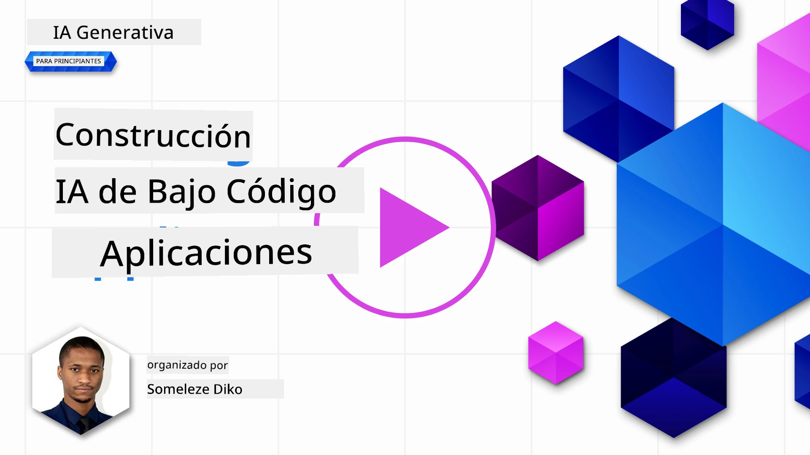](https://youtu.be/1vzq3Nd8GBA?si=h6LHWJXdmqf6mhDg)

> _(Haz clic en la imagen arriba para ver el video de esta lección)_

## Introducción

Ahora que hemos aprendido cómo construir aplicaciones generadoras de imágenes, hablemos sobre bajo código. La IA generativa puede usarse para una variedad de áreas diferentes, incluyendo bajo código, pero ¿qué es bajo código y cómo podemos agregar IA a esto?

Construir aplicaciones y soluciones se ha vuelto más fácil tanto para desarrolladores tradicionales como para no desarrolladores mediante el uso de Plataformas de Desarrollo de Bajo Código. Las Plataformas de Desarrollo de Bajo Código te permiten construir aplicaciones y soluciones con poco o ningún código. Esto se logra proporcionando un entorno de desarrollo visual que permite arrastrar y soltar componentes para construir aplicaciones y soluciones. Esto te permite construir aplicaciones y soluciones más rápido y con menos recursos. En esta lección, profundizamos en cómo usar bajo código y cómo mejorar el desarrollo de bajo código con IA usando Power Platform.

Power Platform brinda a las organizaciones la oportunidad de capacitar a sus equipos para construir sus propias soluciones a través de un entorno intuitivo de bajo código o sin código. Este entorno ayuda a simplificar el proceso de construcción de soluciones. Con Power Platform, las soluciones pueden construirse en días o semanas en lugar de meses o años. Power Platform consta de cinco productos clave: Power Apps, Power Automate, Power BI, Power Pages y Copilot Studio.

Esta lección cubre:

- Introducción a la IA Generativa en Power Platform
- Introducción a Copilot y cómo usarlo
- Uso de IA Generativa para construir aplicaciones y flujos en Power Platform
- Comprender los Modelos de IA en Power Platform con AI Builder
- Construcción de agentes inteligentes con Microsoft Copilot Studio

## Objetivos de Aprendizaje

Al final de esta lección, podrás:

- Entender cómo funciona Copilot en Power Platform.

- Construir una aplicación para el seguimiento de tareas estudiantiles para nuestra startup educativa.

- Construir un flujo de procesamiento de facturas que use IA para extraer información de las facturas.

- Aplicar las mejores prácticas al usar el Modelo de IA Crear Texto con GPT.

- Entender qué es Microsoft Copilot Studio y cómo construir agentes inteligentes con él.

Las herramientas y tecnologías que usarás en esta lección son:

- **Power Apps**, para la aplicación de seguimiento de tareas estudiantiles, que proporciona un entorno de desarrollo de bajo código para construir apps para rastrear, administrar e interactuar con datos.

- **Dataverse**, para almacenar los datos de la aplicación de seguimiento de tareas estudiantiles, donde Dataverse proporcionará una plataforma de datos de bajo código para almacenar los datos de la aplicación.

- **Power Automate**, para el flujo de procesamiento de facturas donde tendrás un entorno de desarrollo de bajo código para construir flujos de trabajo que automaticen el proceso de facturación.

- **AI Builder**, para el modelo de IA de procesamiento de facturas donde usarás modelos de IA preconstruidos para procesar las facturas para nuestra startup.

## IA Generativa en Power Platform

Mejorar el desarrollo y las aplicaciones de bajo código con IA generativa es un área clave de enfoque para Power Platform. El objetivo es permitir que todos construyan apps, sitios, paneles impulsados por IA y automaticen procesos con IA, _sin requerir experiencia en ciencia de datos_. Este objetivo se logra integrando IA generativa en la experiencia de desarrollo de bajo código en Power Platform en forma de Copilot y AI Builder.

### ¿Cómo funciona esto?

Copilot es un asistente de IA que te permite construir soluciones de Power Platform describiendo tus requerimientos en una serie de pasos conversacionales usando lenguaje natural. Por ejemplo, puedes indicarle a tu asistente de IA qué campos usará tu app y Creará tanto la aplicación como el modelo de datos subyacente o puedes especificar cómo configurar un flujo en Power Automate.

Puedes usar funcionalidades impulsadas por Copilot como una característica en las pantallas de tu app para permitir a los usuarios descubrir ideas mediante interacciones conversacionales.

AI Builder es una capacidad de IA de bajo código disponible en Power Platform que te permite usar modelos de IA para ayudarte a automatizar procesos y predecir resultados. Con AI Builder puedes llevar IA a tus apps y flujos que se conectan a tus datos en Dataverse o en varias fuentes de datos en la nube, como SharePoint, OneDrive o Azure.

Copilot está disponible en todos los productos de Power Platform: Power Apps, Power Automate, Power BI, Power Pages y Copilot Studio (antes Power Virtual Agents). AI Builder está disponible en Power Apps y Power Automate. En esta lección, nos enfocaremos en cómo usar Copilot y AI Builder en Power Apps y Power Automate para construir una solución para nuestra startup educativa.

### Copilot en Power Apps

Como parte de Power Platform, Power Apps proporciona un entorno de desarrollo de bajo código para construir apps para rastrear, administrar e interactuar con datos. Es una suite de servicios para desarrollo de aplicaciones con una plataforma de datos escalable y la capacidad de conectarse a servicios en la nube y datos locales. Power Apps te permite construir apps que funcionan en navegadores, tabletas y teléfonos, y pueden compartirse con compañeros de trabajo. Power Apps facilita a los usuarios ingresar al desarrollo de apps con una interfaz simple, para que cada usuario de negocio o desarrollador profesional pueda construir apps personalizadas. La experiencia de desarrollo de apps también se mejora con IA Generativa a través de Copilot.

La función de asistente de IA Copilot en Power Apps te permite describir qué tipo de app necesitas y qué información quieres que tu app rastree, recopile o muestre. Copilot luego genera una app Canvas responsiva basada en tu descripción. Luego puedes personalizar la app para satisfacer tus necesidades. El Copilot de IA también genera y sugiere una tabla Dataverse con los campos que necesitas para almacenar los datos que quieres rastrear y algunos datos de muestra. Más adelante en esta lección veremos qué es Dataverse y cómo puedes usarlo en Power Apps. Luego puedes personalizar la tabla para satisfacer tus necesidades usando la función asistente AI Copilot a través de pasos conversacionales. Esta característica está disponible desde la pantalla de inicio de Power Apps.

### Copilot en Power Automate

Como parte de Power Platform, Power Automate permite a los usuarios crear flujos de trabajo automatizados entre aplicaciones y servicios. Ayuda a automatizar procesos de negocio repetitivos como comunicación, recopilación de datos y aprobaciones de decisiones. Su interfaz simple permite que usuarios con cualquier nivel técnico (desde principiantes hasta desarrolladores experimentados) automaticen tareas de trabajo. La experiencia de desarrollo de flujos de trabajo también se mejora con IA Generativa a través de Copilot.

La función de asistente de IA Copilot en Power Automate te permite describir qué tipo de flujo necesitas y qué acciones quieres que tu flujo realice. Copilot luego genera un flujo basado en tu descripción. Luego puedes personalizar el flujo para satisfacer tus necesidades. El Copilot de IA también genera y sugiere las acciones que necesitas para realizar la tarea que quieres automatizar. Más adelante en esta lección veremos qué son los flujos y cómo puedes usarlos en Power Automate. Luego puedes personalizar las acciones para satisfacer tus necesidades usando la función asistente AI Copilot a través de pasos conversacionales. Esta característica está disponible desde la pantalla de inicio de Power Automate.

## Construcción de Agentes Inteligentes con Microsoft Copilot Studio

[Microsoft Copilot Studio](https://learn.microsoft.com/microsoft-copilot-studio/fundamentals-what-is-copilot-studio?WT.mc_id=academic-105485-koreyst) (antes Power Virtual Agents) es el miembro de bajo código de Power Platform para construir **agentes de IA**—copilotos conversacionales que pueden responder preguntas, tomar acciones y automatizar tareas en nombre de tus usuarios. Al igual que el resto de Power Platform, construyes estos agentes en una experiencia visual y basada en lenguaje natural: describes lo que quieres que el agente haga y Copilot Studio ayuda a estructurar sus instrucciones, conocimientos y acciones.

Para nuestra startup educativa, podrías construir un agente que responda preguntas de estudiantes sobre cursos, compruebe fechas límite de tareas e incluso envíe correos electrónicos a un instructor—todo sin escribir código.

Aquí están algunas de las capacidades más recientes que hacen que Copilot Studio sea poderoso:

- **Respuestas generativas basadas en tu conocimiento**. En lugar de crear manualmente cada conversación, puedes conectar **fuentes de conocimiento**: sitios web públicos, SharePoint, OneDrive, Dataverse, archivos subidos o datos empresariales mediante conectores, y el agente genera respuestas fundamentadas a partir de ellas.

- **Orquestación generativa**. En lugar de depender de frases de activación rígidas, el agente usa IA para entender una solicitud y decidir dinámicamente qué conocimientos, temas y acciones combinar para cumplirla, incluyendo encadenar varios pasos juntos.

- **Acciones y conectores**. Los agentes pueden *hacer* cosas, no solo chatear. Puedes proporcionar un agente con acciones respaldadas por los más de 1,500 conectores preconstruidos de Power Platform, flujos de Power Automate, APIs REST personalizadas, prompts o servidores **Model Context Protocol (MCP)**.

- **Agentes autónomos**. Los agentes no están limitados a responder en una ventana de chat. Puedes construir **agentes autónomos** que se activan por eventos — como un nuevo correo electrónico, un nuevo registro en Dataverse o la subida de un archivo— y luego actúan en segundo plano para completar una tarea.

- **Orquestación multi-agente**. Los agentes pueden llamar a otros agentes. Un agente de Copilot Studio puede pasar la tarea o ser extendido por otros agentes, incluyendo agentes publicados en Microsoft 365 Copilot y agentes construidos en Microsoft Foundry.

- **Elección de modelos**. Más allá de los modelos integrados, puedes traer modelos del catálogo de modelos Microsoft Foundry para adaptar cómo tu agente razona y responde.

- **Publicar en cualquier lugar**. Una vez construido, un agente puede publicarse en múltiples canales — Microsoft Teams, Microsoft 365 Copilot, un sitio web o app personalizada, y más — con seguridad, autenticación y análisis gestionados a través de la experiencia administrativa de Power Platform.

Puedes empezar a construir tu primer agente en [copilotstudio.microsoft.com](https://copilotstudio.microsoft.com?WT.mc_id=academic-105485-koreyst) y aprender más en la [documentación de Microsoft Copilot Studio](https://learn.microsoft.com/microsoft-copilot-studio/?WT.mc_id=academic-105485-koreyst).

## Tarea: Gestionar las asignaciones estudiantiles y facturas para nuestra startup, usando Copilot

Nuestra startup ofrece cursos en línea a estudiantes. La startup ha crecido rápidamente y ahora está teniendo dificultades para mantenerse al día con la demanda de sus cursos. La startup te ha contratado como desarrollador de Power Platform para ayudarlos a construir una solución de bajo código que les ayude a gestionar las asignaciones estudiantiles y las facturas. Su solución debe ayudarles a rastrear y administrar las asignaciones estudiantiles mediante una app y automatizar el proceso de facturación mediante un flujo de trabajo. Se te ha pedido que uses IA Generativa para desarrollar la solución.

Cuando comienzas a usar Copilot, puedes usar la [Biblioteca de Prompts Power Platform Copilot](https://github.com/pnp/powerplatform-prompts?WT.mc_id=academic-109639-somelezediko) para iniciarte con los prompts. Esta biblioteca contiene una lista de prompts que puedes usar para construir apps y flujos con Copilot. También puedes usar los prompts de la biblioteca para tener una idea de cómo describir tus requerimientos a Copilot.

### Construir una aplicación de seguimiento de tareas para estudiantes para nuestra startup

Los educadores en nuestra startup han tenido dificultades para rastrear las asignaciones estudiantiles. Han estado usando una hoja de cálculo para rastrear las asignaciones, pero esto se ha vuelto difícil de manejar debido al aumento en el número de estudiantes. Te han pedido que construyas una app que les ayude a rastrear y administrar las asignaciones estudiantiles. La app debe permitirles agregar nuevas asignaciones, ver asignaciones, actualizar asignaciones y eliminar asignaciones. La app también debe permitir a educadores y estudiantes ver las asignaciones que ya han sido calificadas y las que no.

Construirás la app usando Copilot en Power Apps siguiendo los siguientes pasos:

1. Navega a la pantalla de inicio de [Power Apps](https://make.powerapps.com?WT.mc_id=academic-105485-koreyst).

1. Usa el área de texto en la pantalla de inicio para describir la app que quieres construir. Por ejemplo, **_Quiero construir una app para rastrear y administrar asignaciones estudiantiles_**. Haz clic en el botón **Enviar** para enviar el prompt al AI Copilot.

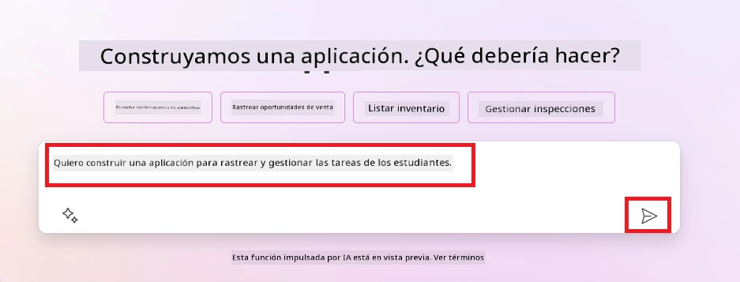

1. El AI Copilot sugerirá una tabla Dataverse con los campos que necesitas para almacenar los datos que quieres rastrear y algunos datos de muestra. Luego puedes personalizar la tabla para satisfacer tus necesidades usando la función de asistente AI Copilot a través de pasos conversacionales.

   > **Importante**: Dataverse es la plataforma de datos subyacente para Power Platform. Es una plataforma de datos de bajo código para almacenar los datos de la app. Es un servicio totalmente gestionado que almacena datos de forma segura en Microsoft Cloud y está aprovisionado dentro de tu entorno de Power Platform. Viene con capacidades integradas de gobernanza de datos, tales como clasificación de datos, linaje de datos, control de acceso detallado y más. Puedes aprender más sobre Dataverse [aquí](https://learn.microsoft.com/power-apps/maker/data-platform/data-platform-intro?WT.mc_id=academic-109639-somelezediko).

   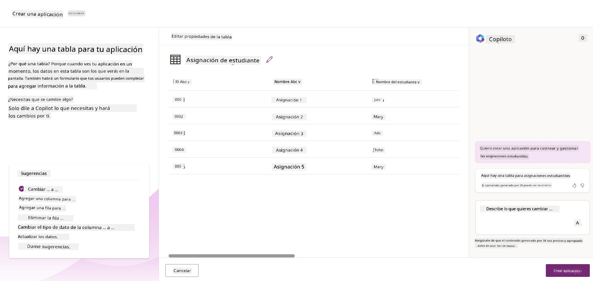

1. Los educadores quieren enviar correos electrónicos a los estudiantes que han entregado sus asignaciones para mantenerlos actualizados sobre el progreso de sus tareas. Puedes usar Copilot para agregar un nuevo campo a la tabla para almacenar el correo electrónico del estudiante. Por ejemplo, puedes usar el siguiente prompt para agregar un nuevo campo a la tabla: **_Quiero agregar una columna para almacenar el correo electrónico del estudiante_**. Haz clic en el botón **Enviar** para enviar el prompt al AI Copilot.

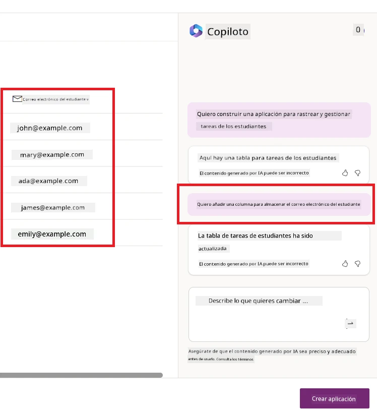

1. El AI Copilot generará un nuevo campo y luego podrás personalizar el campo para satisfacer tus necesidades.

1. Una vez que haya terminado con la tabla, haga clic en el botón **Crear aplicación** para crear la aplicación.

1. El AI Copilot generará una aplicación Canvas adaptable basada en su descripción. Luego puede personalizar la aplicación para satisfacer sus necesidades.

1. Para que los educadores envíen correos electrónicos a los estudiantes, puede usar Copilot para agregar una nueva pantalla a la aplicación. Por ejemplo, puede utilizar la siguiente instrucción para agregar una nueva pantalla a la aplicación: **_Quiero agregar una pantalla para enviar correos electrónicos a los estudiantes_**. Haga clic en el botón **Enviar** para enviar la instrucción al AI Copilot.

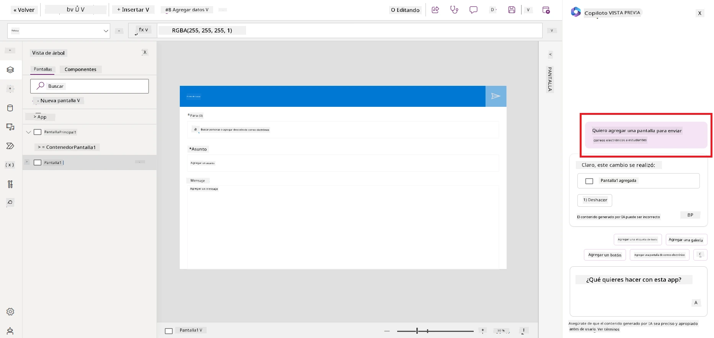

1. El AI Copilot generará una nueva pantalla y luego podrá personalizarla para satisfacer sus necesidades.

1. Una vez que haya terminado con la aplicación, haga clic en el botón **Guardar** para guardar la aplicación.

1. Para compartir la aplicación con los educadores, haga clic en el botón **Compartir** y luego haga clic nuevamente en el botón **Compartir**. Luego podrá compartir la aplicación con los educadores ingresando sus direcciones de correo electrónico.

> **Tu tarea**: La aplicación que acaba de crear es un buen comienzo pero puede mejorarse. Con la función de correo electrónico, los educadores solo pueden enviar correos manualmente a los estudiantes escribiendo sus correos. ¿Puedes usar Copilot para construir una automatización que permita a los educadores enviar correos automáticamente cuando los estudiantes entreguen sus tareas? Tu pista es que con la instrucción adecuada puedes usar Copilot en Power Automate para construir esto.

### Construir una Tabla de Información de Facturas para Nuestra Startup

El equipo financiero de nuestra startup ha tenido dificultades para hacer el seguimiento de las facturas. Han estado usando una hoja de cálculo para rastrear las facturas, pero se ha vuelto difícil de manejar a medida que el número de facturas ha aumentado. Le han pedido que construya una tabla que les ayude a almacenar, rastrear y gestionar la información de las facturas que reciben. La tabla deberá usarse para construir una automatización que extraiga toda la información de las facturas y la almacene en la tabla. La tabla también debe permitir al equipo financiero ver las facturas que se han pagado y las que no.

Power Platform tiene una plataforma de datos subyacente llamada Dataverse que le permite almacenar los datos para sus aplicaciones y soluciones. Dataverse ofrece una plataforma de datos de bajo código para almacenar los datos de las aplicaciones. Es un servicio completamente gestionado que almacena datos de forma segura en la nube de Microsoft y se provisiona dentro de su entorno Power Platform. Viene con capacidades de gobernanza de datos incorporadas, tales como clasificación de datos, linaje de datos, control de acceso detallado y más. Puede aprender más [sobre Dataverse aquí](https://learn.microsoft.com/power-apps/maker/data-platform/data-platform-intro?WT.mc_id=academic-109639-somelezediko).

¿Por qué deberíamos usar Dataverse para nuestra startup? Las tablas estándar y personalizadas dentro de Dataverse proporcionan una opción segura y basada en la nube para almacenar sus datos. Las tablas le permiten almacenar diferentes tipos de datos, similar a como podría usar múltiples hojas de trabajo en un solo libro de Excel. Puede usar tablas para almacenar datos específicos para su organización o necesidades empresariales. Algunos de los beneficios que nuestra startup obtendrá al usar Dataverse incluyen pero no están limitados a:

- **Fácil de manejar**: Tanto los metadatos como los datos se almacenan en la nube, por lo que no tiene que preocuparse por los detalles de cómo se almacenan o gestionan. Puede enfocarse en construir sus aplicaciones y soluciones.

- **Seguro**: Dataverse proporciona una opción de almacenamiento segura y basada en la nube para sus datos. Puede controlar quién tiene acceso a los datos en sus tablas y cómo pueden acceder usando seguridad basada en roles.

- **Metadatos ricos**: Tipos de datos y relaciones se usan directamente dentro de Power Apps

- **Lógica y validación**: Puede usar reglas de negocio, campos calculados y reglas de validación para aplicar lógica de negocio y mantener la precisión de los datos.

Ahora que sabe qué es Dataverse y por qué debería usarlo, veamos cómo puede usar Copilot para crear una tabla en Dataverse que cumpla con los requisitos de nuestro equipo financiero.

> **Nota** : Usará esta tabla en la siguiente sección para construir una automatización que extraerá toda la información de las facturas y la almacenará en la tabla.

Para crear una tabla en Dataverse usando Copilot, siga los pasos a continuación:

1. Navegue a la pantalla principal de [Power Apps](https://make.powerapps.com?WT.mc_id=academic-105485-koreyst).

2. En la barra de navegación izquierda, seleccione **Tablas** y luego haga clic en **Describir la nueva Tabla**.

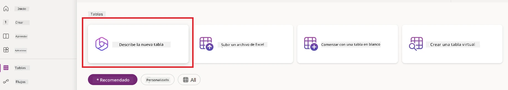

1. En la pantalla **Describir la nueva Tabla**, use el área de texto para describir la tabla que desea crear. Por ejemplo, **_Quiero crear una tabla para almacenar información de facturas_**. Haga clic en el botón **Enviar** para enviar la instrucción al AI Copilot.

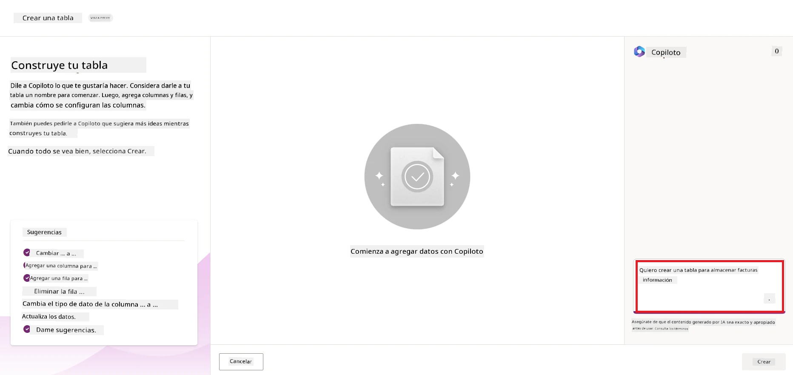

1. El AI Copilot sugerirá una tabla de Dataverse con los campos que necesita para almacenar los datos que desea rastrear y algunos datos de ejemplo. Luego puede personalizar la tabla para satisfacer sus necesidades usando la función de asistente AI Copilot a través de pasos conversacionales.

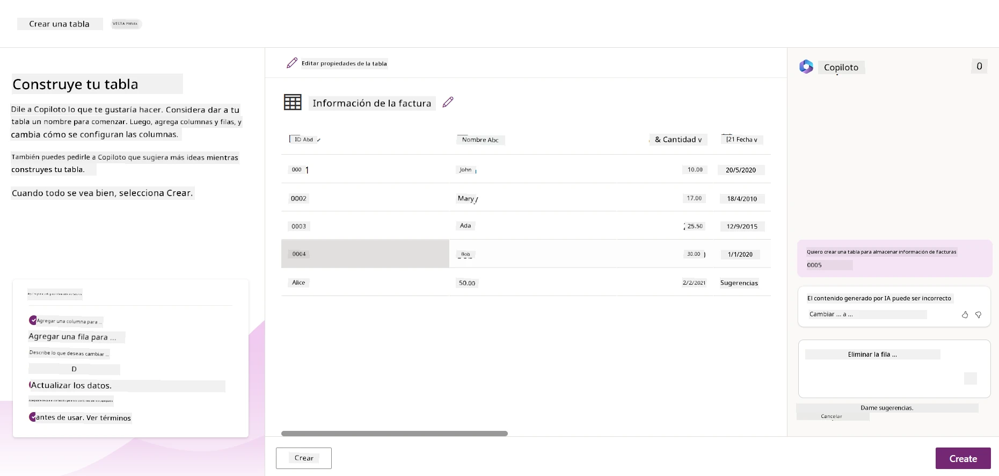

1. El equipo financiero quiere enviar un correo electrónico al proveedor para actualizarles con el estado actual de su factura. Puede usar Copilot para agregar un nuevo campo a la tabla para almacenar el correo electrónico del proveedor. Por ejemplo, puede utilizar la siguiente instrucción para agregar un nuevo campo a la tabla: **_Quiero agregar una columna para almacenar el correo electrónico del proveedor_**. Haga clic en el botón **Enviar** para enviar la instrucción al AI Copilot.

1. El AI Copilot generará un nuevo campo y luego podrá personalizar el campo para satisfacer sus necesidades.

1. Una vez que haya terminado con la tabla, haga clic en el botón **Crear** para crear la tabla.

## Modelos de IA en Power Platform con AI Builder

AI Builder es una capacidad de IA de bajo código disponible en Power Platform que le permite usar modelos de IA para ayudar a automatizar procesos y predecir resultados. Con AI Builder puede incorporar IA a sus aplicaciones y flujos que se conectan a sus datos en Dataverse o en varias fuentes de datos en la nube, como SharePoint, OneDrive o Azure.

## Modelos de IA preconstruidos vs Modelos de IA personalizados

AI Builder proporciona dos tipos de modelos de IA: Modelos de IA preconstruidos y Modelos de IA personalizados. Los modelos preconstruidos son modelos de IA listos para usar, entrenados por Microsoft y disponibles en Power Platform. Estos le ayudan a agregar inteligencia a sus aplicaciones y flujos sin necesidad de recopilar datos y luego construir, entrenar y publicar sus propios modelos. Puede usar estos modelos para automatizar procesos y predecir resultados.

Algunos de los modelos de IA preconstruidos disponibles en Power Platform incluyen:

- **Extracción de Frases Clave**: Este modelo extrae frases clave de un texto.
- **Detección de Idioma**: Este modelo detecta el idioma de un texto.
- **Análisis de Sentimiento**: Este modelo detecta sentimientos positivos, negativos, neutrales o mezclados en un texto.
- **Lector de Tarjetas de Presentación**: Este modelo extrae información de tarjetas de presentación.
- **Reconocimiento de Texto**: Este modelo extrae texto de imágenes.
- **Detección de Objetos**: Este modelo detecta y extrae objetos de imágenes.
- **Procesamiento de Documentos**: Este modelo extrae información de formularios.
- **Procesamiento de Facturas**: Este modelo extrae información de facturas.

Con los Modelos de IA personalizados puede traer su propio modelo a AI Builder para que funcione como cualquier modelo personalizado de AI Builder, permitiéndole entrenar el modelo usando sus propios datos. Puede usar estos modelos para automatizar procesos y predecir resultados tanto en Power Apps como en Power Automate. Cuando usa su propio modelo hay limitaciones que se aplican. Lea más sobre estas [limitaciones](https://learn.microsoft.com/ai-builder/byo-model#limitations?WT.mc_id=academic-105485-koreyst).

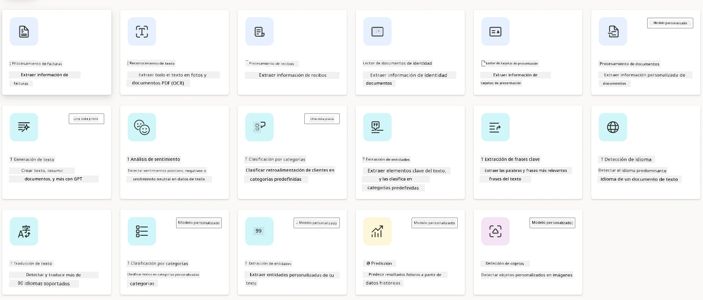

## Tarea #2 - Construir un flujo de procesamiento de facturas para nuestra startup

El equipo financiero ha tenido dificultades para procesar las facturas. Han estado usando una hoja de cálculo para rastrear las facturas, pero se ha vuelto difícil de manejar a medida que el número de facturas ha aumentado. Le han pedido que construya un flujo de trabajo que les ayude a procesar las facturas usando IA. El flujo debe permitirles extraer información de las facturas y almacenar esta información en una tabla de Dataverse. El flujo también debe permitirles enviar un correo electrónico al equipo financiero con la información extraída.

Ahora que sabe qué es AI Builder y por qué debería usarlo, veamos cómo puede usar el modelo de IA de procesamiento de facturas en AI Builder, que vimos antes, para construir un flujo que ayude al equipo financiero a procesar las facturas.

Para construir un flujo que ayude al equipo financiero a procesar las facturas usando el modelo de IA de procesamiento de facturas en AI Builder, siga los pasos a continuación:

1. Navegue a la pantalla principal de [Power Automate](https://make.powerautomate.com?WT.mc_id=academic-105485-koreyst).

2. Use el área de texto en la pantalla principal para describir el flujo que desea construir. Por ejemplo, **_Procesar una factura cuando llega a mi buzón_**. Haga clic en el botón **Enviar** para enviar la instrucción al AI Copilot.

   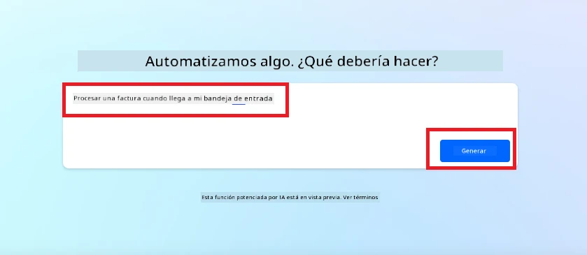

3. El AI Copilot sugerirá las acciones que necesita para realizar la tarea que desea automatizar. Puede hacer clic en el botón **Siguiente** para avanzar a los siguientes pasos.

4. En el siguiente paso, Power Automate le pedirá que configure las conexiones requeridas para el flujo. Una vez que haya terminado, haga clic en el botón **Crear flujo** para crear el flujo.

5. El AI Copilot generará un flujo y luego podrá personalizar el flujo para satisfacer sus necesidades.

6. Actualice el disparador del flujo y configure la **Carpeta** a la carpeta donde se almacenarán las facturas. Por ejemplo, puede configurar la carpeta a **Bandeja de entrada**. Haga clic en **Mostrar opciones avanzadas** y configure **Solo con archivos adjuntos** en **Sí**. Esto asegurará que el flujo solo se ejecute cuando se reciba un correo con archivo adjunto en la carpeta.

7. Elimine las siguientes acciones del flujo: **HTML a texto**, **Componer**, **Componer 2**, **Componer 3** y **Componer 4** porque no las usará.

8. Elimine la acción **Condición** del flujo porque no la usará. Debería verse como en la siguiente captura de pantalla:

   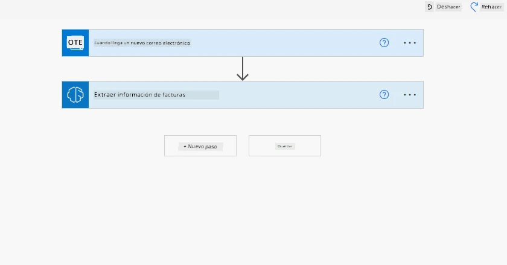

9. Haga clic en el botón **Agregar una acción** y busque **Dataverse**. Seleccione la acción **Agregar una nueva fila**.

10. En la acción **Extraer Información de facturas**, actualice el **Archivo de factura** para que apunte al contenido del archivo adjunto del correo. Esto asegurará que el flujo extraiga información del archivo adjunto de la factura.

11. Seleccione la **Tabla** que creó antes. Por ejemplo, puede seleccionar la tabla **Información de facturas**. Elija el contenido dinámico de la acción anterior para llenar los siguientes campos:

    - ID
    - Monto
    - Fecha
    - Nombre
    - Estado - Configure el **Estado** a **Pendiente**.
    - Correo del proveedor - Use el contenido dinámico **De** del disparador **Cuando llega un nuevo correo**.

    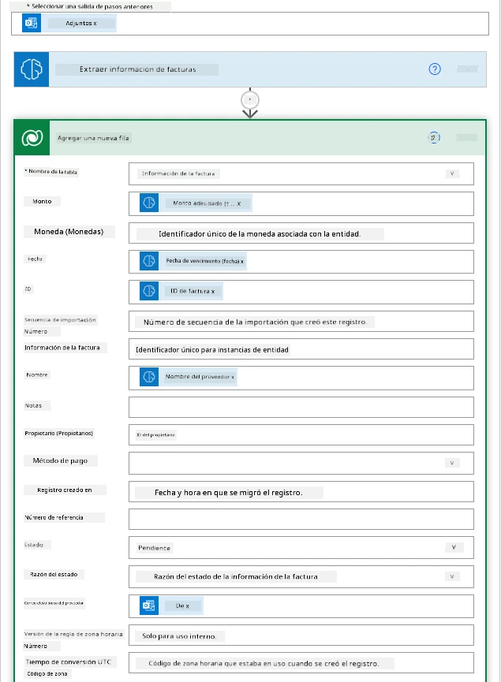

12. Una vez que haya terminado con el flujo, haga clic en el botón **Guardar** para guardar el flujo. Luego puede probar el flujo enviando un correo con una factura a la carpeta que especificó en el disparador.

> **Tu tarea**: El flujo que acaba de crear es un buen comienzo, ahora necesita pensar cómo construir una automatización que permita a nuestro equipo financiero enviar un correo electrónico al proveedor para actualizarlo con el estado actual de su factura. Su pista: el flujo debe ejecutarse cuando cambie el estado de la factura.

## Usar un modelo de IA de generación de texto en Power Automate

El modelo de IA Crear Texto con GPT en AI Builder le permite generar texto basado en una instrucción y está impulsado por el Servicio Azure OpenAI de Microsoft. Con esta capacidad, puede incorporar tecnología GPT (Generative Pre-Trained Transformer) en sus aplicaciones y flujos para construir una variedad de flujos automatizados y aplicaciones inteligentes.

Los modelos GPT pasan por un extenso entrenamiento con grandes cantidades de datos, lo que les permite producir texto que se asemeja mucho al lenguaje humano cuando se les proporciona una instrucción. Cuando se integran con la automatización de flujos de trabajo, los modelos de IA como GPT pueden utilizarse para agilizar y automatizar una amplia gama de tareas.

Por ejemplo, puede construir flujos para generar automáticamente texto para una variedad de casos de uso, como: borradores de correos electrónicos, descripciones de productos y más. También puede usar el modelo para generar texto para una variedad de aplicaciones, como chatbots y aplicaciones de servicio al cliente que permiten a los agentes responder de manera efectiva y eficiente a las consultas de los clientes.

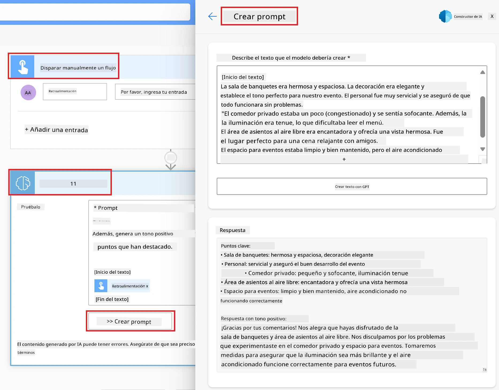

Para aprender a usar este Modelo de IA en Power Automate, revisa el módulo [Agregar inteligencia con AI Builder y GPT](https://learn.microsoft.com/training/modules/ai-builder-text-generation/?WT.mc_id=academic-109639-somelezediko).

## ¡Gran trabajo! Continúa tu aprendizaje

Después de completar esta lección, consulta nuestra [colección de Aprendizaje de IA Generativa](https://aka.ms/genai-collection?WT.mc_id=academic-105485-koreyst) para seguir mejorando tus conocimientos en IA Generativa.

¿Quieres personalizar y sacar más provecho de Copilot? Explora [Awesome Copilot](https://github.com/github/awesome-copilot?WT.mc_id=academic-105485-koreyst), una colección comunitaria de instrucciones, agentes, habilidades y configuraciones para ayudarte a aprovechar al máximo GitHub Copilot.

Dirígete a la Lección 11 donde veremos cómo [integrar IA Generativa con Llamadas a Funciones](../11-integrating-with-function-calling/README.md?WT.mc_id=academic-105485-koreyst).

---

<!-- CO-OP TRANSLATOR DISCLAIMER START -->
**Descargo de responsabilidad**:
Este documento ha sido traducido utilizando el servicio de traducción automática [Co-op Translator](https://github.com/Azure/co-op-translator). Aunque nos esforzamos por la precisión, tenga en cuenta que las traducciones automatizadas pueden contener errores o inexactitudes. El documento original en su idioma nativo debe considerarse la fuente autorizada. Para información crítica, se recomienda una traducción profesional humana. No somos responsables de cualquier malentendido o interpretación errónea que surja del uso de esta traducción.
<!-- CO-OP TRANSLATOR DISCLAIMER END -->