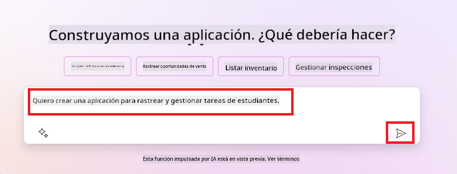
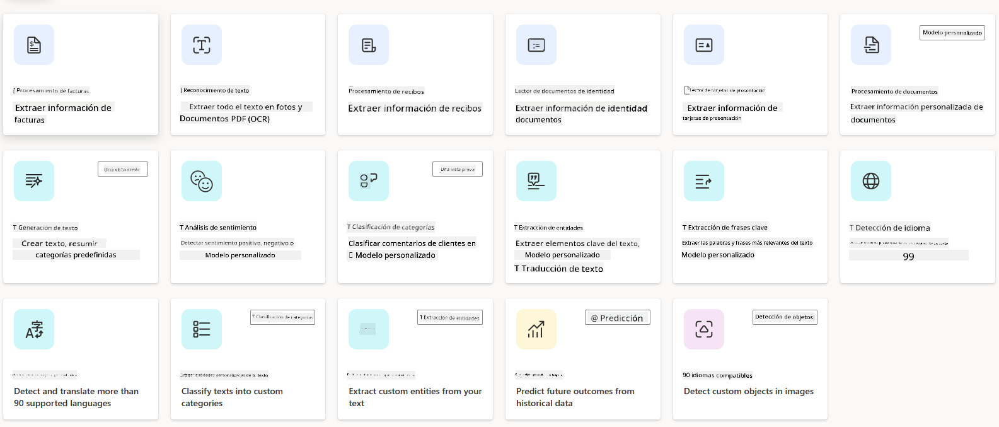
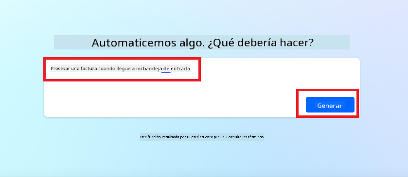
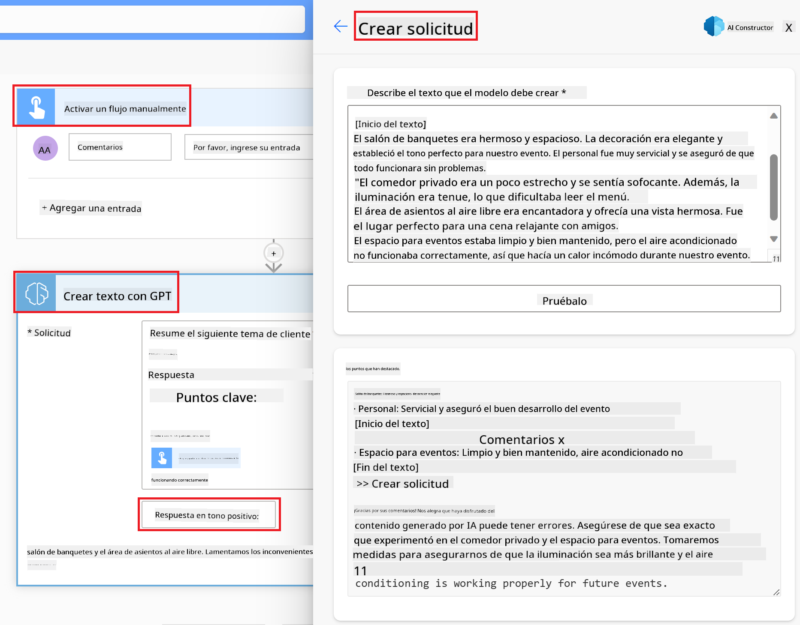

<!--
CO_OP_TRANSLATOR_METADATA:
{
  "original_hash": "846ac8e3b7dcfb697d3309fec05f0fea",
  "translation_date": "2025-10-17T22:48:49+00:00",
  "source_file": "10-building-low-code-ai-applications/README.md",
  "language_code": "es"
}
-->
# Construcción de Aplicaciones de IA con Bajo Código

> _(Haz clic en la imagen de arriba para ver el video de esta lección)_

## Introducción

Ahora que hemos aprendido cómo construir aplicaciones generadoras de imágenes, hablemos sobre el bajo código. La IA generativa puede ser utilizada en una variedad de áreas diferentes, incluido el bajo código, pero ¿qué es el bajo código y cómo podemos agregar IA a él?

La creación de aplicaciones y soluciones se ha vuelto más fácil para desarrolladores tradicionales y no desarrolladores gracias al uso de las plataformas de desarrollo de bajo código. Estas plataformas permiten construir aplicaciones y soluciones con poco o ningún código. Esto se logra proporcionando un entorno de desarrollo visual que permite arrastrar y soltar componentes para construir aplicaciones y soluciones. Esto permite construir aplicaciones y soluciones más rápido y con menos recursos. En esta lección, profundizaremos en cómo usar el bajo código y cómo mejorar el desarrollo de bajo código con IA utilizando Power Platform.

Power Platform ofrece a las organizaciones la oportunidad de empoderar a sus equipos para que construyan sus propias soluciones a través de un entorno intuitivo de bajo código o sin código. Este entorno ayuda a simplificar el proceso de creación de soluciones. Con Power Platform, las soluciones pueden construirse en días o semanas en lugar de meses o años. Power Platform consta de cinco productos clave: Power Apps, Power Automate, Power BI, Power Pages y Copilot Studio.

Esta lección cubre:

- Introducción a la IA generativa en Power Platform
- Introducción a Copilot y cómo usarlo
- Uso de IA generativa para construir aplicaciones y flujos en Power Platform
- Comprensión de los modelos de IA en Power Platform con AI Builder

## Objetivos de Aprendizaje

Al final de esta lección, serás capaz de:

- Comprender cómo funciona Copilot en Power Platform.

- Construir una aplicación de seguimiento de tareas estudiantiles para nuestra startup educativa.

- Crear un flujo de procesamiento de facturas que utilice IA para extraer información de las facturas.

- Aplicar mejores prácticas al usar el modelo de IA Crear Texto con GPT.

Las herramientas y tecnologías que usarás en esta lección son:

- **Power Apps**, para la aplicación de seguimiento de tareas estudiantiles, que proporciona un entorno de desarrollo de bajo código para construir aplicaciones que rastrean, gestionan e interactúan con datos.

- **Dataverse**, para almacenar los datos de la aplicación de seguimiento de tareas estudiantiles, donde Dataverse proporcionará una plataforma de datos de bajo código para almacenar los datos de la aplicación.

- **Power Automate**, para el flujo de procesamiento de facturas, donde tendrás un entorno de desarrollo de bajo código para construir flujos de trabajo que automaticen el proceso de procesamiento de facturas.

- **AI Builder**, para el modelo de IA de procesamiento de facturas, donde usarás modelos de IA preconstruidos para procesar las facturas de nuestra startup.

## IA Generativa en Power Platform

Mejorar el desarrollo y las aplicaciones de bajo código con IA generativa es un área clave de enfoque para Power Platform. El objetivo es permitir que todos puedan construir aplicaciones, sitios, paneles de control y automatizar procesos con IA, _sin necesidad de experiencia en ciencia de datos_. Este objetivo se logra integrando la IA generativa en la experiencia de desarrollo de bajo código en Power Platform en forma de Copilot y AI Builder.

### ¿Cómo funciona esto?

Copilot es un asistente de IA que te permite construir soluciones en Power Platform describiendo tus requisitos en una serie de pasos conversacionales utilizando lenguaje natural. Por ejemplo, puedes instruir a tu asistente de IA para que indique qué campos usará tu aplicación y este creará tanto la aplicación como el modelo de datos subyacente, o podrías especificar cómo configurar un flujo en Power Automate.

Puedes usar las funcionalidades impulsadas por Copilot como una característica en las pantallas de tu aplicación para permitir que los usuarios descubran información a través de interacciones conversacionales.

AI Builder es una capacidad de IA de bajo código disponible en Power Platform que te permite usar modelos de IA para ayudarte a automatizar procesos y predecir resultados. Con AI Builder puedes llevar IA a tus aplicaciones y flujos que se conectan a tus datos en Dataverse o en varias fuentes de datos en la nube, como SharePoint, OneDrive o Azure.

Copilot está disponible en todos los productos de Power Platform: Power Apps, Power Automate, Power BI, Power Pages y Power Virtual Agents. AI Builder está disponible en Power Apps y Power Automate. En esta lección, nos enfocaremos en cómo usar Copilot y AI Builder en Power Apps y Power Automate para construir una solución para nuestra startup educativa.

### Copilot en Power Apps

Como parte de Power Platform, Power Apps proporciona un entorno de desarrollo de bajo código para construir aplicaciones que rastrean, gestionan e interactúan con datos. Es un conjunto de servicios de desarrollo de aplicaciones con una plataforma de datos escalable y la capacidad de conectarse a servicios en la nube y datos locales. Power Apps permite construir aplicaciones que se ejecutan en navegadores, tabletas y teléfonos, y pueden compartirse con compañeros de trabajo. Power Apps facilita a los usuarios el desarrollo de aplicaciones con una interfaz simple, para que cualquier usuario empresarial o desarrollador profesional pueda construir aplicaciones personalizadas. La experiencia de desarrollo de aplicaciones también se mejora con la IA generativa a través de Copilot.

La función de asistente de IA Copilot en Power Apps te permite describir qué tipo de aplicación necesitas y qué información deseas que tu aplicación rastree, recopile o muestre. Copilot luego genera una aplicación Canvas responsiva basada en tu descripción. Luego puedes personalizar la aplicación para satisfacer tus necesidades. El asistente de IA Copilot también genera y sugiere una tabla de Dataverse con los campos que necesitas para almacenar los datos que deseas rastrear y algunos datos de muestra. Veremos qué es Dataverse y cómo puedes usarlo en Power Apps más adelante en esta lección. Luego puedes personalizar la tabla para satisfacer tus necesidades utilizando la función de asistente de IA Copilot a través de pasos conversacionales. Esta función está disponible directamente desde la pantalla de inicio de Power Apps.

### Copilot en Power Automate

Como parte de Power Platform, Power Automate permite a los usuarios crear flujos de trabajo automatizados entre aplicaciones y servicios. Ayuda a automatizar procesos empresariales repetitivos como la comunicación, la recopilación de datos y las aprobaciones de decisiones. Su interfaz simple permite a usuarios de todos los niveles técnicos (desde principiantes hasta desarrolladores experimentados) automatizar tareas laborales. La experiencia de desarrollo de flujos de trabajo también se mejora con la IA generativa a través de Copilot.

La función de asistente de IA Copilot en Power Automate te permite describir qué tipo de flujo necesitas y qué acciones deseas que tu flujo realice. Copilot luego genera un flujo basado en tu descripción. Luego puedes personalizar el flujo para satisfacer tus necesidades. El asistente de IA Copilot también genera y sugiere las acciones que necesitas para realizar la tarea que deseas automatizar. Veremos qué son los flujos y cómo puedes usarlos en Power Automate más adelante en esta lección. Luego puedes personalizar las acciones para satisfacer tus necesidades utilizando la función de asistente de IA Copilot a través de pasos conversacionales. Esta función está disponible directamente desde la pantalla de inicio de Power Automate.

## Tarea: Gestionar tareas estudiantiles y facturas para nuestra startup, utilizando Copilot

Nuestra startup ofrece cursos en línea a estudiantes. La startup ha crecido rápidamente y ahora está luchando por mantenerse al día con la demanda de sus cursos. La startup te ha contratado como desarrollador de Power Platform para ayudarles a construir una solución de bajo código que les ayude a gestionar las tareas estudiantiles y las facturas. Su solución debería ser capaz de ayudarles a rastrear y gestionar las tareas estudiantiles a través de una aplicación y automatizar el proceso de procesamiento de facturas a través de un flujo de trabajo. Se te ha pedido que utilices IA generativa para desarrollar la solución.

Cuando comiences a usar Copilot, puedes utilizar la [Biblioteca de Prompts de Copilot de Power Platform](https://github.com/pnp/powerplatform-prompts?WT.mc_id=academic-109639-somelezediko) para empezar con los prompts. Esta biblioteca contiene una lista de prompts que puedes usar para construir aplicaciones y flujos con Copilot. También puedes usar los prompts de la biblioteca para tener una idea de cómo describir tus requisitos a Copilot.

### Construir una Aplicación de Seguimiento de Tareas Estudiantiles para Nuestra Startup

Los educadores de nuestra startup han estado teniendo dificultades para llevar un seguimiento de las tareas estudiantiles. Han estado utilizando una hoja de cálculo para rastrear las tareas, pero esto se ha vuelto difícil de gestionar a medida que ha aumentado el número de estudiantes. Te han pedido que construyas una aplicación que les ayude a rastrear y gestionar las tareas estudiantiles. La aplicación debería permitirles agregar nuevas tareas, ver tareas, actualizar tareas y eliminar tareas. La aplicación también debería permitir a los educadores y estudiantes ver las tareas que han sido calificadas y las que no.

Construirás la aplicación utilizando Copilot en Power Apps siguiendo los pasos a continuación:

1. Navega a la [pantalla de inicio de Power Apps](https://make.powerapps.com?WT.mc_id=academic-105485-koreyst).

1. Usa el área de texto en la pantalla de inicio para describir la aplicación que deseas construir. Por ejemplo, **_Quiero construir una aplicación para rastrear y gestionar tareas estudiantiles_**. Haz clic en el botón **Enviar** para enviar el prompt al asistente de IA Copilot.

1. El asistente de IA Copilot sugerirá una tabla de Dataverse con los campos que necesitas para almacenar los datos que deseas rastrear y algunos datos de muestra. Luego puedes personalizar la tabla para satisfacer tus necesidades utilizando la función de asistente de IA Copilot a través de pasos conversacionales.

   > **Importante**: Dataverse es la plataforma de datos subyacente de Power Platform. Es una plataforma de datos de bajo código para almacenar los datos de la aplicación. Es un servicio completamente administrado que almacena datos de manera segura en la nube de Microsoft y se provisiona dentro de tu entorno de Power Platform. Viene con capacidades integradas de gobernanza de datos, como clasificación de datos, línea de datos, control de acceso detallado y más. Puedes aprender más sobre Dataverse [aquí](https://docs.microsoft.com/powerapps/maker/data-platform/data-platform-intro?WT.mc_id=academic-109639-somelezediko).

   

1. Los educadores quieren enviar correos electrónicos a los estudiantes que han enviado sus tareas para mantenerlos actualizados sobre el progreso de sus tareas. Puedes usar Copilot para agregar un nuevo campo a la tabla para almacenar el correo electrónico del estudiante. Por ejemplo, puedes usar el siguiente prompt para agregar un nuevo campo a la tabla: **_Quiero agregar una columna para almacenar el correo electrónico del estudiante_**. Haz clic en el botón **Enviar** para enviar el prompt al asistente de IA Copilot.

1. El asistente de IA Copilot generará un nuevo campo y luego podrás personalizar el campo para satisfacer tus necesidades.

1. Una vez que hayas terminado con la tabla, haz clic en el botón **Crear aplicación** para crear la aplicación.

1. El asistente de IA Copilot generará una aplicación Canvas responsiva basada en tu descripción. Luego puedes personalizar la aplicación para satisfacer tus necesidades.

1. Para que los educadores envíen correos electrónicos a los estudiantes, puedes usar Copilot para agregar una nueva pantalla a la aplicación. Por ejemplo, puedes usar el siguiente prompt para agregar una nueva pantalla a la aplicación: **_Quiero agregar una pantalla para enviar correos electrónicos a los estudiantes_**. Haz clic en el botón **Enviar** para enviar el prompt al asistente de IA Copilot.

1. El asistente de IA Copilot generará una nueva pantalla y luego podrás personalizar la pantalla para satisfacer tus necesidades.

1. Una vez que hayas terminado con la aplicación, haz clic en el botón **Guardar** para guardar la aplicación.

1. Para compartir la aplicación con los educadores, haz clic en el botón **Compartir** y luego haz clic nuevamente en el botón **Compartir**. Luego puedes compartir la aplicación con los educadores ingresando sus direcciones de correo electrónico.

> **Tu tarea**: La aplicación que acabas de construir es un buen comienzo, pero puede mejorarse. Con la función de correo electrónico, los educadores solo pueden enviar correos electrónicos a los estudiantes manualmente escribiendo sus correos electrónicos. ¿Puedes usar Copilot para construir una automatización que permita a los educadores enviar correos electrónicos a los estudiantes automáticamente cuando envíen sus tareas? Tu pista es que con el prompt adecuado puedes usar Copilot en Power Automate para construir esto.

### Construir una Tabla de Información de Facturas para Nuestra Startup

El equipo financiero de nuestra startup ha estado teniendo dificultades para llevar un seguimiento de las facturas. Han estado utilizando una hoja de cálculo para rastrear las facturas, pero esto se ha vuelto difícil de gestionar a medida que ha aumentado el número de facturas. Te han pedido que construyas una tabla que les ayude a almacenar, rastrear y gestionar la información de las facturas que reciben. La tabla debería ser utilizada para construir una automatización que extraiga toda la información de las facturas y la almacene en la tabla. La tabla también debería permitir al equipo financiero ver las facturas que han sido pagadas y las que no han sido pagadas.

Power Platform tiene una plataforma de datos subyacente llamada Dataverse que te permite almacenar los datos para tus aplicaciones y soluciones. Dataverse proporciona una plataforma de datos de bajo código para almacenar los datos de la aplicación. Es un servicio completamente administrado que almacena datos de manera segura en la nube de Microsoft y se provisiona dentro de tu entorno de Power Platform. Viene con capacidades integradas de gobernanza de datos, como clasificación de datos, línea de datos, control de acceso detallado y más. Puedes aprender más [sobre Dataverse aquí](https://docs.microsoft.com/powerapps/maker/data-platform/data-platform-intro?WT.mc_id=academic-109639-somelezediko).
¿Por qué deberíamos usar Dataverse para nuestra startup? Las tablas estándar y personalizadas dentro de Dataverse ofrecen una opción segura de almacenamiento en la nube para tus datos. Las tablas te permiten almacenar diferentes tipos de datos, similar a cómo podrías usar varias hojas en un solo libro de Excel. Puedes usar las tablas para almacenar datos específicos de las necesidades de tu organización o negocio. Algunos de los beneficios que nuestra startup obtendrá al usar Dataverse incluyen, pero no se limitan a:

- **Fácil de gestionar**: Tanto los metadatos como los datos se almacenan en la nube, por lo que no tienes que preocuparte por los detalles de cómo se almacenan o gestionan. Puedes centrarte en construir tus aplicaciones y soluciones.

- **Seguro**: Dataverse proporciona una opción de almacenamiento segura y basada en la nube para tus datos. Puedes controlar quién tiene acceso a los datos en tus tablas y cómo pueden acceder a ellos utilizando seguridad basada en roles.

- **Metadatos enriquecidos**: Los tipos de datos y las relaciones se utilizan directamente dentro de Power Apps.

- **Lógica y validación**: Puedes usar reglas de negocio, campos calculados y reglas de validación para aplicar lógica empresarial y mantener la precisión de los datos.

Ahora que sabes qué es Dataverse y por qué deberías usarlo, veamos cómo puedes usar Copilot para crear una tabla en Dataverse que cumpla con los requisitos de nuestro equipo financiero.

> **Nota**: Usarás esta tabla en la siguiente sección para construir una automatización que extraiga toda la información de las facturas y la almacene en la tabla.

Para crear una tabla en Dataverse usando Copilot, sigue los pasos a continuación:

1. Navega a la pantalla de inicio de [Power Apps](https://make.powerapps.com?WT.mc_id=academic-105485-koreyst).

2. En la barra de navegación izquierda, selecciona **Tablas** y luego haz clic en **Describir la nueva tabla**.

3. En la pantalla **Describir la nueva tabla**, utiliza el área de texto para describir la tabla que deseas crear. Por ejemplo, **_Quiero crear una tabla para almacenar información de facturas_**. Haz clic en el botón **Enviar** para enviar el mensaje al AI Copilot.

4. El AI Copilot sugerirá una tabla de Dataverse con los campos que necesitas para almacenar los datos que deseas rastrear y algunos datos de ejemplo. Luego puedes personalizar la tabla para que se ajuste a tus necesidades utilizando la función de asistente de AI Copilot a través de pasos conversacionales.

5. El equipo financiero quiere enviar un correo electrónico al proveedor para actualizarlo con el estado actual de su factura. Puedes usar Copilot para agregar un nuevo campo a la tabla para almacenar el correo electrónico del proveedor. Por ejemplo, puedes usar el siguiente mensaje para agregar un nuevo campo a la tabla: **_Quiero agregar una columna para almacenar el correo electrónico del proveedor_**. Haz clic en el botón **Enviar** para enviar el mensaje al AI Copilot.

6. El AI Copilot generará un nuevo campo y luego podrás personalizar el campo para que se ajuste a tus necesidades.

7. Una vez que hayas terminado con la tabla, haz clic en el botón **Crear** para crear la tabla.

## Modelos de IA en Power Platform con AI Builder

AI Builder es una capacidad de IA de bajo código disponible en Power Platform que te permite usar modelos de IA para ayudarte a automatizar procesos y predecir resultados. Con AI Builder puedes incorporar IA a tus aplicaciones y flujos que se conectan a tus datos en Dataverse o en varias fuentes de datos en la nube, como SharePoint, OneDrive o Azure.

## Modelos de IA preconstruidos vs Modelos de IA personalizados

AI Builder proporciona dos tipos de modelos de IA: modelos de IA preconstruidos y modelos de IA personalizados. Los modelos de IA preconstruidos son modelos de IA listos para usar que son entrenados por Microsoft y están disponibles en Power Platform. Estos te ayudan a agregar inteligencia a tus aplicaciones y flujos sin tener que recopilar datos y luego construir, entrenar y publicar tus propios modelos. Puedes usar estos modelos para automatizar procesos y predecir resultados.

Algunos de los modelos de IA preconstruidos disponibles en Power Platform incluyen:

- **Extracción de frases clave**: Este modelo extrae frases clave de texto.
- **Detección de idioma**: Este modelo detecta el idioma de un texto.
- **Análisis de sentimiento**: Este modelo detecta sentimientos positivos, negativos, neutrales o mixtos en texto.
- **Lector de tarjetas de presentación**: Este modelo extrae información de tarjetas de presentación.
- **Reconocimiento de texto**: Este modelo extrae texto de imágenes.
- **Detección de objetos**: Este modelo detecta y extrae objetos de imágenes.
- **Procesamiento de documentos**: Este modelo extrae información de formularios.
- **Procesamiento de facturas**: Este modelo extrae información de facturas.

Con los modelos de IA personalizados puedes traer tu propio modelo a AI Builder para que funcione como cualquier modelo personalizado de AI Builder, permitiéndote entrenar el modelo usando tus propios datos. Puedes usar estos modelos para automatizar procesos y predecir resultados tanto en Power Apps como en Power Automate. Al usar tu propio modelo, existen limitaciones que se aplican. Lee más sobre estas [limitaciones](https://learn.microsoft.com/ai-builder/byo-model#limitations?WT.mc_id=academic-105485-koreyst).

## Tarea #2 - Construir un flujo de procesamiento de facturas para nuestra startup

El equipo financiero ha estado teniendo dificultades para procesar facturas. Han estado usando una hoja de cálculo para rastrear las facturas, pero esto se ha vuelto difícil de gestionar a medida que el número de facturas ha aumentado. Te han pedido que construyas un flujo de trabajo que les ayude a procesar facturas usando IA. El flujo de trabajo debería permitirles extraer información de las facturas y almacenar la información en una tabla de Dataverse. El flujo de trabajo también debería permitirles enviar un correo electrónico al equipo financiero con la información extraída.

Ahora que sabes qué es AI Builder y por qué deberías usarlo, veamos cómo puedes usar el modelo de IA de procesamiento de facturas en AI Builder, que cubrimos anteriormente, para construir un flujo de trabajo que ayude al equipo financiero a procesar facturas.

Para construir un flujo de trabajo que ayude al equipo financiero a procesar facturas usando el modelo de IA de procesamiento de facturas en AI Builder, sigue los pasos a continuación:

1. Navega a la pantalla de inicio de [Power Automate](https://make.powerautomate.com?WT.mc_id=academic-105485-koreyst).

2. Usa el área de texto en la pantalla de inicio para describir el flujo de trabajo que deseas construir. Por ejemplo, **_Procesar una factura cuando llegue a mi buzón de correo_**. Haz clic en el botón **Enviar** para enviar el mensaje al AI Copilot.

   

3. El AI Copilot sugerirá las acciones que necesitas para realizar la tarea que deseas automatizar. Puedes hacer clic en el botón **Siguiente** para avanzar a los siguientes pasos.

4. En el siguiente paso, Power Automate te pedirá configurar las conexiones requeridas para el flujo. Una vez que hayas terminado, haz clic en el botón **Crear flujo** para crear el flujo.

5. El AI Copilot generará un flujo y luego podrás personalizar el flujo para que se ajuste a tus necesidades.

6. Actualiza el desencadenador del flujo y configura la **Carpeta** al lugar donde se almacenarán las facturas. Por ejemplo, puedes configurar la carpeta como **Bandeja de entrada**. Haz clic en **Mostrar opciones avanzadas** y configura **Solo con adjuntos** en **Sí**. Esto asegurará que el flujo solo se ejecute cuando se reciba un correo electrónico con un adjunto en la carpeta.

7. Elimina las siguientes acciones del flujo: **HTML a texto**, **Componer**, **Componer 2**, **Componer 3** y **Componer 4** porque no las usarás.

8. Elimina la acción **Condición** del flujo porque no la usarás. Debería verse como la siguiente captura de pantalla:

   

9. Haz clic en el botón **Agregar una acción** y busca **Dataverse**. Selecciona la acción **Agregar una nueva fila**.

10. En la acción **Extraer información de facturas**, actualiza el **Archivo de factura** para que apunte al **Contenido del adjunto** del correo electrónico. Esto asegurará que el flujo extraiga información del adjunto de la factura.

11. Selecciona la **Tabla** que creaste anteriormente. Por ejemplo, puedes seleccionar la tabla **Información de facturas**. Elige el contenido dinámico de la acción anterior para completar los siguientes campos:

    - ID
    - Monto
    - Fecha
    - Nombre
    - Estado - Configura el **Estado** como **Pendiente**.
    - Correo electrónico del proveedor - Usa el contenido dinámico **De** del desencadenador **Cuando llega un nuevo correo electrónico**.

    

12. Una vez que hayas terminado con el flujo, haz clic en el botón **Guardar** para guardar el flujo. Luego puedes probar el flujo enviando un correo electrónico con una factura a la carpeta que especificaste en el desencadenador.

> **Tu tarea**: El flujo que acabas de construir es un buen comienzo, ahora necesitas pensar en cómo puedes construir una automatización que permita a nuestro equipo financiero enviar un correo electrónico al proveedor para actualizarlo con el estado actual de su factura. Tu pista: el flujo debe ejecutarse cuando el estado de la factura cambie.

## Usar un modelo de IA de generación de texto en Power Automate

El modelo de IA Crear Texto con GPT en AI Builder te permite generar texto basado en un mensaje y está impulsado por el servicio Microsoft Azure OpenAI. Con esta capacidad, puedes incorporar la tecnología GPT (Generative Pre-Trained Transformer) en tus aplicaciones y flujos para construir una variedad de flujos automatizados y aplicaciones perspicaces.

Los modelos GPT pasan por un entrenamiento extenso con grandes cantidades de datos, lo que les permite producir texto que se asemeja mucho al lenguaje humano cuando se les proporciona un mensaje. Cuando se integran con la automatización de flujos de trabajo, los modelos de IA como GPT pueden aprovecharse para optimizar y automatizar una amplia gama de tareas.

Por ejemplo, puedes construir flujos para generar automáticamente texto para una variedad de casos de uso, como: borradores de correos electrónicos, descripciones de productos y más. También puedes usar el modelo para generar texto para una variedad de aplicaciones, como chatbots y aplicaciones de servicio al cliente que permiten a los agentes de servicio al cliente responder de manera efectiva y eficiente a las consultas de los clientes.

Para aprender cómo usar este modelo de IA en Power Automate, revisa el módulo [Agregar inteligencia con AI Builder y GPT](https://learn.microsoft.com/training/modules/ai-builder-text-generation/?WT.mc_id=academic-109639-somelezediko).

## ¡Buen trabajo! Continúa tu aprendizaje

Después de completar esta lección, consulta nuestra [colección de aprendizaje sobre IA generativa](https://aka.ms/genai-collection?WT.mc_id=academic-105485-koreyst) para seguir mejorando tus conocimientos sobre IA generativa.

Dirígete a la Lección 11 donde veremos cómo [integrar IA generativa con llamadas a funciones](../11-integrating-with-function-calling/README.md?WT.mc_id=academic-105485-koreyst).

---

**Descargo de responsabilidad**:  
Este documento ha sido traducido utilizando el servicio de traducción automática [Co-op Translator](https://github.com/Azure/co-op-translator). Aunque nos esforzamos por lograr precisión, tenga en cuenta que las traducciones automáticas pueden contener errores o imprecisiones. El documento original en su idioma nativo debe considerarse la fuente autorizada. Para información crítica, se recomienda una traducción profesional realizada por humanos. No nos hacemos responsables de malentendidos o interpretaciones erróneas que surjan del uso de esta traducción.