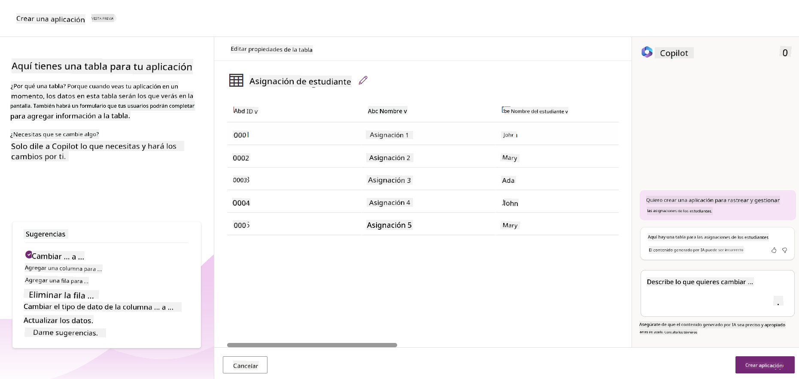
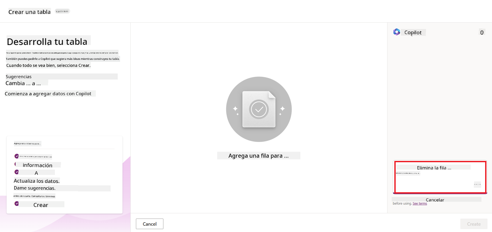
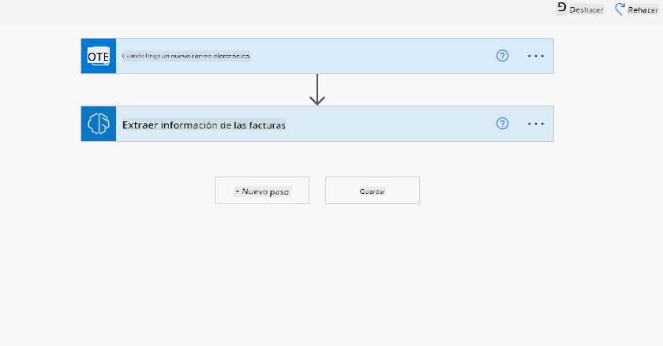
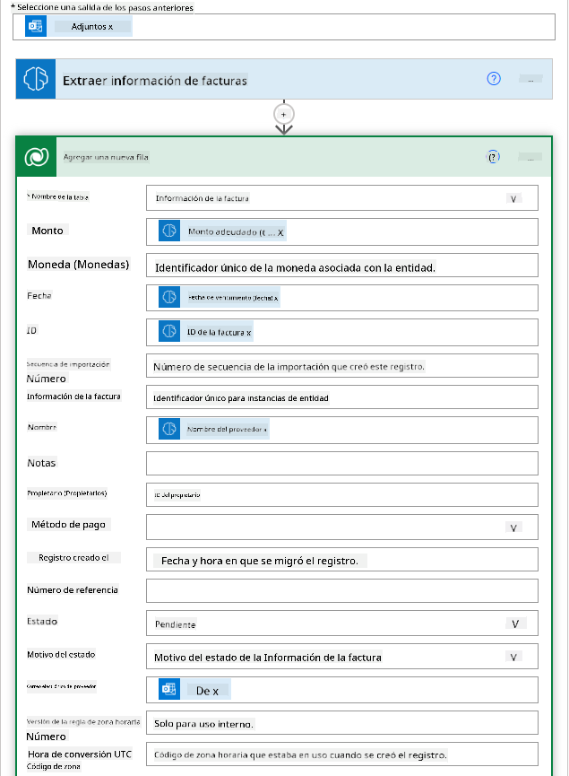

<!--
CO_OP_TRANSLATOR_METADATA:
{
  "original_hash": "f5ff3b6204a695a117d6f452403c95f7",
  "translation_date": "2025-07-09T13:39:08+00:00",
  "source_file": "10-building-low-code-ai-applications/README.md",
  "language_code": "es"
}
-->
# Construyendo Aplicaciones de IA con Bajo Código

> _(Haz clic en la imagen de arriba para ver el video de esta lección)_

## Introducción

Ahora que hemos aprendido a construir aplicaciones generadoras de imágenes, hablemos de bajo código. La IA generativa puede usarse en diversas áreas, incluido el bajo código, pero ¿qué es bajo código y cómo podemos agregar IA a esto?

Construir aplicaciones y soluciones se ha vuelto más fácil tanto para desarrolladores tradicionales como para no desarrolladores gracias al uso de Plataformas de Desarrollo de Bajo Código. Estas plataformas permiten crear aplicaciones y soluciones con poco o ningún código. Esto se logra proporcionando un entorno de desarrollo visual que permite arrastrar y soltar componentes para construir aplicaciones y soluciones. Esto permite desarrollar aplicaciones y soluciones más rápido y con menos recursos. En esta lección, profundizaremos en cómo usar bajo código y cómo mejorar el desarrollo de bajo código con IA usando Power Platform.

Power Platform ofrece a las organizaciones la oportunidad de empoderar a sus equipos para que construyan sus propias soluciones a través de un entorno intuitivo de bajo código o sin código. Este entorno ayuda a simplificar el proceso de creación de soluciones. Con Power Platform, las soluciones pueden construirse en días o semanas en lugar de meses o años. Power Platform consta de cinco productos clave: Power Apps, Power Automate, Power BI, Power Pages y Copilot Studio.

Esta lección cubre:

- Introducción a la IA Generativa en Power Platform  
- Introducción a Copilot y cómo usarlo  
- Uso de IA Generativa para construir aplicaciones y flujos en Power Platform  
- Comprender los Modelos de IA en Power Platform con AI Builder  

## Objetivos de Aprendizaje

Al finalizar esta lección, podrás:

- Entender cómo funciona Copilot en Power Platform.

- Construir una aplicación para rastrear tareas estudiantiles para nuestra startup educativa.

- Crear un flujo para el procesamiento de facturas que use IA para extraer información de las facturas.

- Aplicar buenas prácticas al usar el Modelo de IA Create Text con GPT.

Las herramientas y tecnologías que usarás en esta lección son:

- **Power Apps**, para la aplicación de rastreo de tareas estudiantiles, que ofrece un entorno de desarrollo de bajo código para construir apps que rastrean, gestionan e interactúan con datos.

- **Dataverse**, para almacenar los datos de la aplicación de rastreo de tareas estudiantiles, proporcionando una plataforma de datos de bajo código para almacenar los datos de la app.

- **Power Automate**, para el flujo de procesamiento de facturas, donde tendrás un entorno de desarrollo de bajo código para construir flujos de trabajo que automaticen el proceso de facturación.

- **AI Builder**, para el Modelo de IA de procesamiento de facturas, donde usarás modelos de IA preconstruidos para procesar las facturas de nuestra startup.

## IA Generativa en Power Platform

Mejorar el desarrollo y la aplicación de bajo código con IA generativa es un área clave para Power Platform. El objetivo es permitir que todos construyan aplicaciones, sitios, paneles y automaticen procesos con IA, _sin necesidad de experiencia en ciencia de datos_. Este objetivo se logra integrando IA generativa en la experiencia de desarrollo de bajo código en Power Platform en forma de Copilot y AI Builder.

### ¿Cómo funciona esto?

Copilot es un asistente de IA que te permite construir soluciones en Power Platform describiendo tus requerimientos en una serie de pasos conversacionales usando lenguaje natural. Por ejemplo, puedes indicarle a tu asistente de IA qué campos usará tu app y él creará tanto la app como el modelo de datos subyacente, o puedes especificar cómo configurar un flujo en Power Automate.

Puedes usar funcionalidades impulsadas por Copilot como una característica en las pantallas de tu app para que los usuarios descubran insights mediante interacciones conversacionales.

AI Builder es una capacidad de IA de bajo código disponible en Power Platform que te permite usar Modelos de IA para ayudarte a automatizar procesos y predecir resultados. Con AI Builder puedes incorporar IA a tus apps y flujos que se conectan a tus datos en Dataverse o en diversas fuentes de datos en la nube, como SharePoint, OneDrive o Azure.

Copilot está disponible en todos los productos de Power Platform: Power Apps, Power Automate, Power BI, Power Pages y Power Virtual Agents. AI Builder está disponible en Power Apps y Power Automate. En esta lección, nos enfocaremos en cómo usar Copilot y AI Builder en Power Apps y Power Automate para construir una solución para nuestra startup educativa.

### Copilot en Power Apps

Como parte de Power Platform, Power Apps ofrece un entorno de desarrollo de bajo código para construir apps que rastrean, gestionan e interactúan con datos. Es un conjunto de servicios para desarrollo de apps con una plataforma de datos escalable y la capacidad de conectarse a servicios en la nube y datos locales. Power Apps permite construir apps que funcionan en navegadores, tabletas y teléfonos, y pueden compartirse con compañeros de trabajo. Power Apps facilita a los usuarios el desarrollo de apps con una interfaz sencilla, para que cualquier usuario de negocio o desarrollador profesional pueda crear apps personalizadas. La experiencia de desarrollo de apps también se mejora con IA Generativa a través de Copilot.

La función de asistente de IA Copilot en Power Apps te permite describir qué tipo de app necesitas y qué información quieres que tu app rastree, recoja o muestre. Copilot genera entonces una app Canvas responsiva basada en tu descripción. Luego puedes personalizar la app para que se ajuste a tus necesidades. El AI Copilot también genera y sugiere una Tabla de Dataverse con los campos necesarios para almacenar los datos que quieres rastrear y algunos datos de ejemplo. Más adelante en esta lección veremos qué es Dataverse y cómo usarlo en Power Apps. Luego puedes personalizar la tabla para que se ajuste a tus necesidades usando la función de asistente AI Copilot mediante pasos conversacionales. Esta función está disponible desde la pantalla principal de Power Apps.

### Copilot en Power Automate

Como parte de Power Platform, Power Automate permite a los usuarios crear flujos de trabajo automatizados entre aplicaciones y servicios. Ayuda a automatizar procesos empresariales repetitivos como comunicación, recopilación de datos y aprobaciones de decisiones. Su interfaz sencilla permite a usuarios de todos los niveles técnicos (desde principiantes hasta desarrolladores experimentados) automatizar tareas laborales. La experiencia de desarrollo de flujos también se mejora con IA Generativa a través de Copilot.

La función de asistente de IA Copilot en Power Automate te permite describir qué tipo de flujo necesitas y qué acciones quieres que realice tu flujo. Copilot genera entonces un flujo basado en tu descripción. Luego puedes personalizar el flujo para que se ajuste a tus necesidades. El AI Copilot también genera y sugiere las acciones necesarias para realizar la tarea que quieres automatizar. Más adelante en esta lección veremos qué son los flujos y cómo usarlos en Power Automate. Luego puedes personalizar las acciones para que se ajusten a tus necesidades usando la función de asistente AI Copilot mediante pasos conversacionales. Esta función está disponible desde la pantalla principal de Power Automate.

## Tarea: Gestionar tareas estudiantiles y facturas para nuestra startup, usando Copilot

Nuestra startup ofrece cursos en línea a estudiantes. La startup ha crecido rápidamente y ahora tiene dificultades para satisfacer la demanda de sus cursos. La startup te ha contratado como desarrollador de Power Platform para ayudarles a construir una solución de bajo código que les ayude a gestionar las tareas estudiantiles y las facturas. Su solución debe permitirles rastrear y gestionar las tareas estudiantiles mediante una app y automatizar el proceso de facturación mediante un flujo de trabajo. Te han pedido usar IA Generativa para desarrollar la solución.

Cuando empieces a usar Copilot, puedes usar la [Power Platform Copilot Prompt Library](https://github.com/pnp/powerplatform-prompts?WT.mc_id=academic-109639-somelezediko) para comenzar con los prompts. Esta biblioteca contiene una lista de prompts que puedes usar para construir apps y flujos con Copilot. También puedes usar los prompts de la biblioteca para tener una idea de cómo describir tus requerimientos a Copilot.

### Construir una App para Rastrear Tareas Estudiantiles para Nuestra Startup

Los educadores de nuestra startup han tenido dificultades para llevar el control de las tareas estudiantiles. Han estado usando una hoja de cálculo para rastrear las tareas, pero esto se ha vuelto difícil de manejar a medida que ha aumentado el número de estudiantes. Te han pedido construir una app que les ayude a rastrear y gestionar las tareas estudiantiles. La app debe permitir agregar nuevas tareas, ver tareas, actualizar tareas y eliminar tareas. La app también debe permitir a educadores y estudiantes ver las tareas que han sido calificadas y las que no.

Construirás la app usando Copilot en Power Apps siguiendo los pasos a continuación:

1. Navega a la pantalla principal de [Power Apps](https://make.powerapps.com?WT.mc_id=academic-105485-koreyst).

1. Usa el área de texto en la pantalla principal para describir la app que quieres construir. Por ejemplo, **_Quiero construir una app para rastrear y gestionar tareas estudiantiles_**. Haz clic en el botón **Enviar** para enviar el prompt al AI Copilot.

1. El AI Copilot sugerirá una Tabla de Dataverse con los campos necesarios para almacenar los datos que quieres rastrear y algunos datos de ejemplo. Luego puedes personalizar la tabla para que se ajuste a tus necesidades usando la función de asistente AI Copilot mediante pasos conversacionales.

   > **Importante**: Dataverse es la plataforma de datos subyacente para Power Platform. Es una plataforma de datos de bajo código para almacenar los datos de la app. Es un servicio totalmente gestionado que almacena datos de forma segura en la nube de Microsoft y se provisiona dentro de tu entorno de Power Platform. Cuenta con capacidades integradas de gobernanza de datos, como clasificación de datos, linaje de datos, control de acceso detallado y más. Puedes aprender más sobre Dataverse [aquí](https://docs.microsoft.com/powerapps/maker/data-platform/data-platform-intro?WT.mc_id=academic-109639-somelezediko).

   

1. Los educadores quieren enviar correos electrónicos a los estudiantes que han entregado sus tareas para mantenerlos informados sobre el progreso de sus tareas. Puedes usar Copilot para agregar un nuevo campo a la tabla para almacenar el correo electrónico del estudiante. Por ejemplo, puedes usar el siguiente prompt para agregar un nuevo campo a la tabla: **_Quiero agregar una columna para almacenar el correo electrónico del estudiante_**. Haz clic en el botón **Enviar** para enviar el prompt al AI Copilot.

1. El AI Copilot generará un nuevo campo y luego podrás personalizarlo para que se ajuste a tus necesidades.

1. Cuando termines con la tabla, haz clic en el botón **Crear app** para crear la app.

1. El AI Copilot generará una app Canvas responsiva basada en tu descripción. Luego podrás personalizar la app para que se ajuste a tus necesidades.

1. Para que los educadores puedan enviar correos a los estudiantes, puedes usar Copilot para agregar una nueva pantalla a la app. Por ejemplo, puedes usar el siguiente prompt para agregar una nueva pantalla a la app: **_Quiero agregar una pantalla para enviar correos a los estudiantes_**. Haz clic en el botón **Enviar** para enviar el prompt al AI Copilot.

1. El AI Copilot generará una nueva pantalla y luego podrás personalizarla para que se ajuste a tus necesidades.

1. Cuando termines con la app, haz clic en el botón **Guardar** para guardar la app.

1. Para compartir la app con los educadores, haz clic en el botón **Compartir** y luego haz clic nuevamente en el botón **Compartir**. Luego podrás compartir la app con los educadores ingresando sus direcciones de correo electrónico.

> **Tu tarea**: La app que acabas de construir es un buen comienzo, pero puede mejorarse. Con la función de correo electrónico, los educadores solo pueden enviar correos manualmente, escribiendo las direcciones de correo. ¿Puedes usar Copilot para construir una automatización que permita a los educadores enviar correos automáticamente a los estudiantes cuando entreguen sus tareas? La pista es que con el prompt adecuado puedes usar Copilot en Power Automate para construir esto.

### Construir una Tabla de Información de Facturas para Nuestra Startup

El equipo financiero de nuestra startup ha tenido dificultades para llevar el control de las facturas. Han estado usando una hoja de cálculo para rastrear las facturas, pero esto se ha vuelto difícil de manejar a medida que ha aumentado el número de facturas. Te han pedido construir una tabla que les ayude a almacenar, rastrear y gestionar la información de las facturas que reciben. La tabla debe usarse para construir una automatización que extraiga toda la información de las facturas y la almacene en la tabla. La tabla también debe permitir al equipo financiero ver las facturas que han sido pagadas y las que no.

Power Platform tiene una plataforma de datos subyacente llamada Dataverse que te permite almacenar los datos para tus apps y soluciones. Dataverse proporciona una plataforma de datos de bajo código para almacenar los datos de la app. Es un servicio totalmente gestionado que almacena datos de forma segura en la nube de Microsoft y se provisiona dentro de tu entorno de Power Platform. Cuenta con capacidades integradas de gobernanza de datos, como clasificación de datos, linaje de datos, control de acceso detallado y más. Puedes aprender más [sobre Dataverse aquí](https://docs.microsoft.com/powerapps/maker/data-platform/data-platform-intro?WT.mc_id=academic-109639-somelezediko).

¿Por qué deberíamos usar Dataverse para nuestra startup? Las tablas estándar y personalizadas dentro de Dataverse ofrecen una opción de almacenamiento segura y basada en la nube para tus datos. Las tablas te permiten almacenar diferentes tipos de datos, similar a cómo usarías varias hojas en un solo libro de Excel. Puedes usar tablas para almacenar datos específicos de tu organización o necesidades de negocio. Algunos de los beneficios que nuestra startup obtendrá al usar Dataverse incluyen, pero no se limitan a:
- **Fácil de gestionar**: Tanto los metadatos como los datos se almacenan en la nube, por lo que no tienes que preocuparte por los detalles de cómo se guardan o gestionan. Puedes centrarte en crear tus aplicaciones y soluciones.

- **Seguro**: Dataverse ofrece una opción de almacenamiento segura y basada en la nube para tus datos. Puedes controlar quién tiene acceso a los datos en tus tablas y cómo pueden acceder a ellos mediante seguridad basada en roles.

- **Metadatos enriquecidos**: Los tipos de datos y las relaciones se utilizan directamente dentro de Power Apps.

- **Lógica y validación**: Puedes usar reglas de negocio, campos calculados y reglas de validación para aplicar la lógica empresarial y mantener la precisión de los datos.

Ahora que sabes qué es Dataverse y por qué deberías usarlo, veamos cómo puedes usar Copilot para crear una tabla en Dataverse que cumpla con los requisitos de nuestro equipo financiero.

> **Note** : Usarás esta tabla en la siguiente sección para construir una automatización que extraiga toda la información de las facturas y la almacene en la tabla.

Para crear una tabla en Dataverse usando Copilot, sigue los pasos a continuación:

1. Navega a la pantalla principal de [Power Apps](https://make.powerapps.com?WT.mc_id=academic-105485-koreyst).

2. En la barra de navegación izquierda, selecciona **Tables** y luego haz clic en **Describe the new Table**.

3. En la pantalla **Describe the new Table**, usa el área de texto para describir la tabla que quieres crear. Por ejemplo, **_Quiero crear una tabla para almacenar información de facturas_**. Haz clic en el botón **Send** para enviar el mensaje al AI Copilot.

4. El AI Copilot sugerirá una tabla de Dataverse con los campos necesarios para almacenar los datos que quieres rastrear y algunos datos de ejemplo. Luego puedes personalizar la tabla para que se ajuste a tus necesidades usando la función asistente de AI Copilot a través de pasos conversacionales.

5. El equipo financiero quiere enviar un correo electrónico al proveedor para actualizarlo con el estado actual de su factura. Puedes usar Copilot para agregar un nuevo campo a la tabla para almacenar el correo electrónico del proveedor. Por ejemplo, puedes usar el siguiente mensaje para agregar un nuevo campo a la tabla: **_Quiero agregar una columna para almacenar el correo electrónico del proveedor_**. Haz clic en el botón **Send** para enviar el mensaje al AI Copilot.

6. El AI Copilot generará un nuevo campo y luego podrás personalizarlo para que se ajuste a tus necesidades.

7. Cuando termines con la tabla, haz clic en el botón **Create** para crear la tabla.

## Modelos de IA en Power Platform con AI Builder

AI Builder es una capacidad de IA de bajo código disponible en Power Platform que te permite usar Modelos de IA para ayudarte a automatizar procesos y predecir resultados. Con AI Builder puedes incorporar IA en tus aplicaciones y flujos que se conectan a tus datos en Dataverse o en diversas fuentes de datos en la nube, como SharePoint, OneDrive o Azure.

## Modelos de IA preconstruidos vs Modelos de IA personalizados

AI Builder ofrece dos tipos de Modelos de IA: Modelos de IA preconstruidos y Modelos de IA personalizados. Los Modelos de IA preconstruidos son modelos listos para usar, entrenados por Microsoft y disponibles en Power Platform. Estos te ayudan a agregar inteligencia a tus aplicaciones y flujos sin tener que recopilar datos y luego construir, entrenar y publicar tus propios modelos. Puedes usar estos modelos para automatizar procesos y predecir resultados.

Algunos de los Modelos de IA preconstruidos disponibles en Power Platform incluyen:

- **Extracción de frases clave**: Este modelo extrae frases clave de un texto.
- **Detección de idioma**: Este modelo detecta el idioma de un texto.
- **Análisis de sentimiento**: Este modelo detecta sentimientos positivos, negativos, neutrales o mixtos en un texto.
- **Lector de tarjetas de presentación**: Este modelo extrae información de tarjetas de presentación.
- **Reconocimiento de texto**: Este modelo extrae texto de imágenes.
- **Detección de objetos**: Este modelo detecta y extrae objetos de imágenes.
- **Procesamiento de documentos**: Este modelo extrae información de formularios.
- **Procesamiento de facturas**: Este modelo extrae información de facturas.

Con los Modelos de IA personalizados puedes incorporar tu propio modelo en AI Builder para que funcione como cualquier modelo personalizado de AI Builder, permitiéndote entrenar el modelo con tus propios datos. Puedes usar estos modelos para automatizar procesos y predecir resultados tanto en Power Apps como en Power Automate. Al usar tu propio modelo, existen limitaciones que aplican. Lee más sobre estas [limitaciones](https://learn.microsoft.com/ai-builder/byo-model#limitations?WT.mc_id=academic-105485-koreyst).

## Tarea #2 - Construir un flujo de procesamiento de facturas para nuestra startup

El equipo financiero ha tenido dificultades para procesar facturas. Han estado usando una hoja de cálculo para hacer seguimiento de las facturas, pero esto se ha vuelto difícil de manejar a medida que ha aumentado el número de facturas. Te han pedido que construyas un flujo de trabajo que les ayude a procesar facturas usando IA. El flujo de trabajo debe permitirles extraer información de las facturas y almacenar esa información en una tabla de Dataverse. También debe permitirles enviar un correo electrónico al equipo financiero con la información extraída.

Ahora que sabes qué es AI Builder y por qué deberías usarlo, veamos cómo puedes usar el Modelo de IA de procesamiento de facturas en AI Builder, que cubrimos anteriormente, para construir un flujo de trabajo que ayude al equipo financiero a procesar facturas.

Para construir un flujo de trabajo que ayude al equipo financiero a procesar facturas usando el Modelo de IA de procesamiento de facturas en AI Builder, sigue los pasos a continuación:

1. Navega a la pantalla principal de [Power Automate](https://make.powerautomate.com?WT.mc_id=academic-105485-koreyst).

2. Usa el área de texto en la pantalla principal para describir el flujo de trabajo que quieres construir. Por ejemplo, **_Procesar una factura cuando llegue a mi buzón_**. Haz clic en el botón **Send** para enviar el mensaje al AI Copilot.

   

3. El AI Copilot sugerirá las acciones que necesitas para realizar la tarea que quieres automatizar. Puedes hacer clic en el botón **Next** para avanzar a los siguientes pasos.

4. En el siguiente paso, Power Automate te pedirá configurar las conexiones necesarias para el flujo. Cuando termines, haz clic en el botón **Create flow** para crear el flujo.

5. El AI Copilot generará un flujo y luego podrás personalizarlo para que se ajuste a tus necesidades.

6. Actualiza el disparador del flujo y configura la **Folder** a la carpeta donde se almacenarán las facturas. Por ejemplo, puedes configurar la carpeta a **Inbox**. Haz clic en **Show advanced options** y configura **Only with Attachments** a **Yes**. Esto asegurará que el flujo solo se ejecute cuando se reciba un correo con un archivo adjunto en la carpeta.

7. Elimina las siguientes acciones del flujo: **HTML to text**, **Compose**, **Compose 2**, **Compose 3** y **Compose 4** porque no las usarás.

8. Elimina la acción **Condition** del flujo porque no la usarás. Debe verse como en la siguiente captura:

   

9. Haz clic en el botón **Add an action** y busca **Dataverse**. Selecciona la acción **Add a new row**.

10. En la acción **Extract Information from invoices**, actualiza el campo **Invoice File** para que apunte al **Attachment Content** del correo electrónico. Esto asegurará que el flujo extraiga información del archivo adjunto de la factura.

11. Selecciona la **Table** que creaste anteriormente. Por ejemplo, puedes seleccionar la tabla **Invoice Information**. Elige el contenido dinámico de la acción anterior para completar los siguientes campos:

    - ID
    - Amount
    - Date
    - Name
    - Status - Configura el **Status** a **Pending**.
    - Supplier Email - Usa el contenido dinámico **From** del disparador **When a new email arrives**.

    

12. Cuando termines con el flujo, haz clic en el botón **Save** para guardarlo. Luego puedes probar el flujo enviando un correo con una factura a la carpeta que especificaste en el disparador.

> **Tu tarea**: El flujo que acabas de construir es un buen comienzo, ahora necesitas pensar cómo construir una automatización que permita a nuestro equipo financiero enviar un correo al proveedor para actualizarlo con el estado actual de su factura. Pista: el flujo debe ejecutarse cuando cambie el estado de la factura.

## Usar un Modelo de IA de generación de texto en Power Automate

El Modelo de IA Create Text with GPT en AI Builder te permite generar texto basado en un mensaje y está potenciado por el Microsoft Azure OpenAI Service. Con esta capacidad, puedes incorporar la tecnología GPT (Generative Pre-Trained Transformer) en tus aplicaciones y flujos para construir una variedad de flujos automatizados y aplicaciones con información valiosa.

Los modelos GPT pasan por un entrenamiento extenso con grandes cantidades de datos, lo que les permite producir texto que se asemeja mucho al lenguaje humano cuando se les proporciona un mensaje. Cuando se integran con la automatización de flujos de trabajo, modelos de IA como GPT pueden usarse para simplificar y automatizar una amplia gama de tareas.

Por ejemplo, puedes construir flujos para generar automáticamente texto para diversos casos de uso, como: borradores de correos electrónicos, descripciones de productos y más. También puedes usar el modelo para generar texto para diferentes aplicaciones, como chatbots y aplicaciones de servicio al cliente que permiten a los agentes responder de manera efectiva y eficiente a las consultas de los clientes.

Para aprender cómo usar este Modelo de IA en Power Automate, revisa el módulo [Add intelligence with AI Builder and GPT](https://learn.microsoft.com/training/modules/ai-builder-text-generation/?WT.mc_id=academic-109639-somelezediko).

## ¡Buen trabajo! Continúa aprendiendo

Después de completar esta lección, visita nuestra [colección de aprendizaje de IA generativa](https://aka.ms/genai-collection?WT.mc_id=academic-105485-koreyst) para seguir mejorando tus conocimientos en IA generativa.

Dirígete a la Lección 11 donde veremos cómo [integrar IA generativa con Function Calling](../11-integrating-with-function-calling/README.md?WT.mc_id=academic-105485-koreyst).

**Aviso legal**:  
Este documento ha sido traducido utilizando el servicio de traducción automática [Co-op Translator](https://github.com/Azure/co-op-translator). Aunque nos esforzamos por la precisión, tenga en cuenta que las traducciones automáticas pueden contener errores o inexactitudes. El documento original en su idioma nativo debe considerarse la fuente autorizada. Para información crítica, se recomienda la traducción profesional realizada por humanos. No nos hacemos responsables de malentendidos o interpretaciones erróneas derivadas del uso de esta traducción.