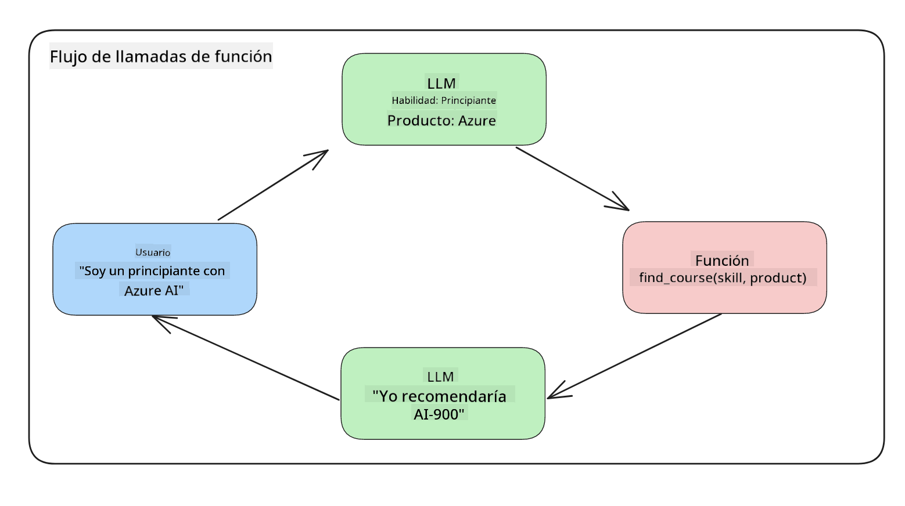
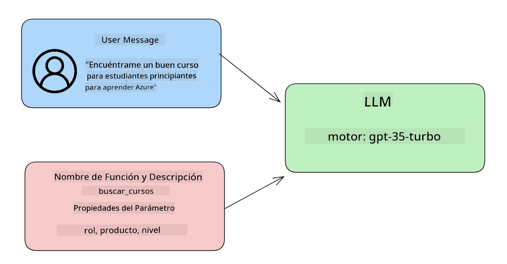

<!--
CO_OP_TRANSLATOR_METADATA:
{
  "original_hash": "77a48a201447be19aa7560706d6f93a0",
  "translation_date": "2025-05-19T21:18:42+00:00",
  "source_file": "11-integrating-with-function-calling/README.md",
  "language_code": "es"
}
-->
# Integración con llamadas a funciones

[](https://aka.ms/gen-ai-lesson11-gh?WT.mc_id=academic-105485-koreyst)

Has aprendido bastante hasta ahora en las lecciones anteriores. Sin embargo, podemos mejorar aún más. Algunas cosas que podemos abordar son cómo obtener un formato de respuesta más consistente para facilitar el trabajo con la respuesta posteriormente. Además, podríamos querer agregar datos de otras fuentes para enriquecer aún más nuestra aplicación.

Los problemas mencionados anteriormente son lo que este capítulo busca abordar.

## Introducción

Esta lección cubrirá:

- Explicar qué es la llamada a funciones y sus casos de uso.
- Crear una llamada a función usando Azure OpenAI.
- Cómo integrar una llamada a función en una aplicación.

## Objetivos de Aprendizaje

Al final de esta lección, podrás:

- Explicar el propósito de usar llamadas a funciones.
- Configurar la llamada a función usando el servicio Azure OpenAI.
- Diseñar llamadas a funciones efectivas para el caso de uso de tu aplicación.

## Escenario: Mejorando nuestro chatbot con funciones

Para esta lección, queremos construir una función para nuestra startup educativa que permita a los usuarios utilizar un chatbot para encontrar cursos técnicos. Recomendaremos cursos que se ajusten a su nivel de habilidad, rol actual y tecnología de interés.

Para completar este escenario, utilizaremos una combinación de:

- `Azure OpenAI` para crear una experiencia de chat para el usuario.
- `Microsoft Learn Catalog API` para ayudar a los usuarios a encontrar cursos basados en la solicitud del usuario.
- `Function Calling` para tomar la consulta del usuario y enviarla a una función para realizar la solicitud API.

Para comenzar, veamos por qué querríamos usar llamadas a funciones en primer lugar:

## Por qué Llamadas a Funciones

Antes de las llamadas a funciones, las respuestas de un LLM eran no estructuradas e inconsistentes. Los desarrolladores debían escribir código de validación complejo para asegurarse de poder manejar cada variación de una respuesta. Los usuarios no podían obtener respuestas como "¿Cuál es el clima actual en Estocolmo?". Esto se debe a que los modelos estaban limitados al tiempo en que se entrenaron los datos.

La llamada a funciones es una característica del servicio Azure OpenAI para superar las siguientes limitaciones:

- **Formato de respuesta consistente**. Si podemos controlar mejor el formato de respuesta, podemos integrar más fácilmente la respuesta en otros sistemas.
- **Datos externos**. Capacidad de usar datos de otras fuentes de una aplicación en un contexto de chat.

## Ilustrando el problema a través de un escenario

> Te recomendamos usar el [notebook incluido](../../../11-integrating-with-function-calling/python/aoai-assignment.ipynb) si deseas ejecutar el siguiente escenario. También puedes simplemente leer mientras intentamos ilustrar un problema donde las funciones pueden ayudar a abordar el problema.

Veamos el ejemplo que ilustra el problema del formato de respuesta:

Supongamos que queremos crear una base de datos de datos de estudiantes para poder sugerirles el curso adecuado. A continuación, tenemos dos descripciones de estudiantes que son muy similares en los datos que contienen.

1. Crear una conexión a nuestro recurso Azure OpenAI:

   ```python
   import os
   import json
   from openai import AzureOpenAI
   from dotenv import load_dotenv
   load_dotenv()

   client = AzureOpenAI(
   api_key=os.environ['AZURE_OPENAI_API_KEY'],  # this is also the default, it can be omitted
   api_version = "2023-07-01-preview"
   )

   deployment=os.environ['AZURE_OPENAI_DEPLOYMENT']
   ```

   A continuación se muestra algo de código Python para configurar nuestra conexión a Azure OpenAI donde establecemos `api_type`, `api_base`, `api_version` and `api_key`.

1. Creating two student descriptions using variables `student_1_description` and `student_2_description`.

   ```python
   student_1_description="Emily Johnson is a sophomore majoring in computer science at Duke University. She has a 3.7 GPA. Emily is an active member of the university's Chess Club and Debate Team. She hopes to pursue a career in software engineering after graduating."

   student_2_description = "Michael Lee is a sophomore majoring in computer science at Stanford University. He has a 3.8 GPA. Michael is known for his programming skills and is an active member of the university's Robotics Club. He hopes to pursue a career in artificial intelligence after finishing his studies."
   ```

   Queremos enviar las descripciones de los estudiantes anteriores a un LLM para analizar los datos. Estos datos pueden usarse más tarde en nuestra aplicación y enviarse a una API o almacenarse en una base de datos.

1. Creemos dos indicaciones idénticas en las que instruimos al LLM sobre qué información nos interesa:

   ```python
   prompt1 = f'''
   Please extract the following information from the given text and return it as a JSON object:

   name
   major
   school
   grades
   club

   This is the body of text to extract the information from:
   {student_1_description}
   '''

   prompt2 = f'''
   Please extract the following information from the given text and return it as a JSON object:

   name
   major
   school
   grades
   club

   This is the body of text to extract the information from:
   {student_2_description}
   '''
   ```

   Las indicaciones anteriores instruyen al LLM para extraer información y devolver la respuesta en formato JSON.

1. Después de configurar las indicaciones y la conexión a Azure OpenAI, ahora enviaremos las indicaciones al LLM utilizando `openai.ChatCompletion`. We store the prompt in the `messages` variable and assign the role to `user`. Esto es para imitar un mensaje de un usuario que se escribe a un chatbot.

   ```python
   # response from prompt one
   openai_response1 = client.chat.completions.create(
   model=deployment,
   messages = [{'role': 'user', 'content': prompt1}]
   )
   openai_response1.choices[0].message.content

   # response from prompt two
   openai_response2 = client.chat.completions.create(
   model=deployment,
   messages = [{'role': 'user', 'content': prompt2}]
   )
   openai_response2.choices[0].message.content
   ```

Ahora podemos enviar ambas solicitudes al LLM y examinar la respuesta que recibimos encontrándola así `openai_response1['choices'][0]['message']['content']`.

1. Lastly, we can convert the response to JSON format by calling `json.loads`:

   ```python
   # Loading the response as a JSON object
   json_response1 = json.loads(openai_response1.choices[0].message.content)
   json_response1
   ```

   Respuesta 1:

   ```json
   {
     "name": "Emily Johnson",
     "major": "computer science",
     "school": "Duke University",
     "grades": "3.7",
     "club": "Chess Club"
   }
   ```

   Respuesta 2:

   ```json
   {
     "name": "Michael Lee",
     "major": "computer science",
     "school": "Stanford University",
     "grades": "3.8 GPA",
     "club": "Robotics Club"
   }
   ```

   Aunque las indicaciones son las mismas y las descripciones son similares, vemos valores de `Grades` property formatted differently, as we can sometimes get the format `3.7` or `3.7 GPA` for example.

   This result is because the LLM takes unstructured data in the form of the written prompt and returns also unstructured data. We need to have a structured format so that we know what to expect when storing or using this data

So how do we solve the formatting problem then? By using functional calling, we can make sure that we receive structured data back. When using function calling, the LLM does not actually call or run any functions. Instead, we create a structure for the LLM to follow for its responses. We then use those structured responses to know what function to run in our applications.



We can then take what is returned from the function and send this back to the LLM. The LLM will then respond using natural language to answer the user's query.

## Use Cases for using function calls

There are many different use cases where function calls can improve your app like:

- **Calling External Tools**. Chatbots are great at providing answers to questions from users. By using function calling, the chatbots can use messages from users to complete certain tasks. For example, a student can ask the chatbot to "Send an email to my instructor saying I need more assistance with this subject". This can make a function call to `send_email(to: string, body: string)`

- **Create API or Database Queries**. Users can find information using natural language that gets converted into a formatted query or API request. An example of this could be a teacher who requests "Who are the students that completed the last assignment" which could call a function named `get_completed(student_name: string, assignment: int, current_status: string)`

- **Creating Structured Data**. Users can take a block of text or CSV and use the LLM to extract important information from it. For example, a student can convert a Wikipedia article about peace agreements to create AI flashcards. This can be done by using a function called `get_important_facts(agreement_name: string, date_signed: string, parties_involved: list)`

## Creating Your First Function Call

The process of creating a function call includes 3 main steps:

1. **Calling** the Chat Completions API with a list of your functions and a user message.
2. **Reading** the model's response to perform an action i.e. execute a function or API Call.
3. **Making** another call to Chat Completions API with the response from your function to use that information to create a response to the user.



### Step 1 - creating messages

The first step is to create a user message. This can be dynamically assigned by taking the value of a text input or you can assign a value here. If this is your first time working with the Chat Completions API, we need to define the `role` and the `content` of the message.

The `role` can be either `system` (creating rules), `assistant` (the model) or `user` (the end-user). For function calling, we will assign this as `user` y una pregunta de ejemplo.

```python
messages= [ {"role": "user", "content": "Find me a good course for a beginner student to learn Azure."} ]
```

Asignando diferentes roles, queda claro para el LLM si es el sistema diciendo algo o el usuario, lo que ayuda a construir un historial de conversación sobre el que el LLM puede construir.

### Paso 2 - creando funciones

A continuación, definiremos una función y los parámetros de esa función. Usaremos solo una función aquí llamada `search_courses` but you can create multiple functions.

> **Important** : Functions are included in the system message to the LLM and will be included in the amount of available tokens you have available.

Below, we create the functions as an array of items. Each item is a function and has properties `name`, `description` and `parameters`:

```python
functions = [
   {
      "name":"search_courses",
      "description":"Retrieves courses from the search index based on the parameters provided",
      "parameters":{
         "type":"object",
         "properties":{
            "role":{
               "type":"string",
               "description":"The role of the learner (i.e. developer, data scientist, student, etc.)"
            },
            "product":{
               "type":"string",
               "description":"The product that the lesson is covering (i.e. Azure, Power BI, etc.)"
            },
            "level":{
               "type":"string",
               "description":"The level of experience the learner has prior to taking the course (i.e. beginner, intermediate, advanced)"
            }
         },
         "required":[
            "role"
         ]
      }
   }
]
```

Describamos cada instancia de función más en detalle a continuación:

- `name` - The name of the function that we want to have called.
- `description` - This is the description of how the function works. Here it's important to be specific and clear.
- `parameters` - A list of values and format that you want the model to produce in its response. The parameters array consists of items where the items have the following properties:
  1.  `type` - The data type of the properties will be stored in.
  1.  `properties` - List of the specific values that the model will use for its response
      1. `name` - The key is the name of the property that the model will use in its formatted response, for example, `product`.
      1. `type` - The data type of this property, for example, `string`.
      1. `description` - Description of the specific property.

There's also an optional property `required` - required property for the function call to be completed.

### Step 3 - Making the function call

After defining a function, we now need to include it in the call to the Chat Completion API. We do this by adding `functions` to the request. In this case `functions=functions`.

There is also an option to set `function_call` to `auto`. This means we will let the LLM decide which function should be called based on the user message rather than assigning it ourselves.

Here's some code below where we call `ChatCompletion.create`, note how we set `functions=functions` and `function_call="auto"` y así dando al LLM la elección de cuándo llamar a las funciones que le proporcionamos:

```python
response = client.chat.completions.create(model=deployment,
                                        messages=messages,
                                        functions=functions,
                                        function_call="auto")

print(response.choices[0].message)
```

La respuesta que vuelve ahora se ve así:

```json
{
  "role": "assistant",
  "function_call": {
    "name": "search_courses",
    "arguments": "{\n  \"role\": \"student\",\n  \"product\": \"Azure\",\n  \"level\": \"beginner\"\n}"
  }
}
```

Aquí podemos ver cómo la función `search_courses` was called and with what arguments, as listed in the `arguments` property in the JSON response.

The conclusion the LLM was able to find the data to fit the arguments of the function as it was extracting it from the value provided to the `messages` parameter in the chat completion call. Below is a reminder of the `messages` valor:

```python
messages= [ {"role": "user", "content": "Find me a good course for a beginner student to learn Azure."} ]
```

Como puedes ver, `student`, `Azure` and `beginner` was extracted from `messages` and set as input to the function. Using functions this way is a great way to extract information from a prompt but also to provide structure to the LLM and have reusable functionality.

Next, we need to see how we can use this in our app.

## Integrating Function Calls into an Application

After we have tested the formatted response from the LLM, we can now integrate this into an application.

### Managing the flow

To integrate this into our application, let's take the following steps:

1. First, let's make the call to the OpenAI services and store the message in a variable called `response_message`.

   ```python
   response_message = response.choices[0].message
   ```

1. Ahora definiremos la función que llamará a la API de Microsoft Learn para obtener una lista de cursos:

   ```python
   import requests

   def search_courses(role, product, level):
     url = "https://learn.microsoft.com/api/catalog/"
     params = {
        "role": role,
        "product": product,
        "level": level
     }
     response = requests.get(url, params=params)
     modules = response.json()["modules"]
     results = []
     for module in modules[:5]:
        title = module["title"]
        url = module["url"]
        results.append({"title": title, "url": url})
     return str(results)
   ```

   Observa cómo ahora creamos una función Python real que se asigna a los nombres de funciones introducidos en el `functions` variable. We're also making real external API calls to fetch the data we need. In this case, we go against the Microsoft Learn API to search for training modules.

Ok, so we created `functions` variables and a corresponding Python function, how do we tell the LLM how to map these two together so our Python function is called?

1. To see if we need to call a Python function, we need to look into the LLM response and see if `function_call` es parte de ella y llama a la función señalada. Aquí está cómo puedes hacer la verificación mencionada a continuación:

   ```python
   # Check if the model wants to call a function
   if response_message.function_call.name:
    print("Recommended Function call:")
    print(response_message.function_call.name)
    print()

    # Call the function.
    function_name = response_message.function_call.name

    available_functions = {
            "search_courses": search_courses,
    }
    function_to_call = available_functions[function_name]

    function_args = json.loads(response_message.function_call.arguments)
    function_response = function_to_call(**function_args)

    print("Output of function call:")
    print(function_response)
    print(type(function_response))


    # Add the assistant response and function response to the messages
    messages.append( # adding assistant response to messages
        {
            "role": response_message.role,
            "function_call": {
                "name": function_name,
                "arguments": response_message.function_call.arguments,
            },
            "content": None
        }
    )
    messages.append( # adding function response to messages
        {
            "role": "function",
            "name": function_name,
            "content":function_response,
        }
    )
   ```

   Estas tres líneas aseguran que extraemos el nombre de la función, los argumentos y hacemos la llamada:

   ```python
   function_to_call = available_functions[function_name]

   function_args = json.loads(response_message.function_call.arguments)
   function_response = function_to_call(**function_args)
   ```

   A continuación se muestra la salida de ejecutar nuestro código:

   **Salida**

   ```Recommended Function call:
   {
     "name": "search_courses",
     "arguments": "{\n  \"role\": \"student\",\n  \"product\": \"Azure\",\n  \"level\": \"beginner\"\n}"
   }

   Output of function call:
   [{'title': 'Describe concepts of cryptography', 'url': 'https://learn.microsoft.com/training/modules/describe-concepts-of-cryptography/?
   WT.mc_id=api_CatalogApi'}, {'title': 'Introduction to audio classification with TensorFlow', 'url': 'https://learn.microsoft.com/en-
   us/training/modules/intro-audio-classification-tensorflow/?WT.mc_id=api_CatalogApi'}, {'title': 'Design a Performant Data Model in Azure SQL
   Database with Azure Data Studio', 'url': 'https://learn.microsoft.com/training/modules/design-a-data-model-with-ads/?
   WT.mc_id=api_CatalogApi'}, {'title': 'Getting started with the Microsoft Cloud Adoption Framework for Azure', 'url':
   'https://learn.microsoft.com/training/modules/cloud-adoption-framework-getting-started/?WT.mc_id=api_CatalogApi'}, {'title': 'Set up the
   Rust development environment', 'url': 'https://learn.microsoft.com/training/modules/rust-set-up-environment/?WT.mc_id=api_CatalogApi'}]
   <class 'str'>
   ```

1. Ahora enviaremos el mensaje actualizado, `messages` al LLM para que podamos recibir una respuesta en lenguaje natural en lugar de una respuesta API en formato JSON.

   ```python
   print("Messages in next request:")
   print(messages)
   print()

   second_response = client.chat.completions.create(
      messages=messages,
      model=deployment,
      function_call="auto",
      functions=functions,
      temperature=0
         )  # get a new response from GPT where it can see the function response


   print(second_response.choices[0].message)
   ```

   **Salida**

   ```python
   {
     "role": "assistant",
     "content": "I found some good courses for beginner students to learn Azure:\n\n1. [Describe concepts of cryptography] (https://learn.microsoft.com/training/modules/describe-concepts-of-cryptography/?WT.mc_id=api_CatalogApi)\n2. [Introduction to audio classification with TensorFlow](https://learn.microsoft.com/training/modules/intro-audio-classification-tensorflow/?WT.mc_id=api_CatalogApi)\n3. [Design a Performant Data Model in Azure SQL Database with Azure Data Studio](https://learn.microsoft.com/training/modules/design-a-data-model-with-ads/?WT.mc_id=api_CatalogApi)\n4. [Getting started with the Microsoft Cloud Adoption Framework for Azure](https://learn.microsoft.com/training/modules/cloud-adoption-framework-getting-started/?WT.mc_id=api_CatalogApi)\n5. [Set up the Rust development environment](https://learn.microsoft.com/training/modules/rust-set-up-environment/?WT.mc_id=api_CatalogApi)\n\nYou can click on the links to access the courses."
   }

   ```

## Tarea

Para continuar tu aprendizaje sobre Llamadas a Funciones de Azure OpenAI puedes construir:

- Más parámetros de la función que puedan ayudar a los estudiantes a encontrar más cursos.
- Crear otra llamada a función que tome más información del estudiante como su idioma nativo.
- Crear manejo de errores cuando la llamada a función y/o llamada API no devuelven cursos adecuados.

Consejo: Sigue la [documentación de referencia de la API de Learn](https://learn.microsoft.com/training/support/catalog-api-developer-reference?WT.mc_id=academic-105485-koreyst) para ver cómo y dónde están disponibles estos datos.

## ¡Buen trabajo! Continúa el viaje

Después de completar esta lección, consulta nuestra [colección de aprendizaje de IA generativa](https://aka.ms/genai-collection?WT.mc_id=academic-105485-koreyst) para seguir aumentando tu conocimiento sobre IA generativa.

Dirígete a la Lección 12, donde veremos cómo [diseñar UX para aplicaciones de IA](../12-designing-ux-for-ai-applications/README.md?WT.mc_id=academic-105485-koreyst)!

**Descargo de responsabilidad**:  
Este documento ha sido traducido utilizando el servicio de traducción automática [Co-op Translator](https://github.com/Azure/co-op-translator). Aunque nos esforzamos por lograr precisión, tenga en cuenta que las traducciones automáticas pueden contener errores o imprecisiones. El documento original en su idioma nativo debe considerarse la fuente autorizada. Para información crítica, se recomienda una traducción profesional realizada por humanos. No nos hacemos responsables de ningún malentendido o interpretación errónea que surja del uso de esta traducción.