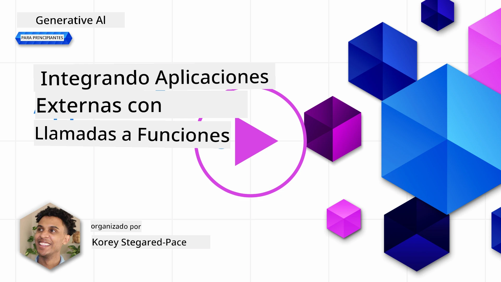
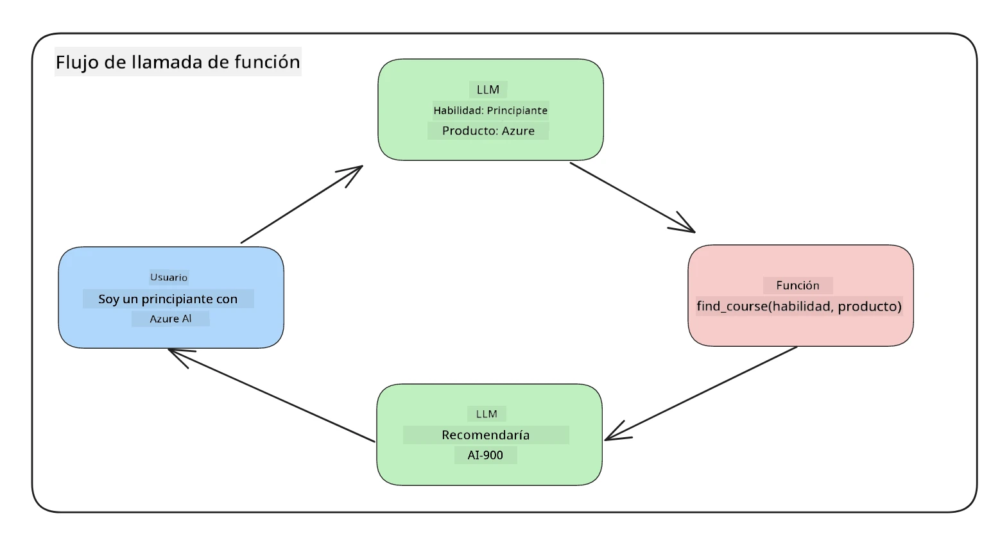
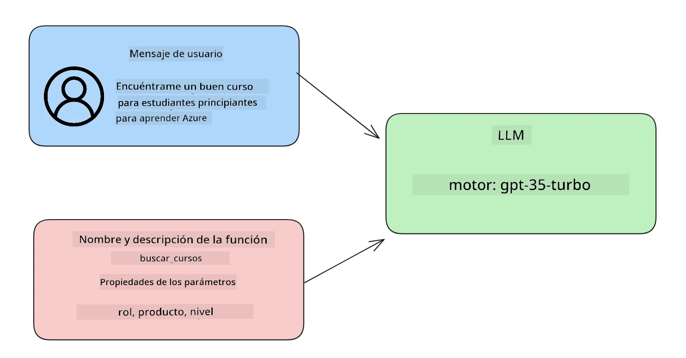

# Integración con llamadas a funciones

[](https://youtu.be/DgUdCLX8qYQ?si=f1ouQU5HQx6F8Gl2)

Has aprendido bastante en las lecciones anteriores. Sin embargo, podemos mejorar aún más. Algunas cosas que podemos abordar son cómo obtener un formato de respuesta más consistente para facilitar el trabajo con la respuesta a posteriori. Además, podríamos querer agregar datos de otras fuentes para enriquecer aún más nuestra aplicación.

Los problemas mencionados son los que este capítulo busca resolver.

## Introducción

Esta lección cubrirá:

- Explicar qué es la llamada a funciones y sus casos de uso.
- Crear una llamada a función usando Azure OpenAI.
- Cómo integrar una llamada a función en una aplicación.

## Objetivos de aprendizaje

Al final de esta lección, serás capaz de:

- Explicar el propósito de usar llamadas a funciones.
- Configurar la llamada a función usando el servicio Azure OpenAI.
- Diseñar llamadas a funciones efectivas para el caso de uso de tu aplicación.

## Escenario: Mejorando nuestro chatbot con funciones

Para esta lección, queremos construir una funcionalidad para nuestra startup educativa que permita a los usuarios usar un chatbot para encontrar cursos técnicos. Recomendaremos cursos que se ajusten a su nivel de habilidad, rol actual y tecnología de interés.

Para completar este escenario, utilizaremos una combinación de:

- `Azure OpenAI` para crear una experiencia de chat para el usuario.
- `Microsoft Learn Catalog API` para ayudar a los usuarios a encontrar cursos basados en su solicitud.
- `Llamada a funciones` para tomar la consulta del usuario y enviarla a una función para hacer la solicitud API.

Para empezar, veamos por qué querríamos usar la llamada a funciones en primer lugar:

## Por qué usar llamadas a funciones

Antes de las llamadas a funciones, las respuestas de un LLM eran no estructuradas e inconsistentes. Los desarrolladores tenían que escribir código complejo de validación para manejar cada variación de respuesta. Los usuarios no podían obtener respuestas como "¿Cuál es el clima actual en Estocolmo?". Esto se debía a que los modelos estaban limitados a la época en que se entrenaron los datos.

La llamada a funciones es una característica del servicio Azure OpenAI para superar las siguientes limitaciones:

- **Formato de respuesta consistente**. Si podemos controlar mejor el formato de la respuesta, podremos integrar más fácilmente la respuesta hacia otros sistemas downstream.
- **Datos externos**. Capacidad de usar datos de otras fuentes de una aplicación en un contexto de chat.

## Ilustrando el problema mediante un escenario

> Te recomendamos usar el [notebook incluido](./python/aoai-assignment.ipynb?WT.mc_id=academic-105485-koreyst) si quieres ejecutar el escenario siguiente. También puedes simplemente leer mientras intentamos ilustrar un problema donde las funciones pueden ayudar a resolverlo.

Veamos el ejemplo que ilustra el problema con el formato de respuesta:

Supongamos que queremos crear una base de datos de datos de estudiantes para sugerirles el curso adecuado. A continuación tenemos dos descripciones de estudiantes que son muy similares en los datos que contienen.

1. Crea una conexión a nuestro recurso Azure OpenAI:

   ```python
   import os
   import json
   from openai import OpenAI
   from dotenv import load_dotenv
   load_dotenv()

   # La API de Respuestas se sirve desde el punto final Azure OpenAI (Microsoft Foundry) v1
   # punto final, por lo que apuntamos el cliente OpenAI a <your-endpoint>/openai/v1/.
   endpoint = os.environ['AZURE_OPENAI_ENDPOINT']
   client = OpenAI(
   api_key=os.environ['AZURE_OPENAI_API_KEY'],
   base_url=f"{endpoint.rstrip('/')}/openai/v1/",
   )

   deployment=os.environ['AZURE_OPENAI_DEPLOYMENT']
   ```

   A continuación hay un código Python para configurar nuestra conexión a Azure OpenAI. Por usar el endpoint v1, solo necesitamos configurar la `api_key` y `base_url` (no se requiere `api_version`).

1. Crear dos descripciones de estudiantes usando las variables `student_1_description` y `student_2_description`.

   ```python
   student_1_description="Emily Johnson is a sophomore majoring in computer science at Duke University. She has a 3.7 GPA. Emily is an active member of the university's Chess Club and Debate Team. She hopes to pursue a career in software engineering after graduating."

   student_2_description = "Michael Lee is a sophomore majoring in computer science at Stanford University. He has a 3.8 GPA. Michael is known for his programming skills and is an active member of the university's Robotics Club. He hopes to pursue a career in artificial intelligence after finishing his studies."
   ```

   Queremos enviar las descripciones de estudiantes anteriores a un LLM para analizar los datos. Estos datos pueden usarse después en nuestra aplicación y enviarse a una API o almacenarse en una base de datos.

1. Vamos a crear dos prompts idénticos en los que instruimos al LLM sobre qué información nos interesa:

   ```python
   prompt1 = f'''
   Please extract the following information from the given text and return it as a JSON object:

   name
   major
   school
   grades
   club

   This is the body of text to extract the information from:
   {student_1_description}
   '''

   prompt2 = f'''
   Please extract the following information from the given text and return it as a JSON object:

   name
   major
   school
   grades
   club

   This is the body of text to extract the information from:
   {student_2_description}
   '''
   ```

   Los prompts anteriores indican al LLM extraer información y devolver la respuesta en formato JSON.

1. Después de configurar los prompts y la conexión a Azure OpenAI, enviaremos los prompts al LLM usando `client.responses.create`. Guardamos el prompt en la variable `input` y asignamos el rol `user`. Esto es para simular un mensaje de un usuario que escribe a un chatbot.

   ```python
   # respuesta del aviso uno
   openai_response1 = client.responses.create(
   model=deployment,
   input = [{'role': 'user', 'content': prompt1}],
   store=False,
   )
   openai_response1.output_text

   # respuesta del aviso dos
   openai_response2 = client.responses.create(
   model=deployment,
   input = [{'role': 'user', 'content': prompt2}],
   store=False,
   )
   openai_response2.output_text
   ```

Ahora podemos enviar ambas solicitudes al LLM y examinar las respuestas que recibimos buscándolas así: `openai_response1.output_text`.

1. Por último, podemos convertir la respuesta a formato JSON llamando a `json.loads`:

   ```python
   # Cargando la respuesta como un objeto JSON
   json_response1 = json.loads(openai_response1.output_text)
   json_response1
   ```

   Respuesta 1:

   ```json
   {
     "name": "Emily Johnson",
     "major": "computer science",
     "school": "Duke University",
     "grades": "3.7",
     "club": "Chess Club"
   }
   ```

   Respuesta 2:

   ```json
   {
     "name": "Michael Lee",
     "major": "computer science",
     "school": "Stanford University",
     "grades": "3.8 GPA",
     "club": "Robotics Club"
   }
   ```

   Aunque los prompts son iguales y las descripciones similares, vemos los valores de la propiedad `Grades` formateados de forma diferente, ya que a veces obtenemos el formato `3.7` o `3.7 GPA` por ejemplo.

   Este resultado es porque el LLM toma datos no estructurados en forma del prompt escrito y también devuelve datos no estructurados. Necesitamos tener un formato estructurado para saber qué esperar al almacenar o usar estos datos.

Entonces, ¿cómo resolvemos el problema del formato? Usando llamadas a funciones, podemos asegurarnos de recibir datos estructurados de vuelta. Al usar llamadas a funciones, el LLM en realidad no llama ni ejecuta ninguna función. En su lugar, creamos una estructura que el LLM debe seguir para sus respuestas. Luego usamos esas respuestas estructuradas para saber qué función ejecutar en nuestras aplicaciones.



Luego podemos tomar lo que se devuelve de la función y enviarlo de vuelta al LLM. El LLM responderá usando lenguaje natural para contestar la consulta del usuario.

## Casos de uso para llamadas a funciones

Hay muchos casos de uso diferentes donde las llamadas a funciones pueden mejorar tu aplicación como:

- **Llamar a herramientas externas**. Los chatbots son excelentes para proporcionar respuestas a preguntas de usuarios. Usando llamadas a funciones, los chatbots pueden usar los mensajes de usuarios para completar ciertas tareas. Por ejemplo, un estudiante puede pedir al chatbot "Enviar un correo a mi instructor diciendo que necesito más ayuda con este tema". Esto puede hacer una llamada a función `send_email(to: string, body: string)`

- **Crear consultas a API o bases de datos**. Los usuarios pueden encontrar información usando lenguaje natural que se convierte en una consulta o solicitud API formateada. Un ejemplo de esto podría ser un profesor que pide "¿Quiénes son los estudiantes que completaron la última tarea?" lo cual puede llamar una función llamada `get_completed(student_name: string, assignment: int, current_status: string)`

- **Crear datos estructurados**. Los usuarios pueden tomar un bloque de texto o CSV y usar el LLM para extraer información importante. Por ejemplo, un estudiante puede convertir un artículo de Wikipedia sobre acuerdos de paz para crear tarjetas de estudio de IA. Esto se puede hacer usando una función llamada `get_important_facts(agreement_name: string, date_signed: string, parties_involved: list)`

## Creando tu primera llamada a función

El proceso de crear una llamada a función incluye 3 pasos principales:

1. **Llamar** a la API de Respuestas con una lista de tus funciones (herramientas) y un mensaje del usuario.
2. **Leer** la respuesta del modelo para realizar una acción, es decir, ejecutar una función o llamada API.
3. **Hacer** otra llamada a la API de Respuestas con la respuesta de tu función para usar esa información y crear una respuesta al usuario.



### Paso 1 - crear mensajes

El primer paso es crear un mensaje de usuario. Esto puede asignarse dinámicamente tomando el valor de una entrada de texto o puedes asignar un valor aquí. Si es la primera vez que trabajas con la API de Respuestas, necesitamos definir el `rol` y el `contenido` del mensaje.

El `rol` puede ser `system` (creando reglas), `assistant` (el modelo) o `user` (el usuario final). Para llamadas a funciones, asignaremos este como `user` y una pregunta de ejemplo.

```python
messages= [ {"role": "user", "content": "Find me a good course for a beginner student to learn Azure."} ]
```

Al asignar roles diferentes, se deja claro al LLM si es el sistema quien dice algo o el usuario, lo que ayuda a construir un historial de conversación sobre el cual el LLM puede basarse.

### Paso 2 - crear funciones

Luego definiremos una función y sus parámetros. Usaremos solo una función aquí llamada `search_courses` pero puedes crear múltiples funciones.

> **Importante**: Las funciones se incluyen en el mensaje del sistema al LLM y se incluyen en la cantidad de tokens disponibles que tienes.

A continuación, creamos las funciones como un arreglo de elementos. Cada elemento es una herramienta en el formato plano de la API de Respuestas, con propiedades `type`, `name`, `description` y `parameters`:

```python
functions = [
   {
      "type":"function",
      "name":"search_courses",
      "description":"Retrieves courses from the search index based on the parameters provided",
      "parameters":{
         "type":"object",
         "properties":{
            "role":{
               "type":"string",
               "description":"The role of the learner (i.e. developer, data scientist, student, etc.)"
            },
            "product":{
               "type":"string",
               "description":"The product that the lesson is covering (i.e. Azure, Power BI, etc.)"
            },
            "level":{
               "type":"string",
               "description":"The level of experience the learner has prior to taking the course (i.e. beginner, intermediate, advanced)"
            }
         },
         "required":[
            "role"
         ]
      }
   }
]
```

Vamos a describir cada instancia de función con más detalle a continuación:

- `name` - El nombre de la función que queremos que se llame.
- `description` - Esta es la descripción de cómo funciona la función. Es importante ser específico y claro aquí.
- `parameters` - Una lista de valores y formato que quieres que el modelo produzca en su respuesta. El arreglo parameters consiste en ítems donde estos tienen las siguientes propiedades:
  1.  `type` - El tipo de dato en que se almacenarán las propiedades.
  1.  `properties` - Lista de valores específicos que el modelo usará para su respuesta
      1. `name` - La clave es el nombre de la propiedad que el modelo usará en su respuesta formateada, por ejemplo, `product`.
      1. `type` - El tipo de dato de esta propiedad, por ejemplo, `string`.
      1. `description` - Descripción de la propiedad específica.

También hay una propiedad opcional `required` - propiedad requerida para completar la llamada a función.

### Paso 3 - Realizar la llamada a función

Después de definir una función, debemos incluirla en la llamada a la API de Respuestas. Lo hacemos agregando `tools` a la solicitud. En este caso `tools=functions`.

También hay la opción de establecer `tool_choice` a `auto`. Esto significa que dejamos que el LLM decida qué función se debe llamar basado en el mensaje del usuario en lugar de asignarlo nosotros mismos.

Aquí abajo hay código donde llamamos a `client.responses.create`, observa cómo configuramos `tools=functions` y `tool_choice="auto"` dando así al LLM la elección de cuándo llamar las funciones que le proveemos:

```python
response = client.responses.create(model=deployment,
                                        input=messages,
                                        tools=functions,
                                        tool_choice="auto",
                                        store=False)

print(response.output)
```

La respuesta que recibimos ahora incluye un ítem `function_call` en `response.output` que luce así:

```json
{
  "type": "function_call",
  "name": "search_courses",
  "call_id": "call_abc123",
  "arguments": "{\n  \"role\": \"student\",\n  \"product\": \"Azure\",\n  \"level\": \"beginner\"\n}"
}
```

Aquí podemos ver cómo la función `search_courses` fue llamada y con qué argumentos, listados en la propiedad `arguments` en la respuesta JSON.

La conclusión es que el LLM pudo encontrar los datos para ajustar los argumentos de la función ya que los estaba extrayendo del valor provisto al parámetro `input` en la llamada a la API de Respuestas. A continuación un recordatorio del valor `messages`:

```python
messages= [ {"role": "user", "content": "Find me a good course for a beginner student to learn Azure."} ]
```

Como puedes ver, `student`, `Azure` y `beginner` se extrajeron de `messages` y se asignaron como entrada a la función. Usar funciones de esta manera es una excelente forma de extraer información de un prompt pero también de proporcionar estructura al LLM y tener funcionalidad reutilizable.

Ahora debemos ver cómo usar esto en nuestra aplicación.

## Integrando llamadas a funciones en una aplicación

Después de haber probado la respuesta formateada del LLM, ahora podemos integrarla en una aplicación.

### Gestionando el flujo

Para integrar esto en nuestra aplicación, sigamos los siguientes pasos:

1. Primero, hagamos la llamada a los servicios de OpenAI y extraigamos los ítems de llamada a función de la respuesta `output`.

   ```python
   response_items = response.output
   tool_calls = [item for item in response_items if item.type == "function_call"]
   ```

1. Ahora definiremos la función que llamará a la API de Microsoft Learn para obtener una lista de cursos:

   ```python
   import requests

   def search_courses(role, product, level):
     url = "https://learn.microsoft.com/api/catalog/"
     params = {
        "role": role,
        "product": product,
        "level": level
     }
     response = requests.get(url, params=params)
     modules = response.json()["modules"]
     results = []
     for module in modules[:5]:
        title = module["title"]
        url = module["url"]
        results.append({"title": title, "url": url})
     return str(results)
   ```

   Nota cómo ahora creamos una función Python real que corresponde a los nombres de función introducidos en la variable `functions`. También hacemos llamadas externas reales a APIs para obtener los datos que necesitamos. En este caso, llamamos a la API de Microsoft Learn para buscar módulos de entrenamiento.

Bien, creamos la variable `functions` y una función Python correspondiente, ¿cómo le decimos al LLM cómo mapear estas dos para que nuestra función Python sea llamada?

1. Para ver si necesitamos llamar a una función Python, debemos revisar la respuesta del LLM para ver si un ítem `function_call` forma parte de ella y llamar a la función señalada. Aquí te mostramos cómo hacer la verificación mencionada:

   ```python
   # Comprobar si el modelo desea llamar a una función
   if tool_calls:
    for tool_call in tool_calls:
     print("Recommended Function call:")
     print(tool_call.name)
     print()

     # Llamar a la función.
     function_name = tool_call.name

     available_functions = {
             "search_courses": search_courses,
     }
     function_to_call = available_functions[function_name]

     function_args = json.loads(tool_call.arguments)
     function_response = function_to_call(**function_args)

     print("Output of function call:")
     print(function_response)
     print(type(function_response))

     # Agregar la llamada a la función y su resultado de vuelta a la conversación.
     # El ítem function_call del modelo debe ser añadido antes de su salida.
     messages.append(tool_call)  # el ítem function_call del asistente
     messages.append( # el resultado de la función
         {
             "type": "function_call_output",
             "call_id": tool_call.call_id,
             "output": function_response,
         }
     )
   ```

   Estas tres líneas aseguran que extraemos el nombre de la función, los argumentos y hacemos la llamada:

   ```python
   function_to_call = available_functions[function_name]

   function_args = json.loads(tool_call.arguments)
   function_response = function_to_call(**function_args)
   ```

   A continuación el resultado de ejecutar nuestro código:

   **Salida**

   ```Recommended Function call:
   {
     "name": "search_courses",
     "arguments": "{\n  \"role\": \"student\",\n  \"product\": \"Azure\",\n  \"level\": \"beginner\"\n}"
   }

   Output of function call:
   [{'title': 'Describe concepts of cryptography', 'url': 'https://learn.microsoft.com/training/modules/describe-concepts-of-cryptography/?
   WT.mc_id=api_CatalogApi'}, {'title': 'Introduction to audio classification with TensorFlow', 'url': 'https://learn.microsoft.com/en-
   us/training/modules/intro-audio-classification-tensorflow/?WT.mc_id=api_CatalogApi'}, {'title': 'Design a Performant Data Model in Azure SQL
   Database with Azure Data Studio', 'url': 'https://learn.microsoft.com/training/modules/design-a-data-model-with-ads/?
   WT.mc_id=api_CatalogApi'}, {'title': 'Getting started with the Microsoft Cloud Adoption Framework for Azure', 'url':
   'https://learn.microsoft.com/training/modules/cloud-adoption-framework-getting-started/?WT.mc_id=api_CatalogApi'}, {'title': 'Set up the
   Rust development environment', 'url': 'https://learn.microsoft.com/training/modules/rust-set-up-environment/?WT.mc_id=api_CatalogApi'}]
   <class 'str'>
   ```

1. Ahora enviaremos el mensaje actualizado, `messages` al LLM para recibir una respuesta en lenguaje natural en lugar de una respuesta API formateada en JSON.

   ```python
   print("Messages in next request:")
   print(messages)
   print()

   second_response = client.responses.create(
      input=messages,
      model=deployment,
      tool_choice="auto",
      tools=functions,
      temperature=0,
      store=False,
         )  # obtener una nueva respuesta del modelo donde pueda ver la respuesta de la función


   print(second_response.output_text)
   ```

   **Salida**

   ```text
   I found some good courses for beginner students to learn Azure:

   1. [Describe concepts of cryptography](https://learn.microsoft.com/training/modules/describe-concepts-of-cryptography/?WT.mc_id=api_CatalogApi)
   2. [Introduction to audio classification with TensorFlow](https://learn.microsoft.com/training/modules/intro-audio-classification-tensorflow/?WT.mc_id=api_CatalogApi)
   3. [Design a Performant Data Model in Azure SQL Database with Azure Data Studio](https://learn.microsoft.com/training/modules/design-a-data-model-with-ads/?WT.mc_id=api_CatalogApi)
   4. [Getting started with the Microsoft Cloud Adoption Framework for Azure](https://learn.microsoft.com/training/modules/cloud-adoption-framework-getting-started/?WT.mc_id=api_CatalogApi)
   5. [Set up the Rust development environment](https://learn.microsoft.com/training/modules/rust-set-up-environment/?WT.mc_id=api_CatalogApi)

   You can click on the links to access the courses.
   ```

## Tarea

Para continuar tu aprendizaje de Azure OpenAI Function Calling puedes construir:

- Más parámetros de la función que puedan ayudar a los estudiantes a encontrar más cursos.

- Crea otra llamada a función que tome más información del aprendiz, como su idioma nativo
- Crea un manejo de errores cuando la llamada a la función y/o llamada a la API no devuelven cursos adecuados

Pista: Sigue la página de [documentación de referencia de la API Learn](https://learn.microsoft.com/training/support/catalog-api-developer-reference?WT.mc_id=academic-105485-koreyst) para ver cómo y dónde están disponibles estos datos.

## ¡Gran trabajo! Continúa el viaje

Después de completar esta lección, consulta nuestra [colección de aprendizaje de IA Generativa](https://aka.ms/genai-collection?WT.mc_id=academic-105485-koreyst) para seguir mejorando tu conocimiento en IA Generativa.

Dirígete a la Lección 12, donde veremos cómo [diseñar UX para aplicaciones de IA](../12-designing-ux-for-ai-applications/README.md?WT.mc_id=academic-105485-koreyst).

---

<!-- CO-OP TRANSLATOR DISCLAIMER START -->
**Descargo de responsabilidad**:
Este documento ha sido traducido utilizando el servicio de traducción automática [Co-op Translator](https://github.com/Azure/co-op-translator). Aunque nos esforzamos por la precisión, tenga en cuenta que las traducciones automatizadas pueden contener errores o inexactitudes. El documento original en su idioma nativo debe considerarse la fuente autorizada. Para información crítica, se recomienda una traducción profesional humana. No somos responsables de cualquier malentendido o interpretación errónea que surja del uso de esta traducción.
<!-- CO-OP TRANSLATOR DISCLAIMER END -->