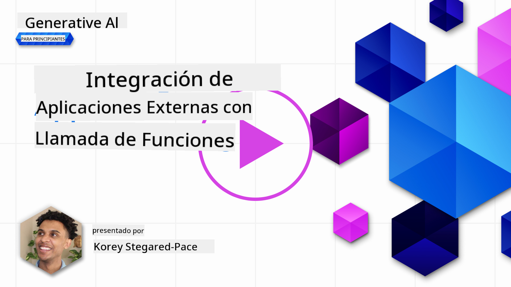
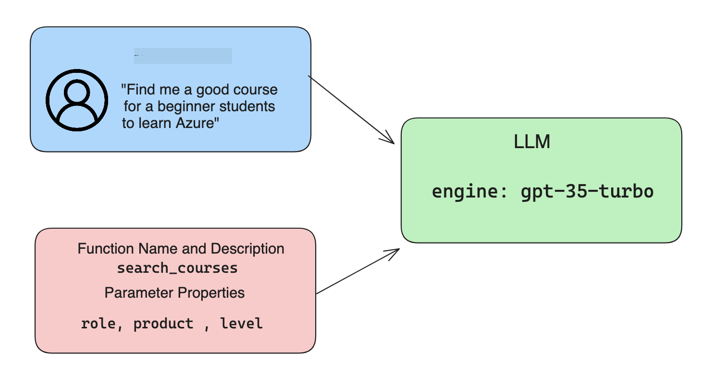

<!--
CO_OP_TRANSLATOR_METADATA:
{
  "original_hash": "77a48a201447be19aa7560706d6f93a0",
  "translation_date": "2025-07-09T14:21:59+00:00",
  "source_file": "11-integrating-with-function-calling/README.md",
  "language_code": "es"
}
-->
# Integración con llamadas a funciones

[](https://aka.ms/gen-ai-lesson11-gh?WT.mc_id=academic-105485-koreyst)

Has aprendido bastante hasta ahora en las lecciones anteriores. Sin embargo, podemos mejorar aún más. Algunos aspectos que podemos abordar son cómo obtener un formato de respuesta más consistente para facilitar el trabajo con la respuesta en etapas posteriores. Además, podríamos querer agregar datos de otras fuentes para enriquecer aún más nuestra aplicación.

Los problemas mencionados anteriormente son los que este capítulo busca resolver.

## Introducción

Esta lección cubrirá:

- Explicar qué es la llamada a funciones y sus casos de uso.
- Crear una llamada a función usando Azure OpenAI.
- Cómo integrar una llamada a función en una aplicación.

## Objetivos de aprendizaje

Al final de esta lección, serás capaz de:

- Explicar el propósito de usar llamadas a funciones.
- Configurar llamadas a funciones usando el servicio Azure OpenAI.
- Diseñar llamadas a funciones efectivas para el caso de uso de tu aplicación.

## Escenario: Mejorando nuestro chatbot con funciones

Para esta lección, queremos construir una función para nuestra startup educativa que permita a los usuarios usar un chatbot para encontrar cursos técnicos. Recomendaremos cursos que se ajusten a su nivel de habilidad, rol actual y tecnología de interés.

Para completar este escenario, usaremos una combinación de:

- `Azure OpenAI` para crear una experiencia de chat para el usuario.
- `Microsoft Learn Catalog API` para ayudar a los usuarios a encontrar cursos según la solicitud del usuario.
- `Function Calling` para tomar la consulta del usuario y enviarla a una función que realice la solicitud a la API.

Para comenzar, veamos por qué querríamos usar llamadas a funciones en primer lugar:

## Por qué usar llamadas a funciones

Antes de las llamadas a funciones, las respuestas de un LLM eran no estructuradas e inconsistentes. Los desarrolladores tenían que escribir código de validación complejo para asegurarse de manejar cada variación de respuesta. Los usuarios no podían obtener respuestas como "¿Cuál es el clima actual en Estocolmo?". Esto se debe a que los modelos estaban limitados a la época en que se entrenaron los datos.

Function Calling es una característica del servicio Azure OpenAI para superar las siguientes limitaciones:

- **Formato de respuesta consistente**. Si podemos controlar mejor el formato de la respuesta, podemos integrar más fácilmente la respuesta en otros sistemas.
- **Datos externos**. Capacidad para usar datos de otras fuentes de una aplicación en un contexto de chat.

## Ilustrando el problema a través de un escenario

> Te recomendamos usar el [notebook incluido](python/aoai-assignment.ipynb) si quieres ejecutar el escenario a continuación. También puedes simplemente leerlo mientras intentamos ilustrar un problema donde las funciones pueden ayudar a resolverlo.

Veamos el ejemplo que ilustra el problema del formato de respuesta:

Supongamos que queremos crear una base de datos de datos de estudiantes para poder sugerirles el curso adecuado. A continuación tenemos dos descripciones de estudiantes que son muy similares en los datos que contienen.

1. Crear una conexión a nuestro recurso Azure OpenAI:

   ```python
   import os
   import json
   from openai import AzureOpenAI
   from dotenv import load_dotenv
   load_dotenv()

   client = AzureOpenAI(
   api_key=os.environ['AZURE_OPENAI_API_KEY'],  # this is also the default, it can be omitted
   api_version = "2023-07-01-preview"
   )

   deployment=os.environ['AZURE_OPENAI_DEPLOYMENT']
   ```

   A continuación hay un código en Python para configurar nuestra conexión a Azure OpenAI donde establecemos `api_type`, `api_base`, `api_version` y `api_key`.

1. Crear dos descripciones de estudiantes usando las variables `student_1_description` y `student_2_description`.

   ```python
   student_1_description="Emily Johnson is a sophomore majoring in computer science at Duke University. She has a 3.7 GPA. Emily is an active member of the university's Chess Club and Debate Team. She hopes to pursue a career in software engineering after graduating."

   student_2_description = "Michael Lee is a sophomore majoring in computer science at Stanford University. He has a 3.8 GPA. Michael is known for his programming skills and is an active member of the university's Robotics Club. He hopes to pursue a career in artificial intelligence after finishing his studies."
   ```

   Queremos enviar las descripciones de estudiantes anteriores a un LLM para analizar los datos. Estos datos pueden usarse más adelante en nuestra aplicación y enviarse a una API o almacenarse en una base de datos.

1. Creamos dos prompts idénticos en los que indicamos al LLM qué información nos interesa:

   ```python
   prompt1 = f'''
   Please extract the following information from the given text and return it as a JSON object:

   name
   major
   school
   grades
   club

   This is the body of text to extract the information from:
   {student_1_description}
   '''

   prompt2 = f'''
   Please extract the following information from the given text and return it as a JSON object:

   name
   major
   school
   grades
   club

   This is the body of text to extract the information from:
   {student_2_description}
   '''
   ```

   Los prompts anteriores indican al LLM que extraiga información y devuelva la respuesta en formato JSON.

1. Después de configurar los prompts y la conexión a Azure OpenAI, ahora enviaremos los prompts al LLM usando `openai.ChatCompletion`. Guardamos el prompt en la variable `messages` y asignamos el rol `user`. Esto es para simular un mensaje de un usuario escrito a un chatbot.

   ```python
   # response from prompt one
   openai_response1 = client.chat.completions.create(
   model=deployment,
   messages = [{'role': 'user', 'content': prompt1}]
   )
   openai_response1.choices[0].message.content

   # response from prompt two
   openai_response2 = client.chat.completions.create(
   model=deployment,
   messages = [{'role': 'user', 'content': prompt2}]
   )
   openai_response2.choices[0].message.content
   ```

Ahora podemos enviar ambas solicitudes al LLM y examinar la respuesta que recibimos encontrándola así: `openai_response1['choices'][0]['message']['content']`.

1. Por último, podemos convertir la respuesta a formato JSON llamando a `json.loads`:

   ```python
   # Loading the response as a JSON object
   json_response1 = json.loads(openai_response1.choices[0].message.content)
   json_response1
   ```

   Respuesta 1:

   ```json
   {
     "name": "Emily Johnson",
     "major": "computer science",
     "school": "Duke University",
     "grades": "3.7",
     "club": "Chess Club"
   }
   ```

   Respuesta 2:

   ```json
   {
     "name": "Michael Lee",
     "major": "computer science",
     "school": "Stanford University",
     "grades": "3.8 GPA",
     "club": "Robotics Club"
   }
   ```

   Aunque los prompts son iguales y las descripciones son similares, vemos que los valores de la propiedad `Grades` están formateados de manera diferente, ya que a veces obtenemos el formato `3.7` o `3.7 GPA`, por ejemplo.

   Este resultado se debe a que el LLM toma datos no estructurados en forma del prompt escrito y también devuelve datos no estructurados. Necesitamos tener un formato estructurado para saber qué esperar al almacenar o usar estos datos.

Entonces, ¿cómo resolvemos el problema del formato? Usando llamadas a funciones, podemos asegurarnos de recibir datos estructurados. Al usar llamadas a funciones, el LLM en realidad no llama ni ejecuta ninguna función. En cambio, creamos una estructura que el LLM debe seguir para sus respuestas. Luego usamos esas respuestas estructuradas para saber qué función ejecutar en nuestras aplicaciones.


Luego podemos tomar lo que devuelve la función y enviarlo de vuelta al LLM. El LLM responderá usando lenguaje natural para contestar la consulta del usuario.

## Casos de uso para llamadas a funciones

Hay muchos casos de uso donde las llamadas a funciones pueden mejorar tu aplicación, como:

- **Llamar a herramientas externas**. Los chatbots son excelentes para responder preguntas de los usuarios. Usando llamadas a funciones, los chatbots pueden usar mensajes de los usuarios para completar ciertas tareas. Por ejemplo, un estudiante puede pedir al chatbot "Envía un correo a mi instructor diciendo que necesito más ayuda con este tema". Esto puede hacer una llamada a la función `send_email(to: string, body: string)`.

- **Crear consultas a API o bases de datos**. Los usuarios pueden encontrar información usando lenguaje natural que se convierte en una consulta o solicitud API formateada. Un ejemplo podría ser un profesor que pregunta "¿Quiénes son los estudiantes que completaron la última tarea?" lo que podría llamar a una función llamada `get_completed(student_name: string, assignment: int, current_status: string)`.

- **Crear datos estructurados**. Los usuarios pueden tomar un bloque de texto o CSV y usar el LLM para extraer información importante. Por ejemplo, un estudiante puede convertir un artículo de Wikipedia sobre acuerdos de paz para crear tarjetas de estudio con IA. Esto se puede hacer usando una función llamada `get_important_facts(agreement_name: string, date_signed: string, parties_involved: list)`.

## Creando tu primera llamada a función

El proceso para crear una llamada a función incluye 3 pasos principales:

1. **Llamar** a la API de Chat Completions con una lista de tus funciones y un mensaje del usuario.
2. **Leer** la respuesta del modelo para realizar una acción, es decir, ejecutar una función o llamada a API.
3. **Hacer** otra llamada a la API de Chat Completions con la respuesta de tu función para usar esa información y crear una respuesta para el usuario.



### Paso 1 - crear mensajes

El primer paso es crear un mensaje de usuario. Esto puede asignarse dinámicamente tomando el valor de una entrada de texto o puedes asignar un valor aquí. Si es la primera vez que trabajas con la API de Chat Completions, necesitamos definir el `role` y el `content` del mensaje.

El `role` puede ser `system` (creando reglas), `assistant` (el modelo) o `user` (el usuario final). Para llamadas a funciones, asignaremos `user` y un ejemplo de pregunta.

```python
messages= [ {"role": "user", "content": "Find me a good course for a beginner student to learn Azure."} ]
```

Al asignar diferentes roles, queda claro para el LLM si es el sistema quien dice algo o el usuario, lo que ayuda a construir un historial de conversación sobre el que el LLM puede basarse.

### Paso 2 - crear funciones

A continuación, definiremos una función y los parámetros de esa función. Usaremos solo una función aquí llamada `search_courses`, pero puedes crear varias funciones.

> **Importante**: Las funciones se incluyen en el mensaje del sistema al LLM y contarán dentro de la cantidad de tokens disponibles.

A continuación, creamos las funciones como un arreglo de elementos. Cada elemento es una función y tiene las propiedades `name`, `description` y `parameters`:

```python
functions = [
   {
      "name":"search_courses",
      "description":"Retrieves courses from the search index based on the parameters provided",
      "parameters":{
         "type":"object",
         "properties":{
            "role":{
               "type":"string",
               "description":"The role of the learner (i.e. developer, data scientist, student, etc.)"
            },
            "product":{
               "type":"string",
               "description":"The product that the lesson is covering (i.e. Azure, Power BI, etc.)"
            },
            "level":{
               "type":"string",
               "description":"The level of experience the learner has prior to taking the course (i.e. beginner, intermediate, advanced)"
            }
         },
         "required":[
            "role"
         ]
      }
   }
]
```

Describamos cada instancia de función con más detalle a continuación:

- `name` - El nombre de la función que queremos que se llame.
- `description` - Esta es la descripción de cómo funciona la función. Aquí es importante ser específico y claro.
- `parameters` - Una lista de valores y formato que quieres que el modelo produzca en su respuesta. El arreglo de parámetros consiste en elementos que tienen las siguientes propiedades:
  1.  `type` - El tipo de dato en el que se almacenarán las propiedades.
  1.  `properties` - Lista de los valores específicos que el modelo usará en su respuesta
      1. `name` - La clave es el nombre de la propiedad que el modelo usará en su respuesta formateada, por ejemplo, `product`.
      1. `type` - El tipo de dato de esta propiedad, por ejemplo, `string`.
      1. `description` - Descripción de la propiedad específica.

También existe una propiedad opcional `required` - propiedad requerida para que la llamada a la función se complete.

### Paso 3 - Hacer la llamada a la función

Después de definir una función, ahora necesitamos incluirla en la llamada a la API de Chat Completion. Lo hacemos agregando `functions` a la solicitud. En este caso `functions=functions`.

También hay una opción para establecer `function_call` en `auto`. Esto significa que dejaremos que el LLM decida qué función debe llamarse según el mensaje del usuario en lugar de asignarlo nosotros mismos.

Aquí hay un código donde llamamos a `ChatCompletion.create`, observa cómo establecemos `functions=functions` y `function_call="auto"` y así damos al LLM la opción de cuándo llamar a las funciones que le proporcionamos:

```python
response = client.chat.completions.create(model=deployment,
                                        messages=messages,
                                        functions=functions,
                                        function_call="auto")

print(response.choices[0].message)
```

La respuesta que recibimos ahora se ve así:

```json
{
  "role": "assistant",
  "function_call": {
    "name": "search_courses",
    "arguments": "{\n  \"role\": \"student\",\n  \"product\": \"Azure\",\n  \"level\": \"beginner\"\n}"
  }
}
```

Aquí podemos ver cómo se llamó a la función `search_courses` y con qué argumentos, listados en la propiedad `arguments` en la respuesta JSON.

La conclusión es que el LLM pudo encontrar los datos para ajustar los argumentos de la función mientras los extraía del valor proporcionado al parámetro `messages` en la llamada de chat completion. A continuación un recordatorio del valor de `messages`:

```python
messages= [ {"role": "user", "content": "Find me a good course for a beginner student to learn Azure."} ]
```

Como puedes ver, `student`, `Azure` y `beginner` fueron extraídos de `messages` y establecidos como entrada para la función. Usar funciones de esta manera es una excelente forma de extraer información de un prompt, pero también de proporcionar estructura al LLM y tener funcionalidad reutilizable.

Ahora, veamos cómo podemos usar esto en nuestra aplicación.

## Integrando llamadas a funciones en una aplicación

Después de haber probado la respuesta formateada del LLM, ahora podemos integrarla en una aplicación.

### Gestionando el flujo

Para integrar esto en nuestra aplicación, sigamos los siguientes pasos:

1. Primero, hagamos la llamada a los servicios de OpenAI y almacenemos el mensaje en una variable llamada `response_message`.

   ```python
   response_message = response.choices[0].message
   ```

1. Ahora definiremos la función que llamará a la API de Microsoft Learn para obtener una lista de cursos:

   ```python
   import requests

   def search_courses(role, product, level):
     url = "https://learn.microsoft.com/api/catalog/"
     params = {
        "role": role,
        "product": product,
        "level": level
     }
     response = requests.get(url, params=params)
     modules = response.json()["modules"]
     results = []
     for module in modules[:5]:
        title = module["title"]
        url = module["url"]
        results.append({"title": title, "url": url})
     return str(results)
   ```

   Observa cómo ahora creamos una función real en Python que mapea a los nombres de función introducidos en la variable `functions`. También estamos haciendo llamadas reales a APIs externas para obtener los datos que necesitamos. En este caso, consultamos la API de Microsoft Learn para buscar módulos de entrenamiento.

Bien, creamos la variable `functions` y una función Python correspondiente, ¿cómo le decimos al LLM cómo mapear estas dos para que se llame nuestra función Python?

1. Para ver si necesitamos llamar a una función Python, debemos revisar la respuesta del LLM y ver si `function_call` forma parte de ella y llamar a la función indicada. Aquí te mostramos cómo hacer esta verificación:

   ```python
   # Check if the model wants to call a function
   if response_message.function_call.name:
    print("Recommended Function call:")
    print(response_message.function_call.name)
    print()

    # Call the function.
    function_name = response_message.function_call.name

    available_functions = {
            "search_courses": search_courses,
    }
    function_to_call = available_functions[function_name]

    function_args = json.loads(response_message.function_call.arguments)
    function_response = function_to_call(**function_args)

    print("Output of function call:")
    print(function_response)
    print(type(function_response))


    # Add the assistant response and function response to the messages
    messages.append( # adding assistant response to messages
        {
            "role": response_message.role,
            "function_call": {
                "name": function_name,
                "arguments": response_message.function_call.arguments,
            },
            "content": None
        }
    )
    messages.append( # adding function response to messages
        {
            "role": "function",
            "name": function_name,
            "content":function_response,
        }
    )
   ```

   Estas tres líneas aseguran que extraemos el nombre de la función, los argumentos y hacemos la llamada:

   ```python
   function_to_call = available_functions[function_name]

   function_args = json.loads(response_message.function_call.arguments)
   function_response = function_to_call(**function_args)
   ```

   A continuación, el resultado de ejecutar nuestro código:

   **Salida**

   ```Recommended Function call:
   {
     "name": "search_courses",
     "arguments": "{\n  \"role\": \"student\",\n  \"product\": \"Azure\",\n  \"level\": \"beginner\"\n}"
   }

   Output of function call:
   [{'title': 'Describe concepts of cryptography', 'url': 'https://learn.microsoft.com/training/modules/describe-concepts-of-cryptography/?
   WT.mc_id=api_CatalogApi'}, {'title': 'Introduction to audio classification with TensorFlow', 'url': 'https://learn.microsoft.com/en-
   us/training/modules/intro-audio-classification-tensorflow/?WT.mc_id=api_CatalogApi'}, {'title': 'Design a Performant Data Model in Azure SQL
   Database with Azure Data Studio', 'url': 'https://learn.microsoft.com/training/modules/design-a-data-model-with-ads/?
   WT.mc_id=api_CatalogApi'}, {'title': 'Getting started with the Microsoft Cloud Adoption Framework for Azure', 'url':
   'https://learn.microsoft.com/training/modules/cloud-adoption-framework-getting-started/?WT.mc_id=api_CatalogApi'}, {'title': 'Set up the
   Rust development environment', 'url': 'https://learn.microsoft.com/training/modules/rust-set-up-environment/?WT.mc_id=api_CatalogApi'}]
   <class 'str'>
   ```

1. Ahora enviaremos el mensaje actualizado, `messages` al LLM para que podamos recibir una respuesta en lenguaje natural en lugar de una respuesta formateada en JSON de la API.

   ```python
   print("Messages in next request:")
   print(messages)
   print()

   second_response = client.chat.completions.create(
      messages=messages,
      model=deployment,
      function_call="auto",
      functions=functions,
      temperature=0
         )  # get a new response from GPT where it can see the function response


   print(second_response.choices[0].message)
   ```

   **Salida**

   ```python
   {
     "role": "assistant",
     "content": "I found some good courses for beginner students to learn Azure:\n\n1. [Describe concepts of cryptography] (https://learn.microsoft.com/training/modules/describe-concepts-of-cryptography/?WT.mc_id=api_CatalogApi)\n2. [Introduction to audio classification with TensorFlow](https://learn.microsoft.com/training/modules/intro-audio-classification-tensorflow/?WT.mc_id=api_CatalogApi)\n3. [Design a Performant Data Model in Azure SQL Database with Azure Data Studio](https://learn.microsoft.com/training/modules/design-a-data-model-with-ads/?WT.mc_id=api_CatalogApi)\n4. [Getting started with the Microsoft Cloud Adoption Framework for Azure](https://learn.microsoft.com/training/modules/cloud-adoption-framework-getting-started/?WT.mc_id=api_CatalogApi)\n5. [Set up the Rust development environment](https://learn.microsoft.com/training/modules/rust-set-up-environment/?WT.mc_id=api_CatalogApi)\n\nYou can click on the links to access the courses."
   }

   ```

## Tarea

Para continuar tu aprendizaje sobre Azure OpenAI Function Calling puedes construir:

- Más parámetros para la función que puedan ayudar a los estudiantes a encontrar más cursos.
- Crear otra llamada a función que tome más información del estudiante, como su idioma nativo.
- Crear manejo de errores cuando la llamada a función y/o llamada a API no devuelva cursos adecuados.
## ¡Gran trabajo! Continúa el viaje

Después de completar esta lección, consulta nuestra [colección de aprendizaje de IA generativa](https://aka.ms/genai-collection?WT.mc_id=academic-105485-koreyst) para seguir mejorando tus conocimientos sobre IA generativa.

Dirígete a la Lección 12, donde veremos cómo [diseñar la experiencia de usuario para aplicaciones de IA](../12-designing-ux-for-ai-applications/README.md?WT.mc_id=academic-105485-koreyst).

**Aviso legal**:  
Este documento ha sido traducido utilizando el servicio de traducción automática [Co-op Translator](https://github.com/Azure/co-op-translator). Aunque nos esforzamos por la precisión, tenga en cuenta que las traducciones automáticas pueden contener errores o inexactitudes. El documento original en su idioma nativo debe considerarse la fuente autorizada. Para información crítica, se recomienda la traducción profesional realizada por humanos. No nos hacemos responsables de malentendidos o interpretaciones erróneas derivadas del uso de esta traducción.