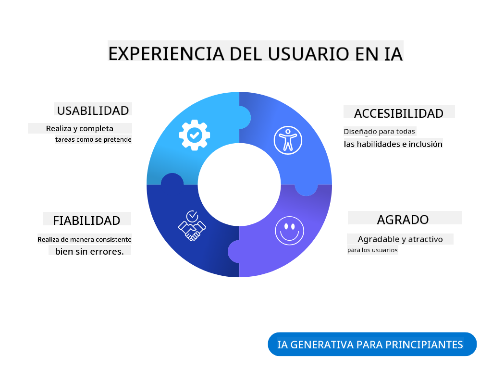
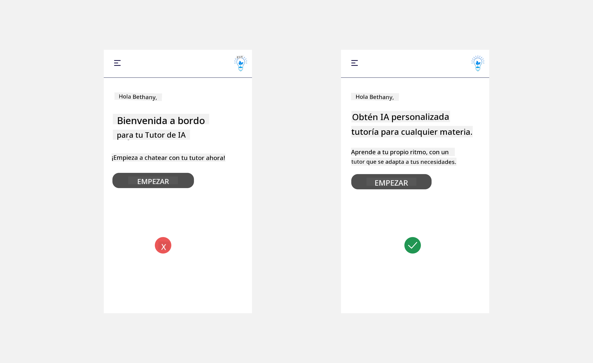
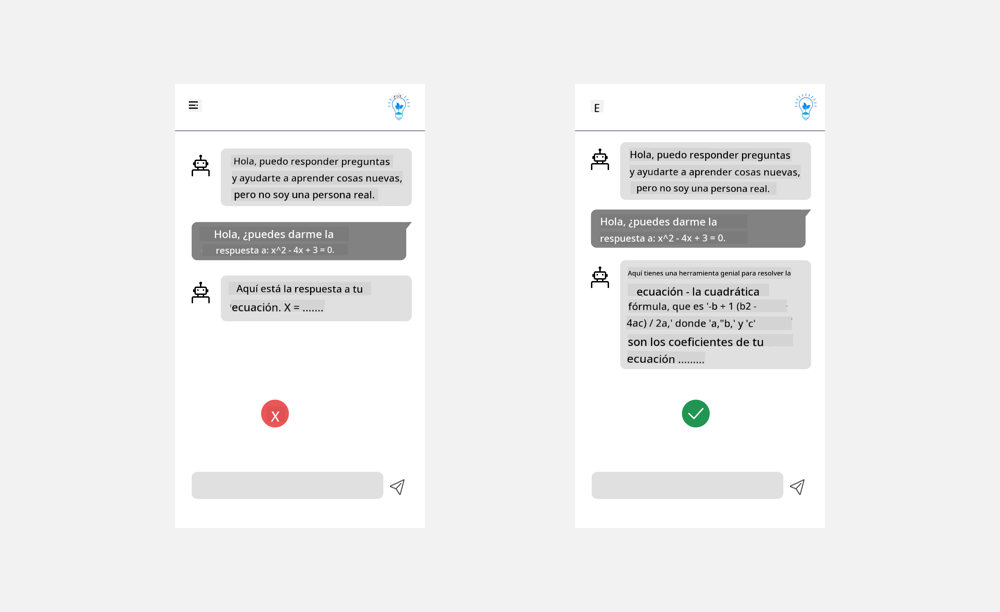
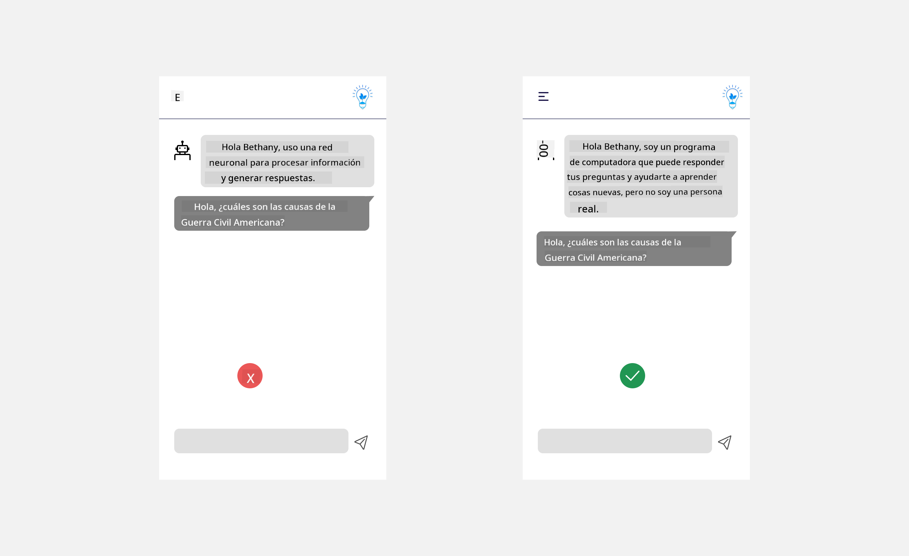
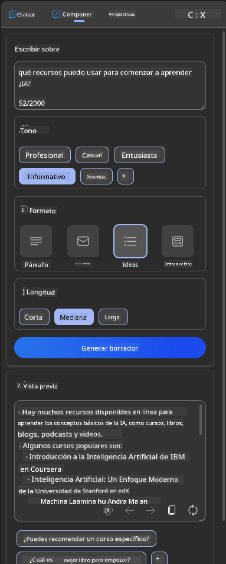
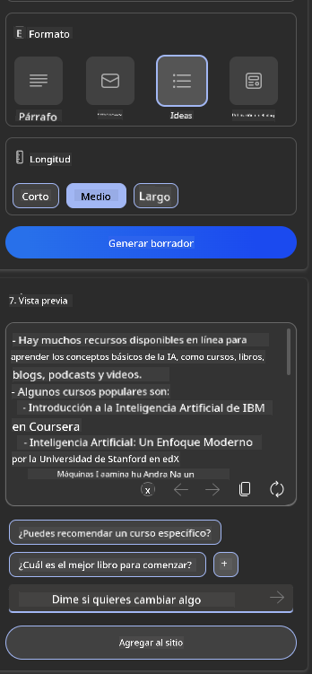
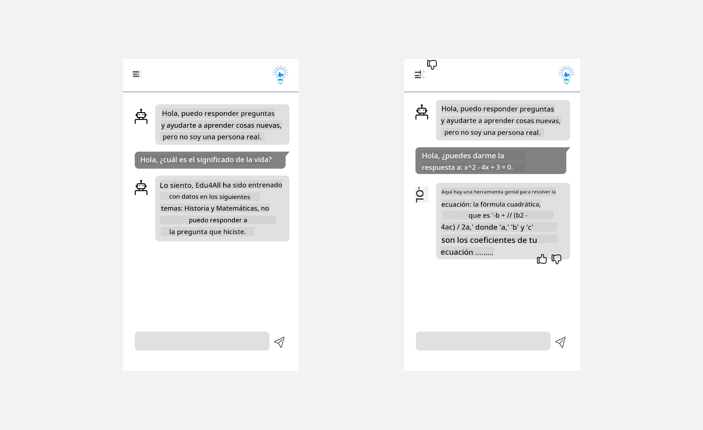

<!--
CO_OP_TRANSLATOR_METADATA:
{
  "original_hash": "ec385b41ee50579025d50cc03bfb3a25",
  "translation_date": "2025-05-19T21:41:24+00:00",
  "source_file": "12-designing-ux-for-ai-applications/README.md",
  "language_code": "es"
}
-->
# Diseño de UX para Aplicaciones de IA

> _(Haz clic en la imagen de arriba para ver el video de esta lección)_

La experiencia del usuario es un aspecto muy importante en la creación de aplicaciones. Los usuarios deben poder utilizar tu aplicación de manera eficiente para realizar tareas. Ser eficiente es una cosa, pero también necesitas diseñar aplicaciones de modo que puedan ser usadas por todos, haciéndolas _accesibles_. Este capítulo se centrará en esta área para que, con suerte, termines diseñando una aplicación que la gente pueda y quiera usar.

## Introducción

La experiencia del usuario es cómo un usuario interactúa y utiliza un producto o servicio específico, ya sea un sistema, herramienta o diseño. Al desarrollar aplicaciones de IA, los desarrolladores no solo se enfocan en garantizar que la experiencia del usuario sea efectiva, sino también ética. En esta lección, cubrimos cómo construir aplicaciones de Inteligencia Artificial (IA) que aborden las necesidades del usuario.

La lección cubrirá las siguientes áreas:

- Introducción a la Experiencia del Usuario y Comprensión de las Necesidades del Usuario
- Diseño de Aplicaciones de IA para la Confianza y Transparencia
- Diseño de Aplicaciones de IA para la Colaboración y Retroalimentación

## Objetivos de aprendizaje

Después de tomar esta lección, podrás:

- Comprender cómo construir aplicaciones de IA que satisfagan las necesidades del usuario.
- Diseñar aplicaciones de IA que promuevan la confianza y la colaboración.

### Prerrequisito

Tómate un tiempo para leer más sobre [experiencia del usuario y pensamiento de diseño.](https://learn.microsoft.com/training/modules/ux-design?WT.mc_id=academic-105485-koreyst)

## Introducción a la Experiencia del Usuario y Comprensión de las Necesidades del Usuario

En nuestra startup educativa ficticia, tenemos dos usuarios principales, maestros y estudiantes. Cada uno de los dos usuarios tiene necesidades únicas. Un diseño centrado en el usuario prioriza al usuario, asegurando que los productos sean relevantes y beneficiosos para aquellos a quienes están destinados.

La aplicación debe ser **útil, confiable, accesible y agradable** para proporcionar una buena experiencia de usuario.

### Usabilidad

Ser útil significa que la aplicación tiene funcionalidades que coinciden con su propósito previsto, como automatizar el proceso de calificación o generar tarjetas de estudio para la revisión. Una aplicación que automatiza el proceso de calificación debe poder asignar puntajes de manera precisa y eficiente al trabajo de los estudiantes según criterios predefinidos. De manera similar, una aplicación que genera tarjetas de estudio debe poder crear preguntas relevantes y diversas basadas en sus datos.

### Confiabilidad

Ser confiable significa que la aplicación puede realizar su tarea de manera consistente y sin errores. Sin embargo, la IA, al igual que los humanos, no es perfecta y puede ser propensa a errores. Las aplicaciones pueden encontrar errores o situaciones inesperadas que requieren intervención o corrección humana. ¿Cómo manejas los errores? En la última sección de esta lección, cubriremos cómo los sistemas y aplicaciones de IA están diseñados para la colaboración y la retroalimentación.

### Accesibilidad

Ser accesible significa extender la experiencia del usuario a usuarios con diversas habilidades, incluidas aquellas con discapacidades, asegurando que nadie quede excluido. Al seguir las pautas y principios de accesibilidad, las soluciones de IA se vuelven más inclusivas, utilizables y beneficiosas para todos los usuarios.

### Agradable

Ser agradable significa que la aplicación es disfrutable de usar. Una experiencia de usuario atractiva puede tener un impacto positivo en el usuario, alentándolo a regresar a la aplicación e incrementando los ingresos del negocio.

No todos los desafíos pueden resolverse con IA. La IA entra para aumentar tu experiencia de usuario, ya sea automatizando tareas manuales o personalizando experiencias de usuario.

## Diseño de Aplicaciones de IA para la Confianza y Transparencia

Construir confianza es crítico al diseñar aplicaciones de IA. La confianza asegura que un usuario esté seguro de que la aplicación hará el trabajo, entregará resultados de manera consistente y los resultados son lo que el usuario necesita. Un riesgo en esta área es la desconfianza y la confianza excesiva. La desconfianza ocurre cuando un usuario tiene poca o ninguna confianza en un sistema de IA, lo que lleva al usuario a rechazar tu aplicación. La confianza excesiva ocurre cuando un usuario sobreestima la capacidad de un sistema de IA, llevando a los usuarios a confiar demasiado en el sistema de IA. Por ejemplo, un sistema de calificación automatizado en caso de confianza excesiva podría llevar al maestro a no revisar algunos de los trabajos para asegurar que el sistema de calificación funcione bien. Esto podría resultar en calificaciones injustas o inexactas para los estudiantes, u oportunidades perdidas para la retroalimentación y mejora.

Dos maneras de asegurar que la confianza se ponga en el centro del diseño son la explicabilidad y el control.

### Explicabilidad

Cuando la IA ayuda a informar decisiones como impartir conocimientos a futuras generaciones, es crítico para maestros y padres entender cómo se toman las decisiones de IA. Esto es explicabilidad: entender cómo las aplicaciones de IA toman decisiones. Diseñar para la explicabilidad incluye agregar detalles de ejemplos de lo que una aplicación de IA puede hacer. Por ejemplo, en lugar de "Comienza con el maestro de IA", el sistema puede usar: "Resume tus notas para una revisión más fácil usando IA."

Otro ejemplo es cómo la IA utiliza datos de usuario y personales. Por ejemplo, un usuario con la persona estudiante puede tener limitaciones basadas en su persona. La IA puede no ser capaz de revelar respuestas a preguntas, pero puede ayudar a guiar al usuario a pensar cómo pueden resolver un problema.

Una última parte clave de la explicabilidad es la simplificación de las explicaciones. Los estudiantes y maestros pueden no ser expertos en IA, por lo tanto, las explicaciones de lo que la aplicación puede o no puede hacer deben ser simplificadas y fáciles de entender.

### Control

La IA generativa crea una colaboración entre la IA y el usuario, donde por ejemplo un usuario puede modificar indicaciones para diferentes resultados. Además, una vez que se genera un resultado, los usuarios deberían poder modificar los resultados, dándoles una sensación de control. Por ejemplo, al usar Bing, puedes adaptar tu indicación basada en formato, tono y longitud. Además, puedes agregar cambios a tu salida y modificar la salida como se muestra a continuación:

Otra característica en Bing que permite a un usuario tener control sobre la aplicación es la capacidad de optar por participar y no participar en los datos que utiliza la IA. Para una aplicación escolar, un estudiante podría querer usar sus notas así como los recursos del maestro como material de revisión.

> Al diseñar aplicaciones de IA, la intencionalidad es clave para asegurar que los usuarios no confíen demasiado estableciendo expectativas poco realistas de sus capacidades. Una forma de hacer esto es creando fricción entre las indicaciones y los resultados. Recordándole al usuario que esto es IA y no un ser humano

## Diseño de Aplicaciones de IA para la Colaboración y Retroalimentación

Como se mencionó anteriormente, la IA generativa crea una colaboración entre el usuario y la IA. La mayoría de los compromisos son con un usuario ingresando una indicación y la IA generando una salida. ¿Qué pasa si la salida es incorrecta? ¿Cómo maneja la aplicación los errores si ocurren? ¿La IA culpa al usuario o se toma el tiempo para explicar el error?

Las aplicaciones de IA deben estar construidas para recibir y dar retroalimentación. Esto no solo ayuda al sistema de IA a mejorar, sino que también genera confianza con los usuarios. Un ciclo de retroalimentación debe estar incluido en el diseño, un ejemplo puede ser un simple pulgar hacia arriba o hacia abajo en la salida.

Otra forma de manejar esto es comunicando claramente las capacidades y limitaciones del sistema. Cuando un usuario comete un error solicitando algo más allá de las capacidades de la IA, también debe haber una manera de manejar esto, como se muestra a continuación.

Los errores del sistema son comunes con aplicaciones donde el usuario podría necesitar asistencia con información fuera del alcance de la IA o la aplicación puede tener un límite en cuántas preguntas/asuntos un usuario puede generar resúmenes. Por ejemplo, una aplicación de IA entrenada con datos en temas limitados, por ejemplo, Historia y Matemáticas, puede no ser capaz de manejar preguntas sobre Geografía. Para mitigar esto, el sistema de IA puede dar una respuesta como: "Lo siento, nuestro producto ha sido entrenado con datos en los siguientes temas....., no puedo responder a la pregunta que hiciste."

Las aplicaciones de IA no son perfectas, por lo tanto, están destinadas a cometer errores. Al diseñar tus aplicaciones, debes asegurarte de crear espacio para la retroalimentación de los usuarios y el manejo de errores de una manera que sea simple y fácilmente explicable.

## Tarea

Toma cualquier aplicación de IA que hayas construido hasta ahora, considera implementar los siguientes pasos en tu aplicación:

- **Agradable:** Considera cómo puedes hacer que tu aplicación sea más agradable. ¿Estás agregando explicaciones en todas partes? ¿Estás alentando al usuario a explorar? ¿Cómo estás redactando tus mensajes de error?

- **Usabilidad:** Construyendo una aplicación web. Asegúrate de que tu aplicación sea navegable tanto con el mouse como con el teclado.

- **Confianza y transparencia:** No confíes completamente en la IA y su salida, considera cómo añadirías un humano al proceso para verificar la salida. Además, considera e implementa otras formas de lograr confianza y transparencia.

- **Control:** Da al usuario control sobre los datos que proporciona a la aplicación. Implementa una forma en que un usuario pueda optar por participar y no participar en la recopilación de datos en la aplicación de IA.

## Continúa tu aprendizaje

Después de completar esta lección, consulta nuestra [colección de aprendizaje de IA generativa](https://aka.ms/genai-collection?WT.mc_id=academic-105485-koreyst) para seguir aumentando tu conocimiento en IA generativa.

Dirígete a la Lección 13, donde veremos cómo [asegurar aplicaciones de IA](../13-securing-ai-applications/README.md?WT.mc_id=academic-105485-koreyst)!

**Descargo de responsabilidad**:  
Este documento ha sido traducido utilizando el servicio de traducción automática [Co-op Translator](https://github.com/Azure/co-op-translator). Aunque nos esforzamos por lograr precisión, tenga en cuenta que las traducciones automáticas pueden contener errores o imprecisiones. El documento original en su idioma nativo debe considerarse como la fuente autorizada. Para información crítica, se recomienda una traducción humana profesional. No nos hacemos responsables de ningún malentendido o interpretación errónea que surja del uso de esta traducción.