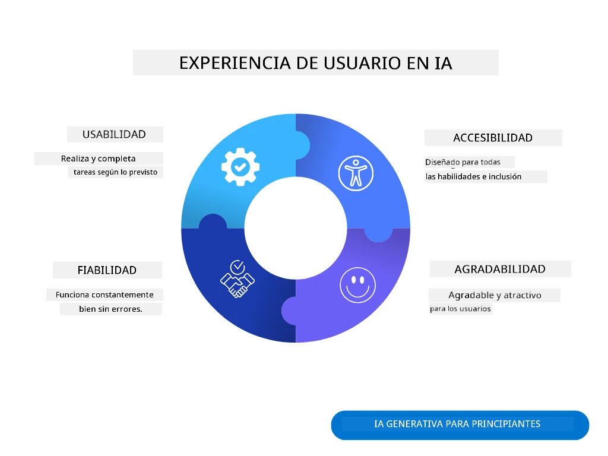
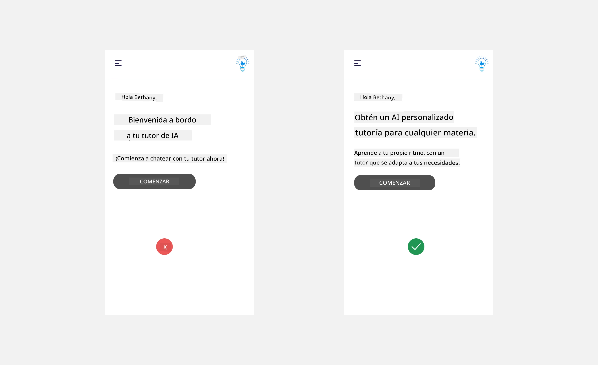
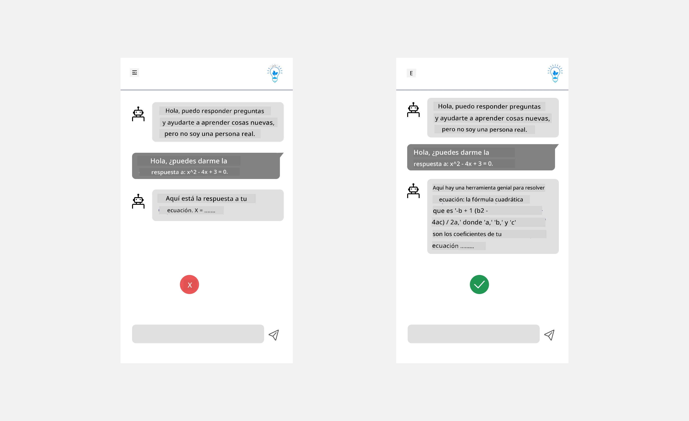
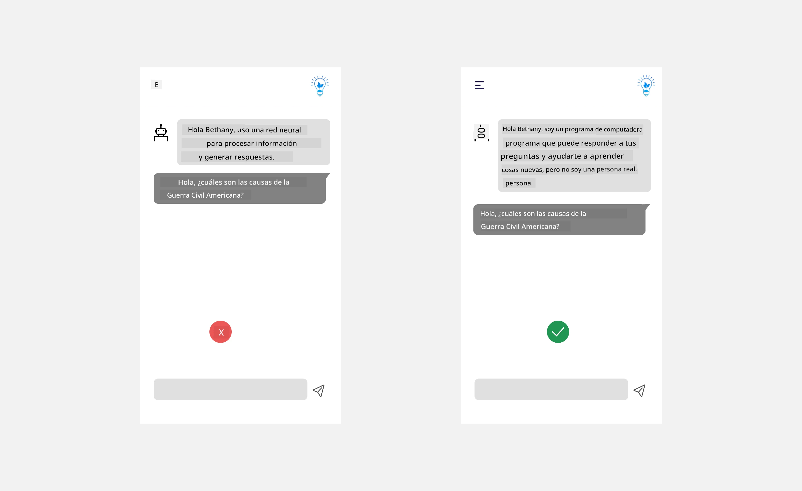
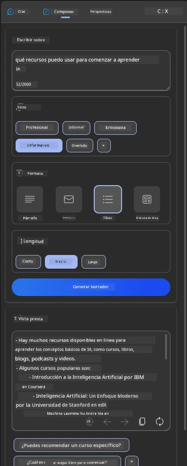
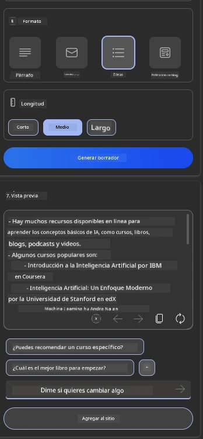
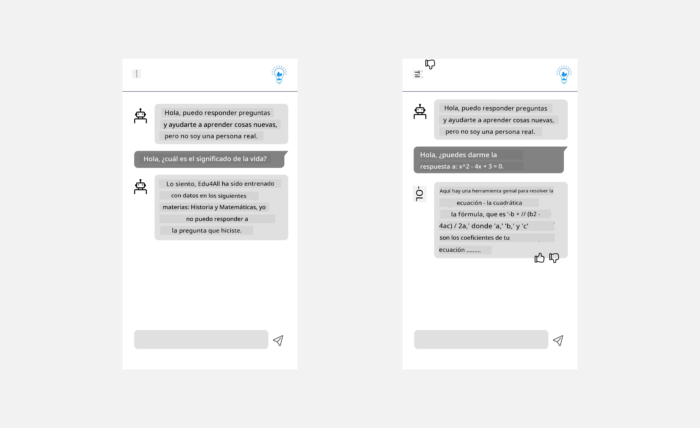

# Diseño de UX para Aplicaciones de IA

> _(Haz clic en la imagen de arriba para ver el video de esta lección)_

La experiencia del usuario es un aspecto muy importante en la construcción de aplicaciones. Los usuarios necesitan poder usar tu aplicación de manera eficiente para realizar tareas. Ser eficiente es una cosa, pero también necesitas diseñar aplicaciones para que puedan ser usadas por todos, para hacerlas _accesibles_. Este capítulo se centrará en esta área para que, con suerte, termines diseñando una aplicación que las personas puedan y quieran usar.

## Introducción

La experiencia del usuario es cómo un usuario interactúa y utiliza un producto o servicio específico, ya sea un sistema, herramienta o diseño. Al desarrollar aplicaciones de IA, los desarrolladores no solo se enfocan en asegurar que la experiencia del usuario sea efectiva, sino también ética. En esta lección, cubrimos cómo construir aplicaciones de Inteligencia Artificial (IA) que aborden las necesidades del usuario.

La lección cubrirá las siguientes áreas:

- Introducción a la Experiencia del Usuario y Comprensión de las Necesidades del Usuario
- Diseño de Aplicaciones de IA para Confianza y Transparencia
- Diseño de Aplicaciones de IA para Colaboración y Retroalimentación

## Objetivos de aprendizaje

Después de tomar esta lección, podrás:

- Entender cómo construir aplicaciones de IA que satisfagan las necesidades del usuario.
- Diseñar aplicaciones de IA que fomenten la confianza y la colaboración.

### Requisito previo

Dedica algo de tiempo a leer más sobre [experiencia del usuario y pensamiento de diseño.](https://learn.microsoft.com/training/modules/ux-design?WT.mc_id=academic-105485-koreyst)

## Introducción a la Experiencia del Usuario y Comprensión de las Necesidades del Usuario

En nuestra startup educativa ficticia, tenemos dos usuarios principales, profesores y estudiantes. Cada uno de estos dos usuarios tiene necesidades únicas. Un diseño centrado en el usuario prioriza al usuario asegurando que los productos sean relevantes y beneficiosos para quienes están destinados.

La aplicación debe ser **útil, confiable, accesible y agradable** para proporcionar una buena experiencia al usuario.

### Usabilidad

Ser útil significa que la aplicación tiene funcionalidad que corresponde a su propósito previsto, como automatizar el proceso de calificación o generar tarjetas de estudio para la revisión. Una aplicación que automatiza el proceso de calificación debe poder asignar puntajes a los trabajos de los estudiantes de manera precisa y eficiente basándose en criterios predefinidos. De manera similar, una aplicación que genera tarjetas de estudio debe ser capaz de crear preguntas relevantes y diversas basándose en sus datos.

### Confiabilidad

Ser confiable significa que la aplicación puede realizar su tarea de manera consistente y sin errores. Sin embargo, la IA, al igual que los humanos, no es perfecta y puede estar propensa a errores. Las aplicaciones pueden encontrar errores o situaciones inesperadas que requieran intervención o corrección humana. ¿Cómo manejas los errores? En la última sección de esta lección, cubriremos cómo los sistemas y aplicaciones de IA están diseñados para la colaboración y retroalimentación.

### Accesibilidad

Ser accesible significa extender la experiencia del usuario a usuarios con diversas capacidades, incluyendo aquellos con discapacidades, asegurando que nadie quede excluido. Siguiendo las pautas y principios de accesibilidad, las soluciones de IA se vuelven más inclusivas, usables y beneficiosas para todos los usuarios.

### Agradable

Ser agradable significa que la aplicación es disfrutable de usar. Una experiencia de usuario atractiva puede tener un impacto positivo en el usuario, animándolo a volver a la aplicación y aumentando los ingresos del negocio.

No todos los desafíos pueden resolverse con IA. La IA entra para aumentar tu experiencia de usuario, ya sea automatizando tareas manuales o personalizando experiencias de usuario.

## Diseño de Aplicaciones de IA para Confianza y Transparencia

Construir confianza es crítico al diseñar aplicaciones de IA. La confianza asegura que un usuario esté seguro de que la aplicación realizará el trabajo, entregará resultados consistentemente y que los resultados sean lo que el usuario necesita. Un riesgo en esta área es la desconfianza y la sobreconfianza. La desconfianza ocurre cuando un usuario tiene poca o ninguna confianza en un sistema de IA, lo que lleva a que el usuario rechace tu aplicación. La sobreconfianza ocurre cuando un usuario sobreestima la capacidad de un sistema de IA, llevando a los usuarios a confiar demasiado en el sistema de IA. Por ejemplo, un sistema de calificación automatizado en caso de sobreconfianza podría llevar a que el profesor no revise algunos de los trabajos para asegurar que el sistema de calificación funcione bien. Esto podría resultar en calificaciones injustas o inexactas para los estudiantes, o en oportunidades perdidas para retroalimentación y mejora.

Dos maneras de asegurar que la confianza esté en el centro del diseño son la explicabilidad y el control.

### Explicabilidad

Cuando la IA ayuda a informar decisiones como impartir conocimiento a futuras generaciones, es fundamental que maestros y padres entiendan cómo se toman las decisiones de IA. Esto es la explicabilidad: comprender cómo las aplicaciones de IA toman decisiones. Diseñar para la explicabilidad incluye añadir detalles que resalten cómo la IA llegó al resultado. La audiencia debe saber que el resultado es generado por IA y no por un humano. Por ejemplo, en vez de decir "Empieza a chatear con tu tutor ahora" di "Usa un tutor de IA que se adapta a tus necesidades y te ayuda a aprender a tu ritmo."

Otro ejemplo es cómo la IA usa los datos del usuario y personales. Por ejemplo, un usuario con la persona estudiante puede tener limitaciones basadas en su persona. La IA puede no ser capaz de revelar respuestas a preguntas pero puede ayudar a guiar al usuario a pensar en cómo resolver un problema.

Una última parte clave de la explicabilidad es la simplificación de las explicaciones. Estudiantes y maestros pueden no ser expertos en IA, por lo tanto, las explicaciones sobre lo que la aplicación puede o no puede hacer deben ser simplificadas y fáciles de entender.

### Control

La IA generativa crea una colaboración entre la IA y el usuario, donde por ejemplo un usuario puede modificar indicaciones para obtener diferentes resultados. Además, una vez que se genera un resultado, los usuarios deberían poder modificar los resultados, dándoles una sensación de control. Por ejemplo, al usar Microsoft Copilot (anteriormente Bing Chat), puedes ajustar tu indicación según formato, tono y longitud. Adicionalmente, puedes añadir cambios a tu resultado y modificar el resultado como se muestra a continuación:

Otra función en Microsoft Copilot que permite a un usuario tener control sobre la aplicación es la capacidad de optar por entrar y salir de los datos que la IA usa. Para una aplicación escolar, un estudiante podría querer usar sus notas así como los recursos de los profesores como material de revisión.

> Al diseñar aplicaciones de IA, la intencionalidad es clave para asegurar que los usuarios no confíen demasiado estableciendo expectativas poco realistas de sus capacidades. Una forma de hacer esto es creando fricción entre las indicaciones y los resultados. Recordando al usuario que esto es IA y no un ser humano.

## Diseño de Aplicaciones de IA para Colaboración y Retroalimentación

Como se mencionó antes, la IA generativa crea una colaboración entre el usuario y la IA. La mayoría de las interacciones son con un usuario que introduce una indicación y la IA genera un resultado. ¿Qué pasa si el resultado es incorrecto? ¿Cómo maneja la aplicación los errores si ocurren? ¿La IA culpa al usuario o se toma el tiempo para explicar el error?

Las aplicaciones de IA deben construirse para recibir y dar retroalimentación. Esto no solo ayuda a mejorar el sistema de IA sino que también construye confianza con los usuarios. Un ciclo de retroalimentación debe incluirse en el diseño, un ejemplo puede ser un simple pulgar arriba o abajo en el resultado.

Otra forma de manejar esto es comunicar claramente las capacidades y limitaciones del sistema. Cuando un usuario comete un error solicitando algo fuera de las capacidades de la IA, también debe haber una forma de manejar esto, como se muestra a continuación.

Los errores del sistema son comunes en aplicaciones donde el usuario podría necesitar asistencia con información fuera del alcance de la IA o la aplicación puede tener un límite en cuántas preguntas/asignaturas un usuario puede generar resúmenes. Por ejemplo, una aplicación de IA entrenada con datos en asignaturas limitadas, por ejemplo, Historia y Matemáticas, puede no ser capaz de manejar preguntas sobre Geografía. Para mitigar esto, el sistema de IA puede dar una respuesta como: "Lo siento, nuestro producto ha sido entrenado con datos en las siguientes asignaturas....., no puedo responder a la pregunta que formulaste."

Las aplicaciones de IA no son perfectas, por lo tanto, es inevitable que cometan errores. Al diseñar tus aplicaciones, debes asegurarte de crear espacio para la retroalimentación de los usuarios y el manejo de errores de una manera que sea simple y fácilmente explicable.

## Tarea

Toma cualquier aplicación de IA que hayas construido hasta ahora, considera implementar los siguientes pasos en tu aplicación:

- **Agradable:** Considera cómo puedes hacer tu aplicación más agradable. ¿Estás agregando explicaciones por todas partes? ¿Estás animando al usuario a explorar? ¿Cómo estás redactando tus mensajes de error?

- **Usabilidad:** Si construyes una aplicación web, asegúrate de que sea navegable tanto con mouse como con teclado.

- **Confianza y transparencia:** No confíes completamente en la IA y sus resultados, considera cómo agregar un humano al proceso para verificar los resultados. Además, considera e implementa otras formas de lograr confianza y transparencia.

- **Control:** Da al usuario control sobre los datos que proporcionan a la aplicación. Implementa una forma para que un usuario pueda optar por entrar y salir de la recopilación de datos en la aplicación de IA.

<!-- ## [Post-lecture quiz](../../../12-designing-ux-for-ai-applications/quiz-url) -->

## ¡Continúa tu aprendizaje!

Después de completar esta lección, revisa nuestra [colección de aprendizaje de IA generativa](https://aka.ms/genai-collection?WT.mc_id=academic-105485-koreyst) para seguir mejorando tu conocimiento en IA generativa.

Dirígete a la Lección 13, donde veremos cómo [asegurar aplicaciones de IA](../13-securing-ai-applications/README.md?WT.mc_id=academic-105485-koreyst)!

---

<!-- CO-OP TRANSLATOR DISCLAIMER START -->
**Descargo de responsabilidad**:
Este documento ha sido traducido utilizando el servicio de traducción automática [Co-op Translator](https://github.com/Azure/co-op-translator). Aunque nos esforzamos por la precisión, tenga en cuenta que las traducciones automatizadas pueden contener errores o inexactitudes. El documento original en su idioma nativo debe considerarse la fuente autorizada. Para información crítica, se recomienda una traducción profesional humana. No somos responsables de cualquier malentendido o interpretación errónea que surja del uso de esta traducción.
<!-- CO-OP TRANSLATOR DISCLAIMER END -->