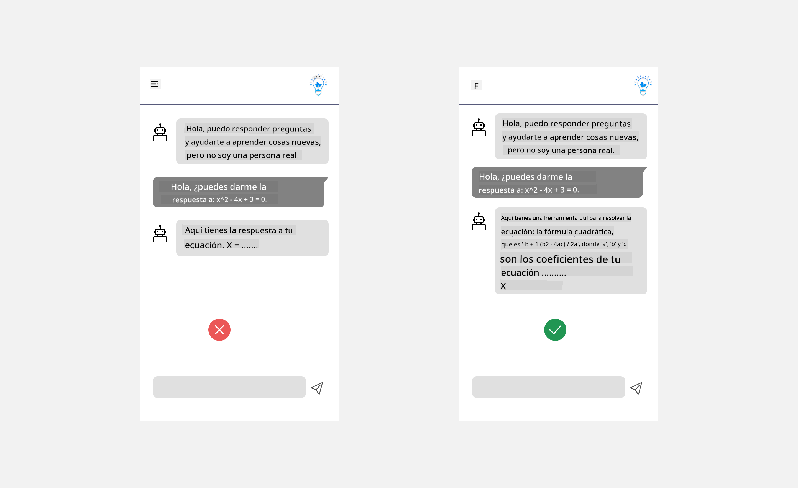
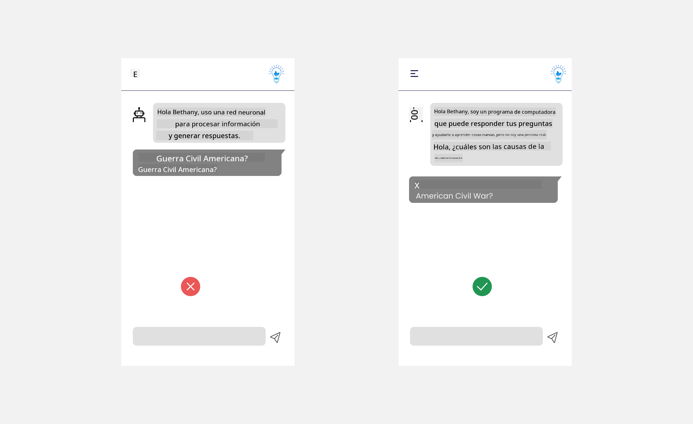

<!--
CO_OP_TRANSLATOR_METADATA:
{
  "original_hash": "ec385b41ee50579025d50cc03bfb3a25",
  "translation_date": "2025-07-09T14:48:26+00:00",
  "source_file": "12-designing-ux-for-ai-applications/README.md",
  "language_code": "es"
}
-->
# Diseño de UX para Aplicaciones de IA

> _(Haz clic en la imagen de arriba para ver el video de esta lección)_

La experiencia de usuario es un aspecto muy importante al crear aplicaciones. Los usuarios deben poder usar tu aplicación de manera eficiente para realizar tareas. Ser eficiente es una cosa, pero también necesitas diseñar aplicaciones para que puedan ser usadas por todos, haciéndolas _accesibles_. Este capítulo se enfocará en esta área para que, con suerte, termines diseñando una aplicación que la gente pueda y quiera usar.

## Introducción

La experiencia de usuario es cómo un usuario interactúa y utiliza un producto o servicio específico, ya sea un sistema, herramienta o diseño. Al desarrollar aplicaciones de IA, los desarrolladores no solo se enfocan en asegurar que la experiencia de usuario sea efectiva, sino también ética. En esta lección, cubrimos cómo construir aplicaciones de Inteligencia Artificial (IA) que respondan a las necesidades del usuario.

La lección abarcará las siguientes áreas:

- Introducción a la Experiencia de Usuario y Comprensión de las Necesidades del Usuario
- Diseño de Aplicaciones de IA para la Confianza y la Transparencia
- Diseño de Aplicaciones de IA para la Colaboración y Retroalimentación

## Objetivos de aprendizaje

Después de tomar esta lección, podrás:

- Entender cómo construir aplicaciones de IA que satisfagan las necesidades del usuario.
- Diseñar aplicaciones de IA que fomenten la confianza y la colaboración.

### Requisito previo

Tómate un tiempo para leer más sobre [experiencia de usuario y design thinking.](https://learn.microsoft.com/training/modules/ux-design?WT.mc_id=academic-105485-koreyst)

## Introducción a la Experiencia de Usuario y Comprensión de las Necesidades del Usuario

En nuestra startup educativa ficticia, tenemos dos usuarios principales: profesores y estudiantes. Cada uno de estos usuarios tiene necesidades únicas. Un diseño centrado en el usuario prioriza al usuario, asegurando que los productos sean relevantes y beneficiosos para quienes están destinados.

La aplicación debe ser **útil, confiable, accesible y agradable** para ofrecer una buena experiencia de usuario.

### Usabilidad

Ser útil significa que la aplicación tiene funcionalidades que coinciden con su propósito, como automatizar el proceso de calificación o generar tarjetas de estudio para repaso. Una aplicación que automatiza la calificación debe poder asignar puntajes a los trabajos de los estudiantes de manera precisa y eficiente según criterios predefinidos. De manera similar, una aplicación que genera tarjetas de repaso debe crear preguntas relevantes y variadas basadas en sus datos.

### Confiabilidad

Ser confiable significa que la aplicación puede realizar su tarea de forma consistente y sin errores. Sin embargo, la IA, al igual que los humanos, no es perfecta y puede cometer errores. Las aplicaciones pueden enfrentar errores o situaciones inesperadas que requieran intervención o corrección humana. ¿Cómo manejas los errores? En la última sección de esta lección, cubriremos cómo los sistemas y aplicaciones de IA están diseñados para la colaboración y la retroalimentación.

### Accesibilidad

Ser accesible significa extender la experiencia de usuario a personas con diversas capacidades, incluyendo aquellas con discapacidades, asegurando que nadie quede excluido. Siguiendo las pautas y principios de accesibilidad, las soluciones de IA se vuelven más inclusivas, usables y beneficiosas para todos los usuarios.

### Agrado

Ser agradable significa que la aplicación sea placentera de usar. Una experiencia de usuario atractiva puede tener un impacto positivo en el usuario, animándolo a volver a la aplicación y aumentando los ingresos del negocio.

No todos los desafíos pueden resolverse con IA. La IA viene a complementar tu experiencia de usuario, ya sea automatizando tareas manuales o personalizando experiencias.

## Diseño de Aplicaciones de IA para la Confianza y la Transparencia

Generar confianza es fundamental al diseñar aplicaciones de IA. La confianza asegura que el usuario esté seguro de que la aplicación realizará el trabajo, entregará resultados de manera consistente y que esos resultados son lo que el usuario necesita. Un riesgo en esta área es la desconfianza y la confianza excesiva. La desconfianza ocurre cuando un usuario tiene poca o ninguna confianza en un sistema de IA, lo que lleva a rechazar la aplicación. La confianza excesiva ocurre cuando un usuario sobreestima la capacidad de un sistema de IA, confiando demasiado en él. Por ejemplo, un sistema automatizado de calificación con confianza excesiva podría hacer que el profesor no revise algunos trabajos para asegurarse de que el sistema funciona bien. Esto podría resultar en calificaciones injustas o inexactas para los estudiantes, o en oportunidades perdidas para retroalimentación y mejora.

Dos formas de asegurar que la confianza esté en el centro del diseño son la explicabilidad y el control.

### Explicabilidad

Cuando la IA ayuda a tomar decisiones, como impartir conocimiento a futuras generaciones, es fundamental que profesores y padres entiendan cómo se toman esas decisiones. Esto es la explicabilidad: comprender cómo las aplicaciones de IA toman decisiones. Diseñar para la explicabilidad incluye añadir detalles y ejemplos de lo que una aplicación de IA puede hacer. Por ejemplo, en lugar de "Comienza con AI teacher", el sistema puede usar: "Resume tus notas para un repaso más fácil usando IA."

Otro ejemplo es cómo la IA usa datos personales y del usuario. Por ejemplo, un usuario con la persona estudiante puede tener limitaciones basadas en su perfil. La IA puede no revelar respuestas directamente, pero puede ayudar a guiar al usuario para que piense cómo resolver un problema.

Una última parte clave de la explicabilidad es simplificar las explicaciones. Estudiantes y profesores pueden no ser expertos en IA, por lo que las explicaciones sobre lo que la aplicación puede o no puede hacer deben ser simples y fáciles de entender.

### Control

La IA generativa crea una colaboración entre la IA y el usuario, donde por ejemplo un usuario puede modificar los prompts para obtener diferentes resultados. Además, una vez generado un resultado, los usuarios deberían poder modificarlo, dándoles una sensación de control. Por ejemplo, al usar Bing, puedes ajustar tu prompt según formato, tono y longitud. Además, puedes hacer cambios en el resultado y modificarlo como se muestra a continuación:

Otra función en Bing que permite al usuario tener control sobre la aplicación es la capacidad de optar por participar o no en el uso de datos por parte de la IA. Para una aplicación escolar, un estudiante podría querer usar sus notas así como los recursos del profesor como material de repaso.

> Al diseñar aplicaciones de IA, la intencionalidad es clave para evitar que los usuarios confíen demasiado y tengan expectativas poco realistas sobre sus capacidades. Una forma de lograr esto es creando fricción entre los prompts y los resultados, recordando al usuario que esto es IA y no un ser humano.

## Diseño de Aplicaciones de IA para la Colaboración y Retroalimentación

Como se mencionó antes, la IA generativa crea una colaboración entre el usuario y la IA. La mayoría de las interacciones consisten en que un usuario ingresa un prompt y la IA genera un resultado. ¿Qué pasa si el resultado es incorrecto? ¿Cómo maneja la aplicación los errores si ocurren? ¿La IA culpa al usuario o se toma el tiempo para explicar el error?

Las aplicaciones de IA deben estar diseñadas para recibir y dar retroalimentación. Esto no solo ayuda a mejorar el sistema de IA, sino que también genera confianza con los usuarios. Un ciclo de retroalimentación debe incluirse en el diseño, un ejemplo puede ser un simple pulgar arriba o abajo sobre el resultado.

Otra forma de manejar esto es comunicar claramente las capacidades y limitaciones del sistema. Cuando un usuario comete un error solicitando algo fuera de las capacidades de la IA, también debe haber una forma de manejarlo, como se muestra a continuación.

Los errores del sistema son comunes en aplicaciones donde el usuario puede necesitar ayuda con información fuera del alcance de la IA o la aplicación puede tener un límite en la cantidad de preguntas o temas para los que se pueden generar resúmenes. Por ejemplo, una aplicación de IA entrenada con datos limitados en materias como Historia y Matemáticas puede no ser capaz de manejar preguntas sobre Geografía. Para mitigar esto, el sistema de IA puede responder algo como: "Lo siento, nuestro producto ha sido entrenado con datos en las siguientes materias....., no puedo responder a la pregunta que hiciste."

Las aplicaciones de IA no son perfectas, por lo tanto, están destinadas a cometer errores. Al diseñar tus aplicaciones, debes asegurarte de crear espacio para la retroalimentación de los usuarios y el manejo de errores de manera simple y fácil de explicar.

## Tarea

Toma cualquier aplicación de IA que hayas creado hasta ahora y considera implementar los siguientes pasos en tu aplicación:

- **Agradable:** Considera cómo puedes hacer que tu aplicación sea más agradable. ¿Estás añadiendo explicaciones en todas partes? ¿Estás animando al usuario a explorar? ¿Cómo redactas tus mensajes de error?

- **Usabilidad:** Al construir una aplicación web, asegúrate de que sea navegable tanto con mouse como con teclado.

- **Confianza y transparencia:** No confíes completamente en la IA ni en sus resultados, considera cómo añadirías un humano al proceso para verificar los resultados. Además, considera e implementa otras formas de lograr confianza y transparencia.

- **Control:** Da al usuario control sobre los datos que proporciona a la aplicación. Implementa una forma para que el usuario pueda optar por participar o no en la recolección de datos en la aplicación de IA.

## ¡Continúa tu aprendizaje!

Después de completar esta lección, visita nuestra [colección de aprendizaje de Generative AI](https://aka.ms/genai-collection?WT.mc_id=academic-105485-koreyst) para seguir mejorando tus conocimientos en Generative AI.

¡Dirígete a la Lección 13, donde veremos cómo [asegurar aplicaciones de IA](../13-securing-ai-applications/README.md?WT.mc_id=academic-105485-koreyst)!

**Aviso legal**:  
Este documento ha sido traducido utilizando el servicio de traducción automática [Co-op Translator](https://github.com/Azure/co-op-translator). Aunque nos esforzamos por la precisión, tenga en cuenta que las traducciones automáticas pueden contener errores o inexactitudes. El documento original en su idioma nativo debe considerarse la fuente autorizada. Para información crítica, se recomienda la traducción profesional realizada por humanos. No nos hacemos responsables de ningún malentendido o interpretación errónea derivada del uso de esta traducción.