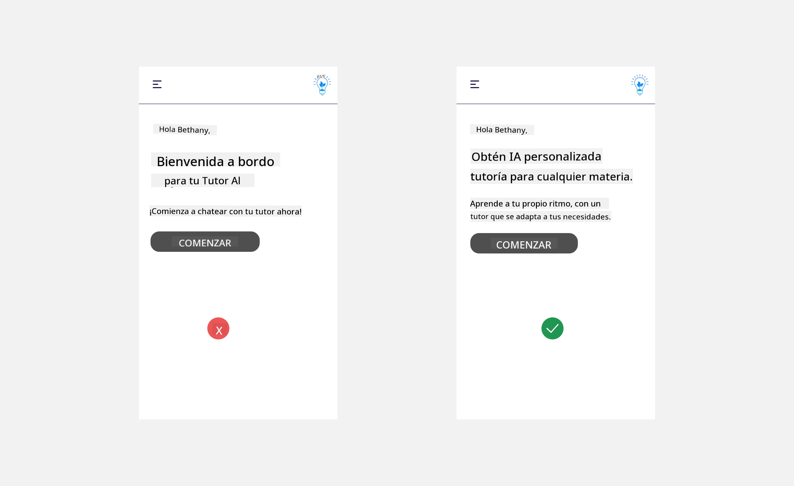
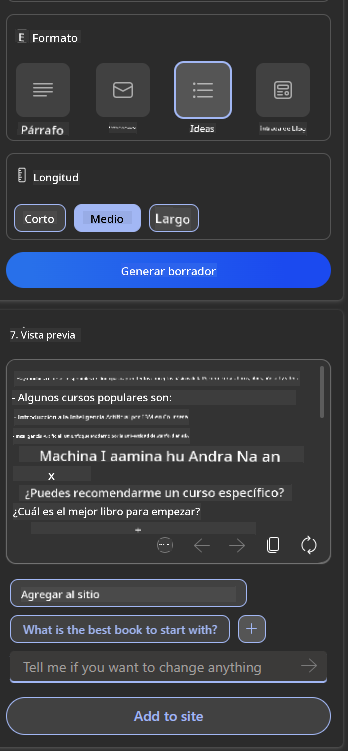

<!--
CO_OP_TRANSLATOR_METADATA:
{
  "original_hash": "747668e4c53d067369f06e9ec2e6313e",
  "translation_date": "2025-08-26T13:41:25+00:00",
  "source_file": "12-designing-ux-for-ai-applications/README.md",
  "language_code": "es"
}
-->
# Diseñando UX para Aplicaciones de IA

> _(Haz clic en la imagen de arriba para ver el video de esta lección)_

La experiencia de usuario es un aspecto muy importante al crear aplicaciones. Los usuarios deben poder utilizar tu app de manera eficiente para realizar tareas. Ser eficiente es importante, pero también necesitas diseñar apps para que puedan ser usadas por todos, haciéndolas _accesibles_. Este capítulo se enfoca en este tema para que puedas terminar diseñando una app que la gente pueda y quiera usar.

## Introducción

La experiencia de usuario es la forma en que una persona interactúa y utiliza un producto o servicio específico, ya sea un sistema, herramienta o diseño. Al desarrollar aplicaciones de IA, los desarrolladores no solo se enfocan en asegurar que la experiencia de usuario sea efectiva, sino también ética. En esta lección, cubrimos cómo construir aplicaciones de Inteligencia Artificial (IA) que respondan a las necesidades de los usuarios.

La lección cubrirá los siguientes temas:

- Introducción a la Experiencia de Usuario y Comprensión de las Necesidades del Usuario
- Diseño de Aplicaciones de IA para la Confianza y la Transparencia
- Diseño de Aplicaciones de IA para la Colaboración y Retroalimentación

## Objetivos de aprendizaje

Después de tomar esta lección, podrás:

- Entender cómo construir aplicaciones de IA que respondan a las necesidades de los usuarios.
- Diseñar aplicaciones de IA que fomenten la confianza y la colaboración.

### Prerrequisito

Tómate un tiempo para leer más sobre [experiencia de usuario y design thinking.](https://learn.microsoft.com/training/modules/ux-design?WT.mc_id=academic-105485-koreyst)

## Introducción a la Experiencia de Usuario y Comprensión de las Necesidades del Usuario

En nuestra startup educativa ficticia, tenemos dos usuarios principales: profesores y estudiantes. Cada uno de estos usuarios tiene necesidades únicas. Un diseño centrado en el usuario prioriza a la persona, asegurando que los productos sean relevantes y útiles para quienes están destinados.

La aplicación debe ser **útil, confiable, accesible y agradable** para brindar una buena experiencia de usuario.

### Usabilidad

Ser útil significa que la aplicación tiene funcionalidades que cumplen con su propósito, como automatizar el proceso de calificación o generar tarjetas de estudio para repaso. Una aplicación que automatiza la calificación debe poder asignar puntajes de manera precisa y eficiente al trabajo de los estudiantes según criterios predefinidos. De igual forma, una aplicación que genera tarjetas de estudio debe poder crear preguntas relevantes y variadas basadas en sus datos.

### Confiabilidad

Ser confiable significa que la aplicación puede realizar su tarea de manera consistente y sin errores. Sin embargo, la IA, al igual que los humanos, no es perfecta y puede cometer errores. Las aplicaciones pueden encontrar errores o situaciones inesperadas que requieran intervención o corrección humana. ¿Cómo manejas los errores? En la última sección de esta lección, veremos cómo los sistemas y aplicaciones de IA están diseñados para la colaboración y la retroalimentación.

### Accesibilidad

Ser accesible significa extender la experiencia de usuario a personas con diferentes capacidades, incluyendo aquellas con discapacidades, asegurando que nadie quede fuera. Siguiendo las pautas y principios de accesibilidad, las soluciones de IA se vuelven más inclusivas, usables y beneficiosas para todos los usuarios.

### Agradable

Ser agradable significa que la aplicación es placentera de usar. Una experiencia de usuario atractiva puede tener un impacto positivo en el usuario, animándolo a volver a la aplicación y aumentando los ingresos del negocio.

No todos los desafíos pueden resolverse con IA. La IA ayuda a mejorar la experiencia de usuario, ya sea automatizando tareas manuales o personalizando experiencias.

## Diseño de Aplicaciones de IA para la Confianza y la Transparencia

Generar confianza es fundamental al diseñar aplicaciones de IA. La confianza asegura que el usuario tenga la seguridad de que la aplicación hará el trabajo, entregará resultados de manera consistente y que estos resultados sean los que necesita. Un riesgo en este aspecto es la desconfianza y la confianza excesiva. La desconfianza ocurre cuando el usuario tiene poca o ninguna confianza en el sistema de IA, lo que puede llevar a que rechace tu aplicación. La confianza excesiva ocurre cuando el usuario sobreestima la capacidad del sistema de IA, confiando demasiado en él. Por ejemplo, un sistema automatizado de calificación, en caso de confianza excesiva, podría hacer que el profesor no revise algunos exámenes para asegurarse de que el sistema califica correctamente. Esto podría resultar en calificaciones injustas o inexactas para los estudiantes, o en oportunidades perdidas de retroalimentación y mejora.

Dos formas de asegurar que la confianza esté en el centro del diseño son la explicabilidad y el control.

### Explicabilidad

Cuando la IA ayuda a tomar decisiones, como impartir conocimiento a futuras generaciones, es fundamental que profesores y padres entiendan cómo se toman las decisiones de la IA. Esto es la explicabilidad: entender cómo las aplicaciones de IA toman decisiones. Diseñar para la explicabilidad incluye agregar detalles que muestren cómo la IA llegó a un resultado. La audiencia debe saber que el resultado es generado por IA y no por un humano. Por ejemplo, en vez de decir "Empieza a chatear con tu tutor ahora", di "Usa un tutor de IA que se adapta a tus necesidades y te ayuda a aprender a tu ritmo".

Otro ejemplo es cómo la IA utiliza los datos personales y del usuario. Por ejemplo, un usuario con el rol de estudiante puede tener limitaciones según su perfil. La IA puede no revelar respuestas a preguntas, pero sí puede guiar al usuario para que piense cómo resolver un problema.

Otra parte clave de la explicabilidad es simplificar las explicaciones. Los estudiantes y profesores pueden no ser expertos en IA, por lo tanto, las explicaciones sobre lo que la aplicación puede o no puede hacer deben ser simples y fáciles de entender.

### Control

La IA generativa crea una colaboración entre la IA y el usuario, donde por ejemplo el usuario puede modificar los prompts para obtener diferentes resultados. Además, una vez que se genera un resultado, los usuarios deben poder modificarlo, dándoles una sensación de control. Por ejemplo, al usar Bing, puedes personalizar tu prompt según el formato, tono y longitud. Además, puedes hacer cambios en tu resultado y modificarlo como se muestra a continuación:

Otra función en Bing que permite al usuario tener control sobre la aplicación es la posibilidad de aceptar o rechazar el uso de los datos por parte de la IA. En una aplicación escolar, un estudiante podría querer usar sus notas y los recursos del profesor como material de repaso.

> Al diseñar aplicaciones de IA, la intencionalidad es clave para asegurar que los usuarios no confíen en exceso y tengan expectativas realistas sobre sus capacidades. Una forma de lograr esto es creando cierta fricción entre los prompts y los resultados. Recuerda al usuario que esto es IA y no un ser humano.

## Diseño de Aplicaciones de IA para la Colaboración y Retroalimentación

Como mencionamos antes, la IA generativa crea una colaboración entre el usuario y la IA. La mayoría de las interacciones consisten en que el usuario introduce un prompt y la IA genera un resultado. ¿Qué pasa si el resultado es incorrecto? ¿Cómo maneja la aplicación los errores si ocurren? ¿La IA culpa al usuario o se toma el tiempo de explicar el error?

Las aplicaciones de IA deben estar diseñadas para recibir y dar retroalimentación. Esto no solo ayuda a que el sistema de IA mejore, sino que también genera confianza con los usuarios. Un ciclo de retroalimentación debe estar incluido en el diseño, por ejemplo, un simple pulgar arriba o abajo en el resultado.

Otra forma de manejar esto es comunicar claramente las capacidades y limitaciones del sistema. Cuando un usuario comete un error solicitando algo fuera de las capacidades de la IA, también debe haber una forma de manejarlo, como se muestra a continuación.

Los errores del sistema son comunes en aplicaciones donde el usuario puede necesitar ayuda con información fuera del alcance de la IA o la aplicación puede tener un límite en cuántas preguntas/asignaturas puede generar resúmenes. Por ejemplo, una aplicación de IA entrenada solo con datos de Historia y Matemáticas puede no poder responder preguntas sobre Geografía. Para mitigar esto, el sistema de IA puede responder: "Lo siento, nuestro producto ha sido entrenado con datos en las siguientes materias..., no puedo responder la pregunta que hiciste."

Las aplicaciones de IA no son perfectas, por lo tanto, es probable que cometan errores. Al diseñar tus aplicaciones, debes asegurarte de dejar espacio para la retroalimentación de los usuarios y el manejo de errores de una manera simple y fácil de explicar.

## Tarea

Toma cualquier app de IA que hayas creado hasta ahora y considera implementar los siguientes pasos en tu app:

- **Agradable:** Piensa cómo puedes hacer tu app más agradable. ¿Estás agregando explicaciones en todas partes? ¿Estás animando al usuario a explorar? ¿Cómo redactas tus mensajes de error?

- **Usabilidad:** Si estás construyendo una app web, asegúrate de que se pueda navegar tanto con el mouse como con el teclado.

- **Confianza y transparencia:** No confíes completamente en la IA ni en sus resultados, piensa cómo podrías agregar una persona al proceso para verificar el resultado. Además, considera e implementa otras formas de lograr confianza y transparencia.

- **Control:** Da al usuario control sobre los datos que proporciona a la aplicación. Implementa una forma en que el usuario pueda aceptar o rechazar la recopilación de datos en la aplicación de IA.

## ¡Continúa Aprendiendo!

Después de completar esta lección, revisa nuestra [colección de aprendizaje sobre IA generativa](https://aka.ms/genai-collection?WT.mc_id=academic-105485-koreyst) para seguir mejorando tus conocimientos en IA generativa.

¡Dirígete a la Lección 13, donde veremos cómo [asegurar aplicaciones de IA](../13-securing-ai-applications/README.md?WT.mc_id=academic-105485-koreyst)!

---

**Descargo de responsabilidad**:  
Este documento ha sido traducido utilizando el servicio de traducción automática [Co-op Translator](https://github.com/Azure/co-op-translator). Aunque nos esforzamos por lograr precisión, tenga en cuenta que las traducciones automáticas pueden contener errores o inexactitudes. El documento original en su idioma nativo debe considerarse la fuente autorizada. Para información crítica, se recomienda la traducción profesional realizada por humanos. No nos hacemos responsables de cualquier malentendido o interpretación incorrecta que surja del uso de esta traducción.