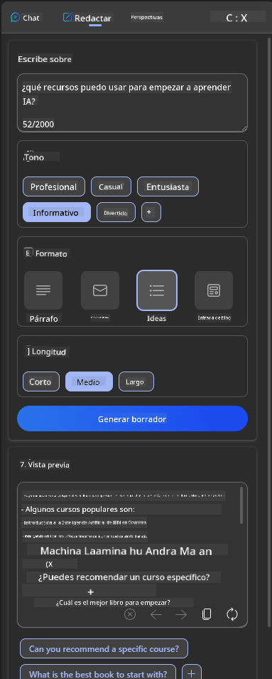

<!--
CO_OP_TRANSLATOR_METADATA:
{
  "original_hash": "78bbeed50fd4dc9fdee931f5daf98cb3",
  "translation_date": "2025-10-17T22:45:45+00:00",
  "source_file": "12-designing-ux-for-ai-applications/README.md",
  "language_code": "es"
}
-->
# Diseñando UX para Aplicaciones de IA

> _(Haz clic en la imagen de arriba para ver el video de esta lección)_

La experiencia del usuario es un aspecto muy importante al construir aplicaciones. Los usuarios necesitan poder usar tu aplicación de manera eficiente para realizar tareas. Ser eficiente es una cosa, pero también necesitas diseñar aplicaciones para que puedan ser utilizadas por todos, haciéndolas _accesibles_. Este capítulo se centrará en esta área para que, con suerte, termines diseñando una aplicación que las personas puedan y quieran usar.

## Introducción

La experiencia del usuario es cómo un usuario interactúa y utiliza un producto o servicio específico, ya sea un sistema, herramienta o diseño. Al desarrollar aplicaciones de IA, los desarrolladores no solo se enfocan en garantizar que la experiencia del usuario sea efectiva, sino también ética. En esta lección, cubrimos cómo construir aplicaciones de Inteligencia Artificial (IA) que respondan a las necesidades de los usuarios.

La lección cubrirá las siguientes áreas:

- Introducción a la experiencia del usuario y comprensión de las necesidades del usuario
- Diseñando aplicaciones de IA para la confianza y la transparencia
- Diseñando aplicaciones de IA para la colaboración y el feedback

## Objetivos de aprendizaje

Después de tomar esta lección, podrás:

- Comprender cómo construir aplicaciones de IA que satisfagan las necesidades de los usuarios.
- Diseñar aplicaciones de IA que promuevan la confianza y la colaboración.

### Prerrequisito

Tómate un tiempo para leer más sobre [experiencia del usuario y pensamiento de diseño.](https://learn.microsoft.com/training/modules/ux-design?WT.mc_id=academic-105485-koreyst)

## Introducción a la experiencia del usuario y comprensión de las necesidades del usuario

En nuestra startup educativa ficticia, tenemos dos usuarios principales, profesores y estudiantes. Cada uno de los dos usuarios tiene necesidades únicas. Un diseño centrado en el usuario prioriza al usuario, asegurando que los productos sean relevantes y beneficiosos para aquellos a quienes están destinados.

La aplicación debe ser **útil, confiable, accesible y agradable** para proporcionar una buena experiencia de usuario.

### Usabilidad

Ser útil significa que la aplicación tiene funcionalidades que coinciden con su propósito previsto, como automatizar el proceso de calificación o generar tarjetas de estudio para la revisión. Una aplicación que automatiza el proceso de calificación debería poder asignar puntajes de manera precisa y eficiente al trabajo de los estudiantes según criterios predefinidos. De manera similar, una aplicación que genera tarjetas de estudio para la revisión debería poder crear preguntas relevantes y diversas basadas en sus datos.

### Confiabilidad

Ser confiable significa que la aplicación puede realizar su tarea de manera consistente y sin errores. Sin embargo, la IA, al igual que los humanos, no es perfecta y puede ser propensa a errores. Las aplicaciones pueden encontrar errores o situaciones inesperadas que requieran intervención o corrección humana. ¿Cómo manejas los errores? En la última sección de esta lección, cubriremos cómo los sistemas y aplicaciones de IA están diseñados para la colaboración y el feedback.

### Accesibilidad

Ser accesible significa extender la experiencia del usuario a usuarios con diversas capacidades, incluidas aquellas con discapacidades, asegurando que nadie quede excluido. Siguiendo las pautas y principios de accesibilidad, las soluciones de IA se vuelven más inclusivas, utilizables y beneficiosas para todos los usuarios.

### Agradable

Ser agradable significa que la aplicación es placentera de usar. Una experiencia de usuario atractiva puede tener un impacto positivo en el usuario, alentándolo a regresar a la aplicación y aumentando los ingresos del negocio.

No todos los desafíos pueden resolverse con IA. La IA entra en juego para mejorar tu experiencia de usuario, ya sea automatizando tareas manuales o personalizando experiencias de usuario.

## Diseñando aplicaciones de IA para la confianza y la transparencia

Construir confianza es fundamental al diseñar aplicaciones de IA. La confianza asegura que un usuario tenga la seguridad de que la aplicación realizará el trabajo, entregará resultados de manera consistente y que los resultados son lo que el usuario necesita. Un riesgo en esta área es la desconfianza y la confianza excesiva. La desconfianza ocurre cuando un usuario tiene poca o ninguna confianza en un sistema de IA, lo que lleva al usuario a rechazar tu aplicación. La confianza excesiva ocurre cuando un usuario sobreestima la capacidad de un sistema de IA, lo que lleva a los usuarios a confiar demasiado en el sistema de IA. Por ejemplo, un sistema de calificación automatizado en el caso de confianza excesiva podría llevar al profesor a no revisar algunos de los trabajos para asegurarse de que el sistema de calificación funcione bien. Esto podría resultar en calificaciones injustas o inexactas para los estudiantes, o en oportunidades perdidas para recibir retroalimentación y mejorar.

Dos formas de garantizar que la confianza esté en el centro del diseño son la explicabilidad y el control.

### Explicabilidad

Cuando la IA ayuda a informar decisiones como impartir conocimiento a las generaciones futuras, es fundamental que los profesores y padres comprendan cómo se toman las decisiones de la IA. Esto es la explicabilidad: entender cómo las aplicaciones de IA toman decisiones. Diseñar para la explicabilidad incluye agregar detalles que destaquen cómo la IA llegó al resultado. La audiencia debe ser consciente de que el resultado es generado por la IA y no por un humano. Por ejemplo, en lugar de decir "Comienza a chatear con tu tutor ahora", di "Usa un tutor de IA que se adapta a tus necesidades y te ayuda a aprender a tu ritmo."

Otro ejemplo es cómo la IA utiliza datos de usuario y personales. Por ejemplo, un usuario con la persona de estudiante puede tener limitaciones basadas en su perfil. La IA puede no ser capaz de revelar respuestas a preguntas, pero puede ayudar a guiar al usuario a pensar cómo puede resolver un problema.

Otra parte clave de la explicabilidad es la simplificación de las explicaciones. Los estudiantes y profesores pueden no ser expertos en IA, por lo tanto, las explicaciones sobre lo que la aplicación puede o no puede hacer deben ser simplificadas y fáciles de entender.

### Control

La IA generativa crea una colaboración entre la IA y el usuario, donde, por ejemplo, un usuario puede modificar indicaciones para obtener diferentes resultados. Además, una vez que se genera un resultado, los usuarios deberían poder modificar los resultados, dándoles una sensación de control. Por ejemplo, al usar Bing, puedes personalizar tu indicación según el formato, el tono y la longitud. Además, puedes realizar cambios en tu resultado y modificarlo como se muestra a continuación:

Otra característica en Bing que permite al usuario tener control sobre la aplicación es la capacidad de optar por participar o no en los datos que utiliza la IA. Para una aplicación escolar, un estudiante podría querer usar sus notas, así como los recursos del profesor como material de revisión.

> Al diseñar aplicaciones de IA, la intencionalidad es clave para garantizar que los usuarios no confíen demasiado, estableciendo expectativas poco realistas sobre sus capacidades. Una forma de hacer esto es creando fricción entre las indicaciones y los resultados. Recordando al usuario que esto es IA y no un ser humano.

## Diseñando aplicaciones de IA para la colaboración y el feedback

Como se mencionó anteriormente, la IA generativa crea una colaboración entre el usuario y la IA. La mayoría de las interacciones son con un usuario ingresando una indicación y la IA generando un resultado. ¿Qué pasa si el resultado es incorrecto? ¿Cómo maneja la aplicación los errores si ocurren? ¿La IA culpa al usuario o se toma el tiempo para explicar el error?

Las aplicaciones de IA deben estar diseñadas para recibir y dar feedback. Esto no solo ayuda a mejorar el sistema de IA, sino que también genera confianza con los usuarios. Un ciclo de feedback debe incluirse en el diseño, un ejemplo puede ser un simple pulgar hacia arriba o hacia abajo en el resultado.

Otra forma de manejar esto es comunicar claramente las capacidades y limitaciones del sistema. Cuando un usuario comete un error al solicitar algo más allá de las capacidades de la IA, también debería haber una forma de manejar esto, como se muestra a continuación.

Los errores del sistema son comunes en las aplicaciones donde el usuario podría necesitar asistencia con información fuera del alcance de la IA o la aplicación puede tener un límite en cuántas preguntas/asignaturas puede generar resúmenes. Por ejemplo, una aplicación de IA entrenada con datos sobre asignaturas limitadas, por ejemplo, Historia y Matemáticas, puede no ser capaz de manejar preguntas sobre Geografía. Para mitigar esto, el sistema de IA puede dar una respuesta como: "Lo siento, nuestro producto ha sido entrenado con datos en las siguientes asignaturas..., no puedo responder a la pregunta que hiciste."

Las aplicaciones de IA no son perfectas, por lo tanto, están destinadas a cometer errores. Al diseñar tus aplicaciones, debes asegurarte de crear espacio para recibir feedback de los usuarios y manejar errores de una manera simple y fácilmente explicable.

## Tarea

Toma cualquier aplicación de IA que hayas creado hasta ahora y considera implementar los siguientes pasos en tu aplicación:

- **Agradable:** Considera cómo puedes hacer que tu aplicación sea más agradable. ¿Estás agregando explicaciones en todas partes? ¿Estás alentando al usuario a explorar? ¿Cómo estás redactando tus mensajes de error?

- **Usabilidad:** Construyendo una aplicación web. Asegúrate de que tu aplicación sea navegable tanto con el ratón como con el teclado.

- **Confianza y transparencia:** No confíes completamente en la IA y sus resultados, considera cómo podrías agregar un humano al proceso para verificar los resultados. Además, considera e implementa otras formas de lograr confianza y transparencia.

- **Control:** Dale al usuario control sobre los datos que proporciona a la aplicación. Implementa una forma en la que el usuario pueda optar por participar o no en la recopilación de datos en la aplicación de IA.

## ¡Continúa aprendiendo!

Después de completar esta lección, consulta nuestra [colección de aprendizaje sobre IA generativa](https://aka.ms/genai-collection?WT.mc_id=academic-105485-koreyst) para seguir ampliando tus conocimientos sobre IA generativa.

Dirígete a la Lección 13, donde veremos cómo [asegurar aplicaciones de IA](../13-securing-ai-applications/README.md?WT.mc_id=academic-105485-koreyst)!

---

**Descargo de responsabilidad**:  
Este documento ha sido traducido utilizando el servicio de traducción automática [Co-op Translator](https://github.com/Azure/co-op-translator). Aunque nos esforzamos por lograr precisión, tenga en cuenta que las traducciones automáticas pueden contener errores o imprecisiones. El documento original en su idioma nativo debe considerarse la fuente autorizada. Para información crítica, se recomienda una traducción profesional realizada por humanos. No nos hacemos responsables de malentendidos o interpretaciones erróneas que surjan del uso de esta traducción.