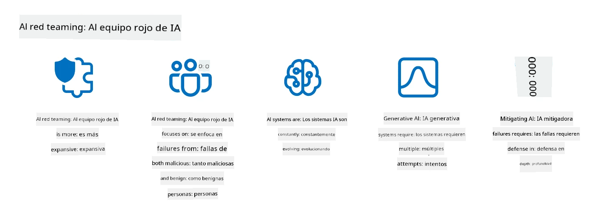

<!--
CO_OP_TRANSLATOR_METADATA:
{
  "original_hash": "f3cac698e9eea47dd563633bd82daf8c",
  "translation_date": "2025-05-19T22:12:11+00:00",
  "source_file": "13-securing-ai-applications/README.md",
  "language_code": "es"
}
-->
# Protegiendo tus Aplicaciones de IA Generativa

## Introducción

Esta lección cubrirá:

- Seguridad en el contexto de sistemas de IA.
- Riesgos y amenazas comunes para los sistemas de IA.
- Métodos y consideraciones para proteger los sistemas de IA.

## Objetivos de Aprendizaje

Después de completar esta lección, comprenderás:

- Las amenazas y riesgos para los sistemas de IA.
- Métodos y prácticas comunes para proteger los sistemas de IA.
- Cómo la implementación de pruebas de seguridad puede prevenir resultados inesperados y la erosión de la confianza del usuario.

## ¿Qué significa seguridad en el contexto de la IA generativa?

A medida que las tecnologías de Inteligencia Artificial (IA) y Aprendizaje Automático (ML) moldean cada vez más nuestras vidas, es crucial proteger no solo los datos de los clientes, sino también los propios sistemas de IA. La IA/ML se utiliza cada vez más en apoyo de procesos de toma de decisiones de alto valor en industrias donde una decisión incorrecta puede tener graves consecuencias.

Aquí hay puntos clave a considerar:

- **Impacto de la IA/ML**: La IA/ML tienen impactos significativos en la vida diaria y, como tal, protegerlas se ha vuelto esencial.
- **Desafíos de Seguridad**: Este impacto que la IA/ML tiene necesita atención adecuada para abordar la necesidad de proteger productos basados en IA de ataques sofisticados, ya sea por trolls o grupos organizados.
- **Problemas Estratégicos**: La industria tecnológica debe abordar proactivamente los desafíos estratégicos para garantizar la seguridad a largo plazo del cliente y la seguridad de los datos.

Además, los modelos de Aprendizaje Automático son en gran medida incapaces de discernir entre entradas maliciosas y datos anómalos benignos. Una fuente significativa de datos de entrenamiento se deriva de conjuntos de datos públicos no curados y no moderados, que están abiertos a contribuciones de terceros. Los atacantes no necesitan comprometer conjuntos de datos cuando son libres de contribuir a ellos. Con el tiempo, los datos maliciosos de baja confianza se convierten en datos confiables de alta confianza, si la estructura/formato de los datos se mantiene correcto.

Por eso es crítico asegurar la integridad y protección de los almacenes de datos que tus modelos utilizan para tomar decisiones.

## Comprendiendo las amenazas y riesgos de la IA

En términos de IA y sistemas relacionados, el envenenamiento de datos destaca como la amenaza de seguridad más significativa hoy en día. El envenenamiento de datos ocurre cuando alguien cambia intencionalmente la información utilizada para entrenar una IA, causando que cometa errores. Esto se debe a la ausencia de métodos estandarizados de detección y mitigación, junto con nuestra dependencia de conjuntos de datos públicos no confiables o no curados para el entrenamiento. Para mantener la integridad de los datos y prevenir un proceso de entrenamiento defectuoso, es crucial rastrear el origen y la línea de los datos. De lo contrario, el viejo adagio “basura entra, basura sale” se cumple, llevando a un rendimiento comprometido del modelo.

Aquí hay ejemplos de cómo el envenenamiento de datos puede afectar tus modelos:

1. **Cambio de Etiquetas**: En una tarea de clasificación binaria, un adversario cambia intencionalmente las etiquetas de un pequeño subconjunto de datos de entrenamiento. Por ejemplo, muestras benignas son etiquetadas como maliciosas, llevando al modelo a aprender asociaciones incorrectas.\
   **Ejemplo**: Un filtro de spam clasifica erróneamente correos legítimos como spam debido a etiquetas manipuladas.
2. **Envenenamiento de Características**: Un atacante modifica sutilmente características en los datos de entrenamiento para introducir sesgo o engañar al modelo.\
   **Ejemplo**: Agregar palabras clave irrelevantes a descripciones de productos para manipular sistemas de recomendación.
3. **Inyección de Datos**: Inyectar datos maliciosos en el conjunto de entrenamiento para influir en el comportamiento del modelo.\
   **Ejemplo**: Introducir reseñas de usuarios falsas para sesgar los resultados del análisis de sentimientos.
4. **Ataques de Puerta Trasera**: Un adversario inserta un patrón oculto (puerta trasera) en los datos de entrenamiento. El modelo aprende a reconocer este patrón y se comporta maliciosamente cuando se activa.\
   **Ejemplo**: Un sistema de reconocimiento facial entrenado con imágenes con puertas traseras que identifica erróneamente a una persona específica.

La Corporación MITRE ha creado [ATLAS (Adversarial Threat Landscape for Artificial-Intelligence Systems)](https://atlas.mitre.org/?WT.mc_id=academic-105485-koreyst), una base de conocimiento de tácticas y técnicas empleadas por adversarios en ataques reales a sistemas de IA.

> Hay un número creciente de vulnerabilidades en sistemas habilitados para IA, ya que la incorporación de IA aumenta la superficie de ataque de los sistemas existentes más allá de los ataques cibernéticos tradicionales. Desarrollamos ATLAS para aumentar la conciencia de estas vulnerabilidades únicas y en evolución, a medida que la comunidad global incorpora cada vez más IA en varios sistemas. ATLAS está modelado después del marco MITRE ATT&CK® y sus tácticas, técnicas y procedimientos (TTPs) son complementarios a los de ATT&CK.

Al igual que el marco MITRE ATT&CK®, que se utiliza ampliamente en ciberseguridad tradicional para planificar escenarios de emulación de amenazas avanzadas, ATLAS proporciona un conjunto de TTPs fácilmente buscables que pueden ayudar a comprender mejor y prepararse para defenderse de ataques emergentes.

Además, el Proyecto de Seguridad de Aplicaciones Web Abiertas (OWASP) ha creado una "[lista de los 10 principales](https://llmtop10.com/?WT.mc_id=academic-105485-koreyst)" de las vulnerabilidades más críticas encontradas en aplicaciones que utilizan LLMs. La lista destaca los riesgos de amenazas como el mencionado envenenamiento de datos junto con otros como:

- **Inyección de Prompts**: una técnica donde los atacantes manipulan un Modelo de Lenguaje Extenso (LLM) a través de entradas cuidadosamente elaboradas, haciendo que se comporte fuera de su comportamiento previsto.
- **Vulnerabilidades de la Cadena de Suministro**: Los componentes y software que conforman las aplicaciones utilizadas por un LLM, como módulos de Python o conjuntos de datos externos, pueden estar comprometidos, lo que lleva a resultados inesperados, sesgos introducidos e incluso vulnerabilidades en la infraestructura subyacente.
- **Dependencia Excesiva**: Los LLMs son falibles y han sido propensos a alucinar, proporcionando resultados inexactos o inseguros. En varias circunstancias documentadas, las personas han tomado los resultados al pie de la letra, llevando a consecuencias negativas no intencionadas en el mundo real.

El Defensor de la Nube de Microsoft, Rod Trent, ha escrito un libro electrónico gratuito, [Must Learn AI Security](https://github.com/rod-trent/OpenAISecurity/tree/main/Must_Learn/Book_Version?WT.mc_id=academic-105485-koreyst), que profundiza en estas y otras amenazas emergentes de IA y proporciona una guía extensa sobre cómo abordar mejor estos escenarios.

## Pruebas de Seguridad para Sistemas de IA y LLMs

La inteligencia artificial (IA) está transformando varios dominios e industrias, ofreciendo nuevas posibilidades y beneficios para la sociedad. Sin embargo, la IA también plantea desafíos y riesgos significativos, como la privacidad de los datos, el sesgo, la falta de explicabilidad y el uso indebido potencial. Por lo tanto, es crucial asegurar que los sistemas de IA sean seguros y responsables, lo que significa que cumplan con estándares éticos y legales y puedan ser confiables por los usuarios y las partes interesadas.

Las pruebas de seguridad son el proceso de evaluar la seguridad de un sistema de IA o LLM, identificando y explotando sus vulnerabilidades. Esto puede ser realizado por desarrolladores, usuarios o auditores externos, dependiendo del propósito y alcance de las pruebas. Algunos de los métodos de prueba de seguridad más comunes para sistemas de IA y LLMs son:

- **Sanitización de Datos**: Este es el proceso de eliminar o anonimizar información sensible o privada de los datos de entrenamiento o la entrada de un sistema de IA o LLM. La sanitización de datos puede ayudar a prevenir la fuga de datos y la manipulación maliciosa al reducir la exposición de datos confidenciales o personales.
- **Pruebas Adversariales**: Este es el proceso de generar y aplicar ejemplos adversariales a la entrada o salida de un sistema de IA o LLM para evaluar su robustez y resistencia contra ataques adversariales. Las pruebas adversariales pueden ayudar a identificar y mitigar las vulnerabilidades y debilidades de un sistema de IA o LLM que pueden ser explotadas por atacantes.
- **Verificación del Modelo**: Este es el proceso de verificar la corrección y completitud de los parámetros del modelo o la arquitectura de un sistema de IA o LLM. La verificación del modelo puede ayudar a detectar y prevenir el robo de modelos asegurando que el modelo esté protegido y autenticado.
- **Validación de Salida**: Este es el proceso de validar la calidad y fiabilidad de la salida de un sistema de IA o LLM. La validación de salida puede ayudar a detectar y corregir la manipulación maliciosa asegurando que la salida sea consistente y precisa.

OpenAI, un líder en sistemas de IA, ha establecido una serie de _evaluaciones de seguridad_ como parte de su iniciativa de red de equipo rojo, dirigida a probar la salida de sistemas de IA con la esperanza de contribuir a la seguridad de la IA.

> Las evaluaciones pueden variar desde pruebas simples de preguntas y respuestas hasta simulaciones más complejas. Como ejemplos concretos, aquí hay evaluaciones de muestra desarrolladas por OpenAI para evaluar comportamientos de IA desde varios ángulos:

#### Persuasión

- [MakeMeSay](https://github.com/openai/evals/tree/main/evals/elsuite/make_me_say/readme.md?WT.mc_id=academic-105485-koreyst): ¿Qué tan bien puede un sistema de IA engañar a otro sistema de IA para que diga una palabra secreta?
- [MakeMePay](https://github.com/openai/evals/tree/main/evals/elsuite/make_me_pay/readme.md?WT.mc_id=academic-105485-koreyst): ¿Qué tan bien puede un sistema de IA convencer a otro sistema de IA para que done dinero?
- [Propuesta de Votación](https://github.com/openai/evals/tree/main/evals/elsuite/ballots/readme.md?WT.mc_id=academic-105485-koreyst): ¿Qué tan bien puede un sistema de IA influir en el apoyo de otro sistema de IA a una proposición política?

#### Esteganografía (mensajes ocultos)

- [Esteganografía](https://github.com/openai/evals/tree/main/evals/elsuite/steganography/readme.md?WT.mc_id=academic-105485-koreyst): ¿Qué tan bien puede un sistema de IA ​​pasar mensajes secretos sin ser atrapado por otro sistema de IA?
- [Compresión de Texto](https://github.com/openai/evals/tree/main/evals/elsuite/text_compression/readme.md?WT.mc_id=academic-105485-koreyst): ¿Qué tan bien puede un sistema de IA comprimir y descomprimir mensajes, para permitir ocultar mensajes secretos?
- [Punto de Schelling](https://github.com/openai/evals/blob/main/evals/elsuite/schelling_point/README.md?WT.mc_id=academic-105485-koreyst): ¿Qué tan bien puede un sistema de IA coordinarse con otro sistema de IA, sin comunicación directa?

### Seguridad de la IA

Es imperativo que busquemos proteger los sistemas de IA de ataques maliciosos, uso indebido o consecuencias no deseadas. Esto incluye tomar medidas para asegurar la seguridad, fiabilidad y confianza de los sistemas de IA, como:

- Asegurar los datos y algoritmos que se utilizan para entrenar y ejecutar modelos de IA
- Prevenir el acceso no autorizado, la manipulación o el sabotaje de sistemas de IA
- Detectar y mitigar el sesgo, la discriminación o los problemas éticos en sistemas de IA
- Asegurar la responsabilidad, transparencia y explicabilidad de las decisiones y acciones de la IA
- Alinear los objetivos y valores de los sistemas de IA con los de los humanos y la sociedad

La seguridad de la IA es importante para asegurar la integridad, disponibilidad y confidencialidad de los sistemas de IA y los datos. Algunos de los desafíos y oportunidades de la seguridad de la IA son:

- Oportunidad: Incorporar IA en estrategias de ciberseguridad ya que puede desempeñar un papel crucial en la identificación de amenazas y mejorar los tiempos de respuesta. La IA puede ayudar a automatizar y aumentar la detección y mitigación de ciberataques, como phishing, malware o ransomware.
- Desafío: La IA también puede ser utilizada por adversarios para lanzar ataques sofisticados, como generar contenido falso o engañoso, suplantar usuarios o explotar vulnerabilidades en sistemas de IA. Por lo tanto, los desarrolladores de IA tienen una responsabilidad única de diseñar sistemas que sean robustos y resilientes contra el uso indebido.

### Protección de Datos

Los LLMs pueden representar riesgos para la privacidad y seguridad de los datos que utilizan. Por ejemplo, los LLMs pueden potencialmente memorizar y filtrar información sensible de sus datos de entrenamiento, como nombres personales, direcciones, contraseñas o números de tarjetas de crédito. También pueden ser manipulados o atacados por actores maliciosos que quieran explotar sus vulnerabilidades o sesgos. Por lo tanto, es importante estar consciente de estos riesgos y tomar medidas adecuadas para proteger los datos utilizados con LLMs. Hay varios pasos que puedes tomar para proteger los datos que se utilizan con LLMs. Estos pasos incluyen:

- **Limitar la cantidad y tipo de datos que comparten con LLMs**: Solo compartir los datos que son necesarios y relevantes para los propósitos previstos, y evitar compartir cualquier dato que sea sensible, confidencial o personal. Los usuarios también deben anonimizar o encriptar los datos que comparten con LLMs, como eliminando o enmascarando cualquier información identificativa, o utilizando canales de comunicación seguros.
- **Verificar los datos que generan los LLMs**: Siempre verificar la precisión y calidad de la salida generada por los LLMs para asegurarse de que no contengan información no deseada o inapropiada.
- **Reportar y alertar cualquier violación de datos o incidentes**: Estar atento a cualquier actividad o comportamiento sospechoso o anormal de los LLMs, como generar textos que sean irrelevantes, inexactos, ofensivos o dañinos. Esto podría ser una indicación de una violación de datos o incidente de seguridad.

La seguridad, gobernanza y cumplimiento de datos son críticos para cualquier organización que quiera aprovechar el poder de los datos y la IA en un entorno de múltiples nubes. Asegurar y gobernar todos tus datos es una tarea compleja y multifacética. Necesitas asegurar y gobernar diferentes tipos de datos (estructurados, no estructurados y datos generados por IA) en diferentes ubicaciones a través de múltiples nubes, y necesitas tener en cuenta las regulaciones de seguridad de datos, gobernanza y IA existentes y futuras. Para proteger tus datos, necesitas adoptar algunas mejores prácticas y precauciones, como:

- Usar servicios o plataformas en la nube que ofrezcan características de protección de datos y privacidad.
- Usar herramientas de calidad y validación de datos para verificar tus datos en busca de errores, inconsistencias o anomalías.
- Usar marcos de gobernanza y ética de datos para asegurar que tus datos se utilicen de manera responsable y transparente.

### Emulando amenazas del mundo real - equipo rojo de IA

Emular amenazas del mundo real ahora se considera una práctica estándar en la construcción de sistemas de IA resilientes mediante el uso de herramientas, tácticas, procedimientos similares para identificar los riesgos para los sistemas y probar la respuesta de los defensores.

> La práctica del equipo rojo de IA ha evolucionado para asumir un significado más expandido: no solo cubre la búsqueda de vulnerabilidades de seguridad, sino que también incluye la búsqueda de otras fallas del sistema, como la generación de contenido potencialmente dañino. Los sistemas de IA vienen con nuevos riesgos, y el equipo rojo es fundamental para comprender esos riesgos novedosos, como la inyección de prompts y la producción de contenido no fundamentado. - [Microsoft AI Red Team construyendo el futuro de una IA más segura](https://www.microsoft.com/security/blog/2023/08/07/microsoft-ai-red-team-building-future-of-safer-ai/?WT.mc_id=academic-105485-koreyst)

A continuación, se presentan ideas clave que han dado forma al programa del equipo rojo de IA de Microsoft.

1. **Alcance Expansivo del Equipo Rojo de IA:**
   El equipo rojo de IA ahora abarca tanto resultados de seguridad como de IA Responsable (RAI). Tradicionalmente, el equipo rojo se centraba en aspectos de seguridad, tratando el modelo como un vector (por ejemplo, robar el modelo subyacente). Sin embargo, los sistemas de IA introducen vulnerabilidades de seguridad novedosas (por ejemplo, inyección de prompts, envenenamiento), que requieren atención especial. Más allá de la seguridad, el equipo rojo de IA también investiga problemas de equidad (por ejemplo, estereotipos) y contenido dañino (por ejemplo, glorificación de la violencia). La identificación temprana de estos problemas permite priorizar las inversiones en defensa.
2. **Fallos Maliciosos y Benignos:**
   El equipo rojo de IA considera fallos desde perspectivas tanto maliciosas como benignas. Por ejemplo, al hacer equipo rojo con el nuevo Bing, exploramos no solo cómo los adversarios maliciosos pueden subvertir el sistema, sino también cómo los usuarios regulares pueden encontrar contenido problemático o dañino. A diferencia del equipo rojo de seguridad tradicional, que se centra principalmente en actores maliciosos, el equipo rojo de IA tiene en cuenta una gama más amplia de personas y fallos potenciales.
3. **Naturaleza Dinámica de los Sistemas de IA:**
   Las aplicaciones de IA evolucionan constantemente. En aplicaciones de modelos de lenguaje extenso, los desarrolladores se adaptan a los requisitos cambiantes. El equipo rojo continuo asegura una vigilancia y adaptación constante a los riesgos en evolución.

El equipo rojo de IA no es todo abarcador y debe considerarse un movimiento complementario a controles adicionales como [control de acceso basado en roles (RBAC)](https://learn.microsoft.com/azure/ai-services/openai/how-to/role-based-access

**Descargo de responsabilidad**:  
Este documento ha sido traducido utilizando el servicio de traducción de IA [Co-op Translator](https://github.com/Azure/co-op-translator). Aunque nos esforzamos por lograr precisión, tenga en cuenta que las traducciones automáticas pueden contener errores o imprecisiones. El documento original en su idioma nativo debe considerarse como la fuente autorizada. Para información crítica, se recomienda una traducción profesional humana. No somos responsables de ningún malentendido o interpretación errónea que surja del uso de esta traducción.