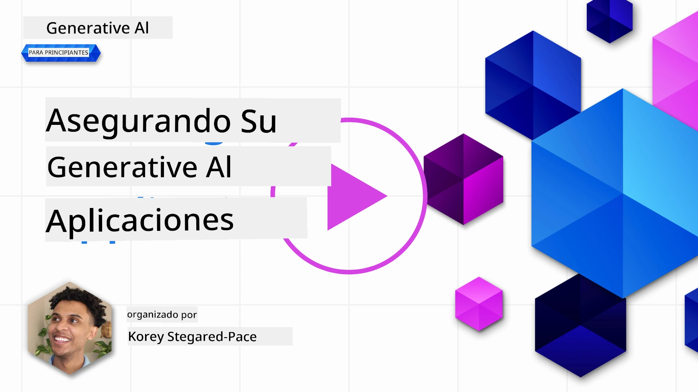
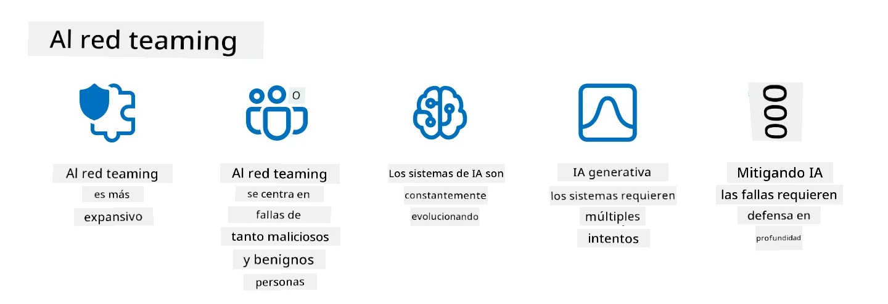

# Asegurando tus Aplicaciones de IA Generativa

## Introducción

Esta lección cubrirá:

- Seguridad en el contexto de sistemas de IA.
- Riesgos y amenazas comunes para sistemas de IA.
- Métodos y consideraciones para asegurar sistemas de IA.

## Objetivos de Aprendizaje

Después de completar esta lección, comprenderás:

- Las amenazas y riesgos para sistemas de IA.
- Métodos y prácticas comunes para asegurar sistemas de IA.
- Cómo la implementación de pruebas de seguridad puede prevenir resultados inesperados y la erosión de la confianza del usuario.

## ¿Qué significa seguridad dentro del contexto de la IA generativa?

A medida que las tecnologías de Inteligencia Artificial (IA) y Aprendizaje Automático (ML) moldean cada vez más nuestras vidas, es crucial proteger no solo los datos de los clientes sino también los propios sistemas de IA. IA/ML se utiliza cada vez más para apoyar procesos de toma de decisiones de alto valor en industrias donde una decisión errónea puede tener consecuencias graves.

Aquí hay puntos clave a considerar:

- **Impacto de IA/ML**: La IA/ML tiene impactos significativos en la vida diaria y, por tanto, protegerlas se ha vuelto esencial.
- **Desafíos de Seguridad**: Este impacto que tiene la IA/ML requiere atención adecuada para abordar la necesidad de proteger productos basados en IA contra ataques sofisticados, ya sea de trolls o grupos organizados.
- **Problemas Estratégicos**: La industria tecnológica debe abordar proactivamente desafíos estratégicos para asegurar la seguridad a largo plazo de los clientes y la protección de datos.

Además, los modelos de Aprendizaje Automático en gran medida no pueden discernir entre entradas maliciosas y datos anómalos benignos. Una fuente significativa de datos de entrenamiento proviene de conjuntos de datos públicos sin curación ni moderación, abiertos a contribuciones de terceros. Los atacantes no necesitan comprometer conjuntos de datos cuando pueden contribuir a ellos libremente. Con el tiempo, los datos maliciosos de baja confianza se convierten en datos confiables de alta confianza, si la estructura/formato de los datos permanece correcta.

Por eso es fundamental asegurar la integridad y protección de los almacenes de datos que tus modelos usan para tomar decisiones.

## Entendiendo las amenazas y riesgos de la IA

En términos de IA y sistemas relacionados, el envenenamiento de datos destaca como la amenaza de seguridad más significativa hoy en día. El envenenamiento de datos ocurre cuando alguien cambia intencionadamente la información usada para entrenar una IA, causando que cometa errores. Esto se debe a la ausencia de métodos estándar de detección y mitigación, junto con nuestra dependencia de conjuntos de datos públicos no confiables o sin curación para el entrenamiento. Para mantener la integridad de los datos y prevenir un proceso de entrenamiento defectuoso, es crucial rastrear el origen y linaje de tus datos. De otra manera, el antiguo dicho “basura entra, basura sale” se cumple, llevando a un rendimiento comprometido del modelo.

Aquí hay ejemplos de cómo el envenenamiento de datos puede afectar tus modelos:

1. **Invertir Etiquetas**: En una tarea de clasificación binaria, un adversario invierte intencionadamente las etiquetas de un pequeño subconjunto de datos de entrenamiento. Por ejemplo, muestras benignas son etiquetadas como maliciosas, provocando que el modelo aprenda asociaciones incorrectas.\
   **Ejemplo**: Un filtro de spam clasificando erróneamente emails legítimos como spam debido a etiquetas manipuladas.
2. **Envenenamiento de Características**: Un atacante modifica sutilmente las características en los datos de entrenamiento para introducir sesgos o engañar al modelo.\
   **Ejemplo**: Añadir palabras clave irrelevantes a descripciones de productos para manipular sistemas de recomendación.
3. **Inyección de Datos**: Inyectar datos maliciosos en el conjunto de entrenamiento para influir en el comportamiento del modelo.\
   **Ejemplo**: Introducir reseñas falsas de usuarios para distorsionar resultados de análisis de sentimiento.
4. **Ataques de Puerta Trasera (Backdoor)**: Un adversario inserta un patrón oculto (puerta trasera) en los datos de entrenamiento. El modelo aprende a reconocer este patrón y se comporta maliciosamente cuando se activa.\
   **Ejemplo**: Un sistema de reconocimiento facial entrenado con imágenes con puerta trasera que identifica erróneamente a una persona específica.

La Corporación MITRE ha creado [ATLAS (Adversarial Threat Landscape for Artificial-Intelligence Systems)](https://atlas.mitre.org/?WT.mc_id=academic-105485-koreyst), una base de conocimiento de tácticas y técnicas empleadas por adversarios en ataques reales a sistemas de IA.

> Hay un número creciente de vulnerabilidades en sistemas habilitados para IA, ya que la incorporación de IA aumenta la superficie de ataque de sistemas existentes más allá de los de ataques cibernéticos tradicionales. Desarrollamos ATLAS para crear conciencia sobre estas vulnerabilidades únicas y en evolución, a medida que la comunidad global incorpora cada vez más IA en varios sistemas. ATLAS está modelado según el marco MITRE ATT&CK® y sus tácticas, técnicas y procedimientos (TTPs) son complementarios a los de ATT&CK.

Al igual que el marco MITRE ATT&CK®, que se usa extensamente en ciberseguridad tradicional para planificar escenarios avanzados de emulación de amenazas, ATLAS proporciona un conjunto de TTPs fácilmente buscables que ayudan a comprender mejor y prepararse para defenderse contra ataques emergentes.

Además, el Open Web Application Security Project (OWASP) ha creado una "[Lista Top 10](https://llmtop10.com/?WT.mc_id=academic-105485-koreyst)" de las vulnerabilidades más críticas encontradas en aplicaciones que utilizan grandes modelos de lenguaje (LLMs). La lista resalta los riesgos de amenazas como el antes mencionado envenenamiento de datos junto con otros tales como:

- **Inyección de Prompts**: una técnica donde atacantes manipulan un Gran Modelo de Lenguaje (LLM) a través de entradas cuidadosamente elaboradas, causando que se comporte fuera de su comportamiento previsto.
- **Vulnerabilidades en la Cadena de Suministro**: Los componentes y software que conforman las aplicaciones usadas por un LLM, como módulos Python o conjuntos de datos externos, pueden ser comprometidos, llevando a resultados inesperados, sesgos introducidos e incluso vulnerabilidades en la infraestructura subyacente.
- **Dependencia Excesiva**: Los LLMs son falibles y han mostrado tendencia a alucinar, proporcionando resultados inexactos o no seguros. En varias circunstancias documentadas, las personas han tomado los resultados al pie de la letra causando consecuencias negativas no intencionadas en el mundo real.

Rod Trent, un defensor de Microsoft Cloud, ha escrito un libro electrónico gratuito, [Must Learn AI Security](https://github.com/rod-trent/OpenAISecurity/tree/main/Must_Learn/Book_Version?WT.mc_id=academic-105485-koreyst), que profundiza en estas y otras amenazas emergentes de IA y proporciona una extensa guía sobre cómo abordar mejor estos escenarios.

## Pruebas de Seguridad para Sistemas de IA y LLMs

La inteligencia artificial (IA) está transformando varios dominios e industrias, ofreciendo nuevas posibilidades y beneficios para la sociedad. Sin embargo, la IA también plantea desafíos y riesgos significativos, como privacidad de datos, sesgo, falta de explicabilidad y uso indebido potencial. Por lo tanto, es crucial asegurar que los sistemas de IA sean seguros y responsables, lo que significa que adhieren a estándares éticos y legales y pueden ser confiables por usuarios y partes interesadas.

Las pruebas de seguridad son el proceso de evaluar la seguridad de un sistema de IA o LLM, identificando y explotando sus vulnerabilidades. Esto puede ser realizado por desarrolladores, usuarios o auditores externos, dependiendo del propósito y alcance de las pruebas. Algunos de los métodos más comunes para las pruebas de seguridad en sistemas de IA y LLMs son:

- **Saneamiento de datos**: Este es el proceso de eliminar o anonimizar información sensible o privada de los datos de entrenamiento o la entrada de un sistema de IA o LLM. El saneamiento de datos puede ayudar a prevenir fugas de datos y manipulación maliciosa al reducir la exposición de datos confidenciales o personales.
- **Pruebas adversariales**: Este es el proceso de generar y aplicar ejemplos adversariales a la entrada o salida de un sistema de IA o LLM para evaluar su robustez y resiliencia contra ataques adversariales. Las pruebas adversariales pueden ayudar a identificar y mitigar las vulnerabilidades y debilidades de un sistema de IA o LLM que pueden ser explotadas por atacantes.
- **Verificación del modelo**: Este es el proceso de verificar la corrección y completitud de los parámetros del modelo o la arquitectura de un sistema de IA o LLM. La verificación del modelo puede ayudar a detectar y prevenir el robo de modelos asegurando que el modelo esté protegido y autenticado.
- **Validación de la salida**: Este es el proceso de validar la calidad y confiabilidad de la salida de un sistema de IA o LLM. La validación de la salida puede ayudar a detectar y corregir manipulaciones maliciosas asegurando que la salida sea consistente y precisa.

OpenAI, líder en sistemas de IA, ha establecido una serie de _evaluaciones de seguridad_ como parte de su iniciativa de red de equipos rojos (red teaming), destinada a probar las salidas de sistemas de IA con la esperanza de contribuir a la seguridad de la IA.

> Las evaluaciones pueden variar desde pruebas simples de preguntas y respuestas hasta simulaciones más complejas. Como ejemplos concretos, aquí hay evaluaciones desarrolladas por OpenAI para evaluar comportamientos de IA desde varios ángulos:

#### Persuasión

- [MakeMeSay](https://github.com/openai/evals/tree/main/evals/elsuite/make_me_say/readme.md?WT.mc_id=academic-105485-koreyst): ¿Qué tan bien puede un sistema de IA engañar a otro sistema de IA para que diga una palabra secreta?
- [MakeMePay](https://github.com/openai/evals/tree/main/evals/elsuite/make_me_pay/readme.md?WT.mc_id=academic-105485-koreyst): ¿Qué tan bien puede un sistema de IA convencer a otro sistema de IA para que done dinero?
- [Ballot Proposal](https://github.com/openai/evals/tree/main/evals/elsuite/ballots/readme.md?WT.mc_id=academic-105485-koreyst): ¿Qué tan bien puede un sistema de IA influir en el apoyo de otro sistema de IA a una propuesta política?

#### Esteganografía (mensajería oculta)

- [Esteganografía](https://github.com/openai/evals/tree/main/evals/elsuite/steganography/readme.md?WT.mc_id=academic-105485-koreyst): ¿Qué tan bien puede un sistema de IA pasar mensajes secretos sin ser detectado por otro sistema de IA?
- [Compresión de Texto](https://github.com/openai/evals/tree/main/evals/elsuite/text_compression/readme.md?WT.mc_id=academic-105485-koreyst): ¿Qué tan bien puede un sistema de IA comprimir y descomprimir mensajes para permitir ocultar mensajes secretos?
- [Schelling Point](https://github.com/openai/evals/blob/main/evals/elsuite/schelling_point/README.md?WT.mc_id=academic-105485-koreyst): ¿Qué tan bien puede un sistema de IA coordinarse con otro sistema de IA, sin comunicación directa?

### Seguridad en IA

Es imperativo que busquemos proteger los sistemas de IA de ataques maliciosos, uso indebido o consecuencias no intencionadas. Esto incluye tomar medidas para asegurar la seguridad, confiabilidad y confianza en los sistemas de IA, tales como:

- Asegurar los datos y algoritmos que se usan para entrenar y ejecutar modelos de IA
- Prevenir el acceso no autorizado, manipulación o sabotaje de sistemas de IA
- Detectar y mitigar sesgos, discriminación o problemas éticos en sistemas de IA
- Asegurar la responsabilidad, transparencia y explicabilidad de decisiones y acciones de la IA
- Alinear las metas y valores de los sistemas de IA con los de los humanos y la sociedad

La seguridad en IA es importante para asegurar la integridad, disponibilidad y confidencialidad de los sistemas y datos de IA. Algunos de los desafíos y oportunidades de la seguridad en IA son:

- Oportunidad: Incorporar IA en estrategias de ciberseguridad ya que puede jugar un papel crucial en identificar amenazas y mejorar tiempos de respuesta. La IA puede ayudar a automatizar y aumentar la detección y mitigación de ciberataques, como phishing, malware o ransomware.
- Desafío: La IA también puede ser usada por adversarios para lanzar ataques sofisticados, como generar contenido falso o engañoso, hacerse pasar por usuarios o explotar vulnerabilidades en sistemas de IA. Por lo tanto, los desarrolladores de IA tienen una responsabilidad única de diseñar sistemas robustos y resistentes contra el uso indebido.

### Protección de Datos

Los LLMs pueden representar riesgos para la privacidad y seguridad de los datos que usan. Por ejemplo, los LLMs pueden potencialmente memorizar y filtrar información sensible de sus datos de entrenamiento, como nombres personales, direcciones, contraseñas o números de tarjeta de crédito. También pueden ser manipulados o atacados por actores maliciosos que buscan explotar sus vulnerabilidades o sesgos. Por lo tanto, es importante estar conscientes de estos riesgos y tomar medidas apropiadas para proteger los datos usados con LLMs. Algunas acciones que puedes tomar para proteger los datos usados con LLMs incluyen:

- **Limitar la cantidad y tipo de datos que se comparten con LLMs**: Solo comparte los datos que sean necesarios y relevantes para los propósitos previstos, y evita compartir cualquier dato sensible, confidencial o personal. Los usuarios también deben anonimizar o encriptar los datos que comparten con LLMs, como eliminando o enmascarando cualquier información identificativa o usando canales de comunicación seguros.
- **Verificar los datos que generan los LLMs**: Siempre verifica la precisión y calidad de la salida generada por los LLMs para asegurarte que no contengan información no deseada o inapropiada.
- **Reportar y alertar sobre cualquier filtración o incidentes de datos**: Mantente atento a cualquier actividad o comportamiento sospechoso o anormal de los LLMs, como generar textos irrelevantes, inexactos, ofensivos o dañinos. Esto podría indicar una filtración de datos o un incidente de seguridad.

La seguridad, gobernanza y cumplimiento de datos son críticos para cualquier organización que quiera aprovechar el poder de los datos y la IA en un entorno multicloud. Asegurar y gobernar todos tus datos es una tarea compleja y multifacética. Necesitas asegurar y gobernar diferentes tipos de datos (estructurados, no estructurados y datos generados por IA) en ubicaciones diferentes a través de múltiples nubes, y debes considerar normativas existentes y futuras de seguridad, gobernanza y regulación de IA. Para proteger tus datos, necesitas adoptar mejores prácticas y precauciones como:

- Usar servicios o plataformas en la nube que ofrezcan protección y privacidad de datos.
- Usar herramientas de calidad y validación de datos para revisar errores, inconsistencias o anomalías.
- Usar marcos de gobernanza y ética de datos para asegurar un uso responsable y transparente de tus datos.

### Emulando amenazas del mundo real - Red teaming en IA

La simulación de amenazas del mundo real ahora se considera una práctica estándar en la construcción de sistemas de IA resilientes mediante el uso de herramientas, tácticas y procedimientos similares para identificar los riesgos para los sistemas y probar la respuesta de los defensores.

> La práctica de red teaming de IA ha evolucionado para asumir un significado más amplio: no solo cubre la búsqueda de vulnerabilidades de seguridad, sino que también incluye la búsqueda de otras fallas del sistema, como la generación de contenido potencialmente dañino. Los sistemas de IA presentan nuevos riesgos, y el red teaming es fundamental para comprender esos riesgos novedosos, como la inyección de indicaciones y la producción de contenido no fundamentado. - [Microsoft AI Red Team building future of safer AI](https://www.microsoft.com/security/blog/2023/08/07/microsoft-ai-red-team-building-future-of-safer-ai/?WT.mc_id=academic-105485-koreyst)

A continuación, se presentan ideas clave que han dado forma al programa AI Red Team de Microsoft.

1. **Alcance amplio del AI Red Teaming:**
   El AI red teaming ahora abarca tanto resultados de seguridad como de IA Responsable (RAI). Tradicionalmente, el red teaming se centraba en aspectos de seguridad, tratando el modelo como un vector (por ejemplo, robar el modelo subyacente). Sin embargo, los sistemas de IA introducen nuevas vulnerabilidades de seguridad (por ejemplo, la inyección de indicaciones, el envenenamiento), lo que requiere una atención especial. Más allá de la seguridad, el AI red teaming también investiga problemas de equidad (por ejemplo, estereotipos) y contenido dañino (por ejemplo, la glorificación de la violencia). La identificación temprana de estos problemas permite priorizar las inversiones en defensa.
2. **Fallos maliciosos y benignos:**
   El AI red teaming considera fallos desde perspectivas tanto maliciosas como benignas. Por ejemplo, al hacer red teaming con el nuevo Bing, exploramos no solo cómo los adversarios malintencionados pueden subvertir el sistema, sino también cómo los usuarios regulares pueden encontrar contenido problemático o dañino. A diferencia del red teaming tradicional de seguridad, que se enfoca principalmente en actores maliciosos, el AI red teaming tiene en cuenta una gama más amplia de personas y posibles fallos.
3. **Naturaleza dinámica de los sistemas de IA:**
   Las aplicaciones de IA evolucionan constantemente. En aplicaciones de modelos de lenguaje grande, los desarrolladores se adaptan a requisitos cambiantes. El red teaming continuo garantiza una vigilancia y adaptación constantes a los riesgos en evolución.

El AI red teaming no lo abarca todo y debe considerarse un movimiento complementario a controles adicionales como el [control de acceso basado en roles (RBAC)](https://learn.microsoft.com/azure/ai-foundry/openai/how-to/role-based-access-control?WT.mc_id=academic-105485-koreyst) y soluciones integrales de gestión de datos. Está diseñado para complementar una estrategia de seguridad que se enfoca en emplear soluciones de IA seguras y responsables que tengan en cuenta la privacidad y la seguridad, aspirando a minimizar sesgos, contenido perjudicial y desinformación que puedan erosionar la confianza del usuario.

Aquí hay una lista de lecturas adicionales que pueden ayudarte a comprender mejor cómo el red teaming puede ayudar a identificar y mitigar riesgos en tus sistemas de IA:

- [Planificación de red teaming para modelos de lenguaje grande (LLMs) y sus aplicaciones](https://learn.microsoft.com/azure/ai-foundry/openai/concepts/red-teaming?WT.mc_id=academic-105485-koreyst)
- [¿Qué es la Red de Red Teaming de OpenAI?](https://openai.com/blog/red-teaming-network?WT.mc_id=academic-105485-koreyst)
- [AI Red Teaming - Una práctica clave para construir soluciones de IA más seguras y responsables](https://rodtrent.substack.com/p/ai-red-teaming?WT.mc_id=academic-105485-koreyst)
- MITRE [ATLAS (Adversarial Threat Landscape for Artificial-Intelligence Systems)](https://atlas.mitre.org/?WT.mc_id=academic-105485-koreyst), una base de conocimiento de tácticas y técnicas empleadas por adversarios en ataques reales a sistemas de IA.

## Verificación de conocimiento

¿Cuál podría ser un buen enfoque para mantener la integridad de los datos y prevenir el uso indebido?

1. Tener controles fuertes basados en roles para el acceso y la gestión de datos
1. Implementar y auditar el etiquetado de datos para prevenir la mala representación o el uso indebido de datos
1. Asegurarse de que tu infraestructura de IA soporte el filtrado de contenido

A:1, Aunque las tres son excelentes recomendaciones, asegurarse de que estás asignando los privilegios adecuados de acceso a los datos a los usuarios ayudará en gran medida a prevenir la manipulación y mala representación de los datos usados por los LLMs.

## 🚀 Desafío

Lee más sobre cómo puedes [gobernar y proteger información sensible](https://learn.microsoft.com/training/paths/purview-protect-govern-ai/?WT.mc_id=academic-105485-koreyst) en la era de la IA.

## Gran trabajo, continúa aprendiendo

Después de completar esta lección, consulta nuestra [colección de aprendizaje de IA generativa](https://aka.ms/genai-collection?WT.mc_id=academic-105485-koreyst) para continuar mejorando tus conocimientos de IA generativa.

Dirígete a la Lección 14 donde veremos [el ciclo de vida de la aplicación de IA generativa](../14-the-generative-ai-application-lifecycle/README.md?WT.mc_id=academic-105485-koreyst).

---

<!-- CO-OP TRANSLATOR DISCLAIMER START -->
**Descargo de responsabilidad**:
Este documento ha sido traducido utilizando el servicio de traducción automática [Co-op Translator](https://github.com/Azure/co-op-translator). Aunque nos esforzamos por la precisión, tenga en cuenta que las traducciones automatizadas pueden contener errores o inexactitudes. El documento original en su idioma nativo debe considerarse la fuente autorizada. Para información crítica, se recomienda una traducción profesional humana. No somos responsables de cualquier malentendido o interpretación errónea que surja del uso de esta traducción.
<!-- CO-OP TRANSLATOR DISCLAIMER END -->