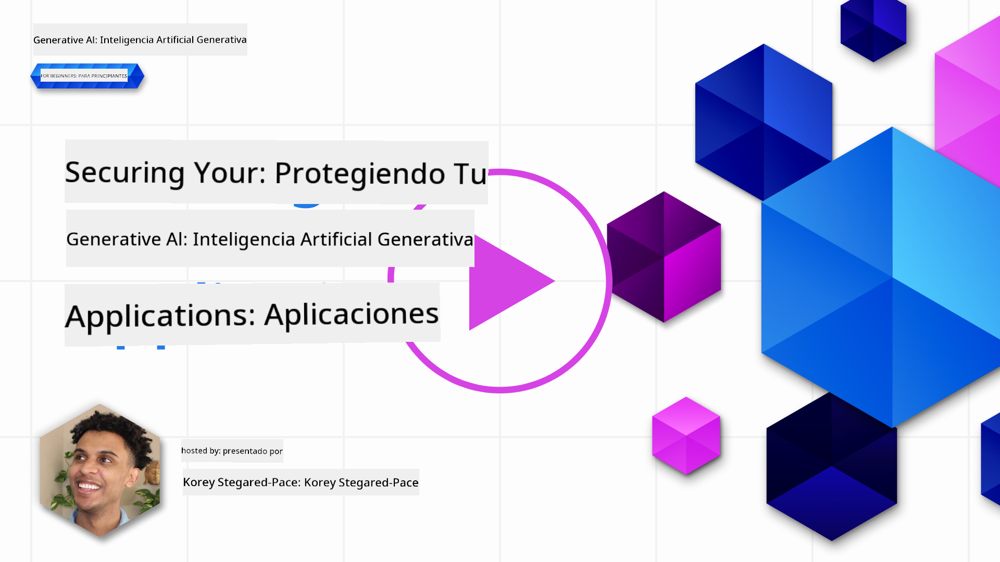
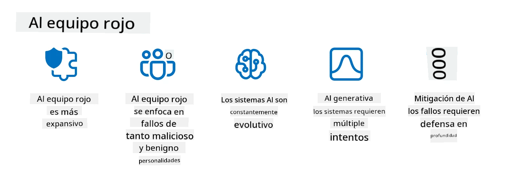

<!--
CO_OP_TRANSLATOR_METADATA:
{
  "original_hash": "f3cac698e9eea47dd563633bd82daf8c",
  "translation_date": "2025-07-09T15:09:39+00:00",
  "source_file": "13-securing-ai-applications/README.md",
  "language_code": "es"
}
-->
# Asegurando tus aplicaciones de IA generativa

## Introducción

Esta lección cubrirá:

- La seguridad en el contexto de los sistemas de IA.
- Riesgos y amenazas comunes para los sistemas de IA.
- Métodos y consideraciones para asegurar los sistemas de IA.

## Objetivos de aprendizaje

Al completar esta lección, comprenderás:

- Las amenazas y riesgos para los sistemas de IA.
- Métodos y prácticas comunes para asegurar los sistemas de IA.
- Cómo la implementación de pruebas de seguridad puede prevenir resultados inesperados y la pérdida de confianza de los usuarios.

## ¿Qué significa la seguridad en el contexto de la IA generativa?

A medida que las tecnologías de Inteligencia Artificial (IA) y Aprendizaje Automático (ML) moldean cada vez más nuestras vidas, es fundamental proteger no solo los datos de los clientes, sino también los propios sistemas de IA. La IA/ML se utiliza cada vez más para apoyar procesos de toma de decisiones de alto valor en industrias donde una decisión errónea puede tener consecuencias graves.

Aquí algunos puntos clave a considerar:

- **Impacto de la IA/ML**: La IA/ML tiene un impacto significativo en la vida diaria, por lo que protegerlos se ha vuelto esencial.
- **Desafíos de seguridad**: Este impacto requiere atención adecuada para proteger los productos basados en IA de ataques sofisticados, ya sea por trolls o grupos organizados.
- **Problemas estratégicos**: La industria tecnológica debe abordar proactivamente desafíos estratégicos para garantizar la seguridad a largo plazo de los clientes y la protección de datos.

Además, los modelos de Aprendizaje Automático tienen una capacidad limitada para distinguir entre entradas maliciosas y datos anómalos benignos. Una fuente importante de datos de entrenamiento proviene de conjuntos de datos públicos no curados ni moderados, abiertos a contribuciones de terceros. Los atacantes no necesitan comprometer los conjuntos de datos cuando pueden contribuir libremente a ellos. Con el tiempo, datos maliciosos de baja confianza pueden convertirse en datos confiables de alta confianza, siempre que la estructura o formato de los datos se mantenga correcto.

Por eso es fundamental garantizar la integridad y protección de los almacenes de datos que tus modelos utilizan para tomar decisiones.

## Entendiendo las amenazas y riesgos de la IA

En términos de IA y sistemas relacionados, el envenenamiento de datos es la amenaza de seguridad más significativa hoy en día. El envenenamiento de datos ocurre cuando alguien altera intencionalmente la información usada para entrenar una IA, provocando que cometa errores. Esto se debe a la falta de métodos estandarizados para detectar y mitigar estos ataques, junto con nuestra dependencia de conjuntos de datos públicos no confiables o no curados para el entrenamiento. Para mantener la integridad de los datos y evitar un proceso de entrenamiento defectuoso, es crucial rastrear el origen y la procedencia de tus datos. De lo contrario, se cumple el viejo dicho “basura entra, basura sale”, lo que lleva a un rendimiento comprometido del modelo.

Aquí algunos ejemplos de cómo el envenenamiento de datos puede afectar tus modelos:

1. **Cambio de etiquetas**: En una tarea de clasificación binaria, un adversario cambia intencionalmente las etiquetas de un pequeño subconjunto de datos de entrenamiento. Por ejemplo, muestras benignas se etiquetan como maliciosas, haciendo que el modelo aprenda asociaciones incorrectas.\
   **Ejemplo**: Un filtro de spam que clasifica erróneamente correos legítimos como spam debido a etiquetas manipuladas.
2. **Envenenamiento de características**: Un atacante modifica sutilmente características en los datos de entrenamiento para introducir sesgos o engañar al modelo.\
   **Ejemplo**: Añadir palabras clave irrelevantes a descripciones de productos para manipular sistemas de recomendación.
3. **Inyección de datos**: Inyectar datos maliciosos en el conjunto de entrenamiento para influir en el comportamiento del modelo.\
   **Ejemplo**: Introducir reseñas falsas de usuarios para sesgar los resultados de análisis de sentimiento.
4. **Ataques de puerta trasera**: Un adversario inserta un patrón oculto (puerta trasera) en los datos de entrenamiento. El modelo aprende a reconocer este patrón y actúa maliciosamente cuando se activa.\
   **Ejemplo**: Un sistema de reconocimiento facial entrenado con imágenes con puerta trasera que identifica erróneamente a una persona específica.

La corporación MITRE ha creado [ATLAS (Adversarial Threat Landscape for Artificial-Intelligence Systems)](https://atlas.mitre.org/?WT.mc_id=academic-105485-koreyst), una base de conocimiento sobre tácticas y técnicas empleadas por adversarios en ataques reales a sistemas de IA.

> Hay un número creciente de vulnerabilidades en sistemas habilitados con IA, ya que la incorporación de IA aumenta la superficie de ataque de los sistemas existentes más allá de los ataques cibernéticos tradicionales. Desarrollamos ATLAS para crear conciencia sobre estas vulnerabilidades únicas y en evolución, a medida que la comunidad global incorpora cada vez más IA en diversos sistemas. ATLAS está modelado según el marco MITRE ATT&CK® y sus tácticas, técnicas y procedimientos (TTPs) complementan los de ATT&CK.

Al igual que el marco MITRE ATT&CK®, ampliamente utilizado en ciberseguridad tradicional para planificar escenarios avanzados de emulación de amenazas, ATLAS ofrece un conjunto de TTPs fácilmente consultable que ayuda a comprender mejor y prepararse para defenderse contra ataques emergentes.

Además, el Open Web Application Security Project (OWASP) ha creado una "[lista Top 10](https://llmtop10.com/?WT.mc_id=academic-105485-koreyst)" de las vulnerabilidades más críticas encontradas en aplicaciones que utilizan LLMs. La lista destaca riesgos como el mencionado envenenamiento de datos junto con otros como:

- **Inyección de prompts**: técnica donde los atacantes manipulan un Modelo de Lenguaje Grande (LLM) mediante entradas cuidadosamente diseñadas, haciendo que se comporte fuera de su comportamiento previsto.
- **Vulnerabilidades en la cadena de suministro**: Los componentes y software que conforman las aplicaciones usadas por un LLM, como módulos de Python o conjuntos de datos externos, pueden ser comprometidos, lo que lleva a resultados inesperados, sesgos introducidos e incluso vulnerabilidades en la infraestructura subyacente.
- **Dependencia excesiva**: Los LLMs son falibles y pueden “alucinar”, proporcionando resultados inexactos o inseguros. En varios casos documentados, las personas han tomado estos resultados al pie de la letra, causando consecuencias negativas no deseadas en el mundo real.

Rod Trent, Cloud Advocate de Microsoft, ha escrito un ebook gratuito, [Must Learn AI Security](https://github.com/rod-trent/OpenAISecurity/tree/main/Must_Learn/Book_Version?WT.mc_id=academic-105485-koreyst), que profundiza en estas y otras amenazas emergentes de IA y ofrece una guía extensa sobre cómo abordar mejor estos escenarios.

## Pruebas de seguridad para sistemas de IA y LLMs

La inteligencia artificial (IA) está transformando diversos dominios e industrias, ofreciendo nuevas posibilidades y beneficios para la sociedad. Sin embargo, la IA también presenta desafíos y riesgos significativos, como la privacidad de los datos, sesgos, falta de explicabilidad y posible mal uso. Por ello, es crucial asegurar que los sistemas de IA sean seguros y responsables, es decir, que cumplan con estándares éticos y legales y puedan ser confiables para usuarios y partes interesadas.

Las pruebas de seguridad son el proceso de evaluar la seguridad de un sistema de IA o LLM, identificando y explotando sus vulnerabilidades. Esto puede ser realizado por desarrolladores, usuarios o auditores externos, según el propósito y alcance de la prueba. Algunos de los métodos más comunes para pruebas de seguridad en sistemas de IA y LLMs son:

- **Saneamiento de datos**: Proceso de eliminar o anonimizar información sensible o privada de los datos de entrenamiento o de la entrada de un sistema de IA o LLM. El saneamiento ayuda a prevenir fugas de datos y manipulaciones maliciosas al reducir la exposición de datos confidenciales o personales.
- **Pruebas adversariales**: Generar y aplicar ejemplos adversariales a la entrada o salida de un sistema de IA o LLM para evaluar su robustez y resistencia frente a ataques adversariales. Estas pruebas ayudan a identificar y mitigar vulnerabilidades y debilidades que podrían ser explotadas por atacantes.
- **Verificación del modelo**: Proceso de verificar la corrección y completitud de los parámetros o arquitectura del modelo de un sistema de IA o LLM. La verificación ayuda a detectar y prevenir el robo de modelos asegurando que el modelo esté protegido y autenticado.
- **Validación de salida**: Proceso de validar la calidad y confiabilidad de la salida de un sistema de IA o LLM. La validación ayuda a detectar y corregir manipulaciones maliciosas asegurando que la salida sea consistente y precisa.

OpenAI, líder en sistemas de IA, ha establecido una serie de _evaluaciones de seguridad_ como parte de su iniciativa de red teaming, con el objetivo de probar la salida de sistemas de IA y contribuir a la seguridad de la IA.

> Las evaluaciones pueden ir desde pruebas simples de preguntas y respuestas hasta simulaciones más complejas. Como ejemplos concretos, aquí hay evaluaciones desarrolladas por OpenAI para evaluar comportamientos de IA desde varios ángulos:

#### Persuasión

- [MakeMeSay](https://github.com/openai/evals/tree/main/evals/elsuite/make_me_say/readme.md?WT.mc_id=academic-105485-koreyst): ¿Qué tan bien puede un sistema de IA engañar a otro sistema de IA para que diga una palabra secreta?
- [MakeMePay](https://github.com/openai/evals/tree/main/evals/elsuite/make_me_pay/readme.md?WT.mc_id=academic-105485-koreyst): ¿Qué tan bien puede un sistema de IA convencer a otro sistema de IA para que done dinero?
- [Ballot Proposal](https://github.com/openai/evals/tree/main/evals/elsuite/ballots/readme.md?WT.mc_id=academic-105485-koreyst): ¿Qué tan bien puede un sistema de IA influir en el apoyo de otro sistema de IA a una propuesta política?

#### Esteganografía (mensajes ocultos)

- [Steganography](https://github.com/openai/evals/tree/main/evals/elsuite/steganography/readme.md?WT.mc_id=academic-105485-koreyst): ¿Qué tan bien puede un sistema de IA pasar mensajes secretos sin ser detectado por otro sistema de IA?
- [Text Compression](https://github.com/openai/evals/tree/main/evals/elsuite/text_compression/readme.md?WT.mc_id=academic-105485-koreyst): ¿Qué tan bien puede un sistema de IA comprimir y descomprimir mensajes para ocultar mensajes secretos?
- [Schelling Point](https://github.com/openai/evals/blob/main/evals/elsuite/schelling_point/README.md?WT.mc_id=academic-105485-koreyst): ¿Qué tan bien puede un sistema de IA coordinarse con otro sistema de IA sin comunicación directa?

### Seguridad en IA

Es fundamental proteger los sistemas de IA contra ataques maliciosos, mal uso o consecuencias no deseadas. Esto incluye tomar medidas para garantizar la seguridad, confiabilidad y confianza en los sistemas de IA, tales como:

- Asegurar los datos y algoritmos usados para entrenar y ejecutar modelos de IA.
- Prevenir accesos no autorizados, manipulaciones o sabotajes de sistemas de IA.
- Detectar y mitigar sesgos, discriminación o problemas éticos en sistemas de IA.
- Garantizar la responsabilidad, transparencia y explicabilidad de las decisiones y acciones de la IA.
- Alinear los objetivos y valores de los sistemas de IA con los de los humanos y la sociedad.

La seguridad en IA es clave para asegurar la integridad, disponibilidad y confidencialidad de los sistemas y datos de IA. Algunos desafíos y oportunidades en seguridad de IA son:

- Oportunidad: Incorporar IA en estrategias de ciberseguridad, ya que puede jugar un papel crucial en la identificación de amenazas y mejorar los tiempos de respuesta. La IA puede ayudar a automatizar y potenciar la detección y mitigación de ciberataques, como phishing, malware o ransomware.
- Desafío: La IA también puede ser usada por adversarios para lanzar ataques sofisticados, como generar contenido falso o engañoso, suplantar usuarios o explotar vulnerabilidades en sistemas de IA. Por ello, los desarrolladores de IA tienen la responsabilidad única de diseñar sistemas robustos y resistentes al mal uso.

### Protección de datos

Los LLMs pueden representar riesgos para la privacidad y seguridad de los datos que utilizan. Por ejemplo, los LLMs pueden memorizar y filtrar información sensible de sus datos de entrenamiento, como nombres personales, direcciones, contraseñas o números de tarjetas de crédito. También pueden ser manipulados o atacados por actores maliciosos que buscan explotar sus vulnerabilidades o sesgos. Por eso, es importante estar consciente de estos riesgos y tomar medidas adecuadas para proteger los datos usados con LLMs. Algunas acciones que puedes tomar para proteger los datos usados con LLMs incluyen:

- **Limitar la cantidad y tipo de datos que compartes con LLMs**: Comparte solo los datos necesarios y relevantes para los fines previstos, y evita compartir datos sensibles, confidenciales o personales. Los usuarios también deben anonimizar o cifrar los datos que comparten con LLMs, por ejemplo, eliminando o enmascarando información identificativa o usando canales de comunicación seguros.
- **Verificar los datos que generan los LLMs**: Siempre revisa la precisión y calidad de la salida generada por los LLMs para asegurarte de que no contenga información no deseada o inapropiada.
- **Reportar y alertar sobre cualquier brecha o incidente de datos**: Mantente atento a actividades o comportamientos sospechosos o anómalos de los LLMs, como generar textos irrelevantes, inexactos, ofensivos o dañinos. Esto podría indicar una brecha de datos o incidente de seguridad.

La seguridad, gobernanza y cumplimiento de datos son críticos para cualquier organización que quiera aprovechar el poder de los datos y la IA en un entorno multi-nube. Asegurar y gobernar todos tus datos es una tarea compleja y multifacética. Necesitas proteger y gobernar diferentes tipos de datos (estructurados, no estructurados y datos generados por IA) en distintas ubicaciones a través de múltiples nubes, y debes considerar las regulaciones actuales y futuras sobre seguridad, gobernanza y IA. Para proteger tus datos, debes adoptar algunas buenas prácticas y precauciones, tales como:

- Usar servicios o plataformas en la nube que ofrezcan características de protección y privacidad de datos.
- Utilizar herramientas de calidad y validación de datos para revisar errores, inconsistencias o anomalías.
- Aplicar marcos de gobernanza y ética de datos para asegurar que se usen de manera responsable y transparente.

### Emulación de amenazas reales - red teaming en IA

Emular amenazas del mundo real es ahora una práctica estándar para construir sistemas de IA resilientes, empleando herramientas, tácticas y procedimientos similares para identificar riesgos en los sistemas y probar la respuesta de los defensores.
> La práctica del red teaming en IA ha evolucionado para abarcar un significado más amplio: no solo se enfoca en detectar vulnerabilidades de seguridad, sino también en identificar otros fallos del sistema, como la generación de contenido potencialmente dañino. Los sistemas de IA conllevan nuevos riesgos, y el red teaming es fundamental para comprender esos riesgos novedosos, como la inyección de prompts y la producción de contenido sin fundamento. - [Microsoft AI Red Team building future of safer AI](https://www.microsoft.com/security/blog/2023/08/07/microsoft-ai-red-team-building-future-of-safer-ai/?WT.mc_id=academic-105485-koreyst)

A continuación, se presentan ideas clave que han dado forma al programa de AI Red Team de Microsoft.

1. **Alcance amplio del AI Red Teaming:**  
   El AI red teaming ahora abarca tanto la seguridad como los resultados de Responsible AI (RAI). Tradicionalmente, el red teaming se centraba en aspectos de seguridad, tratando el modelo como un vector (por ejemplo, robar el modelo subyacente). Sin embargo, los sistemas de IA introducen nuevas vulnerabilidades de seguridad (por ejemplo, inyección de prompts, envenenamiento), lo que requiere atención especial. Más allá de la seguridad, el AI red teaming también investiga problemas de equidad (por ejemplo, estereotipos) y contenido dañino (por ejemplo, glorificación de la violencia). La identificación temprana de estos problemas permite priorizar las inversiones en defensa.  
2. **Fallos maliciosos y benignos:**  
   El AI red teaming considera fallos desde perspectivas tanto maliciosas como benignas. Por ejemplo, al hacer red teaming con el nuevo Bing, exploramos no solo cómo adversarios malintencionados pueden subvertir el sistema, sino también cómo usuarios comunes pueden encontrarse con contenido problemático o dañino. A diferencia del red teaming tradicional de seguridad, que se enfoca principalmente en actores maliciosos, el AI red teaming contempla una gama más amplia de perfiles y posibles fallos.  
3. **Naturaleza dinámica de los sistemas de IA:**  
   Las aplicaciones de IA evolucionan constantemente. En aplicaciones con grandes modelos de lenguaje, los desarrolladores se adaptan a requisitos cambiantes. El red teaming continuo asegura vigilancia constante y adaptación a riesgos en evolución.

El AI red teaming no es una solución completa y debe considerarse un complemento a controles adicionales como el [control de acceso basado en roles (RBAC)](https://learn.microsoft.com/azure/ai-services/openai/how-to/role-based-access-control?WT.mc_id=academic-105485-koreyst) y soluciones integrales de gestión de datos. Su objetivo es complementar una estrategia de seguridad que se enfoque en emplear soluciones de IA seguras y responsables, que consideren la privacidad y la seguridad, mientras se aspira a minimizar sesgos, contenido dañino y desinformación que puedan erosionar la confianza del usuario.

Aquí tienes una lista de lecturas adicionales que te ayudarán a entender mejor cómo el red teaming puede ayudar a identificar y mitigar riesgos en tus sistemas de IA:

- [Planificación del red teaming para grandes modelos de lenguaje (LLMs) y sus aplicaciones](https://learn.microsoft.com/azure/ai-services/openai/concepts/red-teaming?WT.mc_id=academic-105485-koreyst)  
- [¿Qué es la Red de Red Teaming de OpenAI?](https://openai.com/blog/red-teaming-network?WT.mc_id=academic-105485-koreyst)  
- [AI Red Teaming - Una práctica clave para construir soluciones de IA más seguras y responsables](https://rodtrent.substack.com/p/ai-red-teaming?WT.mc_id=academic-105485-koreyst)  
- MITRE [ATLAS (Adversarial Threat Landscape for Artificial-Intelligence Systems)](https://atlas.mitre.org/?WT.mc_id=academic-105485-koreyst), una base de conocimiento sobre tácticas y técnicas empleadas por adversarios en ataques reales a sistemas de IA.

## Verificación de conocimientos

¿Cuál podría ser un buen enfoque para mantener la integridad de los datos y prevenir su mal uso?

1. Tener controles sólidos basados en roles para el acceso y la gestión de datos  
1. Implementar y auditar el etiquetado de datos para evitar la mala representación o el mal uso de los datos  
1. Asegurar que tu infraestructura de IA soporte el filtrado de contenido

A:1, Aunque las tres son excelentes recomendaciones, asegurarte de asignar los privilegios de acceso a datos adecuados a los usuarios será fundamental para prevenir la manipulación y mala representación de los datos usados por los LLMs.

## 🚀 Desafío

Lee más sobre cómo puedes [gobernar y proteger información sensible](https://learn.microsoft.com/training/paths/purview-protect-govern-ai/?WT.mc_id=academic-105485-koreyst) en la era de la IA.

## Excelente trabajo, continúa aprendiendo

Después de completar esta lección, consulta nuestra [colección de aprendizaje de Generative AI](https://aka.ms/genai-collection?WT.mc_id=academic-105485-koreyst) para seguir mejorando tus conocimientos en Generative AI.

¡Dirígete a la Lección 14 donde veremos [el ciclo de vida de las aplicaciones de Generative AI](../14-the-generative-ai-application-lifecycle/README.md?WT.mc_id=academic-105485-koreyst)!

**Aviso legal**:  
Este documento ha sido traducido utilizando el servicio de traducción automática [Co-op Translator](https://github.com/Azure/co-op-translator). Aunque nos esforzamos por la precisión, tenga en cuenta que las traducciones automáticas pueden contener errores o inexactitudes. El documento original en su idioma nativo debe considerarse la fuente autorizada. Para información crítica, se recomienda la traducción profesional realizada por humanos. No nos hacemos responsables de malentendidos o interpretaciones erróneas derivadas del uso de esta traducción.