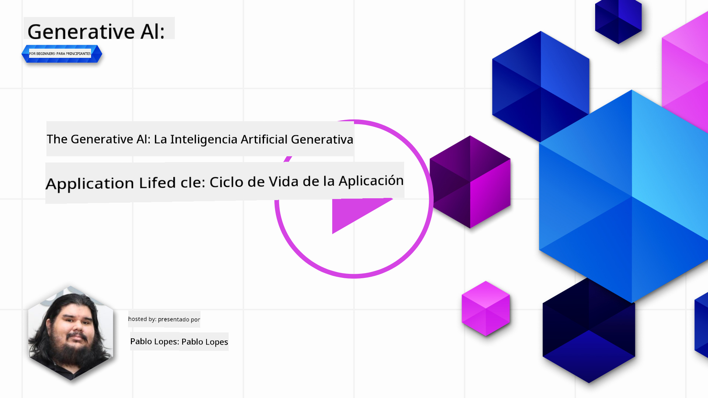
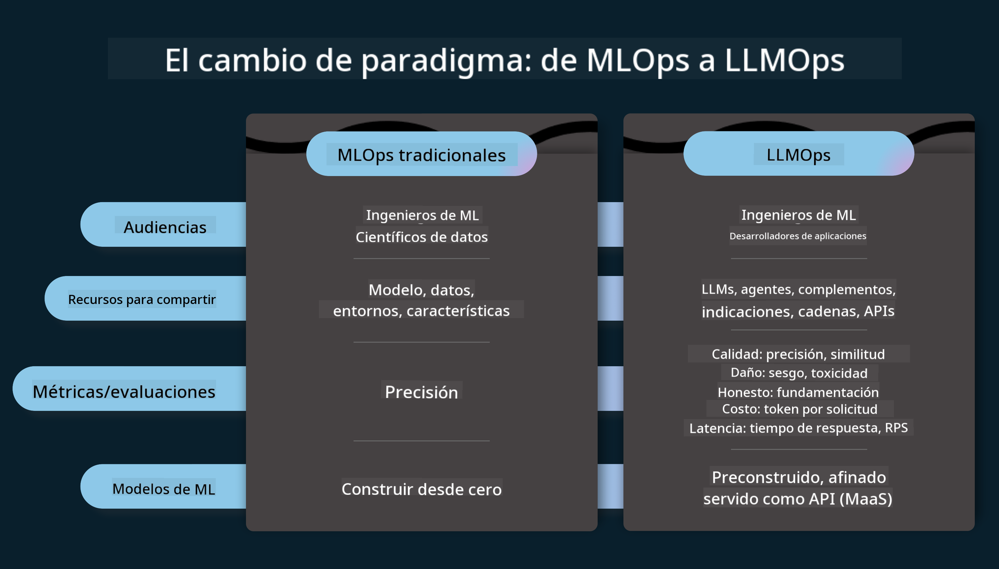
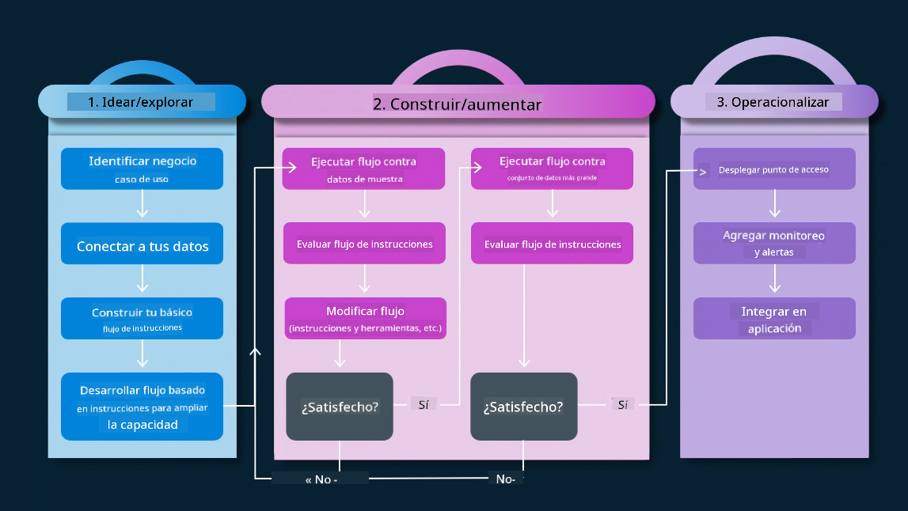

<!--
CO_OP_TRANSLATOR_METADATA:
{
  "original_hash": "27a5347a5022d5ef0a72ab029b03526a",
  "translation_date": "2025-05-19T23:18:22+00:00",
  "source_file": "14-the-generative-ai-application-lifecycle/README.md",
  "language_code": "es"
}
-->

# El Ciclo de Vida de la Aplicación de IA Generativa

Una pregunta importante para todas las aplicaciones de IA es la relevancia de las características de IA, ya que es un campo que evoluciona rápidamente. Para asegurar que tu aplicación permanezca relevante, confiable y robusta, necesitas monitorearla, evaluarla y mejorarla continuamente. Aquí es donde entra el ciclo de vida de la IA generativa.

El ciclo de vida de la IA generativa es un marco que te guía a través de las etapas de desarrollo, implementación y mantenimiento de una aplicación de IA generativa. Te ayuda a definir tus objetivos, medir tu rendimiento, identificar tus desafíos e implementar tus soluciones. También te ayuda a alinear tu aplicación con los estándares éticos y legales de tu dominio y tus partes interesadas. Siguiendo el ciclo de vida de la IA generativa, puedes asegurar que tu aplicación siempre esté aportando valor y satisfaciendo a tus usuarios.

## Introducción

En este capítulo, tú:

- Comprenderás el Cambio de Paradigma de MLOps a LLMOps
- El Ciclo de Vida de LLM
- Herramientas para el Ciclo de Vida
- Metrificación y Evaluación del Ciclo de Vida

## Comprender el Cambio de Paradigma de MLOps a LLMOps

Los LLMs son una nueva herramienta en el arsenal de la Inteligencia Artificial, son increíblemente poderosos en tareas de análisis y generación para aplicaciones, sin embargo, este poder tiene algunas consecuencias en cómo optimizamos las tareas de IA y Aprendizaje Automático Clásico.

Con esto, necesitamos un nuevo paradigma para adaptar esta herramienta de manera dinámica, con los incentivos correctos. Podemos categorizar las aplicaciones de IA antiguas como "Apps de ML" y las aplicaciones de IA más recientes como "Apps de GenAI" o simplemente "Apps de IA", reflejando la tecnología y técnicas predominantes utilizadas en ese momento. Esto cambia nuestra narrativa de múltiples maneras, observa la siguiente comparación.

Observa que en LLMOps, estamos más enfocados en los desarrolladores de aplicaciones, usando integraciones como un punto clave, utilizando "Modelos como Servicio" y pensando en los siguientes puntos para métricas.

- Calidad: Calidad de la respuesta
- Daño: IA responsable
- Honestidad: Fundamentación de la respuesta (¿Tiene sentido? ¿Es correcta?)
- Costo: Presupuesto de la solución
- Latencia: Tiempo promedio para la respuesta de token

## El Ciclo de Vida de LLM

Primero, para entender el ciclo de vida y las modificaciones, observemos la siguiente infografía.

Como puedes notar, esto es diferente de los ciclos de vida habituales de MLOps. Los LLMs tienen muchos nuevos requisitos, como el Prompting, diferentes técnicas para mejorar la calidad (Fine-Tuning, RAG, Meta-Prompts), diferente evaluación y responsabilidad con IA responsable, y finalmente, nuevas métricas de evaluación (Calidad, Daño, Honestidad, Costo y Latencia).

Por ejemplo, observa cómo ideamos. Usando ingeniería de prompts para experimentar con varios LLMs para explorar posibilidades y probar si su hipótesis podría ser correcta.

Nota que esto no es lineal, sino bucles integrados, iterativos y con un ciclo general.

¿Cómo podríamos explorar esos pasos? Entremos en detalle en cómo podríamos construir un ciclo de vida.

Esto puede parecer un poco complicado, enfoquémonos en los tres grandes pasos primero.

1. Idear/Explorar: Exploración, aquí podemos explorar según nuestras necesidades comerciales. Prototipado, creando un [PromptFlow](https://microsoft.github.io/promptflow/index.html?WT.mc_id=academic-105485-koreyst) y probar si es lo suficientemente eficiente para nuestra hipótesis.
2. Construir/Aumentar: Implementación, ahora comenzamos a evaluar para conjuntos de datos más grandes implementar técnicas, como Fine-tuning y RAG, para verificar la robustez de nuestra solución. Si no lo hace, reimplementarlo, agregando nuevos pasos en nuestro flujo o reestructurando los datos, podría ayudar. Después de probar nuestro flujo y nuestra escala, si funciona y verificamos nuestras métricas, está listo para el siguiente paso.
3. Operacionalizar: Integración, ahora agregando sistemas de monitoreo y alertas a nuestro sistema, implementación e integración de la aplicación a nuestra aplicación.

Luego, tenemos el ciclo general de Gestión, enfocado en seguridad, cumplimiento y gobernanza.

¡Felicitaciones, ahora tienes tu App de IA lista para funcionar y operativa! Para una experiencia práctica, echa un vistazo al [Demo de Chat de Contoso.](https://nitya.github.io/contoso-chat/?WT.mc_id=academic-105485-koreys)

Ahora, ¿qué herramientas podríamos usar?

## Herramientas para el Ciclo de Vida

Para las herramientas, Microsoft proporciona la [Plataforma de IA de Azure](https://azure.microsoft.com/solutions/ai/?WT.mc_id=academic-105485-koreys) y [PromptFlow](https://microsoft.github.io/promptflow/index.html?WT.mc_id=academic-105485-koreyst) para facilitar y hacer que tu ciclo sea fácil de implementar y listo para funcionar.

La [Plataforma de IA de Azure](https://azure.microsoft.com/solutions/ai/?WT.mc_id=academic-105485-koreys) te permite usar [AI Studio](https://ai.azure.com/?WT.mc_id=academic-105485-koreys). AI Studio es un portal web que te permite explorar modelos, muestras y herramientas. Gestionar tus recursos, flujos de desarrollo de UI y opciones de SDK/CLI para desarrollo centrado en código.

Azure AI te permite usar múltiples recursos para gestionar tus operaciones, servicios, proyectos, necesidades de búsqueda vectorial y bases de datos.

Construye, desde Prueba de Concepto (POC) hasta aplicaciones a gran escala con PromptFlow:

- Diseña y construye aplicaciones desde VS Code, con herramientas visuales y funcionales
- Prueba y ajusta tus aplicaciones para calidad de IA, con facilidad.
- Usa Azure AI Studio para integrar e iterar con la nube, empujar e implementar para una integración rápida.

## ¡Genial! Continúa tu aprendizaje

Increíble, ahora aprende más sobre cómo estructuramos una aplicación para usar los conceptos con la [App de Chat de Contoso](https://nitya.github.io/contoso-chat/?WT.mc_id=academic-105485-koreyst), para ver cómo Cloud Advocacy agrega esos conceptos en demostraciones. Para más contenido, consulta nuestra [sesión de Ignite!
](https://www.youtube.com/watch?v=DdOylyrTOWg)

Ahora, consulta la Lección 15, para entender cómo [Generación Aumentada por Recuperación y Bases de Datos Vectoriales](../15-rag-and-vector-databases/README.md?WT.mc_id=academic-105485-koreyst) impactan la IA Generativa y para hacer aplicaciones más atractivas.

**Descargo de responsabilidad**:  
Este documento ha sido traducido utilizando el servicio de traducción automática [Co-op Translator](https://github.com/Azure/co-op-translator). Si bien nos esforzamos por lograr precisión, tenga en cuenta que las traducciones automáticas pueden contener errores o imprecisiones. El documento original en su idioma nativo debe considerarse la fuente autorizada. Para información crítica, se recomienda la traducción profesional humana. No nos hacemos responsables de ningún malentendido o interpretación errónea que surja del uso de esta traducción.