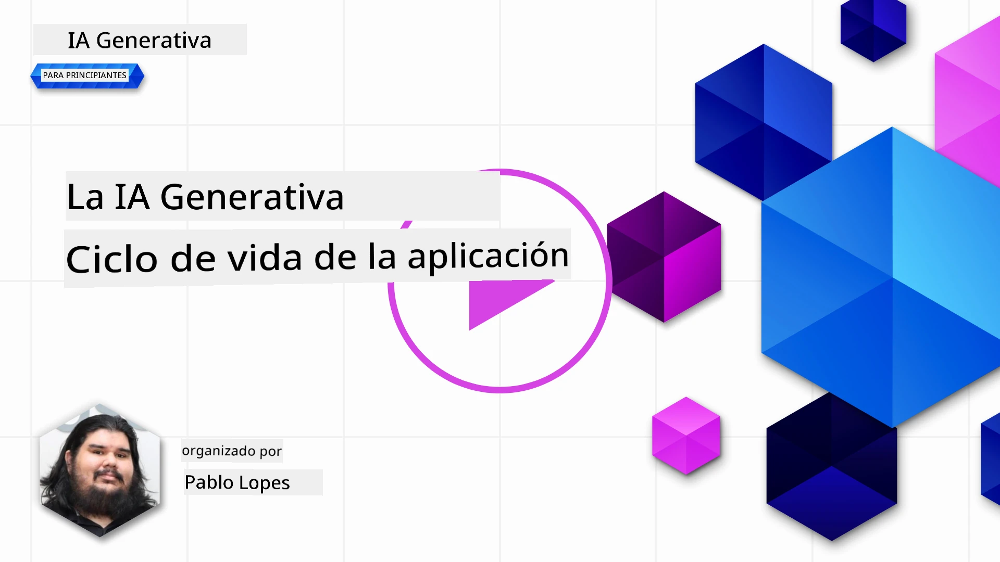
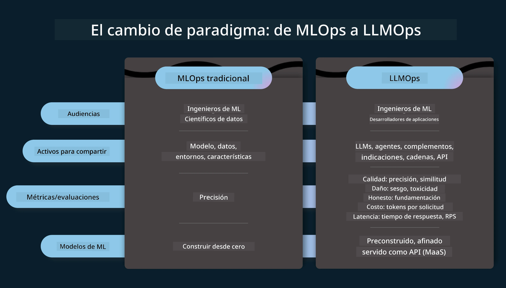
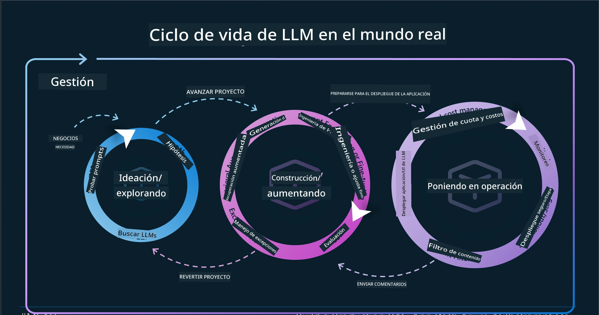
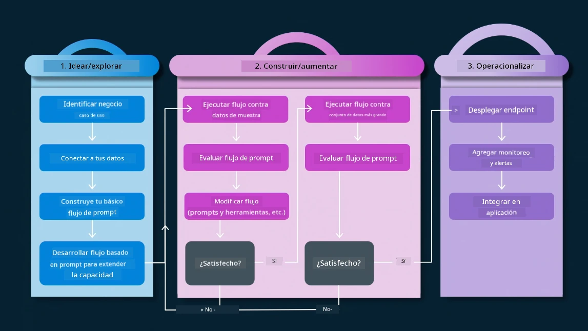
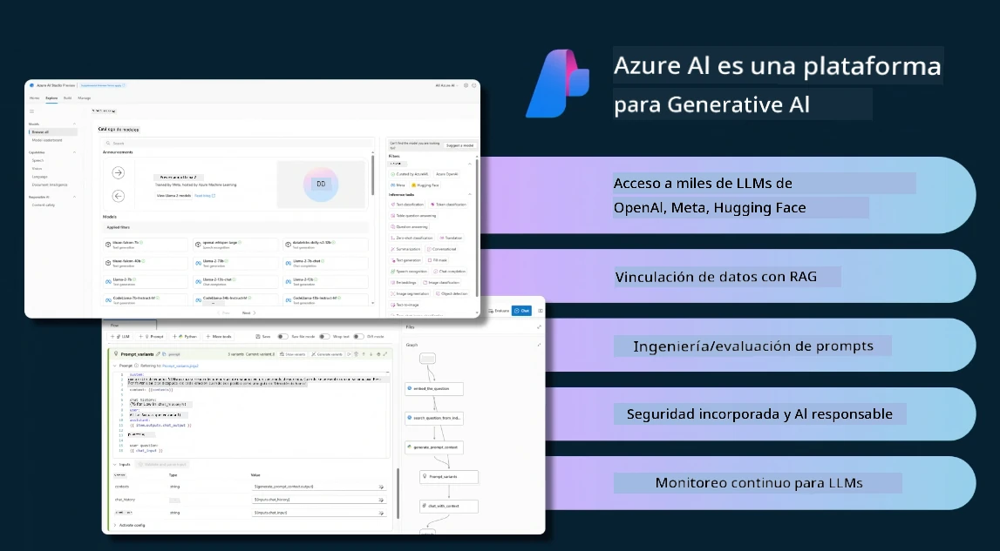
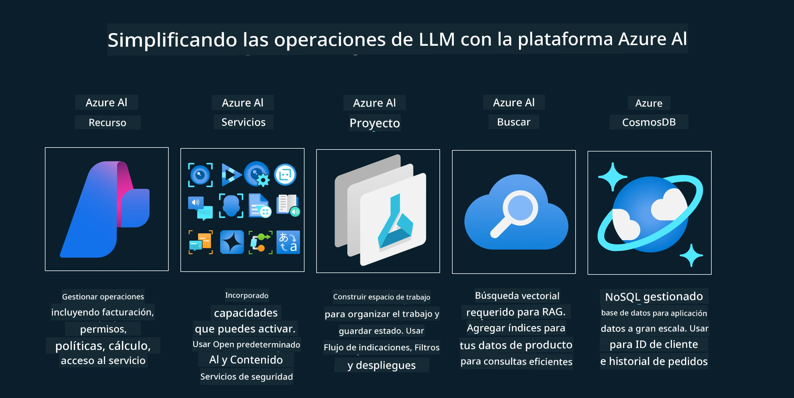
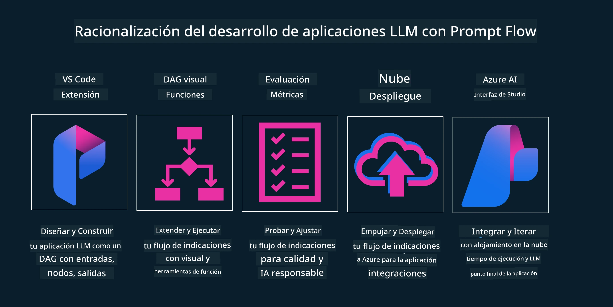

# El Ciclo de Vida de las Aplicaciones de IA Generativa

Una pregunta importante para todas las aplicaciones de IA es la relevancia de las características de IA, ya que la IA es un campo en rápida evolución; para asegurar que tu aplicación siga siendo relevante, confiable y robusta, necesitas monitorearla, evaluarla y mejorarla continuamente. Aquí es donde entra el ciclo de vida de la IA generativa.

El ciclo de vida de la IA generativa es un marco que te guía a través de las etapas de desarrollo, implementación y mantenimiento de una aplicación de IA generativa. Te ayuda a definir tus objetivos, medir tu desempeño, identificar tus desafíos e implementar tus soluciones. También te ayuda a alinear tu aplicación con los estándares éticos y legales de tu dominio y tus partes interesadas. Siguiendo el ciclo de vida de la IA generativa, puedes asegurarte de que tu aplicación siempre está entregando valor y satisfaciendo a tus usuarios.

## Introducción

En este capítulo, aprenderás:

- Entender el Cambio de Paradigma de MLOps a LLMOps
- El Ciclo de Vida de LLM
- Herramientas para el Ciclo de Vida
- Métricas y Evaluación del Ciclo de Vida

## Entender el Cambio de Paradigma de MLOps a LLMOps

Los LLMs son una nueva herramienta en el arsenal de la Inteligencia Artificial, son increíblemente poderosos en tareas de análisis y generación para aplicaciones, sin embargo, este poder tiene algunas consecuencias en cómo simplificamos las tareas de IA y Aprendizaje Automático Clásico.

Con esto, necesitamos un nuevo paradigma para adaptar esta herramienta de forma dinámica, con los incentivos correctos. Podemos categorizar las aplicaciones de IA antiguas como "Apps de ML" y las aplicaciones nuevas de IA como "Apps de GenAI" o simplemente "Apps de IA", reflejando la tecnología y técnicas predominantes usadas en ese momento. Esto cambia nuestra narrativa en múltiples formas, observa la siguiente comparación.

Observa que en LLMOps, estamos más enfocados en los desarrolladores de aplicaciones, usando integraciones como punto clave, utilizando "Modelos-como-servicio" y pensando en los siguientes puntos para métricas.

- Calidad: Calidad de la respuesta
- Daño: IA Responsable
- Honestidad: Fundamento de la respuesta (¿Tiene sentido? ¿Es correcta?)
- Costo: Presupuesto de la solución
- Latencia: Tiempo promedio para respuesta por token

## El Ciclo de Vida de LLM

Primero, para entender el ciclo de vida y las modificaciones, observemos la siguiente infografía.

Como puedes notar, esto es diferente a los ciclos de vida usuales de MLOps. Los LLMs tienen muchos nuevos requisitos, como Prompting, diferentes técnicas para mejorar la calidad (Fine-Tuning, RAG, Meta-Prompts), diferentes evaluaciones y responsabilidad con IA responsable, y finalmente, nuevas métricas de evaluación (Calidad, Daño, Honestidad, Costo y Latencia).

Por ejemplo, observa cómo ideamos. Usando ingeniería de prompts para experimentar con varios LLMs y explorar posibilidades para probar si su hipótesis podría ser correcta.

Nota que esto no es lineal, sino ciclos integrados, iterativos y con un ciclo general.

¿Cómo podríamos explorar esos pasos? Profundicemos en cómo podríamos construir un ciclo de vida.

Esto puede parecer un poco complicado, centrémonos primero en los tres grandes pasos.

1. Idear/Explorar: Exploración, aquí podemos explorar según nuestras necesidades de negocio. Prototipar, crear un [PromptFlow](https://microsoft.github.io/promptflow/index.html?WT.mc_id=academic-105485-koreyst) y probar si es lo suficientemente eficiente para nuestra hipótesis.
1. Construir/Aumentar: Implementación, ahora comenzamos a evaluar con conjuntos de datos más grandes e implementamos técnicas, como Fine-tuning y RAG, para comprobar la robustez de nuestra solución. Si no funciona, reimplementarla, agregar nuevos pasos en nuestro flujo o reestructurar los datos puede ayudar. Después de probar nuestro flujo y nuestra escala, si funciona y comprueba nuestras métricas, está listo para el siguiente paso.
1. Operacionalizar: Integración, ahora añadiendo sistemas de monitoreo y alertas a nuestro sistema, implementación e integración de la aplicación a nuestra aplicación.

Luego, tenemos el ciclo general de Gestión, enfocado en seguridad, cumplimiento y gobernanza.

Felicidades, ahora tienes tu aplicación de IA lista para funcionar y operativa. Para una experiencia práctica, echa un vistazo a la [Demostración de Contoso Chat.](https://nitya.github.io/contoso-chat/?WT.mc_id=academic-105485-koreyst)

Ahora, ¿qué herramientas podríamos usar?

## Herramientas para el Ciclo de Vida

Para herramientas, Microsoft proporciona la [Plataforma Azure AI](https://azure.microsoft.com/solutions/ai/?WT.mc_id=academic-105485-koreyst) y [PromptFlow](https://microsoft.github.io/promptflow/index.html?WT.mc_id=academic-105485-koreyst) que facilitan y hacen que tu ciclo sea fácil de implementar y listo para usar.

La [Plataforma Azure AI](https://azure.microsoft.com/solutions/ai/?WT.mc_id=academic-105485-koreyst), te permite usar [AI Studio](https://ai.azure.com/?WT.mc_id=academic-105485-koreyst). AI Studio es un portal web que te permite explorar modelos, muestras y herramientas. Administrar tus recursos, flujos de desarrollo UI y opciones SDK/CLI para desarrollo Code-First.

Azure AI te permite usar múltiples recursos para gestionar tus operaciones, servicios, proyectos, búsqueda vectorial y necesidades de bases de datos.

Construye, desde la Prueba de Concepto (POC) hasta aplicaciones a gran escala con PromptFlow:

- Diseña y construye aplicaciones desde VS Code, con herramientas visuales y funcionales
- Prueba y afina tus aplicaciones para IA de calidad, con facilidad.
- Usa Azure AI Studio para integrar e iterar con la nube, hacer push y desplegar para una integración rápida.

## ¡Genial! ¡Continúa tu aprendizaje!

Increíble, ahora aprende más sobre cómo estructuramos una aplicación para usar los conceptos con la [Aplicación Contoso Chat](https://nitya.github.io/contoso-chat/?WT.mc_id=academic-105485-koreyst), para ver cómo Cloud Advocacy añade esos conceptos en demostraciones. Para más contenido, revisa nuestra [sesión de Ignite!](https://www.youtube.com/watch?v=DdOylyrTOWg)

Ahora, revisa la Lección 15, para entender cómo [Retrieval Augmented Generation y bases de datos vectoriales](../15-rag-and-vector-databases/README.md?WT.mc_id=academic-105485-koreyst) impactan la IA generativa y para crear aplicaciones más atractivas!

---

<!-- CO-OP TRANSLATOR DISCLAIMER START -->
**Descargo de responsabilidad**:
Este documento ha sido traducido utilizando el servicio de traducción automática [Co-op Translator](https://github.com/Azure/co-op-translator). Aunque nos esforzamos por lograr precisión, tenga en cuenta que las traducciones automáticas pueden contener errores o inexactitudes. El documento original en su idioma nativo debe considerarse la fuente autorizada. Para información crítica, se recomienda una traducción profesional realizada por humanos. No nos hacemos responsables por malentendidos o interpretaciones erróneas derivadas del uso de esta traducción.
<!-- CO-OP TRANSLATOR DISCLAIMER END -->