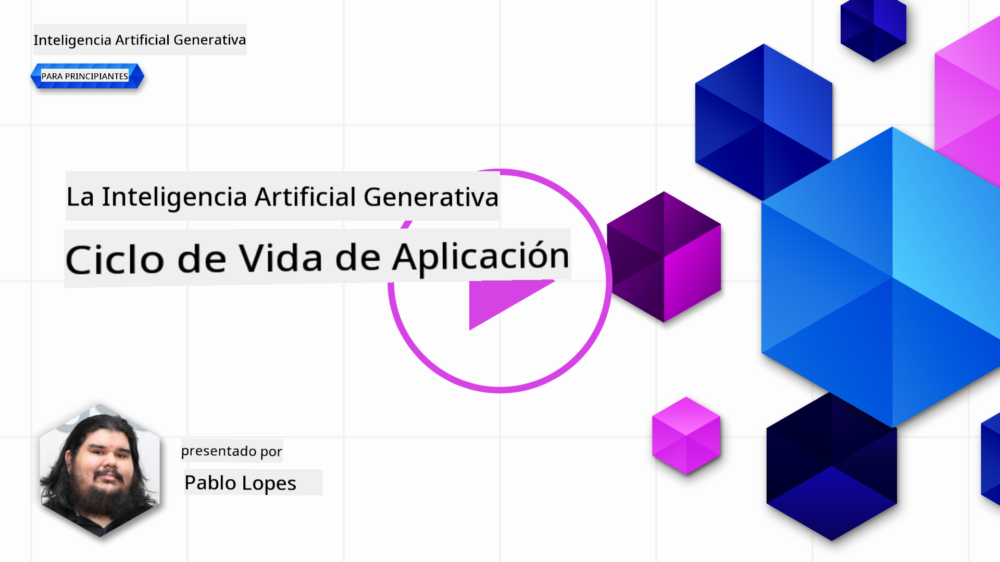
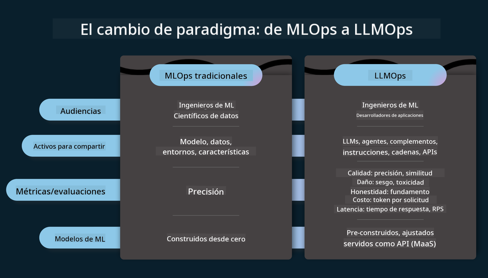
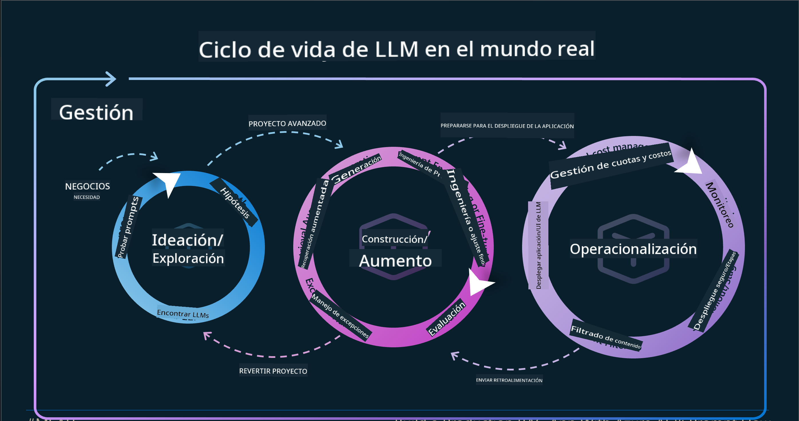
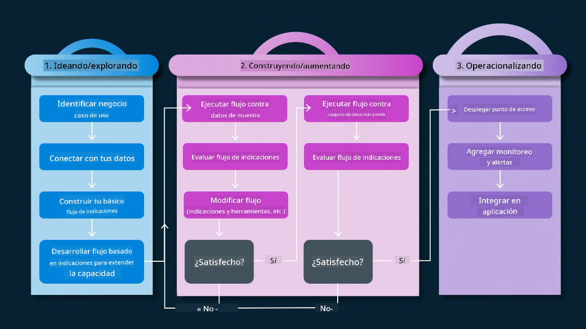
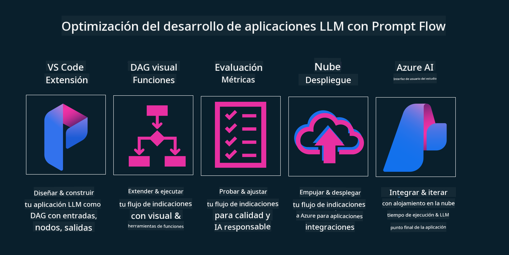

<!--
CO_OP_TRANSLATOR_METADATA:
{
  "original_hash": "27a5347a5022d5ef0a72ab029b03526a",
  "translation_date": "2025-06-25T21:53:50+00:00",
  "source_file": "14-the-generative-ai-application-lifecycle/README.md",
  "language_code": "es"
}
-->

# El Ciclo de Vida de las Aplicaciones de IA Generativa

Una pregunta importante para todas las aplicaciones de IA es la relevancia de las características de IA, ya que es un campo en rápida evolución. Para asegurar que tu aplicación siga siendo relevante, confiable y robusta, necesitas monitorearla, evaluarla y mejorarla continuamente. Aquí es donde entra en juego el ciclo de vida de la IA generativa.

El ciclo de vida de la IA generativa es un marco que te guía a través de las etapas de desarrollo, implementación y mantenimiento de una aplicación de IA generativa. Te ayuda a definir tus objetivos, medir tu desempeño, identificar tus desafíos e implementar tus soluciones. También te ayuda a alinear tu aplicación con los estándares éticos y legales de tu dominio y tus interesados. Siguiendo el ciclo de vida de la IA generativa, puedes asegurarte de que tu aplicación siempre esté entregando valor y satisfaciendo a tus usuarios.

## Introducción

En este capítulo, vas a:

- Comprender el Cambio de Paradigma de MLOps a LLMOps
- El Ciclo de Vida de LLM
- Herramientas del Ciclo de Vida
- Metrificación y Evaluación del Ciclo de Vida

## Comprender el Cambio de Paradigma de MLOps a LLMOps

Los LLMs son una nueva herramienta en el arsenal de la Inteligencia Artificial, son increíblemente poderosos en tareas de análisis y generación para aplicaciones, sin embargo, este poder tiene algunas consecuencias en cómo optimizamos tareas de IA y Aprendizaje Automático Clásico.

Con esto, necesitamos un nuevo Paradigma para adaptar esta herramienta de manera dinámica, con los incentivos correctos. Podemos categorizar las aplicaciones de IA antiguas como "Aplicaciones de ML" y las aplicaciones de IA más nuevas como "Aplicaciones GenAI" o simplemente "Aplicaciones de IA", reflejando la tecnología y técnicas principales utilizadas en ese momento. Esto cambia nuestra narrativa de múltiples maneras, observa la siguiente comparación.

Nota que en LLMOps, nos enfocamos más en los Desarrolladores de Aplicaciones, usando integraciones como un punto clave, utilizando "Modelos-como-Servicio" y pensando en los siguientes puntos para las métricas.

- Calidad: Calidad de respuesta
- Daño: IA Responsable
- Honestidad: Fundamentación de la respuesta (¿Tiene sentido? ¿Es correcto?)
- Costo: Presupuesto de la solución
- Latencia: Tiempo promedio para la respuesta de token

## El Ciclo de Vida de LLM

Primero, para entender el ciclo de vida y las modificaciones, observemos la siguiente infografía.

Como puedes notar, esto es diferente de los Ciclos de Vida habituales de MLOps. Los LLMs tienen muchos requisitos nuevos, como el Prompting, diferentes técnicas para mejorar la calidad (Fine-Tuning, RAG, Meta-Prompts), diferente evaluación y responsabilidad con la IA responsable, por último, nuevas métricas de evaluación (Calidad, Daño, Honestidad, Costo y Latencia).

Por ejemplo, observa cómo ideamos. Usando ingeniería de prompts para experimentar con varios LLMs y explorar posibilidades para probar si su Hipótesis podría ser correcta.

Nota que esto no es lineal, sino ciclos integrados, iterativos y con un ciclo general.

¿Cómo podríamos explorar esos pasos? Entremos en detalle sobre cómo podríamos construir un ciclo de vida.

Esto puede parecer un poco complicado, enfoquémonos en los tres grandes pasos primero.

1. Idear/Explorar: Exploración, aquí podemos explorar según nuestras necesidades comerciales. Prototipado, creando un [PromptFlow](https://microsoft.github.io/promptflow/index.html?WT.mc_id=academic-105485-koreyst) y probar si es lo suficientemente eficiente para nuestra Hipótesis.
2. Construir/Aumentar: Implementación, ahora, comenzamos a evaluar para conjuntos de datos más grandes, implementar técnicas como Fine-tuning y RAG, para verificar la robustez de nuestra solución. Si no lo es, reimplementarlo, agregando nuevos pasos en nuestro flujo o reestructurando los datos, podría ayudar. Después de probar nuestro flujo y nuestra escala, si funciona y revisa nuestras Métricas, está listo para el siguiente paso.
3. Operacionalizar: Integración, ahora agregando Sistemas de Monitoreo y Alertas a nuestro sistema, implementación e integración de aplicaciones a nuestra Aplicación.

Luego, tenemos el ciclo general de Gestión, enfocado en la seguridad, cumplimiento y gobernanza.

Felicidades, ahora tienes tu Aplicación de IA lista para funcionar y operar. Para una experiencia práctica, echa un vistazo a la [Demo de Chat de Contoso.](https://nitya.github.io/contoso-chat/?WT.mc_id=academic-105485-koreys)

Ahora, ¿qué herramientas podríamos usar?

## Herramientas del Ciclo de Vida

Para las Herramientas, Microsoft proporciona la [Plataforma de IA de Azure](https://azure.microsoft.com/solutions/ai/?WT.mc_id=academic-105485-koreys) y [PromptFlow](https://microsoft.github.io/promptflow/index.html?WT.mc_id=academic-105485-koreyst) para facilitar y hacer que tu ciclo sea fácil de implementar y listo para usar.

La [Plataforma de IA de Azure](https://azure.microsoft.com/solutions/ai/?WT.mc_id=academic-105485-koreys), te permite usar [AI Studio](https://ai.azure.com/?WT.mc_id=academic-105485-koreys). AI Studio es un portal web que te permite Explorar modelos, muestras y herramientas. Gestionar tus recursos, flujos de desarrollo de UI y opciones SDK/CLI para desarrollo Code-First.

Azure AI, te permite usar múltiples recursos, para gestionar tus operaciones, servicios, proyectos, búsqueda vectorial y necesidades de bases de datos.

Construye, desde Prueba de Concepto (POC) hasta aplicaciones a gran escala con PromptFlow:

- Diseña y Construye aplicaciones desde VS Code, con herramientas visuales y funcionales
- Prueba y ajusta tus aplicaciones para IA de calidad, con facilidad.
- Usa Azure AI Studio para Integrar e Iterar con la nube, Empujar e Implementar para una rápida integración.

## ¡Genial! ¡Continúa tu Aprendizaje!

Increíble, ahora aprende más sobre cómo estructuramos una aplicación para usar los conceptos con la [Aplicación de Chat de Contoso](https://nitya.github.io/contoso-chat/?WT.mc_id=academic-105485-koreyst), para ver cómo Cloud Advocacy añade esos conceptos en demostraciones. Para más contenido, revisa nuestra [sesión de Ignite!
](https://www.youtube.com/watch?v=DdOylyrTOWg)

Ahora, revisa la Lección 15, para entender cómo [Generación Aumentada por Recuperación y Bases de Datos Vectoriales](../15-rag-and-vector-databases/README.md?WT.mc_id=academic-105485-koreyst) impactan en la IA Generativa y para crear Aplicaciones más atractivas.

**Descargo de responsabilidad**:  
Este documento ha sido traducido utilizando el servicio de traducción por IA [Co-op Translator](https://github.com/Azure/co-op-translator). Aunque nos esforzamos por lograr precisión, tenga en cuenta que las traducciones automáticas pueden contener errores o imprecisiones. El documento original en su idioma nativo debe considerarse la fuente autorizada. Para información crítica, se recomienda la traducción profesional humana. No nos hacemos responsables de ningún malentendido o interpretación errónea que surja del uso de esta traducción.