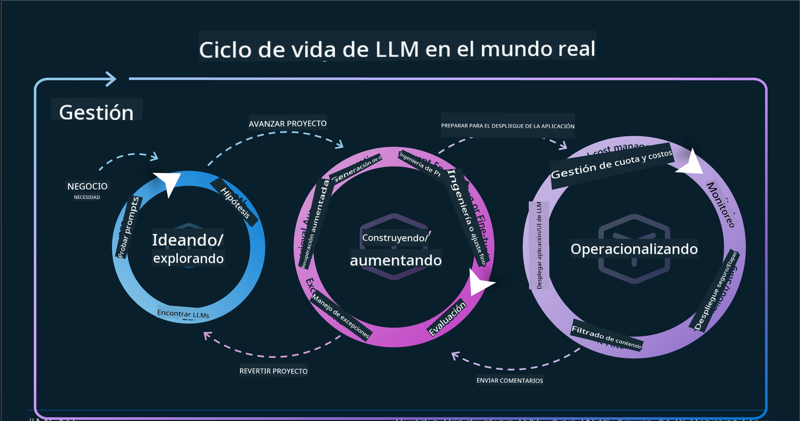
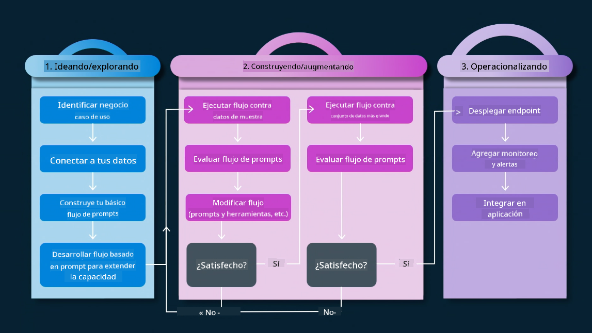

<!--
CO_OP_TRANSLATOR_METADATA:
{
  "original_hash": "27a5347a5022d5ef0a72ab029b03526a",
  "translation_date": "2025-07-09T15:46:41+00:00",
  "source_file": "14-the-generative-ai-application-lifecycle/README.md",
  "language_code": "es"
}
-->

# El ciclo de vida de las aplicaciones de IA generativa

Una pregunta importante para todas las aplicaciones de IA es la relevancia de las funciones de IA, ya que es un campo que evoluciona rápidamente. Para asegurar que tu aplicación siga siendo relevante, confiable y robusta, necesitas monitorearla, evaluarla y mejorarla de forma continua. Aquí es donde entra en juego el ciclo de vida de la IA generativa.

El ciclo de vida de la IA generativa es un marco que te guía a través de las etapas de desarrollo, despliegue y mantenimiento de una aplicación de IA generativa. Te ayuda a definir tus objetivos, medir tu desempeño, identificar tus desafíos e implementar soluciones. También te ayuda a alinear tu aplicación con los estándares éticos y legales de tu dominio y tus interesados. Siguiendo el ciclo de vida de la IA generativa, puedes asegurarte de que tu aplicación siempre entregue valor y satisfaga a tus usuarios.

## Introducción

En este capítulo, aprenderás a:

- Entender el cambio de paradigma de MLOps a LLMOps
- El ciclo de vida de LLM
- Herramientas para el ciclo de vida
- Métricas y evaluación del ciclo de vida

## Entender el cambio de paradigma de MLOps a LLMOps

Los LLMs son una nueva herramienta en el arsenal de la Inteligencia Artificial, son increíblemente poderosos en tareas de análisis y generación para aplicaciones, sin embargo, este poder tiene algunas consecuencias en cómo optimizamos las tareas de IA y Aprendizaje Automático clásico.

Por ello, necesitamos un nuevo paradigma para adaptar esta herramienta de forma dinámica, con los incentivos correctos. Podemos categorizar las aplicaciones de IA antiguas como "ML Apps" y las aplicaciones de IA más recientes como "GenAI Apps" o simplemente "AI Apps", reflejando la tecnología y técnicas predominantes en cada época. Esto cambia nuestra narrativa en varios aspectos, observa la siguiente comparación.

Fíjate que en LLMOps, nos enfocamos más en los desarrolladores de aplicaciones, usando integraciones como punto clave, utilizando "Modelos como Servicio" y pensando en los siguientes puntos para las métricas.

- Calidad: Calidad de la respuesta
- Daño: IA responsable
- Honestidad: Fundamentación de la respuesta (¿Tiene sentido? ¿Es correcta?)
- Costo: Presupuesto de la solución
- Latencia: Tiempo promedio para la respuesta de un token

## El ciclo de vida de LLM

Primero, para entender el ciclo de vida y sus modificaciones, observa la siguiente infografía.

Como puedes notar, esto es diferente de los ciclos de vida habituales en MLOps. Los LLMs tienen muchos requisitos nuevos, como el prompting, diferentes técnicas para mejorar la calidad (Fine-Tuning, RAG, Meta-Prompts), diferentes evaluaciones y responsabilidades con la IA responsable, y finalmente, nuevas métricas de evaluación (Calidad, Daño, Honestidad, Costo y Latencia).

Por ejemplo, observa cómo ideamos. Usamos ingeniería de prompts para experimentar con varios LLMs y explorar posibilidades para probar si su hipótesis podría ser correcta.

Ten en cuenta que esto no es lineal, sino ciclos integrados, iterativos y con un ciclo general que los abarca.

¿Cómo podríamos explorar esos pasos? Vamos a detallar cómo construir un ciclo de vida.

Esto puede parecer un poco complicado, enfoquémonos primero en los tres grandes pasos.

1. Idear/Explorar: Exploración, aquí podemos explorar según las necesidades de nuestro negocio. Prototipar, crear un [PromptFlow](https://microsoft.github.io/promptflow/index.html?WT.mc_id=academic-105485-koreyst) y probar si es lo suficientemente eficiente para nuestra hipótesis.
1. Construir/Aumentar: Implementación, ahora empezamos a evaluar con conjuntos de datos más grandes, implementamos técnicas como Fine-tuning y RAG para comprobar la robustez de nuestra solución. Si no funciona, reimplementarla, añadir nuevos pasos en nuestro flujo o reestructurar los datos puede ayudar. Después de probar nuestro flujo y escala, si funciona y revisamos nuestras métricas, está listo para el siguiente paso.
1. Operacionalizar: Integración, ahora agregamos sistemas de monitoreo y alertas a nuestro sistema, despliegue e integración de la aplicación con nuestra aplicación.

Luego, tenemos el ciclo general de Gestión, enfocado en seguridad, cumplimiento y gobernanza.

¡Felicidades, ahora tienes tu aplicación de IA lista para funcionar y operativa! Para una experiencia práctica, echa un vistazo a la [Demostración de Contoso Chat.](https://nitya.github.io/contoso-chat/?WT.mc_id=academic-105485-koreys)

Ahora, ¿qué herramientas podríamos usar?

## Herramientas para el ciclo de vida

Para herramientas, Microsoft ofrece la [Plataforma Azure AI](https://azure.microsoft.com/solutions/ai/?WT.mc_id=academic-105485-koreys) y [PromptFlow](https://microsoft.github.io/promptflow/index.html?WT.mc_id=academic-105485-koreyst) que facilitan y hacen que tu ciclo sea fácil de implementar y listo para usar.

La [Plataforma Azure AI](https://azure.microsoft.com/solutions/ai/?WT.mc_id=academic-105485-koreys) te permite usar [AI Studio](https://ai.azure.com/?WT.mc_id=academic-105485-koreys). AI Studio es un portal web que te permite explorar modelos, ejemplos y herramientas. Gestionar tus recursos, flujos de desarrollo UI y opciones SDK/CLI para desarrollo Code-First.

Azure AI te permite usar múltiples recursos para gestionar tus operaciones, servicios, proyectos, búsqueda vectorial y necesidades de bases de datos.

Construye, desde pruebas de concepto (POC) hasta aplicaciones a gran escala con PromptFlow:

- Diseña y construye aplicaciones desde VS Code, con herramientas visuales y funcionales
- Prueba y ajusta tus aplicaciones para una IA de calidad, con facilidad.
- Usa Azure AI Studio para integrar e iterar con la nube, hacer push y desplegar para una integración rápida.

## ¡Genial! Continúa tu aprendizaje

Increíble, ahora aprende más sobre cómo estructuramos una aplicación para usar estos conceptos con la [Aplicación Contoso Chat](https://nitya.github.io/contoso-chat/?WT.mc_id=academic-105485-koreyst), para ver cómo Cloud Advocacy incorpora estos conceptos en demostraciones. Para más contenido, revisa nuestra [sesión de Ignite!](https://www.youtube.com/watch?v=DdOylyrTOWg)

Ahora, revisa la Lección 15, para entender cómo [Retrieval Augmented Generation y bases de datos vectoriales](../15-rag-and-vector-databases/README.md?WT.mc_id=academic-105485-koreyst) impactan la IA generativa y para crear aplicaciones más atractivas.

**Aviso legal**:  
Este documento ha sido traducido utilizando el servicio de traducción automática [Co-op Translator](https://github.com/Azure/co-op-translator). Aunque nos esforzamos por la precisión, tenga en cuenta que las traducciones automáticas pueden contener errores o inexactitudes. El documento original en su idioma nativo debe considerarse la fuente autorizada. Para información crítica, se recomienda la traducción profesional realizada por humanos. No nos hacemos responsables de malentendidos o interpretaciones erróneas derivadas del uso de esta traducción.