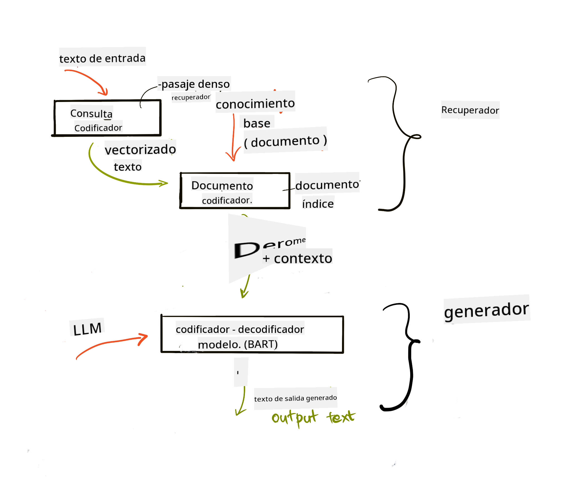
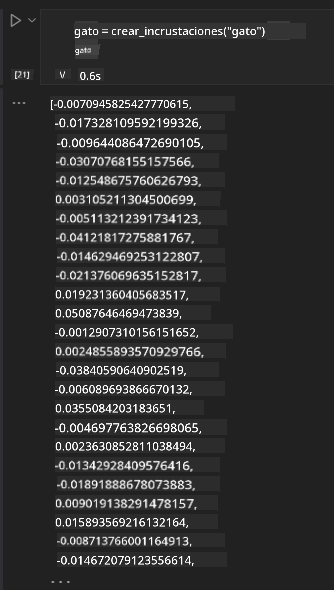

<!--
CO_OP_TRANSLATOR_METADATA:
{
  "original_hash": "e2861bbca91c0567ef32bc77fe054f9e",
  "translation_date": "2025-05-20T00:59:43+00:00",
  "source_file": "15-rag-and-vector-databases/README.md",
  "language_code": "es"
}
-->
# Generación Aumentada por Recuperación (RAG) y Bases de Datos Vectoriales

[](https://aka.ms/gen-ai-lesson15-gh?WT.mc_id=academic-105485-koreyst)

En la lección de aplicaciones de búsqueda, aprendimos brevemente cómo integrar tus propios datos en Modelos de Lenguaje Extenso (LLMs). En esta lección, profundizaremos en los conceptos de fundamentar tus datos en tu aplicación LLM, la mecánica del proceso y los métodos para almacenar datos, incluyendo tanto incrustaciones como texto.

> **Video Próximamente**

## Introducción

En esta lección cubriremos lo siguiente:

- Una introducción a RAG, qué es y por qué se utiliza en la inteligencia artificial (IA).

- Comprender qué son las bases de datos vectoriales y crear una para nuestra aplicación.

- Un ejemplo práctico de cómo integrar RAG en una aplicación.

## Objetivos de Aprendizaje

Después de completar esta lección, podrás:

- Explicar la importancia de RAG en la recuperación y procesamiento de datos.

- Configurar una aplicación RAG y fundamentar tus datos a un LLM

- Integración efectiva de RAG y Bases de Datos Vectoriales en Aplicaciones LLM.

## Nuestro Escenario: mejorando nuestros LLMs con nuestros propios datos

Para esta lección, queremos agregar nuestras propias notas a la startup educativa, lo que permite al chatbot obtener más información sobre los diferentes temas. Usando las notas que tenemos, los estudiantes podrán estudiar mejor y comprender los diferentes temas, facilitando la revisión para sus exámenes. Para crear nuestro escenario, utilizaremos:

- `Azure OpenAI:` el LLM que utilizaremos para crear nuestro chatbot

- `AI for beginners' lesson on Neural Networks`: estos serán los datos en los que fundamentaremos nuestro LLM

- `Azure AI Search` y `Azure Cosmos DB:` base de datos vectorial para almacenar nuestros datos y crear un índice de búsqueda

Los usuarios podrán crear cuestionarios de práctica a partir de sus notas, tarjetas de repaso y resumirlas en visiones generales concisas. Para comenzar, veamos qué es RAG y cómo funciona:

## Generación Aumentada por Recuperación (RAG)

Un chatbot potenciado por LLM procesa las indicaciones del usuario para generar respuestas. Está diseñado para ser interactivo y se involucra con los usuarios en una amplia gama de temas. Sin embargo, sus respuestas están limitadas al contexto proporcionado y sus datos de entrenamiento fundamentales. Por ejemplo, el límite de conocimiento de GPT-4 es septiembre de 2021, lo que significa que carece de conocimiento de eventos que han ocurrido después de este período. Además, los datos utilizados para entrenar los LLMs excluyen información confidencial como notas personales o el manual de productos de una empresa.

### Cómo funcionan los RAGs (Generación Aumentada por Recuperación)


Supongamos que quieres desplegar un chatbot que cree cuestionarios a partir de tus notas, necesitarás una conexión con la base de conocimiento. Aquí es donde RAG viene al rescate. Los RAGs operan de la siguiente manera:

- **Base de conocimiento:** Antes de la recuperación, estos documentos deben ser ingeridos y preprocesados, típicamente dividiendo documentos grandes en partes más pequeñas, transformándolos en incrustaciones de texto y almacenándolos en una base de datos.

- **Consulta del usuario:** el usuario hace una pregunta

- **Recuperación:** Cuando un usuario hace una pregunta, el modelo de incrustación recupera información relevante de nuestra base de conocimiento para proporcionar más contexto que se incorporará a la indicación.

- **Generación Aumentada:** el LLM mejora su respuesta basado en los datos recuperados. Permite que la respuesta generada no solo se base en datos pre-entrenados, sino también en información relevante del contexto agregado. Los datos recuperados se utilizan para aumentar las respuestas del LLM. Luego, el LLM devuelve una respuesta a la pregunta del usuario.



La arquitectura de los RAGs se implementa utilizando transformadores que constan de dos partes: un codificador y un decodificador. Por ejemplo, cuando un usuario hace una pregunta, el texto de entrada se 'codifica' en vectores que capturan el significado de las palabras y los vectores se 'decodifican' en nuestro índice de documentos y generan un nuevo texto basado en la consulta del usuario. El LLM utiliza tanto un modelo codificador-decodificador para generar la salida.

Dos enfoques al implementar RAG según el documento propuesto: [Generación Aumentada por Recuperación para Tareas de Procesamiento de Lenguaje Natural Intensivo en Conocimiento](https://arxiv.org/pdf/2005.11401.pdf?WT.mc_id=academic-105485-koreyst) son:

- **_RAG-Secuencia_** utilizando documentos recuperados para predecir la mejor respuesta posible a una consulta del usuario

- **RAG-Token** utilizando documentos para generar el siguiente token, luego recuperarlos para responder a la consulta del usuario

### ¿Por qué usarías RAGs? 

- **Riqueza de información:** asegura que las respuestas de texto estén actualizadas y sean actuales. Por lo tanto, mejora el rendimiento en tareas específicas del dominio al acceder a la base de conocimiento interna.

- Reduce la fabricación utilizando **datos verificables** en la base de conocimiento para proporcionar contexto a las consultas del usuario.

- Es **rentable** ya que son más económicos en comparación con el ajuste fino de un LLM

## Creación de una base de conocimiento

Nuestra aplicación se basa en nuestros datos personales, es decir, la lección de Redes Neuronales en el currículo de AI For Beginners.

### Bases de Datos Vectoriales

Una base de datos vectorial, a diferencia de las bases de datos tradicionales, es una base de datos especializada diseñada para almacenar, gestionar y buscar vectores incrustados. Almacena representaciones numéricas de documentos. Desglosar datos en incrustaciones numéricas facilita que nuestro sistema de IA entienda y procese los datos.

Almacenamos nuestras incrustaciones en bases de datos vectoriales ya que los LLMs tienen un límite en la cantidad de tokens que aceptan como entrada. Como no puedes pasar todas las incrustaciones a un LLM, necesitaremos dividirlas en partes y cuando un usuario haga una pregunta, las incrustaciones más parecidas a la pregunta se devolverán junto con la indicación. La división también reduce costos en el número de tokens que se pasan a través de un LLM.

Algunas bases de datos vectoriales populares incluyen Azure Cosmos DB, Clarifyai, Pinecone, Chromadb, ScaNN, Qdrant y DeepLake. Puedes crear un modelo de Azure Cosmos DB usando Azure CLI con el siguiente comando:

```bash
az login
az group create -n <resource-group-name> -l <location>
az cosmosdb create -n <cosmos-db-name> -r <resource-group-name>
az cosmosdb list-keys -n <cosmos-db-name> -g <resource-group-name>
```

### De texto a incrustaciones

Antes de almacenar nuestros datos, necesitaremos convertirlos en incrustaciones vectoriales antes de que se almacenen en la base de datos. Si estás trabajando con documentos grandes o textos largos, puedes dividirlos según las consultas que esperes. La división se puede hacer a nivel de oración o a nivel de párrafo. Dado que la división deriva significados de las palabras que los rodean, puedes agregar algún otro contexto a una parte, por ejemplo, agregando el título del documento o incluyendo algún texto antes o después de la parte. Puedes dividir los datos de la siguiente manera:

```python
def split_text(text, max_length, min_length):
    words = text.split()
    chunks = []
    current_chunk = []

    for word in words:
        current_chunk.append(word)
        if len(' '.join(current_chunk)) < max_length and len(' '.join(current_chunk)) > min_length:
            chunks.append(' '.join(current_chunk))
            current_chunk = []

    # If the last chunk didn't reach the minimum length, add it anyway
    if current_chunk:
        chunks.append(' '.join(current_chunk))

    return chunks
```

Una vez divididos, podemos incrustar nuestro texto usando diferentes modelos de incrustación. Algunos modelos que puedes usar incluyen: word2vec, ada-002 de OpenAI, Azure Computer Vision y muchos más. La selección de un modelo para usar dependerá de los idiomas que estés utilizando, el tipo de contenido codificado (texto/imágenes/audio), el tamaño de entrada que puede codificar y la longitud de la salida de la incrustación.

Un ejemplo de texto incrustado usando el modelo `text-embedding-ada-002` de OpenAI es:


## Recuperación y Búsqueda Vectorial

Cuando un usuario hace una pregunta, el recuperador la transforma en un vector usando el codificador de consultas, luego busca a través de nuestro índice de búsqueda de documentos vectores relevantes en el documento que están relacionados con la entrada. Una vez hecho, convierte tanto el vector de entrada como los vectores de documento en texto y lo pasa a través del LLM.

### Recuperación

La recuperación ocurre cuando el sistema intenta encontrar rápidamente los documentos del índice que satisfacen los criterios de búsqueda. El objetivo del recuperador es obtener documentos que se utilizarán para proporcionar contexto y fundamentar el LLM en tus datos.

Hay varias formas de realizar búsquedas dentro de nuestra base de datos, tales como:

- **Búsqueda por palabras clave** - utilizada para búsquedas de texto

- **Búsqueda semántica** - utiliza el significado semántico de las palabras

- **Búsqueda vectorial** - convierte documentos de texto a representaciones vectoriales usando modelos de incrustación. La recuperación se realizará consultando los documentos cuyas representaciones vectoriales estén más cerca de la pregunta del usuario.

- **Híbrida** - una combinación de búsqueda por palabras clave y búsqueda vectorial.

Un desafío con la recuperación surge cuando no hay una respuesta similar a la consulta en la base de datos, el sistema entonces devolverá la mejor información que pueda obtener, sin embargo, puedes usar tácticas como establecer la distancia máxima para la relevancia o usar una búsqueda híbrida que combine tanto palabras clave como búsqueda vectorial. En esta lección utilizaremos la búsqueda híbrida, una combinación de búsqueda vectorial y por palabras clave. Almacenaremos nuestros datos en un dataframe con columnas que contienen las partes así como las incrustaciones.

### Similitud Vectorial

El recuperador buscará en la base de datos de conocimiento incrustaciones que estén cerca, el vecino más cercano, ya que son textos similares. En el escenario en que un usuario hace una consulta, primero se incrusta y luego se empareja con incrustaciones similares. La medida común que se utiliza para encontrar cuán similares son diferentes vectores es la similitud coseno que se basa en el ángulo entre dos vectores.

Podemos medir la similitud usando otras alternativas como la distancia Euclidiana que es la línea recta entre los puntos finales de los vectores y el producto punto que mide la suma de los productos de los elementos correspondientes de dos vectores.

### Índice de búsqueda

Al realizar la recuperación, necesitaremos construir un índice de búsqueda para nuestra base de conocimiento antes de realizar la búsqueda. Un índice almacenará nuestras incrustaciones y podrá recuperar rápidamente las partes más similares incluso en una base de datos grande. Podemos crear nuestro índice localmente usando:

```python
from sklearn.neighbors import NearestNeighbors

embeddings = flattened_df['embeddings'].to_list()

# Create the search index
nbrs = NearestNeighbors(n_neighbors=5, algorithm='ball_tree').fit(embeddings)

# To query the index, you can use the kneighbors method
distances, indices = nbrs.kneighbors(embeddings)
```

### Reordenamiento

Una vez que hayas consultado la base de datos, es posible que necesites ordenar los resultados de los más relevantes. Un LLM de reordenamiento utiliza el aprendizaje automático para mejorar la relevancia de los resultados de búsqueda ordenándolos de los más relevantes. Usando Azure AI Search, el reordenamiento se realiza automáticamente para ti usando un reordenador semántico. Un ejemplo de cómo funciona el reordenamiento utilizando vecinos más cercanos:

```python
# Find the most similar documents
distances, indices = nbrs.kneighbors([query_vector])

index = []
# Print the most similar documents
for i in range(3):
    index = indices[0][i]
    for index in indices[0]:
        print(flattened_df['chunks'].iloc[index])
        print(flattened_df['path'].iloc[index])
        print(flattened_df['distances'].iloc[index])
    else:
        print(f"Index {index} not found in DataFrame")
```

## Integrándolo todo

El último paso es agregar nuestro LLM a la mezcla para poder obtener respuestas que estén fundamentadas en nuestros datos. Podemos implementarlo de la siguiente manera:

```python
user_input = "what is a perceptron?"

def chatbot(user_input):
    # Convert the question to a query vector
    query_vector = create_embeddings(user_input)

    # Find the most similar documents
    distances, indices = nbrs.kneighbors([query_vector])

    # add documents to query  to provide context
    history = []
    for index in indices[0]:
        history.append(flattened_df['chunks'].iloc[index])

    # combine the history and the user input
    history.append(user_input)

    # create a message object
    messages=[
        {"role": "system", "content": "You are an AI assistant that helps with AI questions."},
        {"role": "user", "content": history[-1]}
    ]

    # use chat completion to generate a response
    response = openai.chat.completions.create(
        model="gpt-4",
        temperature=0.7,
        max_tokens=800,
        messages=messages
    )

    return response.choices[0].message

chatbot(user_input)
```

## Evaluando nuestra aplicación

### Métricas de Evaluación

- Calidad de las respuestas proporcionadas asegurando que suene natural, fluido y humano

- Fundamentación de los datos: evaluando si la respuesta provino de los documentos proporcionados

- Relevancia: evaluando si la respuesta coincide y está relacionada con la pregunta hecha

- Fluidez - si la respuesta tiene sentido gramaticalmente

## Casos de Uso para utilizar RAG (Generación Aumentada por Recuperación) y bases de datos vectoriales

Hay muchos casos de uso diferentes donde las llamadas a funciones pueden mejorar tu aplicación como:

- Preguntas y Respuestas: fundamentando los datos de tu empresa a un chat que puede ser utilizado por los empleados para hacer preguntas.

- Sistemas de Recomendación: donde puedes crear un sistema que coincida con los valores más similares, por ejemplo, películas, restaurantes y muchos más.

- Servicios de Chatbot: puedes almacenar el historial de chat y personalizar la conversación basada en los datos del usuario.

- Búsqueda de imágenes basada en incrustaciones vectoriales, útil cuando se realiza reconocimiento de imágenes y detección de anomalías.

## Resumen

Hemos cubierto las áreas fundamentales de RAG desde agregar nuestros datos a la aplicación, la consulta del usuario y la salida. Para simplificar la creación de RAG, puedes usar marcos como Semanti Kernel, Langchain o Autogen.

## Tarea

Para continuar tu aprendizaje de Generación Aumentada por Recuperación (RAG) puedes construir:

- Construir un front-end para la aplicación usando el marco de tu elección

- Utilizar un marco, ya sea LangChain o Semantic Kernel, y recrear tu aplicación.

Felicitaciones por completar la lección 👏.

## El aprendizaje no se detiene aquí, continúa el viaje

Después de completar esta lección, revisa nuestra [colección de Aprendizaje de IA Generativa](https://aka.ms/genai-collection?WT.mc_id=academic-105485-koreyst) para seguir mejorando tus conocimientos de IA Generativa.

**Descargo de responsabilidad**:  
Este documento ha sido traducido utilizando el servicio de traducción automática [Co-op Translator](https://github.com/Azure/co-op-translator). Aunque nos esforzamos por lograr precisión, tenga en cuenta que las traducciones automáticas pueden contener errores o imprecisiones. El documento original en su idioma nativo debe considerarse la fuente autorizada. Para información crítica, se recomienda una traducción profesional humana. No nos hacemos responsables de malentendidos o interpretaciones erróneas que surjan del uso de esta traducción.