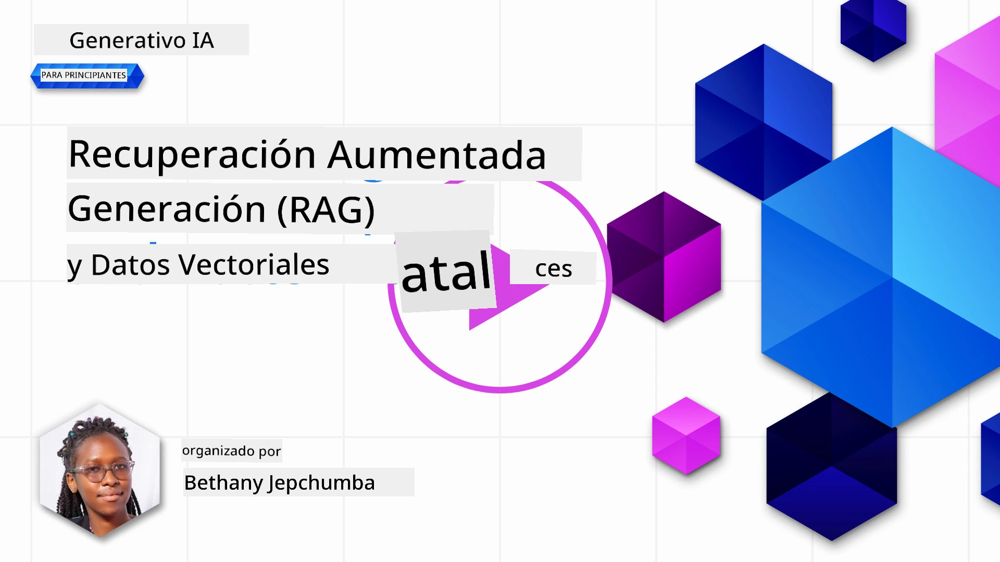
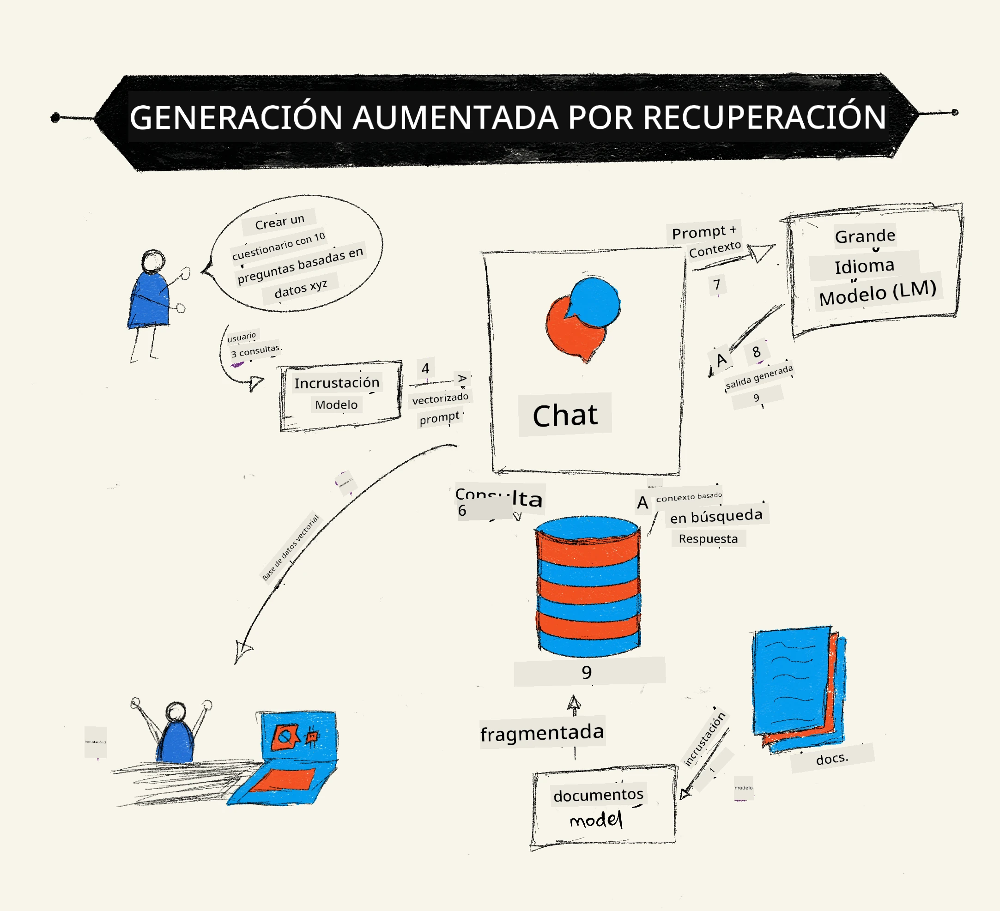
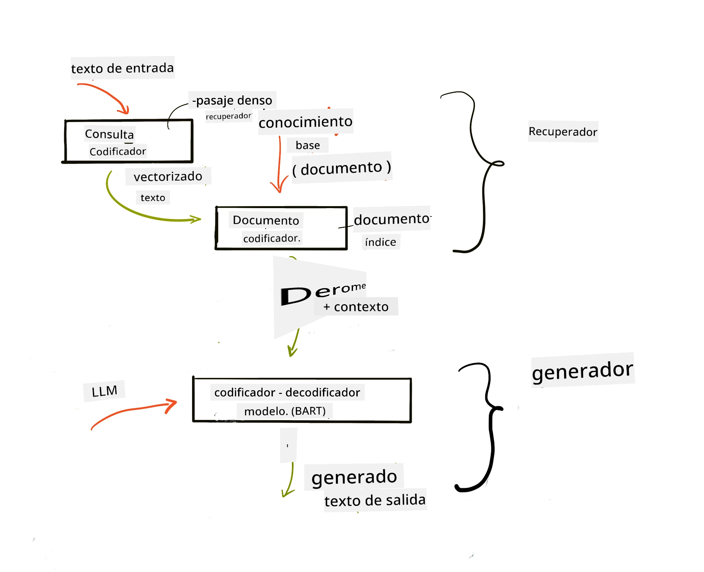

# Generación Aumentada por Recuperación (RAG) y Bases de Datos Vectoriales

[](https://youtu.be/4l8zhHUBeyI?si=BmvDmL1fnHtgQYkL)

En la lección sobre aplicaciones de búsqueda, aprendimos brevemente cómo integrar tus propios datos en Modelos de Lenguaje Extensos (LLMs). En esta lección, profundizaremos más en los conceptos de basar tus datos en la aplicación LLM, la mecánica del proceso y los métodos para almacenar datos, incluyendo tanto incrustaciones como texto.

> **Video Próximamente**

## Introducción

En esta lección cubriremos lo siguiente:

- Una introducción a RAG, qué es y por qué se usa en IA (inteligencia artificial).

- Entender qué son las bases de datos vectoriales y cómo crear una para nuestra aplicación.

- Un ejemplo práctico sobre cómo integrar RAG en una aplicación.

## Objetivos de Aprendizaje

Después de completar esta lección, serás capaz de:

- Explicar la importancia de RAG en la recuperación y procesamiento de datos.

- Configurar una aplicación RAG y basar tus datos en un LLM

- Integración efectiva de RAG y Bases de Datos Vectoriales en aplicaciones LLM.

## Nuestro Escenario: mejorar nuestros LLMs con nuestros propios datos

Para esta lección, queremos añadir nuestras propias notas a la startup educativa, lo que permite que el chatbot obtenga más información sobre los diferentes temas. Usando las notas que tenemos, los estudiantes podrán estudiar mejor y entender los diferentes temas, facilitando la revisión para sus exámenes. Para crear nuestro escenario, usaremos:

- `Azure OpenAI:` el LLM que usaremos para crear nuestro chatbot

- `Lección 'IA para principiantes' sobre Redes Neuronales`: estos serán los datos sobre los que basaremos nuestro LLM

- `Azure AI Search` y `Azure Cosmos DB:` base de datos vectorial para almacenar nuestros datos y crear un índice de búsqueda

Los usuarios podrán crear cuestionarios de práctica con sus notas, tarjetas de repaso y resumirlas en panoramas concisos. Para comenzar, veamos qué es RAG y cómo funciona:

## Generación Aumentada por Recuperación (RAG)

Un chatbot potenciado por LLM procesa indicaciones del usuario para generar respuestas. Está diseñado para ser interactivo y entablar conversaciones con usuarios sobre una amplia variedad de temas. Sin embargo, sus respuestas están limitadas al contexto proporcionado y a sus datos de entrenamiento fundamentales. Por ejemplo, el límite de conocimiento de GPT-4 es septiembre de 2021, lo que significa que carece de conocimiento de eventos que hayan ocurrido después de ese período. Además, los datos usados para entrenar LLMs excluyen información confidencial como notas personales o manuales de productos de una empresa.

### Cómo funcionan los RAG (Generación Aumentada por Recuperación)



Supongamos que quieres desplegar un chatbot que cree cuestionarios a partir de tus notas, necesitarás una conexión con la base de conocimiento. Aquí es donde RAG viene al rescate. Los RAG funcionan de la siguiente manera:

- **Base de conocimiento:** Antes de la recuperación, estos documentos necesitan ser ingeridos y preprocesados, usualmente dividiendo documentos grandes en fragmentos más pequeños, transformándolos en incrustaciones de texto y almacenándolos en una base de datos.

- **Consulta del usuario:** el usuario hace una pregunta

- **Recuperación:** Cuando un usuario hace una pregunta, el modelo de incrustación recupera información relevante de nuestra base de conocimiento para proporcionar más contexto que será incorporado en la indicación.

- **Generación aumentada:** el LLM mejora su respuesta basándose en los datos recuperados. Esto permite que la respuesta generada no solo se base en datos pre-entrenados sino también en información relevante del contexto añadido. Los datos recuperados se usan para aumentar las respuestas del LLM. Luego el LLM devuelve una respuesta a la pregunta del usuario.



La arquitectura para los RAG se implementa usando transformadores consistentes en dos partes: un codificador y un decodificador. Por ejemplo, cuando un usuario hace una pregunta, el texto de entrada es 'codificado' en vectores que capturan el significado de las palabras y los vectores son 'decodificados' en nuestro índice de documentos y generan nuevo texto basado en la consulta del usuario. El LLM usa un modelo codificador-decodificador para generar la salida.

Dos enfoques al implementar RAG según el artículo propuesto: [Retrieval-Augmented Generation for Knowledge intensive NLP (natural language processing software) Tasks](https://arxiv.org/pdf/2005.11401.pdf?WT.mc_id=academic-105485-koreyst) son:

- **_RAG-Sequence_** usando documentos recuperados para predecir la mejor respuesta posible a una consulta de usuario

- **RAG-Token** usando documentos para generar el siguiente token, luego recuperarlos para responder la consulta del usuario

### ¿Por qué usarías RAGs? 

- **Riqueza de información:** asegura que las respuestas en texto estén actualizadas y vigentes. Por lo tanto, mejora el rendimiento en tareas específicas de dominio accediendo a la base de conocimiento interna.

- Reduce la fabricación usando **datos verificables** en la base de conocimiento para proporcionar contexto a las consultas de los usuarios.

- Es **rentable** ya que son más económicos en comparación con el ajuste fino de un LLM

## Creando una base de conocimiento

Nuestra aplicación está basada en nuestros datos personales, es decir, la lección de Redes Neuronales del currículo AI For Beginners.

### Bases de Datos Vectoriales

Una base de datos vectorial, a diferencia de las bases de datos tradicionales, es una base de datos especializada diseñada para almacenar, gestionar y buscar vectores incrustados. Almacena representaciones numéricas de documentos. Dividir los datos en incrustaciones numéricas facilita que nuestro sistema de IA entienda y procese los datos.

Almacenamos nuestras incrustaciones en bases de datos vectoriales ya que los LLMs tienen un límite en la cantidad de tokens que aceptan como entrada. Como no puedes pasar todas las incrustaciones a un LLM, necesitaremos dividirlas en fragmentos y cuando un usuario hace una pregunta, las incrustaciones más parecidas a la pregunta serán devueltas junto con la indicación. Dividir en fragmentos también reduce costos en la cantidad de tokens pasados a través de un LLM.

Algunas bases de datos vectoriales populares incluyen Azure Cosmos DB, Clarifyai, Pinecone, Chromadb, ScaNN, Qdrant y DeepLake. Puedes crear un modelo Azure Cosmos DB usando Azure CLI con el siguiente comando:

```bash
az login
az group create -n <resource-group-name> -l <location>
az cosmosdb create -n <cosmos-db-name> -r <resource-group-name>
az cosmosdb list-keys -n <cosmos-db-name> -g <resource-group-name>
```

### De texto a incrustaciones

Antes de almacenar nuestros datos, necesitaremos convertirlos en incrustaciones vectoriales antes de almacenarlos en la base de datos. Si trabajas con documentos grandes o textos largos, puedes dividirlos basándote en las consultas que esperas. Dividir se puede hacer a nivel de oraciones o párrafos. Como dividir deriva significado de las palabras alrededor, puedes agregar otro contexto a un fragmento, por ejemplo, añadiendo el título del documento o incluyendo algo de texto antes o después del fragmento. Puedes dividir los datos de la siguiente manera:

```python
def split_text(text, max_length, min_length):
    words = text.split()
    chunks = []
    current_chunk = []

    for word in words:
        current_chunk.append(word)
        if len(' '.join(current_chunk)) < max_length and len(' '.join(current_chunk)) > min_length:
            chunks.append(' '.join(current_chunk))
            current_chunk = []

    # Si el último fragmento no alcanzó la longitud mínima, añádelo de todos modos
    if current_chunk:
        chunks.append(' '.join(current_chunk))

    return chunks
```

Una vez divididos, podemos incrustar nuestro texto usando diferentes modelos de incrustación. Algunos modelos que puedes usar incluyen: word2vec, ada-002 de OpenAI, Azure Computer Vision y muchos más. La selección de un modelo dependerá de los idiomas que uses, el tipo de contenido codificado (texto/imágenes/audio), el tamaño de entrada que puede codificar y longitud de la salida de la incrustación.

Un ejemplo de texto incrustado usando el modelo `text-embedding-ada-002` de OpenAI es:


## Recuperación y Búsqueda Vectorial

Cuando un usuario hace una pregunta, el recuperador la transforma en un vector usando el codificador de consultas, luego busca en nuestro índice de búsqueda de documentos vectores relevantes en el documento que están relacionados con la entrada. Una vez hecho, convierte tanto el vector de entrada como los vectores de documento a texto y lo pasa a través del LLM.

### Recuperación

La recuperación ocurre cuando el sistema intenta encontrar rápidamente los documentos del índice que satisfacen el criterio de búsqueda. El objetivo del recuperador es obtener documentos que serán usados para proporcionar contexto y basar el LLM en tus datos.

Hay varias maneras de realizar búsqueda dentro de nuestra base de datos como:

- **Búsqueda por palabra clave** - utilizado para búsquedas de texto

- **Búsqueda vectorial** - convierte documentos de texto a representaciones vectoriales usando modelos de incrustación, permitiendo una **búsqueda semántica** usando el significado de las palabras. La recuperación se realiza consultando los documentos cuyas representaciones vectoriales son las más cercanas a la pregunta del usuario.

- **Híbrida** - una combinación de búsqueda por palabra clave y búsqueda vectorial.

Un desafío con la recuperación ocurre cuando no hay una respuesta similar a la consulta en la base de datos, el sistema devolverá la mejor información que pueda obtener, sin embargo, puedes usar tácticas como configurar la distancia máxima para la relevancia o usar búsqueda híbrida que combina tanto búsqueda por palabra clave como búsqueda vectorial. En esta lección usaremos búsqueda híbrida, una combinación de búsqueda vectorial y por palabra clave. Almacenaremos nuestros datos en un dataframe con columnas que contienen los fragmentos así como las incrustaciones.

### Similitud Vectorial

El recuperador buscará en la base de conocimiento incrustaciones que estén cerca entre sí, los vecinos más cercanos, ya que son textos similares. En el escenario, cuando un usuario hace una consulta, primero se incrusta y luego se combina con incrustaciones similares. La medida común que se usa para encontrar cuán similares son diferentes vectores es la similitud del coseno que se basa en el ángulo entre dos vectores.

Podemos medir similitud usando otras alternativas como distancia euclidiana que es la línea recta entre los puntos finales del vector y producto punto que mide la suma de los productos de los elementos correspondientes de dos vectores.

### Índice de búsqueda

Cuando hacemos recuperación, necesitaremos construir un índice de búsqueda para nuestra base de conocimiento antes de realizar la búsqueda. Un índice almacenará nuestras incrustaciones y podrá recuperar rápidamente los fragmentos más similares incluso en una base de datos grande. Podemos crear nuestro índice localmente usando:

```python
from sklearn.neighbors import NearestNeighbors

embeddings = flattened_df['embeddings'].to_list()

# Crear el índice de búsqueda
nbrs = NearestNeighbors(n_neighbors=5, algorithm='ball_tree').fit(embeddings)

# Para consultar el índice, puedes usar el método kneighbors
distances, indices = nbrs.kneighbors(embeddings)
```

### Reordenamiento

Una vez que hayas consultado la base de datos, puede que necesites ordenar los resultados desde los más relevantes. Un LLM de reordenamiento utiliza aprendizaje automático para mejorar la relevancia de los resultados de búsqueda ordenándolos de los más relevantes. Usando Azure AI Search, el reordenamiento se realiza automáticamente para ti usando un reordenador semántico. Un ejemplo de cómo funciona el reordenamiento usando vecinos más cercanos:

```python
# Encuentra los documentos más similares
distances, indices = nbrs.kneighbors([query_vector])

index = []
# Imprime los documentos más similares
for i in range(3):
    index = indices[0][i]
    for index in indices[0]:
        print(flattened_df['chunks'].iloc[index])
        print(flattened_df['path'].iloc[index])
        print(flattened_df['distances'].iloc[index])
    else:
        print(f"Index {index} not found in DataFrame")
```

## Integrándolo todo

El último paso es añadir nuestro LLM a la mezcla para poder obtener respuestas que estén fundamentadas en nuestros datos. Podemos implementarlo de la siguiente manera:

```python
user_input = "what is a perceptron?"

def chatbot(user_input):
    # Convertir la pregunta en un vector de consulta
    query_vector = create_embeddings(user_input)

    # Encontrar los documentos más similares
    distances, indices = nbrs.kneighbors([query_vector])

    # añadir documentos a la consulta para proporcionar contexto
    history = []
    for index in indices[0]:
        history.append(flattened_df['chunks'].iloc[index])

    # combinar el historial y la entrada del usuario
    history.append(user_input)

    # crear un objeto de mensaje
    messages=[
        {"role": "system", "content": "You are an AI assistant that helps with AI questions."},
        {"role": "user", "content": "\n\n".join(history) }
    ]

    # usar la API de Respuestas para generar una respuesta
    response = client.responses.create(
        model="gpt-5-mini",
        max_output_tokens=800,
        input=messages,
        store=False,
    )

    return response.output_text

chatbot(user_input)
```

## Evaluando nuestra aplicación

### Métricas de Evaluación

- Calidad de las respuestas suministradas asegurando que suena natural, fluida y humana

- Fundamentación de los datos: evaluando si la respuesta proviene de los documentos suministrados

- Relevancia: evaluando que la respuesta coincide y está relacionada con la pregunta hecha

- Fluidez - si la respuesta tiene sentido gramaticalmente

## Casos de Uso para usar RAG (Generación Aumentada por Recuperación) y bases de datos vectoriales

Hay muchos casos de uso diferentes donde las llamadas a funciones pueden mejorar tu aplicación como:

- Preguntas y Respuestas: basar los datos de tu empresa en un chat que pueda ser usado por empleados para hacer preguntas.

- Sistemas de Recomendación: donde puedes crear un sistema que coincida con los valores más similares, por ejemplo, películas, restaurantes y muchos más.

- Servicios de chatbot: puedes almacenar el historial de chat y personalizar la conversación basado en los datos del usuario.

- Búsqueda de imágenes basada en incrustaciones vectoriales, útil para reconocimiento de imágenes y detección de anomalías.

## Resumen

Hemos cubierto las áreas fundamentales de RAG desde añadir nuestros datos a la aplicación, la consulta del usuario y la salida. Para simplificar la creación de RAG, puedes usar frameworks como Semantic Kernel, Langchain o Autogen.

## Tarea

Para continuar tu aprendizaje sobre Generación Aumentada por Recuperación (RAG) puedes construir:

- Construye una interfaz para la aplicación usando el framework de tu preferencia

- Utiliza un framework, ya sea LangChain o Semantic Kernel, y recrea tu aplicación.

Felicitaciones por completar la lección 👏.

## El aprendizaje no se detiene aquí, continúa el viaje

Después de completar esta lección, revisa nuestra [colección de aprendizaje de IA Generativa](https://aka.ms/genai-collection?WT.mc_id=academic-105485-koreyst) para seguir mejorando tu conocimiento en IA Generativa!

---

<!-- CO-OP TRANSLATOR DISCLAIMER START -->
**Descargo de responsabilidad**:
Este documento ha sido traducido utilizando el servicio de traducción automática [Co-op Translator](https://github.com/Azure/co-op-translator). Aunque nos esforzamos por la precisión, tenga en cuenta que las traducciones automatizadas pueden contener errores o inexactitudes. El documento original en su idioma nativo debe considerarse la fuente autorizada. Para información crítica, se recomienda una traducción profesional humana. No somos responsables de cualquier malentendido o interpretación errónea que surja del uso de esta traducción.
<!-- CO-OP TRANSLATOR DISCLAIMER END -->