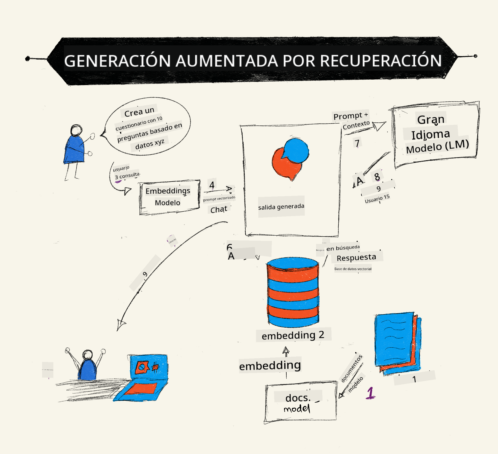
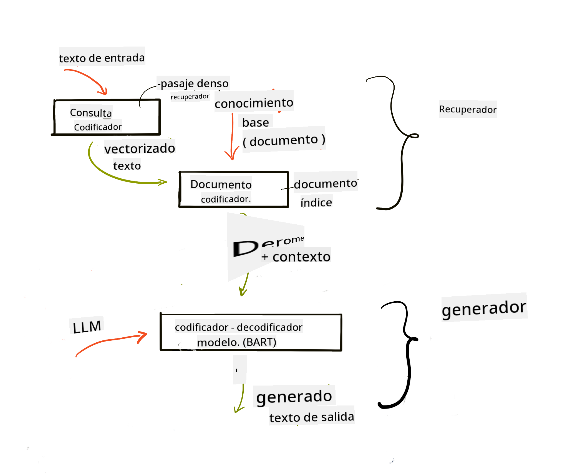

<!--
CO_OP_TRANSLATOR_METADATA:
{
  "original_hash": "b4b0266fbadbba7ded891b6485adc66d",
  "translation_date": "2025-10-17T22:47:55+00:00",
  "source_file": "15-rag-and-vector-databases/README.md",
  "language_code": "es"
}
-->
# Generación Aumentada por Recuperación (RAG) y Bases de Datos Vectoriales

[](https://youtu.be/4l8zhHUBeyI?si=BmvDmL1fnHtgQYkL)

En la lección sobre aplicaciones de búsqueda, aprendimos brevemente cómo integrar tus propios datos en los Modelos de Lenguaje Extenso (LLMs). En esta lección, profundizaremos en los conceptos de cómo fundamentar tus datos en tu aplicación de LLM, los mecanismos del proceso y los métodos para almacenar datos, incluyendo tanto embeddings como texto.

> **Video próximamente**

## Introducción

En esta lección cubriremos lo siguiente:

- Una introducción a RAG, qué es y por qué se utiliza en la inteligencia artificial (IA).

- Comprender qué son las bases de datos vectoriales y crear una para nuestra aplicación.

- Un ejemplo práctico sobre cómo integrar RAG en una aplicación.

## Objetivos de aprendizaje

Después de completar esta lección, serás capaz de:

- Explicar la importancia de RAG en la recuperación y procesamiento de datos.

- Configurar una aplicación RAG y fundamentar tus datos en un LLM.

- Integrar de manera efectiva RAG y bases de datos vectoriales en aplicaciones de LLM.

## Nuestro escenario: mejorar nuestros LLMs con nuestros propios datos

Para esta lección, queremos agregar nuestras propias notas a la startup educativa, lo que permitirá al chatbot obtener más información sobre los diferentes temas. Usando las notas que tenemos, los estudiantes podrán estudiar mejor y comprender los diferentes temas, facilitando la preparación para sus exámenes. Para crear nuestro escenario, utilizaremos:

- `Azure OpenAI:` el LLM que usaremos para crear nuestro chatbot.

- `Lección de AI para principiantes sobre Redes Neuronales:` estos serán los datos en los que fundamentaremos nuestro LLM.

- `Azure AI Search` y `Azure Cosmos DB:` base de datos vectorial para almacenar nuestros datos y crear un índice de búsqueda.

Los usuarios podrán crear cuestionarios de práctica a partir de sus notas, tarjetas de repaso y resúmenes concisos. Para comenzar, veamos qué es RAG y cómo funciona:

## Generación Aumentada por Recuperación (RAG)

Un chatbot impulsado por un LLM procesa las indicaciones del usuario para generar respuestas. Está diseñado para ser interactivo y entablar conversaciones con los usuarios sobre una amplia gama de temas. Sin embargo, sus respuestas están limitadas al contexto proporcionado y a los datos de entrenamiento fundamentales. Por ejemplo, el conocimiento de GPT-4 se corta en septiembre de 2021, lo que significa que carece de información sobre eventos ocurridos después de este período. Además, los datos utilizados para entrenar los LLMs excluyen información confidencial como notas personales o manuales de productos de una empresa.

### Cómo funcionan los RAGs (Generación Aumentada por Recuperación)



Supongamos que deseas implementar un chatbot que cree cuestionarios a partir de tus notas, necesitarás una conexión con la base de conocimiento. Aquí es donde RAG entra en acción. Los RAGs operan de la siguiente manera:

- **Base de conocimiento:** Antes de la recuperación, estos documentos deben ser ingeridos y preprocesados, generalmente dividiendo documentos grandes en fragmentos más pequeños, transformándolos en embeddings de texto y almacenándolos en una base de datos.

- **Consulta del usuario:** El usuario hace una pregunta.

- **Recuperación:** Cuando un usuario hace una pregunta, el modelo de embeddings recupera información relevante de nuestra base de conocimiento para proporcionar más contexto que se incorporará en la indicación.

- **Generación aumentada:** El LLM mejora su respuesta basándose en los datos recuperados. Esto permite que la respuesta generada no solo se base en datos preentrenados, sino también en información relevante del contexto añadido. Los datos recuperados se utilizan para aumentar las respuestas del LLM. Luego, el LLM devuelve una respuesta a la pregunta del usuario.



La arquitectura de los RAGs se implementa utilizando transformadores que constan de dos partes: un codificador y un decodificador. Por ejemplo, cuando un usuario hace una pregunta, el texto de entrada se 'codifica' en vectores que capturan el significado de las palabras y los vectores se 'decodifican' en nuestro índice de documentos y generan nuevo texto basado en la consulta del usuario. El LLM utiliza tanto un modelo codificador-decodificador para generar la salida.

Dos enfoques al implementar RAG según el artículo propuesto: [Generación Aumentada por Recuperación para Tareas de Procesamiento de Lenguaje Natural Intensivas en Conocimiento](https://arxiv.org/pdf/2005.11401.pdf?WT.mc_id=academic-105485-koreyst) son:

- **_RAG-Sequence_** utiliza documentos recuperados para predecir la mejor respuesta posible a una consulta del usuario.

- **RAG-Token** utiliza documentos para generar el siguiente token y luego los recupera para responder a la consulta del usuario.

### 쯇or qué usarías RAGs?

- **Riqueza de información:** asegura que las respuestas de texto estén actualizadas y sean actuales. Por lo tanto, mejora el rendimiento en tareas específicas de dominio al acceder a la base de conocimiento interna.

- Reduce la fabricación utilizando **datos verificables** en la base de conocimiento para proporcionar contexto a las consultas de los usuarios.

- Es **rentable** ya que son más económicos en comparación con el ajuste fino de un LLM.

## Creando una base de conocimiento

Nuestra aplicación se basa en nuestros datos personales, es decir, la lección sobre Redes Neuronales del currículo de AI para principiantes.

### Bases de datos vectoriales

Una base de datos vectorial, a diferencia de las bases de datos tradicionales, es una base de datos especializada diseñada para almacenar, gestionar y buscar vectores incrustados. Almacena representaciones numéricas de documentos. Descomponer los datos en embeddings numéricos facilita que nuestro sistema de IA comprenda y procese los datos.

Almacenamos nuestros embeddings en bases de datos vectoriales ya que los LLMs tienen un límite en la cantidad de tokens que aceptan como entrada. Como no puedes pasar todos los embeddings a un LLM, necesitaremos dividirlos en fragmentos y cuando un usuario haga una pregunta, los embeddings más similares a la pregunta se devolverán junto con la indicación. Dividir en fragmentos también reduce los costos en la cantidad de tokens que se pasan a través de un LLM.

Algunas bases de datos vectoriales populares incluyen Azure Cosmos DB, Clarifyai, Pinecone, Chromadb, ScaNN, Qdrant y DeepLake. Puedes crear un modelo de Azure Cosmos DB usando Azure CLI con el siguiente comando:

```bash
az login
az group create -n <resource-group-name> -l <location>
az cosmosdb create -n <cosmos-db-name> -r <resource-group-name>
az cosmosdb list-keys -n <cosmos-db-name> -g <resource-group-name>
```

### De texto a embeddings

Antes de almacenar nuestros datos, necesitaremos convertirlos en embeddings vectoriales antes de almacenarlos en la base de datos. Si estás trabajando con documentos grandes o textos largos, puedes dividirlos en fragmentos según las consultas que esperes. La división en fragmentos puede hacerse a nivel de oración o de párrafo. Como la división en fragmentos deriva significados de las palabras que los rodean, puedes agregar algo de contexto a un fragmento, por ejemplo, agregando el título del documento o incluyendo algo de texto antes o después del fragmento. Puedes dividir los datos de la siguiente manera:

```python
def split_text(text, max_length, min_length):
    words = text.split()
    chunks = []
    current_chunk = []

    for word in words:
        current_chunk.append(word)
        if len(' '.join(current_chunk)) < max_length and len(' '.join(current_chunk)) > min_length:
            chunks.append(' '.join(current_chunk))
            current_chunk = []

    # If the last chunk didn't reach the minimum length, add it anyway
    if current_chunk:
        chunks.append(' '.join(current_chunk))

    return chunks
```

Una vez divididos en fragmentos, podemos incrustar nuestro texto utilizando diferentes modelos de embeddings. Algunos modelos que puedes usar incluyen: word2vec, ada-002 de OpenAI, Azure Computer Vision y muchos más. Seleccionar un modelo dependerá de los idiomas que estés utilizando, el tipo de contenido codificado (texto/imágenes/audio), el tamaño de entrada que puede codificar y la longitud de la salida del embedding.

Un ejemplo de texto incrustado utilizando el modelo `text-embedding-ada-002` de OpenAI es:


## Recuperación y búsqueda vectorial

Cuando un usuario hace una pregunta, el recuperador la transforma en un vector utilizando el codificador de consultas, luego busca en nuestro índice de búsqueda de documentos los vectores relevantes en el documento que están relacionados con la entrada. Una vez hecho esto, convierte tanto el vector de entrada como los vectores de documentos en texto y los pasa a través del LLM.

### Recuperación

La recuperación ocurre cuando el sistema intenta encontrar rápidamente los documentos del índice que cumplen con los criterios de búsqueda. El objetivo del recuperador es obtener documentos que se utilizarán para proporcionar contexto y fundamentar el LLM en tus datos.

Hay varias formas de realizar búsquedas dentro de nuestra base de datos, como:

- **Búsqueda por palabras clave** - utilizada para búsquedas de texto.

- **Búsqueda semántica** - utiliza el significado semántico de las palabras.

- **Búsqueda vectorial** - convierte documentos de texto a representaciones vectoriales utilizando modelos de embeddings. La recuperación se realiza consultando los documentos cuyas representaciones vectoriales están más cerca de la pregunta del usuario.

- **Híbrida** - una combinación de búsqueda por palabras clave y búsqueda vectorial.

Un desafío con la recuperación surge cuando no hay una respuesta similar a la consulta en la base de datos, el sistema entonces devolverá la mejor información que pueda obtener. Sin embargo, puedes usar tácticas como establecer la distancia máxima para la relevancia o usar búsqueda híbrida que combine tanto palabras clave como búsqueda vectorial. En esta lección utilizaremos búsqueda híbrida, una combinación de búsqueda vectorial y por palabras clave. Almacenaremos nuestros datos en un dataframe con columnas que contengan los fragmentos así como los embeddings.

### Similitud vectorial

El recuperador buscará en la base de datos de conocimiento los embeddings que estén más cerca entre sí, el vecino más cercano, ya que son textos similares. En el escenario en que un usuario hace una consulta, primero se incrusta y luego se compara con embeddings similares. La medida común que se utiliza para encontrar cuán similares son diferentes vectores es la similitud de coseno, que se basa en el ángulo entre dos vectores.

Podemos medir la similitud utilizando otras alternativas como la distancia euclidiana, que es la línea recta entre los puntos finales de los vectores, y el producto punto, que mide la suma de los productos de los elementos correspondientes de dos vectores.

### Índice de búsqueda

Al realizar la recuperación, necesitaremos construir un índice de búsqueda para nuestra base de conocimiento antes de realizar la búsqueda. Un índice almacenará nuestros embeddings y podrá recuperar rápidamente los fragmentos más similares incluso en una base de datos grande. Podemos crear nuestro índice localmente utilizando:

```python
from sklearn.neighbors import NearestNeighbors

embeddings = flattened_df['embeddings'].to_list()

# Create the search index
nbrs = NearestNeighbors(n_neighbors=5, algorithm='ball_tree').fit(embeddings)

# To query the index, you can use the kneighbors method
distances, indices = nbrs.kneighbors(embeddings)
```

### Reordenamiento

Una vez que hayas consultado la base de datos, es posible que necesites ordenar los resultados desde los más relevantes. Un LLM de reordenamiento utiliza aprendizaje automático para mejorar la relevancia de los resultados de búsqueda ordenándolos desde los más relevantes. Usando Azure AI Search, el reordenamiento se realiza automáticamente utilizando un reordenador semántico. Un ejemplo de cómo funciona el reordenamiento utilizando vecinos más cercanos:

```python
# Find the most similar documents
distances, indices = nbrs.kneighbors([query_vector])

index = []
# Print the most similar documents
for i in range(3):
    index = indices[0][i]
    for index in indices[0]:
        print(flattened_df['chunks'].iloc[index])
        print(flattened_df['path'].iloc[index])
        print(flattened_df['distances'].iloc[index])
    else:
        print(f"Index {index} not found in DataFrame")
```

## Integrándolo todo

El último paso es agregar nuestro LLM a la mezcla para poder obtener respuestas fundamentadas en nuestros datos. Podemos implementarlo de la siguiente manera:

```python
user_input = "what is a perceptron?"

def chatbot(user_input):
    # Convert the question to a query vector
    query_vector = create_embeddings(user_input)

    # Find the most similar documents
    distances, indices = nbrs.kneighbors([query_vector])

    # add documents to query  to provide context
    history = []
    for index in indices[0]:
        history.append(flattened_df['chunks'].iloc[index])

    # combine the history and the user input
    history.append(user_input)

    # create a message object
    messages=[
        {"role": "system", "content": "You are an AI assistant that helps with AI questions."},
        {"role": "user", "content": history[-1]}
    ]

    # use chat completion to generate a response
    response = openai.chat.completions.create(
        model="gpt-4",
        temperature=0.7,
        max_tokens=800,
        messages=messages
    )

    return response.choices[0].message

chatbot(user_input)
```

## Evaluando nuestra aplicación

### Métricas de evaluación

- Calidad de las respuestas proporcionadas, asegurando que suenen naturales, fluidas y humanas.

- Fundamentación de los datos: evaluar si la respuesta proviene de los documentos proporcionados.

- Relevancia: evaluar si la respuesta coincide y está relacionada con la pregunta realizada.

- Fluidez: verificar si la respuesta tiene sentido gramaticalmente.

## Casos de uso para RAG (Generación Aumentada por Recuperación) y bases de datos vectoriales

Existen muchos casos de uso diferentes donde las llamadas a funciones pueden mejorar tu aplicación, como:

- Preguntas y respuestas: fundamentar los datos de tu empresa en un chat que los empleados puedan usar para hacer preguntas.

- Sistemas de recomendación: donde puedes crear un sistema que coincida con los valores más similares, por ejemplo, películas, restaurantes y muchos más.

- Servicios de chatbot: puedes almacenar el historial de chat y personalizar la conversación según los datos del usuario.

- Búsqueda de imágenes basada en embeddings vectoriales, útil para el reconocimiento de imágenes y la detección de anomalías.

## Resumen

Hemos cubierto las áreas fundamentales de RAG desde agregar nuestros datos a la aplicación, la consulta del usuario y la salida. Para simplificar la creación de RAG, puedes usar frameworks como Semantic Kernel, Langchain o Autogen.

## Tarea

Para continuar tu aprendizaje sobre Generación Aumentada por Recuperación (RAG) puedes:

- Crear una interfaz para la aplicación utilizando el framework de tu elección.

- Utilizar un framework, ya sea LangChain o Semantic Kernel, y recrear tu aplicación.

¡Felicidades por completar la lección 👏!

## El aprendizaje no termina aquí, continúa tu viaje

Después de completar esta lección, consulta nuestra [colección de aprendizaje de IA generativa](https://aka.ms/genai-collection?WT.mc_id=academic-105485-koreyst) para seguir ampliando tus conocimientos sobre IA generativa.

---

**Descargo de responsabilidad**:  
Este documento ha sido traducido utilizando el servicio de traducción automática [Co-op Translator](https://github.com/Azure/co-op-translator). Aunque nos esforzamos por lograr precisión, tenga en cuenta que las traducciones automáticas pueden contener errores o imprecisiones. El documento original en su idioma nativo debe considerarse la fuente autorizada. Para información crítica, se recomienda una traducción profesional realizada por humanos. No nos hacemos responsables de malentendidos o interpretaciones erróneas que surjan del uso de esta traducción.