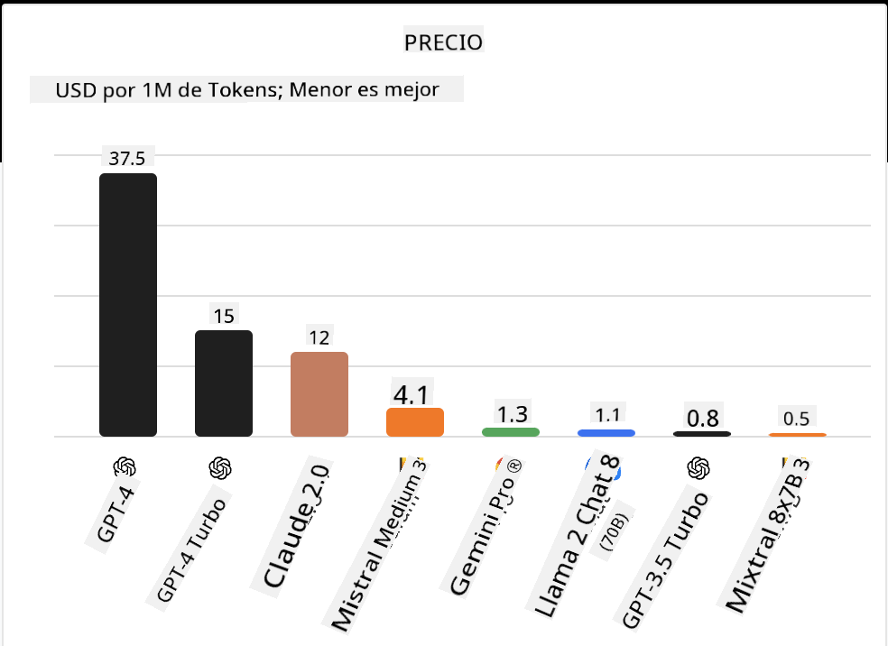
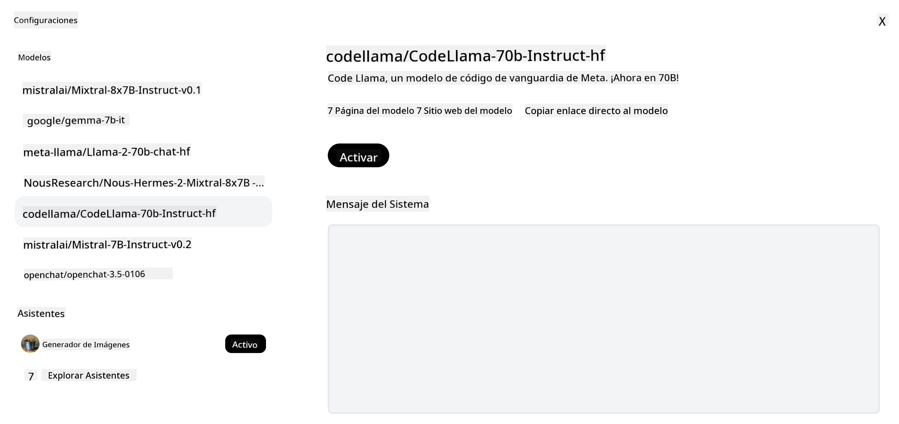

<!--
CO_OP_TRANSLATOR_METADATA:
{
  "original_hash": "0bba96e53ab841d99db731892a51fab8",
  "translation_date": "2025-05-20T06:45:48+00:00",
  "source_file": "16-open-source-models/README.md",
  "language_code": "es"
}
-->

## Introducción

El mundo de los LLMs de código abierto es emocionante y está en constante evolución. Esta lección tiene como objetivo proporcionar una visión detallada de los modelos de código abierto. Si buscas información sobre cómo los modelos propietarios se comparan con los modelos de código abierto, dirígete a la lección ["Explorando y Comparando Diferentes LLMs"](../02-exploring-and-comparing-different-llms/README.md?WT.mc_id=academic-105485-koreyst). Esta lección también cubrirá el tema del ajuste fino, pero una explicación más detallada se puede encontrar en la lección ["Ajuste Fino de LLMs"](../18-fine-tuning/README.md?WT.mc_id=academic-105485-koreyst).

## Objetivos de aprendizaje

- Obtener una comprensión de los Modelos de Código Abierto
- Comprender los beneficios de trabajar con Modelos de Código Abierto
- Explorar los modelos abiertos disponibles en Hugging Face y el Azure AI Studio

## ¿Qué son los Modelos de Código Abierto?

El software de código abierto ha jugado un papel crucial en el crecimiento de la tecnología en varios campos. La Iniciativa de Código Abierto (OSI) ha definido [10 criterios para el software](https://web.archive.org/web/20241126001143/https://opensource.org/osd?WT.mc_id=academic-105485-koreyst) para ser clasificado como código abierto. El código fuente debe ser compartido abiertamente bajo una licencia aprobada por la OSI.

Si bien el desarrollo de LLMs tiene elementos similares al desarrollo de software, el proceso no es exactamente el mismo. Esto ha generado mucha discusión en la comunidad sobre la definición de código abierto en el contexto de los LLMs. Para que un modelo esté alineado con la definición tradicional de código abierto, la siguiente información debería estar públicamente disponible:

- Conjuntos de datos utilizados para entrenar el modelo.
- Pesos completos del modelo como parte del entrenamiento.
- El código de evaluación.
- El código de ajuste fino.
- Pesos completos del modelo y métricas de entrenamiento.

Actualmente, solo hay unos pocos modelos que cumplen con estos criterios. El [modelo OLMo creado por el Instituto Allen para la Inteligencia Artificial (AllenAI)](https://huggingface.co/allenai/OLMo-7B?WT.mc_id=academic-105485-koreyst) es uno que encaja en esta categoría.

Para esta lección, nos referiremos a los modelos como "modelos abiertos" en adelante, ya que pueden no cumplir con los criterios anteriores en el momento de escribir esto.

## Beneficios de los Modelos Abiertos

**Altamente Personalizables** - Dado que los modelos abiertos se publican con información detallada de entrenamiento, los investigadores y desarrolladores pueden modificar los componentes internos del modelo. Esto permite la creación de modelos altamente especializados que están ajustados para una tarea o área de estudio específica. Algunos ejemplos de esto son la generación de código, operaciones matemáticas y biología.

**Costo** - El costo por token para usar y desplegar estos modelos es menor que el de los modelos propietarios. Al construir aplicaciones de IA Generativa, se debe considerar el rendimiento versus el precio al trabajar con estos modelos en tu caso de uso.

  
Fuente: Análisis Artificial

**Flexibilidad** - Trabajar con modelos abiertos te permite ser flexible en términos de usar diferentes modelos o combinarlos. Un ejemplo de esto es el [HuggingChat Assistants](https://huggingface.co/chat?WT.mc_id=academic-105485-koreyst) donde un usuario puede seleccionar el modelo que se está utilizando directamente en la interfaz de usuario:

## Explorando Diferentes Modelos Abiertos

### Llama 2

[LLama2](https://huggingface.co/meta-llama?WT.mc_id=academic-105485-koreyst), desarrollado por Meta, es un modelo abierto que está optimizado para aplicaciones basadas en chat. Esto se debe a su método de ajuste fino, que incluyó una gran cantidad de diálogo y retroalimentación humana. Con este método, el modelo produce más resultados alineados con las expectativas humanas, lo que proporciona una mejor experiencia de usuario.

Algunos ejemplos de versiones ajustadas de Llama incluyen [Japanese Llama](https://huggingface.co/elyza/ELYZA-japanese-Llama-2-7b?WT.mc_id=academic-105485-koreyst), que se especializa en japonés y [Llama Pro](https://huggingface.co/TencentARC/LLaMA-Pro-8B?WT.mc_id=academic-105485-koreyst), que es una versión mejorada del modelo base.

### Mistral

[Mistral](https://huggingface.co/mistralai?WT.mc_id=academic-105485-koreyst) es un modelo abierto con un fuerte enfoque en alto rendimiento y eficiencia. Utiliza el enfoque de Mixture-of-Experts que combina un grupo de modelos expertos especializados en un sistema donde, dependiendo de la entrada, se seleccionan ciertos modelos para ser utilizados. Esto hace que la computación sea más efectiva ya que los modelos solo abordan las entradas en las que están especializados.

Algunos ejemplos de versiones ajustadas de Mistral incluyen [BioMistral](https://huggingface.co/BioMistral/BioMistral-7B?text=Mon+nom+est+Thomas+et+mon+principal?WT.mc_id=academic-105485-koreyst), que se centra en el dominio médico y [OpenMath Mistral](https://huggingface.co/nvidia/OpenMath-Mistral-7B-v0.1-hf?WT.mc_id=academic-105485-koreyst), que realiza cálculos matemáticos.

### Falcon

[Falcon](https://huggingface.co/tiiuae?WT.mc_id=academic-105485-koreyst) es un LLM creado por el Instituto de Innovación Tecnológica (**TII**). El Falcon-40B fue entrenado con 40 mil millones de parámetros, lo que ha demostrado tener un mejor rendimiento que GPT-3 con menos presupuesto de cómputo. Esto se debe a su uso del algoritmo FlashAttention y la atención multi-consulta que le permite reducir los requisitos de memoria en el momento de la inferencia. Con este tiempo de inferencia reducido, el Falcon-40B es adecuado para aplicaciones de chat.

Algunos ejemplos de versiones ajustadas de Falcon son el [OpenAssistant](https://huggingface.co/OpenAssistant/falcon-40b-sft-top1-560?WT.mc_id=academic-105485-koreyst), un asistente construido sobre modelos abiertos y [GPT4ALL](https://huggingface.co/nomic-ai/gpt4all-falcon?WT.mc_id=academic-105485-koreyst), que ofrece un rendimiento superior al modelo base.

## Cómo Elegir

No hay una sola respuesta para elegir un modelo abierto. Un buen lugar para comenzar es utilizando la función de filtro por tarea del Azure AI Studio. Esto te ayudará a entender qué tipos de tareas ha sido entrenado el modelo. Hugging Face también mantiene un LLM Leaderboard que te muestra los modelos de mejor rendimiento basados en ciertos métricas.

Cuando busques comparar LLMs entre los diferentes tipos, [Artificial Analysis](https://artificialanalysis.ai/?WT.mc_id=academic-105485-koreyst) es otro gran recurso:

  
Fuente: Análisis Artificial

Si trabajas en un caso de uso específico, buscar versiones ajustadas que se centren en el mismo área puede ser efectivo. Experimentar con múltiples modelos abiertos para ver cómo se desempeñan según tus expectativas y las de tus usuarios es otra buena práctica.

## Próximos Pasos

La mejor parte de los modelos abiertos es que puedes comenzar a trabajar con ellos bastante rápido. Consulta el [Catálogo de Modelos de Azure AI Studio](https://ai.azure.com?WT.mc_id=academic-105485-koreyst), que presenta una colección específica de Hugging Face con estos modelos que discutimos aquí.

## El aprendizaje no se detiene aquí, continúa el Viaje

Después de completar esta lección, consulta nuestra [colección de Aprendizaje de IA Generativa](https://aka.ms/genai-collection?WT.mc_id=academic-105485-koreyst) para seguir mejorando tu conocimiento en IA Generativa.

**Descargo de responsabilidad**:  
Este documento ha sido traducido utilizando el servicio de traducción de IA [Co-op Translator](https://github.com/Azure/co-op-translator). Aunque nos esforzamos por lograr precisión, tenga en cuenta que las traducciones automáticas pueden contener errores o imprecisiones. El documento original en su idioma nativo debe considerarse la fuente autorizada. Para información crítica, se recomienda la traducción profesional humana. No somos responsables de ningún malentendido o interpretación errónea que surja del uso de esta traducción.