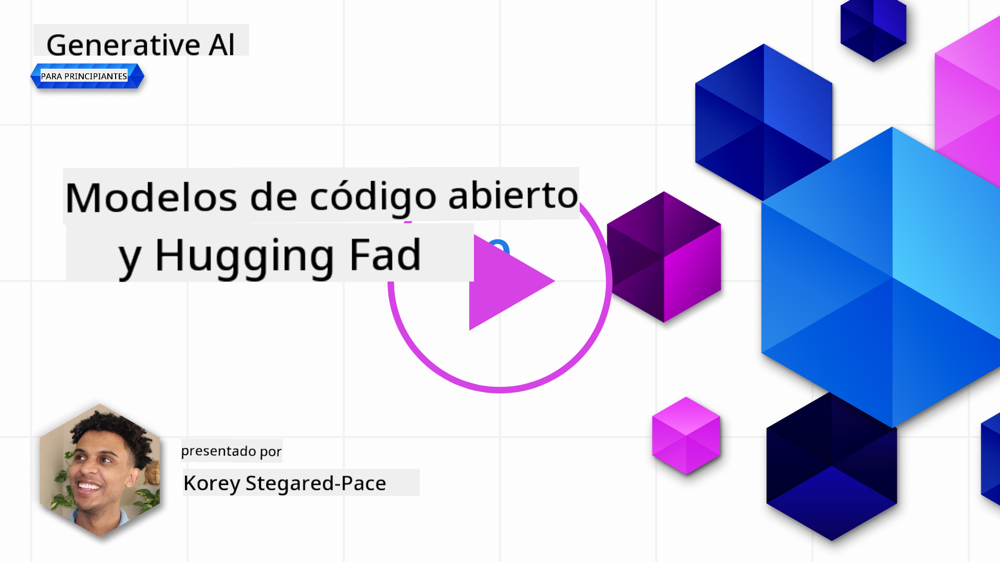

<!--
CO_OP_TRANSLATOR_METADATA:
{
  "original_hash": "0bba96e53ab841d99db731892a51fab8",
  "translation_date": "2025-07-09T17:03:05+00:00",
  "source_file": "16-open-source-models/README.md",
  "language_code": "es"
}
-->

## Introducción

El mundo de los LLMs de código abierto es emocionante y está en constante evolución. Esta lección tiene como objetivo ofrecer una visión profunda sobre los modelos de código abierto. Si buscas información sobre cómo se comparan los modelos propietarios con los de código abierto, dirígete a la lección ["Explorando y Comparando Diferentes LLMs"](../02-exploring-and-comparing-different-llms/README.md?WT.mc_id=academic-105485-koreyst). Esta lección también abordará el tema del fine-tuning, pero una explicación más detallada se encuentra en la lección ["Fine-Tuning LLMs"](../18-fine-tuning/README.md?WT.mc_id=academic-105485-koreyst).

## Objetivos de aprendizaje

- Comprender qué son los modelos de código abierto  
- Entender los beneficios de trabajar con modelos de código abierto  
- Explorar los modelos abiertos disponibles en Hugging Face y Azure AI Studio  

## ¿Qué son los Modelos de Código Abierto?

El software de código abierto ha jugado un papel crucial en el crecimiento de la tecnología en diversos campos. La Open Source Initiative (OSI) ha definido [10 criterios para el software](https://web.archive.org/web/20241126001143/https://opensource.org/osd?WT.mc_id=academic-105485-koreyst) que debe cumplir para ser clasificado como código abierto. El código fuente debe compartirse abiertamente bajo una licencia aprobada por la OSI.

Aunque el desarrollo de LLMs comparte elementos con el desarrollo de software, el proceso no es exactamente el mismo. Esto ha generado mucha discusión en la comunidad sobre la definición de código abierto en el contexto de los LLMs. Para que un modelo se alinee con la definición tradicional de código abierto, la siguiente información debería estar disponible públicamente:

- Los conjuntos de datos usados para entrenar el modelo.  
- Los pesos completos del modelo como parte del entrenamiento.  
- El código de evaluación.  
- El código de fine-tuning.  
- Los pesos completos del modelo y las métricas de entrenamiento.  

Actualmente, solo hay unos pocos modelos que cumplen con estos criterios. El [modelo OLMo creado por Allen Institute for Artificial Intelligence (AllenAI)](https://huggingface.co/allenai/OLMo-7B?WT.mc_id=academic-105485-koreyst) es uno que encaja en esta categoría.

Para esta lección, nos referiremos a los modelos como "modelos abiertos" en adelante, ya que puede que no cumplan con los criterios anteriores al momento de escribir.

## Beneficios de los Modelos Abiertos

**Altamente Personalizables** - Dado que los modelos abiertos se publican con información detallada del entrenamiento, investigadores y desarrolladores pueden modificar el interior del modelo. Esto permite crear modelos altamente especializados y ajustados para una tarea o área de estudio específica. Algunos ejemplos son la generación de código, operaciones matemáticas y biología.

**Costo** - El costo por token para usar y desplegar estos modelos es menor que el de los modelos propietarios. Al construir aplicaciones de IA Generativa, es importante evaluar el rendimiento frente al precio al trabajar con estos modelos en tu caso de uso.

  
Fuente: Artificial Analysis

**Flexibilidad** - Trabajar con modelos abiertos te permite ser flexible en cuanto al uso de diferentes modelos o combinarlos. Un ejemplo de esto son los [Asistentes HuggingChat](https://huggingface.co/chat?WT.mc_id=academic-105485-koreyst), donde el usuario puede seleccionar el modelo que se usará directamente en la interfaz:

## Explorando Diferentes Modelos Abiertos

### Llama 2

[LLama2](https://huggingface.co/meta-llama?WT.mc_id=academic-105485-koreyst), desarrollado por Meta, es un modelo abierto optimizado para aplicaciones basadas en chat. Esto se debe a su método de fine-tuning, que incluyó una gran cantidad de diálogos y retroalimentación humana. Con este método, el modelo produce resultados más alineados con las expectativas humanas, lo que ofrece una mejor experiencia de usuario.

Algunos ejemplos de versiones fine-tuned de Llama incluyen [Japanese Llama](https://huggingface.co/elyza/ELYZA-japanese-Llama-2-7b?WT.mc_id=academic-105485-koreyst), que se especializa en japonés, y [Llama Pro](https://huggingface.co/TencentARC/LLaMA-Pro-8B?WT.mc_id=academic-105485-koreyst), que es una versión mejorada del modelo base.

### Mistral

[Mistral](https://huggingface.co/mistralai?WT.mc_id=academic-105485-koreyst) es un modelo abierto con un fuerte enfoque en alto rendimiento y eficiencia. Utiliza el enfoque Mixture-of-Experts, que combina un grupo de modelos expertos especializados en un solo sistema, donde dependiendo de la entrada, se seleccionan ciertos modelos para ser usados. Esto hace que el cálculo sea más efectivo, ya que los modelos solo procesan las entradas en las que están especializados.

Algunos ejemplos de versiones fine-tuned de Mistral incluyen [BioMistral](https://huggingface.co/BioMistral/BioMistral-7B?text=Mon+nom+est+Thomas+et+mon+principal?WT.mc_id=academic-105485-koreyst), que está enfocado en el dominio médico, y [OpenMath Mistral](https://huggingface.co/nvidia/OpenMath-Mistral-7B-v0.1-hf?WT.mc_id=academic-105485-koreyst), que realiza cálculos matemáticos.

### Falcon

[Falcon](https://huggingface.co/tiiuae?WT.mc_id=academic-105485-koreyst) es un LLM creado por el Technology Innovation Institute (**TII**). El Falcon-40B fue entrenado con 40 mil millones de parámetros y ha demostrado un mejor rendimiento que GPT-3 con un menor presupuesto computacional. Esto se debe a su uso del algoritmo FlashAttention y la atención multiquery, que le permite reducir los requisitos de memoria en tiempo de inferencia. Con este tiempo de inferencia reducido, el Falcon-40B es adecuado para aplicaciones de chat.

Algunos ejemplos de versiones fine-tuned de Falcon son [OpenAssistant](https://huggingface.co/OpenAssistant/falcon-40b-sft-top1-560?WT.mc_id=academic-105485-koreyst), un asistente construido sobre modelos abiertos, y [GPT4ALL](https://huggingface.co/nomic-ai/gpt4all-falcon?WT.mc_id=academic-105485-koreyst), que ofrece un rendimiento superior al modelo base.

## Cómo Elegir

No hay una única respuesta para elegir un modelo abierto. Un buen punto de partida es usar la función de filtro por tarea de Azure AI Studio. Esto te ayudará a entender para qué tipos de tareas ha sido entrenado el modelo. Hugging Face también mantiene un LLM Leaderboard que muestra los modelos con mejor rendimiento según ciertas métricas.

Si quieres comparar LLMs entre diferentes tipos, [Artificial Analysis](https://artificialanalysis.ai/?WT.mc_id=academic-105485-koreyst) es otro recurso excelente:

  
Fuente: Artificial Analysis

Si trabajas en un caso de uso específico, buscar versiones fine-tuned enfocadas en el mismo área puede ser efectivo. Experimentar con varios modelos abiertos para ver cómo se desempeñan según tus expectativas y las de tus usuarios es otra buena práctica.

## Próximos Pasos

Lo mejor de los modelos abiertos es que puedes empezar a trabajar con ellos bastante rápido. Revisa el [Catálogo de Modelos de Azure AI Studio](https://ai.azure.com?WT.mc_id=academic-105485-koreyst), que incluye una colección específica de Hugging Face con los modelos que discutimos aquí.

## El aprendizaje no termina aquí, continúa el viaje

Después de completar esta lección, explora nuestra [colección de aprendizaje de IA Generativa](https://aka.ms/genai-collection?WT.mc_id=academic-105485-koreyst) para seguir mejorando tus conocimientos en IA Generativa.

**Aviso legal**:  
Este documento ha sido traducido utilizando el servicio de traducción automática [Co-op Translator](https://github.com/Azure/co-op-translator). Aunque nos esforzamos por la precisión, tenga en cuenta que las traducciones automáticas pueden contener errores o inexactitudes. El documento original en su idioma nativo debe considerarse la fuente autorizada. Para información crítica, se recomienda la traducción profesional realizada por humanos. No nos hacemos responsables de malentendidos o interpretaciones erróneas derivadas del uso de esta traducción.