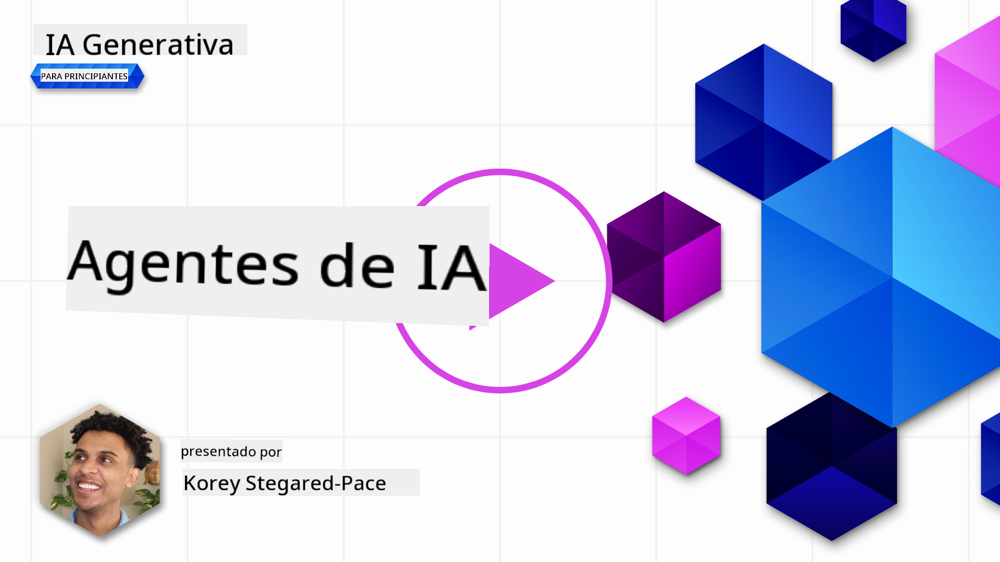
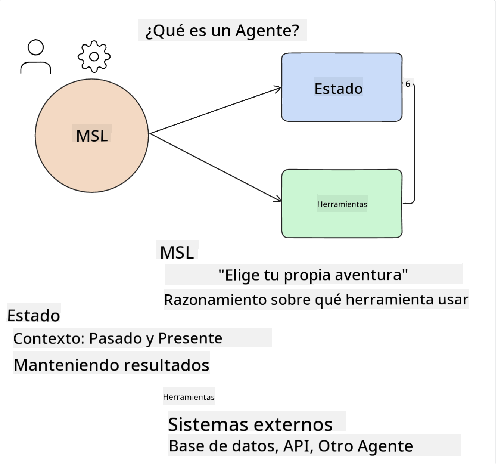
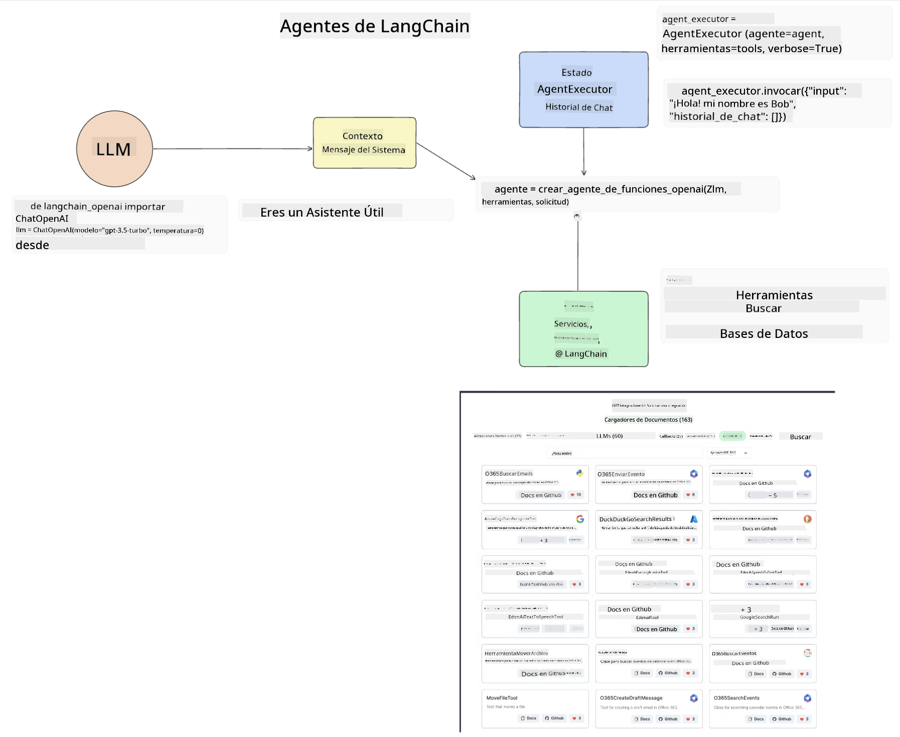
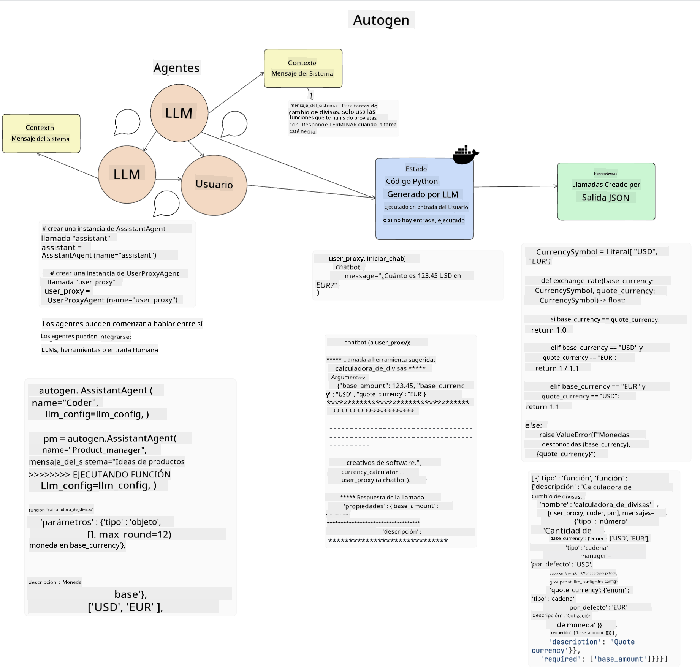
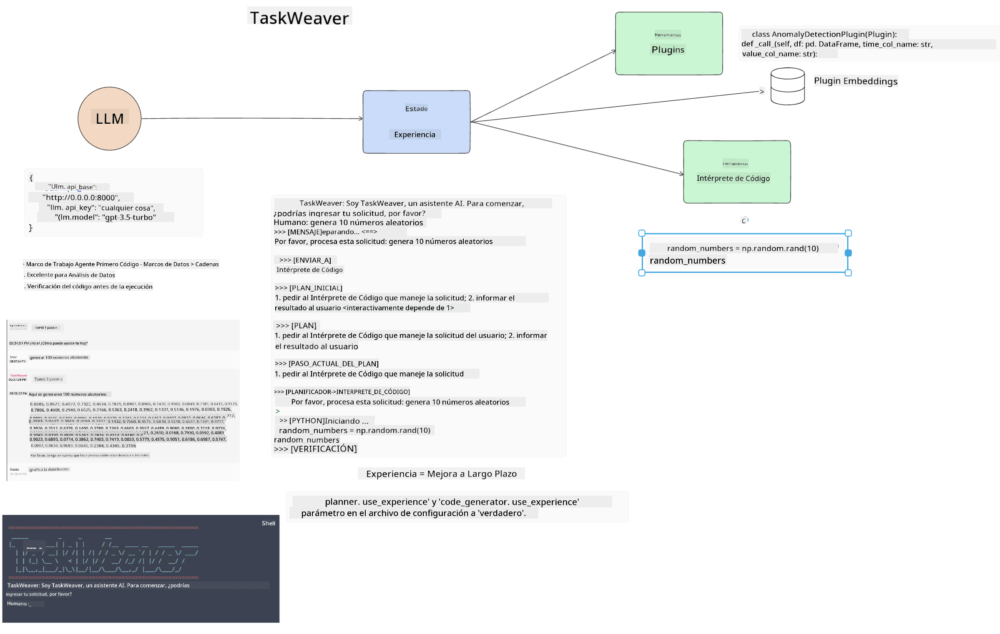
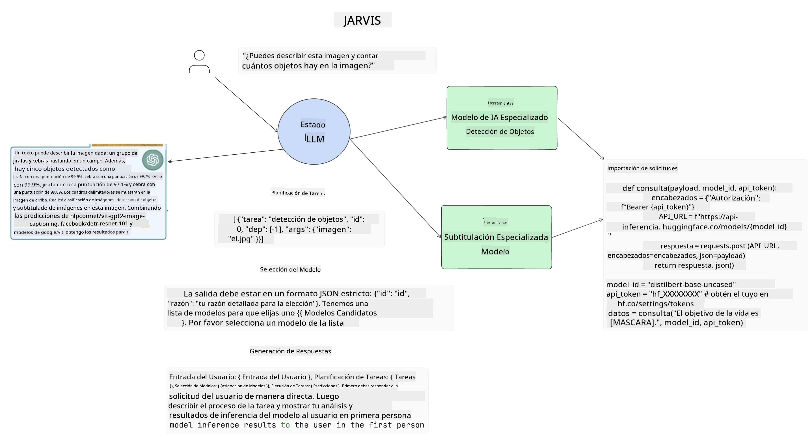

<!--
CO_OP_TRANSLATOR_METADATA:
{
  "original_hash": "8e8d1f6a63da606af7176a87ff8e92b6",
  "translation_date": "2025-10-17T22:52:15+00:00",
  "source_file": "17-ai-agents/README.md",
  "language_code": "es"
}
-->
[](https://youtu.be/yAXVW-lUINc?si=bOtW9nL6jc3XJgOM)

## Introducción

Los Agentes de IA representan un desarrollo emocionante en la IA Generativa, permitiendo que los Modelos de Lenguaje Extenso (LLMs) evolucionen de asistentes a agentes capaces de tomar acciones. Los marcos de trabajo de Agentes de IA permiten a los desarrolladores crear aplicaciones que proporcionan a los LLMs acceso a herramientas y gestión de estado. Estos marcos también mejoran la visibilidad, permitiendo a los usuarios y desarrolladores monitorear las acciones planificadas por los LLMs, mejorando así la gestión de la experiencia.

La lección cubrirá las siguientes áreas:

- Comprender qué es un Agente de IA - ¿Qué es exactamente un Agente de IA?
- Explorar cuatro marcos de trabajo diferentes de Agentes de IA - ¿Qué los hace únicos?
- Aplicar estos Agentes de IA a diferentes casos de uso - ¿Cuándo deberíamos usar Agentes de IA?

## Objetivos de aprendizaje

Después de tomar esta lección, podrás:

- Explicar qué son los Agentes de IA y cómo pueden ser utilizados.
- Tener una comprensión de las diferencias entre algunos de los marcos de trabajo populares de Agentes de IA y cómo se diferencian.
- Entender cómo funcionan los Agentes de IA para construir aplicaciones con ellos.

## ¿Qué son los Agentes de IA?

Los Agentes de IA son un campo muy emocionante en el mundo de la IA Generativa. Con esta emoción a veces viene una confusión de términos y su aplicación. Para mantener las cosas simples e inclusivas de la mayoría de las herramientas que se refieren a Agentes de IA, vamos a usar esta definición:

Los Agentes de IA permiten que los Modelos de Lenguaje Extenso (LLMs) realicen tareas al proporcionarles acceso a un **estado** y **herramientas**.



Definamos estos términos:

**Modelos de Lenguaje Extenso** - Estos son los modelos mencionados a lo largo de este curso, como GPT-3.5, GPT-4, Llama-2, etc.

**Estado** - Esto se refiere al contexto en el que el LLM está trabajando. El LLM utiliza el contexto de sus acciones pasadas y el contexto actual, guiando su toma de decisiones para acciones posteriores. Los marcos de trabajo de Agentes de IA permiten a los desarrolladores mantener este contexto más fácilmente.

**Herramientas** - Para completar la tarea que el usuario ha solicitado y que el LLM ha planificado, el LLM necesita acceso a herramientas. Algunos ejemplos de herramientas pueden ser una base de datos, una API, una aplicación externa o incluso otro LLM.

Estas definiciones deberían darte una buena base para avanzar mientras exploramos cómo se implementan. Vamos a explorar algunos marcos de trabajo de Agentes de IA:

## Agentes de LangChain

[LangChain Agents](https://python.langchain.com/docs/how_to/#agents?WT.mc_id=academic-105485-koreyst) es una implementación de las definiciones que proporcionamos anteriormente.

Para gestionar el **estado**, utiliza una función incorporada llamada `AgentExecutor`. Esta acepta el `agent` definido y las `tools` que están disponibles para él.

El `Agent Executor` también almacena el historial de chat para proporcionar el contexto del chat.



LangChain ofrece un [catálogo de herramientas](https://integrations.langchain.com/tools?WT.mc_id=academic-105485-koreyst) que pueden ser importadas a tu aplicación en la que el LLM puede obtener acceso. Estas son creadas por la comunidad y por el equipo de LangChain.

Puedes definir estas herramientas y pasarlas al `Agent Executor`.

La visibilidad es otro aspecto importante cuando se habla de Agentes de IA. Es importante para los desarrolladores de aplicaciones entender qué herramienta está utilizando el LLM y por qué. Para ello, el equipo de LangChain ha desarrollado LangSmith.

## AutoGen

El siguiente marco de trabajo de Agentes de IA que discutiremos es [AutoGen](https://microsoft.github.io/autogen/?WT.mc_id=academic-105485-koreyst). El enfoque principal de AutoGen son las conversaciones. Los agentes son tanto **conversables** como **personalizables**.

**Conversables -** Los LLMs pueden iniciar y continuar una conversación con otro LLM para completar una tarea. Esto se hace creando `AssistantAgents` y dándoles un mensaje de sistema específico.

```python

autogen.AssistantAgent( name="Coder", llm_config=llm_config, ) pm = autogen.AssistantAgent( name="Product_manager", system_message="Creative in software product ideas.", llm_config=llm_config, )

```

**Personalizables** - Los agentes pueden definirse no solo como LLMs, sino también como un usuario o una herramienta. Como desarrollador, puedes definir un `UserProxyAgent` que es responsable de interactuar con el usuario para obtener retroalimentación al completar una tarea. Esta retroalimentación puede continuar la ejecución de la tarea o detenerla.

```python
user_proxy = UserProxyAgent(name="user_proxy")
```

### Estado y Herramientas

Para cambiar y gestionar el estado, un agente asistente genera código Python para completar la tarea.

Aquí hay un ejemplo del proceso:



#### LLM Definido con un Mensaje de Sistema

```python
system_message="For weather related tasks, only use the functions you have been provided with. Reply TERMINATE when the task is done."
```

Este mensaje de sistema dirige a este LLM específico sobre qué funciones son relevantes para su tarea. Recuerda, con AutoGen puedes tener múltiples AssistantAgents definidos con diferentes mensajes de sistema.

#### El Chat es Iniciado por el Usuario

```python
user_proxy.initiate_chat( chatbot, message="I am planning a trip to NYC next week, can you help me pick out what to wear? ", )

```

Este mensaje del user_proxy (Humano) es lo que iniciará el proceso del Agente para explorar las posibles funciones que debería ejecutar.

#### La Función es Ejecutada

```bash
chatbot (to user_proxy):

***** Suggested tool Call: get_weather ***** Arguments: {"location":"New York City, NY","time_periond:"7","temperature_unit":"Celsius"} ******************************************************** --------------------------------------------------------------------------------

>>>>>>>> EXECUTING FUNCTION get_weather... user_proxy (to chatbot): ***** Response from calling function "get_weather" ***** 112.22727272727272 EUR ****************************************************************

```

Una vez que el chat inicial es procesado, el Agente enviará la herramienta sugerida para llamar. En este caso, es una función llamada `get_weather`. Dependiendo de tu configuración, esta función puede ser ejecutada automáticamente y leída por el Agente o puede ser ejecutada según la entrada del usuario.

Puedes encontrar una lista de [ejemplos de código de AutoGen](https://microsoft.github.io/autogen/docs/Examples/?WT.mc_id=academic-105485-koreyst) para explorar más cómo comenzar a construir.

## Taskweaver

El siguiente marco de trabajo de agentes que exploraremos es [Taskweaver](https://microsoft.github.io/TaskWeaver/?WT.mc_id=academic-105485-koreyst). Es conocido como un agente "orientado al código" porque, en lugar de trabajar estrictamente con `strings`, puede trabajar con DataFrames en Python. Esto resulta extremadamente útil para tareas de análisis y generación de datos. Esto puede incluir cosas como crear gráficos y tablas o generar números aleatorios.

### Estado y Herramientas

Para gestionar el estado de la conversación, TaskWeaver utiliza el concepto de un `Planner`. El `Planner` es un LLM que toma la solicitud de los usuarios y mapea las tareas que deben completarse para cumplir con esta solicitud.

Para completar las tareas, el `Planner` está expuesto a la colección de herramientas llamadas `Plugins`. Estos pueden ser clases de Python o un intérprete de código general. Estos plugins se almacenan como embeddings para que el LLM pueda buscar mejor el plugin correcto.



Aquí hay un ejemplo de un plugin para manejar la detección de anomalías:

```python
class AnomalyDetectionPlugin(Plugin): def __call__(self, df: pd.DataFrame, time_col_name: str, value_col_name: str):
```

El código es verificado antes de ejecutarse. Otra característica para gestionar el contexto en Taskweaver es la `experiencia`. La experiencia permite que el contexto de una conversación se almacene a largo plazo en un archivo YAML. Esto puede configurarse para que el LLM mejore con el tiempo en ciertas tareas dado que está expuesto a conversaciones previas.

## JARVIS

El último marco de trabajo de agentes que exploraremos es [JARVIS](https://github.com/microsoft/JARVIS?tab=readme-ov-file?WT.mc_id=academic-105485-koreyst). Lo que hace único a JARVIS es que utiliza un LLM para gestionar el `estado` de la conversación y las `herramientas` son otros modelos de IA. Cada uno de los modelos de IA son modelos especializados que realizan ciertas tareas como detección de objetos, transcripción o generación de descripciones de imágenes.



El LLM, siendo un modelo de propósito general, recibe la solicitud del usuario e identifica la tarea específica y cualquier argumento/dato necesario para completar la tarea.

```python
[{"task": "object-detection", "id": 0, "dep": [-1], "args": {"image": "e1.jpg" }}]
```

El LLM luego formatea la solicitud de manera que el modelo de IA especializado pueda interpretarla, como JSON. Una vez que el modelo de IA ha devuelto su predicción basada en la tarea, el LLM recibe la respuesta.

Si se requieren múltiples modelos para completar la tarea, también interpretará la respuesta de esos modelos antes de unirlas para generar la respuesta al usuario.

El ejemplo a continuación muestra cómo funcionaría esto cuando un usuario solicita una descripción y conteo de los objetos en una imagen:

## Tarea

Para continuar tu aprendizaje sobre Agentes de IA, puedes construir con AutoGen:

- Una aplicación que simule una reunión de negocios con diferentes departamentos de una startup educativa.
- Crear mensajes de sistema que guíen a los LLMs en la comprensión de diferentes personalidades y prioridades, y permitir al usuario presentar una nueva idea de producto.
- El LLM debería entonces generar preguntas de seguimiento de cada departamento para refinar y mejorar la presentación y la idea del producto.

## El aprendizaje no termina aquí, continúa el viaje

Después de completar esta lección, consulta nuestra [colección de aprendizaje de IA Generativa](https://aka.ms/genai-collection?WT.mc_id=academic-105485-koreyst) para seguir mejorando tus conocimientos sobre IA Generativa.

---

**Descargo de responsabilidad**:  
Este documento ha sido traducido utilizando el servicio de traducción automática [Co-op Translator](https://github.com/Azure/co-op-translator). Aunque nos esforzamos por lograr precisión, tenga en cuenta que las traducciones automáticas pueden contener errores o imprecisiones. El documento original en su idioma nativo debe considerarse la fuente autorizada. Para información crítica, se recomienda una traducción profesional realizada por humanos. No nos hacemos responsables de malentendidos o interpretaciones erróneas que surjan del uso de esta traducción.