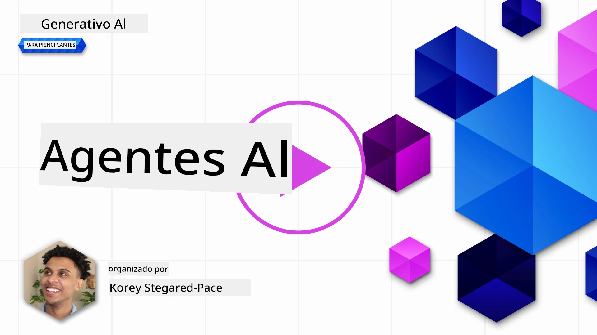
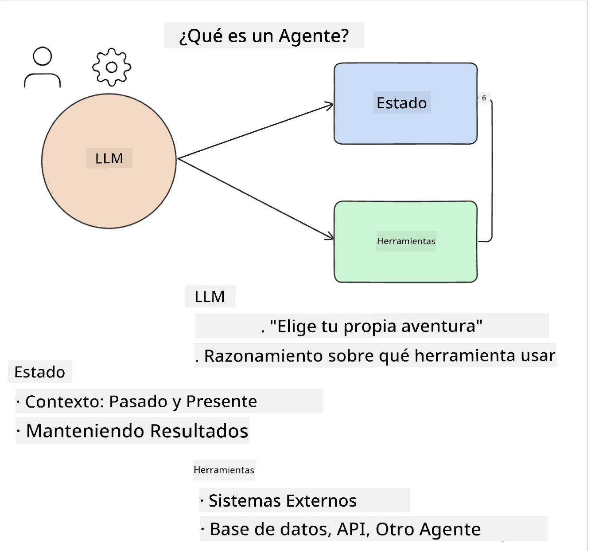
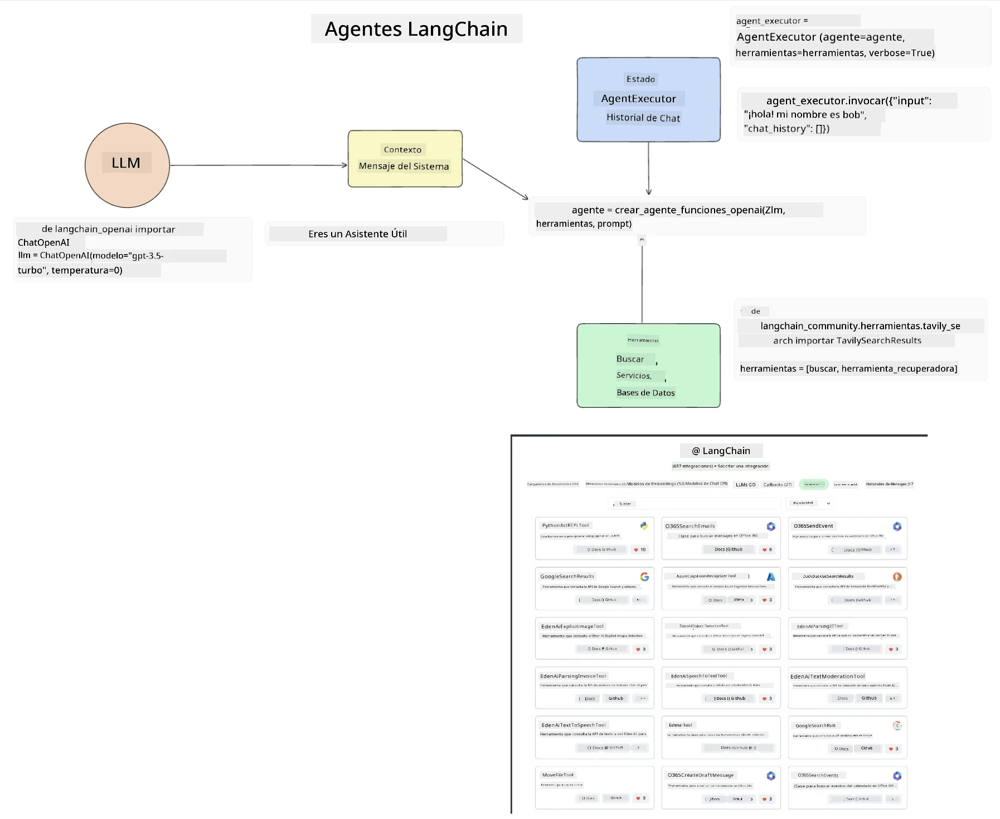
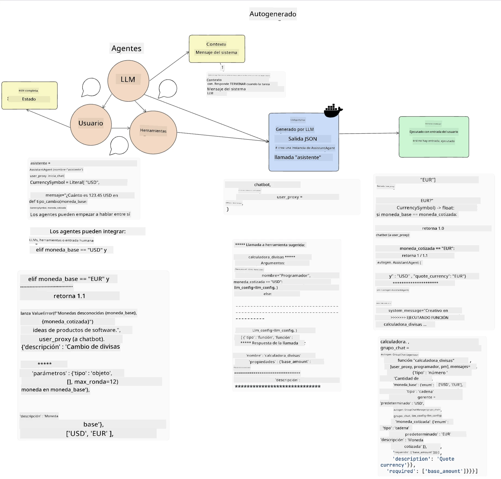
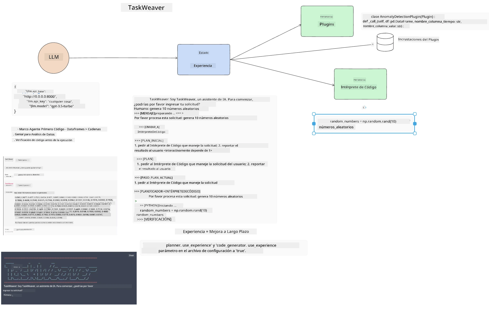

[](https://youtu.be/yAXVW-lUINc?si=bOtW9nL6jc3XJgOM)

## Introducción

Los Agentes de IA representan un desarrollo emocionante en la IA Generativa, que permite que los Modelos de Lenguaje Grandes (LLMs) evolucionen de asistentes a agentes capaces de tomar acciones. Los marcos de trabajo para Agentes de IA permiten a los desarrolladores crear aplicaciones que brindan a los LLM acceso a herramientas y gestión de estado. Estos marcos también mejoran la visibilidad, permitiendo a los usuarios y desarrolladores monitorear las acciones planificadas por los LLM, mejorando así la gestión de la experiencia.

La lección cubrirá las siguientes áreas:

- Comprender qué es un Agente de IA – ¿Qué es exactamente un Agente de IA?
- Explorar cuatro marcos diferentes de Agentes de IA – ¿Qué los hace únicos?
- Aplicar estos Agentes de IA a diferentes casos de uso – ¿Cuándo deberíamos usar Agentes de IA?

## Objetivos de aprendizaje

Después de tomar esta lección, podrás:

- Explicar qué son los Agentes de IA y cómo pueden ser usados.
- Tener una comprensión de las diferencias entre algunos de los marcos populares de Agentes de IA, y cómo difieren.
- Entender cómo funcionan los Agentes de IA para construir aplicaciones con ellos.

## ¿Qué son los Agentes de IA?

Los Agentes de IA son un campo muy emocionante en el mundo de la IA Generativa. Con esta emoción a veces viene la confusión de términos y su aplicación. Para mantener las cosas simples e incluir la mayoría de las herramientas que se refieren a Agentes de IA, usaremos esta definición:

Los Agentes de IA permiten que los Modelos de Lenguaje Grandes (LLMs) realicen tareas dándoles acceso a un **estado** y **herramientas**.



Definamos estos términos:

**Modelos de Lenguaje Grandes** – Estos son los modelos mencionados a lo largo de este curso, como GPT-3.5, GPT-4, Llama-2, etc.

**Estado** – Se refiere al contexto en el que el LLM está trabajando. El LLM usa el contexto de sus acciones pasadas y el contexto actual para guiar su toma de decisiones para acciones posteriores. Los marcos de Agentes de IA permiten a los desarrolladores mantener este contexto más fácilmente.

**Herramientas** – Para completar la tarea que el usuario ha solicitado y que el LLM ha planeado, el LLM necesita acceso a herramientas. Algunos ejemplos de herramientas pueden ser una base de datos, una API, una aplicación externa o incluso otro LLM.

Estas definiciones te darán una buena base a medida que exploremos cómo se implementan. Exploremos algunos marcos diferentes de Agentes de IA:

## Agentes LangChain

[LangChain Agents](https://python.langchain.com/docs/how_to/#agents?WT.mc_id=academic-105485-koreyst) es una implementación de las definiciones que mencionamos arriba.

Para gestionar el **estado**, usa una función incorporada llamada `AgentExecutor`. Esta acepta el `agent` definido y las `tools` disponibles para él.

El `Agent Executor` también almacena el historial del chat para proporcionar el contexto de la conversación.



LangChain ofrece un [catálogo de herramientas](https://integrations.langchain.com/tools?WT.mc_id=academic-105485-koreyst) que pueden ser importadas en tu aplicación para que el LLM tenga acceso a ellas. Estas son creadas por la comunidad y el equipo de LangChain.

Luego puedes definir estas herramientas y pasarlas al `Agent Executor`.

La visibilidad es otro aspecto importante al hablar de Agentes de IA. Es importante para los desarrolladores de aplicaciones entender qué herramienta está usando el LLM y por qué. Para ello, el equipo de LangChain ha desarrollado LangSmith.

## AutoGen

El siguiente marco de Agentes de IA que discutiremos es [AutoGen](https://microsoft.github.io/autogen/?WT.mc_id=academic-105485-koreyst). El enfoque principal de AutoGen es las conversaciones. Los agentes son tanto **conversables** como **personalizables**.

**Conversable -** Los LLMs pueden iniciar y continuar una conversación con otro LLM para completar una tarea. Esto se hace creando `AssistantAgents` y dándoles un mensaje del sistema específico.

```python

autogen.AssistantAgent( name="Coder", llm_config=llm_config, ) pm = autogen.AssistantAgent( name="Product_manager", system_message="Creative in software product ideas.", llm_config=llm_config, )

```

**Personalizable** - Los agentes pueden definirse no solo como LLMs sino también como un usuario o una herramienta. Como desarrollador, puedes definir un `UserProxyAgent` que es responsable de interactuar con el usuario para recibir retroalimentación en la ejecución de una tarea. Esta retroalimentación puede continuar con la ejecución de la tarea o detenerla.

```python
user_proxy = UserProxyAgent(name="user_proxy")
```

### Estado y Herramientas

Para cambiar y gestionar el estado, un agente asistente genera código Python para completar la tarea.

Aquí hay un ejemplo del proceso:



#### LLM Definido con un Mensaje del Sistema

```python
system_message="For weather related tasks, only use the functions you have been provided with. Reply TERMINATE when the task is done."
```

Este mensaje del sistema dirige a este LLM específico sobre qué funciones son relevantes para su tarea. Recuerda, con AutoGen puedes tener múltiples AssistantAgents definidos con diferentes mensajes del sistema.

#### La Conversación es Iniciada por el Usuario

```python
user_proxy.initiate_chat( chatbot, message="I am planning a trip to NYC next week, can you help me pick out what to wear? ", )

```

Este mensaje del user_proxy (Humano) es lo que iniciará el proceso del agente para explorar las posibles funciones que debería ejecutar.

#### Se Ejecuta la Función

```bash
chatbot (to user_proxy):

***** Suggested tool Call: get_weather ***** Arguments: {"location":"New York City, NY","time_periond:"7","temperature_unit":"Celsius"} ******************************************************** --------------------------------------------------------------------------------

>>>>>>>> EXECUTING FUNCTION get_weather... user_proxy (to chatbot): ***** Response from calling function "get_weather" ***** 112.22727272727272 EUR ****************************************************************

```

Una vez que el chat inicial es procesado, el agente enviará la herramienta sugerida para llamar. En este caso, es una función llamada `get_weather`. Dependiendo de tu configuración, esta función puede ser ejecutada automáticamente y leída por el agente o puede ejecutarse en base a la entrada del usuario.

Puedes encontrar una lista de [ejemplos de código AutoGen](https://microsoft.github.io/autogen/docs/Examples/?WT.mc_id=academic-105485-koreyst) para explorar más cómo comenzar a construir.

## Taskweaver

El siguiente marco de agentes que exploraremos es [Taskweaver](https://microsoft.github.io/TaskWeaver/?WT.mc_id=academic-105485-koreyst). Es conocido como un agente "code-first" porque en lugar de trabajar estrictamente con `strings`, puede trabajar con DataFrames en Python. Esto se vuelve extremadamente útil para tareas de análisis y generación de datos. Esto puede ser cosas como crear gráficos y diagramas o generar números aleatorios.

### Estado y Herramientas

Para gestionar el estado de la conversación, TaskWeaver usa el concepto de un `Planner`. El `Planner` es un LLM que toma la solicitud del usuario y mapea las tareas que necesitan completarse para cumplir con esa solicitud.

Para completar las tareas, el `Planner` tiene acceso a la colección de herramientas llamadas `Plugins`. Estos pueden ser clases de Python o un intérprete general de código. Estos plugins se almacenan como embeddings para que el LLM pueda buscar mejor el plugin adecuado.



Aquí hay un ejemplo de un plugin para manejar detección de anomalías:

```python
class AnomalyDetectionPlugin(Plugin): def __call__(self, df: pd.DataFrame, time_col_name: str, value_col_name: str):
```

El código es verificado antes de ejecutarse. Otra característica para gestionar el contexto en Taskweaver es la `experiencia`. La experiencia permite que el contexto de una conversación se almacene a largo plazo en un archivo YAML. Esto puede configurarse para que el LLM mejore con el tiempo en ciertas tareas dado que está expuesto a conversaciones anteriores.

## JARVIS

El último marco de agentes que exploraremos es [JARVIS](https://github.com/microsoft/JARVIS?tab=readme-ov-file&WT.mc_id=academic-105485-koreyst). Lo que hace único a JARVIS es que usa un LLM para gestionar el `estado` de la conversación y las `herramientas` son otros modelos de IA. Cada uno de estos modelos de IA es un modelo especializado que realiza ciertas tareas como detección de objetos, transcripción o generación de subtítulos para imágenes.


El LLM, siendo un modelo de propósito general, recibe la solicitud del usuario e identifica la tarea específica y cualquier argumento/dato que se necesite para completar la tarea.

```python
[{"task": "object-detection", "id": 0, "dep": [-1], "args": {"image": "e1.jpg" }}]
```

El LLM luego formatea la solicitud de una manera que el modelo especializado de IA pueda interpretar, como JSON. Una vez que el modelo de IA ha devuelto su predicción basada en la tarea, el LLM recibe la respuesta.

Si se requieren múltiples modelos para completar la tarea, también interpretará la respuesta de esos modelos antes de unirlas para generar la respuesta al usuario.

El ejemplo a continuación muestra cómo funcionaría esto cuando un usuario solicita una descripción y conteo de los objetos en una imagen:

## Asignación

Para continuar tu aprendizaje sobre los Agentes de IA puedes construir con AutoGen:

- Una aplicación que simule una reunión de negocios con diferentes departamentos de una startup educativa.
- Crear mensajes del sistema que guíen a los LLM en la comprensión de diferentes personas y prioridades, y permitan al usuario presentar una idea de nuevo producto.
- El LLM debe luego generar preguntas de seguimiento de cada departamento para refinar y mejorar la presentación y la idea del producto.

## El aprendizaje no termina aquí, continúa el viaje

Después de completar esta lección, revisa nuestra [colección de aprendizaje de IA Generativa](https://aka.ms/genai-collection?WT.mc_id=academic-105485-koreyst) para seguir elevando tu conocimiento en IA Generativa.

---

<!-- CO-OP TRANSLATOR DISCLAIMER START -->
**Descargo de responsabilidad**:
Este documento ha sido traducido utilizando el servicio de traducción automática [Co-op Translator](https://github.com/Azure/co-op-translator). Aunque nos esforzamos por lograr precisión, tenga en cuenta que las traducciones automatizadas pueden contener errores o inexactitudes. El documento original en su idioma nativo debe considerarse la fuente autorizada. Para información crítica, se recomienda una traducción profesional realizada por un humano. No nos hacemos responsables de cualquier malentendido o mala interpretación derivada del uso de esta traducción.
<!-- CO-OP TRANSLATOR DISCLAIMER END -->