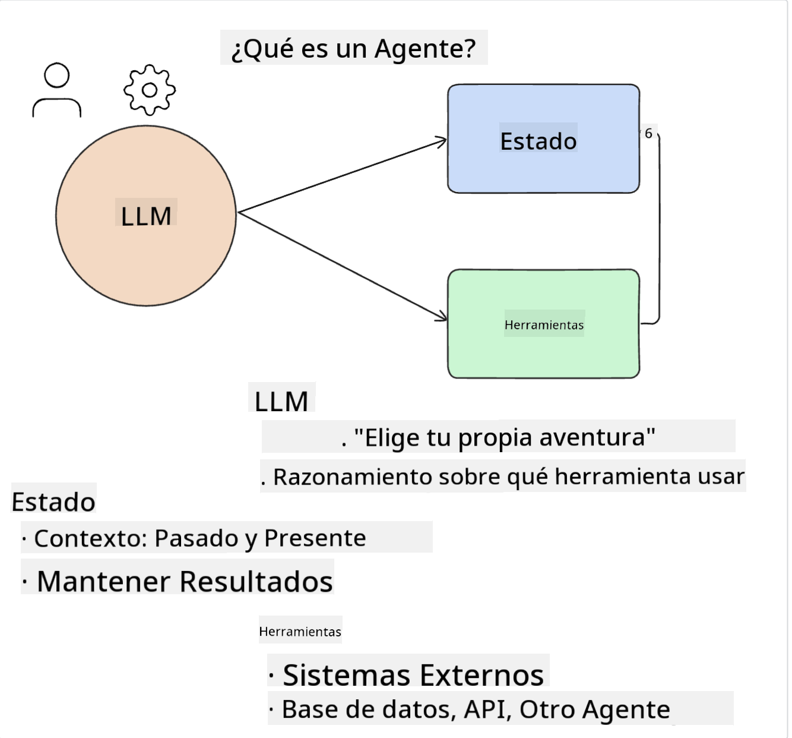
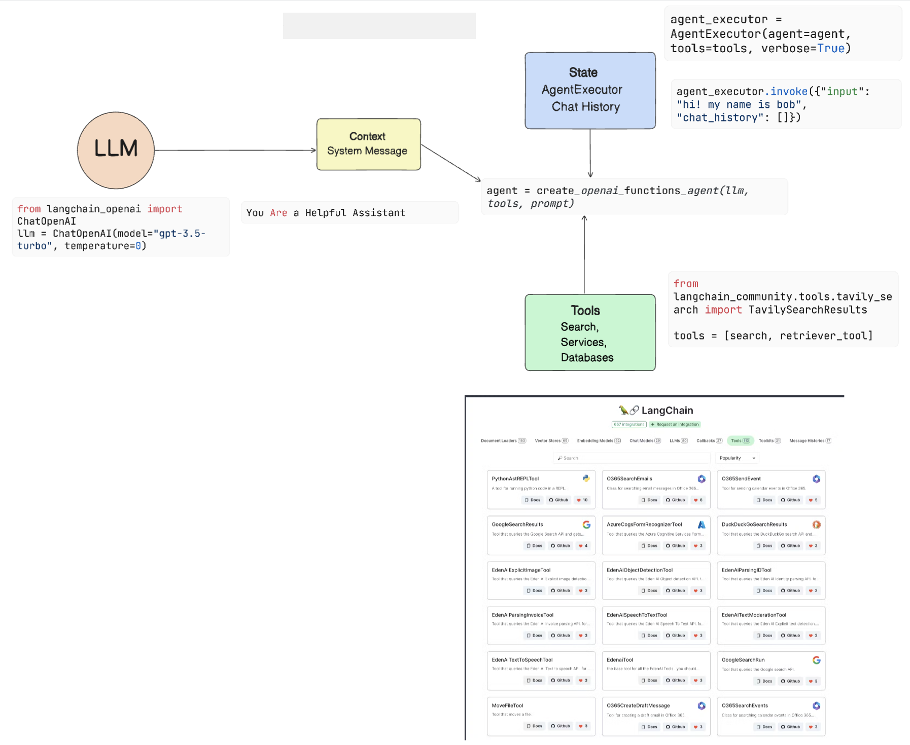
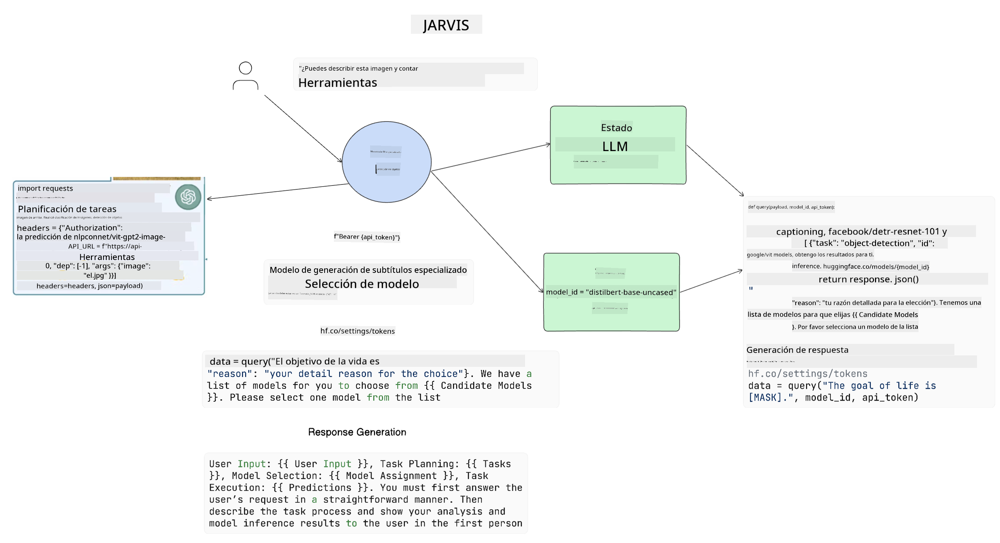

<!--
CO_OP_TRANSLATOR_METADATA:
{
  "original_hash": "11f03c81f190d9cbafd0f977dcbede6c",
  "translation_date": "2025-07-09T17:17:52+00:00",
  "source_file": "17-ai-agents/README.md",
  "language_code": "es"
}
-->
[](https://aka.ms/gen-ai-lesson17-gh?WT.mc_id=academic-105485-koreyst)

## Introducción

Los Agentes de IA representan un desarrollo emocionante en la IA Generativa, permitiendo que los Modelos de Lenguaje Grande (LLMs) evolucionen de asistentes a agentes capaces de tomar acciones. Los frameworks de Agentes de IA permiten a los desarrolladores crear aplicaciones que brindan a los LLMs acceso a herramientas y gestión de estado. Estos frameworks también mejoran la visibilidad, permitiendo a usuarios y desarrolladores monitorear las acciones planificadas por los LLMs, mejorando así la gestión de la experiencia.

La lección cubrirá las siguientes áreas:

- Entender qué es un Agente de IA - ¿Qué es exactamente un Agente de IA?
- Explorar cuatro frameworks diferentes de Agentes de IA - ¿Qué los hace únicos?
- Aplicar estos Agentes de IA a diferentes casos de uso - ¿Cuándo deberíamos usar Agentes de IA?

## Objetivos de aprendizaje

Después de tomar esta lección, podrás:

- Explicar qué son los Agentes de IA y cómo pueden ser usados.
- Tener una comprensión de las diferencias entre algunos de los frameworks populares de Agentes de IA y en qué se diferencian.
- Entender cómo funcionan los Agentes de IA para construir aplicaciones con ellos.

## ¿Qué son los Agentes de IA?

Los Agentes de IA son un campo muy emocionante en el mundo de la IA Generativa. Con esta emoción a veces surge confusión sobre los términos y su aplicación. Para mantenerlo simple e incluir la mayoría de las herramientas que se refieren a Agentes de IA, usaremos esta definición:

Los Agentes de IA permiten que los Modelos de Lenguaje Grande (LLMs) realicen tareas dándoles acceso a un **estado** y **herramientas**.



Definamos estos términos:

**Modelos de Lenguaje Grande** - Son los modelos mencionados a lo largo de este curso como GPT-3.5, GPT-4, Llama-2, etc.

**Estado** - Se refiere al contexto en el que el LLM está trabajando. El LLM usa el contexto de sus acciones pasadas y el contexto actual para guiar su toma de decisiones en acciones posteriores. Los frameworks de Agentes de IA facilitan a los desarrolladores mantener este contexto.

**Herramientas** - Para completar la tarea que el usuario ha solicitado y que el LLM ha planificado, el LLM necesita acceso a herramientas. Algunos ejemplos pueden ser una base de datos, una API, una aplicación externa o incluso otro LLM.

Estas definiciones te darán una buena base para avanzar mientras exploramos cómo se implementan. Veamos algunos frameworks diferentes de Agentes de IA:

## LangChain Agents

[LangChain Agents](https://python.langchain.com/docs/how_to/#agents?WT.mc_id=academic-105485-koreyst) es una implementación de las definiciones que proporcionamos arriba.

Para gestionar el **estado**, utiliza una función incorporada llamada `AgentExecutor`. Esta acepta el `agent` definido y las `tools` disponibles para él.

El `AgentExecutor` también almacena el historial de chat para proporcionar el contexto de la conversación.



LangChain ofrece un [catálogo de herramientas](https://integrations.langchain.com/tools?WT.mc_id=academic-105485-koreyst) que pueden ser importadas a tu aplicación y a las que el LLM puede acceder. Estas son creadas por la comunidad y por el equipo de LangChain.

Luego puedes definir estas herramientas y pasarlas al `AgentExecutor`.

La visibilidad es otro aspecto importante al hablar de Agentes de IA. Es fundamental que los desarrolladores de aplicaciones entiendan qué herramienta está usando el LLM y por qué. Para ello, el equipo de LangChain ha desarrollado LangSmith.

## AutoGen

El siguiente framework de Agentes de IA que discutiremos es [AutoGen](https://microsoft.github.io/autogen/?WT.mc_id=academic-105485-koreyst). El enfoque principal de AutoGen son las conversaciones. Los agentes son tanto **conversables** como **personalizables**.

**Conversables -** Los LLMs pueden iniciar y continuar una conversación con otro LLM para completar una tarea. Esto se hace creando `AssistantAgents` y dándoles un mensaje de sistema específico.

```python

autogen.AssistantAgent( name="Coder", llm_config=llm_config, ) pm = autogen.AssistantAgent( name="Product_manager", system_message="Creative in software product ideas.", llm_config=llm_config, )

```

**Personalizables** - Los agentes pueden definirse no solo como LLMs, sino también como un usuario o una herramienta. Como desarrollador, puedes definir un `UserProxyAgent` que es responsable de interactuar con el usuario para obtener retroalimentación en la realización de una tarea. Esta retroalimentación puede continuar la ejecución de la tarea o detenerla.

```python
user_proxy = UserProxyAgent(name="user_proxy")
```

### Estado y Herramientas

Para cambiar y gestionar el estado, un agente asistente genera código Python para completar la tarea.

Aquí hay un ejemplo del proceso:


#### LLM definido con un mensaje de sistema

```python
system_message="For weather related tasks, only use the functions you have been provided with. Reply TERMINATE when the task is done."
```

Este mensaje de sistema dirige a este LLM específico sobre qué funciones son relevantes para su tarea. Recuerda que con AutoGen puedes tener múltiples AssistantAgents definidos con diferentes mensajes de sistema.

#### El chat es iniciado por el usuario

```python
user_proxy.initiate_chat( chatbot, message="I am planning a trip to NYC next week, can you help me pick out what to wear? ", )

```

Este mensaje del user_proxy (Humano) es lo que iniciará el proceso del Agente para explorar las posibles funciones que debería ejecutar.

#### La función es ejecutada

```bash
chatbot (to user_proxy):

***** Suggested tool Call: get_weather ***** Arguments: {"location":"New York City, NY","time_periond:"7","temperature_unit":"Celsius"} ******************************************************** --------------------------------------------------------------------------------

>>>>>>>> EXECUTING FUNCTION get_weather... user_proxy (to chatbot): ***** Response from calling function "get_weather" ***** 112.22727272727272 EUR ****************************************************************

```

Una vez procesado el chat inicial, el Agente enviará la herramienta sugerida para llamar. En este caso, es una función llamada `get_weather`. Dependiendo de tu configuración, esta función puede ejecutarse automáticamente y ser leída por el Agente o puede ejecutarse según la entrada del usuario.

Puedes encontrar una lista de [ejemplos de código de AutoGen](https://microsoft.github.io/autogen/docs/Examples/?WT.mc_id=academic-105485-koreyst) para explorar más cómo empezar a construir.

## Taskweaver

El siguiente framework de agentes que exploraremos es [Taskweaver](https://microsoft.github.io/TaskWeaver/?WT.mc_id=academic-105485-koreyst). Es conocido como un agente "code-first" porque en lugar de trabajar estrictamente con `strings`, puede trabajar con DataFrames en Python. Esto es extremadamente útil para tareas de análisis y generación de datos. Esto puede incluir crear gráficos y diagramas o generar números aleatorios.

### Estado y Herramientas

Para gestionar el estado de la conversación, TaskWeaver usa el concepto de un `Planner`. El `Planner` es un LLM que toma la solicitud de los usuarios y mapea las tareas que deben completarse para cumplir con esta solicitud.

Para completar las tareas, el `Planner` tiene acceso a una colección de herramientas llamadas `Plugins`. Estos pueden ser clases de Python o un intérprete de código general. Estos plugins se almacenan como embeddings para que el LLM pueda buscar mejor el plugin correcto.


Aquí hay un ejemplo de un plugin para manejar la detección de anomalías:

```python
class AnomalyDetectionPlugin(Plugin): def __call__(self, df: pd.DataFrame, time_col_name: str, value_col_name: str):
```

El código se verifica antes de ejecutarse. Otra característica para gestionar el contexto en Taskweaver es la `experience`. La experiencia permite que el contexto de una conversación se almacene a largo plazo en un archivo YAML. Esto puede configurarse para que el LLM mejore con el tiempo en ciertas tareas, dado que se expone a conversaciones previas.

## JARVIS

El último framework de agentes que exploraremos es [JARVIS](https://github.com/microsoft/JARVIS?tab=readme-ov-file?WT.mc_id=academic-105485-koreyst). Lo que hace único a JARVIS es que usa un LLM para gestionar el `estado` de la conversación y las `tools` son otros modelos de IA. Cada uno de estos modelos de IA está especializado en realizar ciertas tareas como detección de objetos, transcripción o generación de descripciones de imágenes.



El LLM, siendo un modelo de propósito general, recibe la solicitud del usuario e identifica la tarea específica y cualquier argumento/dato necesario para completarla.

```python
[{"task": "object-detection", "id": 0, "dep": [-1], "args": {"image": "e1.jpg" }}]
```

Luego, el LLM formatea la solicitud de una manera que el modelo de IA especializado pueda interpretar, como JSON. Una vez que el modelo de IA devuelve su predicción basada en la tarea, el LLM recibe la respuesta.

Si se requieren múltiples modelos para completar la tarea, también interpretará las respuestas de esos modelos antes de combinarlas para generar la respuesta al usuario.

El siguiente ejemplo muestra cómo funcionaría esto cuando un usuario solicita una descripción y el conteo de objetos en una imagen:

## Tarea

Para continuar tu aprendizaje sobre Agentes de IA puedes construir con AutoGen:

- Una aplicación que simule una reunión de negocios con diferentes departamentos de una startup educativa.
- Crear mensajes de sistema que guíen a los LLMs para entender diferentes personajes y prioridades, y permitir al usuario presentar una nueva idea de producto.
- El LLM debería luego generar preguntas de seguimiento de cada departamento para refinar y mejorar la presentación y la idea del producto.

## El aprendizaje no termina aquí, continúa el viaje

Después de completar esta lección, revisa nuestra [colección de aprendizaje de IA Generativa](https://aka.ms/genai-collection?WT.mc_id=academic-105485-koreyst) para seguir mejorando tus conocimientos en IA Generativa.

**Aviso legal**:  
Este documento ha sido traducido utilizando el servicio de traducción automática [Co-op Translator](https://github.com/Azure/co-op-translator). Aunque nos esforzamos por la precisión, tenga en cuenta que las traducciones automáticas pueden contener errores o inexactitudes. El documento original en su idioma nativo debe considerarse la fuente autorizada. Para información crítica, se recomienda la traducción profesional realizada por humanos. No nos hacemos responsables de malentendidos o interpretaciones erróneas derivadas del uso de esta traducción.